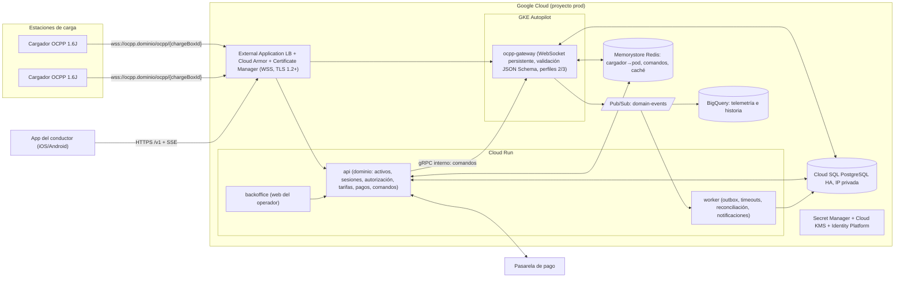

# Diseño del CSMS Volt Platform

**Documento de arquitectura y decisión para construir un Charging Station Management System (CSMS) propio, con los cargadores conectados por OCPP directamente a la plataforma, desplegado en Google Cloud, con una app de conductor separada.**

Fecha: 19 de septiembre de 2026. Repositorio destino: `volt-platform`. Estado: versión 2, revisada. Los siete capítulos técnicos pasaron una revisión independiente con verificación de fuentes; el estado de verificación está en la sección 11 de esta Parte I y el registro completo de correcciones en el Anexo A.

---

## Parte I. Resumen ejecutivo y guía de decisión

### 1. Respuestas directas a tus preguntas

**¿La app del conductor y el CSMS son dos cosas separadas o es lo mismo?**
Son componentes distintos de un mismo sistema. El CSMS es el backend: el gateway OCPP que mantiene las conexiones WebSocket con los cargadores, el dominio (activos, sesiones, autorización, tarifas, comandos, alarmas, pagos) y el back-office web del operador. La app del conductor es un cliente de la API pública de ese backend, igual que lo es el back-office. Comparten dominio, base de datos, identidad y eventos; no comparten código de interfaz ni protocolo: la app nunca habla OCPP, nunca contiene lógica de tarifas ni secretos, y nunca accede a la base de datos. Se desarrollan como proyectos separados (o como `apps/mobile` dentro del monorepo) contra un contrato de API versionado (`/v1`).

**¿Qué es el PDF que te compartió el proveedor?**
No es la especificación OCPP ni describe cómo hablar con los cargadores. Es la API REST de la nube del proveedor para "operadores" terceros: tu servidor llamaría a su plataforma (consultar conector, iniciar, detener, consultar orden) y su plataforma hablaría OCPP con el cargador. Como vas a construir esa nube tú mismo, ese documento deja de ser un contrato de integración. Queda solo como referencia de dominio (estados de conector, tipos de conector, modelo de tarifa por franjas, campos de una sesión liquidada) y como evidencia de que tus cargadores hoy están gestionados por un CSMS OCPP 1.6 del fabricante. Al PDF le faltan además las páginas 5 y 6 (secciones "Unified Request Parameters" y "Security Strategy"), lo cual ya no importa.

**¿Qué debes tener en cuenta para crear el CSMS?**
Lo esencial cabe en tres frases: (1) el trabajo crítico de la primera semana es comprobar con un cargador real que su URL de Central System, su identidad y sus credenciales se pueden cambiar para apuntar a tu plataforma, porque si el firmware está atado a la nube del fabricante no hay migración posible sin negociar o sustituir hardware; (2) el núcleo técnico es un gateway OCPP 1.6J robusto y seguro (WSS, perfil de seguridad 2 como mínimo, cargadores registrados previamente, validación de cada mensaje) separado del resto de la aplicación y desplegado en GKE, con PostgreSQL, Redis y Pub/Sub alrededor; (3) el negocio vive en el motor de tarifas (modelo OCPI, snapshot inmutable por sesión, precios dinámicos por reglas) y en un motor de parámetros de cinco niveles (plataforma, operador, sede, cargador, conector) que gobierna tanto las configuration keys OCPP como las reglas de negocio. Las secciones siguientes desarrollan cada punto y los siete capítulos de la Parte II lo llevan al detalle de implementación.

### 2. Qué es el PDF del proveedor y qué se aprovecha

| Elemento del PDF | Qué es | Equivalente en tu CSMS (OCPP 1.6) |
|---|---|---|
| `connectorStatus` (AVAILABLE, PREPARING, CHARGING, SUSPENDED_EVSE, SUSPENDED_EV, FINISHING, RESERVED, UNAVAILABLE, FAULTED, OFFLINE) | Los nueve estados de `StatusNotification` de OCPP 1.6 más un décimo, OFFLINE, que deriva la plataforma | Se guarda el estado crudo del conector y OFFLINE se deriva de la conexión del cargador (última señal de vida) |
| `connectorType`, límites de voltaje/corriente/potencia | Ficha técnica del conector | Entidades `charge_point`, `evse`, `connector` del inventario |
| `priceTemplateSnapshot` (UNIFORM_PRICE / TIME_SLOT_PRICING, `priceData[{timeRange, price}]`, `defaultPrice`) | Tarifa por franjas horarias congelada al consultar | Caso particular del modelo de tarifas OCPI (una sola dimensión de energía con restricciones horarias y un elemento de respaldo); el snapshot inmutable por sesión se conserva como principio |
| `/start` con `startAmount` | Pre-autorización de un monto antes de cargar | Pre-autorización en la pasarela de pago o saldo de wallet; con OCPP 1.6 el tope se aplica calculando el costo en tiempo real y enviando `RemoteStopTransaction` |
| `/lastProcessData` (energía, costo, potencia, voltaje, corriente, SoC) | Telemetría por consulta | `MeterValues` con los measurands `Energy.Active.Import.Register`, `Power.Active.Import`, `Voltage`, `Current.Import`, `SoC`, empujados por el cargador cada `MeterValueSampleInterval` |
| `totalPower`, `totalTime`, `finishTime`, `endReason` | Liquidación de la orden | `StopTransaction` (`meterStop − meterStart`, `timestamp`, `reason`) más el cálculo del motor de tarifas |
| `payStatus`, `actualAmount`, `reduceAmount` | Estado y montos de pago | Lógica de pagos y descuentos que vive en tu dominio, no en el cargador |
| Webhooks `notification_start_result`, `notification_stop_result`, `notification_transaction` | Avisos de la nube del proveedor | Eventos de dominio propios publicados en Pub/Sub y entregados a la app por SSE o push |

El capítulo 1 contiene la tabla completa de equivalencias y un ejemplo de sesión en el dominio propio.

### 3. La arquitectura objetivo en una página

Decisiones que fija el diagrama, todas justificadas en los capítulos 2 y 6:

- **Monolito modular hexagonal** (`api` + `worker`) con el **gateway OCPP como proceso separado desde el día uno**, porque su perfil de carga (conexiones persistentes) es distinto del resto. Sin microservicios al inicio.
- **El gateway corre en GKE Autopilot, no en Cloud Run.** Cloud Run corta cualquier request, y por tanto cualquier WebSocket, a los 60 minutos como máximo y su afinidad de sesión es "best effort" (hecho verificado, sección 7). API, worker y back-office sí van en Cloud Run.
- **Borde único:** un External Application Load Balancer global con Cloud Armor (WAF, rate limiting, geo) y Certificate Manager. El balanceador cierra los WebSockets activos a las 24 horas y los inactivos al vencer el backend timeout, así que el gateway envía ping periódico, se sube el timeout del backend y se acepta una reconexión diaria por cargador como comportamiento normal (los cargadores OCPP reconectan solos). Ese límite de 24 horas es fijo; la única alternativa firme sería un balanceador TCP de paso, perdiendo el WAF. La política SSL por defecto del balanceador admite TLS 1.0 y debe sustituirse por una política propia con TLS 1.2 como mínimo; como muchos cargadores 1.6 solo negocian suites `TLS_RSA_*`, la política del host OCPP puede necesitar un perfil CUSTOM que las incluya, y el handshake se prueba con la unidad piloto antes de migrar el parque.
- **Enrutamiento de comandos:** un `RemoteStartTransaction` debe llegar al pod que tiene abierto el WebSocket de ese cargador. Se resuelve con un registro `chargeBoxId → pod` en Redis y una llamada gRPC interna directa al pod, con correlación por `uniqueId` de OCPP-J, timeouts explícitos y estado del comando persistido.
- **Datos:** Cloud SQL para PostgreSQL (alta disponibilidad, IP privada, recuperación a un punto en el tiempo) para el dominio; tabla de mediciones particionada por mes con 90 días en caliente; historia completa en BigQuery vía suscripción de Pub/Sub. AlloyDB no al inicio.
- **Eventos:** patrón outbox transaccional en PostgreSQL y relay a Pub/Sub con `ordering_key = chargeBoxId`; consumidores idempotentes. La app recibe el progreso de la sesión por SSE (o push) alimentado por esos eventos.
- **Stack recomendado:** Node.js/TypeScript en todo el monorepo (`ocpp-rpc` para el gateway, NestJS o Fastify para la API, React para el back-office, React Native/Expo para la app). CitrineOS (Linux Foundation Energy, TypeScript, soporta OCPP 1.6 y 2.0.1) es la referencia arquitectónica y la alternativa de adopción si el tiempo manda; SteVe es la referencia de comportamiento OCPP 1.6 en producción.
- **Tres proyectos de Google Cloud** (dev, staging, prod) gestionados con Terraform y CI/CD con Workload Identity Federation; región según el país de operación.

### 4. Doce cosas que debes tener en cuenta

1. **Primero el hardware, luego el software.** En la semana 1 haz un piloto de laboratorio con un cargador real contra un CSMS de staging (o contra un simulador propio) para confirmar que puedes cambiar la URL del Central System, la identidad (`chargeBoxId`) y las credenciales, y que el cargador soporta WSS con TLS. Si un modelo no se puede "liberar", la única salida es negociar con el fabricante un firmware abierto o sustituir el equipo. No diseñes nada alrededor de esa contingencia; detéctala temprano.
2. **OCPP 1.6J hoy, dominio preparado para 2.0.1.** Tus cargadores hablan 1.6 (es lo que evidencia el PDF). Diseña el gateway con un adaptador por versión y el modelo de datos con los conceptos de 2.0.1 (EVSE y conector separados, `TransactionEvent`, tokens, variables) para no migrar el esquema cuando llegue el primer cargador 2.0.1. Las compras nuevas deberían exigir certificación OCA.
3. **El cargador no es de confianza.** Registra cada cargador antes de que se conecte (allowlist), responde `Pending` en `BootNotification` hasta que la configuración esté aplicada, valida cada mensaje contra el JSON Schema oficial de OCPP 1.6, acepta un `idTag` solo si lo emitió tu plataforma y aísla por operador (tenant).
4. **Sesión de negocio y transacción de protocolo son dos cosas.** OCPP obliga a aceptar siempre un `StartTransaction`; una sesión puede no tener transacción (inicio remoto rechazado) y una transacción puede llegar sin sesión (RFID offline). Modélalas como dos entidades con relación 1 a 0..1 y trata la idempotencia por contenido (un `StartTransaction` repetido devuelve el mismo `transactionId`; el primer `StopTransaction` gana).
5. **Doble sello de tiempo y hora del servidor.** Guarda siempre el `timestamp` del cargador y la hora de recepción; registra el desfase de reloj por cargador; factura con la hora del cargador corregida, ordena y detecta retrasos con la del servidor.
6. **Las transacciones offline rompen la facturación si no las diseñas.** Los cargadores encolan `StartTransaction`, `MeterValues` y `StopTransaction` mientras están sin conexión y los reenvían después. Tu motor de tarifas debe recalcular de forma determinista con los eventos completos y tu sesión debe soportar un cierre "estimado" seguido de uno "definitivo".
7. **Tarifas alineadas a OCPI y snapshot inmutable por sesión.** El precio que ve el conductor antes de iniciar es una cotización con vencimiento; al iniciar se congela un snapshot (con hash) que viaja con la sesión; un cambio de precio publicado después nunca afecta cargas en curso. Dinero en enteros de unidad mínima o `NUMERIC`, nunca en float.
8. **OCPP 1.6 no muestra precios en el cargador.** No hay mensajes de tarifa ni de costo hacia el cargador en 1.6 (existen en 2.0.1 y, completos, en 2.1). El precio y el costo en curso se muestran en la app, en el QR y en la web; en la pantalla del cargador solo si el fabricante implementa la extensión de precios de la OCA por `DataTransfer`.
9. **Cinco niveles de configuración con herencia y auditoría.** Plataforma, operador, sede, cargador y conector. Ese motor gobierna tanto las configuration keys OCPP (con plantillas por modelo aplicadas al comisionar y detección diaria de deriva) como los parámetros de negocio (pre-autorización, idle fee, tiempos máximos, umbrales de alarma, límites de potencia, moneda e impuestos).
10. **Observabilidad desde el primer cargador.** Logs JSON correlacionados por `chargeBoxId`, `transactionId`, `sessionId` y `uniqueId`; métricas de cargadores online, éxito de inicio remoto, sesiones activas, latencia de comandos; alarmas de offline, `Faulted`, sesión sin mediciones y conector atascado; SLOs con presupuesto de error. El estado OFFLINE se deriva de cualquier mensaje recibido del cargador, no solo del `Heartbeat`, porque un cargador puede omitirlo mientras envía mediciones; es la fuente más probable de falsas alarmas en el primer mes.
11. **Despliegues sin cortar la operación.** El gateway se actualiza con rolling update (`maxUnavailable 0`), cierra sockets de forma escalonada empezando por cargadores sin transacción y nunca durante una actualización masiva de firmware. Como GKE Autopilot protege los pods de larga duración durante un máximo de siete días, se programa un reinicio escalonado controlado cada seis días como máximo, y la reconexión diaria que impone el balanceador se trata como rutina y no como incidente.
12. **Multi-tenant en datos desde el día uno, un solo operador en el MVP.** Añadir `tenant_id` y aislamiento por filas ahora es barato; hacerlo después es carísimo. La interfaz multi-operador (propietarios de sede, marca blanca) puede esperar a la fase 2.

### 5. Seguridad: decisiones que no se negocian

| # | Decisión |
|---|---|
| S1 | Solo WSS. Perfil de seguridad 2 de OCPP (TLS + HTTP Basic Auth con `AuthorizationKey` única por cargador, 20 bytes aleatorios en hexadecimal, de solo escritura) desde el primer cargador en producción; perfil 3 (certificado de cliente, mTLS) como objetivo siguiente. El perfil 1 (sin TLS) no se acepta en Internet; el "perfil 0" que traen algunos firmwares es solo para laboratorio. Política SSL propia en el balanceador con TLS 1.2 mínimo. |
| S2 | Ningún `chargeBoxId` desconocido: el cargador se da de alta en el back-office antes de conectarse; si no existe se cierra la conexión en el handshake; si existe pero no está aprobado, `BootNotification` responde `Pending` o `Rejected`. |
| S3 | Validación de cada mensaje OCPP contra el JSON Schema oficial de 1.6 antes de tocar el dominio; límites de tamaño y de tasa por conexión. |
| S4 | El cargador no es de confianza: `idTag` solo si lo emitió la plataforma; verificación de que el `transactionId` pertenece al cargador que lo envía y uso de identificadores no secuenciales (evita que un cargador cierre sesiones ajenas, fallo publicado en 2026 en un CSMS de código abierto muy usado); aislamiento por tenant; detección de anomalías (energía imposible, contadores que retroceden). |
| S5 | PKI propia con Google Cloud Certificate Authority Service: una sola CA subordinada de nivel Enterprise (del orden de 200 USD al mes más 0,50 USD por certificado, a confirmar) con raíz offline, para los certificados de cliente de los cargadores (perfil 3) y la firma de firmware; el certificado del servidor sale de Certificate Manager. El balanceador no comprueba la revocación de certificados de cliente, así que la revocación efectiva de un cargador la hace el gateway comparando huella o serial contra la base de datos, con certificados de vida corta. |
| S6 | Personas: Identity Platform (OIDC con PKCE), MFA obligatorio para todo rol administrativo, back-office detrás de Identity-Aware Proxy, RBAC con alcance por tenant y sede. |
| S7 | Pagos tokenizados en la pasarela (nunca se ve un PAN), objetivo PCI DSS SAQ A, webhooks firmados e idempotentes, conciliación diaria. |
| S8 | Infraestructura sin IPs públicas salvo el balanceador; Cloud SQL con IP privada y autenticación IAM; cifrado con claves propias (CMEK en Cloud KMS); sin claves de cuentas de servicio; Binary Authorization; Cloud Audit Logs exportados a un bucket con retención bloqueada en otro proyecto. |
| S9 | Registro de auditoría inmutable de todo cambio de tarifa, configuración de cargador, permisos, reembolsos y comandos remotos. |
| S10 | Programa continuo: SAST/DAST, dependencias automatizadas, secret scanning, SBOM, pentest anual, runbooks de incidentes y ensayos de restauración trimestrales. |

El capítulo 5 desarrolla el modelo de amenazas por superficie (cargador, app y back-office, pagos, datos personales, infraestructura, ciclo de desarrollo) y un checklist priorizado P0/P1/P2.

### 6. Precios dinámicos y parámetros configurables

**Modelo de tarifas.** Se adopta la estructura del módulo Tariffs de OCPI 2.2.1: una tarifa tiene elementos; cada elemento tiene componentes de precio (`ENERGY` por kWh, `TIME` por minuto de carga, `PARKING_TIME` por minuto de ocupación, `FLAT` por sesión) con impuesto y paso de facturación, y restricciones (hora de inicio y fin, días de la semana, fechas, kWh, potencia, duración, reserva). Se añaden extensiones propias para lo que OCPI no cubre (período de gracia del idle fee, tope por sesión, segmentos de usuario). Esto reproduce exactamente el `priceTemplateSnapshot` del proveedor como caso particular y deja el roaming OCPI de la fase 3 sin reescritura.

**Precio dinámico.** Reglas declarativas y versionadas (nunca fórmulas libres en producción) que producen modificadores acotados sobre la tarifa base a partir de señales: ocupación de la sede en tiempo real, hora y día, precio de energía de mercado o de la tarifa del comercializador, límite de potencia contratada, eventos y promociones, segmento del cliente. Se evalúan una sola vez al instante de inicio; el resultado se congela en el snapshot de la sesión. El operador tiene un simulador "¿cuánto costaría?" y una auditoría de cada publicación.

**Cálculo.** Una función pura y determinista: `compute(snapshot, eventos OCPP, política) → líneas de costo`, idempotente por hash de entrada y recalculable con nueva versión de cálculo. Con OCPP 1.6 usa `Energy.Active.Import.Register` en Wh, interpola linealmente en los bordes de franja, cierra con `meterStop − meterStart`, cubre el idle fee en sus dos formas (vehículo lleno dentro de la transacción, o `Finishing` hasta `Available` después de `StopTransaction`) y emite eventos de pre-autorización (`PREAUTH_WARN` al 80 %, `PREAUTH_EXHAUSTED` al 100 %) que disparan un único `RemoteStopTransaction`. El capítulo 4 incluye una tarifa JSON completa, un cálculo paso a paso verificado (11,7 kWh en dos franjas, descuento de miembro, idle fee con gracia, IVA por línea, total 8,36) y diez casos de prueba.

**Parámetros configurables.** Cinco niveles con herencia y override auditado: plataforma → operador (tenant) → sede → cargador → conector. Ejemplos por nivel: moneda, impuestos, redondeo y política de pre-autorización (tenant); horarios, límite de potencia, idle fee y tarifa por defecto (sede); plantilla de configuration keys OCPP por modelo, como `HeartbeatInterval`, `MeterValueSampleInterval`, `MeterValuesSampledData`, `ClockAlignedDataInterval`, `ConnectionTimeOut`, `AuthorizeRemoteTxRequests`, `LocalAuthListEnabled`, `StopTransactionOnEVSideDisconnect`, `WebSocketPingInterval`, `SecurityProfile` (cargador); tipo, potencia máxima, tarifa específica y disponibilidad (conector). El capítulo 3 cataloga más de cincuenta configuration keys estándar de OCPP 1.6 con tipo, acceso y valor recomendado, y los parámetros de negocio por módulo.

### 7. Hechos verificados que condicionan el diseño

| Hecho | Consecuencia | Fuente |
|---|---|---|
| Cloud Run aplica su timeout de request a los WebSockets: 5 min por defecto, 60 min como máximo; la afinidad de sesión es "best effort" | El gateway OCPP va en GKE Autopilot; Cloud Run para el resto | Documentación de Cloud Run, "Using WebSockets" |
| El External Application Load Balancer cierra los WebSockets activos a las 24 h y los inactivos al vencer el backend service timeout (30 s por defecto) | Subir el timeout del backend, ping desde el gateway, aceptar una reconexión diaria por cargador | Documentación de Cloud Load Balancing, "Backend services overview" |
| OCPP 1.6 Security Whitepaper: perfil 1 = Basic Auth sin TLS (la OCA lo considera inseguro por sí solo), perfil 2 = TLS + Basic Auth, perfil 3 = TLS con certificado de cliente; existen la 3ª edición y la 4ª (febrero de 2026) y una guía de operaciones de seguridad (enero 2026) | Perfil 2 mínimo en producción; perfil 3 como objetivo | Open Charge Alliance |
| El Application Load Balancer no comprueba la revocación de certificados de cliente en mTLS (ni CRL ni OCSP) | En perfil 3, la revocación la aplica el gateway comparando huella o serial, con certificados de vida corta | Documentación de Cloud Load Balancing, "Mutual TLS overview" |
| La política SSL por defecto del balanceador es COMPATIBLE y admite TLS 1.0; el whitepaper de OCPP 1.6 lista suites `TLS_RSA_*` que muchos cargadores antiguos son las únicas que negocian | Política SSL propia con TLS 1.2 mínimo; perfil CUSTOM con suites RSA solo para el host OCPP si el piloto lo exige | Documentación de Cloud Load Balancing, "SSL policies"; OCPP 1.6 Security Whitepaper |
| Desde octubre de 2025 la certificación OCPP 1.6 Core de la OCA incluye obligatoriamente Firmware Management y el perfil de seguridad 2 | Vara mínima para exigir hardware al proveedor y para compras nuevas | Open Charge Alliance, "New Certification Program OCPP 1.6" |
| CitrineOS 1.6.0 (abril de 2025) añadió soporte de OCPP 1.6 además de 2.0.1 | Referencia arquitectónica válida y opción de adopción | LF Energy |
| OCPP 1.6 no define una configuration key estándar para la URL del Central System (llega en 2.0.1 con los perfiles de conexión de red) | Cambiar la URL en un cargador 1.6 depende de una key propietaria, de la herramienta del fabricante o de `DataTransfer` | Especificación OCPP 1.6 |
| El ejemplo de cálculo de tarifa del capítulo 4 es aritméticamente correcto línea por línea | Sirve como caso de prueba de referencia del motor | Recalculado durante la revisión |

Las cifras de costos de Google Cloud, las comparaciones de precios entre productos y los detalles de comportamiento de firmwares concretos son estimaciones u observaciones de terceros y están marcadas como tales en los capítulos.

### 8. Qué pedir ahora al proveedor (hardware y traspaso)

Por escrito, por modelo y versión de firmware, con plazo:

1. Versión de OCPP soportada (1.6J obligatorio; ¿2.0.1?) y certificados OCA vigentes (número, laboratorio, firmware certificado).
2. Perfiles de seguridad soportados (2 y 3), edición del Security Whitepaper implementada, versiones y suites TLS (si el firmware solo negocia suites `TLS_RSA_*`, hay que saberlo antes de fijar la política SSL del balanceador), CAs raíz preinstaladas, soporte de `InstallCertificate`, `SignCertificate`, `CertificateSigned`, `GetInstalledCertificateIds` y `DeleteCertificate`; y una prueba de handshake TLS con una unidad piloto contra el CSMS de staging.
3. Procedimiento exacto para cambiar la URL del Central System, la identidad (`chargeBoxId`) y la `AuthorizationKey` en cada modelo (menú local, app o portal del fabricante, herramienta de instalador, key propietaria por `ChangeConfiguration`, `DataTransfer`), y las credenciales de administrador actuales.
4. Confirmación escrita de que aceptan que operes con tu propio CSMS, y de que los equipos no tienen firmware, CA o SIM (APN privado) atados a su nube.
5. `SupportedFeatureProfiles` y salida completa de `GetConfiguration` de cada modelo (todas las keys, valores y si son de solo lectura).
6. Measurands de `MeterValues` soportados (energía, potencia, voltaje, corriente, SoC), intervalo mínimo, y si el medidor está certificado (clase, MID u otra norma) o firma sus valores.
7. Mensajes `DataTransfer` propietarios: `vendorId`, `messageId`, esquemas y qué funciones solo se logran por esa vía (QR en pantalla, precio en display, cambio de URL); en particular, si el firmware implementa la extensión "California Pricing" de la OCA (`vendorId` `org.openchargealliance.costmsg`, mensajes `SetUserPrice`, `RunningCost` y `FinalCost`), única forma de mostrar precio y costo en la pantalla de un cargador OCPP 1.6.
8. Proceso de actualización de firmware (`UpdateFirmware` por URL, formato, firma), historial de versiones y compromiso de soporte.
9. Comportamiento offline: cola de transacciones, `LocalAuthListEnabled`, `AuthorizationCacheEnabled`, `AllowOfflineTxForUnknownId`.
10. Soporte de `ReserveNow`, `UnlockConnector`, `SetChargingProfile` (smart charging), `GetDiagnostics` y `TriggerMessage`.
11. Conectividad (Ethernet, Wi-Fi, 4G), propiedad de las SIM y APN.
12. Tipos de conector, potencias, número de conectores por equipo y si el `chargePointSerialNumber` del PDF es el identificador que conviene conservar como `chargeBoxId`.
13. Exportación de las transacciones históricas de su nube y procedimiento de baja de los equipos y borrado de credenciales al cerrar el traspaso.
14. Manuales de instalador, herramienta de configuración y contacto técnico con acuerdo de soporte durante la migración.
15. Precio y plazo de sustitución por un modelo certificado OCA 1.6 Core (posterior a octubre de 2025) o 2.0.1 para los equipos que no puedan liberarse.

El capítulo 1 (sección 3) contiene la lista completa con el porqué de cada pregunta y la evidencia que conviene exigir.

### 9. Decisiones que solo tú puedes tomar

| # | Decisión | Recomendación |
|---|---|---|
| 1 | País o países de operación (moneda, impuestos, facturación electrónica, regulación de medición y de transparencia de precios, ley de datos personales, región de Google Cloud) | **Decidido: Colombia** (ADR 0001). Consecuencias: COP con redondeo a pesos, zona horaria America/Bogota, IVA 19 % con tratamiento del servicio de carga a confirmar con el contador, facturación electrónica DIAN adelantada al MVP, cumplimiento de las Resoluciones MME 40123 de 2024 (OCPP obligatorio, precios visibles y desagregados, acceso y pago sin membresía) y 40559 de 2025 (reporte de información, conectores Tipo 2 y CCS2, OCPI 2.2.1), Ley 1581 de 2012 de datos personales, región de Google Cloud fuera del país (recomendada us-east1). Detalle en la sección 3.1 del plan de trabajo |
| 2 | Pasarela de pago | Una que soporte pre-autorización con captura parcial y tokenización (requisito eliminatorio); Stripe si opera en tu país, si no la mejor opción local; abstraída detrás de un puerto `PaymentGateway` |
| 3 | Modelo de negocio | MVP: pospago con tarjeta y pago ad hoc por QR sin registro; fase 2: wallet y membresías; flotas cuando haya cliente |
| 4 | Versión OCPP objetivo | 1.6J en producción, dominio modelado a 2.0.1, gateway 2.0.1 en fase 3 |
| 5 | Perfil de seguridad objetivo | 2 desde el inicio, 3 en fase 2 |
| 6 | Multi-operador | En datos desde el día uno; en interfaz en fase 2 |
| 7 | Equipo | 4 personas núcleo (backend senior TypeScript, backend/full-stack, móvil, DevOps/SRE) más media persona de QA y laboratorio |
| 8 | Hardware existente vs nuevo | Piloto en la semana 1; migrar lo migrable, negociar o sustituir el resto; compras nuevas con certificación OCA |
| 9 | Idiomas, marca, política de retención de datos | Español primero con i18n desde el inicio; mediciones 90 días en caliente y 2 años en BigQuery; auditoría 13 meses o más |

### 10. Roadmap, equipo y costos

| Fase | Duración (equipo de 4 + 0,5 QA) | Entregables principales | Criterio de salida |
|---|---|---|---|
| 0. Descubrimiento y cimientos | 4 a 6 semanas | Requisitos al proveedor, piloto con un cargador real, laboratorio con simuladores, diseño de dominio, monorepo, Terraform (dev y staging), CI/CD, seguridad base | Un cargador real conectado por WSS con perfil 2 a staging y una sesión completa registrada |
| 1. MVP | 14 a 18 semanas | Gateway OCPP 1.6 Core y Remote Trigger, inventario y comisionamiento, sesiones con inicio y parada remotos, `MeterValues`, tarifas por franja con snapshot, pre-autorización y captura con la pasarela, back-office básico, API y app v1, monitoreo y alarmas, RBAC y auditoría, migración por lotes | Los cargadores migrados operan y cobran sin la nube del proveedor durante 30 días con los SLOs definidos |
| 2. Crecimiento | 16 a 20 semanas | Precios dinámicos por ocupación y energía, idle fee, RFID y Local Auth List, reservas, smart charging básico, firmware y diagnósticos, reportes, wallet y membresías, perfil de seguridad 3, interfaz multi-operador | Métricas de negocio y operación estables; certificado de cliente en los cargadores compatibles |
| 3. Interoperabilidad | 20 a 28 semanas | Gateway OCPP 2.0.1, roaming OCPI 2.2.1, Plug&Charge, exportación contable, optimización energética | Primer acuerdo de roaming y primer cargador 2.0.1 en producción |

Ajustes por operar en Colombia: la facturación electrónica DIAN pasa de la fase 3 al MVP, y el módulo OCPI 2.2.1 puede adelantarse a la fase 2 si la Resolución 40559 de 2025 exige reportar información de las estaciones por esa vía. El plan de trabajo (`plan-de-trabajo.md`, sección 3.1) recoge las implicaciones completas.

Total hasta el final de la fase 3: 54 a 72 semanas, es decir, 12 a 17 meses; el MVP entra en producción entre la semana 18 y la 24. Con tres personas el plan se alarga alrededor de un 40 %. Los SLOs del MVP se fijan desde el primer día: disponibilidad del gateway 99,9 % medida con un cargador sintético, respuesta del inicio remoto (`RemoteStartTransaction.conf`) p95 por debajo de 5 s, cambio de estado del conector reflejado en la app en menos de 3 s, liquidación de la sesión en menos de 60 s tras `StopTransaction`.

Costos de infraestructura en Google Cloud (orden de magnitud, precios de lista, sin descuentos, a confirmar con la calculadora de precios): 400 a 650 USD al mes con unos 50 cargadores; 1.000 a 1.800 con unos 500; 4.000 a 6.000 con unos 5.000. Domina Cloud SQL en alta disponibilidad, luego el cómputo, Redis y, a escala, la ingesta de logs. Aparte van la pasarela de pago, mapas, notificaciones push, herramientas de guardia y la certificación OCA opcional.

### 11. Cómo está organizado el resto del documento y estado de verificación

La Parte II contiene siete capítulos técnicos, escritos como material de trabajo para el equipo que construirá la plataforma:

| Capítulo | Código | Contenido |
|---|---|---|
| 1 | HW | Los cargadores, el proveedor y el traspaso: qué revela el PDF, requisitos de hardware, cómo reconfigurar la URL, plan de migración por lotes con rollback, tabla de equivalencias proveedor → OCPP |
| 2 | ARQ | Arquitectura del sistema y despliegue en Google Cloud: descomposición, contrato app-backend, diagramas, GKE vs Cloud Run, enrutamiento de comandos, escalado, stack, monorepo, DDL inicial, costos |
| 3 | FUN | Alcance funcional: 21 módulos mapeados a mensajes y feature profiles de OCPP 1.6, catálogo de configuration keys y parámetros de negocio por nivel, priorización MVP/fase 2/fase 3, casos de uso |
| 4 | TAR | Motor de tarifas y precios dinámicos: modelo OCPI, reglas dinámicas, snapshot, cálculo con OCPP 1.6, regulación por país, ejemplo calculado, casos de prueba, API interna |
| 5 | SEG | Seguridad integral: modelo de amenazas por superficie, perfiles OCPP y rotación de credenciales, PKI, identidad, pagos, datos personales, infraestructura, ciclo de desarrollo, checklist P0/P1/P2 |
| 6 | DAT | Modelo de dominio, datos y eventos: entidades, máquinas de estado de conector y sesión, catálogo de eventos, outbox, casos difíciles, retención y volúmenes, DDL completo y consultas |
| 7 | OPS | Operación y roadmap: comisionamiento, observabilidad, alarmas, SLOs, runbooks, pruebas y certificación, despliegue sin cortes, decisiones, roadmap por fases, app del conductor, riesgos y métricas |

Los capítulos se refieren entre sí por su código (por ejemplo, "ARQ §4.4" es la sección 4.4 del capítulo 2). Las afirmaciones marcadas con `[V]` fueron contrastadas con fuentes primarias o implementaciones de referencia; las marcadas "(a confirmar)" no pudieron verificarse y se dejan explícitamente como pendientes; cada capítulo cierra con una sección de fuentes y nivel de verificación.

Estado de verificación de esta versión 2: cada capítulo fue sometido a una revisión técnica independiente cuyo objetivo era refutar sus afirmaciones (OCPP, OCPI, Google Cloud, librerías, regulación, DDL, aritmética) con verificación de fuentes, y las correcciones se aplicaron directamente en el texto. En total se corrigieron 99 errores, se añadieron 50 puntos que faltaban para un operador en su primer mes y se marcaron 57 afirmaciones como "a confirmar". Las calificaciones iniciales de los capítulos antes de corregir estuvieron entre 7,5 y 8,2 sobre 10; los errores más relevantes fueron el costo real de la PKI gestionada, la ausencia de comprobación de revocación en el balanceador, la política SSL por defecto y las suites TLS de cargadores antiguos, la forma correcta de medir el desfase de reloj, la semántica de `Reset` y `UnlockConnector`, transiciones faltantes en la máquina de estados del conector, y varias cifras de precios y fechas. El Anexo A lista cada corrección por capítulo y sección. Los hechos de la sección 7 de esta Parte I fueron verificados de forma independiente y el ejemplo de cálculo de tarifa fue recalculado. Las cifras de precios de Google Cloud siguen siendo orden de magnitud con precios de lista y deben recalcularse con la calculadora oficial; los detalles de comportamiento de firmwares concretos deben confirmarse con el proveedor y con la unidad piloto.

---
