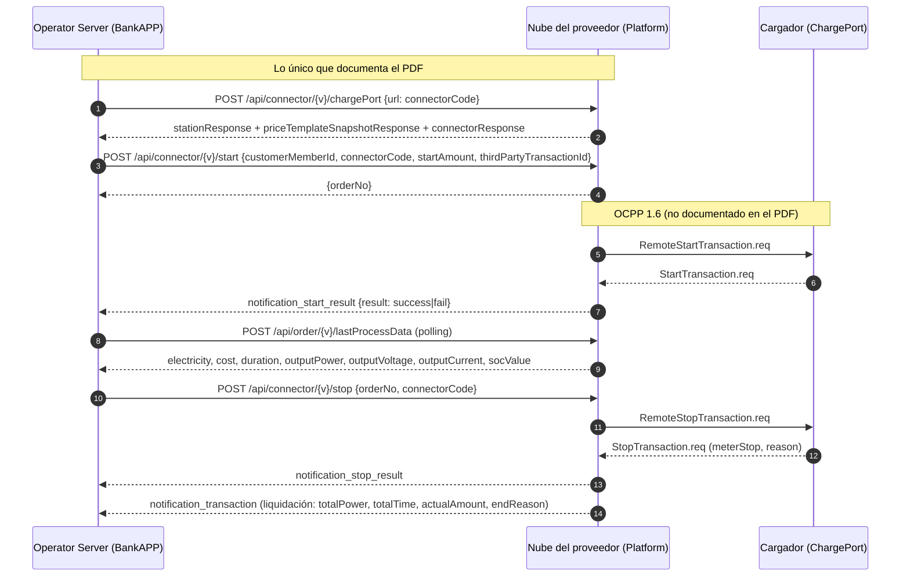
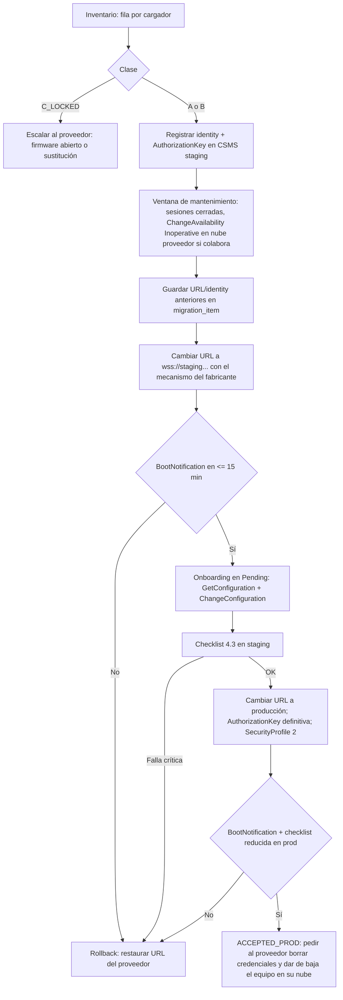
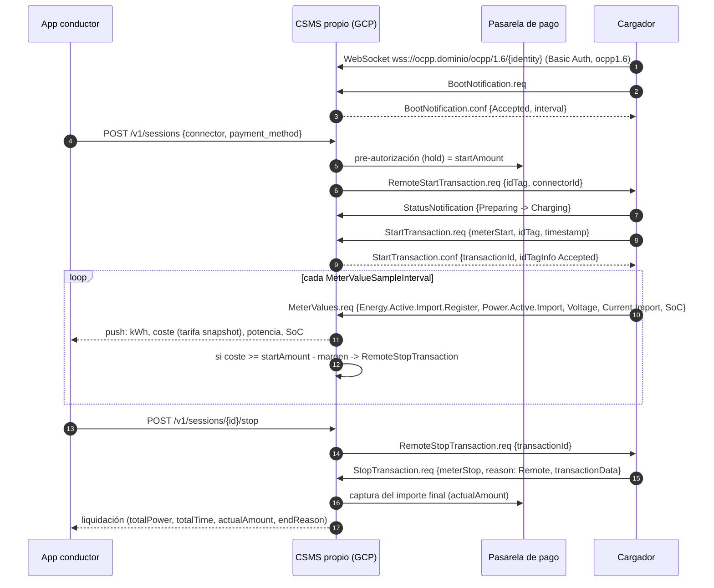
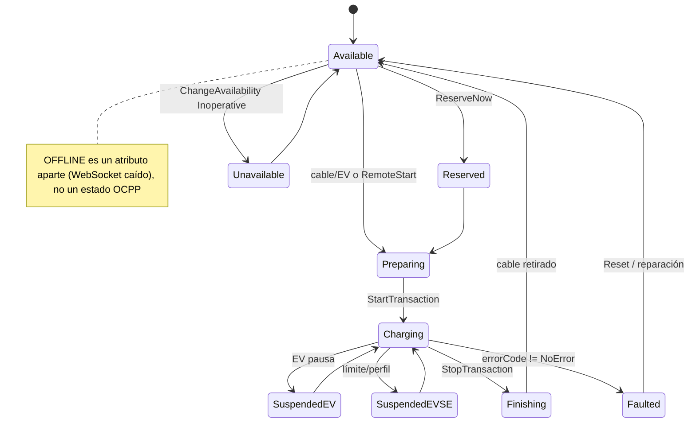

# Capítulo 1 (HW). Los cargadores, el proveedor y el traspaso al CSMS propio

**Fecha:** 2026-09-18 · **Decisión de partida (del usuario):** "la nube del proveedor es lo que yo debo desarrollar; ya no voy a utilizar los servicios del proveedor, lo quiero tener todo yo". Es decir: CSMS propio en Google Cloud, los cargadores hablarán OCPP directamente con esa plataforma, y la API del proveedor **no se integra**.

**Cómo leer este documento.** Cada afirmación relevante lleva una marca de verificación:
`[V]` verificada hoy en la web (fuentes al final), `[PDF]` tomada literalmente del PDF del proveedor (se cita endpoint/campo), `[E]` criterio de experiencia/ingeniería no verificable en línea (confianza media). Varios dominios oficiales (openchargealliance.org, docs.cloud.google.com, plugchoice.com, tzi.app, ocpp.md, ABB library) estaban **bloqueados por el proxy de egreso**; para esos puntos me apoyé en resúmenes de búsqueda y en fuentes secundarias accesibles (repositorios GitHub, pkg.go.dev), y lo señalo bajando la confianza donde corresponde.

---

## 0. Resumen ejecutivo

1. El PDF "API OCPP 1.6 V1.0" **no es OCPP**: es la API REST del "Charging Platform" (la nube del proveedor) para "Operators" de terceros (glosario, p. 4 `[PDF]`). Con la decisión tomada, se descarta como integración; se rescata solo como **evidencia sobre los cargadores** y como **referencia de dominio** (estados, tipos de conector, tarifa por franjas, campos de una orden y el flujo start → telemetría → stop → liquidación).
2. Que hoy los cargadores estén en la nube del proveedor significa que cada equipo tiene grabados: la **URL del Central System**, su **identity/chargeBoxId**, su **perfil de seguridad y credenciales** (AuthorizationKey o certificado), y posiblemente **certificados raíz**, APN/SIM y firmware del fabricante. Para pasarlos al CSMS propio hay que reconfigurar esos cuatro elementos **en cada cargador**, y el cómo depende del fabricante (app/portal, web local, menú de instalador, tarjeta de configuración, key OCPP no estándar vía `ChangeConfiguration`, o `DataTransfer` propietario) `[V]`.
3. El estándar aplicable es **OCPP 1.6J + Security Whitepaper** (3ª ed.; la OCA publicó una 4ª ed. en febrero de 2026 `[V]` — fecha exacta a confirmar en la página de la OCA — y una "OCPP Security Operations Guide v1.0" en enero de 2026 `[V]`). Desde el 1-oct-2025 el programa de certificación OCA para 1.6 exige **FirmwareManagement y Security Profile 2 dentro de Core** (Reservation, Local Auth List y Remote Trigger quedan como opcionales dentro de Core) `[V]`; úsese eso como vara mínima para el hardware.
4. **Riesgo principal:** que el firmware esté atado a la nube del fabricante (URL no editable, credenciales desconocidas, CA raíz pineada, actualización de firmware solo desde su nube, SIM con APN privado). Si un modelo no puede liberarse, la única salida es negociar con el proveedor (firmware "OCPP abierto"/white-label) o **sustituir hardware**. No conviene diseñar nada alrededor de esa contingencia; conviene **detectarla en la semana 1** con un piloto de laboratorio.
5. Plan: inventario → laboratorio (simulador + 1 cargador real contra staging) → checklist de aceptación de 20 puntos por cargador → migración por lotes en ventana de mantenimiento con rollback (volver a la URL del proveedor) → cierre con el proveedor.
6. El mapa de dominio proveedor → propio es directo: casi todos los campos del PDF tienen un equivalente OCPP 1.6 (`connectorStatus` ← `StatusNotification.status`, `totalPower` ← `meterStop − meterStart`, `endReason` ← `StopTransaction.reason`, `socValue` ← `MeterValues` measurand `SoC`), y lo que no lo tiene (`startAmount`, `payStatus`, `reduceAmount`) es lógica de pagos/tarifa que vive en el CSMS propio, no en el cargador.
7. Decisiones pendientes que no puedo tomar por el usuario: país/moneda/regulación (medidor certificado o no, requisitos de interoperabilidad), perfil de seguridad objetivo (2 vs 3), y si se exigirá OCPP 2.0.1 a futuras compras.

---

## 1. Qué es realmente el PDF y qué se rescata

### 1.1 Anatomía del documento

| Elemento | Qué dice el PDF `[PDF]` | Lectura |
|---|---|---|
| Título | "API OCPP 1.6, Version V1.0" (p. 1) | El "OCPP 1.6" del título describe la **nube** del proveedor (que gestiona cargadores OCPP 1.6), no el contenido del documento. |
| Glosario (p. 4) | "Platform: Provide cloud-based services for charging post equipment management and charging functions. Operator: third-party platform services that use the platform's business capabilities." | El usuario era el "Operator"; la "Platform" es exactamente lo que ahora va a construir. |
| Actores del diagrama (p. 7) | BankAPP → Platform → ChargePort | Tres capas. El PDF cubre solo la flecha BankAPP ↔ Platform. La flecha Platform ↔ ChargePort (pasos 5/6 y 14/15) es OCPP y **no está documentada**. |
| Transporte | POST JSON, cuerpo `{"data": "<base64 cifrado>", "operatorCode": "123456"}`; respuesta `{"code": "0000000", "message": null, "body": "<base64 cifrado>"}`; error 401 "Illegal request data, key error, or decryption failed" | Las secciones 1.2 "Unified Request Parameters" y 1.3 "Security Strategy" (páginas 5-6 del índice) **faltan** en el archivo; nunca se entregó el algoritmo/clave. Ya no importa para integrar, pero sí como indicador de la calidad documental del proveedor. |
| Endpoints | `/api/connector/{version}/chargePort`, `/api/order/{version}/detail`, `/api/order/{version}/lastProcessData`, `/api/connector/{version}/start`, `/api/connector/{version}/stop`; webhooks `notification_start_result`, `notification_stop_result`, `notification_transaction` | Superficie mínima: consultar, arrancar, parar, y recibir resultado/liquidación. Sin push de estado, sin tarifas escribibles, sin reset/unlock/firmware/diagnóstico, sin reservas, sin smart charging. |



### 1.2 Por qué ya no se integra

- La decisión del usuario elimina la capa "Platform" del proveedor: su CSMS **es** la Platform. No hay nada que llamar en `/api/connector/...`; los cargadores hablarán OCPP con su gateway.
- Aun si se quisiera mantener como respaldo, la API es inservible como base de un CSMS: no expone estado en tiempo real ni control técnico (reset, unlock, configuración, firmware), y su seguridad no está documentada. Mantenerla añadiría una dependencia sin beneficio.
- La única relación que queda con el proveedor es **de hardware**: garantía, firmware, documentación OCPP del equipo y el "desenganche" de su nube (sección 2 y 3).

### 1.3 Qué sí se rescata como referencia de dominio

| Concepto del PDF `[PDF]` | Valor observado | Qué aporta al diseño propio |
|---|---|---|
| `connectorStatus` | `AVAILABLE, PREPARING, CHARGING, SUSPENDED_EVSE, SUSPENDED_EV, FINISHING, RESERVED, UNAVAILABLE, FAULTED, OFFLINE` (p. 9); ejemplo real `"Offline"` (p. 12, mayúsculas inconsistentes) | Son exactamente los 9 valores de `ChargePointStatus` de OCPP 1.6 `[V]` + un estado derivado **OFFLINE** (WebSocket caído). Confirma que el proveedor propaga `StatusNotification` sin transformar. El CSMS propio debe modelar `status` (del cargador) y `online` (de la conexión) como dos atributos distintos. |
| `connectorType` | `MODE2, MODE3_B, MODE3_C, MODE4, WIRELESS, TYPE_1, TYPE_2, CCS, OTHER` | Mezcla modos de carga IEC 61851 (MODE2/3/4) con conectores físicos (TYPE_1/2, CCS). En el dominio propio conviene separar `standard` (p. ej. `IEC_62196_T2`, `IEC_62196_T2_COMBO`, `CHADEMO`, `IEC_62196_T1`) de `power_type` (`AC_1_PHASE`, `AC_3_PHASE`, `DC`), como hace OCPI 2.2.1/2.3.0 (útil si un día se hace roaming). |
| Límites eléctricos | `voltageUpperLimits 252`, `voltageLowerLimits 186`, `current 32`, `powerUpperLimits 7`, `powerLowerLimits 7` para un `TYPE_2` (p. 11-12) | Un AC monofásico de 32 A / 7 kW con banda de tensión 186-252 V. Sirven para: validar `MeterValues` (rechazar lecturas fuera de rango), parametrizar `SetChargingProfile` (límite en A o W), y mostrar "potencia máxima" en la app. Deben ser **atributos del conector** en la base propia, cargados desde la ficha técnica y contrastados con `GetConfiguration` y con lo que reporte `MeterValues` `Power.Offered`/`Current.Offered`. |
| `priceTemplateSnapshotResponse` | `priceTemplateTypeEnum: UNIFORM_PRICE \| TIME_SLOT_PRICING`, `priceData[{timeRange:"09:00-14:00", price:"0.05"}, {timeRange:"14:00-20:00", price:"0.65"}]`, `defaultPrice: 0.25`, `currentPriceData: null` (p. 11) | Modelo mínimo de **tarifa por franjas horarias con precio por defecto**. Es un buen punto de partida, pero el propio sistema debe superar sus carencias: sin moneda, sin unidad (¿por kWh? ¿por minuto?), sin días de la semana, sin tarifa de ocupación/inactividad, sin vigencia, sin versionado ("snapshot" es el nombre, pero no hay id de versión). La lección útil: **congelar un snapshot de la tarifa al inicio de cada sesión** para que la liquidación sea reproducible. |
| Campos de orden/sesión | `orderNo` (19 dígitos), `customerMemberId`, `connectorCode`, `chargePointSerialNumber`, `startAmount` ("Charging money"/"The lower start price"), `thirdPartyTransactionId` (ej. `pi_3Omon...`, formato PaymentIntent de Stripe), `payStatus` (enum `Charging \| Pending Payment \| Ordered`, ejemplo `SUCCEEDED`), `createdTime`, `payTime`, `reduceAmount`, `actualAmount`, `totalAmount`, `totalPower` (kWh), `totalTime` (`"00:04"`), `finishTime`, `endReason` (`"Remote"`) (p. 13-15) | Define el **ciclo de vida de una sesión comercial**: pre-autorización → carga → liquidación → cobro. `endReason: "Remote"` coincide con el enum `Reason` de OCPP 1.6 (`Remote`) `[V]`: el proveedor propaga `StopTransaction.reason`. `startAmount` es una **pre-autorización** (hold) que el proveedor usaba como tope de gasto: en OCPP 1.6 no existe "límite de coste" nativo; el CSMS propio debe calcular coste en tiempo real y emitir `RemoteStopTransaction` al alcanzar el tope (OCPP 2.1 sí añade transacciones con límite de coste/energía/tiempo `[V]`). |
| Telemetría de sesión | `electricity 0.015`, `cost 4`, `duration 4`, `remaining`, `requestPower`, `outputPower 0.21`, `outputVoltage 231.1`, `outputCurrent 0.9`, `socValue "0"` (p. 17) | Es la vista "en vivo" que la app necesita. Se alimenta desde `MeterValues` (measurands `Energy.Active.Import.Register`, `Power.Active.Import`, `Voltage`, `Current.Import`, `SoC` `[V]`). El PDF la sirve por **polling**; el sistema propio puede hacer push (WebSocket/SSE) porque recibe los `MeterValues` en tiempo real. |
| Flujo funcional | start → telemetría → stop → liquidación (pasos 1-17 del diagrama) | Es el mismo flujo que debe reproducir el CSMS propio con OCPP (sección 5, diagrama "después"). |
| Identificadores | `connectorCode = chargePointSerialNumber + connectorId` (`"623400291"+"1"="6234002911"`) | Truco de concatenación ambiguo (falla con `connectorId ≥ 10`). En el dominio propio: `(charge_point_id, connector_id)` como clave compuesta y un `evse_uid`/código público con separador (`SN-1`). |

### 1.4 Evidencia sobre los cargadores que se extrae del PDF

- Están gestionados por una nube que se autodescribe como "OCPP 1.6" (título); los estados y `endReason` son de OCPP 1.6 sin transformar → **muy probable que hablen OCPP 1.6J** (JSON/WebSocket). No hay indicio de 2.0.1.
- `chargePointSerialNumber` de 9 dígitos (`623400291`, `881099888`) es, con alta probabilidad, la **identity/chargeBoxId** que usan en la URL OCPP. Conviene conservarla como identity al migrar para no reetiquetar equipos.
- Reportan `socValue` (String) y `requestPower` (opcional): la plataforma del proveedor soporta DC con SoC, pero el ejemplo (7 kW, Type 2, `socValue "0"`) es AC; no se puede inferir que **estos** cargadores reporten SoC.
- Hay `stationType: "PERSONAL"` y `stationOperateStatus: "NORMAL"` (p. 11): el proveedor distingue estaciones privadas/públicas y estado operativo de la estación; ambos conceptos conviene reproducirlos (`location.visibility`, `location.operational_status`).

---

## 2. Qué implica que los cargadores estén hoy en la nube del proveedor

### 2.1 Lo que un cargador OCPP-J tiene grabado y hay que cambiar

| Parámetro en el cargador | Qué es | Valor hoy (probable) | Valor destino |
|---|---|---|---|
| URL del Central System | `ws://` o `wss://host[:puerto]/ruta`. El cargador añade su identity al final de la ruta: `wss://ocpp.ejemplo.com/ocpp16/<chargeBoxId>` `[V]` | La del proveedor (desconocida; verla en el cargador) | `wss://ocpp.<dominio-propio>/ocpp/1.6` (prod) y `wss://ocpp-staging.<dominio>/ocpp/1.6` (staging) |
| Identity / chargeBoxId | Nombre único; va en la ruta y como **username** del Basic Auth `[V]` | Probablemente el `chargePointSerialNumber` | Mantener el mismo valor si es posible; registrar en el CSMS antes de cambiar la URL |
| Perfil de seguridad | 1 (ws + Basic Auth), 2 (wss + Basic Auth, TLS ≥ 1.2), 3 (wss + certificado de cliente) son los tres perfiles que define el whitepaper `[V]`; el "perfil 0" (ws sin autenticación) **no está definido por la OCA**: es la convención de muchos firmwares y librerías para "sin seguridad" (valor 0 de la key `SecurityProfile`) `[V]` | Desconocido; muchos despliegues chinos van en 0 o 1 `[E]` | Mínimo **2** en producción; 3 si el hardware lo soporta |
| AuthorizationKey | Contraseña del Basic Auth; key OCPP **write-only** (no aparece en `GetConfiguration`), se envía con `ChangeConfiguration` como cadena **hexadecimal de 40 caracteres que representa una clave de 20 bytes** (mínimo recomendado 16 bytes, generada aleatoriamente) `[V]`; el whitepaper indica fijar `AuthorizationKey` **antes** de subir `SecurityProfile` `[V]`. Algunas implementaciones aceptan longitudes distintas (p. ej. libocpp exige un mínimo de 8 caracteres y no impone máximo `[V]`), por lo que el CSMS debe validar en laboratorio qué acepta cada firmware. En la cabecera `Authorization: Basic` el usuario es la identity y la contraseña es la clave; conviene que el gateway acepte tanto los 20 bytes crudos como su representación hex, porque los firmwares no son uniformes `[E]` | Solo la conoce el proveedor (si usa perfil ≥ 1) | Generada por el CSMS propio por cargador (aleatoria, alta entropía) |
| Certificados raíz de confianza | Para validar el certificado TLS del servidor en perfiles 2/3 (`CentralSystemRootCertificate`) y para firmware firmado (`ManufacturerRootCertificate`) `[V]` | Puede incluir solo la CA del proveedor (pineada) | Debe confiar en la CA que firme el certificado del gateway propio (CA pública como Google Trust Services/Let's Encrypt, o CA propia instalada con `InstallCertificate`) |
| Subprotocolo WebSocket | `Sec-WebSocket-Protocol: ocpp1.6` `[V]` | Igual | Igual; el gateway debe negociarlo |
| Conectividad | Ethernet / Wi-Fi / 4G con SIM y APN | Puede ser SIM del proveedor con APN privado que solo llega a su nube `[E]` | SIM propia o APN público |
| Otras keys | `HeartbeatInterval`, `WebSocketPingInterval`, `MeterValueSampleInterval`, `MeterValuesSampledData`, `LocalAuthListEnabled`, etc. `[V]` | Valores del proveedor | Los define el CSMS en el onboarding (sección 4.3) |

### 2.2 Mecanismos típicos para cambiar URL/identity/credenciales

| Mecanismo | Ejemplos verificados / típicos | Requisitos | Riesgos |
|---|---|---|---|
| **App o portal del fabricante** (la nube del OEM escribe la configuración en el equipo) | Wallbox: app/portal → OCPP → URL + Charge Point ID (por defecto el número de serie) + password opcional; el cargador se reinicia al guardar `[V]`. Kempower: MyKempower → "Configure OCPP – Direct connection from charger to customer backend" con Endpoint URL, Charge point identity y Authorization key (HTTP Basic password) `[V]`. Zaptec: portal/API (expone un endpoint para fijar la `AuthorizationKey` codificada) `[V]` | Cuenta de propietario/instalador en la nube del OEM; el equipo debe estar en línea con el OEM | Dependencia de que el OEM mantenga el portal; si el "proveedor" es quien tiene la cuenta de propietario, hay que pedir la **transferencia de propiedad** |
| **Web local / punto de acceso Wi-Fi del cargador** | Muchos AC chinos y europeos exponen `http://192.168.x.x` o un AP con página de configuración `[E]`; Teltonika TeltoCharge configurable desde la app (URL del servidor + Charge point identity) `[V]`; el detalle de que la URL deba terminar en `/` queda **(a confirmar)** en la FAQ del fabricante | Estar físicamente en el sitio; contraseña de administrador local | Contraseña por defecto cambiada por el proveedor; interfaz solo en chino; sin HTTPS |
| **Herramienta de instalador / menú de servicio** | Alfen: ACE Service Installer (solo Windows), pestaña *Connectivity*, requiere la **owner password** (que suele tener el back office actual), método de conexión (Wired/Mobile), lista de back offices preconfigurados o "Manually enter backend settings" (URL OCPP + identifier); guardar y reiniciar `[V]` (la app MyEye como vía alternativa: a confirmar); ABB Terra AC: app TerraConfig (no permite `wss://` hacia servidores OCPP externos) `[V]` | Software y credenciales de instalador | Licencia/credenciales solo para partners; sin ellas no hay acceso |
| **Tarjeta de configuración / USB / RFID maestra** | Algunos equipos leen un archivo de configuración desde USB o una tarjeta RFID "master" habilita el menú `[E]` | Formato de archivo del fabricante | Documentación inexistente; riesgo de dejar el equipo en estado inconsistente |
| **`ChangeConfiguration` con key no estándar** (vía la nube actual) | ABB Terra AC soporta una key personalizada `CentralSystemURL` para cambiar el back office remotamente (**solo ws:// no seguro**) `[V]`. Otros fabricantes usan nombres como `BackOfficeURL`, `OcppServerUrl`, `ocppCsmsUrl` `[E]`. OCPP 1.6 **no** define una key estándar de URL (la lista estándar va de `AllowOfflineTxForUnknownId` a `WebSocketPingInterval` más las del whitepaper) `[V]` | Que el proveedor ejecute el comando desde su nube (o que la nube sea la del OEM y el usuario tenga acceso) | Si la nueva URL es errónea, el cargador queda huérfano (no vuelve a la anterior). Hacerlo siempre con `GetConfiguration` previo y con ventana de rollback local. La respuesta suele ser `RebootRequired`: el cambio se aplica tras reiniciar/reconectar, así que hay que planificar el `Reset` en la misma ventana `[E]` |
| **`DataTransfer` propietario** | `DataTransfer.req {vendorId, messageId, data}`; `vendorId` recomendado en DNS inverso del fabricante `[V]` | Conocer `vendorId`/`messageId` y el JSON del fabricante | Sin documentación es inutilizable |
| **Firmware nuevo con URL por defecto** | El OEM entrega un firmware "abierto"/white-label con la URL del cliente | `UpdateFirmware` desde la nube actual o USB | El firmware puede requerir firma del OEM (bootloader seguro) |

**Procedimiento remoto correcto para cambiar credenciales (cuando el cargador ya está conectado a un CSMS que controlamos, p. ej. en staging con perfil 1 antes de subir a 2):**

```json
// 1) Fijar la nueva clave (write-only, hex) — OCPP-J: [2,"m1","ChangeConfiguration",{...}]
{"key": "AuthorizationKey", "value": "5A3F9C1E7B2D4A6C8E0F1B3D5F7A9C1E2B4D6F8A"}
// 2) Subir el perfil de seguridad; el cargador se desconecta y reconecta con el nuevo perfil
{"key": "SecurityProfile", "value": "2"}
```

El whitepaper indica que `AuthorizationKey` debe fijarse antes de elevar `SecurityProfile` `[V]`; el CSMS debe aceptar durante una ventana **ambas** credenciales (vieja y nueva) para tolerar un reinicio a mitad de cambio `[E]`.

### 2.3 Riesgos concretos y cómo detectarlos en la semana 1

| Riesgo | Síntoma | Detección | Mitigación |
|---|---|---|---|
| Firmware atado a la nube del OEM | La URL no aparece en ningún menú; el cargador se conecta a un dominio fijo | Ficha OCPP del fabricante; `GetConfiguration` completo (buscar keys de URL); captura de tráfico en laboratorio (DNS/SNI) | Pedir firmware "OCPP abierto"; si no existe, sustituir modelo |
| URL editable pero **solo `ws://`** (sin TLS) | La key acepta `ws://` y rechaza `wss://` (caso ABB `CentralSystemURL` `[V]`) | Probar en laboratorio | Perfil 2 exige `wss://`; si el hardware no lo soporta remotamente, cambiar en local; si no soporta TLS en absoluto, aislar en VPN/APN privado propio y planificar reemplazo |
| Credenciales desconocidas (AuthorizationKey/contraseña de admin) | No se puede entrar al menú ni autenticar | Pedir al proveedor; en último término, reset de fábrica (pierde configuración) | Exigir contractualmente la entrega de credenciales y contraseñas de instalador |
| CA raíz pineada / sin almacén de CAs públicas | Con `wss://` al gateway propio falla el handshake TLS | Laboratorio con certificado de CA pública (GTS/Let's Encrypt) y con CA propia | `InstallCertificate(CentralSystemRootCertificate)` desde la nube actual (solo si el proveedor colabora) o instalación local; elegir CA que el cargador ya tenga |
| Reloj del cargador incorrecto | TLS falla por "certificado no válido aún"; timestamps de `StartTransaction` incoherentes | Comparar `BootNotification` timestamp vs hora real | El cargador ajusta reloj con `BootNotification.conf.currentTime` `[V]`; en perfil 2 hay huevo-gallina si el reloj está muy desviado: preguntar por NTP |
| Bootloader seguro / firmware firmado | `UpdateFirmware` con un binario no firmado por el OEM falla (`InvalidSignature`/`InstallationFailed`) | Pedir la política de firma | Solo instalar firmware oficial; exigir que el OEM publique el firmware y no dependa de su nube |
| SIM/APN del proveedor | El cargador solo resuelve/alcanza la nube del proveedor | Probar con SIM propia | Comprar SIM propias (M2M) y configurar APN |
| Identity duplicada o cambiada | Dos cargadores con la misma identity; el CSMS confunde sesiones | Inventario | Identity = número de serie; el gateway rechaza una segunda conexión con la misma identity (o cierra la anterior, decisión de diseño) |
| Cargador como "hijo" de un gateway de sitio | Varios cargadores salen por un controlador local que habla OCPP en su nombre | Inventario físico | Migrar el controlador, no cada cargador |

**Nota breve de contingencia:** si un modelo no permite cambiar la URL ni con la colaboración del proveedor, no hay alternativa técnica dentro de OCPP: o el proveedor entrega un firmware que lo permita, o se cambia el hardware. Esto debe quedar claro en la negociación (sección 3, pregunta 1).

---

## 3. Requisitos y preguntas al proveedor sobre el HARDWARE (para enviar por escrito)

Cada pregunta indica *por qué* importa y *qué evidencia* pedir. Se recomienda exigir respuesta **por modelo y versión de firmware**, porque la certificación OCA aplica a modelos y versiones concretas, no a marcas `[V]`.

| # | Pregunta / requisito | Por qué | Evidencia a pedir |
|---|---|---|---|
| 1 | **Confirmación escrita de que el operador puede apuntar los cargadores a su propio CSMS** y de que el proveedor colaborará en el traspaso (sin cargos ocultos, sin pérdida de garantía). | Es la condición de todo el plan. | Cláusula contractual o carta. |
| 2 | Versión OCPP soportada por modelo/firmware: **1.6J obligatorio**; ¿existe firmware **2.0.1**? ¿Hoja de ruta a 2.1? | 1.6J es lo que hay; 2.0.1 es la norma IEC 63584:2024 `[V]` y empieza a exigirse por regulación en algunos mercados (p. ej. la regla federal NEVI de EE. UU., 23 CFR 680, fijó 2.0.1 desde feb-2024, aunque la guía del programa se reformuló en 2025 y su alcance actual queda a confirmar; otros programas como CALeVIP: a confirmar); 2.1 publicado el 23-ene-2025 y adoptado como IEC 63584-210:2025 `[V]`. | Ficha "OCPP Implementation Overview" por modelo. |
| 3 | **Certificación OCA** (1.6 Core, y desde oct-2025 Core incluye FirmwareManagement + Security Profile 2; Reservation, Local Auth List y Remote Trigger son opcionales dentro de Core `[V]`): número/fecha, laboratorio, firmware certificado. Si el certificado es anterior a oct-2025, pedir además el certificado de seguridad separado ("Security" / "Advanced Security") `[E]`. | Reduce sorpresas de interoperabilidad; la certificación aplica a un modelo y una versión de firmware concretos. | Enlace al listado de certificados de OCA o certificado PDF. |
| 4 | **Perfiles de seguridad** soportados (1/2/3; y si admite operar "sin seguridad" para laboratorio), versión del whitepaper implementada (2ª, 3ª o 4ª ed. `[V]`), TLS 1.2/1.3, cipher suites, tamaño máximo de cadena (`CertificateSignedMaxChainSize`), CAs raíz preinstaladas, soporte de `InstallCertificate`/`SignCertificate`/`CertificateSigned`/`GetInstalledCertificateIds`/`DeleteCertificate`. La "OCPP Security Operations Guide v1.0" de la OCA (ene-2026) `[V]` sirve como guion de preguntas operativas (rotación de claves, gestión de certificados). | Sin perfil 2 no hay producción segura; sin CA pública preinstalada el `wss://` fallará. | Lista de CAs del almacén; capturas de `GetConfiguration` de `SecurityProfile`, `CpoName`, `AdditionalRootCertificateCheck`, `CertificateStoreMaxLength`. |
| 5 | **Cómo se cambia la URL del CSMS, la identity y la AuthorizationKey** en cada modelo (menú local, app/portal, herramienta de instalador, key no estándar por `ChangeConfiguration`, `DataTransfer`), y **cuáles son las credenciales de administrador** actuales. | Sección 2. | Manual de instalador; nombres exactos de keys propietarias (p. ej. `CentralSystemURL`); contraseñas entregadas por canal seguro. |
| 6 | ¿La URL admite `wss://` y puerto no estándar? ¿Admite ruta con varios segmentos? ¿Limita longitud? ¿Añade la identity al final automáticamente? ¿Requiere `/` final (se atribuye a Teltonika; a confirmar)? | Errores frecuentes al migrar. | Ejemplo de URL válida documentado. |
| 7 | **Feature profiles** soportados (`SupportedFeatureProfiles`): Core, FirmwareManagement, LocalAuthListManagement, Reservation, SmartCharging, RemoteTrigger `[V]`. | Define qué puede hacer el CSMS: reservas, listas locales, límites de potencia, `TriggerMessage`. | Salida real de `GetConfiguration` sin filtro (`key` vacío). |
| 8 | **Salida completa de `GetConfiguration`** por modelo (keys estándar y propietarias, `readonly`), con `GetConfigurationMaxKeys`. | Base del onboarding y de la detección de keys de URL/seguridad. | JSON exportado. |
| 9 | **Measurands** soportados en `MeterValuesSampledData`, `MeterValuesAlignedData`, `StopTxnSampledData`, `StopTxnAlignedData`, y `MeterValuesSampledDataMaxLength`; intervalos mínimos (`MeterValueSampleInterval`, `ClockAlignedDataInterval`). | Telemetría de la app y liquidación por energía. Lista estándar: `Energy.Active.Import.Register`, `Power.Active.Import`, `Voltage`, `Current.Import`, `Current.Offered`, `Power.Offered`, `SoC`, `Temperature`, `Frequency`, `Power.Factor`, etc. `[V]` | Ficha + `MeterValues` real de muestra (con `phase`, `unit`, `location`). |
| 10 | **Medidor**: integrado o externo, clase de precisión (p. ej. el pliego RIC N°15 de la SEC en Chile exige que la unidad de medida cumpla IEC 62053-21 o superior `[V]`; la clase concreta exigida: a confirmar en el texto vigente), certificación **MID** (UE) `[V]`, lectura de `meterSerialNumber`/`meterType` en `BootNotification`, y si soporta valores firmados (`SignedData`/OCMF) para regulaciones tipo Eichrecht. | La facturación por kWh puede exigir medidor certificado según el país (decisión pendiente). | Certificado del medidor; ejemplo de `MeterValue` con `format: "SignedData"` si aplica. |
| 11 | **Tipos de conector y potencias** por modelo: estándar físico, AC 1F/3F o DC, tensión y corriente máximas, potencia máxima por conector y compartida (si un DC reparte potencia entre dos pistolas). Contrastar con `voltageUpperLimits`, `current`, `powerUpperLimits` del PDF. | Ficha del conector en el dominio propio; validación de `MeterValues`. | Hoja técnica. |
| 12 | **SoC**: ¿los modelos DC reportan `SoC` como measurand? ¿Y `requestPower`/energía solicitada por el EV (no existe en 1.6; en 2.0.1/2.1 vía ISO 15118)? | El PDF expone `socValue` y `requestPower`; hay que saber si vienen del cargador o son nulos. | Muestra de `MeterValues` en DC. |
| 13 | **`DataTransfer` propietarios**: `vendorId`, `messageId`, esquemas JSON, dirección (CP→CS / CS→CP), y qué funciones solo se logran por esa vía (p. ej. QR en pantalla, tarifa en display, cambio de URL). | Sin esta lista, funciones del equipo quedan inaccesibles. | Documento de extensiones. |
| 14 | **Actualización de firmware**: `UpdateFirmware` con `location` (URI HTTP/HTTPS/FTP), `retrieveDate`, `retries`, `retryInterval` `[V]`; ¿soporta `SignedUpdateFirmware` (whitepaper) con firma y `ManufacturerRootCertificate`? Formato del binario, tamaño, tiempo, ¿se actualiza el bootloader? ¿Dónde se publica el firmware y con qué notas de versión? | Poder actualizar sin depender de la nube del proveedor. | Repositorio/portal de firmware; procedimiento; ejemplo de `FirmwareStatusNotification` esperado. |
| 15 | **Diagnóstico y logs**: `GetDiagnostics` (`location` de subida HTTP/FTP, `startTime`, `stopTime` `[V]`), `GetLog`/`LogStatusNotification` (whitepaper `[V]`), formato de los archivos, `SecurityEventNotification` emitidos. | Soporte de operación. | Ejemplo de archivo de diagnóstico. |
| 16 | **Conectividad**: Ethernet/Wi-Fi/4G, banda, módem, SIM (¿del proveedor? ¿APN privado?), consumo de datos mensual estimado con `MeterValueSampleInterval` = 30 s, comportamiento con NAT/CGNAT, `WebSocketPingInterval`. | Costes de SIM y estabilidad de la conexión. | Ficha de conectividad; permiso para cambiar SIM/APN. |
| 17 | **Comportamiento offline**: `LocalAuthorizeOffline`, `LocalPreAuthorize`, `AllowOfflineTxForUnknownId`, `AuthorizationCacheEnabled`, `LocalAuthListEnabled`/`LocalAuthListMaxLength`/`SendLocalListMaxLength`, cola de transacciones (`TransactionMessageAttempts`, `TransactionMessageRetryInterval`), capacidad de la cola, `MaxEnergyOnInvalidId` `[V]`. | Define si el cargador sigue cobrando sin red y cómo se reconcilia después. | Valores por defecto y máximos. |
| 18 | **Reservas** (`ReserveNow`/`CancelReservation`, `ReserveConnectorZeroSupported`), **desbloqueo** (`UnlockConnector`: `Unlocked`/`UnlockFailed`/`NotSupported`; `UnlockConnectorOnEVSideDisconnect`), **disponibilidad** (`ChangeAvailability`), **reset** (`Hard`/`Soft`, `ResetRetries`). | Operación remota diaria. | Ficha. |
| 19 | **Smart charging**: `SetChargingProfile` (`ChargePointMaxProfile`, `TxDefaultProfile`, `TxProfile`), unidad (`ChargingScheduleAllowedChargingRateUnit` A/W), `ChargingScheduleMaxPeriods`, `MaxChargingProfilesInstalled`, `ChargeProfileMaxStackLevel`, `GetCompositeSchedule`, `ConnectorSwitch3to1PhaseSupported` `[V]`. | Balanceo de carga por sitio y precios dinámicos con límite de potencia. | Ficha + prueba en laboratorio. |
| 20 | **RemoteTrigger**: `TriggerMessage` para `BootNotification`, `StatusNotification`, `MeterValues`, `Heartbeat`, `DiagnosticsStatusNotification`, `FirmwareStatusNotification` `[V]` y `ExtendedTriggerMessage` (whitepaper). | Sincronizar estado tras reconexión sin reiniciar. | Ficha. |
| 21 | **Autorización local**: lector RFID (ISO 14443 A/B, MIFARE, formato del `idTag` ≤ 20 caracteres `[V]`, mayúsculas/minúsculas, con o sin ceros a la izquierda), `AuthorizeRemoteTxRequests`, `StopTransactionOnInvalidId`, `StopTransactionOnEVSideDisconnect`. | Compatibilidad de tarjetas existentes y flujos de arranque. | Muestra de `Authorize.req` con una tarjeta real. |
| 22 | **Pantalla/QR**: ¿el cargador muestra QR o código de conector? ¿Es configurable (URL del QR) para que apunte a la app propia? ¿Por `DataTransfer`? | Flujo "escanea y carga". | Procedimiento. |
| 23 | **Manuales y herramientas**: manual de instalador, manual OCPP, herramienta de configuración (Windows/app), credenciales de instalador, y **transferencia de propiedad** en el portal del OEM si aplica. | Autonomía operativa. | Entrega documental. |
| 24 | **Garantía y soporte**: ¿la garantía se mantiene al operar con CSMS propio? SLA de soporte de segundo nivel, repuestos, RMA. | Riesgo comercial. | Contrato. |
| 25 | **Certificaciones eléctricas/seguridad** del equipo aplicables al país de instalación (a definir por el usuario: p. ej. RETIE en Colombia `[V]`, SEC/RIC N°15 en Chile (versión 2024) `[V]`, CE/IEC 61851-1 en UE, UL 2594/2202 en NA). En Colombia, además, la Resolución 40123 de 2024 del Ministerio de Minas y Energía obliga a que las estaciones de carga de **acceso público** se conecten al sistema de gestión mediante un protocolo abierto (última versión estable de OCPP o norma ISO/IEC/Icontec equivalente), con plazo de 6 meses para nuevas y 2 años para las existentes `[V]`: un cargador que no pueda apuntarse a un CSMS OCPP incumpliría esa norma. | Cumplimiento local; independiente del CSMS pero condiciona compras. | Certificados. |
| 26 | **Inventario entregado por el proveedor**: por cada cargador, modelo, número de serie, `chargePointSerialNumber`/identity, firmware, tipo de conectividad, ICCID/IMSI, ubicación, fecha de instalación, estado de garantía. | Base de la migración. | CSV/Excel. |
| 27 | **Datos históricos**: exportación de transacciones, usuarios/tarjetas (`idTag`s) y configuración actual por cargador antes de cortar la relación. | Continuidad de reportes y de tarjetas RFID de clientes. | Exportación completa. |
| 28 | **Plan de desconexión**: ¿pueden dejar el cargador en `Inoperative` durante la ventana, ejecutar `ChangeConfiguration`/`InstallCertificate` desde su nube por encargo, y confirmar que **borran** las credenciales del equipo en su lado tras la migración? | Ejecución del traspaso y seguridad posterior. | Compromiso escrito. |

---

## 4. Plan de traspaso

### 4.1 Fase 0 — Inventario (1 semana)

Entregable: tabla de inventario poblada (una fila por cargador) y clasificación en **A** (URL/credenciales editables y documentadas), **B** (editables pero requieren al proveedor), **C** (no editables → escalado/sustitución).

```sql
-- PostgreSQL. Inventario y seguimiento de migración (esquema ops).
CREATE TYPE ops.migration_class AS ENUM ('A_SELF_SERVICE','B_NEEDS_VENDOR','C_LOCKED');
CREATE TYPE ops.migration_state AS ENUM (
  'INVENTORIED','REGISTERED_STAGING','POINTED_STAGING','ACCEPTED_STAGING',
  'POINTED_PROD','ACCEPTED_PROD','ROLLED_BACK','BLOCKED');

CREATE TABLE ops.charge_point_inventory (
  charge_point_id      text PRIMARY KEY,            -- identity/chargeBoxId (= serial si es posible)
  vendor               text NOT NULL,               -- BootNotification.chargePointVendor
  model                text NOT NULL,               -- BootNotification.chargePointModel
  serial_number        text,                        -- chargePointSerialNumber (PDF: "623400291")
  firmware_version     text,
  ocpp_version         text NOT NULL DEFAULT '1.6J',
  security_profile_now smallint,                    -- 0..3 en la nube del proveedor
  connectivity         text,                        -- ETHERNET | WIFI | CELLULAR
  iccid                text, imsi text, apn text,
  site_id              text, address text, lat numeric(10,7), lon numeric(10,7),
  n_connectors         smallint,
  url_change_method    text,                        -- APP | LOCAL_WEB | INSTALLER_TOOL | CONFIG_KEY | DATATRANSFER | UNKNOWN
  url_change_key       text,                        -- p.ej. 'CentralSystemURL' si existe
  admin_credentials_ok boolean NOT NULL DEFAULT false,
  migration_class      ops.migration_class,
  warranty_until       date,
  notes                text
);

CREATE TABLE ops.migration_item (
  id                 bigserial PRIMARY KEY,
  charge_point_id    text NOT NULL REFERENCES ops.charge_point_inventory,
  batch_no           int  NOT NULL,
  state              ops.migration_state NOT NULL DEFAULT 'INVENTORIED',
  previous_url       text,                          -- para rollback
  previous_identity  text,
  target_url         text,
  window_start       timestamptz, window_end timestamptz,
  checklist          jsonb NOT NULL DEFAULT '{}'::jsonb,  -- resultado por ítem de la sección 4.3
  updated_at         timestamptz NOT NULL DEFAULT now()
);
CREATE INDEX ON ops.migration_item (batch_no, state);
```

### 4.2 Fase 1 — Laboratorio contra el CSMS de staging (2-3 semanas)

1. **Simulador primero** (sin hardware): validar el gateway OCPP-J propio con un simulador de punto de carga. Opciones verificadas `[V]`: `SAP/e-mobility-charging-stations-simulator` (TypeScript; 1.6/2.0/2.0.1), `monta-app/ocpp-emulator` (Kotlin; 1.6/2.0.1), `solidstudiosh/ocpp-virtual-charge-point` (TS; 1.6/2.0.1), `OpenChargingCloud/ChargingStationApp` (Electron; 1.6J estable, 2.0.1 y 2.1 en desarrollo `[V]`), MicroOcpp Simulator (C++ en Linux, ampliamente usado para pruebas de backend `[E]`), `c-jimenez/open-ocpp-simu`, EVerest `libocpp` (probado contra OCTT). Para probar el **CSMS** como servidor existen `tzi-app/tzi-OCTT` (pytest; 75 casos 1.6J y 252 casos 2.0.1, con API de disparo para que el CSMS envíe mensajes `[V]`) y `juherr/open-ocpp-tck` (TypeScript; 47 escenarios de certificación 1.6 y 36 de 2.0.1, con drivers para SteVe y CitrineOS `[V]`). Recomendación: usar dos simuladores distintos (p. ej. SAP y MicroOcpp) porque interpretan la especificación de forma diferente y afloran errores del servidor `[E]`.
2. **Un cargador real en banco** (idealmente uno por modelo): conectarlo a red propia, capturar tráfico (DNS/SNI) para ver a qué URL habla hoy, y practicar el cambio de URL con el mecanismo del fabricante. Probar en este orden: `ws://` sin autenticación ("perfil 0", solo laboratorio) → `ws://` perfil 1 → `wss://` perfil 2 (certificado de CA pública) → perfil 3 si aplica.
3. **Onboarding en `Pending`**: el CSMS responde `BootNotification.conf {status: "Pending"}`; en ese estado el cargador **no debe enviar requests** salvo que el CSMS se lo pida con `TriggerMessage`, ninguna de las dos partes debería cerrar el canal, y el CSMS puede leer/escribir configuración (`GetConfiguration`, `ChangeConfiguration`) antes de aceptarlo `[V]`. Es el momento de normalizar keys (tabla siguiente) y luego responder `Accepted` con `interval` (segundos de heartbeat). Semántica de `interval` cuando el status **no** es `Accepted`: es la espera mínima antes del siguiente `BootNotification.req` (con 0, el cargador elige un retardo que no inunde al CSMS); con `Rejected` el cargador no envía ningún mensaje hasta que venza ese intervalo y cualquiera de las partes puede cerrar la conexión `[V]`. Tras un `Accepted`, no conviene reenviar `BootNotification` por `TriggerMessage` (la especificación recomienda rechazarlo hasta el siguiente reinicio) `[V]`. El gateway debe rechazar el handshake si el cargador no ofrece un subprotocolo `ocpp1.6` soportado `[V]`.
4. **Referencias de CSMS open source** para contrastar comportamiento (no para copiar arquitectura sin criterio): SteVe (Java, GPL, OCPP 1.2/1.5/1.6 en SOAP y JSON, 1.6J con extensiones de seguridad, MySQL/MariaDB) `[V]`; CitrineOS (TypeScript, Apache-2.0, 1.6 desde la v1.6.0 de abril de 2025 y 2.0.1, RabbitMQ, PostgreSQL/PostGIS; en proceso de certificación OCA Core + Advanced Security según su hoja de ruta) `[V]`; librerías `lorenzodonini/ocpp-go` (Go; 1.6 + extensión de seguridad + 2.0.1) `[V]`, `mobilityhouse/ocpp` (Python; enums de 1.6 incluyen las keys y mensajes del whitepaper) `[V]`, `ChargeTimeEU/Java-OCA-OCPP`.

**Configuración objetivo que el CSMS aplica en el onboarding (valores iniciales, ajustables por modelo):**

| Key `[V]` | Valor propuesto | Motivo |
|---|---|---|
| `HeartbeatInterval` | 300 (vía `BootNotification.conf.interval`) | Detección de caída ≤ 5 min sin gastar datos; `WebSocketPingInterval` 60-120 para NAT |
| `MeterValueSampleInterval` | 30 (AC) / 10-15 (DC) | Coste en tiempo real y corte por `startAmount` con margen |
| `MeterValuesSampledData` | `Energy.Active.Import.Register,Power.Active.Import,Voltage,Current.Import` (+ `SoC` en DC, + `Current.Offered`,`Power.Offered` si existen) | Telemetría de la app (equivale a `lastProcessData`) |
| `StopTxnSampledData` | `Energy.Active.Import.Register` | Liquidación reproducible |
| `ClockAlignedDataInterval` | 900 | Perfil de carga por cuarto de hora (tarifas por franja) |
| `AuthorizeRemoteTxRequests` | `false` (o `true` si se desea doble validación) | Con `true`, tras `RemoteStartTransaction` el cargador envía `Authorize.req` y el CSMS debe aceptar el `idTag` |
| `ConnectionTimeOut` | 90-120 | Tiempo para enchufar tras un arranque remoto |
| `StopTransactionOnEVSideDisconnect` | `true` | Cierra la sesión al desconectar el cable |
| `StopTransactionOnInvalidId` | `true` | Corta si el CSMS rechaza el `idTag` |
| `UnlockConnectorOnEVSideDisconnect` | `true` | Evita cables atrapados |
| `LocalAuthorizeOffline` / `LocalAuthListEnabled` | `true` / `true` con lista enviada por `SendLocalList` | Continuidad sin red |
| `AllowOfflineTxForUnknownId` | `false` | Seguridad |
| `LocalPreAuthorize` | `false` | Evitar arranques sin validación del CSMS |
| `TransactionMessageAttempts` / `TransactionMessageRetryInterval` | 5 / 60 | Reintentos de `StartTransaction`/`StopTransaction` en cola |
| `SecurityProfile` | 2 (3 si hay PKI) | Cifrado + autenticación |

### 4.3 Checklist de aceptación por cargador (staging y producción)

Cada ítem se registra en `ops.migration_item.checklist` con `ok/fail`, timestamp y evidencia (id de mensaje OCPP).

| # | Prueba | Mensaje(s) | Criterio de aceptación |
|---|---|---|---|
| 1 | Conexión | WebSocket `wss://`, `Sec-WebSocket-Protocol: ocpp1.6`, Basic Auth | Handshake OK con la identity registrada; rechazado con credencial errónea o sin subprotocolo `ocpp1.6`; una segunda conexión con la misma identity se gestiona según la política elegida (rechazar o cerrar la anterior) |
| 2 | Registro | `BootNotification.req/conf` | `Accepted`; `chargePointVendor`, `chargePointModel`, `chargePointSerialNumber`, `firmwareVersion`, `meterSerialNumber`, `iccid` coinciden con el inventario |
| 3 | Latido | `Heartbeat.req/conf` | Recibido cada `interval` ± 10 %; `currentTime` aplicado |
| 4 | Configuración | `GetConfiguration` (sin keys) | Devuelve todas las keys; `SupportedFeatureProfiles` contiene lo declarado por el proveedor; `unknownKey` vacío para las keys del onboarding |
| 5 | Cambio de configuración | `ChangeConfiguration` × 15 keys de la tabla 4.2 | `Accepted` o `RebootRequired` (y se reinicia); ninguna `NotSupported` inesperada |
| 6 | Estado | `StatusNotification.req` por conector 0..N | Secuencia `Available` al inicio; `Preparing` al enchufar; `errorCode` `NoError` |
| 7 | Autorización RFID | `Authorize.req/conf` | `idTag` de una tarjeta de prueba → `Accepted`; tarjeta bloqueada → `Blocked`/`Invalid` |
| 8 | Arranque remoto | `RemoteStartTransaction.req` → `StartTransaction.req` | `RemoteStartStopStatus Accepted`; `StartTransaction` recibido con `meterStart` ≥ 0 y `transactionId` devuelto por el CSMS aceptado |
| 9 | Telemetría | `MeterValues.req` | Cada `MeterValueSampleInterval` s; `Energy.Active.Import.Register` monótono; `Voltage`/`Current.Import` dentro de límites del conector |
| 10 | Parada remota | `RemoteStopTransaction.req` → `StopTransaction.req` | `reason: Remote`; `meterStop ≥ meterStart`; `transactionData` presente si `StopTxnSampledData` no vacío |
| 11 | Parada local | Desenchufar cable / tarjeta | `reason: EVDisconnected` o `Local`; `Finishing` → `Available` |
| 12 | Disponibilidad | `ChangeAvailability Inoperative/Operative` | `Accepted`/`Scheduled`; `StatusNotification Unavailable`/`Available` |
| 13 | Reset | `Reset Soft` y `Reset Hard` | `Accepted`; reconecta y envía `BootNotification` en < 3 min |
| 14 | Desbloqueo | `UnlockConnector` | `Unlocked` (o `NotSupported` documentado) |
| 15 | Disparo | `TriggerMessage StatusNotification/MeterValues/Heartbeat` | `Accepted` y llega el mensaje |
| 16 | Diagnóstico | `GetDiagnostics {location: https://.../upload}` → `DiagnosticsStatusNotification` | `Uploading` → `Uploaded`; archivo recibido en el bucket |
| 17 | Firmware | `UpdateFirmware {location, retrieveDate}` → `FirmwareStatusNotification` | `Downloading` → `Downloaded` → `Installing` → `Installed`; `BootNotification.firmwareVersion` nuevo (probar en laboratorio, no en producción) |
| 18 | Lista local | `SendLocalList Full` / `GetLocalListVersion` | Versión aplicada; autoriza offline una tarjeta de la lista |
| 19 | Offline | Cortar red 5 min durante una sesión | Al reconectar, llegan `StartTransaction`/`MeterValues`/`StopTransaction` en cola en orden cronológico `[V]`; el CSMS reconcilia sin duplicar |
| 20 | Seguridad | `SecurityEventNotification`; intento con `ws://` | Perfil 2 activo; el gateway rechaza `ws://` en producción; eventos de seguridad registrados |
| 21 | Smart charging (si aplica) | `SetChargingProfile ChargePointMaxProfile limit 16 A` | `Accepted`; `Current.Offered`/`Power.Active.Import` bajan al límite |
| 22 | Reserva (si aplica) | `ReserveNow` / `CancelReservation` | `Accepted`; `StatusNotification Reserved` |

### 4.4 Migración por lotes



Reglas de lotes `[E]`:

- **Lote 0 (piloto):** 1 cargador por modelo, en sitio real de bajo tráfico, 1 semana en producción propia antes de continuar.
- **Lote 1..n:** agrupar por sitio y modelo; máximo 10-20 % del parque por lote; nunca dos sitios críticos el mismo día.
- **Ventana:** fuera de horas pico; informar a usuarios (app/cartel) y bloquear reservas; cerrar sesiones activas antes de cambiar la URL (cambiar la URL con una transacción en curso puede dejar la transacción en la cola del cargador y llegar al **nuevo** CSMS con un `transactionId` desconocido: el CSMS debe aceptar y marcar como "huérfana" para conciliación).
- **Dos CSMS activos a la vez:** durante la migración el cargador está en exactamente uno; el CSMS propio no debe intentar hablar con la nube del proveedor. Asegurar que la nube del proveedor no vuelva a "empujar" configuración (p. ej. por un `UpdateFirmware` programado).
- **Criterio de salida por lote:** 100 % de ítems críticos (1-11, 13, 19, 20) en OK; 48 h sin incidencias; conciliación de energía con la última liquidación del proveedor.

### 4.5 Rollback

- Condición: sin `BootNotification` en 15 min, fallo en ítems críticos, o incidente de usuarios.
- Acción: restaurar `previous_url`/`previous_identity` con el mismo mecanismo (por eso es obligatorio que el mecanismo sea **local o accesible**; si solo el proveedor podía cambiar la URL, hay que acordar un contacto de guardia durante la ventana).
- Si el cargador quedó huérfano (URL errónea y sin acceso local): reset de fábrica según manual → vuelve a la URL por defecto del firmware (que puede ser la del proveedor) → repetir.
- Registrar `ROLLED_BACK` con causa; no reintentar el mismo cargador hasta corregir la causa raíz.

### 4.6 Si un lote no puede migrarse (clase C)

Pedir al proveedor, por escrito y con plazo: (a) firmware con URL/credenciales editables y `wss://`; (b) o que ellos ejecuten desde su nube `ChangeConfiguration` de la key de URL + `InstallCertificate` de la CA propia + `AuthorizationKey` (y perfil de seguridad); (c) o precio y plazo de sustitución por un modelo certificado OCA 1.6 Core (post-oct-2025) o 2.0.1; (d) mientras tanto, exportación diaria de transacciones para no perder facturación. Si no hay respuesta, ese sublote se planifica como **reemplazo de hardware** en el presupuesto.

---

## 5. Mapa de dominio: proveedor → propio (OCPP 1.6)

### 5.1 Flujo objetivo con OCPP directo



### 5.2 Tabla de equivalencias

| Campo del proveedor `[PDF]` | Origen en el dominio propio | Detalle |
|---|---|---|
| `connectorStatus` | `StatusNotification.req.status` (`Available…Faulted`) + `online` derivado del WebSocket | `OFFLINE` = conexión caída (último `Heartbeat`/ping vencido), no un estado OCPP |
| `connectorStatus = FAULTED` + causa | `StatusNotification.req.errorCode` (`ConnectorLockFailure, EVCommunicationError, GroundFailure, HighTemperature, InternalError, LocalListConflict, NoError, OtherError, OverCurrentFailure, OverVoltage, PowerMeterFailure, PowerSwitchFailure, ReaderFailure, ResetFailure, UnderVoltage, WeakSignal`) `[V]` + `info`, `vendorErrorCode` | El PDF no expone causa; el sistema propio sí debe |
| `connectorCode` | `charge_point_id` + `connector_id` (clave compuesta; código público `SN-1`) | Evitar concatenación sin separador |
| `chargePointSerialNumber` | `BootNotification.req.chargePointSerialNumber` (y/o identity) | Verificar coincidencia en el onboarding |
| `connectorType` | Atributo estático del conector (`standard`, `power_type`) alineado a OCPI | OCPP 1.6 no lo reporta; se carga del inventario |
| `voltageUpperLimits/LowerLimits`, `current`, `powerUpperLimits/LowerLimits` | Atributos estáticos del conector + validación de `MeterValues` (`Voltage`, `Current.Import`, `Power.Active.Import`) y `Power.Offered`/`Current.Offered` | Base para `SetChargingProfile` |
| `stationName`, `address`, `latitude`, `longitude`, `businessHours`, `guide`, `stationManager`, `stationTel`, `stationType`, `stationOperateStatus` | Entidad `location` propia (nombre, dirección, coordenadas, horario, visibilidad, estado operativo, contacto) | No proviene de OCPP; lo gestiona el back-office |
| `priceTemplateSnapshotResponse` (`priceData[timeRange, price]`, `priceTemplateTypeEnum`, `defaultPrice`, `currentPriceData`) | `tariff` + `tariff_snapshot` en la sesión | Añadir moneda, unidad (kWh/min/sesión), días, vigencia, versión; `currentPriceData` = franja vigente calculada |
| `orderNo` | `charging_session.id` (UUID/ULID) y `transaction_id` OCPP (int devuelto en `StartTransaction.conf`) | El `transactionId` OCPP es entero: usar secuencia propia y mapear a la sesión |
| `customerMemberId` | `driver.id` | Emitido por el CSMS propio |
| `thirdPartyTransactionId` (`pi_...`) | `payment_intent_id` de la pasarela | El proveedor lo guardaba como referencia; ahora es una FK propia |
| `startAmount` | `pre_authorized_amount` (hold en pasarela) + regla de corte: `RemoteStopTransaction` cuando `coste_estimado ≥ startAmount − margen` | Sin equivalente en OCPP 1.6; en OCPP 2.1 existen límites de coste/energía/tiempo `[V]` |
| `payStatus` (`Charging`, `Pending Payment`, `Ordered`, `SUCCEEDED`) | Máquina de estados propia: `PENDING_AUTH → AUTHORIZED → CHARGING → STOPPED → SETTLED → CAPTURED / FAILED / REFUNDED` | El enum del PDF es inconsistente; definir el propio |
| `createdTime` | `StartTransaction.req.timestamp` (hora del cargador) y `received_at` (hora del servidor) | Guardar ambas; el reloj del cargador puede estar mal |
| `finishTime` | `StopTransaction.req.timestamp` | Idem |
| `payTime` | Timestamp de captura en la pasarela | Propio |
| `totalPower` (kWh) | `(StopTransaction.meterStop − StartTransaction.meterStart) / 1000` (Wh → kWh) | Validar contra el último `Energy.Active.Import.Register` de `transactionData`/`MeterValues`; el registro es acumulado (no se reinicia por sesión) |
| `totalTime` (`"00:04"`) | `finishTime − createdTime` (o `Charging` efectivo excluyendo `SuspendedEV/EVSE`) | Guardar en segundos, formatear en la app |
| `totalAmount` | Motor de tarifa: Σ energía por franja × precio + componentes de tiempo/sesión (según `tariff_snapshot`) | Reproducible desde `MeterValues` con contexto `Sample.Periodic`/`Sample.Clock` |
| `reduceAmount` | Descuentos/promociones propios | Propio |
| `actualAmount` | `totalAmount − reduceAmount`, capturado en pasarela (≤ hold) | Propio |
| `endReason` (`"Remote"`) | `StopTransaction.req.reason` (`EmergencyStop, EVDisconnected, HardReset, Local, Other, PowerLoss, Reboot, Remote, SoftReset, UnlockCommand, DeAuthorized`) `[V]` | Mismo vocabulario |
| `electricity` | Último `Energy.Active.Import.Register` − `meterStart` | Wh → kWh |
| `cost` | Motor de tarifa en tiempo real | Propio |
| `duration`, `remaining` | Derivados (tiempo transcurrido; `remaining` solo si hay límite de tiempo/energía o estimación por SoC) | Propio |
| `requestPower` | Sin equivalente en 1.6 (en DC, `Power.Offered` es lo ofrecido por el EVSE, no lo pedido por el EV); en 2.0.1/2.1 vía ISO 15118 | Marcar como no disponible en 1.6 |
| `outputPower`, `outputVoltage`, `outputCurrent` | `MeterValues` measurands `Power.Active.Import` (W/kW), `Voltage` (V, con `phase` L1/L2/L3), `Current.Import` (A) `[V]` | Normalizar unidades (`unit` puede venir `W` o `kW`) |
| `socValue` | `MeterValues` measurand `SoC` (`unit: Percent`, `location: EV`) `[V]` | Solo DC/ISO 15118; en AC no existe |
| `notification_start_result` (`success/fail`) | `RemoteStartTransaction.conf.status` (`Accepted/Rejected`) + llegada de `StartTransaction.req` dentro de `ConnectionTimeOut` | Dos pasos: aceptación del comando y arranque real |
| `notification_stop_result` | `RemoteStopTransaction.conf.status` + `StopTransaction.req` | Idem |
| `notification_transaction` | Evento interno `session.settled` publicado a la app (push) | Propio |
| Consulta por polling (`lastProcessData`) | Push (WebSocket/SSE/FCM) alimentado por `MeterValues` | Mejora directa |

### 5.3 Ejemplo de sesión en el dominio propio (JSON)

```json
{
  "session_id": "01J9ZK7Q3W6X8Y2N4M5P6R7S8T",
  "charge_point_id": "623400291",
  "connector_id": 1,
  "evse_code": "623400291-1",
  "ocpp_transaction_id": 48213,
  "driver_id": "drv_56",
  "auth": {"type": "APP", "id_tag": "APP0000000000048213"},
  "payment": {"provider": "stripe", "intent_id": "pi_3OmonFIO2zj5TIsK0lIK7LXo", "pre_authorized": 10.00, "currency": "PENDIENTE"},
  "tariff_snapshot": {
    "tariff_id": "tar_hotel_v3", "version": 3, "type": "TIME_SLOT",
    "unit": "kWh", "currency": "PENDIENTE",
    "slots": [{"from": "09:00", "to": "14:00", "price": 0.05}, {"from": "14:00", "to": "20:00", "price": 0.65}],
    "default_price": 0.25
  },
  "meter_start_wh": 1234567, "meter_stop_wh": 1234582,
  "started_at_cp": "2024-02-23T10:43:07Z", "started_at_server": "2024-02-23T10:43:08.410Z",
  "stopped_at_cp": "2024-02-23T10:47:21Z",
  "energy_kwh": 0.015, "duration_s": 254,
  "stop_reason": "Remote",
  "cost": {"total": 4.00, "discount": 0.00, "captured": 4.00},
  "state": "CAPTURED",
  "last_meter_values": {"power_w": 210, "voltage_v": 231.1, "current_a": 0.9, "soc_pct": null}
}
```

### 5.4 DDL mínima del dominio de cargadores (PostgreSQL)

```sql
CREATE TYPE cp.connector_status AS ENUM ('Available','Preparing','Charging','SuspendedEVSE','SuspendedEV','Finishing','Reserved','Unavailable','Faulted');
CREATE TYPE cp.stop_reason AS ENUM ('EmergencyStop','EVDisconnected','HardReset','Local','Other','PowerLoss','Reboot','Remote','SoftReset','UnlockCommand','DeAuthorized');

CREATE TABLE cp.charge_point (
  id                 text PRIMARY KEY,          -- identity OCPP
  location_id        uuid NOT NULL,
  vendor text, model text, serial_number text, firmware_version text,
  ocpp_version       text NOT NULL DEFAULT '1.6J',
  security_profile   smallint NOT NULL DEFAULT 2 CHECK (security_profile BETWEEN 0 AND 3),
  auth_key_hash      text,                      -- nunca la clave en claro; hash + secreto en Secret Manager
  online             boolean NOT NULL DEFAULT false,
  last_seen_at       timestamptz,
  registration_status text NOT NULL DEFAULT 'Pending',   -- Accepted | Pending | Rejected
  supported_profiles text[]                     -- SupportedFeatureProfiles
);

CREATE TABLE cp.connector (
  charge_point_id  text NOT NULL REFERENCES cp.charge_point,
  connector_id     smallint NOT NULL CHECK (connector_id >= 1),
  standard         text NOT NULL,               -- IEC_62196_T2 | IEC_62196_T2_COMBO | CHADEMO | ...
  power_type       text NOT NULL,               -- AC_1_PHASE | AC_3_PHASE | DC
  max_voltage_v numeric(7,2), min_voltage_v numeric(7,2),
  max_current_a numeric(7,2), max_power_kw numeric(8,3),
  status           cp.connector_status NOT NULL DEFAULT 'Unavailable',
  error_code       text NOT NULL DEFAULT 'NoError',
  status_updated_at timestamptz,
  PRIMARY KEY (charge_point_id, connector_id)
);

CREATE TABLE cp.config_snapshot (           -- resultado de GetConfiguration por cargador
  charge_point_id text REFERENCES cp.charge_point,
  taken_at        timestamptz NOT NULL DEFAULT now(),
  keys            jsonb NOT NULL,           -- [{key, value, readonly}]
  unknown_keys    text[],
  PRIMARY KEY (charge_point_id, taken_at)
);

CREATE TABLE cp.transaction (
  id                  bigserial PRIMARY KEY,   -- transactionId OCPP (int)
  session_id          uuid UNIQUE,             -- sesión comercial
  charge_point_id     text NOT NULL, connector_id smallint NOT NULL,
  id_tag              text NOT NULL,
  meter_start_wh      bigint NOT NULL, meter_stop_wh bigint,
  started_at_cp timestamptz NOT NULL, started_at_server timestamptz NOT NULL DEFAULT now(),
  stopped_at_cp timestamptz,
  stop_reason         cp.stop_reason,
  orphan              boolean NOT NULL DEFAULT false,   -- llegó sin StartTransaction conocido (p.ej. durante migración)
  FOREIGN KEY (charge_point_id, connector_id) REFERENCES cp.connector
);

CREATE TABLE cp.meter_value (                -- particionar por mes; o BigQuery para histórico
  transaction_id bigint, charge_point_id text NOT NULL, connector_id smallint NOT NULL,
  ts timestamptz NOT NULL, context text, measurand text NOT NULL,
  phase text, location text, unit text, value numeric(14,4) NOT NULL,
  PRIMARY KEY (charge_point_id, connector_id, ts, measurand, phase)
) PARTITION BY RANGE (ts);
```

### 5.5 Estados del conector (para la app y el back-office)



---

## 6. Notas de Google Cloud que condicionan el gateway OCPP (breves)

- **Cloud Run**: los WebSockets están sujetos al timeout de petición, máximo **60 min** (por defecto 5 min), y la afinidad de sesión es *best-effort*; al escalar hacia abajo se cortan conexiones `[V]`. Un cargador reconecta, pero cada corte forzado cada ≤ 60 min multiplica `BootNotification`/reconexiones y complica el estado. Para el **gateway OCPP** conviene **GKE Autopilot** (o Standard) detrás de un External Application Load Balancer, que soporta WebSocket sin configuración especial y admite Cloud Armor (nivel Standard: 0,75 USD por millón de peticiones evaluadas por WAF, 5 USD por política y mes, 1 USD por regla y mes según la página de precios `[V]`; tomar como orden de magnitud y confirmar en la calculadora de precios). Cloud Run puede alojar la API de la app y el back-office sin problema.
- **Timeouts del balanceador** `[V]`: en el External Application Load Balancer, un WebSocket **activo** no usa el timeout del *backend service* pero se cierra a las **24 h** (máximo efectivo 86.400 s); un WebSocket **inactivo** se cierra al vencer ese timeout (por defecto **30 s**). Consecuencias prácticas: subir `timeoutSec` del backend service, hacer ping WebSocket desde el gateway (o fijar `WebSocketPingInterval` en el cargador) muy por debajo del timeout, y asumir **una reconexión diaria por cargador** (el CSMS debe tratar la reconexión + `BootNotification` como rutina, no como incidente); si se quiere evitar el corte diario, usar un balanceador regional/proxy TCP en su lugar.
- **GKE**: tarifa de gestión de 0,10 USD por clúster y hora (con un crédito mensual de 74,40 USD por cuenta de facturación, suficiente para un clúster Autopilot o zonal) y, en Autopilot, facturación por recursos solicitados por pod `[V]`; cifras de orden de magnitud, confirmar en la calculadora.
- **TLS del gateway**: el certificado del servidor debe estar firmado por una CA que los cargadores tengan preinstalada (pregunta 4). Con certificados gestionados por Google en el balanceador (Google Trust Services) o Let's Encrypt en un ingress propio, verificar en laboratorio que el cargador los acepta; de lo contrario, CA propia + `InstallCertificate`.
- **Secretos**: `AuthorizationKey` por cargador en Secret Manager; el gateway valida Basic Auth contra un hash y rota claves con la secuencia de 2.2.

---

## 7. Decisiones pendientes (para el usuario)

1. **País/moneda/regulación**: determina si el medidor debe estar certificado (MID en UE `[V]`; en Chile el pliego RIC N°15 de la SEC exige unidad de medida conforme a IEC 62053-21 `[V]`), qué certificación debe tener el equipo (RETIE en Colombia `[V]`) y si la interoperabilidad es obligatoria (en Colombia la Resolución 40123 de 2024 exige OCPP —última versión estable— o norma equivalente en estaciones de acceso público `[V]`; otros países no verificados), si se exige OCPP 2.0.1 en compras públicas, y la pasarela de pago.
2. **Perfil de seguridad objetivo**: 2 (TLS + Basic Auth) es el mínimo defendible; 3 (mTLS) exige PKI propia y hardware compatible.
3. **Identity**: conservar el número de serie del proveedor como identity o renombrar (recomendado: conservar).
4. **Política ante cargadores clase C**: presupuesto de sustitución vs negociación.
5. **Soporte 2.0.1 en el CSMS desde el día 1**: recomendable diseñar el gateway con adaptador por versión (1.6J ahora, 2.0.1 después) sin implementarlo aún.
6. **Regla de corte por `startAmount`**: margen (p. ej. 5 %) y comportamiento si el cargador no responde al `RemoteStopTransaction`.

---

## 8. Fuentes consultadas y nivel de verificación

Accedidas hoy (2026-09-18) vía búsqueda/lectura; los dominios marcados como bloqueados solo pudieron consultarse a través de resúmenes de búsqueda:

- OCA — Security Whitepaper 3ª ed. y 4ª ed. (febrero 2026; fecha exacta a confirmar), programa de certificación 1.6 renovado (1-oct-2025: FirmwareManagement y Security Profile 2 en Core; Reservation/LocalAuthList/RemoteTrigger opcionales), Security Operations Guide v1.0 (ene-2026), OCPP 2.1 (ene-2025; IEC 63584-210:2025): https://openchargealliance.org/ (bloqueado; vía resúmenes).
- Perfiles de seguridad 1/2/3, TLS ≥ 1.2, cipher suites: https://aminacharging.com/articles/ocpp-security-profiles/ ; https://ocpplab.com/blog/ocpp-security-profiles-explained ; https://www.edrv.io/blog/understanding-ocpp-security-profiles
- Basic Auth (username = identity, password = AuthorizationKey hex, ejemplo de cabecera), subprotocolo `ocpp1.6`, URL con identity: https://coreevi.com/a/2/ocpp-basic-auth-securityprofile ; https://www.winccoa.com/documentation/WinCCOA/latest/en_US/ocpp/ocpp_security.html ; https://docs.emqx.com/en/cloud/latest/gateway/ocpp.html
- Enumeraciones y keys de OCPP 1.6 (ConfigurationKey completa incl. whitepaper, MessageTrigger, ChargePointErrorCode, ChargePointStatus, Reason, FirmwareStatus, DiagnosticsStatus, Measurand, Action): https://raw.githubusercontent.com/mobilityhouse/ocpp/master/ocpp/v16/enums.py
- Campos de mensajes 1.6 (BootNotification, StatusNotification, Start/StopTransaction, ChangeConfiguration, GetConfiguration, UpdateFirmware, GetDiagnostics, DataTransfer, seguridad): https://pkg.go.dev/github.com/lorenzodonini/ocpp-go/ocpp1.6/core ; https://pkg.go.dev/github.com/lorenzodonini/ocpp-go/ocpp1.6/firmware ; https://pkg.go.dev/github.com/lorenzodonini/ocpp-go/ocpp1.6/security ; https://pkg.go.dev/github.com/lorenzodonini/ocpp-go/ocpp1.6/types
- BootNotification `Pending`/`Rejected`, semántica de `interval` y `TriggerMessage` en Pending (OCPP 1.6 ed. 2 y errata v4.0): https://downloads.regulations.gov/FHWA-2022-0008-0403/attachment_6.pdf ; https://downloads.regulations.gov/FHWA-2022-0008-0403/attachment_5.pdf ; https://github.com/EVerest/libocpp/issues/478 ; https://docs.pazzk.net/comms/ocpp_boot
- AuthorizationKey (20 bytes / 40 hex, write-only, mínimo recomendado 16 bytes) y validación en implementaciones: https://tzi.app/developers/ocpp/1.6/standard-configuration-key-names-and-values ; https://docs.zaptec.com/reference/post_chargers-chargerid-ocpp-settings-encodedauthorizationkey ; https://raw.githubusercontent.com/EVerest/libocpp/main/lib/ocpp/v16/charge_point_configuration.cpp
- Suites de prueba para CSMS: https://github.com/tzi-app/tzi-OCTT ; https://github.com/juherr/open-ocpp-tck ; https://github.com/OpenChargingCloud/ChargingStationApp
- Offline/LocalAuthList: https://docs.pazzk.net/comms/ocpp_auth ; https://pkg.go.dev/github.com/lorenzodonini/ocpp-go/ocpp1.6/localauth
- Smart charging 1.6: https://www.ampcontrol.io/ocpp-guide/how-to-use-smart-charging-with-ocpp ; https://www.bender.de/docs/charge-controller/5.32/OCPP/ocpp-smart-charging/
- Cambio de URL por fabricante: ABB `CentralSystemURL` (solo ws://) — https://library.e.abb.com/ (bloqueado; vía resumen) ; Wallbox — https://support.wallbox.com/en/knowledge-base/ocpp-activation-and-setup-guide/ ; Kempower — https://tip.kempower.com/r/doc/mykempower-hardware-portal/defining-ocpp-endpoints ; Alfen (ACE Service Installer, owner password, "Manually enter backend settings") — https://alfen.com/how-do-i-change-back-office-charging-station ; https://knowledge.alfen.com/space/SER/783843329/Changing+the+Backoffice+of+a+charging+station+with+FW6.0+or+higher ; ABB TerraConfig / `CentralSystemURL` solo ws:// — https://customer.chargepoint.com/beenergisedsupportcenter/s/article/ABB-Charging-Station-OCPP-Configuration ; Teltonika — https://wiki.teltonika-energy.com/view/OCPP_FAQ ; guía general — https://plugchoice.com/en/news/how-to-change-your-chargers-ocpp-backend-url (bloqueado; vía resumen)
- Simuladores y CSMS open source: https://github.com/juherr/awesome-ev-charging ; https://www.micro-ocpp.com/ ; https://github.com/c-jimenez/open-ocpp-simu ; https://github.com/EVerest/libocpp ; https://raw.githubusercontent.com/steve-community/steve/master/README.md ; https://raw.githubusercontent.com/citrineos/citrineos-core/main/README.md ; https://raw.githubusercontent.com/lorenzodonini/ocpp-go/master/README.md
- OCPI 2.3.0 (21-feb-2025 `[V]`) y OCPI 3.0 (borrador; fecha objetivo a confirmar): https://evroaming.org/ocpi-downloads/ ; https://learnevcharging.com/blog/ocpi/ocpi-version-history/
- ISO 15118 / AFIR / OCPP 2.0.1 como IEC 63584 (fuentes secundarias, confianza media): https://www.evb.com/iso-15118-ocpp-in-2026-real-world-deployment-pki-and-grid-readiness/ ; https://www.ampeco.com/guides/iso-15118-complete-guide-for-cpos-and-emsps/
- Google Cloud: Cloud Run WebSockets (60 min máx., afinidad best-effort) — https://docs.cloud.google.com/run/docs/triggering/websockets ; timeouts del backend service para WebSockets (24 h activos, timeout configurable para inactivos) — https://docs.cloud.google.com/load-balancing/docs/backend-service ; GKE precios — https://cloud.google.com/kubernetes-engine/pricing ; Cloud Armor precios y WebSocket en ALB — https://cloud.google.com/armor/pricing ; https://docs.cloud.google.com/load-balancing/docs/https
- Regulación de ejemplo: Colombia RETIE 2024 — https://www.odircertificaciones.com/publicaciones/blog/cargadores-para-vehiculos-electricos-y-la-certificacion-retie-2024-en-colombia ; Colombia Res. 40123 de 2024 (interoperabilidad de estaciones de acceso público, OCPP obligatorio) — https://www.suin-juriscol.gov.co/viewDocument.asp?id=30051458 ; Chile SEC RIC N°15 (versión 2024, unidad de medida IEC 62053-21) — https://www.sec.cl/sitio-web/wp-content/uploads/2021/01/RIC-N15-Infra-para-la-recarga-de-vehiculos-electricos.pdf ; https://energia.gob.cl/noticias/nacional/nueva-version-del-ric-ndeg15-fortalece-seguridad-en-infraestructura-de-recarga-para-vehiculos-electricos ; MID/Eichrecht — https://plugchoice.com/en/about/news/mid-meters-ev-charging-when-do-you-need-one-europe (bloqueado; vía resumen)
