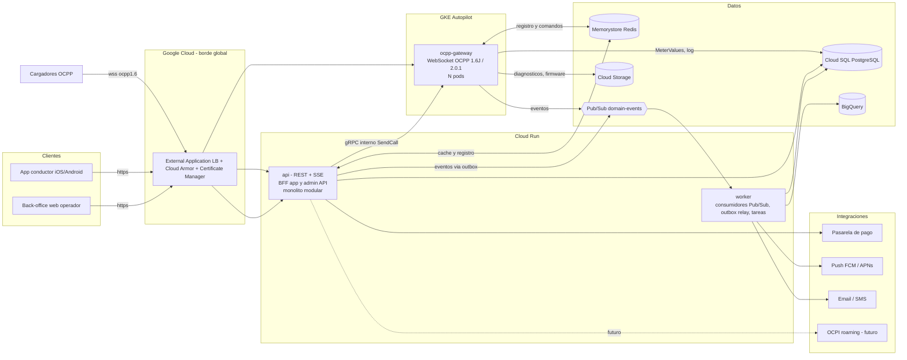
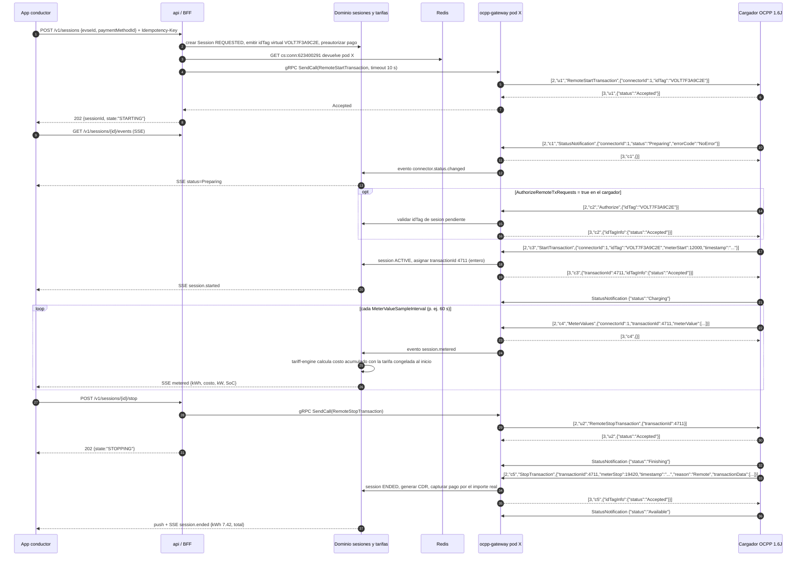
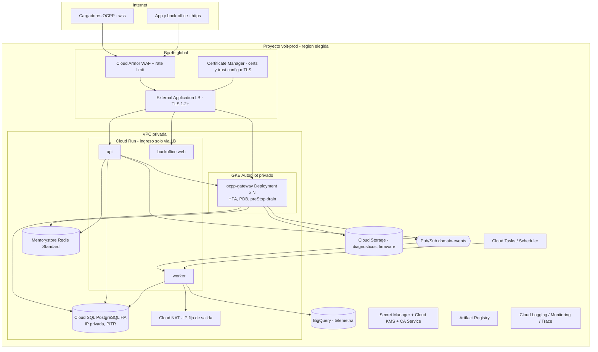

# Capítulo 2 (ARQ). Arquitectura del sistema completo y despliegue en Google Cloud

**Proyecto:** volt-platform (CSMS propio, OCPP directo con los cargadores)
**Fecha:** 2026-09-18
**Alcance de este capítulo:** descomposición del sistema (app vs CSMS), estilo arquitectónico, despliegue en Google Cloud, enrutamiento de comandos al pod que tiene el WebSocket, stack tecnológico, monorepo y costos.
**Fuera de alcance (otros capítulos):** seguridad en profundidad, motor de tarifas en detalle, plan de pruebas, migración de los cargadores.

> Nota sobre verificación: las afirmaciones marcadas **[V]** se contrastaron con la documentación oficial de Google Cloud (extractos que citan `docs.cloud.google.com`), con los repositorios y registros de paquetes de las librerías (README, feeds de releases, npm) y con comunicados de la OCA y LF Energy; las marcadas **(a confirmar)** no pudieron contrastarse con una fuente primaria y deben tratarse como estimación. Todos los precios son **de lista, orden de magnitud**, para `us-central1`, septiembre 2026, sin descuentos, y deben recalcularse en la calculadora oficial de Google Cloud para la región elegida (las regiones de Sudamérica suelen ser 20-40 % más caras, estimación).

---

## 0. Resumen ejecutivo y decisiones

| # | Decisión | Resumen |
|---|---|---|
| D1 | **La app del conductor y el CSMS son componentes distintos de un mismo sistema.** | El CSMS es el backend (gateway OCPP + dominio + back-office). La app es un cliente que consume la API pública del backend. Comparten dominio, base de datos, identidad y eventos; no comparten código de UI ni protocolo (la app nunca habla OCPP). |
| D2 | **Monolito modular hexagonal + gateway OCPP como proceso separado desde el día 1.** | Un solo despliegue de dominio (`api`) con módulos bien delimitados; el `ocpp-gateway` es un proceso aparte porque tiene un perfil de carga distinto (conexiones WebSocket persistentes). Eventos de dominio por Pub/Sub. No microservicios al inicio. |
| D3 | **GKE Autopilot para el `ocpp-gateway`; Cloud Run para `api`, `worker` y `backoffice`.** | Cloud Run limita cada request (y por tanto cada WebSocket) a 60 min como máximo y da afinidad de sesión sólo "best effort" [V]; GKE no tiene ese límite. Alternativa sin Kubernetes: Cloud Run con reconexión forzada cada < 60 min (diseño en §3.3). |
| D4 | **Borde: External Application Load Balancer global + Cloud Armor + Certificate Manager.** | TLS 1.2+ con política SSL `RESTRICTED`/`MODERN`; Security Profile 2 (TLS + Basic Auth) al lanzar; Profile 3 (mTLS) preparado con *frontend mTLS* del ALB y cabeceras de certificado hacia el gateway. |
| D5 | **Cloud SQL para PostgreSQL (Enterprise, HA, IP privada, PITR) como base transaccional; AlloyDB no al inicio.** | AlloyDB cuesta del orden de un 39 % más que Enterprise Plus (estimación con precios de lista; a confirmar en la calculadora) y no aporta nada necesario por debajo de ~5.000 cargadores. |
| D6 | **Enrutamiento de comandos: registro `chargeBoxId -> pod` en Redis + llamada gRPC interna directa al pod (GKE); Redis Pub/Sub por canal de instancia como alternativa (Cloud Run).** | Correlación CALL/CALLRESULT por `uniqueId` dentro del pod; timeouts explícitos; estado de comando persistido. |
| D7 | **Stack recomendado: Node.js/TypeScript con `ocpp-rpc` para el gateway, NestJS (o Fastify) para `api`, PostgreSQL + Drizzle/Prisma, React para back-office; app móvil React Native/Expo (repo aparte o `apps/mobile`).** | Un solo lenguaje en todo el monorepo; `ocpp-rpc` soporta 1.6J, 2.0.1J y 2.1 (con esquemas JSON de la OCA para las tres versiones) y perfiles de seguridad 1-3 [V]. CitrineOS (TypeScript, LF Energy) como referencia arquitectónica y opción "adoptar" si el tiempo manda; SteVe como referencia de comportamiento OCPP 1.6 en producción. |
| D8 | **Región según país (decisión pendiente del usuario).** | Brasil → `southamerica-east1`; Chile/Cono Sur → `southamerica-west1`; México → `northamerica-south1`; Colombia/Caribe → `us-central1`/`us-east1` (o Santiago); Europa → `europe-west1`/`europe-southwest1`. Tres proyectos GCP: dev, staging, prod. |
| D9 | **Costos (orden de magnitud, lista, sin descuentos):** ~50 cargadores: **USD 400-650/mes**; ~500: **USD 1.000-1.800/mes**; ~5.000: **USD 4.000-6.000/mes**. | Domina Cloud SQL en HA (30-40 %), luego cómputo GKE/Cloud Run, Redis y —a partir de miles de cargadores— la ingesta de logs. El tráfico OCPP en sí es barato. |

---

## 1. ¿La app del conductor y el CSMS son lo mismo?

### 1.1 Respuesta directa

**No son lo mismo, pero tampoco son dos sistemas independientes.** Son componentes distintos de un único sistema:

- El **CSMS** (Charging Station Management System) es el *backend*: recibe las conexiones OCPP de los cargadores, mantiene el estado de cada conector, autoriza, arranca y detiene cargas, mide, tarifica, liquida, alerta y expone una API. Es lo que en el PDF del proveedor se llama "Platform" ("Provide cloud-based services for charging post equipment management and charging functions", glosario §1.1). Es exactamente lo que el usuario ha decidido construir.
- La **app del conductor** es un *cliente* de ese backend (como lo era el "BankAPP"/"Operator Server" del diagrama de secuencia del PDF). No habla OCPP; habla HTTPS con la API pública. Si mañana la app se reescribe en otro framework, el CSMS no cambia. Si mañana un tercero (roaming OCPI, un banco, un marketplace) quiere iniciar cargas, consume la misma API.

La confusión es natural porque el proveedor entregaba un "API OCPP 1.6" que en realidad era la API REST de su nube para operadores, no OCPP. En la plataforma propia, **OCPP es el protocolo hacia los cargadores** y **la API REST/SSE es el protocolo hacia la app y el back-office**.

### 1.2 Descomposición en componentes

| Componente | Responsabilidad | Proceso / despliegue | Habla con |
|---|---|---|---|
| **(a1) `ocpp-gateway`** — núcleo CSMS, capa de protocolo | Servidor WebSocket persistente (`wss://.../ocpp/{chargeBoxId}`), negociación de subprotocolo (`ocpp1.6`, `ocpp2.0.1`), autenticación Basic Auth/mTLS, validación JSON Schema, correlación CALL/CALLRESULT/CALLERROR, keep-alive (ping/pong), registro de conexión en Redis, traducción de mensajes OCPP a comandos/eventos de dominio y viceversa. | Proceso propio, N réplicas en GKE Autopilot. | Cargadores (OCPP), Redis, Pub/Sub, `api` (gRPC interno), PostgreSQL (sólo escrituras de alta frecuencia: MeterValues, log de mensajes). |
| **(a2) Dominio CSMS** — activos, sesiones, autorización, tarifas, comandos, alarmas, configuración | Reglas de negocio: catálogo de estaciones/cargadores/conectores, estado agregado, ciclo de vida de la sesión (state machine), autorización de `idTag`/usuarios, motor de tarifas (franjas horarias, precio dinámico), órdenes de comando remoto, alarmas (`Faulted`, offline, temperatura), configuración deseada vs observada de cada cargador, liquidación (CDR). | Módulos dentro del monolito `api` (y ejecutados también por `worker` para trabajos asíncronos). | PostgreSQL, Redis, Pub/Sub, `ocpp-gateway` (gRPC), integraciones. |
| **(b) Back-office web del operador** | Mapa y lista de cargadores con estado en vivo, sesiones, comandos remotos (Reset, UnlockConnector, ChangeAvailability, ChangeConfiguration, TriggerMessage, UpdateFirmware, GetDiagnostics, SetChargingProfile), tarifas, usuarios/RFID, alarmas, reportes, parámetros de plataforma, auditoría. | SPA (React) servida por Cloud Run o Cloud Storage + LB; usa `/admin/v1/*` de `api`. Protegida además con Identity-Aware Proxy (IAP) o SSO. | `api`. |
| **(c) API pública / BFF para la app** | Endpoints `/v1/*` orientados al conductor: localizar cargadores, ver precio vigente, iniciar/detener carga, progreso en vivo (SSE), historial y recibos, métodos de pago, perfil. Autenticación con Identity Platform/Firebase Auth (OIDC). | Mismo proceso `api` (módulo BFF) en Cloud Run. | Dominio, pasarela de pago, push. |
| **(d) App móvil del conductor** | iOS/Android. Mapa, escaneo QR del conector (el QR codifica el `evseId`, equivalente al `connectorCode` del PDF = `chargePointSerialNumber + connectorId`), inicio/parada, progreso en vivo, pagos, recibos, notificaciones. | React Native/Expo o Flutter. Repo `apps/mobile` o repo aparte. | `api` (HTTPS + SSE), FCM/APNs. |
| **(e) Integraciones** | Pasarela de pago (preautorización = `startAmount` del PDF, captura al final = `actualAmount`), mapas (Google Maps Platform), push (FCM), correo/SMS, facturación electrónica (depende del país), OCPI para roaming (futuro), ERP/contabilidad. | Adaptadores dentro de `api`/`worker`. | Proveedores externos. |

### 1.3 Qué comparten y qué no

| Comparten | No comparten |
|---|---|
| **Modelo de dominio** (`packages/domain`): entidades `ChargePoint`, `Connector/EVSE`, `ChargingSession`, `Tariff`, `IdToken`, `Command`, `Alarm`, sus estados y reglas. | **UI**: la app y el back-office tienen interfaces y ciclos de release propios. |
| **Base de datos** (una PostgreSQL con esquemas por módulo; la app la ve sólo a través de la API). | **Protocolo hacia el cargador**: sólo el `ocpp-gateway` habla OCPP. |
| **Identidad**: un IdP (Identity Platform) con dos "audiencias"/tenants de roles: conductores y operadores; JWT de corta vida; RBAC en `api`. | **Credenciales**: la app usa OIDC/JWT; el cargador usa Basic Auth (Profile 2) o certificado (Profile 3). |
| **Eventos de dominio** (Pub/Sub): `session.started`, `session.metered`, `connector.status.changed`… alimentan SSE de la app, notificaciones, BigQuery y alarmas. | **Ciclo de vida de despliegue**: gateway (GKE) y api (Cloud Run) se despliegan por separado; la app va a las tiendas. |
| **Contratos** (`packages/ocpp-schemas`, OpenAPI de la API, esquemas de eventos). | **Escalado**: el gateway escala por conexiones; la api por requests. |

### 1.4 Contrato de API entre app y backend

Estilo: **REST JSON versionado (`/v1`) + SSE para progreso en vivo + push (FCM) para segundo plano.** GraphQL no al inicio (añade complejidad de caché/autorización sin ventaja clara para 20-30 endpoints). WebSocket cliente-servidor tampoco: SSE es unidireccional, atraviesa proxies y el ALB sin configuración especial y basta para "progreso de carga".

Endpoints mínimos (con su equivalente en el PDF del proveedor como referencia de dominio):

| Endpoint | Descripción | Referencia PDF |
|---|---|---|
| `GET /v1/locations?lat&lng&radiusKm` | Estaciones cercanas con `evses[]` y estado (`AVAILABLE`, `PREPARING`, `CHARGING`, `SUSPENDED_EVSE`, `SUSPENDED_EV`, `FINISHING`, `RESERVED`, `UNAVAILABLE`, `FAULTED`, `OFFLINE`). | §2.1.1 `stationResponse` (`stationName`, `address`, `latitude`, `longitude`, `businessHours`) y `connectorResponse.connectorStatus` (mismos valores). |
| `GET /v1/evses/{evseId}` | Detalle del conector: tipo (`TYPE_2`, `CCS`, `CHAdeMO`…), potencia máxima, tarifa vigente y próximas franjas. | §2.1.1 `connectorType`, `powerUpperLimits`, `priceTemplateSnapshotResponse` (`priceData[{timeRange,price}]`, `priceTemplateTypeEnum` `UNIFORM_PRICE`/`TIME_SLOT_PRICING`, `defaultPrice`). |
| `POST /v1/sessions` (header `Idempotency-Key`) | Solicita inicio de carga: `{evseId, paymentMethodId, preAuthAmount?}` → `202 {sessionId, state:"STARTING"}`. | §2.2.1 `/api/connector/{version}/start` (`connectorCode`, `startAmount`, `thirdPartyTransactionId`). |
| `GET /v1/sessions/{id}` | Estado, kWh, costo acumulado, potencia, tensión, corriente, SoC, duración. | §2.1.3 `lastProcessData` (`electricity`, `cost`, `duration`, `outputPower`, `outputVoltage`, `outputCurrent`, `socValue`). |
| `GET /v1/sessions/{id}/events` (SSE) | Flujo de eventos `status`, `metered`, `ended`, `error`. Sustituye el *polling* del PDF. | El PDF sólo ofrecía polling y webhooks `notification_start_result`/`notification_stop_result`. |
| `POST /v1/sessions/{id}/stop` | Solicita parada → `202 {state:"STOPPING"}`. | §2.2.2 `/api/connector/{version}/stop`. |
| `GET /v1/sessions?state=ENDED` / `GET /v1/sessions/{id}/receipt` | Historial y recibo: energía total, tiempo, importe, descuento, motivo de fin. | §2.1.2/§2.3.3 (`totalPower`, `totalTime`, `totalAmount`, `reduceAmount`, `actualAmount`, `endReason`, `payStatus`). |
| `POST /v1/payment-methods`, `POST /v1/webhooks/payments` | Alta de tarjeta/tokenización y webhook de la pasarela. | El ejemplo `thirdPartyTransactionId: "pi_3Omon..."` del PDF tiene formato de PaymentIntent de Stripe. |

Ejemplo de respuesta de progreso (`GET /v1/sessions/{id}`):

```json
{
  "id": "6f1d0c2e-8f0e-4c9a-9b7e-2f5a1d3c4b5a",
  "state": "ACTIVE",
  "evseId": "6234002911",
  "chargeBoxId": "623400291",
  "connectorId": 1,
  "ocppTransactionId": 4711,
  "startedAt": "2026-09-18T14:03:07Z",
  "elapsedSeconds": 1260,
  "energyKwh": 7.42,
  "powerKw": 21.6,
  "voltageV": 231.1,
  "currentA": 31.2,
  "soc": 58,
  "cost": { "amount": 3.71, "currency": "XXX", "tariffId": "tar_2026_09_v3", "breakdown": [ { "component": "ENERGY", "kwh": 7.42, "unitPrice": 0.50, "amount": 3.71 } ] },
  "preAuth": { "amount": 20.00, "currency": "XXX", "paymentIntentId": "pi_..." },
  "links": { "events": "/v1/sessions/6f1d.../events", "stop": "/v1/sessions/6f1d.../stop" }
}
```

(`currency` queda como decisión pendiente: el usuario no ha indicado país ni moneda.)

Máquina de estados de la sesión (la app sólo ve estos estados):

`REQUESTED → STARTING → ACTIVE → STOPPING → ENDED → SETTLED`, con salidas `FAILED` (RemoteStart `Rejected`, timeout sin `StartTransaction`, cargador offline) y `CANCELLED` (usuario cancela antes de `StartTransaction`).

---

## 2. Estilo arquitectónico

### 2.1 Monolito modular hexagonal, con el gateway OCPP separado

**Qué es:** un solo código base de dominio (`packages/domain`) organizado por *bounded contexts* (módulos) con **puertos** (interfaces) y **adaptadores** (PostgreSQL, Redis, Pub/Sub, pasarela de pago, OCPP). Se despliega como dos procesos:

1. `ocpp-gateway` — adaptador de entrada/salida para OCPP; sin reglas de negocio pesadas; mantiene conexiones.
2. `api` — el monolito modular (BFF app + admin API + dominio + adaptadores), más `worker` (mismo código, consumidor de Pub/Sub y tareas programadas).

**Por qué no microservicios al inicio:**

- Con un equipo pequeño, 6-10 servicios implican 6-10 pipelines, contratos internos, *tracing* distribuido y fallos parciales que hay que diseñar. El dominio de un CSMS es muy transaccional (sesión ↔ medición ↔ tarifa ↔ pago) y se beneficia de transacciones ACID locales.
- El único componente con un perfil de carga realmente distinto es el gateway (conexiones persistentes, memoria por conexión, drenado ordenado). Por eso **ese** se separa desde el día 1; el resto no.
- Los módulos se extraen a servicios cuando haya evidencia (equipo > 8-10 personas, un módulo con escalado o ciclo de release muy distinto, p. ej. OCPI o el motor de smart charging). Con puertos y adaptadores, la extracción es mecánica.

**Módulos (bounded contexts) de `packages/domain`:**

| Módulo | Agregados | Comandos | Eventos que emite |
|---|---|---|---|
| `assets` | `Location`, `ChargePoint`, `Evse/Connector`, `ConfigProfile` | RegisterChargePoint, ApplyConfigProfile, SetAvailability | `charger.registered`, `charger.booted`, `charger.connected/disconnected`, `connector.status.changed`, `charger.config.drifted` |
| `sessions` | `ChargingSession`, `MeterValue` | RequestStart, HandleStartTransaction, RecordMeterValues, RequestStop, HandleStopTransaction | `session.requested/started/metered/stop_requested/ended/failed` |
| `authorization` | `IdToken` (RFID, virtual de app), `Driver`, `LocalAuthList` | Authorize(idTag), IssueVirtualIdTag, SyncLocalList | `authorization.granted/denied` |
| `tariffs` | `Tariff`, `TariffElement`, `PriceSchedule` (precios dinámicos por franja, día, potencia, ocupación) | PublishTariff, QuotePrice(evse, ts), PriceSession(session) | `tariff.published`, `session.priced` |
| `commands` | `RemoteCommand` (Reset, Unlock, ChangeConfiguration, TriggerMessage, UpdateFirmware…) | Dispatch, RecordResult | `command.sent/completed/timed_out` |
| `alarms` | `Alarm` | RaiseAlarm, Ack, Resolve | `alarm.raised/resolved` |
| `billing` | `CDR` (charge detail record), `Payment`, `Invoice` | PreAuthorize, Capture, Refund, IssueReceipt | `session.settled`, `payment.failed` |
| `settings` | `Setting` (plataforma / estación / cargador), con JSON Schema | UpdateSetting | `setting.changed` |
| `ocpi` (futuro) | `Party`, `Token`, `CDR` OCPI | — | — |

**Puertos y adaptadores principales:**

| Puerto (interfaz en dominio) | Adaptador | Usado por |
|---|---|---|
| `ChargePointCommandPort.send(chargeBoxId, action, payload, timeout)` | gRPC → `ocpp-gateway` (GKE) / Redis Pub/Sub (Cloud Run) | `commands`, `sessions` |
| `SessionRepository`, `ChargePointRepository`, … | PostgreSQL (Drizzle/Prisma) | todos |
| `EventPublisher.publish(event)` | Outbox en PostgreSQL → relay → Pub/Sub | todos |
| `ConnectionRegistry` | Redis (`cs:conn:{chargeBoxId}`) | gateway, `commands` |
| `PaymentGateway` | Stripe/Adyen/pasarela local (decisión pendiente por país) | `billing` |
| `Notifier` | FCM, email (SendGrid/SES), SMS | `worker` |
| `Clock`, `IdGenerator` | sistema | pruebas deterministas |

### 2.2 Eventos de dominio por Pub/Sub

- **Patrón outbox transaccional:** el dominio escribe el evento en `event_outbox` en la misma transacción que el cambio de estado; un relay (en `worker`, o Debezium más adelante) lo publica en Pub/Sub. Así nunca se pierde un evento ni se publica uno cuyo commit falló.
- **Topología:** un topic `domain-events` con atributos `type`, `tenantId`, `aggregateType`; suscripciones con filtros (`attributes.type = "session.metered"`) por consumidor: `sse-fanout`, `notifications`, `alarms`, `bigquery-export` (suscripción BigQuery nativa, USD 50/TiB), `audit`. `ordering_key = chargeBoxId` cuando importa el orden (estado de conector, mediciones).
- **Sobre (envelope) JSON, versionado:**

```json
{
  "id": "evt_01J8Z3K4M5N6P7Q8R9S0T1U2V3",
  "type": "session.metered",
  "version": 1,
  "occurredAt": "2026-09-18T14:24:07.512Z",
  "tenantId": "t_volt",
  "aggregate": { "type": "session", "id": "6f1d0c2e-8f0e-4c9a-9b7e-2f5a1d3c4b5a" },
  "source": "ocpp-gateway/pod-7c9f",
  "trace": { "traceId": "4bf92f3577b34da6a3ce929d0e0e4736" },
  "data": {
    "chargeBoxId": "623400291", "connectorId": 1, "ocppTransactionId": 4711,
    "timestamp": "2026-09-18T14:24:05Z",
    "samples": [
      { "measurand": "Energy.Active.Import.Register", "value": 12345.6, "unit": "Wh", "context": "Sample.Periodic" },
      { "measurand": "Power.Active.Import", "value": 21600, "unit": "W" },
      { "measurand": "SoC", "value": 58, "unit": "Percent" }
    ],
    "cost": { "amount": 3.71, "currency": "XXX" }
  }
}
```

- Los mensajes OCPP crudos (`ocpp_message_log`) **no** van por Pub/Sub uno a uno; se escriben en lote a PostgreSQL (partición mensual, retención 30-90 días) y se exportan a BigQuery.

### 2.3 Diagrama de componentes



### 2.4 Secuencia: "el conductor inicia carga desde la app" (OCPP 1.6J real)



Notas de protocolo que condicionan el diseño:

- **Formato OCPP-J:** `CALL = [2, uniqueId, action, payload]`, `CALLRESULT = [3, uniqueId, payload]`, `CALLERROR = [4, uniqueId, errorCode, errorDescription, details]`. `uniqueId` es una cadena que genera quien envía el CALL; el receptor la devuelve en la respuesta. El gateway mantiene por conexión un mapa `uniqueId → promesa pendiente + deadline`.
- **Sincronía OCPP-J:** cada parte no debe enviar un nuevo CALL hasta recibir la respuesta al anterior; por eso el gateway mantiene **una cola de salida por conexión** y serializa los comandos hacia un mismo cargador (es la regla de sincronicidad de la especificación OCPP-J 1.6, sección "Synchronicity", §4.1.1; número de sección a confirmar contra el PDF de la OCA).
- **`idTag`:** `CiString20Type` (máx. 20 caracteres) en 1.6; el `idTag` "virtual" que emite la app debe caber en 20 caracteres (`VOLT` + 16 hex, por ejemplo) y ser de un solo uso ligado a la sesión.
- **`transactionId`:** entero generado por el CSMS en `StartTransaction.conf`; usar una secuencia PostgreSQL y guardar el mapeo a la sesión (UUID).
- **`AuthorizeRemoteTxRequests`:** si es `true`, el cargador envía `Authorize.req` antes de `StartTransaction`; si es `false`, arranca directo. El CSMS debe soportar ambos y validar `idTag` en `StartTransaction` de todas formas (respondiendo `idTagInfo.status` `Invalid` si no coincide con una sesión pendiente, y confiando en `StopTransactionOnInvalidId=true`).
- **Timeout de arranque:** tras `RemoteStartTransaction` `Accepted`, si no llega `StartTransaction` en `ConnectionTimeOut` (configurable en el cargador, p. ej. 120 s; el conductor no enchufó), la sesión pasa a `FAILED` y se libera la preautorización.
- **Duplicados tras reconexión:** el cargador reintenta `StartTransaction`/`StopTransaction`/`MeterValues` (`TransactionMessageAttempts`, `TransactionMessageRetryInterval`) si no recibió respuesta; deduplicar por (`chargeBoxId`, `connectorId`, `timestamp`, `meterStart`) y por `uniqueId`.
- **Los estados de conector** que la app muestra son exactamente los `ChargePointStatus` de 1.6 (`Available`, `Preparing`, `Charging`, `SuspendedEVSE`, `SuspendedEV`, `Finishing`, `Reserved`, `Unavailable`, `Faulted`) más `OFFLINE` derivado de la conectividad; coincide con `connectorStatus` del PDF §2.1.1.

### 2.5 Parámetros configurables: tres niveles

El usuario pidió "configurar distintos parámetros". Se separan en tres capas para no mezclar conceptos:

1. **Parámetros de plataforma** (tabla `setting`, JSON validado por esquema): p. ej. `session.startTimeoutSeconds`, `session.preAuthDefaultAmount`, `heartbeat.offlineAfterMultiplier`, `notifications.*`, `pricing.roundingRule`, `ocpp.defaultConfigProfileId`.
2. **Configuración OCPP del cargador** ("estado deseado" vs "observado"): un `ConfigProfile` por modelo/uso que el gateway reconcilia tras `BootNotification` con `GetConfiguration` + `ChangeConfiguration`, registrando `RebootRequired`/`NotSupported`/`Rejected`. Ejemplo de perfil (claves estándar OCPP 1.6 verificadas en la enumeración `ConfigurationKey` de la librería `ocpp` de The Mobility House):

```json
{
  "id": "cp_ac_default_v2",
  "appliesTo": { "vendor": "*", "model": "*" },
  "keys": {
    "HeartbeatInterval": "300",
    "WebSocketPingInterval": "60",
    "MeterValueSampleInterval": "60",
    "MeterValuesSampledData": "Energy.Active.Import.Register,Power.Active.Import,Current.Import,Voltage,SoC",
    "ClockAlignedDataInterval": "900",
    "MeterValuesAlignedData": "Energy.Active.Import.Register",
    "StopTxnSampledData": "Energy.Active.Import.Register",
    "AuthorizeRemoteTxRequests": "false",
    "LocalPreAuthorize": "false",
    "LocalAuthorizeOffline": "true",
    "AllowOfflineTxForUnknownId": "false",
    "StopTransactionOnInvalidId": "true",
    "StopTransactionOnEVSideDisconnect": "true",
    "UnlockConnectorOnEVSideDisconnect": "true",
    "ConnectionTimeOut": "120",
    "TransactionMessageAttempts": "5",
    "TransactionMessageRetryInterval": "30",
    "LocalAuthListEnabled": "true",
    "AuthorizationCacheEnabled": "true"
  },
  "securityKeys": { "SecurityProfile": "2", "CpoName": "VOLT" }
}
```

3. **Tarifas** (versionadas, con vigencia): modelo tipo OCPI `Tariff/TariffElement/PriceComponent(ENERGY|TIME|FLAT|PARKING_TIME)` + `TariffRestrictions` (`start_time`, `end_time`, `day_of_week`, `min_kwh`, `max_power`), que cubre el `TIME_SLOT_PRICING` + `defaultPrice` del PDF y deja preparado el roaming. El "precio dinámico" (por hora, ocupación, señal externa) se implementa como un `PriceSchedule` calculado por `worker` y **congelado en la sesión** (`tariff_snapshot`) al arrancar, para que el recibo sea reproducible.

---

## 3. Google Cloud: dónde corre cada componente

### 3.1 Hechos verificados que deciden la plataforma del gateway

| Hecho | Fuente | Implicación |
|---|---|---|
| Cloud Run: timeout de request **por defecto 5 min, máximo 60 min**; los WebSockets se tratan como requests HTTP largas y se cortan al vencer el timeout, aunque el servidor no imponga timeouts. [V] | Doc "Using WebSockets" y "Configure request timeout" de Cloud Run. | Cada cargador se desconectaría al menos cada 60 min; hay que forzar reconexión ordenada antes. |
| Cloud Run: afinidad de sesión **best effort**; una nueva conexión puede caer en otra instancia; hay que sincronizar estado entre instancias (Google sugiere Memorystore). [V] | Ídem. | No se puede "apuntar" a una instancia concreta; el enrutamiento de comandos debe ir por Redis Pub/Sub. |
| Cloud Run: una instancia con **cualquier WebSocket abierto se considera activa y se factura como instance-based** (CPU siempre asignada); mínimo 512 MiB con facturación por instancia; máx. **1.000 requests concurrentes por instancia** (por defecto 80 desde la consola). [V] | Ídem + doc de concurrencia y de billing settings. | Costo proporcional al número de instancias vivas, no al tráfico; 1.000 cargadores por instancia como techo duro. |
| GKE Autopilot: se factura por recursos **solicitados por los pods** (us-central1 ≈ USD 0,0445/vCPU-h y 0,0049/GiB-h, lista) + USD 0,10/h por clúster (un clúster cubierto por el crédito gratuito de USD 74,40/mes por cuenta de facturación). [V] **Sin límite de duración de conexión** a nivel de pod. | Página de precios de GKE. | Plataforma natural para conexiones persistentes; se paga por lo que piden los pods. |
| External Application LB global: soporta WebSocket; el **timeout del backend service (por defecto 30 s; configurable de 1 a 2.147.483.647 s) actúa como timeout de inactividad** de un WebSocket; las conexiones **activas** no se ven afectadas por ese timeout pero **se cierran a las 24 h** (límite fijo, no configurable). [V] | Doc de backend services / GKE Gateway. | Subir `timeoutSec` del backend (p. ej. 3.600 s), enviar ping desde el gateway cada 30-60 s, y aceptar una reconexión diaria por cargador (los cargadores OCPP reconectan solos). |
| Los Application Load Balancers soportan **mTLS de frontend**: el LB pide certificado al cliente y lo valida contra un *trust config* de Certificate Manager; puede reenviar al backend cabeceras con `{client_cert_present}`, `{client_cert_chain_verified}`, `{client_cert_sha256_fingerprint}`, `{client_cert_subject_dn}`, `{client_cert_error}`, etc. **El LB no comprueba revocación (ni CRL ni OCSP)**; el *trust config* no admite CRL. [V] | Doc "Mutual TLS overview" y guías de configuración. | Security Profile 3 es viable terminando TLS en el ALB (sin perder Cloud Armor), siempre que el gateway haga el *binding* certificado ↔ `chargeBoxId` con esas cabeceras. |
| Políticas SSL del LB: perfiles `COMPATIBLE`, `MODERN`, `RESTRICTED`, `FIPS_202205` y `CUSTOM`; versión mínima configurable 1.0/1.1/1.2 (no se puede fijar 1.3 como mínimo; TLS 1.3 se negocia si el cliente lo soporta; `FIPS_202205` exige mínimo 1.2). Los perfiles se diferencian en las suites permitidas para TLS ≤ 1.2: las suites RSA sin ECDHE (`TLS_RSA_WITH_AES_128_GCM_SHA256`, `TLS_RSA_WITH_AES_256_GCM_SHA384`) sólo están en `COMPATIBLE` o en un `CUSTOM` que las incluya (a confirmar en la tabla de suites de la doc). [V] | Doc "SSL policies overview"; CIS GCP Benchmark 3.9. | Imponer mínimo TLS 1.2 (requisito de los perfiles 2 y 3 de OCPP). |
| Cloud Armor: evalúa **sólo** la request HTTP de *upgrade* del WebSocket (puede impedir que se establezca el canal por IP/geo/rate limit), pero **no inspecciona los mensajes posteriores** del canal; precio Standard USD 5/política-mes, 1/regla-mes, 0,75 por millón de requests (lista). [V] | Doc "Security policy overview" y precios de Cloud Armor. | WAF y rate limit para `/v1` y `/admin`; en `/ocpp` umbrales altos por IP (muchos cargadores salen por NAT de operador móvil con la misma IP). |

### 3.2 Decisión: GKE Autopilot para el gateway, Cloud Run para el resto

**`ocpp-gateway` en GKE Autopilot** porque:

1. No hay límite de 60 min: un cargador puede quedarse conectado horas o días (sólo el corte de 24 h del ALB; para evitarlo, un External proxy Network LB (TCP) en *passthrough*; que un ALB regional no tenga el mismo corte de 24 h queda **a confirmar**: varias fuentes indican que aplica a todos los ALB).
2. Los pods son direccionables (Service *headless* + IP de pod), lo que permite el enrutamiento de comandos más simple y rápido (§4).
3. Control del drenado (`preStop`, `terminationGracePeriodSeconds`, `PodDisruptionBudget`) para cerrar conexiones de forma escalonada y evitar tormentas de reconexión.
4. Autopilot elimina la gestión de nodos: se declara CPU/memoria por pod y Google opera el plano de control y los nodos. El "costo Kubernetes" operativo se reduce a manifiestos/Helm y un clúster.

**`api`, `worker`, `backoffice` en Cloud Run** porque:

1. Requests cortas (REST) y SSE de pocos minutos; escalado a cero para `worker` fuera de hora y despliegues por revisión con tráfico gradual.
2. SSE hacia la app: la app reconecta al SSE cada < 60 min (o al recibir `retry:`); es transparente para el usuario.
3. Menos superficie operativa y facturación por uso.

**Alternativa sin Kubernetes (si el usuario quiere evitar GKE):** ver §3.3. Es viable hasta unos cientos de cargadores; a partir de ~1.000-2.000 el costo (instancias siempre activas) y la complejidad del *reconnect* cada hora hacen que GKE sea mejor.

### 3.3 Diseño de la alternativa "Cloud Run para el gateway"

- Servicio `ocpp-gateway` en Cloud Run con `--timeout=3600`, `--concurrency=800` (margen bajo el máximo de 1.000), `--min-instances=2`, facturación por instancia (obligatoria con WebSockets), `--session-affinity`, `--cpu=1 --memory=1Gi`.
- El gateway lleva un reloj por conexión: a los **~55 min** envía `WebSocket Close` con código `1012 (Service Restart)` de forma escalonada (jitter de ±5 min por conexión para no sincronizar cierres). Los cargadores OCPP deben reconectar solos (es el comportamiento esperado de un cliente OCPP-J, pero el *backoff* y la tolerancia al código 1012 dependen del firmware: verificar con el proveedor).
- Antes de cerrar, si hay una transacción activa no pasa nada: OCPP 1.6 tolera desconexiones (el cargador encola `MeterValues`/`StopTransaction` y los reenvía).
- El registro `cs:conn:{chargeBoxId}` guarda `instanceId` (obtenido de la metadata del contenedor) y cada instancia se suscribe a su canal `cs:cmd:{instanceId}` en Redis Pub/Sub; los comandos viajan por ahí (§4.2, opción A). Como Cloud Run no permite llamar a una instancia concreta, ésta es la única opción.
- Límite práctico: 1.000 conexiones por instancia; a 5.000 cargadores serían ≥ 7 instancias siempre activas (~USD 350-400/mes sólo en gateway) y 5.000 reconexiones/hora: funciona, pero GKE lo hace más barato y sin reconexión forzada.

### 3.4 Borde: ALB + Cloud Armor + Certificate Manager (WSS, TLS 1.2+, mTLS)

- **Un External Application Load Balancer global** con dos hosts: `ocpp.<dominio>` → backend NEG del gateway en GKE (vía Gateway API `gke-l7-global-external-managed`, `GCPBackendPolicy.timeoutSec: 3600`, `HealthCheckPolicy` a `/healthz`); `api.<dominio>` y `admin.<dominio>` → Serverless NEGs de Cloud Run. Alternativa para evitar el corte de 24 h: External proxy Network LB (TCP, passthrough) hasta los pods (opción B de Profile 3, más abajo). Que un ALB regional evite el corte queda **a confirmar** (varias fuentes indican que el límite de 24 h aplica a todos los ALB); no diseñar contando con ello. `GCPBackendPolicy.timeoutSec` admite de 1 a 2.147.483.647 s [V].
- **Certificate Manager:** certificados gestionados por Google (DNS authorization) para los tres hosts; **política SSL** con `minTlsVersion: TLS_1_2` y perfil `MODERN` (o `RESTRICTED` si ningún cargador antiguo se queda fuera). **Probar con los cargadores reales antes de fijar el perfil:** las suites que el OCPP 1.6 Security Whitepaper y los PICS de certificación 1.6 de la OCA exigen o permiten son `TLS_ECDHE_ECDSA_WITH_AES_128_GCM_SHA256`, `TLS_ECDHE_ECDSA_WITH_AES_256_GCM_SHA384`, `TLS_RSA_WITH_AES_128_GCM_SHA256` y `TLS_RSA_WITH_AES_256_GCM_SHA384` [V]; muchos cargadores 1.6 sólo implementan las dos `TLS_RSA_*`, que **no están en `MODERN` ni en `RESTRICTED`** (a confirmar en la tabla de suites de la doc de SSL policies). Si un modelo sólo negocia `TLS_RSA_*`, usar un perfil `CUSTOM` con exactamente esas cuatro suites y TLS 1.2 mínimo, y registrarlo como deuda técnica ligada a ese modelo de cargador. Nota: el certificado del servidor de `ocpp.<dominio>` debe ser RSA (o tener un par RSA + ECDSA) para que las suites `TLS_RSA_*`/`ECDHE_RSA` funcionen.
- **Security Profile 2 (lanzamiento):** TLS en el ALB + HTTP Basic Auth verificado por el gateway (`usuario = chargeBoxId`, `contraseña = AuthorizationKey` por cargador, almacenada con hash Argon2id; rotación con `ChangeConfiguration(AuthorizationKey)`). El LB reenvía la cabecera `Authorization` sin tocarla.
- **Security Profile 3 (preparado):** dos formas:
  - **Opción A — mTLS de frontend en el ALB (recomendada):** `trust config` en Certificate Manager con la CA raíz/intermedia que emite los certificados de cargador (CA propia en **Certificate Authority Service** de Google, tier DevOps, o la CA del fabricante); `clientValidationMode: REJECT_INVALID` (o `ALLOW_INVALID_OR_MISSING_CLIENT_CERT` en transición, decidiendo en el gateway); cabeceras personalizadas `X-Client-Cert-Present: {client_cert_present}`, `X-Client-Cert-Verified: {client_cert_chain_verified}`, `X-Client-Cert-Fingerprint: {client_cert_sha256_fingerprint}`, `X-Client-Cert-Subject: {client_cert_subject_dn}`; el gateway exige que la huella coincida con la registrada para ese `chargeBoxId` (el CN/SAN debe contener el `chargeBoxId`). Se conserva Cloud Armor. Limitación confirmada [V]: el LB **no comprueba revocación** (ni CRL ni OCSP; el *trust config* no admite CRL); se compensa con una lista de huellas/seriales revocados en el gateway (usando las cabeceras reenviadas) y certificados de vida corta. CA Service sólo emite CRL (no OCSP), así que la CRL sirve para auditoría, no para que el LB la consulte.
  - **Opción B — TLS terminado en el gateway:** External proxy Network LB (TCP) en *passthrough* hasta los pods, que hacen el handshake mTLS con `ws` + Node TLS. Se pierde el WAF L7 de Cloud Armor (sólo reglas L3/L4). Sólo si el fabricante exige algo que el ALB no soporte (p. ej. verificación de cadena a más profundidad).
  - Los mensajes del Security Whitepaper (`SignCertificate`, `CertificateSigned`, `InstallCertificate`, `GetInstalledCertificateIds`, `DeleteCertificate`, `SecurityEventNotification`, `SignedUpdateFirmware`, `GetLog`, `ExtendedTriggerMessage`) se implementan en el gateway con independencia de la opción.
- **Cloud Armor:** política con reglas preconfiguradas OWASP (`sqli`, `xss`, `rce`, `lfi`, `scannerdetection`) en `/v1` y `/admin`; *rate limit* por IP en `/v1/sessions` (p. ej. 60/min) y por `X-User-Id` cuando se pueda; en `/ocpp/*` sólo denylist geo/IP y umbral alto (p. ej. 600 conexiones/min por IP) por el NAT de las operadoras móviles; *Adaptive Protection* si el plan lo incluye.
- **Cloud NAT** para el egreso de pods privados (webhooks a la pasarela, FCM); IP fija saliente útil para *allowlists* de terceros.

### 3.5 Datos, mensajería y almacenamiento

| Servicio | Uso | Decisión y configuración inicial |
|---|---|---|
| **Cloud SQL para PostgreSQL 16/17, edición Enterprise** | Verdad transaccional: activos, sesiones, tarifas, comandos, outbox, mediciones recientes (particionadas). | `db-custom-2-8192` en dev/50 cargadores; `db-custom-4-16384` **HA regional** en prod desde 500; IP privada (Private Service Connect / private services access), backups automáticos + **PITR** (WAL 7 días), *Cloud SQL Auth Proxy* o conector Go/Node con IAM DB auth, `pgBouncer` sidecar o `max_connections` acorde a réplicas. Enterprise Plus (del orden de +30 % por vCPU/GiB, estimación con precios de lista) sólo si hace falta *data cache* o failover más rápido. |
| **AlloyDB** | No al inicio. | Del orden de un 39 % más caro que Enterprise Plus (estimación con precios de lista: ≈ USD 0,066/vCPU-h y 0,0112/GiB-h en `us-central1`, a confirmar); ventajas (columnar, ML, escritura alta) no se necesitan por debajo de decenas de miles de cargadores. Migración posible después (compatible PostgreSQL). |
| **Memorystore for Redis (Standard tier, 1-5 GiB) o Memorystore for Valkey (GA desde el 18 de abril de 2025 [V])** | (1) registro `chargeBoxId → pod/instancia`, (2) Pub/Sub de comandos y desalojo de conexiones duplicadas, (3) caché de estado de conectores para `/v1/locations`, (4) rate limit y locks (`SET NX PX`), (5) contadores en vivo de sesiones. | Standard (réplica) en prod; Basic en dev. Versión ≥ 7. Sin persistencia obligatoria: todo es reconstruible. |
| **Pub/Sub** | Eventos de dominio (`domain-events`) + suscripción BigQuery para telemetría + *dead-letter topics*. | USD 40/TiB, 10 GiB gratis/mes; suscripciones BigQuery USD 50/TiB [V]; a 5.000 cargadores el tráfico de eventos son decenas de GB/mes: irrelevante. Límites que importan: **1 MB/s de publicación por `ordering_key`** [V] (con `ordering_key = chargeBoxId` sobra: un cargador genera pocos KB/s), mensaje máx. 10 MB, y con ordenación hay que publicar desde la misma región y reanudar tras un fallo de publicación (`resumePublish`). |
| **Cloud Tasks / Cloud Scheduler** | Tasks: timeouts de sesión ("si no llega `StartTransaction` en 120 s"), reintentos de captura de pago, envío de recibos. Scheduler: cálculo de precios dinámicos cada hora, `TriggerMessage(StatusNotification)` a cargadores silenciosos, limpieza de particiones, exportaciones. | Endpoints privados en `worker` (Cloud Run) con OIDC. |
| **Cloud Storage** | Ficheros de `GetDiagnostics`/`GetLog` (URL firmada de subida que el cargador usa por HTTP/FTP), binarios de firmware para `UpdateFirmware`/`SignedUpdateFirmware` (URL firmada de descarga), exportes. | Buckets por entorno, *lifecycle* 90 días para diagnósticos, CMEK opcional. Ojo: muchos cargadores 1.6 sólo soportan FTP/HTTP sin TLS para diagnósticos; preguntar al proveedor. |
| **BigQuery** | Telemetría (`MeterValues`, estados, mensajes OCPP) y analítica (utilización, ingresos, fallos, energía por franja). | Suscripción Pub/Sub → tabla particionada por día y *clustered* por `charge_box_id`; retención larga barata (≈ USD 0,02-0,023/GiB-mes de almacenamiento activo, lista; consulta bajo demanda USD 6,25/TiB, 1 TiB/mes gratis) [V]. |
| **Secret Manager + Cloud KMS** | Secretos de la pasarela, claves JWT, contraseñas de BD, CA intermedia (KMS/CAS), cifrado de campos sensibles (tokens de pago nunca se almacenan; sólo el `paymentMethodId` de la pasarela). | Rotación programada; acceso por Workload Identity, nunca claves JSON de cuentas de servicio. |
| **Artifact Registry** | Imágenes OCI de `ocpp-gateway`, `api`, `worker`, `backoffice`; escaneo de vulnerabilidades; firma con Binary Authorization opcional. | Un registro por proyecto, promoción de imágenes por digest de staging a prod. |
| **CI/CD** | **GitHub Actions + Workload Identity Federation** (`google-github-actions/auth` sin claves) para build/test/push y despliegue; Cloud Build sólo si se prefiere todo dentro de GCP. | Pipelines: `ci.yml` (lint, test, contract tests OCPP con simulador), `deploy-staging.yml` (automático), `deploy-prod.yml` (manual + aprobación). |
| **Terraform** | Toda la infraestructura (proyectos, VPC, LB, Cloud Armor, GKE, Cloud Run, Cloud SQL, Redis, Pub/Sub, IAM, Secret Manager, alertas). | `infra/terraform/modules` + `infra/terraform/envs/{dev,staging,prod}`; estado en GCS con bloqueo; *plan* en PR, *apply* por CD. |
| **Observabilidad** | Cloud Logging (JSON estructurado, `chargeBoxId`/`sessionId`/`traceId` en cada línea), Cloud Monitoring (métricas custom: conexiones por pod, latencia `RemoteStart→StartTransaction`, mensajes/s, comandos con timeout, cargadores offline), Cloud Trace vía OpenTelemetry, alertas a correo/Slack/PagerDuty; *uptime checks* en `/healthz`. | **Excluir** del log el JSON completo de `MeterValues`/`Heartbeat` (van a BigQuery); si no, a 5.000 cargadores los logs cuestan más que el cómputo (Cloud Logging: 50 GiB/mes gratis por proyecto y luego ≈ USD 0,50/GiB ingerido [V]). |

### 3.6 Proyectos, entornos y región

- **Tres proyectos GCP** (`volt-dev`, `volt-staging`, `volt-prod`) bajo una carpeta con políticas de organización (sin claves de SA, sin IPs públicas en Cloud SQL, CMEK opcional), facturación y presupuestos con alertas por proyecto. `dev` puede prescindir de GKE (gateway en Cloud Run o `kind` local) para ahorrar el clúster.
- **Región** (pendiente de que el usuario indique país; también condiciona residencia de datos y regulación de protección de datos como LGPD en Brasil, Ley 1581 en Colombia, Ley 21.719 en Chile (número a confirmar) o RGPD en la UE):

| País/zona de los cargadores | Región recomendada | Comentario |
|---|---|---|
| Brasil | `southamerica-east1` (São Paulo) | Región madura; precios superiores a EE. UU. |
| Chile, Argentina, Perú, Bolivia, Uruguay, Paraguay | `southamerica-west1` (Santiago) | Verificar catálogo (GKE Autopilot, Cloud SQL, Memorystore, Cloud Run están; Certificate Manager/ALB son globales). |
| México y Centroamérica | `northamerica-south1` (Querétaro) o `us-central1` | Querétaro es reciente; comprobar disponibilidad de servicios; `us-central1` es la más barata. |
| Colombia, Ecuador, Venezuela, Caribe | `us-central1` / `us-east1` o `southamerica-west1` | Latencia a EE. UU. 60-90 ms, irrelevante para OCPP; pesa más la residencia de datos. |
| España / UE | `europe-southwest1` (Madrid) o `europe-west1` (Bélgica) | RGPD; `europe-west1` más barata y completa. |

- Latencia OCPP no es crítica (mensajes cada segundos/minutos); pesa más: residencia de datos, disponibilidad de servicios y precio.

### 3.7 Diagrama de despliegue



---

## 4. Enrutamiento de comandos: que `RemoteStartTransaction` llegue al pod correcto

### 4.1 El problema

El WebSocket de cada cargador vive en **un** pod del gateway. La `api` (otro proceso, en Cloud Run) recibe `POST /v1/sessions` y necesita que el `RemoteStartTransaction` salga por ese socket concreto, esperar el `CALLRESULT` y luego correlacionar el `StartTransaction` que llegará después por el mismo socket.

### 4.2 Opciones

| Opción | Cómo | Ventajas | Inconvenientes | Cuándo |
|---|---|---|---|---|
| **A. Redis Pub/Sub por canal de instancia** | Cada pod se suscribe a `cs:cmd:{podId}`; la `api` lee `cs:conn:{chargeBoxId}` → `podId`, publica el comando y espera la respuesta en `cs:reply:{commandId}` (o en una lista con `BLPOP` con timeout). | Funciona en Cloud Run (no hay que direccionar instancias); desacoplado. | Redis Pub/Sub es *fire-and-forget* (si el pod no está suscrito, se pierde: hay que confirmar con `PUBLISH` retornando ≥ 1 suscriptor y reintentar); dos saltos; más código de correlación. | Gateway en Cloud Run; o si se quiere evitar red interna GKE↔Cloud Run. |
| **B. Registro en Redis + llamada gRPC/HTTP interna directa al pod (recomendada en GKE)** | `cs:conn:{chargeBoxId}` = `{podId, podIp, connectedAt, proto}` con TTL 90 s refrescado cada 30 s; la `api` hace `grpc://{podIp}:9090 Gateway.SendCall(chargeBoxId, action, payload, timeoutMs)` y recibe el `CALLRESULT`/`CALLERROR` en la misma llamada. | Síncrono, simple, latencia mínima, errores claros (`UNAVAILABLE` si el pod murió → reintentar tras releer el registro). | La `api` (Cloud Run) necesita acceso a la red del clúster (Direct VPC egress, preferible a Serverless VPC Access) y el gateway expone un puerto interno (mTLS o token interno). En un clúster VPC-native (Autopilot lo es siempre) las IPs de pod son enrutables dentro de la VPC [V], así que la `api` puede llamar directamente a `podIp:9090` leído del registro; hace falta una regla de firewall que permita el tráfico desde la subred de Direct VPC egress al rango de pods en el puerto 9090. El DNS de un Service *headless* sólo resuelve dentro del clúster, por eso el registro guarda la IP y no el nombre. | Gateway en GKE (nuestro caso). |
| **C. Google Pub/Sub** | Topic `commands` con filtros por `podId`. | Duradero. | Latencia de entrega variable (decenas-cientos de ms, a veces segundos), sin respuesta síncrona, *at-least-once* (comandos duplicados). | No para comandos interactivos; sí para eventos. |
| **D. Broker con colas por cargador (RabbitMQ/Kafka)** | Cola por `chargeBoxId`, consumidor = pod dueño. | Estándar en CSMS grandes (CitrineOS usa RabbitMQ). | Un componente más que operar; en GCP no hay servicio gestionado equivalente (Kafka gestionado sí, pero caro). | Cuando se extraigan módulos a servicios. |

### 4.3 Diseño recomendado (opción B, con A como respaldo)

```text
api (Cloud Run)                          Redis                         ocpp-gateway pod X
------------------------------------     -------------------------     ------------------------------
1. INSERT command(state=PENDING,
   unique_id=ulid, timeout_at=now+10s)
2. GET cs:conn:623400291  ------------>  {podId:"gw-7c9f",podIp:"10.8.1.23",proto:"ocpp1.6"}
3. gRPC SendCall(chargeBoxId, action,
   payload, uniqueId, timeoutMs=10000) ---------------------------------->  a) cola de salida de la conexión
                                                                            b) [2,uniqueId,action,payload]
                                                                            c) pending[uniqueId] = {resolve, deadline}
                                                                            d) CALLRESULT/CALLERROR -> resolve
4. <---- {status:"Accepted"} | CALLERROR | DEADLINE_EXCEEDED | UNAVAILABLE
5. UPDATE command(state=ACCEPTED|REJECTED|ERROR|TIMEOUT, response, responded_at)
6. Si UNAVAILABLE/NOT_OWNER: releer registro (1 reintento tras 500 ms); si no hay registro -> 409 CHARGER_OFFLINE
```

Reglas:

- **Correlación:** `uniqueId` lo genera la `api` (ULID) y viaja hasta el cargador; el gateway lo usa como clave del mapa de pendientes y lo devuelve. Los `CALL` que inicia el cargador usan el `uniqueId` del cargador; la respuesta del gateway lo copia. Nunca se reutiliza un `uniqueId` dentro de una conexión (SteVe 3.12.0, marzo 2026, añadió la validación de unicidad del `messageId` entrante por sesión WebSocket [V]; hacer lo mismo).
- **Timeouts:** `RemoteStart/Stop`, `UnlockConnector`, `ChangeConfiguration`, `TriggerMessage`: 10 s de espera del `CALLRESULT` (la mayoría responde en < 2 s); `Reset`, `UpdateFirmware`, `GetDiagnostics`: 30 s para el `.conf` y luego el resultado real llega por mensajes posteriores (`FirmwareStatusNotification`, `DiagnosticsStatusNotification`). Expirado el timeout, el gateway responde `CALLERROR` interno `GenericError` y **descarta** la respuesta tardía (o la registra como *late*).
- **Serialización por cargador:** una sola `CALL` en vuelo por conexión (cola FIFO en el pod); una `CALL` nueva espera a la anterior o expira. Prioridad a `RemoteStop` sobre otros comandos.
- **Comando como registro persistente** (`command` en PostgreSQL): auditable desde el back-office, reintentable, y con *webhook*/evento `command.completed`.
- **Dos fases para el arranque:** el `202` al usuario llega tras `RemoteStartTransaction.conf = Accepted`; la sesión pasa a `ACTIVE` sólo con `StartTransaction.req`. Cloud Tasks programa `session.start_timeout` a `now + ConnectionTimeOut + 30 s`.

### 4.4 Reconexión, failover, drenado y detección de offline

- **Registro de conexión:** en `open` el pod hace `SET cs:conn:{id} {...} PX 90000` y, si existía otro `podId`, publica `cs:evict:{oldPodId}` con el `chargeBoxId` para que el pod viejo cierre el socket zombi (código 1008). Un *ticker* refresca el TTL cada 30 s; en `close` borra la clave sólo si el valor sigue siendo el suyo (script Lua `compare-and-delete`).
- **Muerte de un pod:** las claves expiran en ≤ 90 s; los cargadores detectan el cierre TCP (o fallan el ping) y reconectan (comportamiento esperado de un cliente OCPP-J; el *backoff* y el tiempo de detección dependen del firmware: medirlo con el cargador piloto). Los comandos en vuelo fallan con `UNAVAILABLE` → la `api` responde 503 con `Retry-After` y el back-office muestra "cargador reconectando".
- **Drenado ordenado (rolling update / escalado hacia abajo):** `readinessProbe` a `false` (deja de recibir conexiones nuevas del NEG) → `preStop` cierra sockets a ritmo constante (p. ej. 50/s con código `1012`), priorizando cargadores sin transacción activa → `terminationGracePeriodSeconds: 120`; `PodDisruptionBudget maxUnavailable: 1`; `strategy: RollingUpdate maxSurge: 1, maxUnavailable: 0`. Nunca desplegar todos los pods a la vez: evita la tormenta de reconexión + `BootNotification` masivo.
- **Detección de offline (tres capas):**
  1. Cierre del socket → `charger.disconnected` inmediato; conectores → `OFFLINE` (equivale al `OFFLINE` del PDF).
  2. **Ping/pong WebSocket iniciado por el servidor** cada 30-60 s con 10 s de espera del `pong`; si falla, cerrar. Complementa a `WebSocketPingInterval` del cargador (con valor `0` el cliente no hace ping y sólo responde al del servidor). Además `TCP keepalive` en el socket.
  3. **`HeartbeatInterval`** (devuelto en `BootNotification.conf.interval`, p. ej. 300 s): el cargador envía `Heartbeat.req` sólo si no hubo otro mensaje en ese intervalo; el gateway guarda `last_seen_at` en Redis; un *job* marca `STALE` si `now - last_seen_at > 2 × HeartbeatInterval` aunque el socket parezca abierto (NAT medio abierto). `Heartbeat.conf.currentTime` sincroniza el reloj del cargador: importante para los sellos de tiempo de las mediciones.
- **Arranque tras reconexión:** el cargador reenvía `BootNotification` (aceptar con `Accepted`, `interval`, `currentTime`), luego `StatusNotification` de todos los conectores y los mensajes de transacción encolados; el gateway reconcilia sesiones (`StopTransaction` de una sesión ya `ENDED` por timeout → completar y liquidar).

### 4.5 Escalado del gateway: conexiones por pod y memoria

Cifras de diseño (Node.js + `ws`, TLS terminado en el ALB; orden de magnitud, no benchmark verificado):

| Cargadores | Pods (mín. N+1) | Recursos por pod | Conexiones/pod objetivo | Comentario |
|---|---|---|---|---|
| ~100 | 2 | 0,5 vCPU / 1 GiB | ≤ 100 | Sobra; los 2 pods son por disponibilidad. |
| ~1.000 | 3 | 1 vCPU / 2 GiB | ~350 (máx. diseño 1.000) | Memoria por conexión ociosa 20-60 KB + estado de sesión: 1.000 conexiones ≈ 50-100 MB; el cuello es la CPU en tormentas de reconexión (JSON parse/validación, escrituras). |
| ~10.000 | 8-12 | 2 vCPU / 4 GiB | ~1.000 (máx. diseño 2.000) | Repartir con HPA por métrica custom `ocpp_connections` (objetivo 1.000/pod) además de CPU; mantener el 30 % de holgura para absorber una reconexión masiva. |

Métricas para dimensionar y alertar: `ocpp_connections{pod}`, `ocpp_messages_total{action,direction}`, `ocpp_call_latency_seconds{action}`, `ocpp_pending_calls`, `ocpp_reconnects_total`, `command_timeouts_total`, `sessions_active`, `chargers_offline`. Si algún día se ejecuta un `SetChargingProfile` a miles de cargadores, hacerlo con Cloud Tasks a un ritmo controlado (p. ej. 50/s).

---

## 5. Stack tecnológico

### 5.1 Comparativa de librerías OCPP (estado verificado en septiembre 2026)

| Opción | Librería / estado | OCPP soportado | Perfiles de seguridad | Pros | Contras |
|---|---|---|---|---|---|
| **Node.js / TypeScript** | `ocpp-rpc` (mikuso): npm 2.2.1 (publicado el 17 de julio de 2025; 2.2.0 en enero de 2025) [V], Node ≥ 20 según el README (el `package.json` declara ≥ 17.3), MIT; sin releases en GitHub; esquemas JSON de la OCA (CC BY-ND) para `ocpp1.6`, `ocpp2.0.1` y `ocpp2.1` (URN `OCPP:Cp:2:2025:1`) [V]. | 1.6J, 2.0.1J, **2.1** | 1, 2 y 3 (Basic Auth, TLS, cert. cliente) | Validación estricta por JSON Schema, reconexión con *backoff*, ping periódico, `AbortSignal`, cierre ordenado esperando respuestas en vuelo; ecosistema TS común con app/back-office; CitrineOS también es TS. | Es sólo la capa RPC: el dominio, persistencia y semántica OCPP (estados, reintentos) hay que escribirlos; un solo mantenedor principal. |
| **CitrineOS** (LF Energy, S44) | TypeScript, Node ≥ 24.16 [V], `ws` + Fastify, PostgreSQL + PostGIS, RabbitMQ (único broker soportado), caché en memoria o Redis, GraphQL vía Hasura, UI Next.js/Refine, Apache 2.0 [V]. Estable 1.6.0 (7 de abril de 2025, añadió OCPP 1.6) [V]; v2.0.0 en beta (beta3 2026-08-12, beta4 2026-09-08) [V] unificando core + operator-ui + OCPI en monorepo. | 1.6, 2.0.1, 2.1 (en v2 beta) | 1, 2, 3 | CSMS completo y modular; OCPI incluido; comunidad LF Energy; base de datos y modelo pensados para 2.0.1 (device model). | v2 aún beta; impone RabbitMQ (no Pub/Sub) y Docker Compose como despliegue de referencia (sin Helm oficial documentado en el README); curva de aprendizaje de su framework de módulos y decoradores; personalizar tarifas/pagos/app implica trabajar "dentro" de su modelo. |
| **Python** | `ocpp` (The Mobility House): 2.1.0 (2025-07-16) con OCPP 2.1 [V]; 1.6 errata v4 y 2.0.1 ed. 3 (a confirmar); MIT; activo. | 1.6, 2.0.1, 2.1 | Los que implemente uno sobre `websockets` | API muy clara (`@on`/`@after`), ideal para **simuladores y pruebas de contrato**; comunidad grande. | Rendimiento por proceso menor (asyncio + GIL) — obliga a más pods; menos tipado; convivir con un frontend TS. |
| **Java / Kotlin** | `Java-OCA-OCPP` (ChargeTimeEU) v2.0 (2025-12-12): multi-protocolo 1.6S/1.6J y 2.0.1 [V] (2.1 no anunciado en las notas de release); Spring Boot para el resto; **SteVe** 3.14.1 (2026-08-12) como CSMS 1.6J de referencia (Java 25, MariaDB/MySQL; sin 2.0.1) [V]. | 1.6, 2.0.1 (2.1 a confirmar) | 1, 2, 3 (SteVe: 1.6 Security ext.; desde 3.14.0 rechaza WS plano cuando se configura perfil 2 [V]) | Madurez, rendimiento JVM, tipado fuerte, equipo Java abundante en LatAm; la certificación OCA 1.6 Core + Smart Charging + Advanced Security de Powerfill (certificado OCA.0016.1261.CSMS, julio 2026) cubre un backend que incorpora SteVe sin modificar su lógica OCPP, no a SteVe como distribución [V]. | Dos lenguajes en el monorepo (Java + TS); SteVe es monolito Spring MVC con JSP, pensado para operadores pequeños; Java-OCA-OCPP tiene una cadencia de release lenta (v1.2 en 2024, v2.0 en dic. 2025). |
| **Go** | `ocpp-go` (lorenzodonini) v0.19.0 (2025-02-02) [V]; 1.6 y 2.0.1 concurrentes; MIT. | 1.6, 2.0.1 | TLS/Basic Auth configurables | Binarios pequeños, excelente para miles de conexiones por pod, bajo consumo. | Sin 2.1; releases espaciadas (~1/año); menos "baterías incluidas"; tercer lenguaje. |

### 5.2 CSMS y herramientas open source de referencia

| Proyecto | Qué es | Estado 2026 | Para qué usarlo aquí |
|---|---|---|---|
| **SteVe** (steve-community) | CSMS OCPP 1.6J en Java, desde 2013. | 3.14.1 (ago. 2026); 1.6 + Security ext.; sin 2.0.1. [V] | Referencia de **comportamiento 1.6 en producción**: unicidad de `messageId` por sesión (3.12.0), comprobación de que el `chargeBoxId` es dueño de la transacción en `StopTransaction` (CVE-2026-28230, corregido en 3.12.0) y validación del `idTag` en `StopTransaction` (aviso GHSA-67fq-r6rm-rqpm, corregido en 3.14.1) [V]: los tres son fallos que un CSMS propio repetiría si no los diseña desde el inicio; modelo EVSE de 3 niveles, reservas, perfiles de carga. Banco de pruebas rápido para los cargadores reales. |
| **CitrineOS** | CSMS modular TS (LF Energy). | 1.6.x estable; 2.0 beta. | Referencia de **arquitectura modular y de datos 2.0.1**, y opción de adopción (ver §5.4). |
| **Open e-Mobility** (SAP Labs France `ev-server`, `ev-dashboard`, `ev-mobile`) | CSMS Node.js + Angular + app React Native; OCPP 1.2/1.5/1.6 (S y J), MongoDB. | Activo; 2.0 "en el futuro"; el fork ChargeAngels (`charge-angels/ev-server-charge-angels`) se anuncia compatible con 1.6J y 2.0.1 [V]. | Referencia de **producto completo** (incluye app móvil y dashboard): flujos de usuario, tarifas, facturación con Stripe. |
| **EVerest** (LF Energy) | Firmware/stack de cargador en C++ con `libocpp` (1.6 completo, 2.0.1 certificado por la OCA en varias plataformas, 2.1 en desarrollo); `libocpp` archivado el 27 de abril de 2026 e integrado en el monorepo EVerest (release estable 2026.02.0 en marzo y 2026.02.1 el 21 de julio de 2026) [V]. | Activo. | **Simular cargadores realistas** (incluido ISO 15118) en CI y en staging; contenedores `everest-dcfc` de terceros para DC virtual. |
| **OCPP-1.6-Chargebox-Simulator** (victormunoz/dojot) | Simulador HTML/JS de un cargador 1.6J. | Sencillo, estable. | Pruebas manuales rápidas desde el navegador. |
| **`ocpp` de The Mobility House** | Librería Python. | 2.1.0. | Escribir el **simulador de flota** (`tools/simulator`) para pruebas de carga (1.000-10.000 conexiones). |
| **OCPP-Core / ocpp-csms (gregszalay, codelabsab, EVerest/ocpp-csms, flowionab)** | CSMS 2.0.1 experimentales. | Pequeños. | Sólo lectura de ejemplos; no como base. |

### 5.3 Recomendación

**Recomendación principal: construir el núcleo propio en TypeScript sobre `ocpp-rpc`, con NestJS (o Fastify puro) para `api`/`worker`, PostgreSQL con Drizzle (o Prisma), React para el back-office y React Native/Expo para la app.**

Justificación:

1. **Un lenguaje, un monorepo**: dominio, esquemas OCPP, esquemas de eventos, cliente de API y app comparten tipos (`packages/domain`, `packages/ocpp-schemas`, OpenAPI → cliente TS). Reduce el equipo mínimo.
2. `ocpp-rpc` cubre lo difícil y aburrido del transporte (RPC, validación de esquema por versión, perfiles de seguridad 1-3, ping, cierre ordenado) y deja el dominio en nuestras manos, que es donde está el valor (tarifas dinámicas, pagos, operación).
3. Node.js con `ws` maneja miles de conexiones ociosas por pod con poca memoria; el trabajo por mensaje es pequeño (JSON + validación + escritura).
4. **1.6 hoy, 2.0.1/2.1 mañana**: `ocpp-rpc` ya habla los tres; el dominio se diseña con el modelo 2.0.1 (EVSE/Connector, `TransactionEvent`, `IdToken`, `Variables`), y un *mapper* 1.6 ↔ dominio. Así los cargadores actuales (1.6J según el PDF) y los futuros (2.0.1, exigido o previsto en programas públicos como NEVI en EE. UU. y cada vez más en licitaciones; el requisito concreto depende del país y queda a confirmar) conviven. OCPP 2.0.1 ed. 3 es la norma IEC 63584:2024 y OCPP 2.1 ed. 1 fue publicada como IEC 63584-210:2025 [V], lo que facilita que las licitaciones la exijan.

**Opción "adoptar CitrineOS" (válida si el tiempo de salida manda y el equipo es de 1-3 personas):** desplegar CitrineOS 1.6.x en GKE (contenedores + RabbitMQ en un StatefulSet o CloudAMQP) como núcleo CSMS y construir alrededor la app, el BFF, el motor de tarifas y pagos consumiendo su API/GraphQL y sus eventos. Se gana un CSMS que ya pasa muchos casos OCTT y OCPI; se pierde control del modelo y se depende de la evolución de v2 (beta hoy). Decisión con criterios: (a) ¿hay ≥ 2 desarrolladores TS senior? → construir; (b) ¿hay que salir en < 4 meses con un solo desarrollador? → adoptar CitrineOS y planear la posible sustitución del núcleo tras 12-18 meses.

**Qué tomar de inspiración, sin adoptar:** de SteVe, los detalles de 1.6 y sus *workarounds* OCTT; de CitrineOS, los límites de módulos, el modelo de datos 2.0.1 y el manejo de `MessageRouter`; de Open e-Mobility, los flujos de la app y de facturación; de EVerest, el simulador.

**Descartadas para el núcleo:** Python (rendimiento/tipado; sí para el simulador), Java (segundo lenguaje; sí si el equipo es Java: entonces Spring Boot + Java-OCA-OCPP v2.0 y todo lo demás igual), Go (tercer lenguaje, sin 2.1).

---

## 6. Monorepo `volt-platform`

### 6.1 Estructura

```text
volt-platform/
├── apps/
│   ├── ocpp-gateway/          # Node/TS, ocpp-rpc; WebSocket server, gRPC interno, registro Redis
│   │   ├── src/{server,auth,router,handlers-1.6,handlers-2.0.1,registry,grpc,metrics}/
│   │   ├── Dockerfile
│   │   └── helm/ o k8s/       # Deployment, Service headless, HPA, PDB, GCPBackendPolicy, HealthCheckPolicy
│   ├── api/                   # NestJS: módulos BFF (/v1), admin (/admin/v1), SSE, webhooks, gRPC client
│   ├── worker/                # mismo código base que api; consumidores Pub/Sub, outbox relay, Cloud Tasks handlers, cron
│   ├── backoffice/            # React (Vite) + diseño de sistema; mapa, cargadores, sesiones, tarifas, comandos, settings
│   └── mobile/                # React Native/Expo (o repo aparte si el equipo móvil es externo / Flutter)
├── packages/
│   ├── domain/                # entidades, value objects, state machines, puertos, casos de uso (sin framework)
│   ├── tariff-engine/         # cálculo de precio por franjas, precio dinámico, redondeo, impuestos (por país: pendiente)
│   ├── ocpp-schemas/          # JSON Schemas OCA 1.6/2.0.1/2.1 + tipos TS generados + mappers 1.6<->dominio
│   ├── events/                # esquemas (JSON Schema/Zod) y tipos de los eventos de dominio, versionados
│   ├── db/                    # Drizzle schema, migraciones SQL, seeds, particionado
│   ├── api-client/            # cliente TS generado del OpenAPI de api (lo usan mobile y backoffice)
│   ├── config/                # carga/validación de configuración (env + Secret Manager), tsconfig/eslint compartidos
│   └── testing/               # fixtures, simulador de cargador embebido (ocpp-rpc client), contenedores de prueba
├── tools/
│   ├── simulator/             # simulador de flota (Python `ocpp` o TS) para carga y CI
│   └── scripts/               # utilidades (importar cargadores, rotar AuthorizationKey, etc.)
├── infra/
│   ├── terraform/
│   │   ├── modules/{project,network,gke-autopilot,cloud-run,cloud-sql,redis,pubsub,lb-armor,iam,observability}
│   │   └── envs/{dev,staging,prod}/
│   └── k8s/                   # kustomize/helm values por entorno (si no viven en apps/ocpp-gateway/helm)
├── docs/
│   ├── adr/                   # 0001-monolito-modular.md, 0002-gateway-en-gke.md, 0003-ocpp-rpc.md, 0004-routing-comandos.md, ...
│   ├── architecture/          # este documento, diagramas C4, runbooks
│   ├── api/                   # OpenAPI, AsyncAPI de eventos
│   └── ocpp/                  # matriz de conformidad por modelo de cargador, perfiles de configuración
├── .github/workflows/         # ci.yml, deploy-staging.yml, deploy-prod.yml, terraform-plan.yml
├── package.json, pnpm-workspace.yaml, turbo.json, tsconfig.base.json
└── README.md, CONTRIBUTING.md, SECURITY.md
```

Convenciones: pnpm workspaces + Turborepo (caché de build/test), TypeScript estricto, ESLint/Prettier, *conventional commits*, ADRs para cada decisión de este documento, `CODEOWNERS` por carpeta, *contract tests* del gateway contra el simulador en CI, `docker-compose.yml` para desarrollo local (PostgreSQL, Redis, emulador Pub/Sub, simulador).

### 6.2 DDL inicial (PostgreSQL) — tablas núcleo

```sql
-- Esquemas por módulo (mismo cluster/BD; separación lógica)
CREATE SCHEMA assets; CREATE SCHEMA sessions; CREATE SCHEMA tariffs; CREATE SCHEMA ops; CREATE SCHEMA billing;

CREATE TYPE assets.connector_status AS ENUM ('Available','Preparing','Charging','SuspendedEVSE','SuspendedEV',
  'Finishing','Reserved','Unavailable','Faulted','Offline');            -- OCPP 1.6 ChargePointStatus + Offline (cf. PDF §2.1.1)
CREATE TYPE assets.connector_type AS ENUM ('TYPE_1','TYPE_2','CCS1','CCS2','CHADEMO','GBT_AC','GBT_DC','NACS','OTHER');
CREATE TYPE sessions.session_state AS ENUM ('REQUESTED','STARTING','ACTIVE','STOPPING','ENDED','SETTLED','FAILED','CANCELLED');
CREATE TYPE ops.command_state AS ENUM ('PENDING','SENT','ACCEPTED','REJECTED','ERROR','TIMEOUT');

CREATE TABLE assets.location (
  id            uuid PRIMARY KEY DEFAULT gen_random_uuid(),
  tenant_id     text NOT NULL,
  name          text NOT NULL,                               -- PDF stationName
  address       text NOT NULL,                               -- PDF address
  lat           numeric(10,7) NOT NULL, lng numeric(10,7) NOT NULL,
  timezone      text NOT NULL,                               -- p. ej. 'America/Bogota'
  business_hours jsonb,                                      -- PDF businessHours
  created_at    timestamptz NOT NULL DEFAULT now(), updated_at timestamptz NOT NULL DEFAULT now()
);

CREATE TABLE assets.charge_point (
  id              uuid PRIMARY KEY DEFAULT gen_random_uuid(),
  tenant_id       text NOT NULL,
  location_id     uuid NOT NULL REFERENCES assets.location(id),
  charge_box_id   text NOT NULL UNIQUE,                      -- identidad OCPP (URL path); PDF chargePointSerialNumber
  vendor text, model text, serial_number text, firmware_version text, iccid text, imsi text,
  ocpp_protocol   text NOT NULL DEFAULT 'ocpp1.6',
  security_profile smallint NOT NULL DEFAULT 2 CHECK (security_profile BETWEEN 0 AND 3),
  auth_key_hash   text,                                      -- Argon2id de AuthorizationKey (perfil 1/2)
  client_cert_fingerprint text,                              -- SHA-256 (perfil 3)
  config_profile_id text,
  registration_status text NOT NULL DEFAULT 'Pending',       -- BootNotification: Accepted|Pending|Rejected
  last_boot_at timestamptz, last_seen_at timestamptz, connected boolean NOT NULL DEFAULT false,
  created_at timestamptz NOT NULL DEFAULT now(), updated_at timestamptz NOT NULL DEFAULT now()
);

CREATE TABLE assets.connector (                              -- EVSE/conector; PDF connectorResponse
  id              uuid PRIMARY KEY DEFAULT gen_random_uuid(),
  charge_point_id uuid NOT NULL REFERENCES assets.charge_point(id) ON DELETE CASCADE,
  connector_id    smallint NOT NULL CHECK (connector_id >= 1),  -- OCPP connectorId (0 = todo el cargador, no se persiste aquí)
  evse_id         text NOT NULL UNIQUE,                      -- lo que va en el QR; equivalente a PDF connectorCode
  type            assets.connector_type NOT NULL,
  max_power_kw    numeric(8,2), max_current_a numeric(8,2), voltage_v numeric(8,2), phases smallint,
  status          assets.connector_status NOT NULL DEFAULT 'Offline',
  error_code      text, status_info text, status_at timestamptz,
  UNIQUE (charge_point_id, connector_id)
);

CREATE TABLE assets.charge_point_config (                    -- estado deseado vs observado (GetConfiguration/ChangeConfiguration)
  charge_point_id uuid NOT NULL REFERENCES assets.charge_point(id) ON DELETE CASCADE,
  key text NOT NULL, desired_value text, observed_value text, readonly boolean,
  last_result text, last_synced_at timestamptz,
  PRIMARY KEY (charge_point_id, key)
);

CREATE TABLE tariffs.tariff (
  id text PRIMARY KEY, tenant_id text NOT NULL, name text NOT NULL, currency char(3) NOT NULL,
  version int NOT NULL, valid_from timestamptz NOT NULL, valid_to timestamptz,
  type text NOT NULL CHECK (type IN ('UNIFORM_PRICE','TIME_SLOT_PRICING','DYNAMIC')),   -- PDF priceTemplateTypeEnum + dinámico
  default_price_per_kwh numeric(12,6),                       -- PDF defaultPrice
  elements jsonb NOT NULL,                                    -- [{price_components:[{type:'ENERGY',price:0.50,step_size:1}], restrictions:{start_time:'09:00',end_time:'14:00',day_of_week:['MONDAY',...]}}]
  created_at timestamptz NOT NULL DEFAULT now()
);
CREATE TABLE tariffs.connector_tariff (connector_id uuid REFERENCES assets.connector(id), tariff_id text REFERENCES tariffs.tariff(id),
  valid_from timestamptz NOT NULL, PRIMARY KEY (connector_id, tariff_id, valid_from));

CREATE SEQUENCE sessions.ocpp_transaction_id_seq AS integer START 1000;   -- OCPP 1.6 transactionId es entero

CREATE TABLE sessions.charging_session (
  id uuid PRIMARY KEY DEFAULT gen_random_uuid(),
  tenant_id text NOT NULL,
  charge_point_id uuid NOT NULL REFERENCES assets.charge_point(id),
  connector_id uuid NOT NULL REFERENCES assets.connector(id),
  ocpp_transaction_id integer UNIQUE,                          -- asignado en StartTransaction.conf
  driver_id uuid, id_tag text NOT NULL,                        -- CiString20 (RFID o virtual de app)
  state sessions.session_state NOT NULL DEFAULT 'REQUESTED',
  idempotency_key text UNIQUE,
  requested_at timestamptz NOT NULL DEFAULT now(), started_at timestamptz, ended_at timestamptz, settled_at timestamptz,
  meter_start_wh bigint, meter_stop_wh bigint, energy_wh bigint GENERATED ALWAYS AS (meter_stop_wh - meter_start_wh) STORED,
  duration_s integer,                                          -- PDF totalTime
  stop_reason text,                                            -- OCPP Reason: Remote|Local|EVDisconnected|... (PDF endReason "Remote")
  tariff_id text REFERENCES tariffs.tariff(id), tariff_snapshot jsonb,   -- tarifa congelada
  cost_amount numeric(12,4), discount_amount numeric(12,4), total_amount numeric(12,4), currency char(3),  -- PDF totalAmount/reduceAmount/actualAmount
  pre_auth_amount numeric(12,4), payment_intent_id text, payment_status text,                            -- PDF startAmount/thirdPartyTransactionId/payStatus
  last_sample jsonb,                                           -- {power_w, voltage_v, current_a, soc, at}: PDF lastProcessData
  failure_reason text,
  updated_at timestamptz NOT NULL DEFAULT now()
);
CREATE INDEX ON sessions.charging_session (charge_point_id, state);
CREATE INDEX ON sessions.charging_session (driver_id, requested_at DESC);
CREATE UNIQUE INDEX one_active_session_per_connector ON sessions.charging_session (connector_id)
  WHERE state IN ('STARTING','ACTIVE','STOPPING');

CREATE TABLE sessions.meter_value (                            -- particionada por mes; retención 90 días, luego BigQuery
  session_id uuid NOT NULL, ts timestamptz NOT NULL,
  measurand text NOT NULL, value numeric(14,4) NOT NULL, unit text, context text,
  phase text NOT NULL DEFAULT '',                              -- '' cuando OCPP no informa fase (una PK no admite expresiones ni NULL)
  location text,
  PRIMARY KEY (session_id, ts, measurand, phase)               -- en una tabla particionada la PK debe incluir la clave de partición (ts)
) PARTITION BY RANGE (ts);
-- Las particiones hay que crearlas por adelantado (job mensual o pg_partman), p. ej.:
CREATE TABLE sessions.meter_value_2026_09 PARTITION OF sessions.meter_value
  FOR VALUES FROM ('2026-09-01') TO ('2026-10-01');

CREATE TABLE ops.command (
  id uuid PRIMARY KEY, charge_point_id uuid NOT NULL REFERENCES assets.charge_point(id),
  action text NOT NULL, payload jsonb NOT NULL, unique_id text NOT NULL,
  state ops.command_state NOT NULL DEFAULT 'PENDING',
  requested_by text NOT NULL, requested_at timestamptz NOT NULL DEFAULT now(), timeout_at timestamptz NOT NULL,
  sent_at timestamptz, responded_at timestamptz, response jsonb, error_code text, error_description text,
  session_id uuid
);
CREATE INDEX ON ops.command (charge_point_id, requested_at DESC);

CREATE TABLE ops.ocpp_message_log (                            -- partición diaria; retención 30 días; exportado a BigQuery
  charge_box_id text NOT NULL, ts timestamptz NOT NULL, direction char(2) NOT NULL CHECK (direction IN ('CS','CP')),
  message_type smallint NOT NULL CHECK (message_type IN (2,3,4)),  -- CALL / CALLRESULT / CALLERROR
  unique_id text NOT NULL, action text, payload jsonb, error_code text, pod text
) PARTITION BY RANGE (ts);
CREATE INDEX ON ops.ocpp_message_log (charge_box_id, ts DESC);

CREATE TABLE ops.alarm (id uuid PRIMARY KEY, charge_point_id uuid, connector_id uuid, kind text NOT NULL,
  severity text NOT NULL, detail jsonb, raised_at timestamptz NOT NULL, acked_at timestamptz, resolved_at timestamptz);

CREATE TABLE ops.setting (scope text NOT NULL CHECK (scope IN ('platform','location','charge_point')), scope_id text NOT NULL DEFAULT '',
  key text NOT NULL, value jsonb NOT NULL, schema_ref text, updated_by text, updated_at timestamptz NOT NULL DEFAULT now(),
  PRIMARY KEY (scope, scope_id, key));

CREATE TABLE ops.event_outbox (id uuid PRIMARY KEY, type text NOT NULL, aggregate_type text, aggregate_id text,
  ordering_key text, payload jsonb NOT NULL, created_at timestamptz NOT NULL DEFAULT now(), published_at timestamptz);
CREATE INDEX ON ops.event_outbox (published_at) WHERE published_at IS NULL;
```

### 6.3 Contrato gRPC interno `api → ocpp-gateway`

```proto
syntax = "proto3";
package volt.gateway.v1;

import "google/protobuf/empty.proto";

service Gateway {
  rpc SendCall (SendCallRequest) returns (SendCallResponse);          // un CALL OCPP y su CALLRESULT/CALLERROR
  rpc GetConnection (GetConnectionRequest) returns (ConnectionInfo);
  rpc Disconnect (DisconnectRequest) returns (google.protobuf.Empty);  // cierre administrativo (código 1008/1012)
}

message SendCallRequest  { string charge_box_id = 1; string action = 2; string payload_json = 3; string unique_id = 4; uint32 timeout_ms = 5; }
message SendCallResponse { oneof result { string result_json = 1; CallError error = 2; } uint32 rtt_ms = 3; }
message CallError        { string code = 1; string description = 2; string details_json = 3; }   // code = OCPP-J errorCode (NotImplemented, GenericError...) o interno (TIMEOUT, NOT_CONNECTED)

message GetConnectionRequest { string charge_box_id = 1; }
message ConnectionInfo       { string charge_box_id = 1; bool connected = 2; string pod_id = 3; string protocol = 4; string connected_at = 5; uint32 pending_calls = 6; }
message DisconnectRequest    { string charge_box_id = 1; uint32 close_code = 2; string reason = 3; }
```

Errores gRPC que la `api` debe distinguir: `NOT_FOUND` (el pod no tiene ese `chargeBoxId`: releer el registro), `DEADLINE_EXCEEDED` (sin `CALLRESULT` en `timeout_ms`), `UNAVAILABLE` (pod caído), `RESOURCE_EXHAUSTED` (cola de salida de esa conexión llena).

---

## 7. Estimación de costos mensuales de infraestructura (USD, lista, `us-central1`, sept. 2026)

Supuestos: 8-10 h de carga/día por cargador, `MeterValues` cada 60 s (~1 KB), precios de lista contrastados [V]: GKE Autopilot 0,0445 $/vCPU-h y 0,0049 $/GiB-h; Cloud SQL Enterprise 0,0413 $/vCPU-h y 0,007 $/GiB-h, HA ×2, SSD 0,17 $/GiB-mes; Memorystore Redis Basic M1 0,049 $/GiB-h; Pub/Sub 40 $/TiB; Cloud Armor 5 $/política + 1 $/regla + 0,75 $/M req; BigQuery 6,25 $/TiB consultado y ≈ 0,02-0,023 $/GiB-mes; Cloud Run request-based 0,000024 $/vCPU-s y 0,0000025 $/GiB-s (instance-based algo menor por segundo); Cloud Logging 0,50 $/GiB tras 50 GiB gratis. Estimaciones (a confirmar): Memorystore Redis Standard M1 (~0,064-0,098 $/GiB-h según la fuente), ALB y Cloud NAT. **Todo el cuadro es orden de magnitud; recalcular en la calculadora oficial para la región elegida.**

| Partida | ~50 cargadores | ~500 cargadores | ~5.000 cargadores |
|---|---|---|---|
| GKE Autopilot (gateway; cluster fee cubierto por crédito en prod) | 2 pods × 0,5 vCPU/1 GiB ≈ **40** | 3 pods × 1 vCPU/2 GiB ≈ **120** | 8-10 pods × 2 vCPU/4 GiB + api/worker migrados al clúster ≈ **700-800** |
| Cloud Run (api min 1-2 instancias, worker, backoffice) | ≈ **60** | ≈ **150** | (en GKE) ≈ 0-100 |
| Cloud SQL PostgreSQL | `db-custom-2-8192` sin HA + 50 GiB ≈ **120** (con HA ≈ 230) | `db-custom-4-16384` **HA** + 250 GiB + backups ≈ **520** | Enterprise Plus 8 vCPU/32 GiB HA + 1 TiB + réplica de lectura ≈ **1.700-2.000** |
| Memorystore Redis | Basic 1 GiB ≈ **36** (Standard 47) | Standard 2 GiB ≈ **95** | Standard 10 GiB ≈ **400** |
| ALB + Cloud Armor + NAT | ≈ **40** | ≈ **90** | ≈ **170** |
| Pub/Sub + BigQuery + Cloud Storage + Tasks | ≈ **10** | ≈ **30** | ≈ **120** |
| Logging / Monitoring / Trace | ≈ **0-10** (50 GiB gratis) | ≈ **50** | ≈ **250-400** (si no se excluyen mensajes ruidosos: ×2) |
| Secret Manager, KMS, Artifact Registry, CA Service (si mTLS) | ≈ **5-25** | ≈ **25** | ≈ **60** |
| **Total producción** | **≈ 320-450** | **≈ 1.050-1.150** | **≈ 3.500-4.500** |
| Staging (reducido; GKE cluster fee 73 $ + BD pequeña) | ≈ **120-200** | ≈ **250-400** | ≈ **500-800** |
| **Total orden de magnitud** | **USD 400-650/mes** | **USD 1.000-1.800/mes** | **USD 4.000-6.000/mes** |

Qué domina y palancas:

- **Cloud SQL en HA** es el 30-40 % en todos los escenarios; CUD a 1 año (-25 %) o 3 años (-52 %) cuando la carga sea estable.
- **Cómputo del gateway** crece linealmente con conexiones pero es barato: 5.000 cargadores caben en ~20 vCPU.
- **Logs**: a miles de cargadores la ingesta de Cloud Logging supera al cómputo si se registra cada `MeterValues`/`Heartbeat`; usar exclusiones y mandar telemetría a BigQuery por Pub/Sub.
- **Regiones LatAm**: sumar 20-40 % a todo lo regional (Cloud SQL, GKE, Redis) respecto a `us-central1`.
- Por cargador: ~USD 8-13/mes con 50, ~2-3 con 500, ~1 con 5.000. Compararlo con el precio de licencia por cargador de un CSMS SaaS al decidir el ritmo de crecimiento.

---

## 8. Checklists

### 8.1 Arquitectura y despliegue (antes del primer cargador real)

- [ ] ADRs 0001-0006 aprobados (monolito modular, gateway en GKE, `ocpp-rpc`, routing por Redis+gRPC, outbox+Pub/Sub, región).
- [ ] Terraform de `dev` y `staging` aplicado: VPC, Cloud SQL privada con PITR, Redis, Pub/Sub, LB + Cloud Armor + Certificate Manager, GKE Autopilot, Cloud Run, IAM con Workload Identity, presupuestos.
- [ ] Política SSL mínimo TLS 1.2; certificado gestionado para `ocpp.`, `api.`, `admin.`; `GCPBackendPolicy.timeoutSec ≥ 3600`; ping servidor cada 30-60 s.
- [ ] **Prueba de handshake TLS con un cargador real** contra el perfil `MODERN` (y `RESTRICTED`): si sólo negocia `TLS_RSA_*`, pasar a `CUSTOM` con las cuatro suites del whitepaper; comprobar que el cargador confía en la raíz que usa el certificado gestionado (Google Trust Services) o cargarle la raíz vía `InstallCertificate`/herramienta del fabricante.
- [ ] Regla de firewall VPC: subred de Direct VPC egress de `api` → rango de pods del gateway, puerto 9090; `NetworkPolicy` en el clúster que sólo admita ese origen.
- [ ] Gateway: Basic Auth (Profile 2) con `AuthorizationKey` por cargador; rechazo de `ws://`; subprotocolo `ocpp1.6` obligatorio; validación JSON Schema; límite de tamaño de mensaje; `uniqueId` único por conexión.
- [ ] Registro de conexión en Redis con TTL + desalojo de duplicados; `preStop` de drenado; PDB; HPA por conexiones.
- [ ] `api`: `Idempotency-Key` en `POST /v1/sessions`; timeouts de arranque con Cloud Tasks; SSE con `retry` y reconexión.
- [ ] Simulador de flota en CI (100 cargadores virtuales; escenarios: boot, remote start/stop, desconexión en mitad de la carga, reintento de `StopTransaction`, `Faulted`).
- [ ] Observabilidad: dashboards de conexiones/pod, latencia `RemoteStart→StartTransaction`, comandos con timeout, cargadores offline; alertas; exclusiones de logs ruidosos.
- [ ] Runbooks: pod caído, tormenta de reconexión, Redis caído (modo degradado: comandos fallan, mediciones siguen), Cloud SQL failover, rotación de `AuthorizationKey`, revocación de certificado (Profile 3).
- [ ] Operación del primer mes: presupuesto con alertas al 50/80/100 % en cada proyecto; ventana de mantenimiento de Cloud SQL fuera del horario de carga; **prueba de restauración** de un backup/PITR en staging antes del primer cargador real; job que crea las particiones de `meter_value`/`ocpp_message_log` con un mes de antelación (y alerta si faltan); política de *maxmemory* de Redis `allkeys-lru` sólo para claves de caché (el registro `cs:conn:*` debe tener TTL, no depender del desalojo); manejo de `BootNotification` `Pending`/`Rejected` (cargador no dado de alta: no aceptar tráfico, alarma) y de `Heartbeat.conf.currentTime` como fuente de hora del cargador.

### 8.2 Del proveedor / hardware (bloqueantes)

- [ ] Confirmar OCPP 1.6J (y si hay 2.0.1) y `SupportedFeatureProfiles` reales (`Core`, `FirmwareManagement`, `LocalAuthListManagement`, `Reservation`, `SmartCharging`, `RemoteTrigger`).
- [ ] Procedimiento para cambiar la URL del CSMS y el `chargeBoxId` (menú local, app del fabricante, `ChangeConfiguration` de una clave propietaria, `DataTransfer`); si el firmware está atado a la nube del fabricante, negociar o cambiar hardware.
- [ ] Perfiles de seguridad soportados y cómo se configura `AuthorizationKey`; CA raíz que el cargador acepta para validar el certificado del servidor (¿confía en las raíces públicas que usa Certificate Manager?).
- [ ] `MeterValuesSampledData` soportados (`Energy.Active.Import.Register`, `Power.Active.Import`, `Current.Import`, `Voltage`, `SoC`…), intervalo mínimo.
- [ ] Comportamiento de reconexión (backoff), `WebSocketPingInterval`, tolerancia a cierre 1012, cola offline de transacciones.

---

## 9. Riesgos y decisiones pendientes

| Riesgo / decisión | Impacto | Mitigación |
|---|---|---|
| Cargadores no permiten cambiar la URL del CSMS | Bloquea todo | Verificar con 1 unidad piloto antes de invertir; alternativa: negociar con el fabricante o reemplazar hardware. |
| País/moneda/regulación no definidos | Región, impuestos, facturación electrónica, protección de datos | Decidir en la primera semana; parametrizar moneda e impuestos en `tariff-engine`. |
| Corte de 24 h del ALB global sobre WebSockets activos | Reconexión diaria por cargador | Aceptable (los cargadores reconectan); si no, LB regional o proxy TCP. |
| Tormentas de reconexión (caída de red, despliegue) | Picos de CPU y de `BootNotification` | Drenado escalonado, HPA con holgura, límites de tasa en Cloud Armor con umbral alto, *jitter*. |
| CitrineOS v2 en beta | Si se adopta, dependencia de su calendario | Adoptar sólo 1.6.x estable o construir propio. |
| Costos de logs a escala | Sorpresa en factura | Exclusiones desde el día 1; telemetría a BigQuery. |
| mTLS (Profile 3) y revocación en el LB (confirmado: el ALB no consulta CRL/OCSP) | Certificado comprometido sigue válido hasta expirar | Lista de huellas/seriales revocados en el gateway; certificados de vida corta (≤ 1 año, idealmente meses) emitidos por CA propia; rotar el *trust config* si se compromete una CA intermedia. |
| Cargadores que sólo negocian suites `TLS_RSA_*` (sin ECDHE) | El perfil `MODERN`/`RESTRICTED` del ALB les impide conectar por TLS; tentación de caer a Profile 1 (sin TLS) | Probar con la unidad piloto; perfil SSL `CUSTOM` con las cuatro suites del whitepaper 1.6 sólo para `ocpp.<dominio>`; exigir al proveedor firmware con ECDHE. |
| OCPP 2.0.1 obligatorio en licitaciones o por AFIR/NEVI (si aplica) | Reescritura si el dominio se ata a 1.6 | Dominio modelado a la 2.0.1 con mapper 1.6 desde el inicio. |

---

## 10. Fuentes verificadas (septiembre 2026)

- Cloud Run — Using WebSockets; Configure request timeout; Billing settings; Memory limits (timeout por defecto 5 min, máx. 60 min; afinidad best effort; instancia activa con WebSocket abierto → facturación por instancia; mínimo 512 MiB con facturación por instancia; máx. 1.000 conexiones concurrentes por instancia; sincronizar con Memorystore).
- Cloud Load Balancing — Backend services (timeout de backend 1-2.147.483.647 s, WebSockets inactivos/activos, cierre fijo a 24 h); Mutual TLS overview y guías de configuración (trust config, cabeceras `{client_cert_*}`, sin comprobación de revocación); SSL policies overview (perfiles `COMPATIBLE`/`MODERN`/`RESTRICTED`/`FIPS_202205`/`CUSTOM`, TLS mínimo 1.0-1.2) y CIS GCP Foundations Benchmark 3.9 (suites `TLS_RSA_*` consideradas débiles). Cloud Armor — Security policy overview (sólo se evalúa la request de upgrade del WebSocket).
- GKE pricing (Autopilot por recursos de pod; 0,10 $/h por clúster; crédito 74,40 $/mes); GKE Gateway API (`GCPBackendPolicy.timeoutSec`).
- Cloud SQL pricing (Enterprise 0,0413 $/vCPU-h, 0,007 $/GiB-h; HA ×2; SSD 0,17 $/GiB-mes; Enterprise Plus +30 %); AlloyDB pricing (≈ +39 % sobre Enterprise Plus; CUD 25 %/52 %).
- Memorystore for Redis pricing (Basic M1 0,049 $/GiB-h [V]; Standard M1 a confirmar); Memorystore for Valkey GA (2025-04-18).
- Pub/Sub pricing (40 $/TiB; 10 GiB gratis; suscripciones BigQuery 50 $/TiB) y Pub/Sub quotas / Order messages (1 MB/s por ordering key). Cloud Armor pricing (5 $/política, 1 $/regla, 0,75 $/M req). BigQuery pricing (6,25 $/TiB; ≈ 0,02-0,023 $/GiB-mes; 1 TiB y 10 GiB gratis). Cloud Logging pricing (50 GiB gratis/proyecto; 0,50 $/GiB). AlloyDB pricing (≈ 0,066 $/vCPU-h y 0,0112 $/GiB-h, fuente secundaria). Certificate Authority Service pricing (DevOps 20 $/CA-mes + 0,30 $/certificado; Enterprise 200 $/CA-mes + 0,50 $/certificado; fuente secundaria).
- Google Cloud regions (`southamerica-east1` São Paulo, `southamerica-west1` Santiago, `northamerica-south1` Querétaro).
- `google-github-actions/auth` — Workload Identity Federation sin claves.
- Open Charge Alliance — OCPP 1.6 Security Whitepaper 3.ª y 4.ª ed.; OCPP Security Operations Guide v1.0 (enero 2026); OCPP 2.1 (enero 2025); "OCPP 2.1 edition 1 is now officially published by IEC as IEC 63584-210:2025" [V]; OCPP 2.0.1 ed. 3 = IEC 63584:2024 [V]; certificados OCA 1.6 publicados (PICS con las suites TLS exigidas) [V]; certificado OCA.0016.1261.CSMS de Powerfill (julio 2026) [V]. EVRoaming Foundation — OCPI 2.3.0 (2025-02-21) [V].
- LF Energy — CitrineOS 1.6.0 con OCPP 1.6 (2025-04-07); GitHub `citrineos/citrineos-core` (README: Node ≥ 24, ws + Fastify, PostgreSQL/PostGIS, RabbitMQ, Redis, Apache 2.0; releases v2.0.0-beta3 2026-08-12, beta4 2026-09-08).
- GitHub `mikuso/ocpp-rpc` (README: 1.6J/2.0.1J/2.1, perfiles 1-3, Node ≥ 20, MIT; `lib/standard-validators.js` con validadores para `ocpp1.6`, `ocpp2.0.1` y `ocpp2.1`) y registro npm (2.2.1 publicada el 2025-07-17). GitHub `mobilityhouse/ocpp` (2.1.0, 2025-07-16; OCPP 2.1 desde 2.1.0-rc.1). GitHub `steve-community/steve` (3.14.1, 2026-08-12, Java 25; 3.14.0 rechaza WS plano en perfil 2; 3.12.0 unicidad de messageId y CVE-2026-28230; 3.14.1 GHSA-67fq-r6rm-rqpm; sin 2.0.1). GitHub `lorenzodonini/ocpp-go` (v0.19.0, 2025-02-02). GitHub `ChargeTimeEU/Java-OCA-OCPP` (v2.0, 2025-12-12: 1.6S/1.6J/2.0.1). GitHub `EVerest/everest-core` (2026.02.0 el 2026-03-26, 2026.02.1 el 2026-07-21) y `EVerest/libocpp` (archivado 2026-04-27, integrado en EVerest). GitHub `sap-labs-france/ev-server` (OCPP 1.2/1.5/1.6) y `charge-angels/ev-server-charge-angels` (fork, 1.6J + 2.0.1).
- Enumeración `ConfigurationKey`, `ChargePointStatus` y `Reason` de OCPP 1.6 verificadas en `ocpp/v16/enums.py` de la librería de The Mobility House.
- PDF del proveedor "API OCPP 1.6 V1.0" (texto extraído): §2.1.1 `chargePort` (estados, tipos, límites, `priceTemplateSnapshotResponse`), §2.1.2 `detail`, §2.1.3 `lastProcessData`, §2.2.1 `start` (`startAmount`), §2.2.2 `stop`, §2.3 webhooks.
