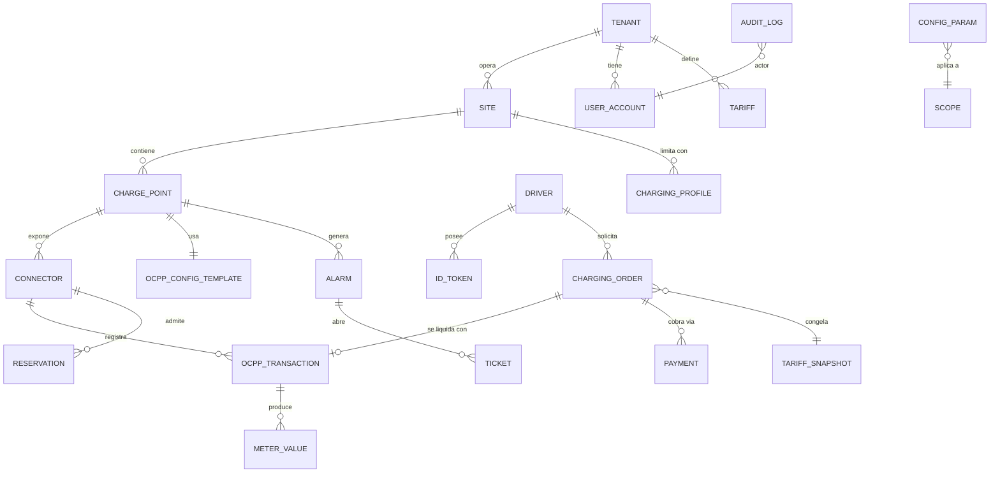
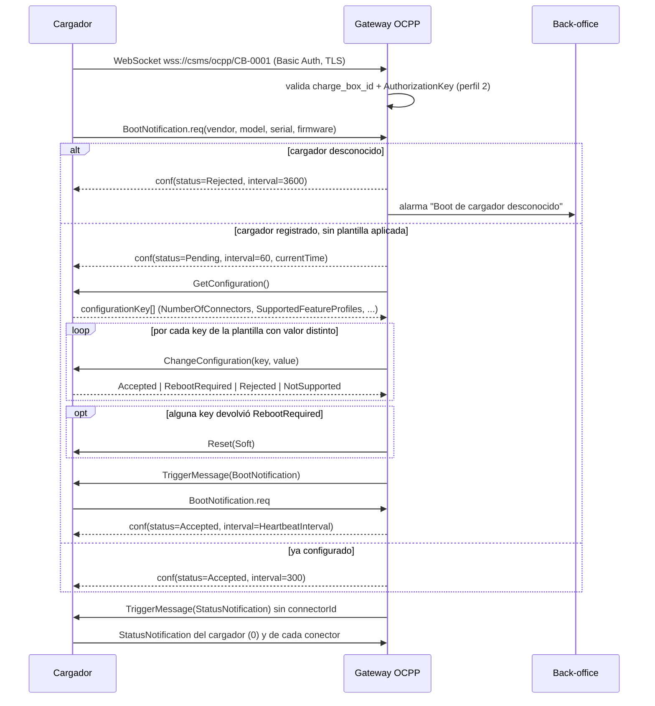
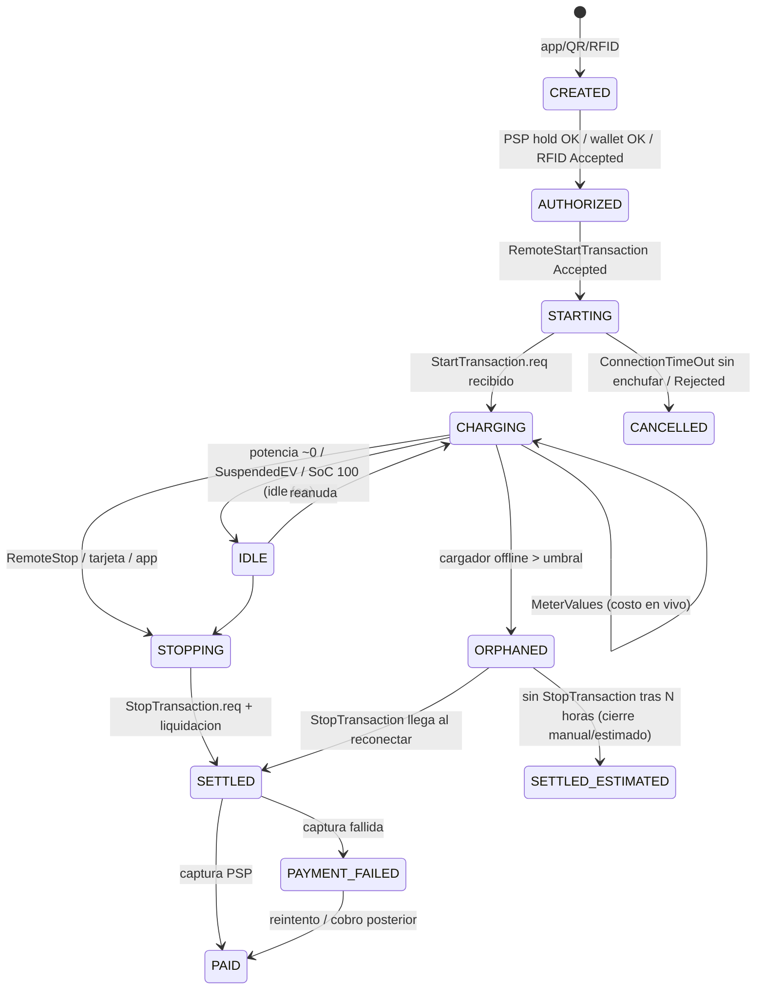
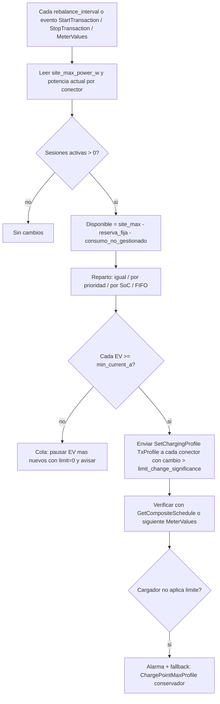

# Capítulo 3 (FUN). Alcance funcional completo del CSMS propio y catálogo de parámetros configurables

**Proyecto:** volt-platform (CSMS propio, Google Cloud)
**Fecha:** 2026-09-18
**Decisión que enmarca este documento:** el usuario construye su **propio CSMS completo**; los cargadores hablarán **OCPP 1.6J directo** contra su plataforma. La nube y la API REST del proveedor (PDF "API OCPP 1.6 V1.0") **no se integran**; el PDF se usa solo como referencia de dominio (estados, tipos de conector, modelo de tarifa por franjas, campos de una orden) y como fuente de preguntas sobre el hardware.

> **Sobre la verificación web.** El proxy de salida bloqueó `openchargealliance.org`, `ocpp.md`, `tzi.app`, `evroaming.org`, `evseadmin.com` y `docs.cloud.google.com`. Verifiqué en su lugar con: los enums oficiales de la librería `mobilityhouse/ocpp` (v16 y v201, que codifican las configuration keys estándar, las del Security Whitepaper y del whitepaper ISO 15118 para 1.6), la documentación de `lorenzodonini/ocpp-go` (bloques funcionales 2.0.1), GitHub de StEVe y CitrineOS, y búsquedas web (OCPP 2.1/IEC 63584-210:2025, OCPI 2.3.0, Cloud Run WebSockets, Autocharge, idle fees). Donde una afirmación proviene de mi conocimiento del texto de la especificación y no pude abrir la fuente primaria, lo señalo como **confianza media**.

---

## 0. Resumen ejecutivo

1. **App del conductor y CSMS no son lo mismo, pero son un solo sistema.** El CSMS es el backend (gateway OCPP + back-office + motor de negocio + API). La app del conductor es **un cliente** de la API pública del CSMS, igual que el back-office web del operador. Nada de la app habla OCPP; todo pasa por la API. Ver §7 (módulo M18) y el caso de uso CU-02.
2. **El PDF del proveedor describe exactamente el flujo que su CSMS debe reproducir con OCPP**: `chargePort` (consulta de estado) → `start` con `startAmount` (pre-autorización) → `lastProcessData` (telemetría) → `stop` → `notification_transaction` (liquidación con `totalPower`, `totalTime`, `actualAmount`, `reduceAmount`, `endReason`). En OCPP 1.6 eso es: `StatusNotification` + `RemoteStartTransaction` + `StartTransaction` + `MeterValues` + `RemoteStopTransaction`/`StopTransaction`, y la liquidación la calcula **su** motor de tarifas.
3. **Catálogo: 21 módulos** (M01–M21), cada uno mapeado a mensajes y feature profiles de OCPP 1.6 (Core, FirmwareManagement, LocalAuthListManagement, Reservation, SmartCharging, RemoteTrigger) más las extensiones del Security Whitepaper y del whitepaper ISO 15118 para 1.6 (vía `DataTransfer`). Se marca lo que **solo** es posible de forma nativa con OCPP 2.0.1/2.1 (Plug&Charge nativo, TariffAndCost/`CostUpdated`, DisplayMessage, Device Model, `TransactionEvent`).
4. **Motor de parámetros de 5 niveles**: Plataforma → Tenant/Operador → Sede → Cargador → Conector, con herencia y override explícito. Las configuration keys de OCPP se gestionan como **plantillas de cargador** que el CSMS aplica al `BootNotification` (estado `Pending`) y verifica con `GetConfiguration` (detección de deriva).
5. **MVP = migrar los cargadores y facturar**: activos, gateway OCPP con perfil de seguridad 2, autorización app/QR y RFID, transacciones (incl. offline), tarifas por franjas (equivalente a `UNIFORM_PRICE`/`TIME_SLOT_PRICING` + `defaultPrice` del PDF), pre-autorización y cobro con un PSP, operaciones remotas Core, monitoreo básico, RBAC, auditoría, API para la app. Fase 2: idle fee, reservas, smart charging, Local Auth List, firmware/diagnósticos, wallet/flotas, precios dinámicos por ocupación/índice. Fase 3: OCPI, OCPP 2.0.1/2.1, terminales de pago, V2X.
6. **Decisiones pendientes que bloquean detalles**: país (moneda, impuestos, facturación electrónica, regulación de medición), PSP, versión OCPP real y perfiles de seguridad soportados por los cargadores del proveedor.

---

## 1. Convenciones usadas en este documento

### 1.1 Niveles de configuración

| Nivel | Código | Quién lo edita | Ejemplos |
|---|---|---|---|
| Plataforma | **P** | Administrador de plataforma | Timeouts OCPP del gateway, política de reintentos de comandos, retención de logs, feature flags globales |
| Tenant / Operador (CPO) | **T** | Admin del tenant | Moneda, impuestos, numeración de recibos, tarifa por defecto, marca, PSP, política de idle fee |
| Sede (site/location) | **S** | Admin del tenant o propietario de sede | Horarios, límite de potencia, tarifa asignada, acceso público/privado, reglas de balanceo |
| Cargador (charge point) | **C** | Admin / técnico | Plantilla de configuration keys OCPP, perfil de seguridad, credenciales, modelo/firmware, `ChargePointMaxProfile` |
| Conector (EVSE/connector) | **X** | Admin / técnico | Tipo de conector, potencia máx., disponibilidad, tarifa específica (override), reserva habilitada |

Regla: el valor efectivo es el **más específico definido**; cada override queda auditado (quién, cuándo, valor anterior).

### 1.2 Fases

- **MVP**: lo necesario para desconectar los cargadores de la nube del proveedor y operar/cobrar con seguridad.
- **Fase 2**: optimización operativa e ingresos (idle fee, smart charging, reservas, flotas, firmware).
- **Fase 3**: interoperabilidad y protocolos nuevos (OCPI, OCPP 2.0.1/2.1, Plug&Charge, terminales de pago, V2X).

### 1.3 Mapeo de vocabulario del PDF del proveedor → CSMS propio

| PDF del proveedor (referencia) | Equivalente OCPP 1.6 / CSMS propio |
|---|---|
| `connectorStatus` AVAILABLE…FAULTED (`/api/connector/{version}/chargePort`) | `StatusNotification.status` (`ChargePointStatus`: Available, Preparing, Charging, SuspendedEVSE, SuspendedEV, Finishing, Reserved, Unavailable, Faulted) |
| `connectorStatus` OFFLINE | Estado **derivado por el CSMS**: WebSocket cerrado o `Heartbeat` ausente > umbral (no existe en OCPP) |
| `connectorCode` = `chargePointSerialNumber` + `connectorId` (ej. "623400291"+"1") | `chargeBoxId` (identidad en la URL WebSocket) + `connectorId` (1..N; 0 = todo el cargador) |
| `priceTemplateSnapshotResponse` (`UNIFORM_PRICE` / `TIME_SLOT_PRICING`, `priceData[{timeRange,price}]`, `defaultPrice`) | Tarifa versionada con elementos por franja horaria + elemento por defecto; **snapshot** congelado al inicio de sesión |
| `start` con `startAmount`, `thirdPartyTransactionId` (ej. `pi_…` de Stripe) | `RemoteStartTransaction` tras **pre-autorización** en el PSP; `psp_reference` en la orden |
| `lastProcessData` (`electricity`, `cost`, `outputPower`, `outputVoltage`, `outputCurrent`, `socValue`) | `MeterValues` (`Energy.Active.Import.Register`, `Power.Active.Import`, `Voltage`, `Current.Import`, `SoC`) + costo calculado en vivo por el CSMS |
| `notification_transaction` (`totalPower`, `totalTime`, `totalAmount`, `reduceAmount`, `actualAmount`, `endReason`, `payStatus`) | `StopTransaction` (`meterStop`, `reason`, `transactionData`) → liquidación → captura del PSP → recibo |
| `endReason: "Remote"` | `StopTransaction.reason` = `Remote` (otros: `EVDisconnected`, `Local`, `DeAuthorized`, `PowerLoss`, `Reboot`, `EmergencyStop`, `HardReset`, `SoftReset`, `UnlockCommand`, `Other`) |
| `connectorType` TYPE_2, CCS, MODE3_C… | Catálogo de conectores del CSMS (alineado a OCPI `ConnectorType`: IEC_62196_T2, IEC_62196_T2_COMBO, CHADEMO, …) |

---

## 2. Modelo de dominio

### 2.1 Diagrama entidad-relación (núcleo)



### 2.2 DDL de referencia (PostgreSQL, extracto)

```sql
-- Multi-tenant desde el día 1 (aunque el MVP opere con un solo tenant)
CREATE TABLE tenant (
  id            uuid PRIMARY KEY,
  code          text UNIQUE NOT NULL,            -- ej. 'VOLT'
  name          text NOT NULL,
  currency      char(3) NOT NULL,                -- ISO 4217, decisión pendiente por país
  timezone      text NOT NULL,                   -- IANA, ej. 'America/Bogota'
  tax_rate_pct  numeric(5,2) NOT NULL DEFAULT 0, -- IVA/IGV/VAT; puede overridearse por sede
  tax_inclusive boolean NOT NULL DEFAULT true,
  status        text NOT NULL CHECK (status IN ('ACTIVE','SUSPENDED')),
  created_at    timestamptz NOT NULL DEFAULT now()
);

CREATE TABLE site (
  id              uuid PRIMARY KEY,
  tenant_id       uuid NOT NULL REFERENCES tenant(id),
  owner_party_id  uuid,                          -- propietario de sede (revenue share), opcional
  name            text NOT NULL,
  address         text NOT NULL,
  city            text, country char(2),
  latitude        numeric(10,7) NOT NULL,
  longitude       numeric(10,7) NOT NULL,
  access_type     text NOT NULL CHECK (access_type IN ('PUBLIC','PRIVATE','SEMI_PUBLIC')),
  opening_hours   jsonb NOT NULL DEFAULT '{"twentyfourseven": true}',   -- formato OCPI Hours
  site_max_power_w integer,                      -- límite físico de la acometida
  tariff_id       uuid,                          -- tarifa por defecto de la sede
  status          text NOT NULL DEFAULT 'ACTIVE',
  created_at      timestamptz NOT NULL DEFAULT now()
);

CREATE TABLE charge_point (
  id                    uuid PRIMARY KEY,
  tenant_id             uuid NOT NULL REFERENCES tenant(id),
  site_id               uuid NOT NULL REFERENCES site(id),
  charge_box_id         text NOT NULL,           -- identidad OCPP (ruta wss://.../ocpp/<charge_box_id>)
  vendor                text, model text, serial_number text,
  firmware_version      text,
  ocpp_version          text NOT NULL DEFAULT '1.6J',
  security_profile      smallint NOT NULL DEFAULT 2 CHECK (security_profile IN (1,2,3)),
  auth_key_hash         text,                    -- hash de la AuthorizationKey (Basic Auth); nunca en claro
  config_template_id    uuid,
  registration_status   text NOT NULL DEFAULT 'PENDING'
                        CHECK (registration_status IN ('PENDING','ACCEPTED','REJECTED')),
  supported_profiles    text[],                  -- de SupportedFeatureProfiles
  number_of_connectors  smallint,
  max_power_w           integer,
  last_boot_at          timestamptz, last_seen_at timestamptz,
  connectivity          text NOT NULL DEFAULT 'OFFLINE' CHECK (connectivity IN ('ONLINE','OFFLINE')),
  created_at            timestamptz NOT NULL DEFAULT now(),
  UNIQUE (tenant_id, charge_box_id)
);

CREATE TABLE connector (
  id              uuid PRIMARY KEY,
  charge_point_id uuid NOT NULL REFERENCES charge_point(id),
  connector_id    smallint NOT NULL,             -- OCPP connectorId (>=1)
  type            text NOT NULL,                 -- IEC_62196_T2, IEC_62196_T2_COMBO, CHADEMO, ...
  power_type      text NOT NULL CHECK (power_type IN ('AC_1_PHASE','AC_3_PHASE','DC')),
  max_voltage_v   integer, max_current_a integer, max_power_w integer,
  ocpp_status     text NOT NULL DEFAULT 'Unavailable',   -- ChargePointStatus
  error_code      text, vendor_error_code text,
  status_since    timestamptz,
  tariff_id       uuid,                          -- override de tarifa a nivel conector
  reservable      boolean NOT NULL DEFAULT false,
  UNIQUE (charge_point_id, connector_id)
);

-- Token de autorización (RFID, app, Autocharge, flota)
CREATE TABLE id_token (
  id            uuid PRIMARY KEY,
  tenant_id     uuid NOT NULL REFERENCES tenant(id),
  driver_id     uuid,
  token         text NOT NULL,                   -- idTag OCPP 1.6 (CiString20): UID RFID, 'VID:<MAC>', token app
  token_type    text NOT NULL CHECK (token_type IN ('RFID','APP','AUTOCHARGE','EMAID','FLEET')),
  parent_token  text,                            -- parentIdTag (grupos/flotas)
  status        text NOT NULL CHECK (status IN ('ACTIVE','BLOCKED','EXPIRED','INVALID')),
  valid_until   timestamptz,
  in_local_list boolean NOT NULL DEFAULT false,
  UNIQUE (tenant_id, token)
);

-- Transacción de protocolo (1 por StartTransaction)
CREATE TABLE ocpp_transaction (
  id                  uuid PRIMARY KEY,
  charge_point_id     uuid NOT NULL REFERENCES charge_point(id),
  connector_id        smallint NOT NULL,
  ocpp_transaction_id integer NOT NULL,          -- entero que devolvemos en StartTransaction.conf
  id_tag              text NOT NULL,
  reservation_id      integer,
  meter_start_wh      bigint NOT NULL,
  started_at          timestamptz NOT NULL,      -- timestamp del CP (StartTransaction.req)
  received_at         timestamptz NOT NULL,      -- llegada al CSMS (detecta offline)
  meter_stop_wh       bigint,
  stopped_at          timestamptz,
  stop_reason         text,                      -- Reason
  state               text NOT NULL CHECK (state IN ('ACTIVE','STOPPED','ORPHANED','RECONCILED')),
  offline_started     boolean NOT NULL DEFAULT false,
  UNIQUE (charge_point_id, ocpp_transaction_id)
);

CREATE TABLE meter_value (
  id               bigserial,
  transaction_id   uuid REFERENCES ocpp_transaction(id),
  charge_point_id  uuid NOT NULL,
  connector_id     smallint NOT NULL,
  sampled_at       timestamptz NOT NULL,
  measurand        text NOT NULL,                -- Energy.Active.Import.Register, Power.Active.Import, SoC, ...
  context          text,                         -- Sample.Periodic, Sample.Clock, Transaction.Begin/End, Trigger
  phase            text, location text, unit text,
  value            numeric(14,4) NOT NULL,
  PRIMARY KEY (id, sampled_at)
) PARTITION BY RANGE (sampled_at);              -- partición mensual; TTL a almacenamiento frío

-- Orden de negocio (equivalente a la "order" del PDF): lo que ve el conductor y se cobra
CREATE TABLE charging_order (
  id                 uuid PRIMARY KEY,
  order_no           text UNIQUE NOT NULL,       -- legible, ej. 'VO-2026-000123'
  tenant_id          uuid NOT NULL,
  driver_id          uuid,
  connector_ref      uuid NOT NULL REFERENCES connector(id),
  transaction_id     uuid REFERENCES ocpp_transaction(id),
  tariff_snapshot    jsonb NOT NULL,             -- tarifa congelada al inicio (transparencia)
  start_channel      text NOT NULL CHECK (start_channel IN ('APP','QR','RFID','AUTOCHARGE','ROAMING','OPERATOR')),
  preauth_amount     numeric(12,2),              -- startAmount del PDF
  psp_reference      text,                       -- thirdPartyTransactionId (ej. PaymentIntent)
  energy_kwh         numeric(12,4),
  duration_s         integer,
  idle_s             integer,
  gross_amount       numeric(12,2),              -- totalAmount
  discount_amount    numeric(12,2) DEFAULT 0,    -- reduceAmount
  tax_amount         numeric(12,2),
  total_amount       numeric(12,2),              -- actualAmount
  payment_status     text NOT NULL CHECK (payment_status IN
                     ('AUTHORIZED','CHARGING','PENDING_PAYMENT','CAPTURED','FAILED','REFUNDED','WAIVED')),
  end_reason         text,
  created_at         timestamptz NOT NULL DEFAULT now(),
  finished_at        timestamptz
);

-- Motor de parámetros con alcance jerárquico
CREATE TABLE config_param (
  id          uuid PRIMARY KEY,
  key         text NOT NULL,                     -- ej. 'idle_fee.grace_minutes'
  scope_type  text NOT NULL CHECK (scope_type IN ('PLATFORM','TENANT','SITE','CHARGE_POINT','CONNECTOR')),
  scope_id    uuid,                              -- NULL para PLATFORM
  value       jsonb NOT NULL,
  valid_from  timestamptz NOT NULL DEFAULT now(),
  valid_to    timestamptz,
  updated_by  uuid NOT NULL,
  -- scope_id es NULL en PLATFORM: sin NULLS NOT DISTINCT (PostgreSQL >= 15) la UNIQUE no
  -- impediría duplicados a nivel plataforma; en versiones anteriores usar un índice parcial.
  UNIQUE NULLS NOT DISTINCT (key, scope_type, scope_id, valid_from)
);

-- Plantilla de configuration keys OCPP aplicada al cargador
CREATE TABLE ocpp_config_template (
  id          uuid PRIMARY KEY,
  tenant_id   uuid NOT NULL,
  name        text NOT NULL,                     -- ej. 'AC 7kW publico v3'
  keys        jsonb NOT NULL                     -- {"HeartbeatInterval":"300","MeterValueSampleInterval":"60",...}
);

CREATE TABLE audit_log (
  id          bigserial PRIMARY KEY,
  at          timestamptz NOT NULL DEFAULT now(),
  actor_id    uuid, actor_type text NOT NULL,    -- USER, SYSTEM, CHARGE_POINT, API_KEY
  tenant_id   uuid,
  action      text NOT NULL,                     -- 'ocpp.Reset', 'tariff.update', 'config.override', ...
  target_type text, target_id text,
  before      jsonb, after jsonb,
  correlation_id text                            -- uniqueId del CALL OCPP o request-id de la API
);
```

Notas de diseño:
- `ocpp_transaction_id` en 1.6 es un **entero** (32 bits) asignado por el CSMS; use una secuencia por tenant y mantenga el `uuid` interno para todo lo demás.
- `charging_order` y `ocpp_transaction` van **separados**: una orden puede quedar sin transacción (RemoteStart rechazado, ConnectionTimeOut) y una transacción puede llegar sin orden (RFID desconocido offline con `AllowOfflineTxForUnknownId`), y la conciliación se hace explícita.

---

## 3. Mapa de mensajes OCPP 1.6 → módulos del CSMS

Dirección: **CP→CS** (lo inicia el cargador) o **CS→CP** (lo inicia su plataforma). Perfil: Core (obligatorio), FM = FirmwareManagement, LAL = LocalAuthListManagement, RES = Reservation, SC = SmartCharging, RT = RemoteTrigger, SEC = Security Whitepaper (ed. 3/4; mensajes nuevos en 1.6J), PnC = whitepaper "Using ISO 15118 Plug & Charge with OCPP 1.6" (todo vía `DataTransfer`).

| Mensaje | Dir. | Perfil | Módulos que lo usan | Campos clave |
|---|---|---|---|---|
| BootNotification | CP→CS | Core | M02, M01, M12 | vendor, model, serialNumber, firmwareVersion, iccid/imsi, meterType → conf: `status` Accepted/Pending/Rejected, `currentTime`, `interval` |
| Heartbeat | CP→CS | Core | M02, M10 | conf: `currentTime` (sincroniza reloj) |
| StatusNotification | CP→CS | Core | M02, M04, M07, M10 | `connectorId`, `status`, `errorCode`, `info`, `vendorErrorCode`, `timestamp` |
| Authorize | CP→CS | Core | M03 | `idTag` → `idTagInfo{status, expiryDate, parentIdTag}` |
| StartTransaction | CP→CS | Core | M04, M06 | `connectorId`, `idTag`, `meterStart`, `timestamp`, `reservationId` → `transactionId`, `idTagInfo` |
| MeterValues | CP→CS | Core | M04, M05, M07, M09, M10 | `transactionId`, `meterValue[].sampledValue[]{measurand, context, unit, phase}` |
| StopTransaction | CP→CS | Core | M04, M05, M06, M07 | `transactionId`, `meterStop`, `timestamp`, `reason`, `idTag`, `transactionData[]` |
| DataTransfer | ambos | Core | M02, M03 (Autocharge/PnC), M21 | `vendorId`, `messageId`, `data` |
| RemoteStartTransaction | CS→CP | Core | M04, M06, M18 | `idTag`, `connectorId`, `chargingProfile` (TxProfile opcional) |
| RemoteStopTransaction | CS→CP | Core | M04, M07, M18 | `transactionId` |
| ChangeAvailability | CS→CP | Core | M11, M01 | `connectorId` (0 = todo), `type` Operative/Inoperative → Accepted/Rejected/Scheduled |
| ChangeConfiguration | CS→CP | Core | M02, M20 | `key`, `value` → Accepted/Rejected/RebootRequired/NotSupported |
| GetConfiguration | CS→CP | Core | M02, M20 | `key[]` → `configurationKey[]{key, readonly, value}`, `unknownKey[]` |
| ClearCache | CS→CP | Core | M03 | → Accepted/Rejected |
| Reset | CS→CP | Core | M11 | `type` Hard/Soft |
| UnlockConnector | CS→CP | Core | M11, M18 | `connectorId` → Unlocked/UnlockFailed/NotSupported |
| GetDiagnostics | CS→CP | FM | M12 | `location` (URI de subida), `startTime`, `stopTime`, `retries`, `retryInterval` → `fileName` |
| DiagnosticsStatusNotification | CP→CS | FM | M12 | Idle/Uploading/Uploaded/UploadFailed |
| UpdateFirmware | CS→CP | FM | M12 | `location`, `retrieveDate`, `retries`, `retryInterval` |
| FirmwareStatusNotification | CP→CS | FM | M12 | Downloading/Downloaded/DownloadFailed/Installing/Installed/InstallationFailed/Idle |
| GetLocalListVersion | CS→CP | LAL | M03 | → `listVersion` |
| SendLocalList | CS→CP | LAL | M03 | `listVersion`, `updateType` Full/Differential, `localAuthorizationList[]` → Accepted/Failed/NotSupported/VersionMismatch |
| ReserveNow | CS→CP | RES | M08 | `connectorId` (0 si `ReserveConnectorZeroSupported`), `expiryDate`, `idTag`, `parentIdTag`, `reservationId` → Accepted/Faulted/Occupied/Rejected/Unavailable |
| CancelReservation | CS→CP | RES | M08 | `reservationId` |
| SetChargingProfile | CS→CP | SC | M09 | `connectorId`, `csChargingProfiles{chargingProfileId, stackLevel, chargingProfilePurpose, chargingProfileKind, recurrencyKind, validFrom/To, chargingSchedule{chargingRateUnit, chargingSchedulePeriod[]{startPeriod, limit, numberPhases}, minChargingRate}}` |
| ClearChargingProfile | CS→CP | SC | M09 | `id`, `connectorId`, `chargingProfilePurpose`, `stackLevel` |
| GetCompositeSchedule | CS→CP | SC | M09 | `connectorId`, `duration`, `chargingRateUnit` → horario compuesto vigente |
| TriggerMessage | CS→CP | RT | M02, M10, M11 | `requestedMessage` BootNotification/Heartbeat/MeterValues/StatusNotification/DiagnosticsStatusNotification/FirmwareStatusNotification, `connectorId` opcional [V]: si se omite, el cargador responde "para todos los conectores" (StatusNotification del cargador y de cada conector); `connectorId=0` pide solo el estado del cargador |
| SecurityEventNotification | CP→CS | SEC | M10, M21 | `type`, `timestamp`, `techInfo` |
| SignCertificate / CertificateSigned | CP→CS / CS→CP | SEC | M21 | CSR → certificado firmado (perfil 3) |
| InstallCertificate / DeleteCertificate / GetInstalledCertificateIds | CS→CP | SEC | M21 | raíz del CSMS, raíz del fabricante |
| ExtendedTriggerMessage | CS→CP | SEC | M21 | añade `LogStatusNotification`, `SignChargePointCertificate` a los `requestedMessage` de TriggerMessage [V] |
| GetLog / LogStatusNotification | CS→CP / CP→CS | SEC | M12, M21 | `logType` DiagnosticsLog/SecurityLog |
| SignedUpdateFirmware / SignedFirmwareStatusNotification | CS→CP / CP→CS | SEC | M12 | firmware firmado (`signature`, `signingCertificate`) |
| DataTransfer `vendorId=org.openchargealliance.iso15118pnc` (`Authorize`, `Get15118EVCertificate`, `GetCertificateStatus`, `SignCertificate`, `CertificateSigned`, `InstallCertificate`, `DeleteCertificate`, `GetInstalledCertificateIds`, `TriggerMessage`) | ambos | PnC | M03, M21 | Plug&Charge sobre 1.6; el `vendorId` exacto queda a confirmar en el texto del whitepaper (no pudo abrirse la fuente primaria) |

Marco de transporte (OCPP-J): `wss://<host>/ocpp/<chargeBoxId>`, cabecera `Sec-WebSocket-Protocol: ocpp1.6`; tramas `[2,"<uniqueId>","Action",{...}]` (CALL), `[3,"<uniqueId>",{...}]` (CALLRESULT), `[4,"<uniqueId>","<errorCode>","<desc>",{}]` (CALLERROR) [V]. Listas de `Reason`, `ChargePointErrorCode`, `ChargePointStatus`, `MessageTrigger` y de configuration keys de este documento contrastadas con los enums de referencia de `mobilityhouse/ocpp` v16 [V].

---

## 4. Catálogo de módulos

Cada módulo incluye: objetivo, mensajes OCPP 1.6 y feature profile, qué exige OCPP 2.0.1/2.1, parámetros configurables por nivel (P/T/S/C/X), fase y justificación.

### M01 — Gestión de activos (sedes, estaciones, EVSE/conectores, inventario, geolocalización, horarios)

**Objetivo:** inventario maestro de todo lo que se opera; fuente de verdad para la app (mapa), OCPI Locations (fase 3) y reportes.

**OCPP 1.6:** `BootNotification` (auto-descubrimiento de vendor/model/serial/firmware), `StatusNotification` (estado por conector), `GetConfiguration` (`NumberOfConnectors`, `SupportedFeatureProfiles`, `ConnectorPhaseRotation`), `ChangeAvailability` (poner fuera de servicio). Perfil: Core.
**Requiere 2.0.1:** Device Model (`GetBaseReport`/`NotifyReport`) para inventario automático de componentes y variables por EVSE; `SetNetworkProfile` para configurar conectividad.

**Parámetros:**

| Parámetro | Nivel | Tipo / ejemplo | Nota |
|---|---|---|---|
| Catálogo de tipos de conector y potencias | P | enum OCPI ConnectorType | El PDF usa TYPE_2, CCS, MODE3_C…; mapear |
| Datos legales del tenant (razón social, NIT/RUC/CIF) | T | texto | Decisión pendiente por país |
| Sede: dirección, lat/long, tipo de acceso, horarios, indicaciones | S | OCPI `Hours` | El PDF trae `businessHours: "00:00-24:00"` y `guide` |
| Sede: potencia contratada / límite de acometida | S | W o A por fase | Alimenta M09 |
| Sede: propietario y % revenue share | S | uuid, % | Fase 2 |
| Cargador: `charge_box_id`, plantilla OCPP, perfil de seguridad, SIM/ICCID, ubicación física | C | | `iccid`/`imsi` llegan en BootNotification |
| Cargador: aceptación automática de BootNotification de desconocidos | T | bool (default false) | Seguridad: desconocidos → `Rejected` o `Pending` en cuarentena |
| Conector: tipo, `max_power_w`, `max_current_a`, `power_type`, reservable, visible en app | X | | |
| Estado operativo administrativo (en servicio / mantenimiento / retirado) | C, X | enum | Distinto del estado OCPP |

**Fase:** **MVP** — sin inventario no hay nada que operar.

---

### M02 — Gateway OCPP y registro de cargadores

**Objetivo:** terminar WebSockets OCPP-J 1.6, autenticar cargadores, mantener el estado de conexión, enrutar mensajes, aplicar plantilla de configuración, sincronizar reloj.

**OCPP 1.6:** `BootNotification` (Accepted / Pending / Rejected), `Heartbeat`, `StatusNotification`, `DataTransfer`, `GetConfiguration`/`ChangeConfiguration`, `TriggerMessage`. Perfil: Core + RT.
**Comportamiento verificado [V]:** con `Pending`, el canal no se cierra; el CSMS puede enviar `GetConfiguration`/`ChangeConfiguration`; el cargador **no** inicia mensajes salvo que se le pida con `TriggerMessage`; `RemoteStart/StopTransaction` están prohibidos mientras está `Pending`; el cargador reintenta `BootNotification` tras `interval` segundos. Con `Accepted`, `interval` pasa a ser el `HeartbeatInterval`.
**Heartbeat implícito [V]:** la especificación permite al cargador **omitir** `Heartbeat.req` cuando envió cualquier otro mensaje dentro del intervalo, y pide al Central System asumir que el cargador está vivo con **cualquier** PDU recibido. El detector de OFFLINE debe reiniciar su temporizador con cualquier mensaje (MeterValues, StatusNotification…), no solo con `Heartbeat`; de lo contrario, un cargador en plena carga generará falsas alarmas OFFLINE.
**Tiempo [V]:** OCPP no impone zona horaria pero recomienda fuertemente UTC en todos los `timestamp`; el CSMS responde `currentTime` en UTC y guarda todo en UTC (`timestamptz`); la zona horaria de la sede solo se usa para franjas tarifarias, horarios y presentación.
**Requiere 2.0.1:** `TransactionEvent`, `NotifyReport`, `SetNetworkProfile`, `SecurityEventNotification` nativo (en 1.6 llega vía extensión del Security Whitepaper).

**Flujo de registro recomendado:**



**Parámetros:**

| Parámetro | Nivel | Valor recomendado | Nota |
|---|---|---|---|
| Timeout de respuesta a un CALL CS→CP | P | 30 s | Después: CALLERROR interno + reintento según política |
| Reintentos de comando y backoff | P | 2 reintentos, 5 s / 15 s | Idempotencia por `uniqueId` |
| Tamaño máximo de mensaje | P | 64 KB (log) / 1 MB (`SendLocalList`) | |
| `interval` de reintento cuando `Pending`/`Rejected` | P, T | 60 s / 3600 s | |
| Umbral "OFFLINE" | P, T | 3 × `HeartbeatInterval` sin **ningún** mensaje, o cierre WS | Estado derivado (PDF: OFFLINE); cualquier PDU cuenta como heartbeat [V] |
| Tolerancia de desfase de reloj | P | 60 s | Si `BootNotification`/`Heartbeat` muestra desfase mayor → alarma; usar `currentTime` de la conf |
| Política ante `charge_box_id` desconocido | T | `Rejected` (público) / `Pending` cuarentena (laboratorio) | |
| Plantilla OCPP asignada | C | ver §5 | |
| Mapeo de `DataTransfer` propietarios (`vendorId`/`messageId`) | P, C | tabla | Necesario si el fabricante usa mensajes propios |
| Retención de log OCPP crudo | P, T | 90 días caliente / 2 años frío | Auditoría, disputas |

**Nota sobre Google Cloud (funcional, no de arquitectura):** Cloud Run limita cada request WebSocket al timeout de request (**5 min por defecto, máximo 60 min**) y a **1.000 requests concurrentes por instancia** como máximo [V]; además la afinidad de sesión es "best effort". El balanceador HTTP(S) externo cierra los WebSockets **activos** a las 24 h y los **inactivos** al vencer el timeout del backend service (30 s por defecto; configurable) [V]. Funcionalmente, el gateway debe tolerar reconexiones periódicas (al menos una diaria por cargador) sin perder transacciones (el estado de sesión vive en la base de datos/Redis, no en la conexión), y mantener ping WebSocket por debajo del timeout del backend; si no se quiere ese ciclo, el gateway va en GKE Autopilot. El capítulo ARQ decide.

**Fase:** **MVP**.

---

### M03 — Autorización (RFID, app/QR, Local Auth List, Authorization Cache, Autocharge, listas negras)

**Objetivo:** decidir quién puede cargar, en qué conector, con qué medio de pago, online y offline.

**OCPP 1.6:** `Authorize` (RFID o cualquier idTag presentado localmente), `RemoteStartTransaction` (app/QR; la autorización la hizo el CSMS antes), `StartTransaction.conf.idTagInfo` (segunda oportunidad de rechazar: `Blocked`, `Expired`, `Invalid`, `ConcurrentTx`), `SendLocalList`/`GetLocalListVersion` (perfil LAL), `ClearCache` (Core), `DataTransfer` (Autocharge propietario en algunos fabricantes). Perfiles: Core + LAL.
**Autocharge [V]:** el cargador presenta el EVCC ID (la MAC del EVCC, que ISO 15118 define como identificador del vehículo) como idTag con la convención `VID:<MAC>` propuesta en el whitepaper de Vector (ej. `VID:A014310E004E`; 16 caracteres, cabe en CiString20); el CSMS la compara con la lista blanca del conductor. No es estándar OCA; depende del fabricante (algunos lo exponen vía `DataTransfer`) y solo funciona en DC/CCS o en AC con ISO 15118 (la MAC se aprende en el handshake de alto nivel, no con PWM de IEC 61851). La MAC no está autenticada criptográficamente (riesgo de suplantación): usarla solo con conductores registrados y método de pago vinculado.
**Plug&Charge (ISO 15118):** sobre 1.6 solo con el whitepaper OCA (mensajes envueltos en `DataTransfer`, keys `ISO15118PnCEnabled`, `CentralContractValidationAllowed`, `ContractValidationOffline`, `CertSigningWaitMinimum`, `CertSigningRepeatTimes` [V] en enums de referencia). **Nativo solo en 2.0.1** (`Authorize` con `certificate`/`iso15118CertificateHashData`, `Get15118EVCertificate`, `GetCertificateStatus`). Requiere una PKI ISO 15118 (V2G Root CA, certificados de contrato del eMSP, OEM provisioning) que hoy exige un proveedor de PKI (p. ej. Hubject) o un acuerdo de roaming — no es algo que un CPO pequeño monte solo.
**Requiere 2.0.1:** tipos de token (`IdTokenType`: Central, eMAID, ISO14443, ISO15693, KeyCode, Local, MacAddress, NoAuthorization [V]), `AuthorizeRemoteStart`, `MasterPassGroupId`, `DisablePostAuthorize`.

**Reglas de decisión del CSMS (Authorize):**
1. Token existe en el tenant y `status=ACTIVE` y no vencido → `Accepted` con `expiryDate = now + cache_ttl` y `parentIdTag` si pertenece a grupo/flota.
2. Token en lista negra → `Blocked`; vencido → `Expired`; desconocido → `Invalid`.
3. Token con transacción activa en otro conector → `ConcurrentTx` (salvo que `allow_concurrent_tx` esté activo para flotas).
4. Conductor sin medio de pago válido / saldo de wallet < mínimo → `Invalid` + notificación en app.
5. Conector con reserva vigente para otro idTag → el propio cargador rechaza (comportamiento del perfil Reservation).

**Parámetros:**

| Parámetro | Nivel | Ejemplo | Nota |
|---|---|---|---|
| Medios habilitados (RFID, app, QR, Autocharge, PnC) | T, S | set | |
| TTL de `expiryDate` en `idTagInfo` (Authorization Cache) | T | 24 h público / 7 días privado | Controla riesgo de tarjeta robada |
| `AuthorizationCacheEnabled` | C (key OCPP) | true | |
| `LocalAuthListEnabled`, tamaño y sincronización (`SendLocalList` Full cada N h, Differential por cambio) | T, C | true; Full 1×/día 03:00 | Fase 2; comprobar `listVersion` con `GetLocalListVersion` antes |
| `LocalPreAuthorize` | C (key) | false público / true depósito de flota | Con true el CP arranca sin esperar al CSMS si el tag está en la lista |
| `LocalAuthorizeOffline` | C (key) | true | Permite cargar offline a tags conocidos |
| `AllowOfflineTxForUnknownId` + `MaxEnergyOnInvalidId` | C (key) | false / 0 Wh público; true / 5000 Wh privado | |
| `StopTransactionOnInvalidId` | C (key) | true | Si el CSMS responde Invalid en `StartTransaction.conf` |
| Lista negra (tokens bloqueados) y acción | T | bloquear + `ClearCache` + `SendLocalList` Differential | |
| Autocharge: lista blanca de MAC por conductor; máx. vehículos | T | 3 | |
| Permitir `ConcurrentTx` (flotas) | T | false | |
| Saldo mínimo de wallet para autorizar | T | 2 unidades de moneda | |
| Restricciones por sede (solo miembros, solo flota X, horario) | S | reglas | |
| Grupo/`parentIdTag` para tarjetas maestras de técnicos | T | | Con `MasterPassGroupId` en 2.0.1 |

**Fase:** **MVP** (RFID + app/QR + cache + lista negra). Local Auth List, Autocharge: **Fase 2**. Plug&Charge: **Fase 3** (requiere PKI ISO 15118 y, en la práctica, 2.0.1).

---

### M04 — Sesiones y transacciones (Start/Stop/MeterValues, offline)

**Objetivo:** ciclo de vida de la transacción OCPP y de la orden de negocio; telemetría en vivo; conciliación de transacciones offline.

**OCPP 1.6:** `StartTransaction`, `StopTransaction`, `MeterValues`, `RemoteStartTransaction`, `RemoteStopTransaction`, `StatusNotification`, `TriggerMessage(MeterValues)`. Perfiles: Core + RT.
**Comportamiento offline [V]:** el cargador **encola** los mensajes relacionados con transacciones y los reenvía **en orden cronológico** al reconectar; `TransactionMessageAttempts`/`TransactionMessageRetryInterval` gobiernan los reintentos; los `StatusNotification` cambiados durante el corte se envían al reconectar.
**Requiere 2.0.1:** `TransactionEvent` (Started/Updated/Ended con `triggerReason`, `chargingState`, `evse`, `meterValue`), `GetTransactionStatus`, `TxStartPoint`/`TxStopPoint` (valores [V]: Authorized, DataSigned, EnergyTransfer, EVConnected, ParkingBayOccupancy, PowerPathClosed; p.ej. `EVConnected` para mantener la transacción abierta hasta desenchufar — base del idle fee nativo).

**Máquina de estados de la orden:**



**Reglas clave:**
- `transactionId` se asigna en `StartTransaction.conf`; si el mismo `StartTransaction` llega dos veces (reintento del cargador), responder el **mismo** `transactionId` (idempotencia por `chargeBoxId + connectorId + timestamp + meterStart`).
- `StartTransaction` con `timestamp` anterior a la última conexión → marcar `offline_started=true` y no cobrar pre-autorización (no hubo app), aplicar regla de M06.
- `StopTransaction` para `transactionId` desconocido → crear transacción huérfana, alarma, conciliación manual.
- `MeterValues` con `Energy.Active.Import.Register` decreciente o saltos > `max_energy_jump_kwh` → marcar sospechoso, no facturar el salto sin revisión.
- Fin de carga sin `StopTransaction` (cargador muerto): al superar `orphan_timeout_h`, cerrar con última lectura y `reason=Other`, marcar `SETTLED_ESTIMATED`, cobrar solo si la política del tenant lo permite.

**Parámetros:**

| Parámetro | Nivel | Ejemplo | Nota |
|---|---|---|---|
| `ConnectionTimeOut` (tiempo para enchufar tras autorizar) | C (key) | 120 s público / 300 s privado | Con `RemoteStart` el conector pasa a `Preparing` y vuelve a `Available` si expira |
| `MeterValueSampleInterval` / `MeterValuesSampledData` | C (key) | 60 s (AC), 30 s (DC) / `Energy.Active.Import.Register,Power.Active.Import,Current.Import,Voltage,SoC` | SoC solo DC; verificar con el fabricante qué measurands soporta |
| `ClockAlignedDataInterval` / `MeterValuesAlignedData` | C (key) | 900 s / `Energy.Active.Import.Register` | Para tarifas por franja exacta (lectura al cambio de hora) |
| `StopTxnSampledData` / `StopTxnAlignedData` | C (key) | `Energy.Active.Import.Register` / vacío | Viaja en `StopTransaction.transactionData` |
| `StopTransactionOnEVSideDisconnect` | C (key) | true | Si false, la transacción sigue al desenchufar (útil para idle fee en 1.6, ver M07) |
| `UnlockConnectorOnEVSideDisconnect` | C (key) | true (tomas Type 2) | |
| `TransactionMessageAttempts` / `TransactionMessageRetryInterval` | C (key) | 5 / 60 s | |
| Tiempo máximo de sesión y acción al superarlo | S, C | 240 min → `RemoteStopTransaction` + aviso | Requisito del usuario |
| Energía máxima por sesión | S, X | kWh | Opcional; usar `TxProfile` con `duration` o RemoteStop |
| `orphan_timeout_h` | T | 12 h | |
| `max_energy_jump_kwh` (validación de medidor) | P, T | 50 | |
| Detección de "carga completa" (para notificar e idle) | T, S | `Power.Active.Import < 200 W` durante 5 min, o `SuspendedEV` | |
| Retención de `meter_value` en caliente | P | 13 meses | Reportes anuales |

**Fase:** **MVP** (incluida la lógica offline: es lo que más se rompe en producción).

---

### M05 — Tarifas y precios dinámicos

**Objetivo:** definir cuánto cuesta cargar, por sede/conector/hora/segmento, y calcular en vivo y al cierre. Debe reproducir el modelo del PDF (`UNIFORM_PRICE`, `TIME_SLOT_PRICING` con `priceData[{timeRange,price}]` y `defaultPrice`) y extenderlo.

**OCPP 1.6:** no transporta tarifas. El costo se calcula en el CSMS con `MeterValues`/`StopTransaction` y se muestra en la app. Solo `ClockAlignedDataInterval` ayuda a cortar la energía por franja con exactitud.
**Requiere 2.0.1:** `CostUpdated` (costo acumulado en pantalla del cargador), `TariffCostCtrlr.Currency` (ISO 4217), `TariffFallbackMessage`, `TotalCostFallbackMessage`, `SetDisplayMessage` con precio [V]. **OCPP 2.1** (publicado ene-2025 y adoptado por IEC como IEC 63584-210:2025 [V]) añade tarifas de primera clase: `SetDefaultTariff` (tarifa por defecto por EVSE), `ChangeTransactionTariff` (cambia la tarifa de una transacción en curso), `GetTariffs`, `ClearTariffs` [V].

**Modelo de tarifa (alineado a OCPI 2.2.1 `Tariff` [V], para que la fase 3 sea gratis):** los campos obligatorios en OCPI son `country_code`, `party_id`, `id`, `currency`, `elements[]` y `last_updated`; la vigencia se expresa con `start_date_time`/`end_date_time` (UTC), no con un campo `valid_from`. `restrictions.start_time`/`end_time` se interpretan en la **zona horaria de la sede** (por eso el motor debe convertir las lecturas UTC a hora local antes de repartir energía por franja), y `end_time < start_time` envuelve la medianoche.

```json
{
  "country_code": "XX",
  "party_id": "VLT",
  "id": "TAR-SEDE-A-v7",
  "currency": "XXX",
  "type": "REGULAR",
  "start_date_time": "2026-10-01T00:00:00Z",
  "last_updated": "2026-09-18T12:00:00Z",
  "elements": [
    { "price_components": [ { "type": "FLAT",   "price": 0.50, "step_size": 1 } ] },
    { "price_components": [ { "type": "ENERGY", "price": 0.05, "step_size": 1 } ],
      "restrictions": { "start_time": "09:00", "end_time": "14:00" } },
    { "price_components": [ { "type": "ENERGY", "price": 0.65, "step_size": 1 } ],
      "restrictions": { "start_time": "14:00", "end_time": "20:00" } },
    { "price_components": [ { "type": "ENERGY", "price": 0.25, "step_size": 1 } ] },
    { "price_components": [ { "type": "PARKING_TIME", "price": 0.20, "step_size": 60 } ],
      "restrictions": { "min_duration": 600 } }
  ],
  "min_price": { "excl_vat": 0.50 },
  "max_price": { "excl_vat": 60.00 }
}
```

Los tres elementos ENERGY replican exactamente el ejemplo del PDF (`09:00-14:00 → 0.05`, `14:00-20:00 → 0.65`, `defaultPrice 0.25`); el elemento sin restricción es el `defaultPrice`. `PARKING_TIME` con `min_duration` = idle fee con período de gracia.

**Precios dinámicos (fase 2):** una tarifa puede tener `pricing_strategy`:
- `TIME_OF_USE` (MVP): franjas fijas por hora/día de semana.
- `OCCUPANCY`: multiplicador por % de conectores ocupados en la sede (p.ej. ≥80% → ×1.3), recalculado cada `rebalance_interval`.
- `ENERGY_INDEX`: precio = índice externo (spot/hora del comercializador) × margen + fijo; el índice se importa diariamente.
- `SEGMENT`: descuentos por membresía/flota (`reduceAmount` del PDF).
Regla de transparencia: la tarifa que aplica a una sesión se **congela al inicio** (`tariff_snapshot`), como hace el PDF con `priceTemplateSnapshot`; los precios dinámicos solo afectan sesiones nuevas salvo que el tenant active `apply_price_changes_mid_session=false`… (recomendado false; en la UE el usuario debe conocer el precio antes de iniciar).

**Parámetros:**

| Parámetro | Nivel | Ejemplo | Nota |
|---|---|---|---|
| Moneda, decimales, redondeo | T | XXX, 2, half-up | Decisión pendiente por país |
| Impuesto (%), incluido/excluido, etiqueta legal | T, S | 19 %, incluido, "IVA" | |
| Tarifa por defecto del tenant | T | id | |
| Tarifa por sede / por conector (override) | S, X | id | Ej. DC más caro que AC |
| Tarifa por segmento (público, miembro, flota, empleado) | T, S | mapa segmento→tarifa | |
| Componentes habilitados (FLAT, ENERGY, TIME, PARKING_TIME) | T | set | |
| Precio mínimo / máximo por sesión | T, S | 0.50 / 60 | |
| Estrategia dinámica y sus umbrales (ocupación, índice, multiplicadores) | T, S | ver arriba | Fase 2 |
| `apply_price_changes_mid_session` | T | false | |
| Ventana de publicación anticipada de cambios (para app y OCPI) | T | 24 h | |
| Vista previa de precio en app (`currentPriceData`) | T | on | Equivale al campo del PDF |

**Fase:** **MVP** (TOU + defecto + FLAT + mínimo/máximo). Ocupación/índice/segmentos: **Fase 2**. `CostUpdated`/2.1 tariffs: **Fase 3**.

---

### M06 — Facturación y pagos (pre-autorización, cobro, recibos, wallet/prepago, membresías, flotas)

**Objetivo:** convertir una sesión en dinero cobrado y en un documento para el conductor/empresa.

**OCPP 1.6:** ninguno directo; se apoya en M04/M05. `RemoteStartTransaction` solo se envía cuando el PSP confirmó la pre-autorización (equivalente a `startAmount` del PDF, cuyo `thirdPartyTransactionId` de ejemplo tiene formato PaymentIntent de Stripe).
**Requiere 2.0.1/2.1:** nada para el flujo app; 2.1 añade soporte de **pago ad hoc en el cargador** (tarjetas/QR/prepago) y OCPI 2.3.0 añade el módulo Payments (terminales) — Fase 3.

**Flujos de cobro:**

| Flujo | Descripción | Fase |
|---|---|---|
| Pre-autorización + captura | Hold por `preauth_default` (o estimado por kWh × precio × capacidad) → captura del `total_amount` al cierre; liberar remanente | MVP |
| Wallet / prepago | Saldo; se descuenta al cierre; recarga en app; autoriza si saldo ≥ mínimo; cierre automático si saldo llega a 0 (`RemoteStopTransaction`) | Fase 2 |
| Pospago mensual (flotas / empresas) | Sin hold; agregación mensual; factura por centro de costo; límites por tarjeta | Fase 2 |
| Membresías | Cuota + tarifa preferente (`SEGMENT`) | Fase 2 |
| Pago en terminal del cargador | Terminal EMV, OCPI Payments / OCPP 2.1 | Fase 3 |
| Cortesía / cero costo | Sedes privadas, empleados | MVP (flag) |

**Documentos:** recibo simple (PDF/HTML) por sesión con: sede, conector, inicio/fin, kWh, duración, idle, desglose por franja, impuestos, total, `order_no`, referencia PSP. **Factura fiscal**: depende del país (facturación electrónica en LatAm — decisión pendiente).

**Parámetros:**

| Parámetro | Nivel | Ejemplo | Nota |
|---|---|---|---|
| PSP y credenciales | T | Stripe / Adyen / PSP local | Decisión pendiente por país |
| `preauth_default`, `preauth_min`, `preauth_max`, estrategia (fijo / estimado) | T, S | 10 / 5 / 80 / estimado | |
| Vencimiento del hold y acción | T | 7 días → captura parcial | Reglas del PSP |
| Umbral para captura incremental durante sesión larga | T | cada 30 unidades | Evita holds insuficientes |
| Reintentos de captura fallida y bloqueo del conductor | T | 3 intentos / bloquear tras 2 fallos | |
| Numeración y plantilla de recibo; datos fiscales; idioma | T | `VO-{YYYY}-{seq}` | |
| Wallet: mínimo para autorizar, recarga mínima, saldo negativo permitido | T | 2 / 5 / no | Fase 2 |
| Reglas de reembolso automático (p.ej. `EVDisconnected` a los 2 min con < 0.1 kWh) | T | sí | Del análisis de `StopTransaction.reason` |
| Cargo mínimo de sesión / cargo por cancelación | T, S | 0.50 / 0 | |
| Política para transacciones offline sin orden (RFID desconocido) | T | no cobrar / cobrar al tenant dueño del tag | |
| Centro de costo y límites por tarjeta de flota | T | | Fase 2 |

**Fase:** **MVP** (pre-autorización + captura + recibo + cortesía). Wallet, flotas, membresías: **Fase 2**. Terminales: **Fase 3**.

---

### M07 — Idle fee (tarifa por ocupación tras fin de carga)

**Objetivo:** liberar conectores cobrando el tiempo que el vehículo sigue conectado sin cargar.

**OCPP 1.6:** se detecta con `MeterValues` (`Power.Active.Import` ≈ 0 durante N minutos) y/o `StatusNotification` (`SuspendedEV`, `Finishing`), y con `StopTransaction.timestamp`/`reason`. Dos modos:
1. **Dentro de la transacción** (recomendado): el idle se cobra como `PARKING_TIME` del mismo `charging_order` mientras la transacción sigue abierta. Para que siga abierta hasta desenchufar, `StopTransactionOnEVSideDisconnect=true` basta cuando el EV termina por SoC (el cargador queda `SuspendedEV` con la transacción activa). Si el usuario detiene desde la app, la transacción cierra y el idle posterior se mide con `Finishing`→`Available` (modo 2).
2. **Fuera de la transacción**: idle desde `StopTransaction` hasta `StatusNotification(Available)`; se cobra como cargo separado, requiere T&C claros.
**Requiere 2.0.1:** `TxCtrlr.TxStopPoint = EVConnected` (o `ParkingBayOccupancy`) mantiene la transacción viva hasta desenchufar — recomendado en la guía OCA "OCPP & California Pricing Requirements" (v3.0 feb-2024; existe v3.1 sep-2024) [V]. Es la forma nativa.

**Parámetros:**

| Parámetro | Nivel | Ejemplo (referencia de mercado [V] para Tesla Supercharger 2025: gracia 5 min, ≈0,50 USD/min solo si la estación está ≥50 % ocupada, ×2 al 100 %; otras redes usan gracia de 5–15 min y topes por sesión — cifras orientativas, a confirmar por país) | Nota |
|---|---|---|---|
| `idle_fee.enabled` | T, S, X | true en DC público, false en hotel nocturno | |
| `idle_fee.grace_minutes` | T, S | 10 | |
| `idle_fee.rate_per_minute` y bloque de facturación | T, S | 0.30 / bloques de 1 min | |
| `idle_fee.cap_per_session` | T, S | 20 | |
| `idle_fee.detection` (regla) | T | `Power.Active.Import < 200 W` 5 min o `SuspendedEV` o `SoC ≥ 100` | |
| `idle_fee.exempt_hours` (ventana nocturna) | S | 22:00–07:00 | |
| `idle_fee.occupancy_threshold` (solo si la sede está > X % ocupada) | S | 80 % | Como hace Tesla con tarifa doble en sitios llenos |
| Avisos previos (push a los −5 min y al inicio del cobro) | T | on | Ver M15 |
| Modo (dentro/fuera de transacción) | T | dentro | |

**Fase:** **Fase 2** — necesita M04/M05/M15 maduros y política comercial definida; alto impacto en ingresos y rotación.

---

### M08 — Reservas

**Objetivo:** el conductor reserva un conector (o cualquiera de la estación) con vencimiento; el cargador rechaza a otros idTags mientras dure.

**OCPP 1.6:** `ReserveNow` (`connectorId`, `expiryDate`, `idTag`, `parentIdTag`, `reservationId` → Accepted/Faulted/Occupied/Rejected/Unavailable), `CancelReservation`, `StartTransaction.reservationId`, `StatusNotification(Reserved)`. Perfil: Reservation. Key: `ReserveConnectorZeroSupported` (si true y `connectorId=0`, el cargador garantiza que **un** conector quede libre para el idTag [V]). Comportamiento [V]: la reserva termina al iniciar transacción con el idTag/parentIdTag reservado (en el conector reservado o en cualquiera si era 0), al vencer `expiryDate`, o si el cargador/conector pasa a Faulted/Unavailable; si se reenvía el mismo `reservationId`, el cargador **reemplaza** la reserva. En 1.6 el cargador **no avisa** al CSMS cuando la reserva expira o se elimina: el CSMS debe llevar su propio temporizador y confirmar con `StatusNotification`.
**Requiere 2.0.1:** `ReservationStatusUpdate` (el cargador avisa expiración/eliminación) [V], `ReservationCtrlr.NonEvseSpecific`. OCPI 2.3.0 ofrece un módulo **Bookings** opcional, empaquetado aparte del núcleo (roaming) [V].

**Parámetros:**

| Parámetro | Nivel | Ejemplo | Nota |
|---|---|---|---|
| Reservas habilitadas | T, S, X | | Solo si `SupportedFeatureProfiles` incluye Reservation |
| Duración máxima y antelación máxima | T, S | 30 min / 24 h | |
| Tarifa de reserva y de no-show | T, S | 1.00 / 2.00 | Se cobra con la pre-autorización |
| Máximo de reservas activas por conductor | T | 1 | |
| Permitir `connectorId=0` | C | según key | |
| Tiempo de gracia tras `expiryDate` antes de liberar en la app | T | 0 | El cargador libera solo |
| Cancelación gratuita hasta N min antes | T | 10 | |

**Fase:** **Fase 2**.

---

### M09 — Smart charging (límites por sede y balanceo dinámico)

**Objetivo:** no superar la potencia contratada de la sede, repartirla entre vehículos y, más adelante, responder a señales de precio/red.

**OCPP 1.6:** `SetChargingProfile`, `ClearChargingProfile`, `GetCompositeSchedule`, `RemoteStartTransaction.chargingProfile`. Perfil: SmartCharging. Keys de lectura: `ChargeProfileMaxStackLevel`, `ChargingScheduleAllowedChargingRateUnit` (A/W), `ChargingScheduleMaxPeriods`, `MaxChargingProfilesInstalled`, `ConnectorSwitch3to1PhaseSupported`. Comportamiento según la especificación 1.6 (confianza media, fuente primaria no accesible): `ChargePointMaxProfile` solo en `connectorId=0` y actúa como techo del cargador completo; `TxDefaultProfile` en 0 aplica a todos los conectores; `TxProfile` a una transacción concreta y se borra al terminar; `stackLevel` más alto prevalece.
**Requiere 2.0.1:** `NotifyEVChargingNeeds`/`NotifyEVChargingSchedule` (ISO 15118), `NotifyChargingLimit`/`ClearedChargingLimit` (límite externo), `ReportChargingProfiles`/`GetChargingProfiles`. **2.1**: bidireccional (V2X), DER control, `SetDefaultTariff` combinado con smart charging.

**Algoritmo de balanceo dinámico (por sede):**



**Reglas:**
- Perfil de seguridad permanente: `ChargePointMaxProfile` en `connectorId=0` con `limit = site_share_w` por cargador, para que el techo sobreviva a caídas del CSMS.
- Perfil dinámico: `TxProfile` (`stackLevel` alto, `chargingProfileKind=Absolute`, `duration` corto = 2× `rebalance_interval`) para que, si el CSMS calla, el cargador vuelva al `TxDefaultProfile` conservador.
- Mínimo por EV: 6 A (IEC 61851) o el mínimo del fabricante; por debajo, mejor pausar (`limit=0`) que oscilar.
- Unidad: si `ChargingScheduleAllowedChargingRateUnit` no incluye W, calcular A por fase con `ConnectorPhaseRotation`.

**Parámetros:**

| Parámetro | Nivel | Ejemplo | Nota |
|---|---|---|---|
| `site_max_power_w` / `site_max_current_a` por fase | S | 100 000 W / 145 A | |
| Reserva fija para cargas no gestionadas | S | 10 000 W | |
| Algoritmo de reparto y prioridades (flota > público, VIP) | S, T | igual / prioridad | |
| `min_current_a_per_ev` | S, C | 6 | |
| `rebalance_interval_s` | S | 30 | |
| `limit_change_significance_w` (histéresis) | S | 500 | |
| Límite estático por cargador (`ChargePointMaxProfile`) | C | 22 000 W | |
| `TxDefaultProfile` (fallback offline) | C, X | 8 A | |
| Ventanas horarias con límites distintos (tarifa de red) | S | 18:00–21:00 → 60 % | |
| Límite por conector | X | 7 400 W | |
| Habilitar control por precio (cargar más barato en franjas bajas) | T, S | Fase 3 | |

**Fase:** límite estático por sede/cargador: **Fase 2 (temprana)** si la acometida lo exige; balanceo dinámico: **Fase 2**; V2X/DER/ISO 15118: **Fase 3**.

---

### M10 — Monitoreo y alarmas

**Objetivo:** ver en tiempo real el estado de toda la red y detectar problemas antes que el conductor.

**OCPP 1.6:** `StatusNotification` (`errorCode` [V]: ConnectorLockFailure, EVCommunicationError, GroundFailure, HighTemperature, InternalError, LocalListConflict, NoError, OtherError, OverCurrentFailure, OverVoltage, PowerMeterFailure, PowerSwitchFailure, ReaderFailure, ResetFailure, UnderVoltage, WeakSignal), `Heartbeat` (ausencia), `MeterValues` (`Temperature`, `Voltage`, `Frequency` si el cargador los da), `BootNotification` (bucles), `FirmwareStatusNotification`/`DiagnosticsStatusNotification` (fallos), `SecurityEventNotification` (Security Whitepaper), `TriggerMessage` para forzar `StatusNotification`/`MeterValues` en diagnóstico. Perfiles: Core + RT + SEC.
**Requiere 2.0.1:** `NotifyEvent` + `SetVariableMonitoring` (umbrales configurados en el propio cargador), `NotifyMonitoringReport`, Device Model.

**Catálogo de alarmas mínimas (tipo, fuente, severidad):**

| Alarma | Regla | Sev. |
|---|---|---|
| Cargador OFFLINE | WS cerrado, o sin **ningún** mensaje (Heartbeat, MeterValues, StatusNotification…) > `offline_threshold` [V] | Alta |
| Conector FAULTED | `StatusNotification.status=Faulted` | Alta |
| Error recurrente | mismo `errorCode` ≥ N veces en 24 h | Media |
| Bucle de arranque | ≥ 3 `BootNotification` en 10 min | Alta |
| Sesión sin energía | `Charging` con `Power.Active.Import < 100 W` > 10 min (posible fallo) | Media |
| Medidor sospechoso | energía decreciente / salto anormal | Alta |
| Transacción huérfana | `ACTIVE` sin `MeterValues` > 3 × intervalo | Media |
| Temperatura alta | `Temperature` > umbral | Alta |
| Fallo firmware / diagnóstico | `InstallationFailed` / `UploadFailed` | Media |
| Evento de seguridad | `SecurityEventNotification` (p.ej. `InvalidCsmsCertificate`, `InvalidFirmwareSignature`, `TamperDetectionActivated`, `FailedToAuthenticateAtCsms`; lista completa del whitepaper [V]: FirmwareUpdated, FailedToAuthenticateAtCsms, CsmsFailedToAuthenticate, SettingSystemTime, StartupOfTheDevice, ResetOrReboot, SecurityLogWasCleared, ReconfigurationOfSecurityParameters, MemoryExhaustion, InvalidMessages, AttemptedReplayAttacks, TamperDetectionActivated, InvalidFirmwareSignature, InvalidFirmwareSigningCertificate, InvalidCsmsCertificate, InvalidChargePointCertificate, InvalidTLSVersion, InvalidTLSCipherSuite) | Crítica |
| Desfase de reloj | > 60 s | Baja |
| Baja disponibilidad de sede | % conectores Available < umbral | Media |

**Parámetros:**

| Parámetro | Nivel | Ejemplo |
|---|---|---|
| Umbrales de cada alarma (arriba) | P, T, S, C | |
| Rutas de notificación por severidad (rol, canal, escalado) | T | Crítica → SMS on-call + email |
| Ventana de mantenimiento (silencia alarmas) | S, C | |
| `MinimumStatusDuration` (anti-flapping en el cargador) | C (key) | 3 s |
| Auto-remediación (p.ej. `Reset(Soft)` tras `Faulted` > 15 min, máx. 1/h) | T, C | on |
| SLA de disponibilidad objetivo por sede (para reportes) | T, S | 97 % |

**Fase:** **MVP** (offline, Faulted, boot loop, huérfanas, notificación a operador). Auto-remediación y umbrales finos: **Fase 2**.

---

### M11 — Operaciones remotas

**Objetivo:** que el operador resuelva incidencias sin desplazarse.

**OCPP 1.6:** `Reset` (Soft/Hard), `UnlockConnector`, `ChangeAvailability` (Operative/Inoperative, `connectorId` 0 = todo; puede responder `Scheduled` si hay transacción), `GetConfiguration`/`ChangeConfiguration`, `ClearCache`, `TriggerMessage`, `RemoteStart/StopTransaction` (arranque/parada por el operador), `DataTransfer` (comandos propietarios). Perfiles: Core + RT. Key `ResetRetries`.
**Requiere 2.0.1:** `SetVariables`/`GetVariables` (reemplazan Change/GetConfiguration), `CustomerInformation`, `GetLog` (en 1.6 vía SEC).

**Parámetros:**

| Parámetro | Nivel | Ejemplo |
|---|---|---|
| Qué comandos puede ejecutar cada rol (ver M13) | T | técnico: todos; soporte: Unlock/RemoteStop/TriggerMessage |
| Confirmación en dos pasos para `Reset(Hard)`, `ChangeConfiguration`, `UpdateFirmware` | T | on |
| Bloquear `Reset` con transacción activa (salvo forzar) | T | on |
| `ResetRetries` | C (key) | 2 |
| Comandos propietarios registrados (`DataTransfer`) | P, C | |
| Timeouts y reintentos por comando | P | 30 s / 2 |

**Fase:** **MVP** (Reset, Unlock, ChangeAvailability, Get/ChangeConfiguration, TriggerMessage, ClearCache, RemoteStart/Stop por operador).

---

### M12 — Firmware y diagnósticos

**OCPP 1.6:** `UpdateFirmware` (`location` = URL de descarga: HTTP(S)/FTP(S) según el cargador; `retrieveDate`, `retries`, `retryInterval`), `FirmwareStatusNotification`, `GetDiagnostics` (`location` = URL a la que el cargador **sube** el archivo; suele exigir FTP/FTPS/HTTP PUT), `DiagnosticsStatusNotification`. Perfil: FirmwareManagement. Con SEC: `SignedUpdateFirmware` (firma + certificado), `GetLog`/`LogStatusNotification`.
**Requiere 2.0.1:** `PublishFirmware` (cargador como caché local), `GetLog` nativo.

**Parámetros:**

| Parámetro | Nivel | Ejemplo |
|---|---|---|
| Repositorio de firmware por vendor/model (Cloud Storage con URLs firmadas) | P, T | |
| Ventana de actualización y tamaño de lote (canary 1 → 10 % → resto) | T, S | 02:00–05:00 |
| No actualizar con transacción activa | T | on |
| `retries` / `retryInterval` | T | 3 / 600 s |
| Servidor de recepción de diagnósticos (FTPS/HTTPS) y retención | P | 30 días |
| Firma obligatoria (`SignedUpdateFirmware`) | T, C | cuando el cargador lo soporte |

**Fase:** **Fase 2** (en MVP: solo `GetDiagnostics` manual si el fabricante lo exige para soporte).

---

### M13 — Usuarios y roles (RBAC, multi-tenant/multi-operador, propietarios de sede, técnicos)

**Objetivo:** aislar datos por operador; que cada persona vea y haga solo lo suyo.

**OCPP:** no aplica directamente; toda acción CS→CP lleva `actor_id` en `audit_log`.

**Modelo:** dos dominios de identidad separados: **back-office** (OIDC corporativo/Identity Platform, MFA obligatoria) y **conductores** (app; social login/OTP). Roles sugeridos:

| Rol | Alcance | Permisos clave |
|---|---|---|
| Platform Admin | P | todo; tenants; feature flags |
| Tenant Admin | T | usuarios, tarifas, PSP, sedes, cargadores |
| Site Owner | S (sus sedes) | ver sesiones/ingresos de sus sedes, horarios, tarifa (si delegado) |
| Operations | T | monitoreo, comandos remotos, alarmas, tickets |
| Technician | S/C asignados | comandos, configuración, firmware, diagnósticos |
| Support Agent | T | ver sesiones, Unlock/RemoteStop, reembolsos hasta límite |
| Finance | T | reportes, facturas, conciliación; sin comandos |
| Read-only / Auditor | T | solo lectura + audit_log |
| Fleet Manager (cliente B2B) | T (su flota) | tarjetas, límites, reportes de su flota |

**Parámetros:** roles y permisos (P/T), MFA obligatoria (P), expiración de sesión (P), delegaciones por sede (T), límites de reembolso por rol (T), dominios de correo permitidos (T), API keys por integración con scopes (T).

**Fase:** **MVP** (roles fijos: admin, operaciones, soporte, lectura; un tenant real pero modelo multi-tenant en datos). Multi-operador completo, site owners con revenue share, fleet managers: **Fase 2**.

---

### M14 — Reportes y analítica

**Fuentes:** `ocpp_transaction`, `meter_value`, `charging_order`, `alarm`, `audit_log`. Exportación a BigQuery para analítica.

**Reportes mínimos:** sesiones y kWh por sede/cargador/día; ingresos por tarifa/segmento; utilización (% tiempo Charging/Available/Faulted/Offline); disponibilidad (uptime) por cargador y sede; fallos por `errorCode`; conductores activos; ranking de conectores; idle fee cobrado; conciliación PSP vs órdenes; reporte para propietarios de sede (revenue share); exportaciones CSV.

**Parámetros:** definición de "uptime" (T; p.ej. excluir mantenimiento programado), zona horaria de corte (T), retención de datos analíticos (P), reportes programados y destinatarios (T), KPIs por rol (T).

**Fase:** **MVP** (dashboard operativo + sesiones/ingresos + export CSV). Analítica avanzada, uptime regulatorio, revenue share: **Fase 2**.

---

### M15 — Notificaciones

**Canales:** push (app), email, SMS/WhatsApp (proveedor por país — decisión pendiente), webhooks a terceros, Slack/Teams para operaciones.

**Eventos al conductor:** carga iniciada, carga en curso (resumen cada N min opcional), carga completa (potencia ≈ 0), idle fee comienza en N min, sesión detenida + recibo, pago fallido, reserva creada/por vencer, cargador reservado no disponible.
**Eventos al operador:** ver M10.

**Parámetros:** plantillas por idioma (T), canales por evento (T), umbral de "carga completa" (T; compartido con M04), silencios nocturnos (T), reintentos y DLQ de webhooks (P), límite de mensajes por conductor/día (T).

**Fase:** **MVP** (push/email: inicio, fin, recibo, pago fallido; alarmas críticas a operaciones). Resto: **Fase 2**.

---

### M16 — Soporte y tickets

**Objetivo:** trazabilidad de incidencias con contexto (sesión, cargador, logs OCPP de ±30 min).

**Funciones:** crear ticket desde alarma o desde la app del conductor (con `order_no`); adjuntar automáticamente últimas 200 tramas OCPP del cargador; estados (abierto/en curso/esperando cliente/resuelto); SLA por severidad; acciones rápidas (Unlock, RemoteStop, reembolso); integración opcional con Zendesk/Jira.

**Parámetros:** SLA por severidad (T), asignación automática por sede/técnico (T), categorías (T), plantillas de respuesta (T), reembolso máximo sin aprobación (T).

**Fase:** **Fase 2** (en MVP: alarmas + notas en el cargador bastan).

---

### M17 — Roaming OCPI 2.2.1 / 2.3.0

**Objetivo:** que conductores de otras redes carguen en su red (rol CPO) y/o sus conductores en otras (rol eMSP), directo o vía hub.

**OCPI [V]:** 2.2.1 es la versión más desplegada; 2.3.0 (publicada feb-2025) se estructura como **núcleo + módulos opcionales empaquetados aparte**: el núcleo añade extensibilidad (módulos/campos/enums propios), objeto `Parking` ligado al EVSE con tipos de vehículo, contratos eMSP aceptados por EVSE (indicador Plug&Charge), teléfono de soporte e información de accesibilidad en `Location` (datos exigidos por AFIR/NAP en la UE), impuestos norteamericanos y señales de compatibilidad ISO 15118; los módulos opcionales **Payments** (terminales de pago ad hoc) y **Bookings** se publican por separado. Módulos del núcleo 2.2.1: Credentials, Versions, Locations, Tariffs, Sessions, CDRs, Tokens, Commands (`START_SESSION`, `STOP_SESSION`, `RESERVE_NOW`, `CANCEL_RESERVATION`, `UNLOCK_CONNECTOR` [V]), ChargingProfiles, HubClientInfo.
**Mapeo:** `Locations` ← M01; `Tariffs` ← M05 (por eso el modelo de tarifa ya es OCPI); `Sessions`/`CDRs` ← M04/M06; `Tokens` ← M03 (autorización en tiempo real `POST /tokens/{id}/authorize`); `Commands` ← M04/M08/M11.

**Parámetros:** partner (party_id, country_code, endpoints, tokens A/B/C) (T), módulos publicados por partner (T), tarifa para roaming (T, S), sedes visibles en roaming (S), tiempo de publicación de CDR (T), hub vs directo (T).

**Fase:** **Fase 3** (el modelo de datos del MVP ya debe ser compatible para no reescribir).

---

### M18 — API pública y app del conductor

**Respuesta directa a la pregunta del usuario:** la app **no** es el CSMS. La app consume la API del CSMS; el CSMS habla OCPP con los cargadores. Un mismo backend sirve a la app del conductor, al back-office web y a integraciones (flotas, OCPI).

**Endpoints mínimos para la app (REST + eventos en tiempo real vía WebSocket/SSE o push):**

| Endpoint | Equivalente en el PDF | Módulo |
|---|---|---|
| `GET /v1/locations?near=lat,lng&radius=` | — (el PDF no listaba estaciones) | M01 |
| `GET /v1/connectors/{code}` (estado, tarifa vigente, potencia) | `/api/connector/{version}/chargePort` | M01, M05 |
| `POST /v1/orders` `{connector_code, payment_method_id, preauth_amount?}` | `/api/connector/{version}/start` | M06, M04 |
| `GET /v1/orders/{order_no}` | `/api/order/{version}/detail` | M04, M06 |
| `GET /v1/orders/{order_no}/live` o stream | `/api/order/{version}/lastProcessData` | M04 |
| `POST /v1/orders/{order_no}/stop` | `/api/connector/{version}/stop` | M04 |
| `POST /v1/connectors/{code}/unlock` | — | M11 |
| `POST /v1/reservations` / `DELETE` | — | M08 |
| `GET /v1/me/receipts`, `/v1/me/tokens` (RFID/Autocharge), `/v1/me/wallet` | — | M06, M03 |
| Webhooks salientes: `order.started`, `order.updated`, `order.settled`, `connector.status_changed` | `notification_start_result`, `notification_stop_result`, `notification_transaction` | M15 |

Seguridad de API: OAuth2/OIDC, tokens cortos, rate limiting, idempotency-key en `POST /orders` (equivalente a `thirdPartyTransactionId`), firma HMAC + reintentos con backoff en webhooks (lo que el PDF no definía).

**Parámetros:** scopes por cliente (T), límites de tasa (P, T), versiones de API activas (P), URL de webhooks y secreto por integración (T), radio máximo de búsqueda (P).

**Fase:** **MVP** (app: mapa, estado, iniciar/parar, en vivo, recibos, métodos de pago). Reservas, wallet, Autocharge en app: **Fase 2**. API para partners: **Fase 2**.

---

### M19 — Auditoría

**Qué se audita (inmutable, append-only):** todo comando CS→CP (actor, `uniqueId`, request, response, latencia); cambios de configuración (parámetros del CSMS y keys OCPP: valor anterior/nuevo); cambios de tarifa (versionado, quién, vigencia); cambios de roles; reembolsos y ajustes manuales; accesos a datos personales; eventos de seguridad OCPP; logs OCPP crudos (con hashing de idTags si la política lo exige).

**Parámetros:** retención por tipo (P), exportación (P), enmascaramiento de PII (T), alertas sobre acciones sensibles (T).

**Fase:** **MVP** (es barato al inicio e imposible de reconstruir después).

---

### M20 — Configuración del sistema (motor de parámetros y plantillas OCPP)

**Objetivo:** el "debe permitir configurar distintos parámetros" del usuario, hecho sistema: catálogo de parámetros con tipo, nivel permitido, validación, valor por defecto, herencia, versionado y auditoría; y plantillas de configuration keys OCPP por modelo de cargador.

**Funciones:**
- Registro de parámetros (`key`, tipo, niveles admitidos, validador, default, descripción, reinicio requerido).
- Resolución efectiva `resolve(key, connector)` = X → C → S → T → P.
- Plantillas OCPP (`ocpp_config_template`): aplicar en `BootNotification Pending` (M02), aplicar bajo demanda, **detección de deriva** (job diario `GetConfiguration` y diff), respeto a keys `readonly`, gestión de `RebootRequired`.
- Feature flags por tenant (idle fee, reservas, smart charging, roaming).
- Import/export JSON de configuración; vista previa de valor efectivo.

**Ejemplo de resolución (JSON):**

```json
{
  "key": "idle_fee.grace_minutes",
  "platform": 10,
  "tenant:VOLT": 10,
  "site:SEDE-A": 15,
  "charge_point:CB-0001": null,
  "connector:CB-0001/2": 5,
  "effective_for": { "connector": "CB-0001/2", "value": 5, "source": "connector" }
}
```

**Parámetros del propio módulo:** quién puede editar cada nivel (T), obligatoriedad de motivo en cambios (T), ventana de aplicación de cambios OCPP (S), job de deriva (P).

**Fase:** **MVP** (mínimo viable: parámetros con niveles y plantilla OCPP; UI completa con vista previa: Fase 2).

---

### M21 — Seguridad OCPP funcional (perfiles, credenciales, certificados)

(El capítulo SEG profundiza; aquí solo lo que el back-office debe **poder configurar**.)

**OCPP 1.6 + Security Whitepaper (ed. 3; existe ed. 4, y además la OCA publicó un "OCPP Security Operations Guide v1.0" en enero de 2026; desde oct-2025 el programa de certificación OCPP 1.6 exige Security Profile 2 y Firmware Management dentro del perfil Core, quedando Reservation, Local Auth List y Remote Trigger como opcionales — [V]):**
- Perfil 1: sin TLS + HTTP Basic Auth (la OCA no lo considera seguro por sí solo; solo redes privadas/VPN). Perfil 2: TLS servidor + Basic Auth. Perfil 3: TLS mutuo con certificado de cliente del cargador. Usuario de Basic Auth = `chargeBoxId`.
- Keys: `SecurityProfile` (RW), `AuthorizationKey` (solo escritura; el CSMS la genera y la rota con `ChangeConfiguration`, enviando la clave binaria en representación hexadecimal; longitud mínima 16 bytes — el máximo exacto de la edición vigente queda a confirmar; implementaciones de fabricantes aceptan típicamente 32–40 caracteres hex), `CpoName` (RW; O= del CSR), `AdditionalRootCertificateCheck` (R), `CertificateSignedMaxChainSize` (R), `CertificateStoreMaxLength` (R) [V] en enums de referencia.
- Mensajes: `SignCertificate`→`CertificateSigned`, `InstallCertificate`, `DeleteCertificate`, `GetInstalledCertificateIds`, `SecurityEventNotification`, `GetLog`, `SignedUpdateFirmware`, `ExtendedTriggerMessage`.
**Requiere 2.0.1:** `SecurityCtrlr` (variables `OrganizationName`, `SecurityProfile`, `BasicAuthPassword`, `CertificateEntries`), `SetNetworkProfile` para migrar de perfil sin cortar.

**Parámetros:**

| Parámetro | Nivel | Ejemplo |
|---|---|---|
| Perfil de seguridad objetivo y mínimo aceptado | T, C | 2 mínimo; 3 objetivo |
| Rotación de `AuthorizationKey` (periodicidad, longitud: mín. 16 bytes; máximo a confirmar en el whitepaper) | T | 180 días / 20 bytes (40 hex) |
| CA propia (raíz/intermedia), validez de certificados de cargador | P, T | 2 años |
| Procedimiento de migración de perfil (subir `SecurityProfile` solo tras verificar TLS) | P | |
| Tipos de `SecurityEventNotification` que generan alarma crítica | T | todos los "critical" del whitepaper |
| Permitir `ws://` (perfil 1) solo para laboratorio | P | false en producción |

**Fase:** **MVP** con perfil 2 (TLS + Basic Auth) — es lo que la mayoría de cargadores 1.6J actuales soporta y es el mínimo del programa de certificación OCA vigente [V]. Perfil 3 + PKI: **Fase 2**.
**Checklist del primer mes (perfil 2):** el cargador debe confiar en la CA que firma el certificado del gateway (con una CA pública tipo Let's Encrypt suele bastar, pero algunos firmware traen un almacén de raíces limitado: preguntar al proveedor); el certificado del servidor debe cubrir el hostname exacto de la URL configurada; TLS 1.2 como mínimo; la `AuthorizationKey` se escribe **mientras el cargador aún está conectado por el canal anterior** y solo después se cambia `SecurityProfile`, porque un fallo en el orden deja al cargador incomunicado y obliga a una visita.

---

## 5. Catálogo de configuration keys OCPP 1.6 que el CSMS debe leer/escribir

Fuente: enums oficiales de `mobilityhouse/ocpp` v16 [V] — las 56 keys de esta tabla existen todas en OCPP 1.6 (Core, LAL, Reservation, SmartCharging), en el Security Whitepaper o en el whitepaper ISO 15118 para 1.6; no se incluye ninguna key propietaria (las de URL del Central System, p. ej. `CentralSystemURL`/`BackOfficeURL`, son propietarias y van en la tabla de `DataTransfer`/keys propietarias de M02) + texto de la especificación 1.6 (accesibilidad y obligatoriedad de memoria — confianza media). Tipo CSL = lista separada por comas. "Nivel" = dónde vive el valor en la plantilla del CSMS (C = plantilla del cargador; el valor puede heredarse de T/S).

| Key | Perfil | Tipo | Acceso | Oblig. | Módulo | Valor recomendado (plantilla base AC pública) | Nota |
|---|---|---|---|---|---|---|---|
| AllowOfflineTxForUnknownId | Core | bool | RW | opc. | M03 | false | true solo en sedes privadas junto a MaxEnergyOnInvalidId |
| AuthorizationCacheEnabled | Core | bool | RW | opc. | M03 | true | Gobernado por expiryDate del CSMS |
| AuthorizeRemoteTxRequests | Core | bool | R/RW | obl. | M03, M04 | false | Si true el CP envía Authorize tras RemoteStart; el CSMS debe aceptar el mismo idTag |
| BlinkRepeat | Core | int | RW | opc. | M11 | — | cosmético |
| ClockAlignedDataInterval | Core | int (s) | RW | obl. | M04, M05 | 900 (0 = off) | lectura al cambio de franja |
| ConnectionTimeOut | Core | int (s) | RW | obl. | M04 | 120 | |
| ConnectorPhaseRotation | Core | CSL | RW | obl. | M09 | según instalación (`1.RST,2.RTS`) | necesario para balanceo por fase |
| ConnectorPhaseRotationMaxLength | Core | int | R | opc. | M09 | — | |
| GetConfigurationMaxKeys | Core | int | R | obl. | M20 | — | paginar GetConfiguration |
| HeartbeatInterval | Core | int (s) | RW | obl. | M02, M10 | 300 | también se fija con BootNotification.conf.interval |
| LightIntensity | Core | int (%) | RW | opc. | M11 | — | |
| LocalAuthorizeOffline | Core | bool | RW | obl. | M03 | true | |
| LocalPreAuthorize | Core | bool | RW | obl. | M03 | false | true en depósitos de flota |
| MaxEnergyOnInvalidId | Core | int (Wh) | RW | opc. | M03 | 0 | |
| MeterValuesAlignedData | Core | CSL | RW | obl. | M04 | Energy.Active.Import.Register | |
| MeterValuesAlignedDataMaxLength | Core | int | R | opc. | M04 | — | |
| MeterValuesSampledData | Core | CSL | RW | obl. | M04 | Energy.Active.Import.Register,Power.Active.Import,Current.Import,Voltage(,SoC en DC) | verificar soporte del fabricante |
| MeterValuesSampledDataMaxLength | Core | int | R | opc. | M04 | — | |
| MeterValueSampleInterval | Core | int (s) | RW | obl. | M04 | 60 (AC) / 30 (DC) | 0 = sin muestras |
| MinimumStatusDuration | Core | int (s) | RW | opc. | M10 | 3 | anti-flapping |
| NumberOfConnectors | Core | int | R | obl. | M01 | — | crea conectores automáticamente |
| ResetRetries | Core | int | RW | obl. | M11 | 2 | |
| StopTransactionOnEVSideDisconnect | Core | bool | RW | obl. | M04, M07 | true | |
| StopTransactionOnInvalidId | Core | bool | RW | obl. | M03 | true | |
| StopTxnAlignedData | Core | CSL | RW | obl. | M04 | (vacío) | |
| StopTxnAlignedDataMaxLength | Core | int | R | opc. | M04 | — | |
| StopTxnSampledData | Core | CSL | RW | obl. | M04 | Energy.Active.Import.Register | |
| StopTxnSampledDataMaxLength | Core | int | R | opc. | M04 | — | |
| SupportedFeatureProfiles | Core | CSL | R | obl. | M01, M20 | — | decide qué módulos activar por cargador |
| SupportedFeatureProfilesMaxLength | Core | int | R | opc. | M20 | — | |
| TransactionMessageAttempts | Core | int | RW | obl. | M04 | 5 | |
| TransactionMessageRetryInterval | Core | int (s) | RW | obl. | M04 | 60 | |
| UnlockConnectorOnEVSideDisconnect | Core | bool | RW | obl. | M04, M11 | true | |
| WebSocketPingInterval | Core | int (s) | RW | opc. | M02 | 60 | por debajo de idle timeouts de balanceadores |
| LocalAuthListEnabled | LAL | bool | RW | obl. (si LAL) | M03 | true (F2) | |
| LocalAuthListMaxLength | LAL | int | R | obl. (si LAL) | M03 | — | |
| SendLocalListMaxLength | LAL | int | R | obl. (si LAL) | M03 | — | trocear SendLocalList |
| ReserveConnectorZeroSupported | RES | bool | R | opc. | M08 | — | |
| ChargeProfileMaxStackLevel | SC | int | R | obl. (si SC) | M09 | — | |
| ChargingScheduleAllowedChargingRateUnit | SC | CSL | R | obl. (si SC) | M09 | — | `Current`,`Power` |
| ChargingScheduleMaxPeriods | SC | int | R | obl. (si SC) | M09 | — | |
| ConnectorSwitch3to1PhaseSupported | SC | bool | R | opc. | M09 | — | |
| MaxChargingProfilesInstalled | SC | int | R | obl. (si SC) | M09 | — | |
| SecurityProfile | SEC | int (1–3) | RW | obl. | M21 | 2 | subir solo tras verificar TLS |
| AuthorizationKey | SEC | string (hex; mín. 16 bytes, máximo a confirmar) | W | obl. (perfil 1/2) | M21 | aleatoria por cargador (p. ej. 20 bytes = 40 hex) | nunca legible por GetConfiguration [V] |
| CpoName | SEC | string | RW | obl. | M21 | nombre del CPO | O= del CSR (perfil 3) |
| AdditionalRootCertificateCheck | SEC | bool | R | opc. | M21 | — | |
| CertificateSignedMaxChainSize | SEC | int | R | opc. | M21 | — | |
| CertificateStoreMaxLength | SEC | int | R | opc. | M21 | — | |
| ISO15118PnCEnabled | PnC | bool | RW | opc. | M03 | false | Fase 3 |
| CentralContractValidationAllowed | PnC | bool | RW | opc. | M03 | — | |
| ContractValidationOffline | PnC | bool | RW | opc. | M03 | — | |
| CertSigningWaitMinimum / CertSigningRepeatTimes | PnC | int | RW | opc. | M21 | — | |

**Plantilla de ejemplo (JSON aplicado por M02/M20):**

```json
{
  "name": "AC-7kW-publico-v1",
  "applies_to": { "vendor": "*", "model": "*", "power_type": "AC_1_PHASE" },
  "keys": {
    "HeartbeatInterval": "300",
    "WebSocketPingInterval": "60",
    "MeterValueSampleInterval": "60",
    "MeterValuesSampledData": "Energy.Active.Import.Register,Power.Active.Import,Current.Import,Voltage",
    "ClockAlignedDataInterval": "900",
    "MeterValuesAlignedData": "Energy.Active.Import.Register",
    "StopTxnSampledData": "Energy.Active.Import.Register",
    "ConnectionTimeOut": "120",
    "AuthorizeRemoteTxRequests": "false",
    "LocalPreAuthorize": "false",
    "LocalAuthorizeOffline": "true",
    "AllowOfflineTxForUnknownId": "false",
    "AuthorizationCacheEnabled": "true",
    "StopTransactionOnInvalidId": "true",
    "StopTransactionOnEVSideDisconnect": "true",
    "UnlockConnectorOnEVSideDisconnect": "true",
    "ResetRetries": "2",
    "TransactionMessageAttempts": "5",
    "TransactionMessageRetryInterval": "60",
    "MinimumStatusDuration": "3",
    "SecurityProfile": "2"
  },
  "read_only_expected": ["NumberOfConnectors", "SupportedFeatureProfiles", "GetConfigurationMaxKeys"],
  "on_reboot_required": "Reset(Soft) fuera de transaccion"
}
```

---

## 6. Parámetros de negocio consolidados por nivel

| Parámetro | P | T | S | C | X | Módulo |
|---|:-:|:-:|:-:|:-:|:-:|---|
| Timeouts/reintentos de comandos OCPP, retención de logs | ● | | | | | M02, M19 |
| Umbral OFFLINE, desfase de reloj | ● | ● | | | | M02, M10 |
| Moneda, impuestos, redondeo, datos fiscales, PSP | | ● | ○ | | | M05, M06 |
| Pre-autorización por defecto / mín / máx / estrategia | | ● | ○ | | | M06 |
| Tarifa (defecto → sede → conector), segmentos | | ● | ○ | | ○ | M05 |
| Estrategia de precio dinámico y umbrales | | ● | ○ | | | M05 |
| Idle fee: habilitado, gracia, tarifa, tope, ventana exenta, umbral de ocupación | | ● | ○ | | ○ | M07 |
| Tiempo máximo de sesión, energía máxima | | ○ | ● | ○ | ○ | M04 |
| Horarios, acceso público/privado, restricciones de sede | | | ● | | | M01, M03 |
| Límite de potencia de sede, algoritmo, mínimo por EV, intervalo | | | ● | ○ | ○ | M09 |
| Límite estático de cargador / conector | | | | ● | ● | M09 |
| Plantilla OCPP, perfil de seguridad, AuthorizationKey | | ○ | | ● | | M02, M21 |
| Umbrales de alarmas, rutas, ventanas de mantenimiento | ● | ● | ○ | ○ | | M10 |
| Reservas: duración, antelación, tarifas, máximo por conductor | | ● | ○ | | ○ | M08 |
| TTL de cache de autorización, política offline, lista negra | | ● | | ○ | | M03 |
| Firmware: ventana, lotes, firma | | ● | ○ | ○ | | M12 |
| Roles, MFA, expiración de sesión, límites de reembolso | ● | ● | | | | M13 |
| Notificaciones: canales, plantillas, silencios | | ● | | | | M15 |
| Roaming: partners, módulos, sedes visibles | | ● | ○ | | | M17 |

● = nivel principal, ○ = override permitido.

---

## 7. Priorización por fases (resumen)

| Módulo | Fase | Justificación breve |
|---|---|---|
| M01 Activos | MVP | Sin inventario no hay operación ni app |
| M02 Gateway OCPP | MVP | Es el reemplazo directo de la nube del proveedor |
| M03 Autorización (RFID, app/QR, cache, lista negra) | MVP | Sin esto nadie carga; Local List/Autocharge F2; PnC F3 |
| M04 Sesiones (incl. offline) | MVP | Reproduce start/telemetría/stop del PDF; el offline es lo que rompe la facturación |
| M05 Tarifas TOU + defecto | MVP | Requisito explícito del usuario (precios); reproduce el modelo del PDF; dinámicas F2 |
| M06 Pagos (pre-auth + captura + recibo) | MVP | Sin cobro no hay negocio; wallet/flotas F2; terminales F3 |
| M07 Idle fee | Fase 2 | Alto impacto en rotación; necesita telemetría y notificaciones maduras |
| M08 Reservas | Fase 2 | Depende de soporte del cargador y de demanda real |
| M09 Smart charging | Fase 2 (límite estático temprano si la acometida lo exige) | Complejidad alta; evita ampliaciones eléctricas |
| M10 Monitoreo/alarmas | MVP (básico) | El operador debe ver OFFLINE/FAULTED desde el día 1 |
| M11 Operaciones remotas | MVP | Reset/Unlock/Availability/Config son soporte diario |
| M12 Firmware/diagnósticos | Fase 2 | Necesario para escala; en MVP se hace manual con el fabricante |
| M13 RBAC / multi-tenant | MVP (roles fijos) / F2 (multi-operador) | Modelo de datos multi-tenant desde el inicio |
| M14 Reportes | MVP (básico) / F2 | Ingresos y sesiones son imprescindibles; analítica luego |
| M15 Notificaciones | MVP (básico) | Inicio/fin/recibo/pago fallido; idle y reservas F2 |
| M16 Tickets | Fase 2 | Con pocas sedes, alarmas + notas bastan |
| M17 OCPI | Fase 3 | Solo cuando haya volumen y acuerdos de roaming; el modelo ya es compatible |
| M18 API pública / app | MVP | La app es requisito del usuario |
| M19 Auditoría | MVP | Imposible de reconstruir a posteriori |
| M20 Configuración | MVP | Requisito explícito del usuario |
| M21 Seguridad OCPP (perfil 2) | MVP / F2 (perfil 3) | Requisito explícito del usuario |
| OCPP 2.0.1/2.1 gateway (Plug&Charge, DisplayMessage, TariffAndCost, Device Model, V2X) | Fase 3 | Solo si el hardware lo soporta; el modelo de dominio ya contempla `TransactionEvent` |

---

## 8. Casos de uso (10 flujos principales)

Formato: actor, objetivo, precondiciones, flujo principal con mensajes OCPP, alternativas, postcondiciones, parámetros implicados.

### CU-01 (Operador) — Dar de alta y migrar un cargador desde la nube del proveedor

**Precondiciones:** el proveedor entregó el procedimiento para cambiar la URL del Central System (menú local, app del fabricante o `ChangeConfiguration` desde su nube), la versión OCPP (1.6J) y los perfiles de seguridad soportados. El cargador tiene SIM/Ethernet con salida a Internet.
**Flujo:**
1. Operations crea la sede (M01) y el cargador con `charge_box_id` (p.ej. el `chargePointSerialNumber` "623400291" del PDF), asigna plantilla OCPP "AC-7kW-publico-v1" y genera `AuthorizationKey`.
2. El técnico configura en el cargador: URL `wss://ocpp.<dominio>/ocpp/623400291`, usuario = `charge_box_id`, contraseña = `AuthorizationKey`, `SecurityProfile=2`.
3. El cargador abre WebSocket (`Sec-WebSocket-Protocol: ocpp1.6`); el gateway valida TLS + Basic Auth.
4. `BootNotification.req` → el CSMS responde `Pending`, ejecuta `GetConfiguration`, aplica `ChangeConfiguration` por cada key distinta, hace `Reset(Soft)` si alguna devolvió `RebootRequired`, y tras el nuevo `BootNotification` responde `Accepted` (`interval=300`).
5. `TriggerMessage(StatusNotification)` **sin** `connectorId` (con `connectorId=0` solo llegaría el estado global del cargador) → llegan los estados del cargador y de cada conector; el CSMS crea los conectores según `NumberOfConnectors` y el técnico completa tipo/potencia (el PDF indica `TYPE_2`, 7 kW, 32 A, 186–252 V).
6. Prueba: `RemoteStartTransaction` con tag de prueba, `MeterValues` cada 60 s, `RemoteStopTransaction`; verificación de `StopTransaction.meterStop − meterStart` vs. display.
**Alternativas:** `BootNotification` de `charge_box_id` desconocido → `Rejected` + alarma. El cargador no admite cambiar la URL → escalar al proveedor (riesgo de hardware atado a su nube).
**Postcondiciones:** cargador `ACCEPTED`, `ONLINE`, visible en app si `visible=true`.
**Parámetros:** plantilla OCPP (C), política de desconocidos (T), umbral OFFLINE (T).

### CU-02 (Conductor) — Iniciar carga desde la app o QR con pre-autorización

**Precondiciones:** conductor registrado con método de pago; conector `Available`; cargador `ONLINE`.
**Flujo:**
1. Escanea QR (`connector_code` = `623400291-1`) → `GET /v1/connectors/623400291-1` muestra estado, tarifa vigente (snapshot) y potencia.
2. `POST /v1/orders` con `idempotency-key`. El CSMS calcula `preauth_amount` (estrategia del tenant), crea hold en el PSP (`psp_reference`), crea `charging_order` en `AUTHORIZED` y congela `tariff_snapshot`.
3. `RemoteStartTransaction.req {idTag: "APP-<token>", connectorId: 1}` → `Accepted`. Orden → `STARTING`. Push "conecta el vehículo en 2 min".
4. El cargador pasa a `Preparing`; con `AuthorizeRemoteTxRequests=false` no envía `Authorize`. Al detectar EV: `StartTransaction.req {connectorId:1, idTag, meterStart, timestamp}` → conf `{transactionId: 4711, idTagInfo: Accepted}`. Orden → `CHARGING`.
5. `MeterValues` cada 60 s → la app muestra kWh, potencia, tensión, corriente, SoC (si DC) y costo en vivo (equivalente a `lastProcessData`).
**Alternativas:** hold rechazado → orden `FAILED`, sin RemoteStart. `RemoteStartTransaction.conf=Rejected` → liberar hold, mostrar motivo. Expira `ConnectionTimeOut` sin enchufar → conector vuelve a `Available`, orden `CANCELLED`, hold liberado. Cargador `OFFLINE` → la app no ofrece "iniciar".
**Postcondiciones:** transacción activa vinculada a la orden.
**Parámetros:** `preauth_*` (T/S), `ConnectionTimeOut` (C), `AuthorizeRemoteTxRequests` (C), `MeterValueSampleInterval` (C).

### CU-03 (Conductor) — Iniciar carga con tarjeta RFID (online y offline)

**Flujo online:** presenta tarjeta → `Authorize.req {idTag}` → CSMS aplica reglas de M03 → `idTagInfo {status: Accepted, expiryDate: +24h}` → el cargador guarda en cache → EV conectado → `StartTransaction.req` → CSMS crea orden `RFID` (sin hold; cobro a método de pago del conductor o pospago de flota) → `Accepted`.
**Flujo offline:** el cargador consulta cache/Local List (`LocalAuthorizeOffline=true`); arranca; al reconectar envía `StartTransaction` (timestamp antiguo) y `StopTransaction` en orden; el CSMS marca `offline_started=true`, concilia, cobra según política.
**Alternativas:** tag en lista negra → `Blocked`; el cargador no arranca. Tag bloqueado mientras carga → el CSMS puede enviar `RemoteStopTransaction` y `ClearCache`. Tag desconocido offline con `AllowOfflineTxForUnknownId=false` → no arranca.
**Parámetros:** TTL cache (T), `LocalAuthorizeOffline`/`LocalPreAuthorize`/`AllowOfflineTxForUnknownId` (C), política de cobro offline (T).

### CU-04 (Conductor/Sistema) — Terminar la carga y liquidar

**Flujo:**
1. El conductor pulsa "detener" → `RemoteStopTransaction.req {transactionId: 4711}` → `Accepted`; o presenta la misma tarjeta; o el EV termina (SoC 100 %).
2. `StopTransaction.req {transactionId, meterStop, timestamp, reason: Remote, transactionData[Transaction.End]}` → el CSMS cierra `ocpp_transaction`.
3. Motor de tarifas: reparte la energía por franjas usando `Sample.Clock`/`Sample.Periodic` (interpolación si no hay lectura alineada), aplica FLAT/ENERGY/TIME/PARKING_TIME del `tariff_snapshot`, descuentos por segmento (`reduceAmount`), mínimo/máximo, impuestos → `total_amount`.
4. Captura del hold por `total_amount` (≤ hold) y liberación del resto; si excede, captura + cobro adicional. Orden → `PAID`.
5. Recibo (push + email) con `order_no`, kWh (`totalPower`), duración (`totalTime`), desglose y `end_reason`.
**Alternativas:** captura fallida → `PAYMENT_FAILED`, reintentos, bloqueo del conductor tras N fallos. `reason=EVDisconnected` a los 2 min con < 0.1 kWh → reembolso automático si la regla está activa. `StopTransaction` no llega (cargador muerto) → `ORPHANED` → cierre estimado a `orphan_timeout_h`.
**Parámetros:** tarifa (T/S/X), redondeo/impuestos (T), reembolso automático (T), `orphan_timeout_h` (T).

### CU-05 (Sistema/Operador) — Cargador offline durante sesiones y reconciliación

**Flujo:** cae la conectividad con 2 sesiones activas → el CSMS marca `OFFLINE` tras `3 × HeartbeatInterval`, alarma "Alta", app muestra "última lectura hace 7 min". Los cargadores siguen cargando; encolan `MeterValues`/`StopTransaction`. Al reconectar: `BootNotification` (o solo reconexión WS) → el CSMS responde `Accepted` sin reconfigurar → el cargador envía en orden la cola: `MeterValues`, `StopTransaction` → liquidación normal. `StatusNotification` actualizados. Si llegan `StartTransaction` nuevos con `timestamp` durante el corte (RFID offline), se crean órdenes `RFID offline`.
**Alternativas:** `StopTransaction` para `transactionId` desconocido (el cargador se reinició y perdió el mapping) → huérfana + conciliación manual con `meter_value`. Mensajes duplicados (reintento tras `TransactionMessageRetryInterval`) → idempotencia por `uniqueId` y por contenido.
**Parámetros:** `TransactionMessageAttempts`/`RetryInterval` (C), umbral OFFLINE (T), `orphan_timeout_h` (T).

### CU-06 (Operador) — Cambiar precios y activar precio dinámico en una sede

**Flujo:** Tenant Admin duplica la tarifa vigente → v8: franja 18:00–21:00 ENERGY 0.70, resto 0.35, FLAT 0.50, PARKING_TIME 0.20/min con `min_duration=600`, `start_date_time` mañana 00:00 (hora de la sede, guardada en UTC) → vista previa "costo de 20 kWh a las 19:00" → publicar. El CSMS versiona, audita (quién/antes/después), la app muestra el nuevo precio desde `start_date_time`, las sesiones en curso conservan su snapshot (`apply_price_changes_mid_session=false`). Activa `OCCUPANCY` con ×1.3 a partir del 80 % de ocupación.
**Alternativas:** tarifa con solapamiento de franjas → validación rechaza. Cambio con vigencia inmediata → advertencia (ventana de publicación anticipada de 24 h configurada).
**Parámetros:** M05 completo (T/S/X).

### CU-07 (Operador) — Limitar la potencia de una sede y balancear dinámicamente

**Precondiciones:** cargadores con `SupportedFeatureProfiles` ⊇ SmartCharging; `ChargingScheduleAllowedChargingRateUnit` leído.
**Flujo:**
1. Site Owner fija `site_max_power_w=60 000` para 10 cargadores de 22 kW.
2. El CSMS instala en cada cargador `SetChargingProfile {connectorId:0, csChargingProfiles:{chargingProfileId:1, stackLevel:0, chargingProfilePurpose:"ChargePointMaxProfile", chargingProfileKind:"Absolute", chargingSchedule:{chargingRateUnit:"W", chargingSchedulePeriod:[{startPeriod:0, limit:22000}]}}}` y un `TxDefaultProfile` de 6 000 W (fallback).
3. Con 5 sesiones activas, cada `rebalance_interval_s=30` calcula 60 000 / 5 = 12 000 W por conector y envía `TxProfile` (`stackLevel:2`, `duration:60`, `transactionId`) a los conectores con cambio > 500 W.
4. Un sexto EV arranca → 10 000 W cada uno; si un EV consume < 3 000 W durante 5 min (batería casi llena), se le asigna su consumo real y se reparte el resto.
5. `GetCompositeSchedule {connectorId:1, duration:300}` confirma el límite aplicado; `MeterValues` valida `Power.Active.Import` ≤ límite.
**Alternativas:** `SetChargingProfile.conf=Rejected/NotSupported` → alarma + el cargador queda con `ChargePointMaxProfile`. CSMS caído → los `TxProfile` expiran (`duration`) y rige `TxDefaultProfile`.
**Parámetros:** M09 (S/C/X).

### CU-08 (Conductor) — Reservar un conector

**Flujo:** en la app elige conector y 20 min → `POST /v1/reservations` → hold de tarifa de reserva → `ReserveNow.req {connectorId:2, expiryDate: now+20m, idTag:"APP-…", reservationId: 915}` → `Accepted` → conector `Reserved` en app y mapa. Llega, escanea QR → CU-02 con el mismo idTag → `StartTransaction.reservationId=915` → la reserva termina.
**Alternativas:** `Occupied`/`Faulted`/`Unavailable` → sugerir otro conector. No llega → al vencer, el cargador libera; el CSMS cobra no-show si está configurado. Cancela → `CancelReservation.req {reservationId:915}`.
**Parámetros:** M08 (T/S/X), `ReserveConnectorZeroSupported` (C).

### CU-09 (Operador) — Atender un conector FAULTED

**Flujo:** `StatusNotification {connectorId:1, status:Faulted, errorCode:"OverCurrentFailure", vendorErrorCode:"E42"}` → alarma Alta, ticket auto-creado con las últimas 200 tramas → Operations revisa `MeterValues` previos (corriente 34 A > 32 A nominal) → si hay transacción, `RemoteStopTransaction` → `Reset(Soft)` → si vuelve a `Available` en 2 min, cierra ticket; si no, `ChangeAvailability {connectorId:1, type:Inoperative}` para que la app no lo ofrezca y asigna técnico. Auto-remediación opcional: `Reset(Soft)` automático 1×/h si `Faulted` > 15 min.
**Parámetros:** umbrales y auto-remediación (T/C), roles con permiso de Reset (T).

### CU-10 (Operador) — Actualizar firmware y recoger diagnósticos

**Flujo:** el fabricante entrega firmware 2.3.1 → Technician lo sube al repositorio (URL firmada, 2 h) → programa lote canary (1 cargador, ventana 02:00–05:00, sin transacción activa) → `UpdateFirmware.req {location, retrieveDate, retries:3, retryInterval:600}` → `FirmwareStatusNotification` Downloading → Downloaded → Installing → Installed → `BootNotification` con `firmwareVersion=2.3.1` → CSMS actualiza inventario y, si `Installed` sin errores 24 h, libera el 10 % y luego el resto. Ante fallo: `GetDiagnostics.req {location: "ftps://diag.<dominio>/in/", startTime, stopTime}` → `DiagnosticsStatusNotification Uploaded` → archivo adjunto al ticket.
**Alternativas:** `InstallationFailed` → detener el lote, alarma, abrir ticket con el proveedor. Cargador solo acepta FTP (sin TLS) → evaluar con el capítulo SEG.
**Parámetros:** M12 (T/S/C).

### CU-11 (extra, Operador) — Bloquear una tarjeta perdida en toda la red

**Flujo:** Support marca el token como `BLOCKED` → el CSMS: (a) responde `Blocked` a futuros `Authorize`; (b) envía `ClearCache` a todos los cargadores del tenant (o solo donde el tag se usó en 24 h); (c) si Local List está activa, `SendLocalList {listVersion: n+1, updateType: Differential, localAuthorizationList:[{idTag, idTagInfo:{status:Blocked}}]}`; (d) si hay transacción activa con ese tag, `RemoteStopTransaction`. Todo auditado.

---

## 9. Mapa de equivalencias OCPP 1.6 → 2.0.1 (para no diseñar en contra del futuro)

| Concepto 1.6 | 2.0.1 | Impacto en el diseño del MVP |
|---|---|---|
| `StartTransaction`/`StopTransaction`/`MeterValues` | `TransactionEvent` (Started/Updated/Ended) | Modelar la transacción como secuencia de eventos; `ocpp_transaction_id` entero → `transactionId` string |
| `Authorize.idTag` (CiString20) | `IdToken{idToken, type}` + `certificate` | Guardar `token_type` desde el MVP |
| `GetConfiguration`/`ChangeConfiguration` | `GetVariables`/`SetVariables` + Device Model (`Component`/`Variable`) | La plantilla OCPP debe admitir claves con estructura `Component.Variable[instance]` |
| `StatusNotification` (9 estados) | `StatusNotification` (Available/Occupied/Reserved/Unavailable/Faulted [V]) + `TransactionEvent.chargingState` (Charging/EVConnected/SuspendedEV/SuspendedEVSE/Idle [V]) | El estado "de conector" y el "de carga" se separan; conservar ambos en el modelo |
| `ChangeAvailability(connectorId)` | `ChangeAvailability(evse{id, connectorId})` | Introducir la noción EVSE ≥ conector desde el DDL (hoy 1:1) |
| Costo solo en app | `CostUpdated`, `SetDisplayMessage` | El motor de tarifas ya calcula costo en vivo; solo falta enviarlo |
| Security Whitepaper (extensión) | Bloque Security nativo | Misma PKI |
| `DataTransfer` PnC | Bloque ISO 15118 nativo | Misma PKI ISO 15118 |
| — | `SetNetworkProfile`, `NotifyEvent`, `NotifyReport`, `PublishFirmware` | Nuevos módulos, sin impacto en MVP |
| — (2.1) | `SetDefaultTariff`, `ChangeTransactionTariff`, V2X, DER | Tarifas OCPI-like se traducen directo |

---

## 10. Checklists

### 10.1 Criterios de aceptación del MVP (funcional)
- [ ] Antes de tocar un cargador real: CU-01…CU-05 pasan contra un **simulador** de cargador OCPP 1.6J (p. ej. el cliente de ejemplo de `mobilityhouse/ocpp` o un simulador web), incluyendo cortes de red simulados y mensajes duplicados.
- [ ] Un cargador real del proveedor completa CU-01 en < 30 min, con perfil de seguridad 2.
- [ ] Un cargador en carga continua durante > 3 × `HeartbeatInterval` sin enviar `Heartbeat` (solo `MeterValues`) **no** dispara alarma OFFLINE.
- [ ] CU-02 y CU-04 de extremo a extremo con PSP real en modo test; el recibo cuadra con `meterStop − meterStart` y el snapshot de tarifa.
- [ ] Corte de red de 10 min durante una sesión (CU-05): la orden se liquida correctamente y sin duplicados.
- [ ] RFID: `Accepted`/`Blocked`/`Expired`/`Invalid`/`ConcurrentTx` cubiertos por pruebas; `ClearCache` tras bloqueo.
- [ ] Tarifa `TIME_SLOT_PRICING` con 3 franjas + defecto reproduce el ejemplo del PDF y corta la energía en el cambio de franja (con `ClockAlignedDataInterval`).
- [ ] Alarmas OFFLINE, FAULTED, boot loop y huérfana llegan a operaciones en < 1 min.
- [ ] `Reset`, `UnlockConnector`, `ChangeAvailability`, `Get/ChangeConfiguration`, `TriggerMessage`, `ClearCache`, `RemoteStart/Stop` operables desde el back-office con auditoría.
- [ ] Parámetros: override por sede y conector con vista de valor efectivo; plantilla OCPP aplicada y deriva detectada.
- [ ] Roles admin/operaciones/soporte/lectura con MFA.
- [ ] API de la app documentada (OpenAPI) con idempotencia en `POST /orders` y webhooks firmados.

### 10.2 Información del proveedor necesaria antes de fijar el MVP
- [ ] Versión OCPP exacta (1.6J; ¿errata? ¿2.0.1 disponible?), `SupportedFeatureProfiles` y lista de configuration keys soportadas por modelo.
- [ ] Perfiles de seguridad soportados (1/2/3), CA raíz aceptada, formato de `AuthorizationKey`.
- [ ] Cómo cambiar la URL del Central System y `chargeBoxId`; si el firmware está atado a su nube.
- [ ] Measurands reales en `MeterValues` (¿SoC? ¿por fase?), precisión del medidor, certificación de medición.
- [ ] `DataTransfer` propietarios (Autocharge, telemetría extra, comandos).
- [ ] Método de `GetDiagnostics`/`UpdateFirmware` (FTP/FTPS/HTTP), firmware firmado.
- [ ] Soporte de `ReserveNow`, `SetChargingProfile` (unidad A/W, `ChargingScheduleMaxPeriods`, `MaxChargingProfilesInstalled`), `ConnectorPhaseRotation`.
- [ ] Comportamiento con `Pending` y con `RebootRequired`.

### 10.3 Decisiones pendientes del usuario
- [ ] País/es de operación → moneda, impuestos, facturación electrónica, regulación de medición y de transparencia de precios (UE: AFIR; LatAm: normativa local).
- [ ] PSP (Stripe/Adyen o local: p.ej. Mercado Pago, Wompi, PayU, Redsys) y si habrá pago en terminal.
- [ ] Modelo comercial: solo público, flotas, sedes de terceros con revenue share, roaming.
- [ ] Política de idle fee, tiempo máximo de sesión, reservas.
- [ ] Idiomas de app y back-office.

---

## 11. Referencias consultadas (web, 2026-09-18)

- Enums OCPP 1.6 y 2.0.1 de `mobilityhouse/ocpp` (configuration keys estándar, Security Whitepaper, ISO 15118 v10, acciones, estados, razones, measurands): https://github.com/mobilityhouse/ocpp
- Bloques funcionales OCPP 2.0.1 de `lorenzodonini/ocpp-go`: https://pkg.go.dev/github.com/lorenzodonini/ocpp-go/ocpp2.0.1
- OCPP 2.1 publicado (ene-2025) e IEC 63584-210:2025: https://openchargealliance.org/ocpp-2-1-edition-1-is-now-officially-published-by-iec-as-iec-63584-210-2025/
- OCPP 1.6 Security Whitepaper 3ª y 4ª edición: https://openchargealliance.org/ocpp-info-whitepapers/
- "Using ISO 15118 Plug & Charge with OCPP 1.6" (OCA, 2020): https://openchargealliance.org/wp-content/uploads/2023/11/ocpp_1_6_ISO_15118_v10.pdf
- OCPP & California Pricing Requirements v3.0 (TxStopPoint=EVConnected para idle fee): https://openchargealliance.org/wp-content/uploads/2024/03/ocpp_and_dms_evse_regulation-v3.0.pdf (existe v3.1, sep-2024: https://openchargealliance.org/wp-content/uploads/2024/09/ocpp_and_dms_evse_regulation-v3.1.pdf)
- OCPP Security Operations Guide v1.0 (OCA, ene-2026): https://openchargealliance.org/wp-content/uploads/2026/01/ocpp_security_operations_guide-2.pdf
- Nuevo programa de certificación OCPP 1.6 (oct-2025; Security Profile 2 y Firmware Management en Core): https://openchargealliance.org/new-certification-program-ocpp-1-6/
- OCPI 2.3.0 (feb-2025; núcleo + módulos Payments y Bookings empaquetados aparte): https://evroaming.org/ocpi-downloads/ , https://github.com/ocpi/ocpi (ramas `2.3.0/release/payments` y `2.3.0/release/bookings`) y https://codibly.com/blog/articles/ocpi-protocol-guide
- OCPI 2.2.1 Tariffs y Commands (campos `start_date_time`/`end_date_time`, `CommandType`): https://github.com/ocpi/ocpi/tree/release-2.2.1-bugfixes
- Cloud Run WebSockets (timeout de request 5 min por defecto / 60 min máximo; afinidad best effort): https://docs.cloud.google.com/run/docs/triggering/websockets ; concurrencia máxima 1000 por instancia: https://docs.cloud.google.com/run/docs/about-concurrency ; timeouts del balanceador externo para WebSockets (24 h activos; backend timeout para inactivos): https://docs.cloud.google.com/load-balancing/docs/backend-service
- StEVe (Java, licencia GPL, OCPP 1.2/1.5/1.6 en SOAP y JSON + extensiones de seguridad 1.6J) [V]: https://github.com/steve-community/steve
- CitrineOS (LF Energy; 2.0.1 + 1.6 desde v1.6.0 de abril de 2025, OCPI en repo aparte) [V]: https://github.com/citrineos/citrineos-core
- Autocharge `VID:<MAC>` (Vector whitepaper / Monta): https://cdn.vector.com/cms/content/products/vcharm/docs/WhitePaper_Identification_of_ElectricVehicles_in_CSMS_via_OCPP.pdf
- Prácticas de idle fee (gracia 5–15 min, 0.40–0.50/min, topes): https://elintacharge.com/glossary/idle-fees/
