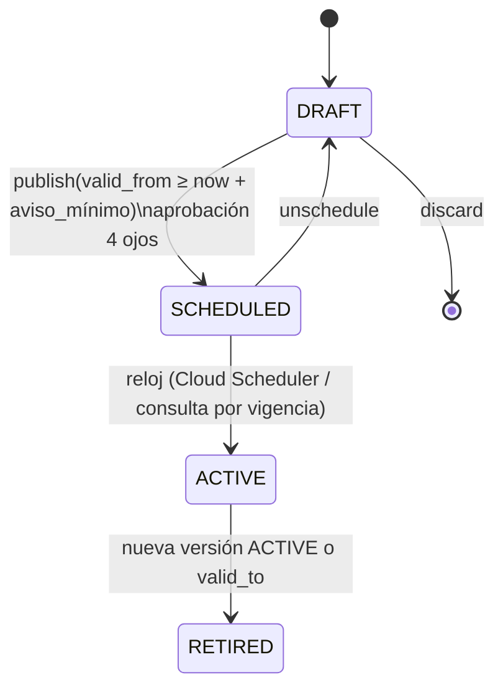

# Capítulo 4 (TAR). Motor de tarifas y precios dinámicos

> Capítulo: **Tarifas, precios dinámicos y cálculo de costo de sesión** para el CSMS propio que reemplaza la nube del proveedor.
> Fecha: 2026-09-18. Alcance: OCPP 1.6J hoy (lo que hablan los cargadores del proveedor), con el modelo preparado para OCPP 2.0.1/2.1 y OCPI.
> Convención: cuando cito el PDF del proveedor ("API OCPP 1.6 V1.0") indico el endpoint/campo textual. Todo lo demás está verificado en la web salvo donde diga explícitamente "no verificado", "confianza media" o "(a confirmar)"; la marca [V] señala lo contrastado con fuente primaria o implementación de referencia.

---

## 0. Resumen ejecutivo y decisiones que este capítulo fija

1. **El modelo de datos de tarifas se alinea con el módulo `Tariffs` de OCPI 2.2.1** (objetos `Tariff` → `TariffElement[]` → `PriceComponent[]` + `TariffRestrictions`), no con el `priceTemplateSnapshot` del PDF. El snapshot del proveedor (`UNIFORM_PRICE | TIME_SLOT_PRICING` + `priceData[{timeRange, price}]` + `defaultPrice`, endpoint `/api/connector/{version}/chargePort`) es un **caso particular** del modelo OCPI: una sola dimensión `ENERGY`, restricciones solo de `start_time/end_time`, y `defaultPrice` = elemento de respaldo sin restricciones. Alinearse con OCPI compra tres cosas: roaming futuro sin re-modelar, herramientas existentes (calculadoras `ocpi-tariffs`, CitrineOS-OCPI), y compatibilidad conceptual con el módulo de tarifas de OCPP 2.1 (que se diseñó alineado con OCPI).
2. **Precio dinámico = reglas declarativas versionadas que producen *modificadores* sobre una tarifa base**, nunca fórmulas libres en producción. Se evalúan **una sola vez, al instante de inicio**, y el resultado se congela en un **snapshot inmutable** (hash SHA-256) que viaja con la sesión. Un cambio de precio publicado después no afecta sesiones en curso. El conductor ve una **cotización (quote)** con vencimiento antes de iniciar; el snapshot se deriva de esa cotización.
3. **El motor de costo es una función pura y determinista**: `compute(snapshot, eventos_de_sesión, política) → líneas de costo`. Misma entrada → misma salida (hash), idempotente y re-ejecutable (recalculo con nueva `calc_version`, nunca sobrescritura).
4. **Dinero nunca en float**: tarifas en `NUMERIC(18,6)`, energía en **Wh enteros**, tiempo en **segundos enteros**, importes en **unidad monetaria mínima (BIGINT)**. Redondeo configurable (`HALF_UP` por defecto, `HALF_EVEN` opcional) y política de redondeo de impuestos `PER_LINE` (compatible con CFDI/DIAN) o `PER_TAX_GROUP`.
5. **OCPP 1.6 no transporta tarifas ni costos** al cargador; el precio se muestra en app/QR/web. Si el hardware lo soporta, se usa la extensión de OCA "OCPP & California Pricing Requirements" v3.1 (DataTransfer con `vendorId = "org.openchargealliance.costmsg"` y `messageId` `SetUserPrice | RunningCost | FinalCost` [V]; configuration keys `CustomDisplayCostAndPrice` (solo lectura: el cargador anuncia soporte), `DefaultPrice` (objeto JSON con `priceText` y `chargingPrice`), `DefaultPriceText,<idioma>`, `NumberOfDecimalsForCostValues`, `CustomIdleFeeAfterStop` [V, verificadas en las implementaciones abiertas EVerest y CitrineOS]). En OCPP 2.0.1 existen `TransactionEventResponse.totalCost` y `CostUpdatedRequest`; en OCPP 2.1 existe el módulo completo (`SetDefaultTariff`, `ChangeTransactionTariff`, `GetTariffs`, `ClearTariffs`).
6. **Idle fee con OCPP 1.6 tiene dos formas** que el motor debe cubrir: (a) ocupación *dentro* de la transacción (vehículo lleno, `StatusNotification(SuspendedEV)` o potencia ≈ 0, cable conectado) y (b) ocupación *después* de `StopTransaction` (estado `Finishing` hasta `Available`). Cuál aplica depende de `StopTransactionOnEVSideDisconnect` y del comportamiento del cargador.
7. **Pre-autorización** (equivalente al `startAmount` de `/api/connector/{version}/start` del PDF): el motor emite eventos `PREAUTH_WARN` (80 %) y `PREAUTH_EXHAUSTED` (costo proyectado ≥ 100 %); la política por tenant decide `RemoteStopTransaction` o intento de ampliación del hold / cargo a wallet.
8. **Regulación: nada se asume; todo es configurable por país** (moneda y exponente ISO 4217, impuestos, redondeo, componentes de precio permitidos, orden de presentación, medidores certificados/valores firmados, facturación electrónica, idioma del recibo). Ejemplos verificados [V]: AFIR (UE 2023/1804, art. 5 y art. 20), Eichrecht/OCMF (Alemania; confianza media en el detalle), Res. MME 40123 del 9-04-2024 (Colombia), DS 12/2022 + plataforma de interoperabilidad de la SEC (Chile), CFDI 4.0 con clave `c_ClaveProdServ` 83101800 (México).

---

## 1. Modelo de tarifas

### 1.1 Por qué alinearse con OCPI 2.2.1 `Tariffs`

Verificado [V] en el repositorio oficial `ocpi/ocpi` (`mod_tariffs.asciidoc`, rama `release-2.2.1-bugfixes`) y en el ejemplo `examples/tariff_4_complex.json`:

| Objeto | Campos (OCPI 2.2.1) | Uso en nuestro motor |
|---|---|---|
| `Tariff` | `country_code`, `party_id`, `id`, `currency` (ISO 4217), `type` (`AD_HOC_PAYMENT`, `PROFILE_CHEAP`, `PROFILE_FAST`, `PROFILE_GREEN`, `REGULAR`), `tariff_alt_text[]`, `tariff_alt_url`, `min_price`, `max_price`, `elements[]`, `energy_mix`, `start_date_time`, `end_date_time`, `last_updated` | Cabecera de la versión de tarifa. `min_price`/`max_price` = mínimo y **tope por sesión**. `start_date_time`/`end_date_time` = vigencia. |
| `TariffElement` | `price_components[]` (1..n), `restrictions` (0..1) | Una "franja" o "escalón". |
| `PriceComponent` | `type` (`ENERGY`, `TIME`, `PARKING_TIME`, `FLAT`), `price`, `vat`, `step_size` | Dimensión de precio. `step_size`: ENERGY en **Wh**, TIME/PARKING_TIME en **segundos**, FLAT sin unidad. |
| `TariffRestrictions` | `start_time`, `end_time` (hora local `HH:MM`, envuelve medianoche si `end_time < start_time`; para terminar a fin de día se usa `end_time = "00:00"`), `start_date` (inclusivo), `end_date` (exclusivo), `min_kwh` (inclusivo), `max_kwh` (exclusivo), `min_current`, `max_current` (A, suma de fases), `min_power`, `max_power` (kW), `min_duration` (inclusivo), `max_duration` (exclusivo; ambos en s y sobre la duración total de la sesión), `day_of_week[]` (`MONDAY`…`SUNDAY`), `reservation` (`RESERVATION`, `RESERVATION_EXPIRES`) | Franja horaria, día, fechas, potencia, duración, kWh acumulados, reserva. |

Reglas de evaluación **textuales de la especificación** (verificadas [V]):

- *"When the list of Tariff Elements contains more than one Element that has a Price Component for a certain dimension, then the first Tariff Element with a Price Component for that dimension in the list with matching Tariff Restrictions will be used. Only one Price Component per dimension can be active at any point in time."* → **primer elemento que coincide, por dimensión**.
- *"When more than one restriction is set, they are to be treated as a logical AND."*
- *"It is advised to always add a 'default' Price Component per dimension... by adding a Tariff Element without restrictions after all other occurrences of the same dimension."* → esto es exactamente el `defaultPrice` del PDF.
- `step_size`: *"Consumed amounts are rounded up to the smallest multiple of step_size that is greater than the consumed amount"*; ejemplo de la spec: TIME con `step_size=300` y 6 min consumidos → se facturan 10 min.
- `TIME` = tiempo cargando; `PARKING_TIME` = *"Time not charging"*. Ambos en horas, `step_size` en segundos.

Nota de versión [V]: la rama `master` de `ocpi/ocpi` corresponde ya a **OCPI 2.3.0** (publicada en febrero de 2025 por la EVRoaming Foundation; el día exacto queda a confirmar) e incluye el campo obligatorio `tax_included` (`TaxIncluded`) en `Tariff`, además de un ejemplo para Canadá/EE. UU. donde `vat` se omite porque el CPO no conoce la tasa de antemano. En **2.2.1** no existe `tax_included` [V]: el `price` es **sin IVA** y `vat` es el porcentaje aplicable (omitir `vat` no es lo mismo que `vat = 0`); `min_price`/`max_price` son objetos `Price {excl_vat, incl_vat}`. Recomendación: modelar internamente con `tax_included` explícito (como 2.3.0) y exportar a 2.2.1 o 2.3.0 según el socio de roaming.

**Por qué conviene alinearse**

1. **Roaming futuro (eMSP/hubs)**: el intercambio de tarifas con Hubject, Gireve u otro CPO/eMSP es OCPI; si el modelo interno ya es OCPI, exportar es serializar. OCPI 2.3.0 añadió campos pensados para AFIR y para escenarios fiscales de Norteamérica.
2. **Herramientas existentes**: `tandemdrive/ocpi-tariffs` [V] (Rust, publicado en crates.io como `ocpi-tariffs` y `ocpi-tariffs-cli`; calcula costos con tarifas OCPI 2.2.1 y convierte entradas 2.1.1 a 2.2.1; CLI `ocpi-tariffs price -c cdr.json -t tariff.json`; el repositorio se movió de GitHub a Codeberg en abril de 2025) sirve como **oráculo de pruebas** para nuestro motor. CitrineOS-OCPI implementa el módulo `Tariffs` como CPO 2.2.1 [V], pero su `calculateTotalCost` actual es un simple `kWh × precio` con un `TODO` para tarifas OCPI completas: **no** sirve como oráculo, solo como referencia de estructura.
3. **OCPP 2.1** definió su bloque de tarifas con una semántica muy parecida (verificado [V] en la implementación libocpp de EVerest, `include/ocpp/v2/ocpp_types.hpp`; el repositorio `EVerest/libocpp` quedó archivado en abril de 2026 y el código vive ahora en el monorepo `EVerest/EVerest`, ruta `lib/everest/ocpp/`): `Tariff{tariffId, currency, description, energy, chargingTime, idleTime, fixedFee, reservationTime, reservationFixed, minCost, maxCost, validFrom}`, `TariffConditions{startTimeOfDay, endTimeOfDay, dayOfWeek, validFromDate, validToDate, evseKind, minEnergy, maxEnergy, minCurrent, maxCurrent, minPower, maxPower, minTime, maxTime, minChargingTime, maxChargingTime, minIdleTime, maxIdleTime}`, `TariffConditionsFixed{…, paymentBrand, paymentRecognition}` (solo para `fixedFee`), `TaxRate{type, tax, stack}`, `Price{exclTax, inclTax, taxRates[]}`, `TotalCost{currency, typeOfCost, fixed, energy, chargingTime, idleTime, reservationTime, reservationFixed, total}`. Un mapeo OCPI→OCPP 2.1 es directo: `ENERGY→energy.prices[].priceKwh`, `TIME→chargingTime.prices[].priceMinute` (¡por minuto, no por hora!), `PARKING_TIME→idleTime.prices[].priceMinute`, `FLAT→fixedFee.prices[].priceFixed`, `min_price/max_price→minCost/maxCost`, `vat→taxRates[]`.

### 1.2 Extensiones propias (namespace `x_volt`) que OCPI no cubre

| Necesidad | OCPI 2.2.1 | Extensión propia (solo interna; se elimina al exportar) |
|---|---|---|
| Período de gracia del idle fee | No existe (se aproxima con `min_duration`, pero es duración total de sesión) | `x_volt.grace_period_s` en el elemento `PARKING_TIME`. Se aproxima con `TariffConditions.minIdleTime` de OCPP 2.1 (que es una condición de aplicabilidad del precio, no una gracia explícita). |
| Desde cuándo cuenta el idle | No definido | `x_volt.idle_start`: `CHARGING_END` (SuspendedEV / potencia < umbral) o `TRANSACTION_END` (tras StopTransaction). |
| Tope de idle | No | `x_volt.max_idle_s` (y `max_price` global). |
| Segmento de usuario | `type` solo distingue AD_HOC/REGULAR/PROFILE_* | La **asignación** (`tariff_assignment.segment`) decide qué tarifa aplica; el `type` se rellena al exportar (`AD_HOC_PAYMENT` para pago con tarjeta, `REGULAR` para el resto). |
| Promociones/cupones | No (OCPI espera una tarifa distinta por perfil) | `adjustments[]` post-cálculo (porcentaje o importe, por dimensión, con tope). Se congelan en el snapshot. |
| Escalones por potencia contratada / demanda | `min_power/max_power` (potencia de carga del EV) | Suficiente para "escalón por nivel de potencia" del conector. La demanda de la **sede** es una señal dinámica (sección 2). |
| Moneda con 0 decimales / redondeo a incrementos | No define decimales | `policy.minor_unit` (exponente ISO 4217: CLP=0, COP=2 pero se suele operar a 0, USD/EUR/MXN=2) y `policy.rounding_increment`. |

### 1.3 Alcance, segmentos y resolución

- **Alcance** (dónde aplica): `PLATFORM > TENANT > SITE > CHARGE_POINT > CONNECTOR`, más `CONNECTOR_TYPE` (p. ej. todos los `CCS` de la sede). El PDF confirma el catálogo de tipos de conector que veremos en `connectorResponse.connectorType`: `MODE2, MODE3_B, MODE3_C, MODE4, WIRELESS, TYPE_1, TYPE_2, CCS, OTHER`.
- **Segmentos**: `PUBLIC` (app, sin contrato), `ADHOC` (tarjeta en terminal, AFIR), `MEMBER` (con niveles), `FLEET`, `EMPLOYEE`, `ROAMING` (por eMSP), `INTERNAL` (pruebas/mantenimiento, costo 0).
- **Resolución de la tarifa base** para `(conector, segmento, t_inicio)`: se buscan asignaciones vigentes; gana la de **alcance más específico**; a igual especificidad, mayor `priority`; a igual prioridad, la publicada más recientemente. Siempre debe existir una asignación `PLATFORM/PUBLIC` de respaldo (si no, el conector no se puede iniciar: **fail-closed**, nunca "gratis por accidente").

```mermaid
flowchart LR
  A[Solicitud de precio\n conector + segmento + t_inicio] --> B[Asignaciones vigentes\n (scope, segment, valid_from/to)]
  B --> C[Tarifa base\n versión ACTIVE en t_inicio]
  C --> D[Reglas dinámicas\n señales en t_inicio]
  D --> E[Adjustments\n (promo, cupón, membresía)]
  E --> F[Quote\n precio visible + valid_until]
  F -->|inicio aceptado| G[Snapshot inmutable\n hash SHA-256]
  G --> H[Motor de costo\n eventos OCPP → líneas]
```

### 1.4 El `priceTemplateSnapshot` del PDF como caso particular

Ejemplo textual del PDF (`priceTemplateSnapshotResponse` en la respuesta de `/api/connector/{version}/chargePort`):

```json
"priceTemplateSnapshotResponse": {
  "priceData": [ {"timeRange": "09:00-14:00", "price": "0.05"},
                 {"timeRange": "14:00-20:00", "price": "0.65"} ],
  "currentPriceData": null,
  "priceTemplateTypeEnum": "TIME_SLOT_PRICING",
  "defaultPrice": 0.25
}
```

El PDF **no** indica la unidad del precio (se infiere por kWh), ni moneda, ni impuestos, ni dimensión de tiempo, ni idle. Traducción exacta al modelo OCPI:

```json
{
  "id": "legacy-6234002911",
  "currency": "XXX",
  "elements": [
    { "price_components": [ { "type": "ENERGY", "price": 0.05, "step_size": 1 } ],
      "restrictions": { "start_time": "09:00", "end_time": "14:00" } },
    { "price_components": [ { "type": "ENERGY", "price": 0.65, "step_size": 1 } ],
      "restrictions": { "start_time": "14:00", "end_time": "20:00" } },
    { "price_components": [ { "type": "ENERGY", "price": 0.25, "step_size": 1 } ] }
  ]
}
```

- `UNIFORM_PRICE` = un único elemento `ENERGY` sin restricciones.
- `TIME_SLOT_PRICING` = N elementos `ENERGY` con `start_time/end_time` + el `defaultPrice` como **último elemento sin restricciones** (exactamente la práctica recomendada por OCPI).
- Todo lo que el proveedor no tenía (tiempo, sesión, idle, día de semana, potencia, segmentos, tope, impuestos, vigencia) se obtiene "gratis" con el modelo general.

### 1.5 DDL (PostgreSQL en Cloud SQL)

```sql
-- Tarifa lógica (identidad estable) y sus versiones inmutables
CREATE TABLE tariff (
  id            UUID PRIMARY KEY,
  tenant_id     UUID NOT NULL,
  code          TEXT NOT NULL,                 -- p. ej. "CENTRO-PUBLICO"
  name          TEXT NOT NULL,
  currency      CHAR(3) NOT NULL,              -- ISO 4217
  created_at    TIMESTAMPTZ NOT NULL DEFAULT now(),
  UNIQUE (tenant_id, code)
);

CREATE TABLE tariff_version (
  id              UUID PRIMARY KEY,
  tariff_id       UUID NOT NULL REFERENCES tariff(id),
  version         INT  NOT NULL,
  status          TEXT NOT NULL CHECK (status IN ('DRAFT','SCHEDULED','ACTIVE','RETIRED')),
  valid_from      TIMESTAMPTZ,                 -- obligatorio al programar/publicar
  valid_to        TIMESTAMPTZ,
  tax_included    BOOLEAN NOT NULL DEFAULT false,
  CHECK (status = 'DRAFT' OR valid_from IS NOT NULL),   -- SCHEDULED/ACTIVE/RETIRED exigen vigencia
  definition      JSONB NOT NULL,              -- objeto OCPI Tariff + x_volt (precios como STRING decimal)
  definition_hash CHAR(64) NOT NULL,           -- sha256 canónico (JCS) de definition
  created_by      TEXT NOT NULL,
  approved_by     TEXT,                        -- cuatro ojos para publicar
  published_at    TIMESTAMPTZ,
  UNIQUE (tariff_id, version)
);
-- Solo una versión ACTIVE/SCHEDULED puede solapar en el tiempo por tarifa:
CREATE EXTENSION IF NOT EXISTS btree_gist;
ALTER TABLE tariff_version ADD CONSTRAINT no_overlap
  EXCLUDE USING gist (tariff_id WITH =, tstzrange(valid_from, valid_to, '[)') WITH &&)
  WHERE (status IN ('SCHEDULED','ACTIVE'));

CREATE TABLE tariff_assignment (
  id          UUID PRIMARY KEY,
  tenant_id   UUID NOT NULL,
  scope_type  TEXT NOT NULL CHECK (scope_type IN ('PLATFORM','TENANT','SITE','CHARGE_POINT','CONNECTOR','CONNECTOR_TYPE')),
  scope_id    TEXT NOT NULL,                   -- id del sitio/cargador/conector o el tipo (CCS...)
  segment     TEXT NOT NULL,                   -- PUBLIC | ADHOC | MEMBER:<tier> | FLEET:<id> | EMPLOYEE | ROAMING:<emsp> | INTERNAL
  tariff_id   UUID NOT NULL REFERENCES tariff(id),
  adjustments JSONB NOT NULL DEFAULT '[]',     -- descuentos ligados al segmento
  priority    INT  NOT NULL DEFAULT 0,
  valid_from  TIMESTAMPTZ NOT NULL,
  valid_to    TIMESTAMPTZ
);
CREATE INDEX ON tariff_assignment (tenant_id, scope_type, scope_id, segment);

CREATE TABLE pricing_rule (                    -- precios dinámicos (sección 2); UNA FILA POR VERSIÓN
  id          UUID PRIMARY KEY,                -- id de la fila (versión concreta)
  rule_id     TEXT NOT NULL,                   -- identidad estable de la regla (p. ej. "rule-occupancy-peak")
  tenant_id   UUID NOT NULL,
  name        TEXT NOT NULL,
  version     INT  NOT NULL,
  status      TEXT NOT NULL CHECK (status IN ('DRAFT','ACTIVE','RETIRED')),
  scope_type  TEXT NOT NULL, scope_id TEXT NOT NULL,
  priority    INT  NOT NULL,
  condition   JSONB NOT NULL,                  -- árbol all/any/not de predicados sobre señales
  action      JSONB NOT NULL,                  -- modificadores por dimensión, con topes
  valid_from  TIMESTAMPTZ NOT NULL, valid_to TIMESTAMPTZ,
  UNIQUE (tenant_id, rule_id, version)         -- (id, version) con id = PK no permitiría versionar
);

CREATE TABLE price_quote (                     -- lo que vio el conductor ANTES de iniciar
  id            UUID PRIMARY KEY,
  tenant_id     UUID NOT NULL,
  connector_id  TEXT NOT NULL,
  segment       TEXT NOT NULL,
  user_id       TEXT,
  computed_at   TIMESTAMPTZ NOT NULL,
  valid_until   TIMESTAMPTZ NOT NULL,          -- p. ej. computed_at + 10 min
  snapshot      JSONB NOT NULL,
  snapshot_hash CHAR(64) NOT NULL
);

CREATE TABLE session_tariff_snapshot (         -- INMUTABLE: nunca UPDATE
  session_id        UUID PRIMARY KEY,
  quote_id          UUID REFERENCES price_quote(id),
  tariff_version_id UUID NOT NULL REFERENCES tariff_version(id),
  snapshot          JSONB NOT NULL,
  snapshot_hash     CHAR(64) NOT NULL,
  applied_rules     JSONB NOT NULL DEFAULT '[]',
  frozen_at         TIMESTAMPTZ NOT NULL
);
REVOKE UPDATE, DELETE ON session_tariff_snapshot FROM app_rw;   -- solo INSERT (app_rw = rol de la aplicación; crearlo antes)

CREATE TABLE session_cost_calc (               -- una fila por ejecución del motor
  id            UUID PRIMARY KEY,
  session_id    UUID NOT NULL,
  calc_version  INT  NOT NULL,                 -- 1..n; el recibo referencia una calc_version
  kind          TEXT NOT NULL CHECK (kind IN ('RUNNING','FINAL','RECALC')),
  engine_version TEXT NOT NULL,                -- semver del motor
  input_hash    CHAR(64) NOT NULL,             -- sha256(snapshot_hash + eventos canónicos + policy)
  subtotal_minor BIGINT NOT NULL,              -- unidad mínima de la moneda
  discount_minor BIGINT NOT NULL,
  tax_minor      BIGINT NOT NULL,
  total_minor    BIGINT NOT NULL,
  capped         BOOLEAN NOT NULL DEFAULT false,
  flags          TEXT[] NOT NULL DEFAULT '{}', -- METER_ANOMALY, OFFLINE, INTERPOLATED, ORPHAN...
  computed_at    TIMESTAMPTZ NOT NULL,
  UNIQUE (session_id, calc_version),
  UNIQUE (session_id, input_hash, engine_version)   -- idempotencia
);

CREATE TABLE session_cost_line (
  id            UUID PRIMARY KEY,
  calc_id       UUID NOT NULL REFERENCES session_cost_calc(id),
  seq           INT  NOT NULL,
  dimension     TEXT NOT NULL CHECK (dimension IN ('FLAT','ENERGY','TIME','PARKING_TIME','RESERVATION','ADJUSTMENT','CAP')),
  element_ref   TEXT,                          -- índice/etiqueta del TariffElement aplicado
  period_start  TIMESTAMPTZ, period_end TIMESTAMPTZ,
  quantity      NUMERIC(18,6) NOT NULL,        -- kWh, minutos, unidades
  quantity_raw  BIGINT,                        -- Wh o segundos exactos antes de step_size
  unit          TEXT NOT NULL,                 -- kWh | min | session | pct
  unit_price    NUMERIC(18,6) NOT NULL,
  amount_minor  BIGINT NOT NULL,               -- redondeado a la unidad mínima
  tax_rate      NUMERIC(6,3) NOT NULL DEFAULT 0,
  tax_minor     BIGINT NOT NULL DEFAULT 0,
  UNIQUE (calc_id, seq)
);

CREATE TABLE tariff_audit (                    -- append-only
  id         BIGSERIAL PRIMARY KEY,
  entity     TEXT NOT NULL,                    -- tariff_version | tariff_assignment | pricing_rule
  entity_id  UUID NOT NULL,
  action     TEXT NOT NULL,                    -- CREATE | PUBLISH | RETIRE | ...
  actor      TEXT NOT NULL, actor_ip INET,
  at         TIMESTAMPTZ NOT NULL DEFAULT now(),
  before     JSONB, after JSONB, diff JSONB
);
```

Decisión de tipos: **precios dentro del JSONB como cadenas decimales** (`"0.35"`), no como números JSON: los parsers de JavaScript convierten números a `double` y `0.1+0.2 ≠ 0.3`. Al exportar a OCPI se convierten a número al final.

---

## 2. Precios dinámicos

### 2.1 Señales

| Señal | Fuente en el CSMS propio | Latencia | Uso típico |
|---|---|---|---|
| Ocupación de la sede / del cargador | `StatusNotification` (Available/Preparing/Charging/SuspendedEV/SuspendedEVSE/Finishing/Reserved/Unavailable/Faulted) agregado en Memorystore; `OFFLINE` derivado de la caída del WebSocket (el PDF lo añade como estado propio) | segundos | Recargo por alta demanda, descuento por baja ocupación |
| Hora y día | Reloj del servidor en zona horaria IANA de la sede | 0 | Franjas (esto ya lo cubre la tarifa base; la regla dinámica es para excepciones) |
| Precio de energía (mercado o comercializador) | Importación diaria/horaria (CSV/API del comercializador; en la UE precio spot) | horas | Indexación `ENERGY = costo_energía × (1+margen)` con topes |
| Potencia contratada y demanda de la sede | Suma de `Power.Active.Import` de `MeterValues` + límite del sitio (smart charging) | minutos | Recargo cuando la sede está al > 80 % de potencia contratada |
| Eventos/promociones | Calendario en back-office | días | Descuento "primer mes", "horas verdes" |
| Tipo de cliente | Segmento resuelto en la autorización (RFID/app/eMSP/tarjeta) | 0 | Tarifa distinta por segmento |
| Nivel de batería / potencia solicitada | `SoC` en `MeterValues` (si el cargador lo reporta; el PDF muestra `socValue` en `lastProcessData`), `requestPower` | minutos | Escalón por potencia (con `min_power/max_power`), incentivo a desconectar con SoC alto |
| Reserva | `ReserveNow`/`CancelReservation` (perfil Reservation de OCPP 1.6) | 0 | Componente `TIME` con `restrictions.reservation` |

### 2.2 Reglas declarativas vs fórmulas

**Decisión: reglas declarativas** (JSON, evaluadas por un motor determinista) con *modificadores acotados*, y **sin fórmulas de texto libre** en producción. Motivos: auditabilidad (se puede explicar al usuario y al regulador por qué pagó X), pruebas (cada regla es un caso), y seguridad (no se ejecuta código de negocio arbitrario). Si el negocio exige expresiones, se permite un lenguaje de expresiones **sin efectos secundarios, sin bucles y con tiempo acotado** (p. ej. CEL) únicamente dentro de `condition`, nunca para calcular el importe.

Ejemplo de regla:

```json
{
  "id": "rule-occupancy-peak", "version": 3, "priority": 100,
  "scope": { "type": "SITE", "id": "site-centro" },
  "condition": { "all": [
    { "signal": "site.occupancy_ratio", "op": ">=", "value": 0.8 },
    { "signal": "time.local_hour", "op": "between", "value": [17, 21] },
    { "signal": "user.segment", "op": "not_in", "value": ["FLEET", "INTERNAL"] }
  ]},
  "action": [
    { "dimension": "ENERGY", "op": "MULTIPLY", "value": "1.15", "label": "Alta demanda" }
  ],
  "constraints": { "max_multiplier": "1.50", "min_multiplier": "0.50", "requires_quote_visible": true },
  "valid_from": "2026-10-01T00:00:00Z", "valid_to": null
}
```

### 2.3 Prioridad y resolución de conflictos

1. Se evalúan solo reglas **ACTIVE** cuyo alcance contiene al conector y cuyo `valid_from/valid_to` incluye `t_inicio`.
2. Orden: alcance más específico primero; dentro del mismo alcance, `priority` descendente.
3. Política de combinación por dimensión (configurable por tenant): `FIRST_MATCH` (recomendado; la primera regla que aplica cierra la dimensión) o `STACK` con tope global (`max_multiplier`, `max_discount_pct`).
4. Los **adjustments de segmento/promoción** se aplican después de las reglas dinámicas y sobre importes ya calculados (líneas `ADJUSTMENT`), nunca modifican precios unitarios: así el recibo muestra "precio de lista" y "descuento" por separado (exigencia habitual de protección al consumidor).
5. Invariante: el precio efectivo por kWh resultante debe estar dentro de `[floor, ceiling]` configurados por tenant; si no, la regla se ignora y se registra `RULE_REJECTED_BOUNDS` en auditoría.

### 2.4 Versionado y publicación anticipada



- Toda versión es **inmutable** una vez `SCHEDULED`; corregir = nueva versión.
- `aviso_mínimo` configurable por país (p. ej. 24 h para tarifas públicas; ver sección 5). El back-office muestra "vigente desde" y la app puede anunciar "a partir del 1/10 el precio será…".
- **"Vigente" se calcula para `t_inicio`**: la API de cotización recibe `at` (por defecto `now`) y devuelve la versión cuyo `[valid_from, valid_to)` contiene `at`. Si el conductor cotiza a las 17:58 y la nueva versión entra a las 18:00, la cotización lleva `valid_until` ≤ 18:00 y, si inicia a las 18:01, se recalcula la cotización (la app debe volver a mostrar el precio antes de `RemoteStartTransaction`).
- El snapshot congela la **definición completa** de la tarifa (todas las franjas), no un solo precio: durante la sesión siguen aplicando las franjas de esa definición, pero **no** versiones publicadas después ni reglas dinámicas re-evaluadas. Es lo que exige la transparencia (AFIR: "todos los componentes del precio antes de iniciar") y lo que evita disputas.

### 2.5 Snapshot inmutable de la sesión

```json
{
  "snapshot_id": "snap_01J9…", "hash": "sha256:9f3c…",
  "session_id": "ses_01J9…", "quote_id": "q_01J9…",
  "frozen_at": "2026-09-22T22:35:00Z",
  "site_tz": "America/Bogota",
  "currency": "USD", "minor_unit": 2, "tax_included": false,
  "tariff": { "...": "objeto OCPI completo (precios como string)" },
  "tariff_version_id": "tv_…", "tariff_version": 3,
  "applied_rules": [
    { "rule_id": "rule-occupancy-peak", "version": 3, "matched": false,
      "signals": { "site.occupancy_ratio": "0.50", "time.local_hour": 17 } }
  ],
  "adjustments": [ { "type": "PERCENT", "dimension": "ENERGY", "value": "-15", "label": "Miembro Gold" } ],
  "policy": { "rounding": "HALF_UP", "tax_rounding": "PER_LINE", "interpolation": "LINEAR",
              "idle_start": "TRANSACTION_END", "cap_basis": "TOTAL_INCL_TAX",
              "charging_end_detect": { "status": ["SuspendedEV"], "power_below_w": 200, "for_s": 180 } },
  "preauth": { "provider": "stripe", "ref": "pi_…", "amount_minor": 1500, "warn_pct": 80, "stop_pct": 100 }
}
```

Se guarda `applied_rules` **aunque no coincidan** (`matched: false`) con los valores de las señales: es la evidencia para auditoría y para reproducir la decisión.

### 2.6 Auditoría y simulador

- Auditoría append-only (`tariff_audit`) con `before/after/diff`, actor, IP, y exportación diaria a BigQuery. Publicar requiere `approved_by ≠ created_by` (cuatro ojos) para tarifas de segmento `PUBLIC/ADHOC`.
- **Simulador "¿cuánto costaría?"**: `POST /v1/pricing/simulate` recibe `{connector_id | tariff_definition, segment, start_at, duration_min, energy_kwh | power_kw_profile[], idle_min}` y devuelve las mismas líneas de costo que produciría el motor. Se usa en la app ("estimado para 30 kWh: X"), en el back-office (previsualizar una versión DRAFT antes de publicar) y en pruebas (comparar contra `ocpi-tariffs`).

---

## 3. Cálculo end-to-end con OCPP 1.6

### 3.1 Secuencia completa

```mermaid
sequenceDiagram
  participant App
  participant CSMS
  participant Pay as Pasarela/Wallet
  participant CP as Cargador (OCPP 1.6J)
  App->>CSMS: GET /price-quotes?connector=…&segment=…
  CSMS-->>App: quote {precio por componente, valid_until}
  App->>CSMS: POST /sessions {quote_id, payment_method}
  CSMS->>Pay: hold(amount = preauth) → ref
  CSMS->>CSMS: INSERT session_tariff_snapshot (hash)
  CSMS->>CP: RemoteStartTransaction(idTag, connectorId)
  CP-->>CSMS: StatusNotification(Preparing)
  CP->>CSMS: StartTransaction(connectorId, idTag, meterStart, timestamp)
  CSMS-->>CP: StartTransaction.conf(transactionId, idTagInfo{Accepted})
  loop cada MeterValueSampleInterval
    CP->>CSMS: MeterValues(transactionId, Energy.Active.Import.Register, Power.Active.Import, SoC…)
    CSMS->>CSMS: compute(RUNNING) → costo acumulado; ¿preauth?
    CSMS-->>App: push costo acumulado
  end
  App->>CSMS: stop
  CSMS->>CP: RemoteStopTransaction(transactionId)
  CP->>CSMS: StopTransaction(transactionId, meterStop, timestamp, reason=Remote, transactionData[])
  CP-->>CSMS: StatusNotification(Finishing)
  CSMS->>CSMS: compute(FINAL parcial) — inicia reloj de idle
  CP-->>CSMS: StatusNotification(Available)  (cable retirado)
  CSMS->>CSMS: compute(FINAL) con idle → líneas + recibo
  CSMS->>Pay: capture(total ≤ hold)
  CSMS-->>App: recibo
```

Esto reproduce el flujo del PDF (`start → notification_start_result → lastProcessData → stop → notification_stop_result → notification_transaction`) pero ahora con mensajes OCPP y con el cálculo en nuestro lado.

### 3.2 Configuración del cargador que el motor necesita (`ChangeConfiguration`)

Keys estándar de OCPP 1.6 (verificadas [V] contra `mobilityhouse/ocpp` `v16/enums.py`, que lista las keys de la spec):

| Key | Valor recomendado | Por qué |
|---|---|---|
| `MeterValueSampleInterval` | `60` (s) (30 en DC rápida) | Granularidad del costo acumulado y de la interpolación en bordes de franja |
| `MeterValuesSampledData` | `Energy.Active.Import.Register,Power.Active.Import,Current.Import,Voltage,SoC` | Registro acumulado (base del costo), potencia (detección de "no cargando"), SoC (señal) |
| `StopTxnSampledData` | `Energy.Active.Import.Register,Power.Active.Import` | Van en `StopTransaction.transactionData`: permiten reconstruir franjas en sesiones offline |
| `ClockAlignedDataInterval` + `MeterValuesAlignedData` | `900` / `Energy.Active.Import.Register` | Lecturas alineadas a reloj (00, 15, 30, 45): útiles para cortes de franja "en punto" |
| `TransactionMessageAttempts` / `TransactionMessageRetryInterval` | `5` / `60` | Reintentos de Start/Stop/MeterValues offline |
| `StopTransactionOnEVSideDisconnect` | `true` | Al desconectar el cable termina la transacción → el idle post-stop es 0 y el idle "dentro" de la transacción se mide con SuspendedEV |
| `StopTransactionOnInvalidId` / `MaxEnergyOnInvalidId` | `true` / `0` | Evita energía no cobrable |
| `AuthorizeRemoteTxRequests` | `false` | `RemoteStartTransaction` ya viene autorizado por el CSMS |
| `MinimumStatusDuration` | `0`–`5` | No perder transiciones cortas (Finishing) |
| `UnlockConnectorOnEVSideDisconnect` | `true` | Evita cable atrapado y prolonga ocupación |

`Measurand` (verificados [V]): `Energy.Active.Import.Register`, `Energy.Active.Import.Interval`, `Power.Active.Import`, `Current.Import`, `Voltage`, `SoC`, `Temperature`, etc.; `ReadingContext`: `Sample.Periodic`, `Sample.Clock`, `Transaction.Begin`, `Transaction.End`, `Trigger`, `Interruption.Begin/End`, `Other`; `ValueFormat`: `Raw`, `SignedData`; `UnitOfMeasure` incluye `Wh` y `kWh` (¡normalizar siempre a Wh!).

### 3.3 Pre-autorización (equivalente al `startAmount` del PDF)

- **Tarjeta (Stripe u otra pasarela)**: crear el intento de pago con captura manual (el `thirdPartyTransactionId` del PDF, `"pi_3Omon…"`, tiene formato de PaymentIntent de Stripe; el operador lo generaba y luego `actualAmount` era lo capturado). Se captura al final un importe **≤ hold**. Que se pueda *ampliar* el hold (autorización incremental) depende de pasarela, red y emisor (a confirmar con la pasarela elegida; tratar como no disponible por defecto).
- **Wallet**: `hold` = bloqueo de saldo; el resto sigue igual.
- **Ad hoc con terminal (AFIR)**: el terminal fija el hold; el idle debe caber en el hold.

Política del motor (parámetros en el snapshot: `warn_pct`, `stop_pct`):

1. En cada `MeterValues`, `running_total_incl_tax` y `projected = running_total + potencia_actual_kW × precio_kWh_vigente × MeterValueSampleInterval/3600 × 2` (dos intervalos de margen).
2. Si `running_total ≥ warn_pct % · hold` → evento `PREAUTH_WARN` (push al usuario: "queda X").
3. Si `projected ≥ hold` → evento `PREAUTH_EXHAUSTED`; el orquestador ejecuta la política: (a) `EXTEND` si el proveedor lo permite y el usuario lo aceptó; si no, (b) `RemoteStopTransaction(transactionId)` **una sola vez** (idempotente por `session_id`). Si el cargador responde `Rejected` o no responde, reintento con backoff y, como último recurso, marcar la sesión `OVER_PREAUTH` para cobro posterior (con consentimiento guardado) o pérdida asumida por el tenant.
4. Idle fee: la reserva de margen para idle se define por política (`idle_reserve_minor`), o el idle se cobra en una operación posterior *off-session* solo si el método de pago quedó guardado con consentimiento explícito.
5. Sin conectividad con la pasarela en el momento del inicio → **no iniciar** (fail-closed), salvo segmentos con crédito (FLEET/EMPLOYEE).

### 3.4 Cálculo incremental con `MeterValues`

Entrada normalizada por evento: `(ts_cp, ts_srv, register_wh, power_w?, soc?)` a partir de `Energy.Active.Import.Register` (convertir `kWh`→`Wh`; aceptar solo `context ∈ {Sample.Periodic, Sample.Clock, Transaction.Begin, Transaction.End, Trigger}` para energía; ignorar duplicados exactos).

Algoritmo por dimensión `ENERGY`:

1. Ordenar lecturas por `ts_cp` (reloj del cargador; véase 3.5 para la política de reloj). Cada par consecutivo `(t_i, r_i) → (t_{i+1}, r_{i+1})` define un tramo con `ΔWh = r_{i+1} − r_i`.
2. Si `ΔWh < 0` (registro retrocede, reinicio del medidor) → `ΔWh = 0`, flag `METER_ANOMALY`, sesión a revisión.
3. Calcular los **límites de franja** (instantes en los que cambia el elemento `ENERGY` activo) que caen dentro de `(t_i, t_{i+1})`, en hora local de la sede (DST incluido). Para cada límite `t_b`, energía interpolada **linealmente**: `r_b = r_i + ΔWh × (t_b − t_i)/(t_{i+1} − t_i)`, redondeando a Wh entero y asignando el resto al último subtramo para que la suma sea **exactamente** `ΔWh`. Flag `INTERPOLATED` en la línea.
4. Acumular Wh por elemento activo; `min_kwh/max_kwh` se evalúan sobre la energía acumulada de la sesión al inicio de cada subtramo (y se parte el subtramo si el umbral cae dentro).
5. Aplicar `step_size` (Wh) al total por elemento **al cierre** (no en cada muestra, para que el acumulado no "salte").
6. `importe = kWh_facturables × price` → redondeo por política → `amount_minor`.

`TIME` (tiempo cargando) y `PARKING_TIME` (no cargando): se construye una línea de tiempo de estados `CHARGING | NOT_CHARGING` a partir de `StatusNotification` (`Charging` vs `SuspendedEV/SuspendedEVSE/Finishing`) y, como respaldo, `Power.Active.Import < power_below_w` durante `for_s`. Los segundos de cada estado se reparten por franjas igual que la energía, y `step_size` (s) se aplica por elemento al cierre. Con muestras faltantes, el tiempo se sigue contando (es el reloj, no el medidor), pero la energía de ese hueco se interpola.

### 3.5 Cierre con `StopTransaction`

- Energía total **autoritativa** = `meterStop − meterStart` (Wh; ambos en `StartTransaction`/`StopTransaction`). Si la suma de tramos difiere (muestras perdidas al final), el último tramo absorbe la diferencia y se marca `RECONCILED_TO_STOP`.
- `reason` (`EmergencyStop, EVDisconnected, HardReset, Local, Other, PowerLoss, Reboot, Remote, SoftReset, UnlockCommand, DeAuthorized`; verificado [V]): se guarda como `endReason` (el PDF muestra `"endReason": "Remote"`); afecta política: `PowerLoss/Reboot/HardReset` → no cobrar idle y revisar; `EVDisconnected` → idle post-stop = 0.
- **Timestamps**: el cargador envía `timestamp` en `StartTransaction`, `StopTransaction` y en cada `sampledValue`; el servidor registra `received_at`. Política: usar `ts_cp` para franjas y duración (es el que corresponde al hecho físico y a las lecturas), **salvo** que `|ts_cp − ts_srv| > skew_max` (p. ej. 120 s) estando online, en cuyo caso se usa `ts_srv` y se marca `CLOCK_SKEW` (y se envía `Heartbeat` para que el cargador sincronice: `Heartbeat.conf.currentTime`). En sesiones offline el `ts_cp` es el único disponible y se acepta con flag `OFFLINE`.
- `transactionData[]` de `StopTransaction` (según `StopTxnSampledData`) se fusiona con los `MeterValues` recibidos (deduplicando por `(timestamp, measurand)`).

### 3.6 Idle fee (ocupación) con OCPP 1.6

Dos casos que el motor cubre con la misma línea `PARKING_TIME`:

| Caso | Cómo se detecta | Inicio del idle | Fin del idle |
|---|---|---|---|
| A. Vehículo lleno, sigue conectado, transacción abierta | `StatusNotification(SuspendedEV)` o potencia < umbral por N s | `charging_end` (+gracia) | `StopTransaction` o reanudación de `Charging` |
| B. Transacción terminada por app/RFID, vehículo sigue conectado | `StopTransaction` seguido de `StatusNotification(Finishing)` (u `Occupied`-equivalente del fabricante) | `StopTransaction.timestamp` (+gracia) | `StatusNotification(Available)` (o `Preparing` si otro usuario conecta) |

- `x_volt.idle_start = CHARGING_END` cubre A y B; `TRANSACTION_END` solo B (más simple y menos disputable; recomendado para empezar).
- Gracia: `facturable_s = max(0, idle_s − grace_period_s)`; después `step_size`.
- Tope: `max_idle_s` y `max_price`. Si el cargador se cae (`OFFLINE`) durante el idle, el idle se **cierra en el último estado conocido** (no se cobra lo que no se pudo observar).
- La sesión de negocio (`session`) permanece `IDLE_PENDING` hasta `Available` o hasta `idle_timeout` (p. ej. 12 h) → cierre administrativo con flag.
- Limitación real: en 1.6 el estado es **por conector y solo cambia cuando cambia** (`MinimumStatusDuration`); si el fabricante no emite `Finishing` o pasa directo a `Available`, el caso B no es medible → preguntar al proveedor (sección 8).

### 3.7 Sesiones offline y reconciliación

Hechos OCPP 1.6 (confianza media-alta; contrastados con fuentes secundarias y con las configuration keys estándar `TransactionMessageAttempts`/`TransactionMessageRetryInterval` [V]): las "transaction-related messages" (`StartTransaction`, `StopTransaction`, `MeterValues` con `transactionId`) se **encolan** en el cargador y se reintentan (`TransactionMessageAttempts/RetryInterval`) **en orden**; el `transactionId` solo existe tras `StartTransaction.conf`, por lo que un cargador que inició offline entrega primero `StartTransaction` al reconectar y después el resto. Algunos firmwares usan `transactionId = -1` como marcador provisional en `MeterValues` (a verificar con el proveedor).

Máquina de estados de la sesión de negocio: `QUOTED → AUTHORIZED → STARTING → RUNNING → STOPPING → STOPPED → IDLE_PENDING → FINALIZED → SETTLED`, con ramas `ORPHAN` (sin `StopTransaction` en `orphan_timeout`, p. ej. 24 h → cierre con la última lectura, flag, cobro del mínimo defendible) y `DISPUTED`.

Reglas de reconciliación:

1. Clave natural de idempotencia OCPP: `(charge_box_id, transactionId)`; para `MeterValues`: `(charge_box_id, transactionId, timestamp, measurand, context)`.
2. Llegada tardía de `StopTransaction` sobre una sesión `ORPHAN` ya cobrada → nuevo `calc_version` (`RECALC`), diferencia → cargo/reembolso según política y límites (p. ej. no cobrar diferencias > X sin revisión humana).
3. `StartTransaction` sin sesión de negocio (RFID local con `LocalAuthorizeOffline` / `AllowOfflineTxForUnknownId`) → crear sesión `UNSOLICITED`; tarifa = la vigente para el segmento del `idTag` **en el `timestamp` del cargador** (única excepción a "snapshot al inicio": aquí el snapshot se construye retroactivamente y se marca `RETRO_SNAPSHOT`).
4. Sesiones offline no muestran costo acumulado: la app debe avisar "cargador sin conexión; el costo se calculará al reconectar" y el hold debe ser suficiente (o no permitir inicio remoto si el cargador está `OFFLINE`, que es lo lógico: `RemoteStartTransaction` no puede entregarse).

### 3.8 Precisión decimal y redondeo

- Cantidades exactas: `Wh` (BIGINT) y `s` (BIGINT). `kWh = Wh/1000` solo al presentar.
- Precios unitarios: `NUMERIC(18,6)`; importes: **unidad mínima** (`amount_minor BIGINT`), exponente según ISO 4217 (`minor_unit`), con `rounding_increment` opcional (p. ej. CLP a 1, o precios de COP a 1 o 10 pesos por práctica comercial; **decisión pendiente por país**).
- Modo: `HALF_UP` por defecto (esperado por consumidores en LatAm/UE), `HALF_EVEN` opcional. **Nunca `float`/`double`** en ningún punto del pipeline (Python `Decimal`, Java `BigDecimal`, Go `shopspring/decimal`, Node `decimal.js` o enteros).
- **Redondeo por línea vs por total**: cada línea (`FLAT`, cada franja `ENERGY`, `TIME`, `PARKING_TIME`, cada `ADJUSTMENT`) se redondea a `minor_unit` **individualmente**; el subtotal es la **suma de líneas redondeadas** (así el recibo cuadra al centavo). Los impuestos: `PER_LINE` (impuesto por línea, redondeado; CFDI 4.0 exige impuestos por concepto; DIAN calcula por línea y por tarifa) o `PER_TAX_GROUP` (impuesto sobre el subtotal por tasa). La diferencia puede ser de 1 unidad mínima (ver ejemplo en la sección 6). Se registra la política en el snapshot para que el recálculo sea idéntico.
- Descuentos porcentuales se calculan sobre **importes ya redondeados** de las líneas base (lo que el cliente ve) y se redondean a su vez.
- `max_price` (tope): `cap_basis = TOTAL_INCL_TAX | SUBTOTAL_EXCL_TAX`; si aplica, se añade una línea `CAP` negativa por la diferencia (y su impuesto proporcional), en lugar de "recortar" líneas.
- Impuestos incluidos/excluidos: `tax_included=true` (B2C en muchos países) ⇒ el precio unitario incluye impuesto; el motor **desglosa** `neto = bruto / (1 + tasa)` solo para el recibo/factura, redondeando el impuesto y obteniendo el neto por diferencia (así `neto + impuesto = bruto` exactamente).

### 3.9 Recibos

Campos mínimos del recibo (independientes del país; los fiscales se añaden en el conector de facturación electrónica):

`session_id`, `charge_box_id`/`connector_id`, dirección de la sede, `start_at`/`stop_at` (hora local + zona), `energy_kwh` (con `meterStart/meterStop` en Wh), `charging_time`, `idle_time` (con gracia aplicada), líneas (descripción, cantidad, unidad, precio unitario, importe, impuesto), descuentos, tope aplicado, subtotal, impuestos por tasa, total, moneda, método de pago (`hold` y `capturado`), `tariff_version` y `snapshot_hash` (trazabilidad), `endReason`, y, donde aplique, valores de medidor firmados (OCMF) y clave pública del medidor.

---

## 4. Limitaciones de OCPP 1.6 y qué cambia en 2.0.1 / 2.1 (verificado)

| Capacidad | OCPP 1.6J | OCPP 2.0.1 | OCPP 2.1 |
|---|---|---|---|
| Enviar tarifa al cargador | **No existe** ningún mensaje estándar | No hay tarifa estructurada; solo textos (`TariffFallbackMessage`, `DisplayMessage`) | **Sí** [V]: `SetDefaultTariff(evseId, tariff) → status: TariffSetStatusEnum`, `ChangeTransactionTariff(transactionId, tariff) → status: TariffChangeStatusEnum`, `GetTariffs(evseId) → tariffAssignments[]`, `ClearTariffs(tariffIds[]?, evseId?) → clearTariffsResult[]` (estructuras verificadas en libocpp v21, hoy en `EVerest/EVerest`) |
| Enviar costo acumulado/final | **No existe** | `TransactionEventResponse.totalCost` [V] (costo final con impuestos, en la moneda de `TariffCostCtrlr.Currency`; `0.00` = transacción gratuita; **si se omite, la transacción NO fue gratis**: el CSMS simplemente no comunica el costo y el cargador muestra `TotalCostFallbackMessage`) y `CostUpdatedRequest(totalCost, transactionId)` [V] periódico; componente `TariffCostCtrlr` con `Enabled`/`Available` (instancias `Tariff` y `Cost`), `TariffFallbackMessage`, `TotalCostFallbackMessage`, `Currency` [V] (y en libocpp 2.1: `NumberOfDecimalsForCostValues`, `OfflineChargingPrice` (`kWhPrice`/`hourPrice`), `OfflineTariffFallbackMessage` [V]) | Además `CostDetails{totalCost, totalUsage, chargingPeriods[], failureToCalculate, failureReason}` en `TransactionEventRequest` [V], desglose `TotalCost{fixed, energy, chargingTime, idleTime, reservationTime, reservationFixed, total}` [V] y `updatedPersonalMessageExtra[]` en la respuesta |
| Precio en la pantalla del cargador | Solo con **extensión propietaria** vía `DataTransfer` | `DisplayMessage` + `updatedPersonalMessage` en `TransactionEventResponse` [V] (y California Pricing vía `customData`, ver abajo) | Tarifa nativa + mensajes |
| Idle/gracia | Nada | Nada estructurado | `TariffConditions.minIdleTime` (= período de gracia) |

**Extensión estandarizada de facto para 1.6**: el whitepaper de la Open Charge Alliance "OCPP & California Pricing Requirements" (v3.1, 13-09-2024 [V]; aplica a 1.6 y 2.0.1; PDF: `openchargealliance.org/wp-content/uploads/2024/09/ocpp_and_dms_evse_regulation-v3.1.pdf`) define, con `DataTransfer`, `vendorId = "org.openchargealliance.costmsg"` [V] y los `messageId` `SetUserPrice` (precio para el usuario tras autorizar) [V], `RunningCost` (enviado justo después de `StartTransaction.conf` y periódicamente: incluye `transactionId`, `timestamp`, `meterValue`, `cost`, `state`, `chargingPrice{kWhPrice, hourPrice, flatFee}` [V]; `idlePrice{graceMinutes, hourPrice}`, `nextPeriod`, `triggerMeterValue` (a confirmar contra el PDF)), `FinalCost` (`cost`, `priceText`, `qrCodeText`) [V], y las configuration keys `CustomDisplayCostAndPrice` (booleana, **solo lectura**: se lee con `GetConfiguration` para descubrir el soporte) [V], `DefaultPrice` (objeto JSON `{priceText, chargingPrice}` que el CSMS fija con `ChangeConfiguration`) [V], `DefaultPriceText,<idioma>` (textos por idioma; v3.1 corrigió una referencia de v3.0 que decía `DefaultPrice` donde debía decir `DefaultPriceText`) [V], `NumberOfDecimalsForCostValues`, `CustomIdleFeeAfterStop`, `SupportedLanguages` y `TimeOffset` [V en libocpp]. En 2.0.1 la misma extensión viaja en `customData` (con ese `vendorId`) de `CostUpdated`/`TransactionEventResponse`, y el cargador anuncia soporte con `CustomizationCtrlr.CustomImplementationEnabled` (instancia `org.openchargealliance.costmsg`) [V]. Implementaciones abiertas: libocpp dentro de `EVerest/EVerest` (1.6 y 2.0.1 implementados; la issue #706 de `EVerest/libocpp` quedó cerrada al archivarse ese repositorio) [V] y `CitrineOS` (PR #1020, fusionado el 14-09-2026 en la rama `next`, aún no necesariamente en una release: implementa v3.1 para 1.6 con `defaultPrice{priceText, chargingPrice}`, `runningCost{cost, state, chargingPrice}`, `finalCost{cost, priceText}`; excluye por ahora `idlePrice`, `nextPeriod`, `SetUserPrice`, `qrCodeText`, multi-idioma y zona horaria) [V].

Consecuencia práctica: **el precio se muestra en la app, en la web del QR del conector y, si el cargador lo soporta, vía California Pricing**. Si el cargador del proveedor no implementa esa extensión ni `DataTransfer` documentado, la pantalla del cargador no mostrará precio y hay que fijar un **QR estático** con el precio ad hoc (aceptado por AFIR en la UE; exigido "de forma desagregada y visible" por la Res. 40123/2024 en Colombia).

---

## 5. Regulación: qué debe ser configurable por país (sin asumir país)

| Parámetro configurable | Ejemplo UE (AFIR, Reg. (UE) 2023/1804, art. 5) | Alemania (Eichrecht) | Colombia (Res. MME 40123 del 9-04-2024: condiciones de interoperabilidad de estaciones de acceso público [V]) | Chile (DS 12/2022, publicado 17-05-2022, vigente 18 meses después [V]) | México |
|---|---|---|---|---|---|
| Componentes de precio permitidos | ≥ 50 kW: precio **por kWh** obligatorio + opcional **tarifa de ocupación por minuto**, mostrados en la pantalla de la estación; < 50 kW: por kWh, por minuto, por sesión y otros, **presentados en ese orden** (información disponible, no necesariamente en pantalla) [V]. Precio visible **antes** de iniciar; "razonable, fácilmente comparable, transparente y no discriminatorio" [V] | Facturar por kWh exige medidor conforme y **valores firmados** (OCMF) verificables con software de transparencia; facturar por tiempo exige medición de tiempo conforme (confianza media) | Res. MME 40123/2024: precio de carga fijado libremente; obligación de informar **de forma clara y previa** precios de carga, estacionamiento y otros costos, **desagregados y visibles**; acceso sin membresía | DS 12/2022 (Ley 21.305): plataforma de interoperabilidad de la SEC; obligación de reportar precios, medios de pago y estado en tiempo real | No se encontró regulación de precio; aplica protección al consumidor general |
| Pago ad hoc | Obligatorio en todos los puntos públicos desde 13-04-2024 [V]; lector de tarjeta/contactless en ≥ 50 kW nuevos desde esa fecha (un QR no basta) [V]; retrofit de ≥ 50 kW existentes en TEN-T y aparcamientos seguros para 1-1-2027 [V]; se admite un terminal compartido por *pool* | — | Obligatorio (sin suscripción ni membresía) [V] | Reportar medios de pago a la plataforma de la SEC [V] | — |
| Medición/valores firmados | Recomendado (OCA "Signed Meter Values in OCPP" v1.0, 10-02-2025 [V], aplicable a 1.6/2.0.1/2.1: `format: "SignedData"` con OCMF base64 + `publicKey` en 1.6; detalle de campos a confirmar contra el PDF) | Obligatorio | Medidores según reglamentación técnica (RETIE) — verificar | Verificar SEC | Verificar |
| Facturación electrónica | Por país miembro | — | DIAN: factura electrónica de venta / documento equivalente POS electrónico, vía software propio o proveedor tecnológico | SII: boleta/factura electrónica (DTE) | SAT: CFDI 4.0 timbrado por PAC; clave `c_ClaveProdServ` candidata **83101800 "Servicios eléctricos"** (existe en el catálogo del Anexo 20 v4.0 [V]; confirmar con contador que aplica al servicio de recarga) |
| Impuestos | IVA por país; `vat` por componente | IVA 19 % | IVA (verificar si aplica exención) | IVA 19 % | IVA 16 % |
| Moneda / decimales / redondeo | EUR, 2 decimales | EUR | COP (práctica: 0 decimales) | CLP (0 decimales) | MXN, 2 decimales |
| Aviso mínimo de cambio de precio | Transparencia; publicar datos estáticos y dinámicos (incl. precio ad hoc y disponibilidad) en el National Access Point (art. 20, desde 14-04-2025 [V]; formato DATEX II obligatorio desde 14-04-2026 [V]; actualización de datos dinámicos en ≤ 1 min, a confirmar) | — | "Clara y previa" [V] | Reporte a plataforma SEC (registro del cargador en 30 días tras energización) [V] | — |
| Idioma del recibo | Idioma(s) del país | DE | ES | ES | ES |

Diseño: una tabla `country_profile` (por tenant y sede) con `currency`, `minor_unit`, `rounding_mode`, `rounding_increment`, `tax_included_default`, `tax_rates[]`, `allowed_dimensions_by_power`, `display_order`, `require_signed_meter_values`, `min_notice_hours`, `einvoice_connector` (`DIAN|SII|SAT|NONE`), `receipt_languages[]`. Estos valores se copian al snapshot (`policy`) para que un cambio regulatorio no altere sesiones ya cerradas.

---

## 6. Ejemplo completo

### 6.1 Tarifa: franjas + idle + descuento de miembro (moneda ilustrativa USD, 2 decimales, IVA 19 % no incluido)

```json
{
  "country_code": "XX", "party_id": "VLT", "id": "CENTRO-PUBLICO", "version": 3,
  "currency": "USD", "type": "REGULAR",
  "tariff_alt_text": [ { "language": "es", "text": "0,50 por sesión + energía por franja; ocupación tras 10 min de gracia 6,00/h (L-V 7-22h). Precios sin IVA (19 %). Tope 60,00 sin IVA." } ],
  "tariff_alt_url": "https://volt.example/tarifas/centro-publico",
  "max_price": { "excl_vat": "60.00", "incl_vat": "71.40" },
  "elements": [
    { "price_components": [ { "type": "FLAT", "price": "0.50", "vat": "19", "step_size": 1 } ] },

    { "price_components": [ { "type": "ENERGY", "price": "0.20", "vat": "19", "step_size": 1 } ],
      "restrictions": { "start_time": "22:00", "end_time": "07:00" } },

    { "price_components": [ { "type": "ENERGY", "price": "0.45", "vat": "19", "step_size": 1 } ],
      "restrictions": { "start_time": "18:00", "end_time": "22:00",
                        "day_of_week": ["MONDAY","TUESDAY","WEDNESDAY","THURSDAY","FRIDAY"] } },

    { "price_components": [ { "type": "ENERGY", "price": "0.35", "vat": "19", "step_size": 1 } ],
      "restrictions": { "start_time": "07:00", "end_time": "18:00",
                        "day_of_week": ["MONDAY","TUESDAY","WEDNESDAY","THURSDAY","FRIDAY"] } },

    { "price_components": [ { "type": "ENERGY", "price": "0.30", "vat": "19", "step_size": 1 } ] },

    { "price_components": [ { "type": "PARKING_TIME", "price": "6.00", "vat": "19", "step_size": 60 } ],
      "restrictions": { "start_time": "07:00", "end_time": "22:00",
                        "day_of_week": ["MONDAY","TUESDAY","WEDNESDAY","THURSDAY","FRIDAY"] },
      "x_volt": { "grace_period_s": 600, "idle_start": "TRANSACTION_END", "max_idle_s": 14400 } }
  ],
  "start_date_time": "2026-10-01T05:00:00Z",
  "last_updated": "2026-09-18T12:00:00Z"
}
```

Asignación para miembros Gold en la sede (misma tarifa base, descuento como ajuste):

```json
{ "scope": { "type": "SITE", "id": "site-centro" }, "segment": "MEMBER:GOLD",
  "tariff_id": "CENTRO-PUBLICO", "priority": 10,
  "adjustments": [ { "type": "PERCENT", "dimension": "ENERGY", "value": "-15", "label": "Descuento miembro Gold" } ],
  "valid_from": "2026-10-01T05:00:00Z" }
```

Lectura de la lista (primer elemento que coincide por dimensión): `ENERGY` se resuelve en orden **valle (22-07) → punta L-V (18-22) → día L-V (07-18) → resto (0.30, fines de semana de día)**; `FLAT` y `PARKING_TIME` tienen un único elemento cada uno.

### 6.2 Sesión de ejemplo (martes, hora local de la sede; miembro Gold; hold 15,00)

Eventos OCPP recibidos (Wh del `Energy.Active.Import.Register`):

| # | Hora local | Mensaje | Valor |
|---|---|---|---|
| 0 | 17:35:00 | `StartTransaction` | `meterStart = 120000` |
| 1 | 17:45:00 | `MeterValues` | 121200 |
| 2 | 17:55:00 | `MeterValues` | 122400 |
| 3 | 18:05:00 | `MeterValues` | 123600 |
| 4 | 18:15:00 | `MeterValues` | 124800 |
| 5 | 18:25:00 | `MeterValues` | 126000 |
| 6 | 18:35:00 | `MeterValues` | 127200 |
| — | 18:45:00 | *(muestra perdida)* | — |
| 7 | 18:55:00 | `MeterValues` | 129600 |
| 8 | 19:05:00 | `MeterValues` | 130800 |
| 9 | 19:15:00 | `MeterValues` | 131400 |
| 10 | 19:20:00 | `StopTransaction` | `meterStop = 131700`, `reason = Remote` |
| 11 | 19:20:03 | `StatusNotification` | `Finishing` |
| 12 | 19:52:30 | `StatusNotification` | `Available` |

Paso a paso:

1. **Energía total** = 131700 − 120000 = **11 700 Wh = 11,700 kWh**.
2. **Límite de franja** a las 18:00:00 (día L-V 0,35 → punta 0,45) cae entre #2 (17:55, 122400) y #3 (18:05, 123600). Interpolación lineal: `122400 + 1200 × (5/10) = 123000 Wh`. Flag `INTERPOLATED`.
3. Franja 07-18: `123000 − 120000 = 3000 Wh = 3,000 kWh × 0,35 = 1,050 → 1,05`.
4. Franja 18-22: `131700 − 123000 = 8700 Wh = 8,700 kWh × 0,45 = 3,915 → 3,92` (HALF_UP). La muestra perdida de 18:45 no afecta: el tramo 18:35→18:55 (2400 Wh) está íntegro en la misma franja.
5. **Sesión** `FLAT` = 0,50.
6. **Descuento Gold** −15 % sobre líneas `ENERGY` redondeadas: base 1,05 + 3,92 = 4,97; 4,97 × 0,15 = 0,7455 → **−0,75**.
7. **Idle** (política `TRANSACTION_END`): 19:20:00 → 19:52:30 = 1950 s; gracia 600 s → 1350 s; `step_size 60` → ⌈1350/60⌉ = 23 bloques = 1380 s = 23 min; 6,00/h = 0,10/min → **2,30**. Franja L-V 07-22 satisfecha.
8. **Subtotal sin IVA** = 0,50 + 1,05 + 3,92 − 0,75 + 2,30 = **7,02**.
9. **IVA 19 % por línea**: 0,50→0,095→0,10; 1,05→0,1995→0,20; 3,92→0,7448→0,74; −0,75→−0,1425→−0,14; 2,30→0,437→0,44 ⇒ **1,34**. (Con `PER_TAX_GROUP`: 7,02 × 0,19 = 1,3338 → 1,33: una unidad mínima de diferencia; por eso la política va en el snapshot.)
10. **Total** = 7,02 + 1,34 = **8,36**. Tope 71,40 no alcanzado. Hold 15,00 ≥ 8,36 → captura 8,36.

Costo acumulado intermedio (para `RunningCost`/app) a las 18:35: energía 3,000 kWh × 0,35 = 1,05 y (127200 − 123000) = 4,2 kWh × 0,45 = 1,89; sesión 0,50; descuento 15 % de 2,94 = 0,441 → −0,44; subtotal 3,00; IVA por línea 0,10 + 0,20 + 0,36 − 0,08 = 0,58; total **3,58** (24 % del hold; sin alertas).

Líneas resultantes (`session_cost_line`):

| seq | dimension | element_ref | periodo | quantity | unit | unit_price | amount | tax |
|---|---|---|---|---|---|---|---|---|
| 1 | FLAT | e0 | — | 1 | session | 0.50 | 0.50 | 0.10 |
| 2 | ENERGY | e3 (07-18 L-V) | 17:35–18:00 | 3.000 | kWh | 0.35 | 1.05 | 0.20 |
| 3 | ENERGY | e2 (18-22 L-V) | 18:00–19:20 | 8.700 | kWh | 0.45 | 3.92 | 0.74 |
| 4 | ADJUSTMENT | Gold −15 % | — | 4.97 | base | −0.15 | −0.75 | −0.14 |
| 5 | PARKING_TIME | e5 | 19:30–19:52:30 (tras gracia) | 23 | min | 0.10 | 2.30 | 0.44 |
| | | | | | | **subtotal** | **7.02** | **1.34** |
| | | | | | | **total** | | **8.36** |

### 6.3 Casos de prueba unitarios del motor

| ID | Caso | Entrada | Resultado esperado |
|---|---|---|---|
| T1 | **Borde de franja exacto** | Lectura con `timestamp` = 18:00:00.000 local | Pertenece a la franja que **empieza** a las 18:00 (`start_time` inclusivo, `end_time` exclusivo); no se genera subtramo de 0 Wh |
| T2 | **Cambio de día / franja que envuelve medianoche** | Sesión domingo 23:30 → lunes 00:30 con valle 22-07 (sin día) y punta L-V 18-22 | Toda la sesión en valle 0,20; `day_of_week` se evalúa **al inicio de cada subtramo** (a las 00:00 cambia a lunes pero sigue en valle) |
| T3 | **Sesión que cruza franjas sin lectura en el borde** | Lecturas 17:55 = 122400 y 18:05 = 123600; borde 18:00 | Interpolación 123000; `ΣWh por franja == meterStop − meterStart` exactamente (propiedad); flag `INTERPOLATED` |
| T4 | **Idle con gracia** | Idle 9:59 → 0 bloques; 10:00 → 0; 10:01 → 1 bloque (60 s) = 0,10; 32:30 → 23 bloques = 2,30 | Fórmula `max(0, idle − grace)` y `ceil(/step_size)` |
| T5 | **Pre-autorización alcanzada** | Hold 5,00; lecturas que llevan el proyectado a ≥ 5,00 | Evento `PREAUTH_WARN` a ≥ 4,00; `PREAUTH_EXHAUSTED` una sola vez (idempotente por `session_id`); el orquestador emite **un** `RemoteStopTransaction`; el total final capturado ≤ hold |
| T6 | **Redondeo** | 3,915 y 4,965 | `HALF_UP`: 3,92 / 4,97; `HALF_EVEN`: 3,92 / 4,96; `total == Σ líneas redondeadas`; IVA `PER_LINE` = 1,34 vs `PER_TAX_GROUP` = 1,33 |
| T7 | **Medidor retrocede / offline** | Registro 125000 → 124000 → 126000; o `StopTransaction` 3 h después con `ts_cp` | Δ negativo = 0 + `METER_ANOMALY`; offline: franjas por `ts_cp`, flag `OFFLINE`, recálculo idéntico (mismo `input_hash` → mismo resultado) |
| T8 | **Tope por sesión** | `max_price.incl_vat = 71.40`, sesión de 200 kWh punta | Línea `CAP` negativa = total − 71,40 (con IVA proporcional); `capped = true`; `total == 71.40` |
| T9 | **Determinismo/idempotencia** | Mismos eventos en distinto orden, con duplicados exactos | Mismo `output_hash`; duplicados ignorados; la segunda ejecución con el mismo `input_hash` no crea `calc_version` nuevo |
| T10 | **DST (donde exista)** | Sesión que cruza el cambio de hora (hora repetida u omitida) | Duración en segundos UTC correcta; franjas resueltas con hora local IANA; sin doble cobro ni hueco |
| T11 | **Fail-closed** | Conector sin ninguna asignación vigente para el segmento ni respaldo `PLATFORM/PUBLIC` | `Quote` y `RemoteStartTransaction` rechazados con `NO_TARIFF`; nunca sesión a costo 0 salvo segmento `INTERNAL` explícito |
| T12 | **Precio con impuesto incluido** | `tax_included = true`, precio 0,119/kWh con IVA 19 %, 10,000 kWh | Bruto 1,19; impuesto 0,19; neto 1,00 por diferencia; `neto + impuesto == bruto` exactamente |
| T13 | **Lecturas en kWh** | `MeterValues` con `unit = kWh` y valor `120.0`/`121.2` | Normalizados a 120000/121200 Wh antes del cálculo; mismo resultado que T3 |

---

## 7. Diseño técnico del motor

### 7.1 Contrato

```text
compute(snapshot: TariffSnapshot,
        events:   SessionEvent[],        // TX_START{ts_cp, ts_srv, meter_start_wh}
                                          // METER{ts_cp, ts_srv, register_wh, power_w?, soc?, context}
                                          // STATUS{ts_cp, ts_srv, status}
                                          // TX_STOP{ts_cp, ts_srv, meter_stop_wh, reason, transaction_data[]}
                                          // IDLE_END{ts}
        mode:     RUNNING | FINAL,
        now?:     Instant                 // solo para RUNNING (costo a fecha)
) -> CostResult { lines[], subtotal_minor, discount_minor, tax_minor, total_minor,
                  capped, flags[], alerts[] (PREAUTH_WARN|PREAUTH_EXHAUSTED),
                  input_hash, output_hash, engine_version }
```

- **Pura**: sin acceso a base de datos, reloj (salvo `now` explícito), red ni aleatoriedad. Todo lo que necesita (tarifa, política, zona horaria, hold) viene en el `snapshot`.
- **Determinista**: los eventos se canonicalizan (orden por `ts_cp`, luego por tipo; deduplicación) antes de hashear; `input_hash = sha256(snapshot_hash ‖ eventos canónicos ‖ mode ‖ now?)`.
- **Idempotente**: la capa de persistencia rechaza (o devuelve el existente) cuando `(session_id, input_hash, engine_version)` ya existe.
- **Recalculo**: cualquier cambio de eventos (llegada tardía) o de `engine_version` produce un `calc_version` nuevo; el recibo/factura referencia un `calc_version`; una factura emitida nunca cambia: se emite nota de crédito/débito según el país.
- **Versionado del motor**: `engine_version` semver; los tests de regresión ejecutan sesiones históricas (fixtures) contra la versión nueva y exigen igualdad salvo cambios declarados.

### 7.2 Pruebas de propiedad (property-based)

1. `Σ energía por franja == meterStop − meterStart` (en Wh, sin pérdida).
2. Costo acumulado `RUNNING` es **monótono no decreciente** en el tiempo (con la misma tarifa y sin recálculos) hasta que aplica el tope.
3. Invariancia al orden y a duplicados de eventos.
4. Insertar una lectura interpolada intermedia no cambia el resultado (consistencia de la interpolación lineal).
5. `total ≤ max_price` cuando `max_price` está definido; `total ≥ min_price` cuando aplica.
6. Con 0 Wh: solo `FLAT` (+ idle si corresponde); con `grace_period_s ≥ idle_s`: 0 idle.
7. Oráculo cruzado: para tarifas sin `x_volt`, el resultado coincide con `ocpi-tariffs` (tandemdrive) para el mismo CDR sintético.

### 7.3 API interna (servicio `pricing` en Cloud Run, gRPC o HTTP+JSON)

| Método | Uso |
|---|---|
| `ResolveTariff(connector_id, segment, at)` → `tariff_version + adjustments + rules_matched` | Cotización y snapshot |
| `Quote(connector_id, segment, user_id?, at)` → `price_quote` | App/QR/web y AFIR (precio antes de iniciar) |
| `FreezeSnapshot(session_id, quote_id | resolve_args, preauth)` → `snapshot` | Al aceptar el inicio |
| `Compute(session_id, mode)` → `CostResult` | Invocado por consumidor Pub/Sub de eventos OCPP (`MeterValues`, `StopTransaction`, `StatusNotification`) |
| `Simulate(tariff_definition | connector_id, scenario)` → `CostResult` | Back-office y app |
| `Recalculate(session_id, reason)` → `calc_version` | Reconciliación/disputas |

Ubicación en Google Cloud (breve; el detalle es del capítulo ARQ): el servicio de pricing es stateless y cabe en **Cloud Run** (las lecturas del hold y las señales vienen de Cloud SQL/Memorystore); los eventos OCPP llegan por **Pub/Sub** (orden por `session_id` con *ordering keys*); **Cloud Scheduler** dispara la activación de versiones `SCHEDULED` y los timers de idle/orphan; **BigQuery** recibe auditoría y líneas de costo para analítica. Nota [V]: el timeout de petición de Cloud Run (5 min por defecto, máximo 60 min = 3600 s) aplica también a los WebSockets, y la afinidad de sesión es *best effort*; por eso el gateway OCPP con conexiones persistentes va en GKE Autopilot y el pricing, que es stateless, en Cloud Run.

### 7.4 Endpoints de back-office (REST, autenticados con roles `pricing:read`, `pricing:write`, `pricing:publish`)

```text
GET    /v1/tariffs?tenant=…                          lista
POST   /v1/tariffs                                    crea tarifa lógica
GET    /v1/tariffs/{id}/versions                      historial
POST   /v1/tariffs/{id}/versions                      nueva versión DRAFT (body: definición OCPI + x_volt)
POST   /v1/tariffs/{id}/versions/{v}:validate         valida (esquema, fallback por dimensión, solapes, bounds)
POST   /v1/tariffs/{id}/versions/{v}:schedule         {valid_from} → SCHEDULED (exige approved_by ≠ created_by)
POST   /v1/tariffs/{id}/versions/{v}:retire
GET    /v1/tariffs/{id}/versions/{v}:export?format=ocpi-2.2.1|ocpi-2.3.0|ocpp-2.1
POST   /v1/tariff-assignments                         {scope, segment, tariff_id, adjustments, priority, valid_from/to}
GET    /v1/tariff-assignments:resolve?connector=…&segment=…&at=…   explica la resolución (para soporte)
POST   /v1/pricing-rules  /  :activate  /  :retire   reglas dinámicas versionadas
GET    /v1/price-quotes?connector=…&segment=…&at=…    cotización pública (también la usa la app)
POST   /v1/pricing/simulate                           escenario sintético
GET    /v1/sessions/{id}/cost                         líneas + resumen (última calc_version)
POST   /v1/sessions/{id}/cost:recalculate             {reason} → nueva calc_version
POST   /v1/sessions/{id}/cost:adjust                  {amount_minor, reason, approved_by} → línea ADJUSTMENT manual (cortesía/disputa) con auditoría; si ya hay factura, nota de crédito
GET    /v1/sessions/{id}/tariff-snapshot              snapshot congelado (solo lectura)
GET    /v1/audit?entity=tariff_version&entity_id=…    auditoría
GET    /v1/country-profiles  /  PUT /v1/country-profiles/{code}
```

Validaciones del `:validate` (rechazar si falla): esquema; `currency` válida; cada dimensión usada tiene un elemento **sin restricciones** al final (fallback), salvo `PARKING_TIME`/`FLAT` que pueden ser opcionales; `start_time/end_time` en `HH:MM`; `day_of_week` válido; `step_size ≥ 1`; precios `≥ 0` y dentro de `[floor, ceiling]` del tenant; `max_price ≥ min_price`; `grace_period_s ≥ 0` (obligatorio si hay `PARKING_TIME`); `currency` igual a la del `country_profile` de la sede; ninguna versión `SCHEDULED/ACTIVE` solapada; en países con `allowed_dimensions_by_power`, que la tarifa asignada a conectores ≥ 50 kW solo use `ENERGY` (+ `PARKING_TIME`).

---

## 8. Checklist de decisiones y preguntas

**Decisiones pendientes del usuario (por país/negocio)**

- [ ] País(es) de operación → moneda, `minor_unit`, redondeo, impuestos, facturación electrónica, aviso mínimo, componentes permitidos.
- [ ] Modelo de pago principal: app con tarjeta (hold), wallet, terminal ad hoc, o mezcla; y qué hacer al agotar el hold (`STOP` vs `EXTEND`).
- [ ] Política de idle: `TRANSACTION_END` (simple) o `CHARGING_END` (más ingresos, más disputas); gracia y tope.
- [ ] Segmentos iniciales y si los miembros tienen tarifa propia (estilo OCPI) o descuento sobre la pública (ajuste).
- [ ] Si se quiere precio dinámico desde el día 1 o solo franjas (recomendación: franjas + reglas *desactivadas* pero probadas).
- [ ] ¿Se prevé roaming (eMSP/hub)? Si sí, exportación OCPI 2.2.1/2.3.0 y `type = AD_HOC_PAYMENT|REGULAR`.

**Checklist del primer mes de operación (tarifas)**

- [ ] `country_profile` cargado (moneda, `minor_unit`, IVA, redondeo) **antes** de publicar la primera tarifa; la primera versión pasa por `:validate` y por `POST /v1/pricing/simulate` con 3 escenarios (corta, larga con idle, cruce de franja).
- [ ] Con el primer cargador real: confirmar la unidad de `Energy.Active.Import.Register` (Wh o kWh) y que `meterStop − meterStart` coincide con la suma de muestras en al menos 20 sesiones; revisar toda sesión con flags `METER_ANOMALY`, `CLOCK_SKEW`, `RECONCILED_TO_STOP`.
- [ ] Observar si el cargador emite `Finishing`/`SuspendedEV` antes de activar idle fee; arrancar con `PARKING_TIME` en 0 o con gracia amplia hasta tener evidencia.
- [ ] Probar en la pasarela (sandbox): hold, captura parcial, expiración del hold y `PREAUTH_EXHAUSTED` con `RemoteStopTransaction`.
- [ ] Tarifa `INTERNAL` a costo 0 para pruebas y mantenimiento, separada de la pública; nunca una tarifa pública a 0 "provisional".
- [ ] Comparar 10 sesiones reales contra `ocpi-tariffs` (exportando el CDR sintético) y archivar los fixtures como regresión del motor.
- [ ] Definir quién aprueba (cuatro ojos) y el aviso mínimo de cambio de precio; verificar que la app muestra la cotización con `valid_until` antes de iniciar.

**Preguntas al proveedor (hardware/firmware; relevantes para tarifas)**

1. ¿Qué `Measurand` reporta el cargador en `MeterValues` y en `StopTransaction.transactionData`? ¿`Energy.Active.Import.Register` en `Wh` o `kWh`? ¿Reporta `SoC` y `Power.Active.Import`?
2. ¿Qué `MeterValueSampleInterval` mínimo admite sin degradar el firmware? ¿Soporta `ClockAlignedDataInterval`?
3. ¿Emite `StatusNotification(Finishing)` tras `StopTransaction` y `SuspendedEV` cuando el vehículo deja de tomar energía? ¿Respeta `MinimumStatusDuration`?
4. ¿Encola `StartTransaction/StopTransaction/MeterValues` offline y cuántos mensajes? ¿Usa `transactionId = -1` en `MeterValues` antes de recibir `StartTransaction.conf`?
5. ¿Implementa "OCPP & California Pricing Requirements" (`DataTransfer` `org.openchargealliance.costmsg`; `GetConfiguration` de `CustomDisplayCostAndPrice` debe devolver `true`; keys `DefaultPrice`/`DefaultPriceText`) o algún `DataTransfer` propietario para mostrar precio/costo en pantalla? ¿Tiene pantalla?
6. ¿Medidor certificado (MID/Eichrecht u homologación local) y valores firmados (`ValueFormat = SignedData`, OCMF, clave pública)?
7. ¿Precisión y resolución del medidor (Wh)? ¿Puede retroceder el registro tras un reinicio?
8. ¿Cómo sincroniza el reloj (`Heartbeat.conf.currentTime`, NTP)? ¿Deriva típica?
9. ¿Soporta `ReserveNow`/`CancelReservation` (perfil Reservation) para tarifar reservas?
10. ¿Puede el cargador operar con `StopTransactionOnEVSideDisconnect = true` y `UnlockConnectorOnEVSideDisconnect = true`?

---

## 9. Fuentes consultadas (verificación web, 2026-09-18)

- OCPI `Tariffs` 2.2.1 (rama `release-2.2.1-bugfixes`): https://github.com/ocpi/ocpi/blob/release-2.2.1-bugfixes/mod_tariffs.asciidoc ; rama master = 2.3.0 (con `tax_included`): https://github.com/ocpi/ocpi/blob/master/mod_tariffs.asciidoc y ejemplo https://github.com/ocpi/ocpi/blob/master/examples/tariff_4_complex.json ; OCPI 2.3.0 (febrero 2025): https://evroaming.org/ocpi-downloads/ y PDF https://evroaming.org/wp-content/uploads/2025/02/OCPI-2.3.0.pdf ; calculadora `ocpi-tariffs`: https://codeberg.org/tandemdrive/ocpi-tariffs
- OCPP 1.6 enumeraciones y configuration keys (mobilityhouse/ocpp): https://github.com/mobilityhouse/ocpp/blob/master/ocpp/v16/enums.py
- OCPP 2.0.1/2.1 estructuras de tarifa y costo (libocpp): `include/ocpp/v2/ocpp_types.hpp`, `include/ocpp/v21/messages/SetDefaultTariff.hpp`, `ChangeTransactionTariff.hpp`, `GetTariffs.hpp`, `ClearTariffs.hpp`, `include/ocpp/v2/messages/CostUpdated.hpp`, `TransactionEvent.hpp`, `config/v2/component_config/standardized/TariffCostCtrlr.json` en https://github.com/EVerest/libocpp (archivado en abril de 2026; código vigente en https://github.com/EVerest/EVerest bajo `lib/everest/ocpp/`, incl. `doc/common/california_pricing_requirements.md`, `include/ocpp/v16/known_keys.hpp` y `config/v16/profile_schemas/CostAndPrice.json`)
- OCA "OCPP & California Pricing Requirements" v3.1 (13-09-2024): https://openchargealliance.org/ocpp-info-whitepapers/ocpp-california-pricing-requirements/ , PDF https://openchargealliance.org/wp-content/uploads/2024/09/ocpp_and_dms_evse_regulation-v3.1.pdf y nota de corrección `DefaultPrice`→`DefaultPriceText`: https://openchargealliance.org/update-on-ocpp-california-pricing-requirements-whitepaper-v3-1/ ; implementaciones: https://github.com/citrineos/citrineos-core/pull/1020 (fusionado 14-09-2026 en `next`), https://github.com/EVerest/libocpp/issues/706 y pruebas `tests/ocpp_tests/test_sets/ocpp16/california_pricing_ocpp16.py` en EVerest/EVerest
- OCA "Signed Meter Values in OCPP" v1.0 (10-02-2025): https://openchargealliance.org/signed-meter-values-in-ocpp-application-note/ y PDF https://openchargealliance.org/wp-content/uploads/2025/05/signed_meter_values-v10-1.pdf (resumen vía búsqueda)
- OCPP 2.1 publicado enero 2025 y su edición 1 publicada por IEC como IEC 63584-210:2025: https://openchargealliance.org/ocpp-2-1-is-now-available/ y https://openchargealliance.org/ocpp-2-1-edition-1-is-now-officially-published-by-iec-as-iec-63584-210-2025/
- AFIR Reg. (UE) 2023/1804 art. 5 y art. 20 (resúmenes coincidentes: https://www.virta.global/afir-what-you-need-to-know , https://www.e-flux.io/blog/guide-afir-european-charging-businesses , https://www.wattify.be/en/faq/articles/what-is-the-afir-regulation-article-5-all-about/28 , https://nationale-leitstelle.de/en/bestand-ausbau/afir/ , https://www.greenflux.com/expertise/blogs/afir-national-access-point-nap-reporting-complete-guide-charge-point-operators/ ; whitepaper OCA "AFIR and OCPP" v1.0: https://openchargealliance.org/wp-content/uploads/2025/05/ocpp_and_afir-white-paper.pdf ; texto consolidado en EUR-Lex CELEX:32023R1804)
- Colombia Res. MME 40123 del 9-04-2024: https://www.suin-juriscol.gov.co/viewDocument.asp?id=30051458 y https://www.alcaldiabogota.gov.co/sisjur/normas/Norma1.jsp?i=154141 ; Chile Ley 21.305 y DS 12/2022 (D.O. 17-05-2022): https://energia.gob.cl/reglamentos/decreto-numero-12-interoperabilidad-de-los-sistemas-de-recarga-de-vehiculos-electricos , https://energia.gob.cl/electromovilidad/reglamentacion/normativa-sistemas-de-carga y https://www.sec.cl/electromovilidad/ ; México CFDI 4.0 clave 83101800: https://www.gncys.com/anexo20/4.0/claveprodserv/83101800 y https://veinte.mx/catalogos/clave/83101800
- Google Cloud Run, WebSockets y timeout de petición (5 min por defecto, máx. 60 min; afinidad de sesión *best effort*): https://docs.cloud.google.com/run/docs/triggering/websockets
- `ocpi-tariffs` en crates.io: https://crates.io/crates/ocpi-tariffs y https://crates.io/crates/ocpi-tariffs-cli ; repositorio GitHub archivado (movido a Codeberg el 22-04-2025): https://github.com/tandemdrive/ocpi-tariffs
