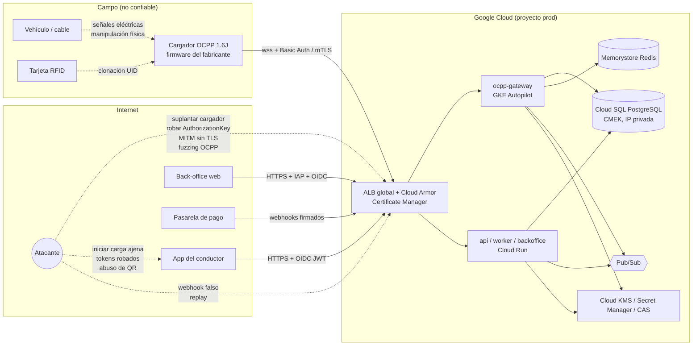
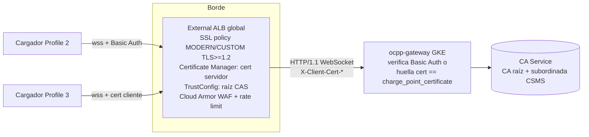

# Capítulo 5 (SEG). Seguridad integral del CSMS propio

> Fecha: 2026-09-18. Alcance: modelo de amenazas y controles para las seis superficies del sistema (cargador↔CSMS, app/back-office, pagos, datos personales, infraestructura GCP, ciclo de desarrollo/operación), con checklist priorizado P0/P1/P2.
> Contexto asumido (decisión del usuario): CSMS propio; los cargadores hablarán **OCPP 1.6J directamente** con `volt-platform`; la API REST del proveedor (PDF "API OCPP 1.6 V1.0") **no** se integra y sólo sirve como referencia de dominio y evidencia sobre el hardware.
> Nomenclatura alineada con los capítulos ARQ/FUN/TAR: `ocpp-gateway` (GKE Autopilot), `api`/`worker`/`backoffice` (Cloud Run), ALB global + Cloud Armor + Certificate Manager, Identity Platform, PostgreSQL (Cloud SQL), Memorystore Redis, Pub/Sub.
> Verificación: openchargealliance.org, docs.cloud.google.com y docs.stripe.com estaban bloqueados por el proxy de red durante el análisis. Los detalles del OCPP 1.6 Security Whitepaper se verificaron a través de implementaciones open source de referencia (EVerest `libocpp` —`Security.json` y `types.hpp`—, `lorenzodonini/ocpp-go`, `mobilityhouse/ocpp` —esquemas JSON `urn:OCPP:Cp:1.6:2020:3:*`—) y de fuentes secundarias indexadas (páginas de precios y documentación de Google Cloud, avisos CISA/CVE, PCI SSC, OWASP); cada hallazgo indica su nivel de confianza. La marca **[V]** señala afirmaciones confirmadas contra esas fuentes; **(a confirmar)** señala cifras, límites o detalles de firmware que no pudieron confirmarse.

---

## 0. Resumen ejecutivo y decisiones de seguridad

| # | Decisión | Justificación corta |
|---|----------|---------------------|
| S1 | **WSS obligatorio con Security Profile 2 (TLS + HTTP Basic Auth con `AuthorizationKey` única por cargador) desde el primer cargador en producción; Profile 3 (certificado de cliente) como objetivo del trimestre siguiente.** | El Profile 1 (Basic Auth sin TLS) expone la credencial y los `idTag` en claro. La evidencia real del riesgo es reciente: CISA ICSA-26-062-08 (3-mar-2026, CVE-2026-26288, CVSS 9,4) [V]: un backend OCPP aceptaba conexiones WebSocket sin autenticación y cualquiera que conociera un `chargeBoxId` podía suplantar al cargador. Y CVE-2026-28230 (SteVe ≤ 3.11.0) [V]: cualquier cargador autenticado podía cerrar la transacción de otro porque el CSMS no comprobaba que el `transactionId` perteneciera al `chargeBoxId` que enviaba `StopTransaction` (ver §2.5, control 11). |
| S2 | **Nunca aceptar un `chargeBoxId` desconocido.** Todo cargador se da de alta antes en el back-office (`charge_point.status = provisioned`); si no existe, la conexión se cierra en el *handshake*; si existe pero no está aprobado, `BootNotification` responde `Pending` (o `Rejected`). | Sin allowlist, un atacante puede inundar la plataforma o crear "cargadores fantasma" que generen sesiones y CDRs falsos. |
| S3 | **Validar cada mensaje OCPP contra el JSON Schema oficial de 1.6 (`additionalProperties: false`) antes de tocar el dominio; límites de tamaño y de tasa por conexión.** | Es la primera barrera contra inyección, *fuzzing* y agotamiento de recursos desde un cargador comprometido. |
| S4 | **El cargador no es de confianza.** El `idTag` de `StartTransaction` sólo se acepta si coincide con un `idTag` emitido por la plataforma (tarjeta RFID registrada o `idTag` virtual de un solo uso generado para `RemoteStartTransaction`). Aislamiento estricto por `tenant_id` y detección de anomalías físicas (energía imposible, doble conexión, versiones de firmware no autorizadas). | Un cargador comprometido o un simulador con credenciales robadas puede fabricar transacciones, alterar contadores o abusar de tarifas. |
| S5 | **PKI propia gestionada con Google Cloud Certificate Authority Service (CAS)** para: certificado del CSMS (raíz instalada en el cargador con `InstallCertificate`), certificados de cliente de los cargadores (Profile 3 vía `SignCertificate`/`CertificateSigned`) y firma de firmware (`SignedUpdateFirmware`). | Evita depender de la PKI del fabricante para la autenticación y permite revocar un cargador comprometido. |
| S6 | **Identidad de personas con Identity Platform (OIDC + PKCE), MFA TOTP obligatorio para todo rol administrativo, back-office adicionalmente detrás de Identity-Aware Proxy.** | Dos poblaciones (conductores y operadores) con riesgos distintos; los administradores pueden cambiar tarifas, abrir conectores y reembolsar. |
| S7 | **Pagos 100 % tokenizados en la pasarela (Stripe u opción local), objetivo PCI DSS v4.0.1 SAQ A; webhooks firmados, idempotentes y conciliados a diario.** | La plataforma nunca ve un PAN; el riesgo se concentra en fraude y en la integridad de los webhooks. |
| S8 | **Infraestructura sin IPs públicas salvo el ALB; Cloud SQL con IP privada + autenticación IAM; CMEK con Cloud KMS; sin claves de cuentas de servicio; Binary Authorization; Cloud Audit Logs exportados a un bucket con bloqueo de retención en un proyecto aparte.** | Reduce la superficie a una entrada (ALB con Cloud Armor) y hace que el compromiso de un contenedor no implique el de la base de datos ni el borrado de la evidencia. |
| S9 | **Registro de auditoría inmutable (cadena de hashes + exportación a bucket bloqueado) de todo cambio de tarifa, configuración de cargador, permisos, reembolsos y comandos remotos.** | Requisito de negocio (precios dinámicos) y probatorio ante reclamaciones. |
| S10 | **Programa de seguridad continuo:** SAST/DAST, Dependabot/Renovate, *secret scanning* con *push protection*, SBOM, pentest anual + tras cambios mayores, runbooks de incidentes y ejercicios de restauración trimestrales. | La plataforma es infraestructura crítica (energía) y manejará dinero; en la UE los operadores de puntos de recarga están dentro del sector energía de NIS2. |

---

## 1. Modelo de amenazas

### 1.1 Activos, actores y superficies



| Activo | Amenazas principales (STRIDE) | Impacto |
|--------|------------------------------|---------|
| Credenciales OCPP (`AuthorizationKey`, certificado de cliente) | *Spoofing* del cargador; robo desde firmware/menú local; reutilización entre cargadores | Sesiones y CDR falsos, comandos a cargadores reales, fraude de energía |
| Canal OCPP | MITM/eavesdropping (Profile 1); *replay*; inyección de mensajes malformados; DoS por conexiones | Robo de `idTag`, manipulación de `MeterValues`, caída del servicio |
| Estado del conector y sesiones | Manipulación de `StatusNotification`/`StopTransaction`; doble sesión; cargador que "olvida" transacciones offline | Cobros incorrectos, disputas, tarifas mal aplicadas |
| Firmware del cargador | Firmware malicioso vía `UpdateFirmware` no firmado; downgrade | Cargador comprometido de forma persistente |
| Identidades de conductores/operadores | *Credential stuffing*, tokens robados, elevación de privilegios, cuentas admin sin MFA | Cargas gratuitas, cambio de tarifas, fuga de datos |
| Endpoint "iniciar carga" | Iniciar en conector ajeno, enumeración de QR/connectorCode, *race* con `Preparing` | Robo de energía, abuso de pre-autorizaciones |
| Datos de pago | Webhooks falsos, *replay*, doble captura, fraude con tarjetas robadas | Pérdida económica, *chargebacks* |
| Datos personales (RFID, ubicación, historial) | Exfiltración, acceso interno excesivo, retención indefinida | Sanciones (GDPR/Ley 21.719/LFPDPPP/1581/LGPD), daño reputacional |
| Infraestructura GCP | IAM demasiado amplio, claves de SA filtradas, DB pública, imágenes vulnerables, logs borrables | Compromiso total, pérdida de evidencia |
| Cadena de suministro de software | Dependencias maliciosas, secretos en git, *build* no reproducible | Puerta trasera en producción |

### 1.2 Evidencia reciente que justifica las prioridades

- **CISA ICSA-26-062-08 (3 de marzo de 2026), CVE-2026-26288 — "Everon OCPP Backends" (api.everon.io, todas las versiones; CVSS 9,4; CWE-306 *Missing Authentication for a Critical Function*) [V]:** los endpoints WebSocket OCPP no exigían autenticación; un atacante que conociera o adivinara un identificador de estación podía conectarse, emitir y recibir mensajes OCPP como si fuera el cargador legítimo (impersonación, escalada, corrupción de datos de red, DoS). El aviso agrupa además debilidades de falta de límite a intentos de autenticación, sesiones que no caducan y credenciales insuficientemente protegidas. La plataforma cerró el 1 de diciembre de 2025 [V]. Es exactamente el escenario que S1+S2 evitan.
- **CVE-2026-28230 — SteVe (CSMS open source) ≤ 3.11.0, corregido en 3.12.0 [V]:** al procesar `StopTransaction` el CSMS buscaba la transacción sólo por `transactionId` (entero secuencial desde 1) sin comprobar que el cargador que la enviaba fuera el mismo que la inició; un cargador autenticado (o, por los endpoints SOAP sin autenticación, cualquiera que conociera un `chargeBoxId`) podía enumerar `transactionId` y cerrar las sesiones activas de toda la red. Lección directa para `volt-platform`: **propiedad de la transacción** (§2.5, control 11) y `transactionId` no enumerables.
- **Medición académica de despliegues CCS ("Current Affairs: A Security Measurement Study of CCS EV Charging Deployments", Szakály/Köhler/Martinovic, arXiv 2404.06635, USENIX Security 2025) [V existencia]:** primera medición de estaciones DC CCS ya instaladas (incluidas instalaciones recientes, de diciembre de 2023) para ver qué versiones de protocolo y qué seguridad se usan de verdad en campo; la gran mayoría de las estaciones medidas no usaba TLS en el enlace vehículo↔cargador (ISO 15118) — la cifra exacta (≈ 84 %) queda (a confirmar) contra el texto del paper. Lo relevante para este diseño: la seguridad "de papel" de un estándar tarda años en llegar al hardware desplegado, así que hay que exigirla y probarla modelo por modelo (§2.10, §9).
- **Everon/Ampcontrol/otros CSMS y estudios 2024-2025:** vulnerabilidades por autenticación débil y manejo de sesión; ataques de *spoofing* de SoC/MeterValues en OCPP 2.0.1 ("Unsupervised Detection of SOC Spoofing in OCPP 2.0.1…", MDPI Future Internet 18(1):60, 20-ene-2026) [V]. Conclusión: **no confiar en lo que reporta el cargador sin controles de plausibilidad**.

---

## 2. Superficie 1 — Cargador ↔ CSMS (OCPP 1.6J sobre WebSocket)

### 2.1 Perfiles de seguridad del OCPP 1.6 Security Whitepaper

El whitepaper "Improved security for OCPP 1.6-J" (3.ª edición, v1.3, 2022-02-17; existe una 4.ª edición publicada posteriormente por OCA y una "OCPP Security Operations Guide v1.0", enero 2026) porta a 1.6-J los mecanismos de seguridad de OCPP 2.0/2.0.1. [V] (ediciones 3 y 4 y la guía de operaciones confirmadas en openchargealliance.org vía índice de búsqueda; detalles confirmados en implementaciones de referencia). Nota de mercado: desde octubre de 2025 el programa de certificación OCPP 1.6 de la OCA exige **Security Profile 2 y Firmware Management como parte obligatoria de Core** [V]; úsese como vara mínima al exigir hardware al proveedor.

| Perfil | Transporte | Autenticación del cargador | Autenticación del CSMS | Veredicto para `volt-platform` |
|--------|-----------|----------------------------|------------------------|-------------------------------|
| 0 (estado sin protección, no un perfil de seguridad propiamente dicho; valor por defecto de `SecurityProfile` en libocpp, cuyo esquema admite 0-3 [V]) | `ws://` | ninguna | ninguna | **Prohibido** salvo en laboratorio aislado. |
| 1 | `ws://` sin TLS | HTTP Basic Auth (`usuario = chargeBoxId`, `contraseña = AuthorizationKey`) | ninguna | **Inaceptable en Internet pública**: credencial y `idTag` viajan en claro. Sólo como paso transitorio dentro de una VPN/APN privada. |
| 2 | `wss://` TLS ≥ 1.2 | HTTP Basic Auth con `AuthorizationKey` | Certificado de servidor validado por el cargador contra la raíz instalada (`CentralSystemRootCertificate`) o contra el almacén del fabricante | **Perfil de lanzamiento.** Compatible con la mayoría de cargadores 1.6J recientes. |
| 3 | `wss://` TLS ≥ 1.2 con certificado de cliente | Certificado X.509 del cargador (mTLS) | Certificado de servidor | **Objetivo.** Elimina secretos compartidos; requiere PKI y soporte del firmware (`SignCertificate`/`CertificateSigned`). |

Detalles verificados (confianza media-alta; fuentes: resúmenes del whitepaper ed. 2/3, esquema `Security.json` de libocpp, CoreEVI/amina):

- **TLS:** mínimo TLS 1.2; TLS 1.0/1.1 prohibidos. Suites listadas en el whitepaper 1.6 [V]: `TLS_RSA_WITH_AES_128_GCM_SHA256`, `TLS_RSA_WITH_AES_256_GCM_SHA384`, `TLS_ECDHE_ECDSA_WITH_AES_128_GCM_SHA256`, `TLS_ECDHE_ECDSA_WITH_AES_256_GCM_SHA384`. OCPP 2.0.1 mantiene TLS 1.2 como mínimo y recomienda 1.3; OCPP 2.1 (publicado el 23-ene-2025 y adoptado por IEC como IEC 63584-210:2025) [V] eleva el stack a TLS 1.3. Implicación práctica: **las dos suites `TLS_RSA_*` no tienen *forward secrecy*** y varios cargadores antiguos sólo negocian esas; hay que probar cada modelo contra la política SSL del ALB (ver §2.6).
- **`AuthorizationKey`:** binario aleatorio de **16 a 20 bytes**, transmitido al cargador **codificado en hexadecimal (32-40 caracteres)** mediante `ChangeConfiguration`; el cargador lo decodifica antes de usarlo como contraseña Basic Auth [V]. Es **de sólo escritura**: `GetConfiguration` no debe devolverla (o debe devolverla enmascarada) [V: p. ej. Zaptec documenta la clave como *write-only*, máx. 20 bytes]. Algunos firmwares exponen `UseAuthorizationKeyWithoutDecoding` para compatibilidad hacia atrás (usar el valor tal cual): comprobar con el proveedor (a confirmar por modelo). En libocpp, la longitud mínima aceptada es 8 caracteres (`minLength: 8`) [V].
- **Cambio de perfil:** `ChangeConfiguration(SecurityProfile=n)`; el cargador responde `Accepted` y **debe reconectarse** usando el perfil nuevo. El CSMS **debe rechazar** un intento de bajar el perfil (`Rejected`). Si el cargador no consigue conectar con el perfil nuevo, muchos firmwares vuelven al anterior (a confirmar con el proveedor; el comportamiento no es homogéneo entre fabricantes).
- **Identidad en el certificado (Profile 3):** el certificado de cliente lleva la identidad del cargador en el `CN` (el mismo identificador usado en la URL `wss://…/ocpp/{chargeBoxId}`) y el `O` = `CpoName`. El CSMS debe comprobar que **CN == chargeBoxId de la URL** y que la huella coincide con la registrada.

### 2.2 Mensajes de la extensión de seguridad (verificados en `mobilityhouse/ocpp` enums v16 y `lorenzodonini/ocpp-go` ocpp1.6)

[V] Límites, enumeraciones y campos obligatorios confirmados contra los esquemas JSON de `mobilityhouse/ocpp` v16 (`$id` `urn:OCPP:Cp:1.6:2020:3:*`).

| Mensaje | Dirección | Campos clave (límites) | Uso en `volt-platform` |
|---------|-----------|------------------------|------------------------|
| `SecurityEventNotification.req` | CP → CS | `type` (≤50), `timestamp`, `techInfo` (≤255). Respuesta vacía. Esquema `urn:OCPP:Cp:1.6:2020:3:SecurityEventNotification.req` | Ingesta a `security_event`; alerta si es crítico (§2.4). |
| `SignCertificate.req` | CP → CS | `csr` PEM PKCS#10 (≤5500). Resp. `GenericStatus` Accepted/Rejected | Profile 3: `api` envía el CSR a CAS y responde `Accepted`; luego emite `CertificateSigned`. |
| `CertificateSigned.req` | CS → CP | `certificateChain` PEM (≤10000; el cargador anuncia `CertificateSignedMaxChainSize`). Resp. Accepted/Rejected | Entrega del certificado firmado. |
| `InstallCertificate.req` | CS → CP | `certificateType` ∈ {`CentralSystemRootCertificate`, `ManufacturerRootCertificate`}, `certificate` PEM (≤5500). Resp. Accepted/Rejected/Failed | Instalar la raíz de la PKI propia (para validar el servidor) y la raíz de firma de firmware. |
| `DeleteCertificate.req` | CS → CP | `certificateHashData{hashAlgorithm SHA256/384/512, issuerNameHash, issuerKeyHash, serialNumber}`. Resp. Accepted/Failed/NotFound | Retirar raíces del proveedor anterior una vez migrado. |
| `GetInstalledCertificateIds.req` | CS → CP | `certificateType`. Resp. Accepted/NotFound + lista de `certificateHashData` | Inventario de confianza del cargador (auditoría). |
| `GetLog.req` | CS → CP | `logType` ∈ {`DiagnosticsLog`, `SecurityLog`}, `requestId`, `retries`, `retryInterval`, `log{remoteLocation (≤512, obligatorio), oldestTimestamp, latestTimestamp (opcionales)}`. Resp. Accepted/Rejected/AcceptedCanceled | Recoger el *security log* del cargador a un bucket GCS con URL firmada (HTTPS/PUT). |
| `LogStatusNotification.req` | CP → CS | `status` ∈ {Idle, Uploading, Uploaded, UploadFailure, BadMessage, NotSupportedOperation, PermissionDenied}, `requestId` | Seguimiento de la subida. |
| `SignedUpdateFirmware.req` | CS → CP | `requestId`, `retries`, `retryInterval`, `firmware{location (≤512), retrieveDateTime (obligatorio), installDateTime (opcional), signingCertificate PEM (≤5500), signature base64 (≤800)}`. Resp. Accepted/Rejected/AcceptedCanceled/InvalidCertificate/RevokedCertificate | Único camino permitido para actualizar firmware en producción. |
| `SignedFirmwareStatusNotification.req` | CP → CS | `status` ∈ {Downloaded, DownloadFailed, Downloading, DownloadScheduled, DownloadPaused, Idle, InstallationFailed, Installing, Installed, InstallRebooting, InstallScheduled, InstallVerificationFailed, InvalidSignature, SignatureVerified, CertificateVerified, InvalidCertificate, RevokedCertificate}, `requestId` | Estado del despliegue; `InvalidSignature` ⇒ alerta P0. |
| `ExtendedTriggerMessage.req` | CS → CP | `requestedMessage` ∈ {BootNotification, LogStatusNotification, Heartbeat, MeterValues, SignChargePointCertificate, FirmwareStatusNotification, StatusNotification}, `connectorId`. Resp. Accepted/Rejected/NotImplemented | Forzar renovación de certificado (`SignChargePointCertificate`) antes de la caducidad. |

Claves de configuración de seguridad (esquema `Security.json` de EVerest libocpp, verificado [V]):

| Clave | Tipo | R/W | Notas |
|-------|------|-----|-------|
| `SecurityProfile` | int 0-3 (default 0 en libocpp) | RW | Cambiarla obliga a reconectar. Rechazar reducciones. |
| `AuthorizationKey` | string (libocpp: `minLength` 8) | **W (sólo escritura)** | Hex de 16-20 bytes aleatorios. |
| `CpoName` | string | RW | "Nombre del CPO (u organización de confianza del CPO) tal como se usa en el certificado del cargador" [V]: se copia al `O` del certificado (Profile 3). Fijarlo antes de `SignCertificate`. |
| `CertificateSignedMaxChainSize` | int | RO | Máx. 10000 [V]; el CSMS debe recortar la cadena (hoja + intermedia, sin raíz) si hace falta. |
| `CertificateStoreMaxLength` | int | RO | Cuántas raíces/CA caben [V]; planificar si hay que convivir raíz del fabricante + propia. |
| `AdditionalRootCertificateCheck` | bool | RO | Si `true`, sólo una raíz `CentralSystemRootCertificate` activa + una temporal de *fallback* [V]: la rotación de raíz debe ser secuencial. |
| `SupportedFileTransferProtocols` | lista | RO | No está en el `Security.json` de libocpp ni en la lista de claves del whitepaper: procede de la **errata v4.0 de OCPP 1.6** (a confirmar), donde el cargador anuncia los protocolos de transferencia que soporta (`HTTPS` deseable para `GetLog`/`SignedUpdateFirmware`). |
| `DisableSecurityEventNotifications` | bool (default `false`) | RW | Específica de libocpp, no del whitepaper [V]; si el cargador la tiene, debe quedar en `false`. |

### 2.3 Rotación de `AuthorizationKey` (Profile 2)

```mermaid
sequenceDiagram
  participant BO as backoffice/worker
  participant API as api
  participant GW as ocpp-gateway
  participant CP as Cargador
  BO->>API: rotar credencial (manual o cron 90 días)
  API->>API: key = random(20 bytes); hash = argon2id(key)
  API->>API: credential.next_hash = hash, next_valid_from = now
  API->>GW: gRPC ChangeConfiguration(AuthorizationKey=hex(key))
  GW->>CP: [2,"..","ChangeConfiguration",{"key":"AuthorizationKey","value":"<40 hex>"}]
  CP-->>GW: [3,"..",{"status":"Accepted"}]
  GW-->>API: Accepted
  CP->>CP: cierra WebSocket, reconecta
  CP->>GW: GET /ocpp/{chargeBoxId} Authorization: Basic base64(chargeBoxId:key)
  GW->>API: verificar (acepta hash actual o next_hash durante ventana ≤ 15 min)
  API->>API: promover next_hash → hash; registrar security_event "AuthorizationKeyRotated"
  Note over API,CP: si el cargador no reconecta con la nueva clave en 15 min: alerta + mantener la anterior hasta intervención
```

Reglas:
1. Clave **única por cargador**, nunca derivada del serial ni compartida por lote. Generación en `api` con CSPRNG; **sólo se almacena el hash** (Argon2id) más el texto claro cifrado con KMS **únicamente** mientras dura la ventana de rotación (para reintentos), y se borra después.
2. Si `ChangeConfiguration` devuelve `Rejected`/`NotSupported`, registrar y escalar: el cargador podría estar en Profile 1 fijo.
3. La clave de *bootstrap* (la que se pone en el cargador durante la instalación física) caduca a las 24 h: la primera conexión exitosa dispara una rotación automática.
4. `GetConfiguration` nunca debe devolver la clave; si un firmware la devuelve en claro, anotarlo como hallazgo de hardware.

### 2.4 Eventos de seguridad del cargador

Lista de eventos del whitepaper (constantes en `libocpp/include/ocpp/common/types.hpp`, con su clasificación *critical* marcada en comentarios del código [V]; los críticos **deben** enviarse al CSMS, los demás pueden quedarse en el log local del cargador):

| Evento | Crítico | Reacción automática recomendada |
|--------|---------|---------------------------------|
| `FirmwareUpdated` | sí | Verificar que la versión coincide con un despliegue autorizado; si no, marcar `charge_point.integrity = suspect` y bloquear `RemoteStartTransaction`. |
| `SettingSystemTime` | sí | Correlacionar con `Heartbeat`; desviaciones > 5 min ⇒ alerta (afecta tarifas por franja). |
| `StartupOfTheDevice`, `ResetOrReboot` | sí | Contar reinicios/24 h; > 5 ⇒ alerta de estabilidad o manipulación. |
| `SecurityLogWasCleared` | sí | Alerta P1 inmediata; solicitar `GetLog(SecurityLog)`. |
| `MemoryExhaustion` | sí | Alerta operativa. |
| `TamperDetectionActivated` | sí | Alerta P0; `ChangeAvailability(Inoperative)` y aviso a operación de campo. |
| `FailedToAuthenticateAtCsms`, `CsmsFailedToAuthenticate` | no | Contador; picos ⇒ posible MITM o clave desincronizada. |
| `ReconfigurationOfSecurityParameters` | no | Debe coincidir con un cambio iniciado por la plataforma; si no, alerta. |
| `InvalidMessages`, `AttemptedReplayAttacks` | no | Alerta si > N/h. |
| `InvalidFirmwareSignature`, `InvalidFirmwareSigningCertificate` | no | Alerta P1: alguien intentó cargar firmware no firmado. |
| `InvalidCentralSystemCertificate`, `InvalidChargePointCertificate`, `InvalidTLSVersion`, `InvalidTLSCipherSuite` | no | Diagnóstico de PKI/TLS; útil durante la migración de raíz. |
| `CsrGenerationFailed` | no | El cargador no pudo generar el par de claves/CSR tras `ExtendedTriggerMessage(SignChargePointCertificate)`: reintentar una vez y, si persiste, hallazgo de hardware (bloquea Profile 3 en ese modelo). |
| `MaintenanceLoginAccepted`, `MaintenanceLoginFailed` (nombres de OCPP 2.0.1 presentes también en libocpp) | no | Acceso local de mantenimiento al cargador; correlacionar con órdenes de trabajo de campo, alerta si no hay ninguna. |

Complemento **del lado CSMS** (eventos que genera `ocpp-gateway`, misma tabla): `AuthFailed` (Basic Auth incorrecta), `UnknownChargeBoxId`, `SchemaViolation`, `RateLimitExceeded`, `DuplicateConnection`, `CertMismatch` (CN ≠ chargeBoxId), `ProfileDowngradeAttempt`, `UnexpectedFirmwareVersion`, `ImplausibleMeterValue`.

### 2.5 Controles en `ocpp-gateway`

1. **Allowlist y estados del cargador.** Handshake HTTP: extraer `chargeBoxId` de la ruta, buscar en `charge_point` (caché Redis 60 s). No existe ⇒ `HTTP 404` sin cuerpo y cierre (no revelar si existe). Existe pero `status ∈ {provisioned, revoked}` ⇒ `401`/`403`. Credenciales incorrectas ⇒ `401` + `security_event AuthFailed` + *backoff* por IP y por `chargeBoxId` (5 fallos/10 min ⇒ 15 min de bloqueo). Tras autenticar: si `status = pending_approval`, `BootNotification` ⇒ `{"status":"Pending","interval":300}` y el gateway sólo acepta `BootNotification`, `Heartbeat`, `StatusNotification` y respuestas a `GetConfiguration`/`ChangeConfiguration` (así se puede inspeccionar y aprovisionar el cargador antes de aceptarlo); `status = rejected` ⇒ `Rejected` con `interval` largo (3600).
2. **Subprotocolo.** Exigir `Sec-WebSocket-Protocol: ocpp1.6` (y `ocpp2.0.1` cuando toque); rechazar conexiones sin subprotocolo válido.
3. **Una conexión por `chargeBoxId`.** Si llega una segunda conexión autenticada: cerrar la nueva **y** registrar `DuplicateConnection` con ambas IPs (patrón típico de credencial robada). Excepción operativa: si la anterior no responde al ping en 30 s, reemplazarla.
4. **Validación de esquema.** Estructura OCPP-J (`[2, uniqueId, action, payload]`, `uniqueId` ≤ 36 chars, `action` de la enumeración) y luego el payload contra el JSON Schema oficial de 1.6 (edición 2020:3 incluye los mensajes de seguridad; `additionalProperties: false`; p. ej. `BootNotification` `chargePointVendor`/`chargePointModel` ≤ 20, seriales ≤ 25, `firmwareVersion` ≤ 50; `StartTransaction.idTag` ≤ 20). Fallo ⇒ `CALLERROR FormationViolation`/`PropertyConstraintViolation`, contador por conexión; > 20/min ⇒ cerrar conexión y `SchemaViolation`.
5. **Límites.** Frame máximo 256 KiB (los mensajes 1.6 son de pocos KB; `MeterValues` grandes caben de sobra); mensajes por conexión: ráfaga 30, sostenido 5/s; CALL pendientes por conexión: 1 (regla de sincronía OCPP-J), cola de salida máx. 50; `MeterValues` por sesión ≤ 1 cada 10 s (alinear `MeterValueSampleInterval`); ping/pong cada 30 s, cierre a 90 s sin respuesta; conexiones nuevas por IP (Cloud Armor) 20/min.
6. **No confiar en el `idTag`.** `Authorize.req`/`StartTransaction.req`: el `idTag` debe existir en `id_token` (RFID registrada, activa, del mismo `tenant_id` y con el conector permitido) o ser el `idTag` virtual **de un solo uso** creado por la plataforma para ese `RemoteStartTransaction` (20 caracteres aleatorios, TTL 5 min, ligado a `charge_point_id` + `connectorId`). Cualquier otro ⇒ `Invalid`. Configurar `AuthorizeRemoteTxRequests=true` si el cargador lo soporta, y `LocalAuthListEnabled=false`/`LocalPreAuthorize=false` salvo que se gestione explícitamente la lista local (`SendLocalList`) firmada por la plataforma. `AuthorizationCacheEnabled=false` para evitar que el cargador acepte offline un `idTag` ya revocado.
7. **Plausibilidad física.** `meterStop − meterStart` ≤ `P_max_kW × duración_h × 1.1`; `MeterValues` monótonos no decrecientes; `timestamp` dentro de ±5 min del reloj del servidor (guardar ambos); potencia instantánea ≤ `powerUpperLimits` del conector (dato que el propio PDF del proveedor modela: `connectorResponse.powerUpperLimits`, p. 9). Violación ⇒ sesión marcada `disputed`, no se captura el pago automáticamente.
8. **Aislamiento por tenant.** `tenant_id` en todas las tablas; PostgreSQL *Row Level Security* con `SET LOCAL app.tenant_id` en cada transacción; el gateway sólo acepta comandos para cargadores del tenant del comando; Redis con prefijos por tenant; nunca usar `chargeBoxId` como clave sin tenant.
9. **Firmware.** Sólo `SignedUpdateFirmware` en producción; `UpdateFirmware` (sin firma) deshabilitado por *feature flag* y sólo permitido en el tenant de laboratorio. Los binarios viven en un bucket GCS privado; `location` es una URL firmada V4 con vigencia 1 h; el binario se firma con una clave en Cloud KMS (asimétrica, EC P-256 o RSA-3072) y el certificado de firma cuelga de una CA de firmware dedicada; `InvalidSignature`/`InvalidCertificate` ⇒ alerta P1.
10. **Registro.** `ocpp_message_log` completo (partición mensual, 30-90 días, sin `AuthorizationKey` ni cabeceras `Authorization`); `security_event` con retención ≥ 13 meses; ambos exportados a BigQuery.
11. **Propiedad de la transacción (lección de CVE-2026-28230 [V]).** Todo mensaje que lleve `transactionId` (`StopTransaction`, `MeterValues`, respuestas a `RemoteStopTransaction`) se resuelve **siempre** con la pareja `(charge_point_id, transactionId)`, nunca sólo por `transactionId`; si la transacción pertenece a otro cargador ⇒ `CALLERROR PropertyConstraintViolation`, `security_event TransactionOwnershipViolation` y `integrity = suspect`. Además, el `transactionId` que devuelve `StartTransaction.conf` (entero en 1.6) **no debe ser secuencial ni global**: usar un entero aleatorio de 31 bits único por cargador (o un contador por cargador ofuscado), de modo que no se puedan enumerar sesiones ajenas. `RemoteStopTransaction` sólo con el `transactionId` de una sesión del mismo tenant y cargador.

### 2.6 Terminación TLS en GCP: Profile 2 y Profile 3



| Aspecto | Profile 2 | Profile 3 con *frontend mTLS* en el ALB (recomendado) | Profile 3 con *passthrough* (NLB L4 → TLS en el gateway) |
|---------|-----------|-------------------------------------------------------|-----------------------------------------------------------|
| Dónde termina TLS | ALB | ALB (valida cadena contra `TrustConfig` de Certificate Manager) | En el pod del gateway (Envoy/ingress o servidor propio) |
| Qué ve el gateway | Cabecera `Authorization` | Cabeceras personalizadas (*custom request headers* del backend service) con las variables `client_cert_present`, `client_cert_chain_verified`, `client_cert_error`, `client_cert_sha256_fingerprint` (base64 del SHA-256), `client_cert_serial_number` [V], y además `client_cert_dnsname_sans`/`client_cert_uri_sans`/`client_cert_leaf`/`client_cert_chain`/`client_cert_subject_dn`/`client_cert_valid_not_before`/`client_cert_valid_not_after` (a confirmar nombre exacto en la doc. vigente). Las cabeceras se rellenan cuando el certificado pasa la validación o cuando el modo es `ALLOW_INVALID_OR_MISSING_CLIENT_CERT` [V]; el gateway debe **eliminar** esas cabeceras si llegan por otro listener (nunca fiarse de ellas sin que el ALB sea el único camino). | El certificado completo |
| Cloud Armor (WAF L7, rate limit) | sí | sí | no (sólo protección L3/L4) |
| Política de suites | SSL policy del ALB: perfiles `COMPATIBLE` (el más amplio; incluye las suites `TLS_RSA_*` sin *forward secrecy*), `MODERN` (suites ECDHE para clientes modernos), `RESTRICTED` (subconjunto reducido para cumplimiento estricto: ECDHE con AES-GCM y CHACHA20) y `CUSTOM` (elección suite a suite para TLS ≤ 1.2; no afecta a TLS 1.3) [V]; la política por defecto es `COMPATIBLE` con TLS mínimo 1.0 [V] — **no dejar la por defecto**. Recomendación: `CUSTOM` con TLS mínimo 1.2, las cuatro suites del whitepaper más `ECDHE_RSA`/CHACHA20, y quitar `TLS_RSA_*` en cuanto el inventario de modelos lo permita (a confirmar la lista exacta de suites por perfil en la doc. vigente). | igual | control total (incluye revocación en línea) |
| Revocación de certificado de cliente | n/a | **El ALB no comprueba la revocación del certificado de cliente** (ni CRL ni OCSP; el `TrustConfig` sólo contiene anclas, intermedias y certificados permitidos explícitamente) [V]. Por eso el gateway **siempre** compara huella/serial con `charge_point_certificate.status = active`; complementos: vidas cortas y, en un incidente grave, rotar la CA o el `TrustConfig`. | CRL/OCSP en el propio gateway |
| `clientValidationMode` | n/a | `REJECT_INVALID` en el *listener* de cargadores. Usar `ALLOW_INVALID_OR_MISSING_CLIENT_CERT` **sólo** durante la migración de Profile 2→3, con el gateway exigiendo Basic Auth cuando `client_cert_chain_verified` ≠ `true`. | n/a |

Notas:
- Cloud Run **no** termina mTLS en su URL `run.app` (a confirmar en la doc. vigente; el mTLS de *frontend* es una función del ALB, no del servicio); por eso el gateway va en GKE tras el ALB (decisión D3 del capítulo ARQ) o, si se optara por Cloud Run, sólo detrás del ALB con `ingress = internal-and-cloud-load-balancing` para que nadie salte el WAF por la URL directa. Además, Cloud Run corta los WebSockets al vencer el *request timeout* (máx. 60 min) y su afinidad de sesión es *best effort* [V]: otra razón para que las conexiones OCPP persistentes vivan en GKE.
- **Tiempos de vida del WebSocket en el ALB global** [V]: un WebSocket **activo** se cierra a las 24 h como máximo; uno **inactivo** se cierra al vencer el *backend service timeout* (30 s por defecto). Configurar `timeoutSec` del backend del gateway por encima del intervalo de ping (p. ej. 600 s), hacer ping/pong desde el gateway cada 30 s (§2.5.5) y **diseñar la reconexión diaria como normal**: el gateway debe tratar la reconexión como un evento benigno (sin `DuplicateConnection`) cuando la conexión anterior ya está cerrada, y el back-office debe distinguir "reconexión por rotación del LB" de "cargador caído". Si se quiere evitar el corte diario: ALB regional o proxy TCP.
- Usar **un hostname/listener distinto para cargadores** (`ocpp.<dominio>`) y otro para app/back-office (`api.<dominio>`, `admin.<dominio>`), con políticas SSL, `TrustConfig` y reglas de Cloud Armor independientes. Así la política "compatible" que necesiten los cargadores antiguos no debilita la de la app.
- Publicar en el certificado de servidor un **RSA-2048/3072** (además de ECDSA si se quiere) porque las suites `TLS_RSA_*`/`ECDHE_RSA` requieren clave RSA; con un certificado sólo-ECDSA, un cargador que no soporte `ECDHE_ECDSA` no negociará. Probar cada modelo con `openssl s_client -tls1_2 -cipher <suite>` antes del despliegue.
- Certificate Manager emite certificados públicos gestionados (Let's Encrypt/Google Trust Services). **Muchos cargadores 1.6J no traen el almacén de raíces públicas actualizado** (o no lo traen): planificar `InstallCertificate(CentralSystemRootCertificate)` con la raíz pública correspondiente **o** emitir el certificado de servidor desde la CA propia e instalar esa raíz. Preguntar al proveedor qué raíces trae el firmware.

### 2.7 PKI propia con Certificate Authority Service

```mermaid
flowchart TB
  ROOT[CA raíz "Volt Root CA"<br/>CAS Enterprise, offline lógica, 20 años, HSM] --> SUB1[CA subordinada "Volt CSMS Issuing CA"<br/>emite cert. servidor ocpp.<dominio> 1 año]
  ROOT --> SUB2[CA subordinada "Volt Charge Point CA"<br/>emite cert. cliente por cargador, 1-2 años]
  ROOT --> SUB3[CA subordinada "Volt Firmware Signing CA"<br/>cert. de firma de firmware, clave en KMS]
  SUB2 --> CPCERT[Cert cargador CN=chargeBoxId, O=CpoName]
```

- **Tier:** CAS ofrece *DevOps* (alto volumen, vida corta, sin revocación) y *Enterprise* (vida larga, dispositivos, revocación/CRL). Para cargadores usar **Enterprise**. Precios [V] (página de precios de CA Service): **DevOps** USD 20 por CA y mes + USD 0,30 por certificado (tramo 0-50.000); **Enterprise** USD 200 por CA y mes + **USD 0,50** por certificado (tramo 0-50.000). Implicación: el diagrama de arriba, con raíz + 3 subordinadas Enterprise, costaría ≈ USD 800/mes fijos — **no es marginal** para un operador que empieza. Recorte recomendado para el primer año: (a) certificado de servidor `ocpp.<dominio>` desde Certificate Manager (público, gestionado, gratis en la práctica) siempre que el firmware traiga la raíz pública correspondiente, y sólo si no, desde la CA propia; (b) **una sola CA subordinada Enterprise** "Volt Charge Point CA" en CAS (≈ USD 200/mes + 0,50 × cargadores) que emita también el certificado de firma de firmware (con la clave en KMS); (c) raíz **fuera de CAS** (generada offline con `openssl`/HSM y guardada en frío, CAS admite subordinadas firmadas por una raíz externa) o, si se prefiere todo en CAS, raíz Enterprise adicional (+ USD 200/mes). Revisar a los 12 meses y separar CAs cuando el volumen lo justifique.
- **Ciclo Profile 3:** (1) `InstallCertificate(CentralSystemRootCertificate)` con la raíz propia; (2) `ChangeConfiguration(CpoName)`; (3) `ExtendedTriggerMessage(SignChargePointCertificate)` ⇒ el cargador genera par de claves y envía `SignCertificate.req{csr}`; (4) `api` valida que el CSR tenga `CN == chargeBoxId` y `O == CpoName`, lo firma en CAS (subordinada "Charge Point CA") y responde `Accepted`; (5) `CertificateSigned.req{certificateChain}` (hoja + intermedia; sin raíz; ≤ `CertificateSignedMaxChainSize`); (6) registrar huella SHA-256 en `charge_point_certificate`; (7) `ChangeConfiguration(SecurityProfile=3)`; (8) el cargador reconecta con mTLS; (9) el gateway compara huella/serial de las cabeceras del ALB con la tabla. Renovación: `worker` dispara el paso (3) 30 días antes de `not_after`.
- **Revocación:** `charge_point_certificate.status = revoked` + revocar en CAS + cerrar conexión activa. Como el ALB **no comprueba revocación** [V], seguirá aceptando el TLS: la comprobación de huella en el gateway es la que realmente bloquea (y por eso debe ejecutarse en cada *handshake*, con caché ≤ 60 s).
- **Migración desde la nube del proveedor:** inventariar con `GetInstalledCertificateIds` las raíces del fabricante y, tras la aprobación, `DeleteCertificate` de las que ya no se necesiten (respetando `CertificateStoreMaxLength` y `AdditionalRootCertificateCheck`).

### 2.8 DDL de seguridad (PostgreSQL)

```sql
-- Identidad y estado del cargador
CREATE TYPE charge_point_status AS ENUM ('provisioned','pending_approval','accepted','rejected','revoked');

CREATE TABLE charge_point (
  id                  uuid PRIMARY KEY DEFAULT gen_random_uuid(),
  tenant_id           uuid NOT NULL REFERENCES tenant(id),
  charge_box_id       text NOT NULL UNIQUE CHECK (char_length(charge_box_id) BETWEEN 3 AND 48),
  status              charge_point_status NOT NULL DEFAULT 'provisioned',
  security_profile    smallint NOT NULL DEFAULT 2 CHECK (security_profile BETWEEN 1 AND 3),
  expected_vendor     text, expected_model text, expected_serial text,
  approved_firmware   text[] NOT NULL DEFAULT '{}',
  integrity           text NOT NULL DEFAULT 'ok' CHECK (integrity IN ('ok','suspect','quarantined')),
  created_at          timestamptz NOT NULL DEFAULT now(),
  approved_by         uuid REFERENCES staff_user(id), approved_at timestamptz
);
ALTER TABLE charge_point ENABLE ROW LEVEL SECURITY;
CREATE POLICY cp_tenant ON charge_point USING (tenant_id = current_setting('app.tenant_id')::uuid);

-- Credencial Basic Auth (Profile 1/2). Sólo hashes; el texto claro cifrado con KMS vive únicamente durante la rotación.
CREATE TABLE charge_point_credential (
  charge_point_id     uuid PRIMARY KEY REFERENCES charge_point(id) ON DELETE CASCADE,
  key_hash            text NOT NULL,            -- argon2id
  next_key_hash       text,                     -- durante la rotación
  next_key_ciphertext bytea,                    -- KMS-encrypted, se borra al promover
  rotation_started_at timestamptz,
  rotated_at          timestamptz NOT NULL DEFAULT now(),
  expires_at          timestamptz NOT NULL,     -- bootstrap: +24h; normal: +90d
  failed_attempts     int NOT NULL DEFAULT 0,
  locked_until        timestamptz
);

-- Certificado de cliente (Profile 3)
CREATE TABLE charge_point_certificate (
  id                  uuid PRIMARY KEY DEFAULT gen_random_uuid(),
  charge_point_id     uuid NOT NULL REFERENCES charge_point(id) ON DELETE CASCADE,
  fingerprint_sha256  bytea NOT NULL UNIQUE,
  serial_number       text NOT NULL,
  subject_cn          text NOT NULL,
  issuer              text NOT NULL,
  not_before          timestamptz NOT NULL, not_after timestamptz NOT NULL,
  status              text NOT NULL DEFAULT 'active' CHECK (status IN ('pending','active','revoked','expired')),
  cas_certificate_name text,                    -- ruta del recurso en CA Service
  created_at          timestamptz NOT NULL DEFAULT now()
);
CREATE INDEX ON charge_point_certificate (charge_point_id) WHERE status = 'active';

-- Eventos de seguridad (del cargador y del CSMS)
CREATE TABLE security_event (
  id                  bigint GENERATED ALWAYS AS IDENTITY PRIMARY KEY,
  tenant_id           uuid NOT NULL,
  charge_point_id     uuid REFERENCES charge_point(id),
  source              text NOT NULL CHECK (source IN ('charge_point','csms')),
  type                text NOT NULL CHECK (char_length(type) <= 50),
  critical            boolean NOT NULL DEFAULT false,
  occurred_at         timestamptz NOT NULL,    -- timestamp del cargador
  received_at         timestamptz NOT NULL DEFAULT now(),
  tech_info           text CHECK (char_length(tech_info) <= 255),
  remote_ip           inet,
  details             jsonb NOT NULL DEFAULT '{}'
) PARTITION BY RANGE (received_at);

-- Auditoría inmutable (cadena de hashes). Sólo INSERT; sin UPDATE/DELETE para el rol de la aplicación.
CREATE TABLE audit_log (
  id            bigint GENERATED ALWAYS AS IDENTITY PRIMARY KEY,
  ts            timestamptz NOT NULL DEFAULT now(),
  tenant_id     uuid,
  actor_type    text NOT NULL CHECK (actor_type IN ('staff','driver','system','charge_point')),
  actor_id      text NOT NULL,
  action        text NOT NULL,                 -- 'tariff.update', 'charge_point.config.change', 'role.grant', 'refund.create', 'command.RemoteStartTransaction'...
  entity_type   text NOT NULL, entity_id text NOT NULL,
  before        jsonb, after jsonb,
  request_id    text, remote_ip inet, user_agent text,
  prev_hash     bytea NOT NULL,
  hash          bytea NOT NULL                  -- sha256(prev_hash || canonical_json(fila sin hash))
);
REVOKE UPDATE, DELETE, TRUNCATE ON audit_log FROM app_rw;
-- Exportación diaria a GCS (bucket con retention lock 7 años) + verificación de la cadena por worker.
```

### 2.9 Ejemplos JSON

```json
// BootNotification de un cargador aún no aprobado
[3, "8a1c", {"status": "Pending", "currentTime": "2026-09-18T15:02:11Z", "interval": 300}]

// Rotación de AuthorizationKey (20 bytes aleatorios en hex = 40 caracteres)
[2, "r-7f21", "ChangeConfiguration", {"key": "AuthorizationKey", "value": "3f9a1c77e2b04d5a9e6c1b2f8d7a0c4e5b6f7a8d"}]

// Instalación de la raíz propia para validar el servidor
[2, "c-11", "InstallCertificate", {"certificateType": "CentralSystemRootCertificate", "certificate": "-----BEGIN CERTIFICATE-----\nMIIB...\n-----END CERTIFICATE-----"}]

// Actualización de firmware firmada
[2, "f-9", "SignedUpdateFirmware", {"requestId": 42, "retries": 2, "retryInterval": 600,
  "firmware": {"location": "https://storage.googleapis.com/volt-fw/acme-v2.3.1.bin?X-Goog-Signature=...",
               "retrieveDateTime": "2026-09-19T02:00:00Z", "installDateTime": "2026-09-19T03:00:00Z",
               "signingCertificate": "-----BEGIN CERTIFICATE-----\n...", "signature": "MEUCIQ..."}}]

// Evento de seguridad reportado por el cargador
[2, "s-3", "SecurityEventNotification", {"type": "TamperDetectionActivated", "timestamp": "2026-09-18T15:10:00Z", "techInfo": "door sensor"}]
```

### 2.10 Nota de riesgo sobre hardware

Si algún modelo tiene la URL del CSMS fija en firmware, no soporta `SecurityProfile` ≥ 2 o no permite cambiar `AuthorizationKey`, ese cargador **no** debe conectarse a Internet pública contra `volt-platform`: negociar firmware con el proveedor o sustituir el equipo. Alternativa transitoria (sólo si es inevitable): APN/VPN privada del operador móvil + Profile 1 dentro del túnel, con fecha de fin.

---

## 3. Superficie 2 — App móvil y back-office

### 3.1 Identidad

- **Identity Platform** (Firebase Auth "enterprise"): OIDC con *Authorization Code + PKCE* en la app; proveedores email+contraseña (con verificación) y sociales; **tenants separados** para conductores y personal (o dos proyectos GCP), de modo que un token de conductor jamás valide en `/admin/*`. Precio [V]: 0-49.999 MAU gratis para email/teléfono/anónimo/social; después USD 0,0055 (50k-99.999) → 0,0046 → 0,0032 → 0,0025/MAU por tramos; SAML/OIDC gratis hasta 49 MAU y USD 0,015/MAU desde 50; SMS por mensaje (USD 0,01 en EE. UU./Canadá hasta 0,46 en los países más caros; los 10 primeros SMS/día no se facturan). TOTP MFA (GA), *blocking functions* y multi-tenant (sin coste adicional) son capacidades de Identity Platform / "Firebase Authentication with Identity Platform", no del Firebase Auth básico [V].
- **Tokens:** el ID token dura 1 h [V] (no configurable); el *refresh token* es de larga vida ⇒ (a) `revokeRefreshTokens(uid)` al cambiar contraseña, borrar cuenta o detectar fraude, y en `api` verificar `auth_time` ≥ `tokens_valid_after_time`; (b) exigir reautenticación reciente (`auth_time` < 5 min) para acciones sensibles (cambiar método de pago, borrar cuenta). Para el personal: sesión máxima 12 h y reautenticación cada 8 h.
- **MFA:** TOTP obligatorio para roles `admin`, `finance`, `ops_l2` mediante *blocking function* `beforeSignIn` que rechaza el inicio de sesión si el usuario tiene rol privilegiado y no está inscrito (claim `mfa_enrolled`). El back-office se publica además detrás de **Identity-Aware Proxy** con cuentas de Google Workspace/Cloud Identity con 2SV forzado (dos capas: IAP + Identity Platform).
- **Integridad del cliente:** Firebase App Check (Play Integrity / App Attest) en los endpoints de conductor para filtrar scripts; no sustituye a la autorización del servidor.

### 3.2 Autorización: RBAC + ABAC con alcance

| Rol | Alcance | Puede | No puede |
|-----|---------|-------|----------|
| `driver` | su propia cuenta | iniciar/parar sus sesiones, ver sus recibos | nada administrativo |
| `site_operator` | `site_ids` asignados dentro del tenant | ver estado, `Reset`, `UnlockConnector`, `ChangeAvailability` | cambiar tarifas, ver datos de conductores más allá de la sesión |
| `tariff_manager` | tenant | crear/activar tarifas (con 4 ojos si el cambio > X %) | comandos a cargadores |
| `finance` | tenant | reembolsos hasta un límite, conciliación | configurar cargadores |
| `admin` | tenant | gestionar usuarios/roles, `ChangeConfiguration`, firmware | acceso a otro tenant |
| `platform_admin` | global | alta de tenants, PKI, feature flags | operar sin MFA ni desde fuera de IAP |

Implementación: claims `tenant_id`, `roles[]`, `site_ids[]` en el token (el *payload* de *custom claims* no puede superar 1000 bytes [V]; si un `site_operator` tiene muchos sitios, guardar sólo `tenant_id`+`roles` en el token y resolver `site_ids` en `api`); la decisión final siempre en `api` con una política central (p. ej. Casbin/OPA o un módulo propio) y `SET LOCAL app.tenant_id` para RLS. **Nunca** autorizar por datos que envíe el cliente (p. ej. `tenantId` en el body).

### 3.3 Endpoint "iniciar carga" (`POST /v1/sessions`)

```mermaid
sequenceDiagram
  participant APP as App
  participant API as api
  participant PSP as Pasarela
  participant GW as ocpp-gateway
  participant CP as Cargador
  APP->>API: POST /v1/sessions {connectorCode, qrToken, paymentMethodId} + Idempotency-Key
  API->>API: JWT válido, App Check, rate limit usuario (5/10 min) y conector (3/min)
  API->>API: qrToken HMAC válido y no caducado; conector del tenant activo
  API->>API: cargador online (< 60 s), conector Available|Preparing, sin sesión activa (SELECT ... FOR UPDATE)
  API->>PSP: PaymentIntent capture_method=manual, amount=startAmount (o saldo prepago)
  PSP-->>API: pi_... requires_capture
  API->>API: idTag virtual único (20 chars), sesión 'authorizing', outbox
  API->>GW: RemoteStartTransaction(connectorId, idTag)
  GW->>CP: [2,..,"RemoteStartTransaction",{...}]
  CP-->>GW: Accepted
  CP->>GW: StartTransaction{idTag, meterStart}
  GW->>API: validar idTag == virtual de esta sesión y no usado
  API-->>APP: 201 {sessionId, status: 'charging'} (SSE para progreso)
  Note over API,PSP: si en 90 s no llega StartTransaction: cancelar PaymentIntent, sesión 'failed', idTag invalidado
```

Controles concretos:
- **QR:** el QR pegado en el cargador contiene `https://app.<dominio>/c/<connectorCode>.<sig>` donde `sig = base64url(HMAC-SHA256(k_qr, connectorCode))[:16]` — evita enumeración de `connectorCode` (el PDF del proveedor muestra que es simplemente `serial + connectorId`, p. ej. `6234002911`, trivial de adivinar). Rotación de `k_qr` con versión en el enlace (`v1`). QR **dinámicos con expiración** sólo si el cargador tiene pantalla y firmware que lo soporte (no es el caso de la mayoría de 1.6J): en su defecto la protección contra "iniciar en conector ajeno" es **exigir `Preparing`** (cable conectado) o, si el operador acepta `Available`, un *timeout* corto de 60-120 s (`ConnectionTimeOut` del cargador) y un aviso al usuario. Opcional: verificación de geocerca (distancia app↔sitio < 300 m) sólo como señal de riesgo, nunca como bloqueo absoluto (GPS es manipulable).
- **Pago o saldo previo** antes del `RemoteStartTransaction`; monto de pre-autorización configurable por tarifa (equivalente al `startAmount` del PDF, sección 2.2.1).
- **Idempotencia** por `Idempotency-Key` (24 h) y **bloqueo** por conector (`SELECT … FOR UPDATE` sobre `connector`), para que dos peticiones simultáneas no creen dos sesiones.
- **Detener carga:** sólo el dueño de la sesión, un operador con alcance al sitio, o el sistema (fraude, límite de monto). `RemoteStopTransaction` requiere `transactionId` de la sesión, nunca del cliente.
- **Rate limit** en dos capas: Cloud Armor por IP (p. ej. 60 req/min a `/v1/sessions`) y en `api` por usuario/conector (Redis token bucket).

### 3.4 App móvil (OWASP MASVS 2.x)

- Sin secretos en el binario: sólo el `client_id` OIDC y la clave pública de App Check (no son secretos). Todo lo sensible se decide en `api`.
- Almacenamiento: tokens en Keychain/Keystore (nunca en `AsyncStorage`/SharedPreferences en claro).
- *Certificate pinning* opcional: si se hace, fijar la **CA** (no la hoja, porque Certificate Manager rota) y tener *kill-switch* remoto; considerar que rompe el diagnóstico con proxies. Mejor prioridad: TLS estricto + `Network Security Config`/ATS sin excepciones.
- Ofuscación básica (R8/ProGuard, Hermes en React Native), detección de root/jailbreak **como señal** (marcar riesgo, no bloquear), sin registro de datos sensibles en logs, capturas de pantalla bloqueadas en pantallas de pago.
- Referencia: MASVS 2.x ya no tiene niveles L1/L2/R [V]; los niveles reaparecen como *MAS Testing Profiles* (MAS-L1, MAS-L2, MAS-R) en el MASTG/MASWE: pedir al pentester el perfil **MAS-L2 + MAS-R** (la app maneja pagos).
- Backend: OWASP ASVS 5.0 (mayo 2025, ~350 requisitos, 17 capítulos) [V], nivel 2 como objetivo.

---

## 4. Superficie 3 — Pagos

- **Nunca almacenar PAN/CVV**; tokenización en la pasarela: Stripe (Elements/Payment Sheet, `PaymentIntent` con `capture_method: manual` para la pre-autorización y captura del importe real al `StopTransaction`; el ejemplo del PDF del proveedor ya usa un `thirdPartyTransactionId` con formato `pi_…` de Stripe), o alternativas por país cuando Stripe no opere o el medio local domine: Mercado Pago (AR/BR/CL/CO/MX/PE/UY), Wompi (CO), PayU Latam, Transbank Webpay (CL), Adyen/dLocal (multi-país). **Decisión pendiente por país.**
- **PCI DSS v4.0.1 — SAQ A [V]:** el PCI SSC anunció el 30-ene-2025 una nueva versión de SAQ A (vigente desde el 31-mar-2025, cuando se retiró la de octubre de 2024) que **elimina** del cuestionario los requisitos 6.4.3 y 11.6.1 (integridad de scripts de la página de pago) y 12.3.1, y a cambio añade un **criterio de elegibilidad**: el comerciante debe confirmar que su sitio no es susceptible a ataques por scripts que puedan afectar a su comercio electrónico (p. ej. aplicando las técnicas de 6.4.3/11.6.1 o con la confirmación del proveedor de pago). Elegible, por tanto, si la captura de datos de tarjeta está totalmente externalizada (iframe/redirect/SDK de la pasarela) y se cumple ese criterio. Con Stripe Elements/Payment Sheet y sin tocar el formulario de pago, `volt-platform` queda en SAQ A; si se llegara a renderizar un formulario propio ⇒ SAQ A-EP (mucho más costoso). Mantener CSP estricta y SRI en el back-office/web, que es justamente lo que sustenta la confirmación de elegibilidad.
- **Webhooks:** verificar firma **antes** de parsear: Stripe `Stripe-Signature` (`t=` y `v1=`; HMAC-SHA256 sobre `"{t}.{raw_body}"`, tolerancia 5 min por defecto en las librerías, comparación en tiempo constante; cada reintento trae firma y `t` nuevos) [V]; Mercado Pago `x-signature` (HMAC-SHA256 sobre el manifiesto `id:{id};request-id:{requestId};ts:{ts};`); Wompi `checksum` SHA-256 de propiedades concatenadas + `timestamp` + secreto; PayU Latam firma MD5/SHA (legado; validar siempre además contra la API). **Idempotencia:** tabla `payment_event(provider, event_id UNIQUE, received_at, processed_at)`; Stripe reintenta hasta **3 días** con *backoff* exponencial y el mismo `evt_…` [V]; Mercado Pago/Wompi/PayU: política de reintentos (a confirmar por pasarela). Responder `2xx` rápido y procesar en `worker` vía Pub/Sub. Endpoint con Cloud Armor (allowlist de IPs del proveedor si la publica) y sin autenticación de usuario, pero con verificación de firma obligatoria.
- **Conciliación diaria** (`worker` 03:00): sesiones `settled` ↔ `balance_transactions`/pagos de la pasarela; diferencias ⇒ cola de revisión de `finance`. Reembolsos con doble aprobación por encima de un umbral.
- **Fraude:** pre-autorización mínima por tarifa; límite de monto/energía por sesión y por usuario/día; 3DS/Radar cuando la pasarela lo ofrezca; bloquear inicio si hay pagos fallidos recientes; velocidad de tarjetas nuevas por cuenta (≤ 3/24 h); listas de bloqueo de `idTag`/cuenta; alertas sobre cargadores con ratio anormal de sesiones a monto cero (posible manipulación de contador).
- **Prepago/saldo:** si se ofrece monedero, es "dinero electrónico" regulado en muchos países (decisión pendiente por país); si no se quiere esa carga regulatoria, limitar a pre-autorización por sesión.

---

## 5. Superficie 4 — Datos personales

| Dato | ¿Personal? | Minimización / control |
|------|-----------|------------------------|
| Nombre, email, teléfono | sí | Sólo lo necesario para facturar/notificar; teléfono opcional. |
| UID RFID (`idTag`) | sí (identificador) | Almacenar como identificador de acceso, sin vincularlo a datos de terceros; opcionalmente HMAC con clave KMS para índices en analítica. |
| Ubicación (sesiones en sitios) | sí (historial de movimientos) | No guardar GPS del móvil; la ubicación del sitio ya lo revela: retención limitada y seudonimización en BigQuery. |
| Matrícula/VIN (ISO 15118 futuro) | sí | No pedir hasta que exista un caso de uso; VIN sólo en 2.0.1/PnC. |
| Token de pago (`cus_`, `pm_`) | sí (pseudónimo) | Sólo referencias de la pasarela. |
| Telemetría OCPP (`MeterValues`) | por sesión, sí | Separar `session_id` de `user_id` en tablas analíticas. |

- **Cifrado:** en reposo con **CMEK (Cloud KMS)** en Cloud SQL, GCS (backups, logs, firmware), Pub/Sub, Artifact Registry y BigQuery (KMS: USD 0,06 por versión de clave simétrica activa y mes en nivel software; HSM ≈ USD 1,00-2,50 por versión y mes según tipo de clave) [V]; el *key ring* debe estar en la misma región que la instancia de Cloud SQL. En tránsito: TLS en todos los saltos (Cloud SQL con `ssl_mode=ENCRYPTED_ONLY` o conector; Memorystore con AUTH y cifrado en tránsito). Campos especialmente sensibles (documento de identidad si algún país lo exige para factura) cifrados a nivel de aplicación con Tink + KMS *envelope*.
- **Retención y borrado:** política por tipo: cuenta (mientras esté activa + 30 días); CDR/recibos (plazo fiscal del país, típicamente 5-10 años; conservar seudonimizados tras el borrado de la cuenta); `ocpp_message_log` 30-90 días; `security_event`/`audit_log` ≥ 13 meses (auditoría 7 años); telemetría cruda 13 meses, agregados sin `user_id` indefinidos. Borrado por solicitud: anonimizar `user` (email → `deleted+<uuid>@…`), revocar tokens, borrar `pm_` en la pasarela, mantener CDR sin identidad.
- **Derechos y marcos (decisión pendiente por país; ejemplos verificados):** UE **GDPR** (respuesta ≤ 1 mes; DPIA recomendable por el perfilado de movilidad); **Chile Ley 21.719** (publicada 13-dic-2024, plena vigencia **1-dic-2026**, nueva Agencia de Protección de Datos Personales, multas hasta 20.000 UTM y hasta 4 % de ingresos en reincidencia) [V] (plazo de notificación de brechas: a confirmar en el reglamento); **México nueva LFPDPPP** (publicada en el DOF el 20-mar-2025, en vigor 21-mar-2025; sustituye íntegramente a la ley de 2010; INAI reemplazado por la Secretaría Anticorrupción y Buen Gobierno) [V]; **Colombia Ley 1581/2012** (habeas data, SIC, registro de bases de datos); **Brasil LGPD** (Lei 13.709/2018); Argentina 25.326 y Perú 29733 (no verificadas en esta sesión). Implementar ARCO/derechos como funciones del back-office con registro en `audit_log`.
- **Analítica:** BigQuery con vistas autorizadas y *policy tags* (Data Catalog) sobre columnas personales; `user_id` sustituido por `HMAC(user_id, k_analytics)`; acceso de analistas sólo a vistas seudonimizadas.
- **Terceros:** contratos de encargado de tratamiento con la pasarela, proveedor de SMS/push y Google Cloud (DPA); inventario de transferencias internacionales (región de GCP elegida ⇒ decisión pendiente).

---

## 6. Superficie 5 — Infraestructura Google Cloud

### 6.1 Organización y proyectos

```
org: volt
├── folder: shared        → proyecto `volt-sec` (KMS, CAS, logs inmutables, SCC), proyecto `volt-net` (VPC compartida, opcional)
├── folder: nonprod       → `volt-dev`, `volt-stg`  (datos sintéticos; sin datos reales)
└── folder: prod          → `volt-prod`
```

Org policies (nombres verificados): `constraints/compute.vmExternalIpAccess` (denegar), `constraints/sql.restrictPublicIp` (true), `constraints/iam.disableServiceAccountKeyCreation` (true), `constraints/storage.publicAccessPrevention` (enforced), `constraints/gcp.resourceLocations` (la región elegida), `constraints/iam.allowedPolicyMemberDomains` (sólo el dominio de la empresa), `constraints/compute.requireOsLogin`, `constraints/compute.restrictVpcPeering`, `constraints/run.allowedIngress` (`internal-and-cloud-load-balancing`).

### 6.2 Red y datos

- VPC propia, subredes privadas, **Private Google Access**; GKE Autopilot **privado** (nodos sin IP pública, *control plane* con `master authorized networks`), Cloud Run con *Direct VPC egress*.
- **Cloud SQL Enterprise Plus** (SLA 99,99 % incluyendo mantenimiento, hasta 35 días de retención de logs para PITR, mantenimiento planificado con corte < 10 s) [V] con **IP privada o Private Service Connect**, sin IP pública, **IAM database authentication** (tokens OAuth de 1 h que renuevan automáticamente el Cloud SQL Auth Proxy `--auto-iam-authn` y los conectores Go/Java/Python/Node) — un usuario IAM por servicio (`api-sa`, `gateway-sa`, `worker-sa`) con privilegios distintos (el gateway sólo `INSERT` en telemetría y `SELECT` en credenciales); `cloudsql.iam_authentication=on`; contraseña del superusuario en Secret Manager y sin uso cotidiano; *Managed Connection Pooling* con atención al bug de tokens IAM caducados en conexiones agrupadas (issue #2553 de `cloud-sql-proxy`, `SQLSTATE 08P01` intermitente cada 1-2 días con `--auto-iam-authn` como *sidecar* en GKE; mitigación: proxy ≥ v2.21 y reciclar conexiones del pool cada pocos minutos) [V].
- **Memorystore Redis** con AUTH, cifrado en tránsito y sin acceso desde fuera de la VPC; **Pub/Sub** con CMEK; **GCS** con *uniform bucket-level access*, `publicAccessPrevention`, y *retention lock* para logs de auditoría y backups.
- **Borde:** External ALB global; Certificate Manager (certificados gestionados; `TrustConfig` para mTLS); **Cloud Armor Standard** (WAF con reglas preconfiguradas OWASP CRS: `sqli`, `xss`, `lfi`, `rce`, `protocolattack`, `scannerdetection`; `rate_based_ban` por IP: p. ej. 100 req/min → ban 10 min; reglas geográficas si el negocio es de un solo país; sólo aplica a nuevas conexiones WebSocket, no a mensajes dentro de ellas). Precio [V]: USD 0,75/millón de requests WAF, USD 1/regla/mes, USD 5/política/mes; Enterprise USD 3.000/mes con Adaptive Protection, hasta 100 recursos protegidos y protección de costes ante DDoS: no se justifica al inicio.
- **Backups y DR:** backups automáticos diarios + PITR (7-35 días) en Cloud SQL; exportación semanal cifrada a GCS con *retention lock* en `volt-sec`; **prueba de restauración trimestral** cronometrada (RTO objetivo 4 h, RPO 5 min); HA regional (Enterprise Plus) y réplica de lectura interregional si el negocio lo exige; GKE y Cloud Run son sin estado.

### 6.3 Identidad de cargas y cadena de suministro

- **Sin claves JSON de cuentas de servicio**: Workload Identity Federation en GKE y la identidad nativa de Cloud Run; una SA por servicio con roles mínimos (`roles/cloudsql.client` + `roles/cloudsql.instanceUser`, `roles/secretmanager.secretAccessor` por secreto, `roles/pubsub.publisher/subscriber` por topic, `roles/privateca.certificateRequester` sólo para `api`).
- **Secret Manager** (USD 0,06 por versión activa, ubicación y mes; USD 0,03 por 10.000 operaciones de acceso; 6 versiones activas y 10.000 accesos gratis al mes) [V] para secretos de pasarela, `k_qr`, credenciales de terceros; rotación programada; **nunca** variables de entorno con secretos en texto plano en manifiestos.
- **Artifact Registry** con *Artifact Analysis* (USD 0,26 por imagen escaneada la primera vez; re-escaneos de la misma imagen sin coste) [V] y **Binary Authorization** (sin coste en Cloud Run; en GKE USD 0,01613/clúster/h ≈ USD 12/mes, cubierto por el crédito mensual de USD 12 por cuenta de facturación para un clúster) [V] exigiendo atestación del pipeline (Cloud Build con provenance SLSA) y sin CVEs críticas.
- **Observabilidad de seguridad:** Cloud Audit Logs (Admin Activity por defecto; **activar Data Access** para Cloud SQL, Secret Manager, KMS, CAS, IAM) → *log sink* a bucket bloqueado en `volt-sec`; Security Command Center **Standard** (gratis) desde el día 1 y Premium (pago por uso) cuando haya presupuesto (Event Threat Detection, Container Threat Detection); alertas sobre: creación de claves de SA, cambios de IAM en prod, desactivación de logs, acceso al superusuario de Cloud SQL.
- **Acceso administrativo:** sin bastión con IP pública; **IAP TCP forwarding** para SSH/psql puntual, con aprobación y caducidad (Privileged Access Manager); `kubectl` sólo vía Connect Gateway con Cloud Identity + 2SV.
- **VPC Service Controls** (opcional, P2): perímetro alrededor de `volt-prod` y `volt-sec` para Cloud SQL, GCS, Secret Manager, KMS, Pub/Sub, BigQuery; reduce exfiltración con credenciales robadas.

---

## 7. Superficie 6 — Ciclo de desarrollo y operación segura

- **Repositorio (`sbgbernal17/volt-platform`):** ramas protegidas, revisión obligatoria (CODEOWNERS para `packages/ocpp-*`, `billing`, `infra/`), commits firmados, **GitHub secret scanning + push protection**, `gitleaks` en pre-commit, Dependabot/Renovate semanal con auto-merge sólo de parches con tests verdes, CodeQL (SAST) en cada PR, `npm audit`/`osv-scanner`, SBOM (Syft, CycloneDX) adjunto a cada *release*, imágenes *distroless* y sin *root*, `terraform` con `tfsec`/`checkov` y estado en GCS cifrado.
- **Pruebas de seguridad:** DAST (OWASP ZAP) contra `stg` en cada release; *fuzzing* de mensajes OCPP (mutación de payloads contra el gateway en CI); pruebas de conformidad OCPP con simuladores (p. ej. `ocpp-rpc` cliente, `everest-core` como cargador virtual, y la OCTT de OCA si se es miembro); **pentest externo anual** (backend + app + gateway OCPP) y tras cambios mayores (nueva pasarela, Profile 3, OCPP 2.0.1).
- **Gestión de vulnerabilidades:** SLA por severidad (crítica 7 días, alta 30, media 90); inventario de firmware por cargador y seguimiento de CVE del fabricante; `SignedUpdateFirmware` en anillos (laboratorio → 5 % → 100 %).
- **Runbooks mínimos (P0):** (1) cargador comprometido: revocar cert/rotar clave, `ChangeAvailability(Inoperative)`, aislar sesiones, extraer `GetLog(SecurityLog)`, informe; (2) fuga de `AuthorizationKey` masiva: rotación en lote con ventana de gracia; (3) webhook/fraude de pagos: pausar capturas, activar revisión manual; (4) restauración de Cloud SQL a punto en el tiempo; (5) cuenta admin comprometida: revocar tokens, IAP, revisar `audit_log`; (6) brecha de datos personales: plantilla de notificación (72 h GDPR/Chile) y registro.
- **Separación de funciones:** quien despliega no aprueba su propio PR; cambios de tarifa con "4 ojos" por encima de un umbral; cuentas *break-glass* separadas con alerta al usarse; acceso a producción por tiempo limitado (PAM).
- **Auditoría inmutable:** todo cambio en tarifas, configuración de cargadores, permisos, reembolsos y comandos remotos ⇒ `audit_log` (§2.8) con cadena de hashes verificada diariamente y exportación a bucket con *retention lock*; vista en el back-office "quién cambió qué y cuándo".
- **Marcos de referencia:** OWASP ASVS 5.0 / MASVS 2.x; OCA Security Whitepaper 1.6 (ed. 3/4) + OCPP Security Operations Guide v1.0 (2026); IEC 62443 (zonas/conductos: cargadores = zona no confiable; SL-T 2 para el conducto OCPP); ISO/IEC 27001:2022 (si se busca certificación en 12-24 meses); **NIS2** en la UE (el subsector electricidad del Anexo I incluye a los "operadores de un punto de recarga" que prestan el servicio de recarga a usuarios finales [V]; los umbrales de tamaño —> 50 empleados o > 10 M€— son orientativos y la transposición nacional sigue incompleta en varios Estados; sanciones para entidades esenciales hasta 10 M€ o 2 % de la facturación mundial); **CRA** (en vigor 10-dic-2024; obligaciones de notificación de vulnerabilidades explotadas e incidentes graves desde el 11-sep-2026 —alerta temprana en 24 h, notificación en 72 h— ya aplicables al escribir esto; aplicación plena el 11-dic-2027) [V]: afecta sobre todo al fabricante del cargador, pero condiciona qué hardware comprar; Reino Unido: *Electric Vehicles (Smart Charge Points) Regulations 2021* como ejemplo de requisitos de seguridad en firmware (referencia, no verificada aquí).

---

## 8. Checklist priorizado

**P0 — antes del primer cargador en producción**
- [ ] `wss://` obligatorio; `ws://` sólo en `volt-dev` aislado. SSL policy del ALB con TLS ≥ 1.2 (`MODERN` o `CUSTOM` probada con cada modelo).
- [ ] Security Profile 2: `AuthorizationKey` única por cargador (16-20 bytes aleatorios, hex), sólo hash en BD, rotación tras bootstrap y cada 90 días; `GetConfiguration` nunca la devuelve.
- [ ] Allowlist de `chargeBoxId`; desconocido ⇒ 404 y cierre; no aprobado ⇒ `BootNotification: Pending`; rechazo de reducciones de `SecurityProfile`.
- [ ] Validación JSON Schema 1.6 (`additionalProperties: false`) + límites de tamaño (256 KiB) y tasa (5 msg/s, ráfaga 30) + una conexión por `chargeBoxId` + ping/pong.
- [ ] `idTag` sólo si está emitido por la plataforma; `idTag` virtual de un solo uso para `RemoteStartTransaction`; `AuthorizationCacheEnabled=false`, `LocalPreAuthorize=false`.
- [ ] Propiedad de la transacción: `StopTransaction`/`MeterValues` resueltos por `(charge_point_id, transactionId)`; `transactionId` no secuencial (lección de CVE-2026-28230).
- [ ] ALB: SSL policy propia (nunca la por defecto `COMPATIBLE`/TLS 1.0), `timeoutSec` del backend del gateway > intervalo de ping, reconexión diaria (24 h) tratada como normal.
- [ ] RLS por `tenant_id` en PostgreSQL y claims de tenant en tokens.
- [ ] `SecurityEventNotification` ingerido y alertas para eventos críticos; `security_event` del lado CSMS.
- [ ] Identity Platform con PKCE; MFA TOTP obligatoria para roles privilegiados; back-office tras IAP.
- [ ] `POST /v1/sessions`: idempotencia, bloqueo por conector, `Available|Preparing` + cargador online, pago/saldo previo, rate limits, QR firmado.
- [ ] Pagos tokenizados (SAQ A); webhooks con verificación de firma, dedupe por `event_id`, procesamiento asíncrono.
- [ ] Cloud SQL privada + IAM auth; sin IPs públicas en nodos; sin claves de SA; Secret Manager; CMEK en Cloud SQL/GCS/Pub/Sub; Cloud Armor con WAF + `rate_based_ban`; `ingress internal-and-cloud-load-balancing` en Cloud Run.
- [ ] Cloud Audit Logs (incl. Data Access) → bucket con *retention lock* en `volt-sec`; `audit_log` inmutable en la aplicación.
- [ ] Backups automáticos + PITR; primera prueba de restauración documentada.
- [ ] Secret scanning + push protection, Dependabot, CodeQL, escaneo de imágenes; runbooks 1-4.

**P1 — primeros 3-6 meses**
- [ ] PKI en CA Service (una subordinada Enterprise al inicio, ≈ USD 200/mes + 0,50/cert; raíz offline) y **Security Profile 3** en los modelos que lo soporten; `TrustConfig` + verificación de huella en el gateway (el ALB no revoca); renovación automática 30 días antes.
- [ ] Firmware sólo por `SignedUpdateFirmware` con CA de firma y clave en KMS; `UpdateFirmware` deshabilitado en prod.
- [ ] `GetLog(SecurityLog)` bajo demanda y tras eventos críticos; inventario de raíces con `GetInstalledCertificateIds`.
- [ ] Detección de anomalías: plausibilidad energética, doble conexión, firmware inesperado, desviación de reloj, ratio de sesiones a coste cero.
- [ ] Conciliación diaria de pagos; reembolsos con doble aprobación; límites antifraude.
- [ ] Programa de datos personales: inventario, retención, borrado, DPIA, contratos con encargados; seudonimización en BigQuery con *policy tags*.
- [ ] Binary Authorization con atestación; SBOM por release; DAST en staging; SCC Premium si hay presupuesto.
- [ ] Pentest externo (backend + app + OCPP) y corrección de hallazgos altos.
- [ ] Runbooks 5-6, ejercicio de mesa de incidentes, PAM para accesos a prod.

**P2 — madurez**
- [ ] VPC Service Controls; réplica interregional; HSM para la raíz de la PKI.
- [ ] OCPP 2.0.1 (security profiles nativos, `SecurityEventNotification` estándar, ISO 15118 Plug & Charge: `Get15118EVCertificate`, `GetCertificateStatus`/OCSP, raíces V2G/MO) y OCPI 2.2.1/2.3.0 (tokens A/B/C, `Authorization: Token <base64>`, intercambio inicial fuera de banda) si se hace *roaming*.
- [ ] ISO/IEC 27001; alineación IEC 62443; evaluación formal NIS2/CRA si hay operación en la UE.
- [ ] Certificate pinning de CA en la app con *kill-switch*; detección avanzada de root/jailbreak.

---

## 9. Preguntas

**Al usuario (decisiones pendientes):**
1. ¿País(es) de operación y moneda? Define pasarela, PCI, ley de datos (Chile 21.719 desde 1-dic-2026, México LFPDPPP 2025, Colombia 1581, Brasil LGPD, GDPR…) y región de GCP.
2. ¿Habrá varios operadores/tenants (marca blanca) o un único operador con varias sedes? Cambia la profundidad del aislamiento (RLS vs. proyectos separados).
3. ¿Se aceptarán tarjetas RFID además de la app? ¿Emitidas por `volt-platform` o de terceros (roaming)? Define la política de `idTag` y `SendLocalList`.
4. ¿Monedero prepago o sólo pre-autorización por sesión? (implicaciones regulatorias de dinero electrónico).
5. ¿Qué equipo operará 24/7 la respuesta a alertas de seguridad? ¿Presupuesto para pentest anual y SCC Premium?
6. ¿Se prevé operar en la UE (NIS2/CRA) o en el Reino Unido?
7. ¿Aceptas un período transitorio con algunos cargadores en Profile 1 dentro de una APN privada si el firmware no soporta TLS, o se sustituye ese hardware?

**Al proveedor (hardware / traspaso):**
1. Versión exacta de OCPP y **edición del Security Whitepaper** implementada; ¿`SecurityProfile` 2 y 3 soportados? ¿`ChangeConfiguration(AuthorizationKey)` con decodificación hex? ¿Existe `UseAuthorizationKeyWithoutDecoding`?
2. Suites TLS y versiones soportadas por el firmware (¿`TLS_ECDHE_ECDSA_*`? ¿sólo `TLS_RSA_*`? ¿TLS 1.3?), y qué **raíces públicas** trae el almacén (¿ISRG Root X1, GTS?). ¿Valida el certificado del servidor o acepta cualquiera?
3. ¿Soporta `InstallCertificate`/`DeleteCertificate`/`GetInstalledCertificateIds`, `SignCertificate`/`CertificateSigned`, `ExtendedTriggerMessage(SignChargePointCertificate)`? Valores de `CertificateStoreMaxLength`, `CertificateSignedMaxChainSize`, `AdditionalRootCertificateCheck`.
4. ¿Cómo se cambia la URL del CSMS, el `chargeBoxId` y la credencial inicial (menú local, app del fabricante, web local, `ChangeConfiguration`, `DataTransfer` propietario)? ¿Está protegido ese acceso local con contraseña única por equipo?
5. ¿Firmware firmado (`SignedUpdateFirmware`) o sólo `UpdateFirmware`? ¿Qué certificado de firma usa el fabricante (`ManufacturerRootCertificate`)? ¿Se puede instalar una raíz de firma propia?
6. ¿Qué `SecurityEventNotification` genera realmente el firmware y cuáles son críticos? ¿Soporta `GetLog(SecurityLog)` por HTTPS?
7. ¿Qué mensajes `DataTransfer` propietarios existen y qué hacen (algunos abren configuración o modo servicio)?
8. ¿Cómo se "liberan" los cargadores de la nube del proveedor? ¿Quedan raíces/URLs residuales? ¿Hay acceso remoto del fabricante (SSH, VPN, MQTT) que deba desactivarse?
9. Historial de CVE/actualizaciones de seguridad del firmware y compromiso de soporte (años). ¿Cumplen CRA/ETSI EN 303 645 o equivalente?
10. ¿El contador es MID/certificado y los `MeterValues` incluyen `Energy.Active.Import.Register` con firma (Eichrecht/OCMF) o sólo valores planos?

---

## 10. Fuentes y nivel de verificación

| Afirmación | Fuente consultada | Verificado en línea |
|-----------|-------------------|---------------------|
| Whitepaper 1.6 ed. 3 = "Improved security for OCPP 1.6-J v1.3", 2022-02-17; existen ed. 4 y "OCPP Security Operations Guide v1.0" (ene-2026) | Resultados de búsqueda de openchargealliance.org (sitio bloqueado para fetch) | parcial |
| Perfiles 1/2/3, TLS ≥ 1.2, suites `TLS_RSA_*`/`TLS_ECDHE_ECDSA_*`, `AuthorizationKey` 16-20 bytes hex, `SecurityProfile` cambia con reconexión | Búsquedas (amina, CoreEVI, Zaptec, Java-OCA-OCPP #90); esquema `Security.json` de EVerest libocpp | sí (medio-alto) |
| Mensajes de la extensión y sus límites (5500/10000/800/512, enumeraciones de estados) | `mobilityhouse/ocpp` `v16/enums.py` y esquemas JSON; `lorenzodonini/ocpp-go` `ocpp1.6/{security,certificates,logging,securefirmware,extendedtriggermessage}` | sí |
| Lista de eventos de seguridad y criticidad | `EVerest/libocpp include/ocpp/common/types.hpp` | sí |
| CISA ICSA-26-062-08 / CVE-2026-26288 (Everon; CVSS 9,4; cierre 1-dic-2025) | cisa.gov (índice), OpenCVE, vulnerability.circl.lu, SANS AtRisk | sí |
| CVE-2026-28230 (SteVe ≤ 3.11.0, `StopTransaction` sin comprobar propiedad; corregido en 3.12.0) | SentinelOne, OpenCVE, cvefeed, osv.dev, releases de steve-community/steve | sí |
| arXiv 2404.06635 "Current Affairs" = medición de estaciones CCS físicas (USENIX Security 2025); cifra exacta de TLS | arXiv/USENIX (índice); texto completo bloqueado | parcial |
| Cloud Run: timeout máx. 60 min (aplica a WebSockets), afinidad *best effort*, concurrencia 1000 | docs.cloud.google.com/run (verificación previa) | sí |
| ALB global: WebSocket activo ≤ 24 h; inactivo cae al *backend service timeout* | docs.cloud.google.com/load-balancing (verificación previa) | sí |
| ALB frontend mTLS: `TrustConfig`, `clientValidationMode` `REJECT_INVALID`/`ALLOW_INVALID_OR_MISSING_CLIENT_CERT`, cabeceras `client_cert_*`, **sin comprobación de revocación** | Búsqueda sobre docs.cloud.google.com/load-balancing/docs/mtls y custom-headers | sí |
| SSL policies del ALB: perfiles COMPATIBLE/MODERN/RESTRICTED/CUSTOM, por defecto COMPATIBLE + TLS 1.0; lista exacta de suites por perfil | Búsqueda (CIS/Tenable, Pulumi) | parcial |
| Cloud Armor precios y `rate_based_ban`/`enforce_on_key` | Búsqueda | sí |
| CA Service: DevOps USD 20/CA/mes + 0,30/cert; Enterprise USD 200/CA/mes + 0,50/cert | Página de precios de CA Service (vía índice de búsqueda) | sí |
| Cloud SQL IAM auth (token 1 h, `--auto-iam-authn`), Enterprise Plus 99,99 %, CMEK misma región | Búsqueda | sí |
| KMS/Secret Manager/Binary Authorization/Artifact Analysis/SCC precios | Búsqueda | sí |
| Identity Platform precios y capacidades (TOTP, blocking functions, tenants) | Búsqueda | sí |
| Stripe webhooks (HMAC-SHA256, 5 min, 3 días, `evt_` estable); Mercado Pago `x-signature`; Wompi checksum; PayU MD5 | Búsqueda (docs.stripe.com bloqueado) | parcial |
| PCI DSS v4.0.1 SAQ A (31-mar-2025, 6.4.3/11.6.1) | Búsqueda (blog PCI SSC) | sí |
| Chile 21.719, México LFPDPPP 2025, Colombia 1581, Brasil LGPD | Búsqueda | sí |
| CRA (10-dic-2024; 11-sep-2026; 11-dic-2027), NIS2 transposición | Búsqueda | sí |
| ASVS 5.0 (mayo 2025), MASVS 2.x sin niveles | Búsqueda | sí |
| OCPP 2.0.1 TLS 1.2 mín./1.3 recomendado; OCPP 2.1 ene-2025, IEC 63584-210:2025; suite común con ISO 15118 | Búsqueda | sí |
| OCPI tokens A/B/C, `Authorization: Token <base64>` | Búsqueda (GitHub ocpi) | sí |
| CitrineOS (Apache-2.0, perfiles 0-3, OCPI), SteVe, ocpp-go, mobilityhouse/ocpp, EVerest | README de citrineos-core; búsquedas | sí |
| Mensajes de seguridad 1.6: límites `type` 50 / `techInfo` 255, `csr` 5500, `certificateChain` 10000, `certificate` 5500, `remoteLocation` 512, `signingCertificate` 5500, `signature` 800; enum de `ExtendedTriggerMessage`; `$id` 2020:3 | Esquemas JSON de `mobilityhouse/ocpp` v16 (raw.githubusercontent.com) | sí |
| libocpp `Security.json`: `AuthorizationKey` minLength 8, `SecurityProfile` 0-3 default 0, `CertificateSignedMaxChainSize` ≤ 10000, `AdditionalRootCertificateCheck`, `DisableSecurityEventNotifications`; `SupportedFileTransferProtocols` **no** está ahí (errata 1.6 v4.0) | raw.githubusercontent.com/EVerest/libocpp | sí |
| Identity Platform: ID token 1 h, *custom claims* ≤ 1000 bytes, TOTP GA, multi-tenant sin coste | firebase.google.com / docs.cloud.google.com (índice) | sí |
| Cloud SQL proxy issue #2553 (MCP + `--auto-iam-authn`, `SQLSTATE 08P01`) | github.com/GoogleCloudPlatform/cloud-sql-proxy/issues/2553 | sí |
| Cloud Run no termina mTLS en `run.app`; CN/O del certificado del cargador (CN = identidad, O = `CpoName`); comportamiento de *fallback* de perfil; `UseAuthorizationKeyWithoutDecoding`; cifra exacta del paper CCS; lista exacta de suites por perfil SSL | Conocimiento previo o fuentes secundarias; no verificable en esta sesión | **no** (marcado "(a confirmar)" en el texto) |
