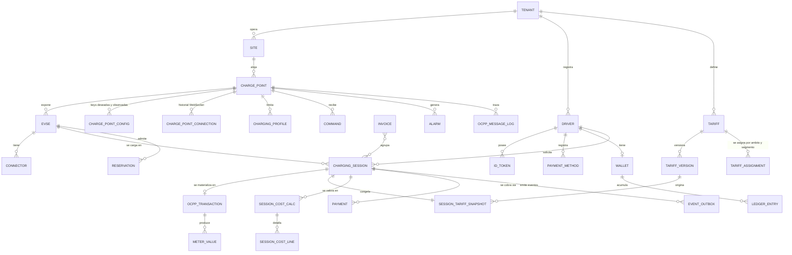
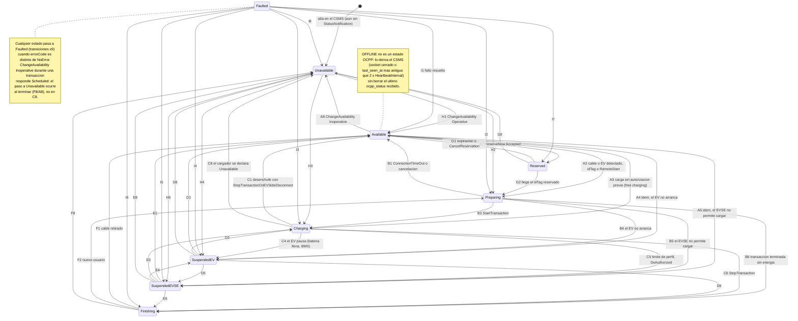
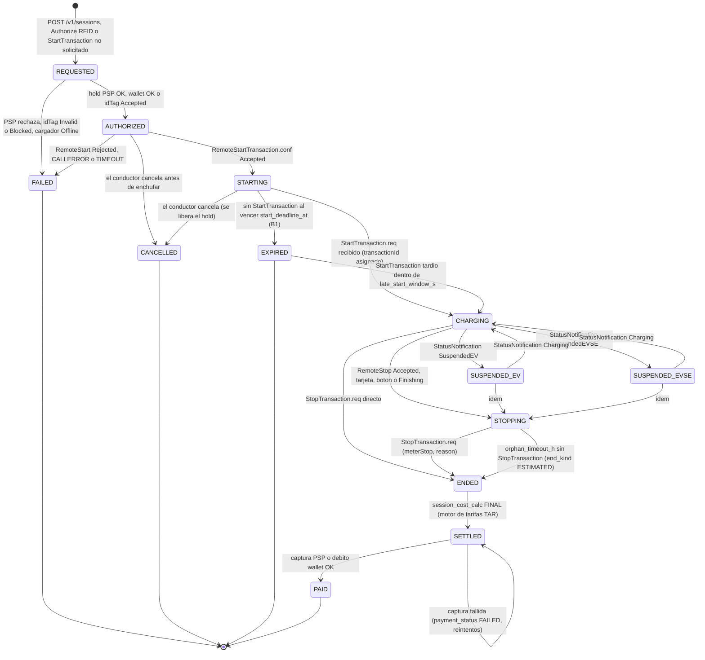
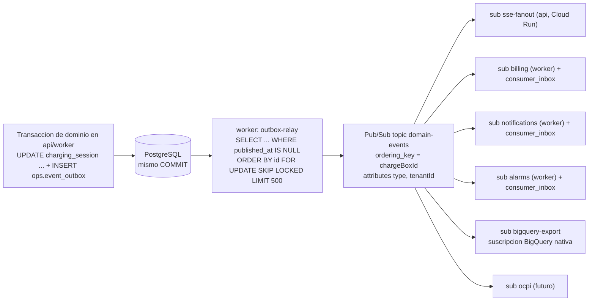

# Capítulo 6 (DAT). Modelo de dominio, datos y eventos

**Proyecto:** volt-platform (CSMS propio; los cargadores hablan OCPP 1.6J directo con la plataforma)
**Fecha:** 2026-09-18
**Alcance:** entidades y relaciones en PostgreSQL (Cloud SQL), máquinas de estado de conector y sesión, eventos de dominio por Pub/Sub con outbox transaccional, casos difíciles (offline, duplicados, relojes, huérfanos, reinicios, dos pods), retención y volúmenes, DDL completo de las tablas centrales y consultas típicas.
**Nomenclatura:** la misma que ARQ (`ocpp-gateway` en GKE Autopilot; `api`/`worker`/`backoffice` en Cloud Run; PostgreSQL en Cloud SQL; Memorystore Redis; Pub/Sub; Identity Platform), esquemas por módulo de ARQ §6.2 (`assets`, `sessions`, `tariffs`, `billing`, `ops` + `auth`, `config`, `audit`), tablas de tarifas exactamente como TAR §1.5 y motor de parámetros de 5 niveles como FUN §1.1/M20.

> **Verificación web.** El proxy de esta sesión bloquea `docs.cloud.google.com`, `downloads.regulations.gov` (copia pública de la especificación OCPP 1.6), `openchargealliance.org`, `plugchoice.com`, `1bench.dev`, `pgextensions.org`, `support.myenergi.com` y `library.e.abb.com`. Verifiqué en su lugar con: los enums oficiales de `mobilityhouse/ocpp` v16 (estados, códigos de error, `Reason`, measurands, contextos, fases, unidades), la máquina de estados v16 de `EVerest/libocpp` (transiciones de conector), el paquete `transactions` 2.0.1 de `lorenzodonini/ocpp-go`, el repositorio oficial `ocpi/ocpi` (módulos CDRs y Sessions 2.2.1), los issues de SteVe #1293/#1296, y extractos de búsqueda que citan la documentación de Google Cloud (Pub/Sub, BigQuery, Cloud SQL) y de pg_partman. Donde solo pude confirmar por fuentes secundarias lo marco como **confianza media**.

---

## 0. Resumen ejecutivo y decisiones que fija este capítulo

| # | Decisión | Por qué |
|---|---|---|
| D1 | **Dos agregados para "la carga": `sessions.charging_session` (negocio, lo que ve el conductor y se cobra; equivale a la *order* del PDF y a `charging_order` de FUN) y `sessions.ocpp_transaction` (protocolo: 1 por `StartTransaction` aceptado). Relación 1:0..1 en ambos sentidos.** | Una sesión puede no tener transacción (`RemoteStartTransaction` rechazado, `ConnectionTimeOut`) y una transacción puede llegar sin sesión (RFID offline con `LocalAuthorizeOffline`, `StartTransaction` de un cargador recién migrado). La especificación obliga a aceptar siempre `StartTransaction`; mezclar ambas cosas en una tabla obliga a filas "a medias". |
| D2 | **El estado del conector se guarda crudo (`ocpp_status`, los 9 valores de `ChargePointStatus`) y `OFFLINE` se deriva en una vista a partir de `charge_point.connected`/`last_seen_at`.** | Al reconectar sin reinicio el cargador no siempre reenvía `StatusNotification`; si se hubiera sobrescrito el estado con `Offline` se perdería que estaba `Charging`. El PDF (§2.1.1 `connectorStatus`) confirma que `OFFLINE` es un décimo valor del proveedor, no de OCPP. |
| D3 | **`transactionId` OCPP 1.6 = entero (`integer` en el esquema JSON de `StartTransaction.conf` [V]; en la práctica los cargadores lo guardan en 32 bits con signo, por eso la secuencia se acota a 2 147 483 647) asignado por el CSMS; clave natural `(charge_point_id, ocpp_transaction_id)` y verificación de propiedad en `StopTransaction`, `MeterValues` y `RemoteStopTransaction`.** | SteVe (#1296, nov. 2023) buscaba la transacción solo por `transactionId` y cualquier cargador autenticado podía cerrar sesiones ajenas; con ids secuenciales el ataque es trivial. El fallo se formalizó como CVE-2026-28230 / GHSA-6x38-4w7h-cwr8 (SteVe ≤ 3.11.0, "missing ownership verification on StopTransaction") [V]. Hacer aleatorio el id no basta: es un `int`. |
| D4 | **Idempotencia por contenido en mensajes de transacción**: `StartTransaction` repetido (mismo `connectorId`, `idTag`, `timestamp`, `meterStart`) devuelve el **mismo** `transactionId`; el **primer** `StopTransaction` gana y los siguientes se registran como anomalía sin modificar la transacción. | SteVe (#1293, nov. 2023) aceptaba varios `StopTransaction` con `meterStop` distintos para la misma transacción y creaba una fila de parada por cada uno [V]. Los cargadores reintentan (`TransactionMessageAttempts`) y el `uniqueId` OCPP-J no es fiable entre reconexiones. |
| D5 | **Doble sello de tiempo en todo lo que viene del cargador** (`*_at_cp` = `timestamp` del cargador; `*_received_at` = hora del servidor) y `clock_offset_s` por cargador, medido con los mensajes **que llevan `timestamp`** recibidos en línea (`StatusNotification`, `MeterValues`, `StartTransaction`/`StopTransaction`); `BootNotification.req` y `Heartbeat.req` **no** llevan sello de tiempo [V], solo sus `.conf` devuelven `currentTime` para resincronizar al cargador. Para facturar se usa la hora del cargador corregida por el offset; para ordenar y detectar "llegó tarde" la del servidor. | Los `timestamp` de mensajes encolados offline son los reales de la carga; la hora de recepción no sirve para tarifas por franja. Un reloj desfasado > umbral genera alarma `CLOCK_SKEW`. |
| D6 | **`sessions.meter_value` estrecha (una fila por `sampledValue`), particionada por mes con `pg_partman` + `pg_cron`, ENUMs para measurand/contexto/fase/unidad, PK compuesta que deduplica.** Retención en caliente 90 días (parámetro), historia completa en BigQuery vía suscripción BigQuery del topic de eventos. | Volumen: 500 conectores a 30 s con 8 valores por muestra y **6 h de carga al día** ≈ 86 M filas/mes ≈ 17 GB/mes en Cloud SQL (si cargaran las 24 h serían 346 M filas ≈ 69 GB/mes) [V, recalculado]; BigQuery cuesta del orden de USD 0,02/GiB-mes activo y 0,01 a largo plazo (multirregión EE. UU.; 0,023/0,016 en algunas regiones; a confirmar en la calculadora de precios), Cloud SQL un orden de magnitud más. |
| D7 | **Outbox transaccional en `ops.event_outbox` (id `bigint` monotónico, `event_id` ULID) → relay en `worker` con `FOR UPDATE SKIP LOCKED` → topic `domain-events` con `ordering_key = chargeBoxId`; consumidores idempotentes con `ops.consumer_inbox (consumer, event_id)`.** | Pub/Sub es *at-least-once*; el exactly-once solo existe en suscripciones *pull* y, combinado con ordering keys, exige acks en orden [V]; es más simple y barato deduplicar en el consumidor. Límite: 1 MB/s de publicación por ordering key y publicación en la misma región [V]. |
| D8 | **Máquina de estados de sesión con 13 estados** (`REQUESTED, AUTHORIZED, STARTING, CHARGING, SUSPENDED_EV, SUSPENDED_EVSE, STOPPING, ENDED, SETTLED, PAID` + `FAILED, CANCELLED, EXPIRED`) y **proyección** a los 8 estados que la app ve según ARQ §1.4. Timeouts explícitos (Cloud Tasks): `STARTING → EXPIRED` a `ConnectionTimeOut + margen`; `STOPPING/CHARGING → ENDED(ESTIMATED)` a `orphan_timeout_h`. | El conductor no necesita distinguir `SUSPENDED_EV` de `CHARGING` en la lista, pero el back-office y el idle fee sí. |
| D9 | **Tarifas: se usan las tablas de TAR tal cual** (`tariffs.tariff`, `tariff_version`, `tariff_assignment`, `pricing_rule`, `price_quote`, `session_tariff_snapshot`, `session_cost_calc`, `session_cost_line`). `PricingSnapshot` de este capítulo = `session_tariff_snapshot`. El CDR (sesión liquidada + cálculo `FINAL`) es **inmutable**, como exige OCPI. | Un solo modelo de precios para app, back-office, recibos y roaming futuro. |
| D10 | **Compatibilidad con OCPP 2.0.1/2.1 desde el esquema**: `ocpp_transaction_ref text` (en 2.0.1 `transactionId` es `string(36)`), `last_seq_no` (`TransactionEvent.seqNo`), `charging_state` (`ChargingState`), `evse` como entidad propia (OCPI/2.0.1) con `connector` físico debajo. | Evita una migración de esquema cuando llegue el primer cargador 2.0.1 (OCPP 2.1 es IEC 63584-210:2025). |

---

## 1. Glosario canónico y alineación con los otros capítulos

| Entidad (pedido) | Tabla canónica | Alias en otros capítulos | Notas |
|---|---|---|---|
| Tenant / Operador | `assets.tenant` | FUN `tenant` | Moneda, país y zona horaria: **decisión pendiente** (no se asume país). |
| Site / Sede | `assets.site` | ARQ `assets.location`, HW `location_id` | = OCPI `Location` = PDF `stationResponse`. |
| ChargingStation / ChargePoint | `assets.charge_point` | ARQ/FUN/SEG `charge_point`, HW `cp.charge_point` | `charge_box_id` único global (es el path de la URL WSS). Credenciales y certificados: SEG §2.8 (`charge_point_credential`, `charge_point_certificate`). |
| EVSE | `assets.evse` | ARQ `connector.evse_id` (campo) | En 1.6 hay 1 EVSE por `connectorId`; `evse_id` público (QR, roaming) = PDF `connectorCode`. |
| Connector | `assets.connector` | ARQ/FUN/HW `connector` | Toma física; lleva el `ocpp_status` (1.6 reporta estado por `connectorId`). |
| ConfigurationKey | `assets.charge_point_config` | ARQ igual; HW `cp.config_snapshot`; FUN `ocpp_config_template` (plantilla) | Deseado vs observado, `readonly`, `last_synced_at`, `drift`. |
| Tariff / TariffElement / PriceComponent / TariffRestriction | `tariffs.tariff` + `tariffs.tariff_version.definition` (JSONB OCPI) | TAR §1.5 | Los elementos viven dentro del JSONB versionado (inmutable), no en tablas hijas. |
| TariffAssignment | `tariffs.tariff_assignment` | TAR | `scope_type` PLATFORM/TENANT/SITE/CHARGE_POINT/CONNECTOR/CONNECTOR_TYPE + `segment`. |
| PricingSnapshot | `tariffs.session_tariff_snapshot` | TAR | Solo INSERT; hash SHA-256. |
| User / Driver | `auth.driver` (+ `staff_user` de SEG) | FUN `user_account`, SEG `staff_user` | `idp_subject` = uid de Identity Platform. |
| AuthToken / IdTag | `auth.id_token` | FUN `id_token`, ARQ `IdToken` | `idTag` 1.6 = `CiString20`; `parent_token` = `parentIdTag`. |
| PaymentMethod | `billing.payment_method` | — | Solo tokens del PSP; nunca PAN. |
| Wallet / LedgerEntry | `billing.wallet`, `billing.ledger_entry` | FUN M06 | Ledger append-only; el saldo es una caché. |
| Session / Transaction | `sessions.charging_session` / `sessions.ocpp_transaction` | ARQ `charging_session` (fusionada), FUN `charging_order` + `ocpp_transaction`, HW `cp.transaction` | Ver D1. |
| MeterValue | `sessions.meter_value` (particionada) | ARQ/FUN/HW `meter_value` | Ver D6. |
| ChargingProfile | `sessions.charging_profile` | FUN M09 | Deseado vs aceptado por el cargador. |
| Reservation | `sessions.reservation` | FUN M08 | `reservationId` entero único por cargador. |
| Alarm / Event | `ops.alarm` (+ `security_event` de SEG; eventos = `ops.event_outbox`) | ARQ `ops.alarm`, FUN M10 | Deduplicación por `fingerprint`. |
| Command | `ops.command` | ARQ `ops.command` | `unique_id` ULID = `uniqueId` del CALL. |
| OcppMessageLog | `ops.ocpp_message_log` (particionada por día) | ARQ igual | Retención corta. |
| Outbox | `ops.event_outbox` + `ops.consumer_inbox` | ARQ `ops.event_outbox` | Ver D7. |
| AuditLog | `audit.audit_log` | SEG §2.8 (cadena de hashes), FUN `audit_log` | Se adopta la de SEG. |
| Invoice / Payment / Refund | `billing.invoice`, `billing.payment`, `billing.refund` | FUN M06 | Numeración y factura electrónica: pendiente por país. |
| Parámetros (5 niveles) | `config.config_param` + `config.param_definition` | FUN `config_param`; ARQ `ops.setting` (3 niveles) | Se adopta el modelo de FUN (5 niveles); ARQ §2.5 queda como subconjunto. |

Mapeo del vocabulario del PDF del proveedor (solo referencia de dominio): `connectorStatus` → `assets.v_connector_live.status` (9 estados OCPP + `Offline` derivado); `connectorCode` (= `chargePointSerialNumber` + `connectorId`, ej. `"623400291"+"1"`) → `assets.evse.evse_id`; `priceTemplateSnapshotResponse` → `session_tariff_snapshot`; `order` (`orderNo`, `startAmount`, `thirdPartyTransactionId`, `payStatus`, `totalPower`, `totalTime`, `totalAmount`, `reduceAmount`, `actualAmount`, `endReason`) → `charging_session` (`session_no`, `preauth_minor`, `billing.payment.psp_reference`, `payment_status`, `energy_wh`, `charging_time_s`, `subtotal_minor`, `discount_minor`, `total_minor`, `stop_reason`); `lastProcessData` (`electricity`, `cost`, `outputPower`, `outputVoltage`, `outputCurrent`, `socValue`) → `charging_session.last_sample` + `session_cost_calc(kind='RUNNING')`.

---

## 2. Modelo de entidades

### 2.1 Diagrama entidad-relación



### 2.2 `assets` — activos

| Tabla | Campos clave | Origen OCPP / PDF |
|---|---|---|
| `tenant` | `code`, `name`, `country_code`, `currency`, `timezone`, `status` | — (país/moneda pendientes) |
| `site` | `code`, `name`, `address`, `latitude/longitude numeric(10,7)`, `geog` (PostGIS, radio de búsqueda), `timezone` (las franjas de tarifa se evalúan aquí), `access_type`, `opening_hours` (OCPI `Hours`), `grid_max_power_w`, `owner_party_id`, `status` | PDF `stationResponse` (`stationName`, `address`, `latitude`, `longitude` con precisión (10,7), `businessHours "00:00-24:00"`) |
| `charge_point` | `charge_box_id` (único global), `serial_number`, `vendor`, `model`, `firmware_version`, `iccid`, `imsi`, `meter_type`, `meter_serial`, `ocpp_version`, `security_profile`, `registration_status` (Accepted/Pending/Rejected), `lifecycle_status` (SEG), `config_template_id`, `supported_profiles[]`, `number_of_connectors`, `heartbeat_interval_s`, `connected`, `connection_generation` (fencing), `last_seen_at`, `last_boot_at`, `clock_offset_s`, `cp_status`/`cp_error_code` (StatusNotification de `connectorId=0`) | `BootNotification.req` (`chargePointVendor`, `chargePointModel`, `chargePointSerialNumber`, `firmwareVersion`, `iccid`, `imsi`, `meterType`, `meterSerialNumber`); PDF `chargePointSerialNumber` |
| `evse` | `ocpp_evse_id` (1.6: = `connectorId`), `evse_id` público único (QR/roaming; PDF `connectorCode`), `physical_reference`, `max_power_w`, `visible_in_app`, `reservable`, `admin_status` | OCPI `EVSE.uid`/`evse_id`; OCPP 2.0.1 `evse.id` |
| `connector` | `ocpp_connector_id`, `standard` (OCPI `ConnectorType`), `power_type`, `max_voltage_v`, `min_voltage_v`, `max_current_a`, `max_power_w`, `ocpp_status` (9 valores), `error_code` (16 valores `ChargePointErrorCode`), `vendor_error_code`, `status_info`, `status_at_cp`, `status_received_at`, `status_seq`, `current_transaction_id` | `StatusNotification.req` (`connectorId`, `status`, `errorCode`, `info`, `timestamp`, `vendorId`, `vendorErrorCode`); PDF `connectorResponse` (`connectorType`, `voltageUpperLimits`, `voltageLowerLimits`, `current`, `powerUpperLimits`, `powerLowerLimits`, `connectorStatus`) |
| `charge_point_config` | `key` (CiString50), `desired_value`, `observed_value` (CiString500), `readonly`, `source` (TEMPLATE/OVERRIDE/DEVICE), `last_result` (Accepted/Rejected/RebootRequired/NotSupported), `last_synced_at`, `drift` (generado) | `GetConfiguration.conf.configurationKey[]{key, readonly, value}`, `ChangeConfiguration.conf.status` |

Regla de `evse` vs `connector`: en OCPP 1.6 el estado y la transacción son **por `connectorId`**, y no existe el concepto EVSE; se crea 1 `evse` por `connectorId` con 1 `connector` debajo (`ocpp_connector_id = ocpp_evse_id`). Un cargador DC con CCS y CHAdeMO que solo puede usar uno a la vez se modela, en 1.6, como dos `connectorId` (así lo reporta el firmware) y el balanceo lo resuelve el `ChargePointMaxProfile`; en 2.0.1 pasa a ser 1 EVSE con 2 conectores sin tocar el esquema.

### 2.3 `auth` — identidad del conductor y tokens

| Tabla | Campos clave | Notas |
|---|---|---|
| `driver` | `idp_subject` (Identity Platform), `email`, `phone`, `display_name`, `locale`, `segment` (TAR: `PUBLIC`, `MEMBER:<tier>`, `FLEET:<id>`, `EMPLOYEE`), `status`, `default_payment_method_id`, `consents`, `anonymized_at` | Índice único parcial por `(tenant_id, lower(email))` mientras no esté anonimizado. |
| `id_token` | `token` (≤ 20 caracteres, comparación case-insensitive), `token_type` (RFID/APP/QR/AUTOCHARGE/EMAID/FLEET/OPERATOR), `parent_token`, `status` (ACTIVE/BLOCKED/EXPIRED/INVALID), `valid_from/until`, `in_local_list`, `local_list_version`, `last_used_at`, `last_charge_point_id` | El token virtual de la app es un `idTag` generado por el CSMS (p. ej. `APP` + 16 hex) que viaja en `RemoteStartTransaction.idTag` y vuelve en `StartTransaction.req.idTag`; así se correlaciona sesión ↔ transacción. |

Respuesta `idTagInfo` (`Authorize.conf`, `StartTransaction.conf`, `StopTransaction.conf`): `status` ∈ {`Accepted`, `Blocked`, `Expired`, `Invalid`, `ConcurrentTx`} (verificado), `expiryDate` = `now + auth.cache_ttl_s` (parámetro T), `parentIdTag` = `parent_token`.

### 2.4 `sessions` — sesiones, transacciones, medidas, reservas, perfiles

| Tabla | Campos clave | Notas |
|---|---|---|
| `charging_session` | `session_no` legible, `driver_id`, `id_token_id`, `id_tag`, `site_id`, `charge_point_id`, `evse_id`, `connector_id`, `start_channel` (APP/QR/RFID/AUTOCHARGE/ROAMING/OPERATOR/UNSOLICITED), `auth_method` (OCPI: AUTH_REQUEST/COMMAND/WHITELIST), `state`, `state_changed_at`, `idempotency_key`, `remote_start_command_id`, `ocpp_transaction_id`, `reservation_id`, `requested_at`, `authorized_at`, `start_deadline_at`, `started_at`, `ended_at`, `settled_at`, `paid_at`, `idle_since`, `energy_wh`, `charging_time_s`, `idle_time_s`, `stop_reason`, `end_kind` (NORMAL/TIMEOUT/ESTIMATED/ORPHAN/FAILED), `failure_code`, `tariff_snapshot_id`, `final_calc_id`, `currency`, `subtotal_minor`, `discount_minor`, `tax_minor`, `total_minor`, `preauth_minor`, `payment_status`, `last_sample` (JSONB: `at`, `power_w`, `voltage_v`, `current_a`, `soc`, `energy_wh`), `app_seq` | Índice único parcial: **una sola sesión viva por EVSE**. `last_sample` evita leer la serie temporal para la pantalla de progreso (PDF `lastProcessData`). |
| `ocpp_transaction` | `ocpp_transaction_id int`, `ocpp_transaction_ref text`, `session_id` (nullable), `id_tag`, `id_tag_status`, `reservation_ocpp_id`, `meter_start_wh`, `meter_stop_wh`, `started_at_cp`, `started_received_at`, `stopped_at_cp`, `stopped_received_at`, `stop_reason` (11 valores `Reason`), `stop_id_tag`, `state` (ACTIVE/STOPPED/CLOSED_ESTIMATED/ORPHAN/RECONCILED), `offline_start`, `offline_stop`, `clock_offset_s`, `start_unique_id`, `stop_unique_id`, `transaction_data` (JSONB crudo de `StopTransaction.transactionData`), `last_seq_no`, `charging_state`, `anomaly_flags[]` | `UNIQUE (charge_point_id, ocpp_transaction_id)`; `UNIQUE (charge_point_id, ocpp_connector_id, started_at_cp, meter_start_wh, id_tag)` (idempotencia); índice único parcial: una transacción `ACTIVE` por conector. |
| `meter_value` | `charge_point_id`, `ocpp_connector_id`, `transaction_id` (nullable: `transactionId` es **opcional** en `MeterValues.req` [V]), `sampled_at` (clave de partición), `received_at`, `measurand` (22 valores), `context` (8), `phase` (10 + `NONE`), `location` (5), `unit` (16 + `Celcius`: la errata de OCPP 1.6 obliga al Central System a aceptar ambas grafías [V]), `value numeric(16,4)`, `value_wh` (generado: Wh normalizados para energía), `signed_data`, `source` (MeterValues/StartTransaction/StopTransaction/Trigger) | PK compuesta = clave de deduplicación; particionada por mes. |
| `reservation` | `ocpp_reservation_id` (entero único por cargador), `ocpp_connector_id` (0 si `ReserveConnectorZeroSupported`), `id_tag`, `parent_id_tag`, `expiry_at`, `status` (REQUESTED/ACCEPTED/REJECTED/FAULTED/OCCUPIED/UNAVAILABLE/CANCELLED/EXPIRED/USED), `command_id`, `session_id` | `ReserveNow.conf.status` ∈ {Accepted, Faulted, Occupied, Rejected, Unavailable} (verificado). |
| `charging_profile` | `ocpp_profile_id`, `stack_level`, `purpose` (ChargePointMaxProfile/TxDefaultProfile/TxProfile), `kind` (Absolute/Recurring/Relative), `recurrency` (Daily/Weekly), `valid_from/to`, `transaction_id` (TxProfile), `schedule` JSONB (`chargingRateUnit`, `chargingSchedulePeriod[]{startPeriod, limit, numberPhases}`, `minChargingRate`, `duration`, `startSchedule`), `origin` (SITE_LIMIT/LOAD_BALANCER/TARIFF/OPERATOR/DRIVER), `status` (DESIRED/ACCEPTED/REJECTED/NOT_SUPPORTED/CLEARED) | `SetChargingProfile.conf.status` ∈ {Accepted, Rejected, NotSupported} (verificado). |

### 2.5 `tariffs` — se adopta TAR §1.5 sin cambios

`tariff` (identidad, `currency`), `tariff_version` (`definition` JSONB = objeto OCPI `Tariff` + `x_volt`, `definition_hash`, `status` DRAFT/SCHEDULED/ACTIVE/RETIRED, exclusión de solapes con `btree_gist`), `tariff_assignment` (`scope_type`, `scope_id`, `segment`, `adjustments`, `priority`), `pricing_rule` (precio dinámico declarativo), `price_quote` (lo que vio el conductor), `session_tariff_snapshot` (**inmutable**, `snapshot_hash`), `session_cost_calc` (`kind` RUNNING/FINAL/RECALC, `calc_version`, `input_hash`, totales en unidad mínima, `flags` METER_ANOMALY/OFFLINE/INTERPOLATED/ORPHAN), `session_cost_line` (`dimension` FLAT/ENERGY/TIME/PARKING_TIME/RESERVATION/ADJUSTMENT/CAP), `tariff_audit`. Este capítulo solo añade las claves foráneas desde `charging_session` (`tariff_snapshot_id`, `final_calc_id`).

### 2.6 `billing` — pagos, wallet, facturas

| Tabla | Campos clave | Notas |
|---|---|---|
| `payment_method` | `psp`, `psp_customer_id`, `psp_method_id` (token), `kind` (CARD/WALLET/FLEET_ACCOUNT/INVOICE), `brand`, `last4`, `expires_*`, `status` | PSP: decisión pendiente (país). |
| `payment` | `session_id`, `kind` (PREAUTH/CAPTURE/REFUND/VOID/WALLET_TOPUP), `amount_minor`, `currency`, `status` (PENDING/SUCCEEDED/FAILED/CANCELLED), `psp_reference` (PDF `thirdPartyTransactionId`, ej. `pi_…`), `idempotency_key` único, `parent_payment_id`, `raw` | Una fila por operación con el PSP; el hold del PDF (`startAmount`) es un `PREAUTH`; la captura final (`actualAmount`) un `CAPTURE` hijo. |
| `wallet` / `ledger_entry` | `balance_minor` (caché) / `kind` (TOPUP/SESSION_CHARGE/REFUND/ADJUSTMENT/EXPIRY), `amount_minor` con signo, `balance_after_minor`, `idempotency_key` | Ledger append-only; `balance_after_minor` permite auditar sin recalcular. |
| `invoice` / `refund` | `number`, `series`, `kind` (RECEIPT/INVOICE/CREDIT_NOTE), totales, `tax_breakdown`, `session_ids[]`, `pdf_uri`, `einvoice_status/ref` / `payment_id`, `amount_minor`, `reason`, `status`, `approved_by`, `credit_note_id` | Numeración y factura electrónica dependen del país (pendiente). |

### 2.7 `ops` — operación

`command` (ver §3.3), `ocpp_message_log` (particionada por día), `alarm` (deduplicada por `fingerprint`, `occurrences`, `status` OPEN/ACKED/RESOLVED), `event_outbox` / `consumer_inbox` (§4), `charge_point_connection` (historial de conexiones WebSocket con `generation`, `pod`, `remote_ip`, `close_code`; base de los informes de disponibilidad), `firmware_update` (job por cargador: `location`, `retrieve_date`, estados de `FirmwareStatusNotification`).

### 2.8 `config` — motor de parámetros (FUN, 5 niveles) y plantillas OCPP

`param_definition` (catálogo: `key`, JSON Schema del valor, `allowed_scopes`, `default_value`, `requires_restart`), `config_param` (`key`, `scope_type` PLATFORM/TENANT/SITE/CHARGE_POINT/CONNECTOR, `scope_id`, `value` JSONB, vigencia, `updated_by`, `reason`), `ocpp_config_template` (`keys` JSONB con las configuration keys por modelo, `read_only_expected[]`). La función `config.resolve(key, connector_id)` devuelve el valor efectivo (X → C → S → T → P → default). Parámetros que este capítulo introduce (todos con nivel permitido):

| Key | Nivel | Default | Uso |
|---|---|---|---|
| `session.start_timeout_margin_s` | P, T | 30 | `start_deadline_at = RemoteStart.conf + ConnectionTimeOut + margen` |
| `session.late_start_window_s` | T | 600 | Ventana para reabrir una sesión `EXPIRED` si llega un `StartTransaction` tardío con el mismo `idTag` |
| `session.orphan_timeout_h` | T | 12 | Cierre estimado sin `StopTransaction` (FUN M04) |
| `session.idle_detect_power_w` / `session.idle_detect_s` | T, S | 200 / 300 | Detección de "carga completa" (`idle_since`) |
| `meter.max_energy_jump_wh` | P, T | 50 000 | Salto de registro sospechoso → `METER_ANOMALY` |
| `meter.max_gap_factor` | P | 3 | Hueco > 3 × `MeterValueSampleInterval` → flag `GAP` |
| `clock.skew_alarm_s` / `clock.skew_clamp_s` | P | 60 / 86 400 | Alarma `CLOCK_SKEW`; sellos > 1 día en el futuro se acotan a `received_at` |
| `connector.stuck_preparing_margin_s` / `connector.stuck_finishing_min` | P, T | 60 / 15 | Watchdogs §5.6 |
| `ocpp.dedupe_window_s` | P | 600 | TTL de `cs:msg:{chargeBoxId}:{uniqueId}` en Redis |
| `retention.meter_value_hot_days` / `retention.ocpp_log_hot_days` / `retention.outbox_published_days` | P | 90 / 30 / 7 | §6 |
| `privacy.driver_anonymize_after_days` | T | pendiente (país) | §6.4 |
| `billing.unsolicited_tx_policy` | T | `BILL_IF_KNOWN_TOKEN` | Qué hacer con transacciones sin sesión (§5.5) |

### 2.9 `audit` — se adopta SEG §2.8

`audit.audit_log` append-only con cadena de hashes (`prev_hash`, `hash`), `actor_type` (staff/driver/system/charge_point), `action` (`tariff.update`, `command.RemoteStartTransaction`, `config.override`, `refund.create`…), `before/after`, `request_id` (= `uniqueId` OCPP o request-id HTTP). Este capítulo añade la regla: **toda transición de estado de sesión y de comando escribe en `audit_log`** con `entity_type = 'charging_session' | 'command'`.

---

## 3. Máquinas de estado

### 3.1 Conector (OCPP 1.6 `ChargePointStatus` + `Offline` derivado)

Los 9 estados y sus transiciones están codificados en la máquina de estados v16 de `EVerest/libocpp` [V]; los códigos `A1…I8` son los de la tabla "Status transitions" de la especificación 1.6 (letra = estado origen, número = estado destino: A Available, B Preparing, C Charging, D SuspendedEV, E SuspendedEVSE, F Finishing, G Reserved, H Unavailable, I Faulted). Ojo: en esa tabla `SuspendedEV` va **antes** que `SuspendedEVSE` (columna 4 y 5), al revés que en el enum `ChargePointStatus`; así lo numera también `libocpp` (`I4_ReturnToSuspendedEV`, `I5_ReturnToSuspendedEVSE`) [V]. Las letras/números exactos de cada celda quedan **a confirmar** contra la tabla de la especificación (no accesible en esta revisión); las transiciones en sí son las de `libocpp` (confianza alta). Transiciones que suelen olvidarse y que `libocpp` sí admite: `Available → Charging/SuspendedEV/SuspendedEVSE` (A3/A4/A5: carga sin autorización previa, p. ej. *free charging* o `LocalPreAuthorize`), `Suspended* → Unavailable` (D8/E8), `Unavailable → Suspended*` (H4/H5) y `Faulted → Suspended*/Reserved` (I4/I5/I7); el CSMS debe aceptarlas sin marcar error.



Qué hace el CSMS en cada llegada de `StatusNotification.req` (`connectorId`, `status`, `errorCode`, `info`, `timestamp`, `vendorId`, `vendorErrorCode`):

| Estado nuevo | Acción en datos | Evento | Temporizadores |
|---|---|---|---|
| `Preparing` | `connector.ocpp_status`, `status_at_cp`; si hay sesión `STARTING` en el EVSE nada más (se espera `StartTransaction`) | `connector.status.changed` | Watchdog `STUCK_PREPARING` = `ConnectionTimeOut` + `connector.stuck_preparing_margin_s` sin transacción |
| `Charging` | Enlaza `current_transaction_id`; sesión `SUSPENDED_*` → `CHARGING` | `connector.status.changed`, `session.resumed` | Cancela idle |
| `SuspendedEV` / `SuspendedEVSE` | Sesión `CHARGING` → `SUSPENDED_EV` / `SUSPENDED_EVSE`; `idle_since` si potencia ≈ 0 (idle fee, FUN M07) | `session.suspended` | `session.idle_detect_s` |
| `Finishing` | Sesión → `STOPPING` si no ha llegado `StopTransaction`; si ya está `ENDED`, contabiliza tiempo de ocupación (`idle_time_s`) hasta `Available` | `connector.status.changed` | Watchdog `STUCK_FINISHING` (`connector.stuck_finishing_min`) |
| `Available` | Cierra idle; libera `current_transaction_id`; si sesión `STARTING` → `EXPIRED` (B1) | `connector.status.changed`, `session.expired` | — |
| `Reserved` | Enlaza `reservation` `ACCEPTED` | `reservation.confirmed` | `expiry_at` |
| `Unavailable` | Marca administrativa (`ChangeAvailability`) o fallo de arranque | `connector.status.changed` | — |
| `Faulted` | `error_code`, `vendor_error_code`, `status_info`; alarma `CONNECTOR_FAULTED` con `fingerprint = kind|charge_box_id|connectorId|errorCode` (`occurrences++` si ya existe) | `alarm.raised` | Auto-resuelve al salir de `Faulted` |
| `connectorId = 0` | Estado del cargador entero (`charge_point.cp_status`: solo Available/Unavailable/Faulted, como en la máquina "connector zero" de libocpp) | `charger.status.changed` | — |

Reglas de consistencia: (0) `timestamp` es **opcional** en `StatusNotification.req` (solo `connectorId`, `errorCode` y `status` son obligatorios [V]): si falta, `status_at_cp = status_received_at` y no se aplica corrección de reloj; (1) se descarta una notificación cuyo `timestamp` sea anterior al `status_at_cp` vigente **y** su `status_seq` menor (mensajes reordenados tras reconexión); (2) `MinimumStatusDuration` (key opcional) reduce el *flapping* en el cargador, pero el CSMS además ignora cambios `Preparing↔Available` de < 2 s a efectos de alarmas; (3) el estado efectivo para app y back-office es `assets.v_connector_live.status`, que devuelve `Offline` cuando `charge_point.connected = false` o `last_seen_at < now() - 2 × heartbeat_interval_s` (ARQ §4.4), exactamente el décimo valor `OFFLINE` del PDF.

### 3.2 Sesión de carga (negocio) y transacción OCPP (protocolo)



Tabla de transiciones con disparador, componente responsable, eventos y timeouts:

| De → A | Disparador | Componente | Efectos en datos | Evento(s) |
|---|---|---|---|---|
| — → `REQUESTED` (Solicitada) | `POST /v1/sessions` con `Idempotency-Key`; `Authorize.req` con RFID; `StartTransaction.req` sin sesión (canal `UNSOLICITED`) | `api` / `ocpp-gateway`→`api` | INSERT `charging_session`; cotización TAR (`price_quote`) | `session.requested` |
| `REQUESTED` → `AUTHORIZED` (Autorizada) | `PREAUTH` del PSP `SUCCEEDED` (PDF `startAmount`) o saldo wallet suficiente; para RFID: `idTagInfo.status = Accepted` | `api` (billing) | `preauth_minor`, `payment` PREAUTH; INSERT `session_tariff_snapshot` (congela tarifa) | `session.authorized`, `payment.authorized` |
| `AUTHORIZED` → `STARTING` (Iniciando) | `RemoteStartTransaction.conf.status = Accepted` | `api` vía gRPC al gateway | `remote_start_command_id`; `start_deadline_at = now + ConnectionTimeOut(cargador) + session.start_timeout_margin_s`; Cloud Task programada | `session.starting`, `command.completed` |
| `AUTHORIZED` → `FAILED` | `Rejected`, `CALLERROR`, `TIMEOUT`, cargador sin conexión (`cs:conn:{id}` ausente) | `api` | `failure_code`; VOID del PREAUTH | `session.failed`, `payment.voided` |
| `STARTING` → `CHARGING` (Cargando) | `StartTransaction.req` con el `idTag` esperado en el mismo EVSE | `api` | INSERT `ocpp_transaction` (secuencia → `transactionId`), `started_at`, `meter_start_wh`; `connector.current_transaction_id` | `session.started` |
| `STARTING` → `EXPIRED` (Expirada) | Cloud Task al vencer `start_deadline_at` sin transacción, o `StatusNotification Available` tras `Preparing` (B1) | `worker` | VOID del PREAUTH; `end_kind = TIMEOUT` | `session.expired` |
| `EXPIRED` → `CHARGING` | `StartTransaction.req` tardío (mismo `idTag`, mismo EVSE) dentro de `session.late_start_window_s` | `api` | Re-autoriza (nuevo PREAUTH) y marca `anomaly_flags += LATE_START` | `session.started` |
| `CHARGING` ↔ `SUSPENDED_EV` / `SUSPENDED_EVSE` | `StatusNotification` | `api` | `idle_since` si aplica | `session.suspended` / `session.resumed` |
| `CHARGING`/`SUSPENDED_*` → `STOPPING` (Finalizando) | `POST /v1/sessions/{id}/stop` → `RemoteStopTransaction.conf Accepted`; tarjeta/botón local (`Finishing`); límite de tiempo/energía (parámetro S/X) | `api` | `stop_requested_by`; Cloud Task `orphan_timeout_h` | `session.stop_requested` |
| `STOPPING`/`CHARGING` → `ENDED` (Finalizada) | `StopTransaction.req` (`transactionId`, `meterStop`, `timestamp` obligatorios; `reason`, `idTag`, `transactionData` opcionales [V]: sin `reason` se asume `Local`) | `api` | `ocpp_transaction.state = STOPPED`, `energy_wh`, `charging_time_s`, `stop_reason` (PDF `endReason`) | `session.ended` |
| `STOPPING`/`CHARGING` → `ENDED` (estimada) | `orphan_timeout_h` sin `StopTransaction` y cargador sin reconectar | `worker` | `end_kind = ESTIMATED`, `meter_stop_wh` = último `Energy.Active.Import.Register`, `ocpp_transaction.state = CLOSED_ESTIMATED` | `session.ended` (`estimated: true`) |
| `ENDED` → `SETTLED` (Liquidada) | Motor de tarifas: `session_cost_calc(kind='FINAL')` con `input_hash` | `worker` (pricing) | `final_calc_id`, totales `*_minor` (PDF `totalAmount`/`reduceAmount`/`actualAmount`), `settled_at` | `session.priced`, `session.settled` |
| `SETTLED` → `PAID` (Pagada) | `CAPTURE` del PSP `SUCCEEDED` (≤ hold; si el costo supera el hold, captura el hold y cobra el resto en un segundo cargo según política) o `ledger_entry SESSION_CHARGE` | `worker` (billing) | `payment_status = CAPTURED`, `paid_at`; `invoice` (recibo) | `payment.captured`, `invoice.issued` |
| `SETTLED` → `SETTLED` | `CAPTURE` fallido | `worker` | `payment_status = FAILED`; reintentos con backoff; bloqueo del conductor tras N fallos (parámetro T) | `payment.failed` |

Estados de `ocpp_transaction`: `ACTIVE` → `STOPPED` (`StopTransaction`), `ACTIVE` → `CLOSED_ESTIMATED` (timeout, nuevo `StartTransaction` en el mismo conector, o `BootNotification` seguido de silencio), `ORPHAN` (`StopTransaction` sin `StartTransaction` conocido) → `RECONCILED` (acción manual del back-office).

Proyección a los estados que la app ve (ARQ §1.4) mediante `sessions.app_state()`: `REQUESTED`/`AUTHORIZED` → `REQUESTED`; `STARTING` → `STARTING`; `CHARGING`/`SUSPENDED_*` → `ACTIVE`; `STOPPING` → `STOPPING`; `ENDED` → `ENDED`; `SETTLED`/`PAID` → `SETTLED` (+ `payment_status`); `FAILED`/`EXPIRED` → `FAILED`; `CANCELLED` → `CANCELLED`. Equivalencias con FUN M04: `ORPHANED` = `CHARGING`/`STOPPING` con el cargador `Offline`; `SETTLED_ESTIMATED` = `SETTLED` con `end_kind = ESTIMATED`; `IDLE` = `CHARGING`/`SUSPENDED_EV` con `idle_since` no nulo; `PAYMENT_FAILED` = `SETTLED` con `payment_status = FAILED`.

### 3.3 Comando remoto (`ops.command`)

`PENDING` (insertado por `api`) → `SENT` (el gateway escribió el CALL en el socket) → `ACCEPTED` | `REJECTED` (según `response.status`) | `ERROR` (CALLERROR: `NotImplemented`, `NotSupported`, `InternalError`, `ProtocolError`, `SecurityError`, `FormationViolation`, `PropertyConstraintViolation`, `OccurenceConstraintViolation`, `TypeConstraintViolation`, `GenericError`) | `TIMEOUT` (sin CALLRESULT en `timeout_ms`; un CALLRESULT posterior se guarda en `late_response_at` y **no** se aplica) | `CANCELLED`. Una sola CALL en vuelo por cargador (ARQ §4.3); `priority = 1` para `RemoteStopTransaction`/`Reset`. Los comandos con efecto diferido (`Reset`, `UpdateFirmware`, `GetDiagnostics`, `ChangeAvailability = Scheduled`) quedan `ACCEPTED` y su resultado real llega por `BootNotification`, `FirmwareStatusNotification`, `DiagnosticsStatusNotification` o `StatusNotification`, que el `worker` correlaciona por `correlation_id`.

---

## 4. Eventos de dominio

### 4.1 Sobre (envelope) y canal

Se usa el sobre de ARQ §2.2 (`id`, `type`, `version`, `occurredAt`, `tenantId`, `aggregate{type,id}`, `source`, `trace`, `data`). Un solo topic `domain-events`; atributos Pub/Sub `type`, `tenantId`, `aggregateType`, `chargeBoxId`; `ordering_key = chargeBoxId` para todo lo que nace del cargador (estado, transacción, medidas) y `sessionId` para lo puramente comercial (pagos, facturas). [V] La publicación con ordering key debe hacerse en la misma región y está limitada a **1 MB/s por clave** (sobra: un cargador produce del orden de KB/s), y la suscripción debe activar `enable_message_ordering`.

`occurredAt` es la **hora del cargador corregida** (`ts_cp + clock_offset_s`) en eventos derivados de mensajes OCPP, y la del servidor en el resto; `data.receivedAt` conserva la del servidor. Así los consumidores de tarifas y BigQuery ven el tiempo real de la carga aunque el mensaje haya llegado horas después.

### 4.2 Catálogo

| Evento | Productor | Disparador | Payload mínimo (`data`) | Consumidores |
|---|---|---|---|---|
| `charger.registered` | `api` (back-office) | Alta del cargador | `chargeBoxId, siteId, templateId, securityProfile` | audit, bigquery |
| `charger.booted` | `ocpp-gateway` | `BootNotification.req` | `chargeBoxId, vendor, model, serialNumber, firmwareVersion, registrationStatus, generation` (el `clockOffsetS` no puede ir aquí: `BootNotification.req` no lleva `timestamp`; se calcula con el primer `StatusNotification`/`MeterValues` sellado tras el boot) | assets (inventario), alarms (firmware no aprobado), config (aplicar plantilla), bigquery |
| `charger.connected` / `charger.disconnected` | `ocpp-gateway` | WS open / close | `chargeBoxId, generation, pod, remoteIp, closeCode, reason` | alarms (offline), sse-fanout (mapa), ocpi, bigquery |
| `charger.offline` / `charger.online` | `worker` (watchdog) | `last_seen_at` > 2 × `HeartbeatInterval` / vuelve | `chargeBoxId, since, activeTransactionIds[]` | alarms, notifications (operador), sse-fanout |
| `connector.status.changed` | `ocpp-gateway` | `StatusNotification.req` | `chargeBoxId, connectorId, evseId, from, to, errorCode, vendorErrorCode, info, tsCp` | sse-fanout (mapa/detalle EVSE), sessions (FSM), alarms (Faulted), smart-charging, ocpi, bigquery |
| `charger.config.drifted` | `worker` | Diff `GetConfiguration` vs plantilla | `chargeBoxId, keys[{key, desired, observed, readonly}]` | alarms, backoffice |
| `authorization.granted` / `authorization.denied` | `api` | `Authorize.req`, pre-check de `RemoteStart` | `chargeBoxId, connectorId, idTagHash, tokenType, driverId, status, reason` | audit, alarms (repetidos denegados), bigquery |
| `session.requested` | `api` | `POST /v1/sessions` | `sessionId, driverId, evseId, channel, quoteId` | sse-fanout, bigquery |
| `session.authorized` | `api` | Hold PSP / wallet OK | `sessionId, preauthMinor, currency, paymentId, snapshotHash` | sse-fanout, bigquery |
| `session.starting` | `api` | `RemoteStart.conf Accepted` | `sessionId, commandId, startDeadlineAt` | sse-fanout, worker (Cloud Task timeout) |
| `session.started` | `api` | `StartTransaction.req` | `sessionId, chargeBoxId, connectorId, ocppTransactionId, meterStartWh, startedAtCp, offlineStart, idTagHash` | sse-fanout, notifications (push "carga iniciada"), smart-charging, ocpi, bigquery |
| `session.metered` | `ocpp-gateway` | `MeterValues.req` (una por mensaje, no por `sampledValue`) | `sessionId, ocppTransactionId, sampledAt, samples[{measurand, value, unit, phase, context}], energyWh, powerW, soc, runningCost{amountMinor, currency, calcVersion}` | sse-fanout (progreso), smart-charging, bigquery |
| `session.suspended` / `session.resumed` | `api` | `StatusNotification Suspended*/Charging` | `sessionId, kind (EV|EVSE), at` | sse-fanout, notifications (idle), bigquery |
| `session.stop_requested` | `api` | `POST …/stop`, tarjeta, límites | `sessionId, requestedBy, commandId` | sse-fanout |
| `session.ended` | `api` / `worker` | `StopTransaction.req` / timeout | `sessionId, ocppTransactionId, meterStopWh, energyWh, chargingTimeS, idleTimeS, stopReason, endedAtCp, endKind, offlineStop, estimated` | billing (liquidar), notifications, sse-fanout, ocpi (CDR), bigquery |
| `session.expired` / `session.cancelled` / `session.failed` | `api` / `worker` | Timeouts, usuario, rechazos | `sessionId, reason, failureCode` | billing (void), notifications, sse-fanout |
| `session.priced` (TAR) | `worker` (pricing) | Cada `session_cost_calc` | `sessionId, calcId, calcVersion, kind, totalMinor, currency, lines[]` | sse-fanout (costo en vivo), billing |
| `session.settled` | `worker` (billing) | Cálculo `FINAL` | `sessionId, totalMinor, currency, calcId, snapshotHash` | billing (captura), notifications (recibo), ocpi (CDR), bigquery |
| `payment.authorized` / `payment.captured` / `payment.failed` / `payment.refunded` / `payment.voided` | `worker` (billing) | Respuesta/webhook PSP | `paymentId, sessionId, kind, amountMinor, currency, pspReferenceMasked` | sessions (FSM), notifications, audit, bigquery |
| `invoice.issued` | `worker` (billing) | Emisión | `invoiceId, number, sessionIds[], totalMinor, currency, pdfUri` | notifications, einvoice (país), bigquery |
| `transaction.orphaned` | `api` | `StopTransaction` sin `Start`; `Start` sin sesión | `chargeBoxId, connectorId, ocppTransactionId, kind (STOP_WITHOUT_START|START_WITHOUT_SESSION)` | alarms, backoffice, bigquery |
| `meter.anomaly.detected` | `api` | Validación de `MeterValues`/`StopTransaction` | `ocppTransactionId, kind (DECREASING|JUMP|GAP|DUPLICATE_STOP), details` | alarms, billing (flag `METER_ANOMALY` en el cálculo) |
| `command.sent` / `command.completed` / `command.timed_out` | `api` | Ciclo del comando | `commandId, chargeBoxId, action, status, latencyMs, requestedBy` | audit, backoffice, alarms (timeouts repetidos) |
| `reservation.created` / `confirmed` / `cancelled` / `expired` / `used` | `api` / `worker` | `ReserveNow`/`CancelReservation`/`StartTransaction.reservationId` | `reservationId, evseId, driverId, ocppReservationId, expiryAt` | sse-fanout, notifications, ocpi |
| `alarm.raised` / `alarm.resolved` | `worker` | Reglas de alarmas | `alarmId, kind, severity, chargeBoxId, connectorId, fingerprint, occurrences` | notifications (operador), backoffice, bigquery |
| `firmware.status.changed` | `ocpp-gateway` | `FirmwareStatusNotification` | `chargeBoxId, jobId, status` | backoffice, alarms |
| `tariff.published` (TAR) / `setting.changed` (FUN M20) | `api` | Publicación / override | `tariffId, version, validFrom` / `key, scopeType, scopeId, before, after, actor` | audit, cache (invalidar), bigquery |
| `driver.anonymized` | `worker` | Baja / retención | `driverId` | audit, ocpi |

### 4.3 Ejemplos

```json
{
  "id": "evt_01J8Z3K4M5N6P7Q8R9S0T1U2V3",
  "type": "session.started", "version": 1,
  "occurredAt": "2026-09-18T14:03:07Z",
  "tenantId": "t_volt",
  "aggregate": { "type": "session", "id": "6f1d0c2e-8f0e-4c9a-9b7e-2f5a1d3c4b5a" },
  "source": "api/rev-3f2a",
  "trace": { "traceId": "4bf92f3577b34da6a3ce929d0e0e4736" },
  "data": {
    "chargeBoxId": "623400291", "connectorId": 1, "evseId": "XX*VOL*E623400291*1",
    "ocppTransactionId": 4711, "meterStartWh": 1234560,
    "startedAtCp": "2026-09-18T14:03:05Z", "receivedAt": "2026-09-18T14:03:07.412Z",
    "offlineStart": false, "idTagHash": "sha256:9f3c…", "channel": "APP"
  }
}
```

```json
{
  "id": "evt_01J8Z3M0ABCDEF1234567890AB",
  "type": "connector.status.changed", "version": 1,
  "occurredAt": "2026-09-18T15:12:40Z",
  "tenantId": "t_volt",
  "aggregate": { "type": "connector", "id": "623400291/1" },
  "source": "ocpp-gateway/gw-7c9f",
  "data": {
    "chargeBoxId": "623400291", "connectorId": 1, "from": "Charging", "to": "Faulted",
    "errorCode": "GroundFailure", "vendorErrorCode": "E042", "info": "RCD trip",
    "tsCp": "2026-09-18T15:12:39Z", "generation": 17
  }
}
```

### 4.4 Outbox transaccional y relay



Reglas del relay: (1) el `INSERT` en `event_outbox` ocurre en la **misma transacción** que el cambio de estado; nunca se publica desde el código de negocio; (2) el relay publica en lotes por `ordering_key`, con `messageId` de Pub/Sub distinto en cada reintento pero `event_id` estable dentro del sobre: la deduplicación aguas abajo se hace por `event_id`; (3) `published_at` se marca tras el `publish` confirmado; si el proceso muere entre el `publish` y el `UPDATE`, el evento se publica dos veces (aceptado: *at-least-once*); (4) filas publicadas se borran a los `retention.outbox_published_days`; (5) con más de ~2.000 eventos/s el relay se sustituye por CDC (Debezium Server con *sink* Pub/Sub leyendo la misma tabla; Datastream de Cloud SQL sirve para BigQuery pero no publica en Pub/Sub). Con 500 cargadores el relay por *polling* (cada 200 ms, `LIMIT 500`) sobra.

### 4.5 Idempotencia de consumidores

- Cada consumidor con efectos persistentes usa `ops.consumer_inbox (consumer, event_id)`: `INSERT … ON CONFLICT DO NOTHING RETURNING` dentro de la misma transacción que el efecto; si no devuelve fila, se hace `ack` sin procesar.
- Efectos externos (captura en el PSP, push, correo) usan claves de idempotencia derivadas: `capture:{sessionId}:{calcVersion}`, `push:{eventId}`.
- Pub/Sub *exactly-once* solo existe en suscripciones **pull** y, combinado con ordering keys, exige acks en orden y limita el caudal del cliente a miles de mensajes/s [V]; no se activa: el inbox cubre el caso y es más barato.
- La suscripción BigQuery es *at-least-once*: la tabla cruda puede tener duplicados; las vistas usan `QUALIFY ROW_NUMBER() OVER (PARTITION BY JSON_VALUE(data, '$.id') ORDER BY publish_time) = 1`. Columnas de metadatos verificadas: `subscription_name`, `message_id`, `publish_time`, `data`, `attributes` (todas obligatorias si se activa *write metadata*).
- El fan-out SSE es sin estado: un duplicado llega al cliente con el mismo `id:` (`charging_session.app_seq`), que lo ignora; `Last-Event-ID` permite reanudar.

### 4.6 Qué consume la app y qué el back-office

**App del conductor** (`GET /v1/sessions/{id}/events`, SSE, ARQ §1.4): `session.starting`, `session.started`, `session.metered` (kWh, potencia, tensión, corriente, SoC, costo en vivo = PDF `lastProcessData`), `session.suspended/resumed`, `session.stop_requested`, `session.ended`, `session.settled`, `payment.captured/failed`, `session.expired/failed/cancelled`. Para el mapa: `connector.status.changed` agregado por sede (o *polling* de `GET /v1/locations` cada 30 s, que lee `assets.v_connector_live`). Push (FCM) para `session.started`, `session.ended`, `session.settled`, `payment.failed`, `reservation.expired`, y para "carga completa" (`session.suspended` con `idle_since`).

**Back-office**: todo el catálogo, con un canal SSE por tenant filtrado por sede; además `alarm.*`, `command.*`, `charger.*`, `transaction.orphaned`, `meter.anomaly.detected`, `charger.config.drifted`.

---

## 5. Casos difíciles y su tratamiento

| # | Caso | Detección | Tratamiento | Soporte en el modelo |
|---|---|---|---|---|
| 5.1 | **Transacciones offline** (`StartTransaction`/`StopTransaction` que llegan tarde) | `started_received_at - started_at_cp > 2 × HeartbeatInterval`, o llegada dentro de los primeros minutos tras `charger.connected` | El CSMS **siempre** acepta `StartTransaction` y asigna `transactionId` (la especificación 1.6 [V]: "Central System SHALL always accept a 'start transaction' request. It cannot refuse it, because the transaction may already have taken place off-line"); si el `idTag` es desconocido responde `idTagInfo.status = Invalid` y el cargador aplica `StopTransactionOnInvalidId`/`MaxEnergyOnInvalidId`. Si no hay sesión → sesión `UNSOLICITED` con tarifa retroactiva (`RETRO_SNAPSHOT`, TAR §3.7) según `billing.unsolicited_tx_policy`. Los `MeterValues` y el `StopTransaction` encolados llegan **en orden** después | `offline_start`, `offline_stop`, `start_channel = UNSOLICITED`, `flags OFFLINE` en `session_cost_calc` |
| 5.2 | **`transactionId` ausente o inválido en `MeterValues`** | El campo es **opcional** en `MeterValues.req` [V]; además hay firmwares que envían `transactionId = -1`/`0` o un id local en mensajes encolados antes de recibir el `.conf` (observado en campo; a confirmar con el proveedor) | Mapear por `(charge_box_id, connectorId)` a la transacción cuyo rango `[started_at_cp, stopped_at_cp]` contiene `sampled_at`; si no hay, guardar con `transaction_id = NULL` y flag `UNMAPPED_TX` para conciliación | `meter_value.transaction_id` nullable; índice por `(charge_point_id, ocpp_connector_id, sampled_at)` |
| 5.3 | **`MeterValues` faltantes o fuera de orden** | Hueco > `meter.max_gap_factor × MeterValueSampleInterval`; `sampled_at` menor que el último recibido | PK compuesta con `ON CONFLICT DO NOTHING` (duplicados inocuos); el orden lo da `sampled_at`, no la llegada; el motor de costo canonicaliza por `ts_cp` (TAR §7.1) y marca `INTERPOLATED` cuando un cambio de franja cae en un hueco; `Energy.Active.Import.Register` decreciente → `METER_DECREASING`, salto > `meter.max_energy_jump_wh` → `JUMP`; **no se factura un salto sin revisión** (FUN M04) | `anomaly_flags[]`, `meter.anomaly.detected`, `session_cost_calc.flags` |
| 5.4 | **Reloj del cargador desfasado** | `clock_offset_s = received_at - timestamp` en los mensajes **con sello** recibidos en línea (`StatusNotification`, `MeterValues`, `StartTransaction`/`StopTransaction`), tomando la mediana de los últimos N para descartar encolados; `BootNotification.req` y `Heartbeat.req` **no** llevan `timestamp` [V], pero ambas `.conf` devuelven `currentTime`, que resincroniza el cargador, así que el primer `StatusNotification` sellado tras el boot es la mejor medida; `> clock.skew_alarm_s` → alarma `CLOCK_SKEW` | Se guardan **ambas** horas; el tiempo facturable = `ts_cp + clock_offset_s` medido cuando el mensaje llegó online; para mensajes encolados se aplica el último offset conocido antes del corte; sellos > `clock.skew_clamp_s` en el futuro se acotan a `received_at` y se marcan; un reloj "en 1970" tras un corte se detecta porque el offset supera `clock.skew_clamp_s` | `*_at_cp`, `*_received_at`, `charge_point.clock_offset_s`, `ocpp_transaction.clock_offset_s` |
| 5.5 | **`StopTransaction` sin `StartTransaction` conocido** | `(charge_point_id, transactionId)` no existe | Responder `StopTransaction.conf` vacío (el cargador no puede hacer nada más), crear `ocpp_transaction` `ORPHAN` con `meter_start_wh` = primer valor de `transactionData` si existe, alarma `ORPHAN_TRANSACTION`, conciliación manual → `RECONCILED`. Si el `transactionId` existe **pero pertenece a otro cargador**: no tocar la transacción ajena, registrar `security_event` (SEG) y responder igual (SteVe #1296) | `state = ORPHAN`, `transaction.orphaned`, `UNIQUE (charge_point_id, ocpp_transaction_id)` |
| 5.6 | **Conectores "atascados" en `Preparing`/`Finishing`** | Watchdog en `worker`: `Preparing` sin transacción > `ConnectionTimeOut + connector.stuck_preparing_margin_s`; `Finishing` > `connector.stuck_finishing_min` | 1) `TriggerMessage(StatusNotification, connectorId)`; 2) si persiste, alarma `STUCK_*` `WARNING`; 3) acciones sugeridas en back-office: `UnlockConnector`, `Reset(Soft)` **solo sin transacción activa**; en `Finishing` con `StopTransactionOnEVSideDisconnect = false` la transacción sigue abierta a propósito (idle fee, FUN M07): no es fallo | `connector.status_at_cp`, `ops.alarm.fingerprint` |
| 5.7 | **`RemoteStart` aceptado pero el conductor no conecta** | Sin `StartTransaction` al vencer `start_deadline_at`; el cargador pasa `Preparing → Available` (B1) al expirar `ConnectionTimeOut` | Sesión → `EXPIRED`, VOID del hold, push "no se detectó el vehículo"; si llega un `StartTransaction` tardío con ese `idTag` dentro de `session.late_start_window_s` se reabre (`LATE_START`) y se vuelve a autorizar; pasado el plazo se trata como `UNSOLICITED` | `start_deadline_at`, Cloud Task, `end_kind = TIMEOUT` |
| 5.8 | **Reinicio del cargador en medio de una sesión** | `BootNotification` con `ocpp_transaction ACTIVE` en ese cargador; luego `StopTransaction` con `reason ∈ {PowerLoss, Reboot, HardReset, SoftReset}` (valores verificados) | Marcar sesión `interrupted_at`; esperar el `StopTransaction` encolado hasta `orphan_timeout_h`; si llega un **nuevo** `StartTransaction` en el mismo conector antes, cerrar la anterior como `CLOSED_ESTIMATED` con el último registro (índice único "una transacción activa por conector" lo obliga) y avisar al operador | `stop_reason`, `end_kind = ESTIMATED`, `charger.booted` |
| 5.9 | **Actualización de firmware** | `UpdateFirmware` → `FirmwareStatusNotification` (`Downloading`, `Downloaded`, `Installing`, `Installed`, `InstallationFailed`, `DownloadFailed`, `Idle`; con Security Whitepaper también `DownloadScheduled`, `InstallRebooting`, `InstallVerificationFailed`, `InvalidSignature`, `SignatureVerified`…) | Job `ops.firmware_update` con ventana (parámetro S); rechazar `RemoteStart` mientras `Installing`; esperar `BootNotification` con nuevo `firmwareVersion`; lanzar `GetConfiguration` (deriva); si no rebota en N min → alarma `FIRMWARE_FAILED` | `firmware.status.changed`, `charge_point.firmware_version`, `charge_point_config.drift` |
| 5.10 | **Duplicados por reconexión** | Mismo `(charge_box_id, uniqueId)` en `ocpp.dedupe_window_s` (Redis `SET NX`) → reenviar la **misma** respuesta cacheada; el `uniqueId` no es único entre reinicios, por eso además: `StartTransaction` con misma tupla de contenido → mismo `transactionId`; `StopTransaction` repetido → si `meterStop`/`reason` iguales, `.conf` idéntico; si difieren, se mantiene el **primero** y se registra `DUPLICATE_STOP` (SteVe #1293) | — | `start_unique_id`, `stop_unique_id`, UNIQUE de contenido, `anomaly_flags` |
| 5.11 | **Dos pods creyendo tener la conexión** | Registro `cs:conn:{chargeBoxId}` con `generation` (`INCR cs:gen:{id}`) y escritura Lua *compare-and-set* (ARQ §4.4) | El pod que gana publica `cs:evict:{oldPod}`; el viejo cierra con 1008; toda escritura del gateway en PostgreSQL lleva `generation` y se aplica con `UPDATE assets.charge_point SET … WHERE connection_generation <= $gen` (0 filas → el pod es viejo y se autocierra); los comandos gRPC llevan la `generation` esperada y el gateway responde `NOT_OWNER` si no coincide | `charge_point.connection_generation`, `ops.charge_point_connection`, `ocpp_message_log.connection_generation` |
| 5.12 | **`StartTransaction` con `idTag` distinto al del `RemoteStart`** (p. ej. `AuthorizeRemoteTxRequests = true` y el conductor pasa una tarjeta) | Sesión `STARTING` en el EVSE pero `idTag` ≠ `charging_session.id_tag` | Si el `idTag` pertenece al **mismo** conductor, se enlaza; si no, se crea una sesión nueva (`RFID`) y la `STARTING` pasa a `EXPIRED` con VOID | `id_token.driver_id` |
| 5.13 | **`Authorize` con `ConcurrentTx`** | Token con `ocpp_transaction ACTIVE` en otro conector | Responder `ConcurrentTx` salvo `auth.allow_concurrent_tx` (flotas) | índice `(id_tag) WHERE state = 'ACTIVE'` |

Secuencia completa del caso 5.1 (corte de 09:00 a 09:40, carga local con RFID a las 09:05):

```mermaid
sequenceDiagram
  participant CP as Cargador (offline 09:00-09:40)
  participant GW as ocpp-gateway
  participant API as api / worker
  participant DB as PostgreSQL
  Note over CP: 09:05 RFID local (LocalAuthorizeOffline=true); transaccion local; mensajes encolados
  CP->>GW: 09:41 reconexion WSS + BootNotification.req
  GW->>DB: charge_point.connected=true, connection_generation=18
  GW-->>CP: BootNotification.conf(Accepted, currentTime, interval=300)
  CP->>GW: StatusNotification.req(connectorId=1, Charging, timestamp=09:41:05)
  GW->>DB: clock_offset_s=+3 (primer mensaje sellado en linea tras el boot)
  CP->>GW: StartTransaction.req(connectorId=1, idTag=04A1B2C3, meterStart=120500, timestamp=09:05:02)
  GW->>API: HandleStartTransaction(received_at=09:41:07, generation=18)
  API->>DB: INSERT ocpp_transaction(ocpp_transaction_id=4712, offline_start=true, session_id=NULL)
  API->>DB: INSERT charging_session(start_channel=UNSOLICITED) + session_tariff_snapshot(RETRO_SNAPSHOT)
  API-->>GW: StartTransaction.conf(transactionId=4712, idTagInfo.status=Accepted)
  GW-->>CP: [3, uid, {transactionId 4712, idTagInfo {status Accepted}}]
  CP->>GW: MeterValues.req(transactionId=4712, timestamps 09:06..09:38) en orden
  GW->>DB: INSERT meter_value ... ON CONFLICT DO NOTHING
  CP->>GW: StopTransaction.req(transactionId=4712, meterStop=127900, timestamp=09:38:40, reason=EVDisconnected)
  API->>DB: UPDATE ocpp_transaction SET state=STOPPED, offline_stop=true; charging_session ENDED
  API->>DB: outbox: session.started, session.metered x N, session.ended (occurredAt = hora del cargador + offset)
  Note over API,DB: worker: session_cost_calc FINAL (flags OFFLINE) -> SETTLED -> cobro segun billing.unsolicited_tx_policy
```

---

## 6. Retención y volúmenes

### 6.1 Filas de `meter_value` por conector y día

Fórmula: `filas/día = (segundos de carga al día ÷ MeterValueSampleInterval) × nº de sampledValue por muestra`. El nº de `sampledValue` lo fija `MeterValuesSampledData`: 4 (`Energy.Active.Import.Register, Power.Active.Import, Current.Import, Voltage`), 8 si corriente y tensión van **por fase** (`L1, L2, L3` y `L1-N, L2-N, L3-N`), 6 en DC (`+ SoC, Temperature`). Las lecturas alineadas (`ClockAlignedDataInterval = 900`) añaden 96 filas/día por conector, despreciables.

| Intervalo | 6 h de carga/día (AC público) | 10 h/día (hub DC) | 24 h/día (peor caso: depósito de flota) |
|---|---|---|---|
| **10 s** | 2 160 muestras → 8 640 (×4) · 17 280 (×8) · 12 960 (×6) | 3 600 → 14 400 · 28 800 · 21 600 | 8 640 → 34 560 · 69 120 · 51 840 |
| **30 s** | 720 → 2 880 · 5 760 · 4 320 | 1 200 → 4 800 · 9 600 · 7 200 | 2 880 → 11 520 · 23 040 · 17 280 |
| **60 s** | 360 → 1 440 · 2 880 · 2 160 | 600 → 2 400 · 4 800 · 3 600 | 1 440 → 5 760 · 11 520 · 8 640 |

Tamaño: ~150 B por fila en heap (cabecera 24 B + `tenant_id`, `charge_point_id` y `transaction_id` uuid 3 × 16 + smallint 2 + 2 timestamptz 16 + 5 ENUM de 4 B 20 + numeric ~10 B + bigint generado 8 + `source` text ~12 + relleno) + ~90 B de índices (PK compuesta ~55 B e índice por transacción ~35 B) ≈ **240 B/fila**; la tabla siguiente usa **200 B/fila como orden de magnitud** (puede quedarse corta un 20 %; medir con `pg_total_relation_size` tras el primer mes) [recalculado].

| Flota | Filas/mes | Cloud SQL (200 B/fila) | 13 meses en caliente | 90 días en caliente |
|---|---|---|---|---|
| 50 conectores, 60 s, ×8, 6 h | 4,3 M | 0,9 GB/mes | 11 GB | 3 GB |
| 500 conectores, 30 s, ×8, 6 h | 86,4 M | 17 GB/mes | 225 GB | 52 GB |
| 500 conectores, 30 s, ×8, 24 h (peor caso) | 345,6 M | 69 GB/mes | 899 GB | 207 GB |
| 500 conectores DC, 10 s, ×6, 10 h | 324 M | 65 GB/mes | 842 GB | 194 GB |
| 5 000 conectores, 30 s, ×8, 6 h | 864 M | 173 GB/mes | 2,2 TB | 518 GB |
| 5 000 conectores, 60 s, ×4, 6 h | 216 M | 43 GB/mes | 562 GB | 130 GB |

Conclusiones: (1) `MeterValueSampleInterval` y `MeterValuesSampledData` son **parámetros de costo**, no solo de UX: 10 s en DC multiplica por 3 el volumen de 30 s; (2) el progreso "en vivo" de la app no exige 10 s: con 30 s y `last_sample` + interpolación lineal en el cliente la experiencia es fluida; si se quiere 10 s solo para DC, la retención en caliente debe bajar a 30 días; (3) por encima de ~2 000 conectores, mantener 90 días en caliente y toda la historia en BigQuery, o añadir un *rollup* `meter_value_1m` (1 fila/min/measurand) y borrar el detalle a los 30 días.

### 6.2 Log OCPP

Por cargador y día: `Heartbeat` cada 300 s en reposo (≈ 216 en 18 h) + `MeterValues` cada 30 s durante 6 h (720) + ~30 mensajes varios, todo ×2 (CALL + CALLRESULT) ≈ **1 900 filas/día**; a ~400 B por fila (JSONB) ≈ 0,8 MB/cargador/día → 500 cargadores ≈ 12 GB por 30 días; 5 000 ≈ 116 GB. Por eso la partición es **diaria** y la retención en caliente 30 días (7-14 a partir de miles de cargadores), con exportación a BigQuery/GCS.

### 6.3 Política de retención por clase de dato

| Dato | Caliente (Cloud SQL) | Tibio (BigQuery) | Frío (Cloud Storage) | Nota legal / operativa |
|---|---|---|---|---|
| `sessions.meter_value` | 90 días (`retention.meter_value_hot_days`), particiones mensuales que se **desacoplan** (`retention_schema = 'archive'`) y se exportan antes de borrarse | ≥ 24 meses; tabla particionada por `sampled_at`, *clustering* por `tenant_id, charge_point_id` | Export anual Parquet/Avro a Archive (≈ USD 0,0012/GB-mes, a confirmar por región; mínimo 365 días) | Evidencia en disputas de facturación → conservar hasta la prescripción del país (pendiente) |
| `ops.ocpp_message_log` | 30 días, particiones diarias (`DROP`) | 12 meses (export JSONL de la partición del día anterior con `gcloud sql export` + `bq load`, o topic de logs con suscripción BigQuery) | Coldline (≈ USD 0,004/GB-mes, a confirmar por región; mínimo 90 días) 12-24 meses más | Soporte y forense; **sin `AuthorizationKey` ni PII** (se enmascara `idTag` a hash antes de persistir) |
| `charging_session`, `ocpp_transaction`, `session_tariff_snapshot`, `session_cost_calc/line`, `payment`, `invoice` | **Indefinido**; inmutables tras `SETTLED` (CDR: OCPI 2.2.1 exige que un CDR "cannot be changed or replaced once sent") | Copia continua (suscripción BigQuery de `session.*`, `payment.*`) | Backup lógico mensual a bucket con *retention lock* (SEG) | Contabilidad/tributario: 5-10 años según país (pendiente) |
| `ops.event_outbox` | 7 días tras `published_at` | (los eventos ya viven en BigQuery) | — | — |
| `ops.consumer_inbox` | 30 días | — | — | Ventana de deduplicación |
| `ops.command`, `ops.alarm`, `ops.charge_point_connection` | 13 meses | Export mensual | — | KPIs de disponibilidad y SLA |
| `audit.audit_log`, `security_event` | Permanente / 24 meses (SEG) | — | Export diario a bucket con *retention lock* 7 años (SEG) | Cadena de hashes verificable |
| PII de `auth.driver`, `payment_method`, `id_token` | Hasta baja + `privacy.driver_anonymize_after_days` | **Nunca PII en BigQuery**: solo `driver_id` pseudónimo y `idTagHash` | — | Base legal por país (pendiente) |
| BigQuery (todo) | — | Almacenamiento lógico activo ≈ USD 0,02/GiB-mes y largo plazo (tabla o partición sin modificar 90 días consecutivos) ≈ USD 0,01/GiB-mes en multirregión EE. UU. (en otras regiones, p. ej. asia-south1, 0,023/0,016); suscripción BigQuery de Pub/Sub USD 50/TiB escritos [V] | — | Precios de lista: orden de magnitud, **a confirmar** en la calculadora de precios de Google Cloud para la región elegida |
| Cloud SQL (toda la instancia) | Backups automáticos diarios + recuperación a un punto en el tiempo (PITR con WAL, 7 días por defecto) activados desde el día 1; restauración de prueba mensual | — | — | Sin PITR una corrupción lógica (p. ej. un `UPDATE` masivo erróneo en tarifas) no se puede deshacer |

### 6.4 Anonimización

Proceso `driver.anonymize(driver_id)` en `worker` (por solicitud del titular o por retención): (1) `driver.display_name = 'Usuario eliminado'`, `email = NULL`, `phone = NULL`, `idp_subject = NULL`, `anonymized_at = now()`, y se elimina la cuenta en Identity Platform; (2) `id_token.status = INVALID` y `token = 'ANON:' || sha256(token)` (se conserva la unicidad y la correlación con sesiones históricas sin el UID real); (3) `payment_method` → `REMOVED` y *detach* en el PSP; (4) `charging_session` e `invoice` **se conservan** (obligación contable) con `driver_id` como pseudónimo; el comprador de una factura queda en `invoice.buyer_snapshot` bajo la base legal tributaria; (5) `ocpp_message_log` ya no contiene el `idTag` en claro; (6) evento `driver.anonymized` para OCPI y BigQuery (se reescribe la partición correspondiente con `MERGE` si el país exige borrar el pseudónimo). Los eventos históricos en Pub/Sub expiran por la retención de la suscripción (7 días por defecto, máximo 31; la retención en el topic es opcional y viene desactivada) [V].

### 6.5 Particionado y mantenimiento

`pg_partman` está disponible en Cloud SQL para PostgreSQL [V], pero **sin el *background worker*** de mantenimiento automático: hay que llamar a `partman.run_maintenance_proc()` desde `pg_cron` (flags de instancia `cloudsql.enable_pg_cron = on`, `cron.database_name`) o desde Cloud Scheduler [V]. TimescaleDB **no** está en la lista de extensiones de Cloud SQL y no se puede instalar manualmente [V]: no diseñar con *hypertables*. PostGIS sí está disponible (`site.geog`) [V]. Versiones exactas de las extensiones: a confirmar en la página "Configure PostgreSQL extensions" de Cloud SQL para la versión mayor elegida.

---

## 7. DDL de las tablas centrales (PostgreSQL 15+ en Cloud SQL)

Convenciones: PK `uuid` generada en la app (UUIDv7/ULID, ordenables); `timestamptz` siempre en UTC; dinero en unidad mínima (`*_minor bigint`) + `currency char(3)`; los nombres de campos OCPP se conservan en camelCase solo dentro de JSONB. Las tablas de tarifas (`tariffs.*`) son las de TAR §1.5 y las de seguridad/auditoría (`charge_point_credential`, `charge_point_certificate`, `security_event`, `audit.audit_log`) las de SEG §2.8; no se repiten aquí.

> **Validado en PostgreSQL 16.13** (2026-09-18 y de nuevo 2026-09-19 tras las correcciones): este DDL —sin PostGIS, `pg_partman` ni `pg_cron`, que no estaban instalados— se ejecutó completo (29 tablas, vista, funciones, partición mensual de `meter_value`), junto con un juego de datos de prueba (deduplicación de `meter_value`, índice único de una transacción `ACTIVE` por conector, derivación de `Offline`, `config.resolve` con herencia, `app_state`) y las cinco consultas de §8 [V]. Las líneas de `pg_partman`/`pg_cron` solo se validaron sintácticamente contra la documentación de `pg_partman` 5.x.

```sql
-- ============================================================
-- 0. Extensiones, esquemas y tipos
-- ============================================================
CREATE EXTENSION IF NOT EXISTS btree_gist;     -- exclusiones con rangos (tariff_version, TAR)
CREATE EXTENSION IF NOT EXISTS postgis;        -- site.geog (búsqueda por radio)
CREATE SCHEMA IF NOT EXISTS partman;           -- obligatorio antes de CREATE EXTENSION ... SCHEMA partman
CREATE EXTENSION IF NOT EXISTS pg_partman SCHEMA partman;  -- Cloud SQL: soportada, sin background worker (ver §6.5)
CREATE EXTENSION IF NOT EXISTS pg_cron;        -- flags cloudsql.enable_pg_cron=on, cron.database_name=<db>; solo en esa base

CREATE SCHEMA IF NOT EXISTS assets;   CREATE SCHEMA IF NOT EXISTS auth;     CREATE SCHEMA IF NOT EXISTS sessions;
CREATE SCHEMA IF NOT EXISTS tariffs;  CREATE SCHEMA IF NOT EXISTS billing;  CREATE SCHEMA IF NOT EXISTS ops;
CREATE SCHEMA IF NOT EXISTS config;   CREATE SCHEMA IF NOT EXISTS audit;    CREATE SCHEMA IF NOT EXISTS archive;

CREATE TYPE assets.ocpp_status AS ENUM ('Available','Preparing','Charging','SuspendedEVSE','SuspendedEV',
  'Finishing','Reserved','Unavailable','Faulted');                  -- ChargePointStatus 1.6 (9 valores, verificado)
CREATE TYPE assets.error_code AS ENUM ('ConnectorLockFailure','EVCommunicationError','GroundFailure','HighTemperature',
  'InternalError','LocalListConflict','NoError','OtherError','OverCurrentFailure','OverVoltage','PowerMeterFailure',
  'PowerSwitchFailure','ReaderFailure','ResetFailure','UnderVoltage','WeakSignal');   -- ChargePointErrorCode (16, verificado)
CREATE TYPE assets.connector_standard AS ENUM ('IEC_62196_T1','IEC_62196_T1_COMBO','IEC_62196_T2','IEC_62196_T2_COMBO',
  'CHADEMO','GBT_AC','GBT_DC','NACS','DOMESTIC_A','DOMESTIC_F','DOMESTIC_G','OTHER');  -- subconjunto de OCPI ConnectorType
CREATE TYPE assets.power_type AS ENUM ('AC_1_PHASE','AC_2_PHASE','AC_3_PHASE','DC');
CREATE TYPE sessions.session_state AS ENUM ('REQUESTED','AUTHORIZED','STARTING','CHARGING','SUSPENDED_EV','SUSPENDED_EVSE',
  'STOPPING','ENDED','SETTLED','PAID','FAILED','CANCELLED','EXPIRED');
CREATE TYPE sessions.tx_state AS ENUM ('ACTIVE','STOPPED','CLOSED_ESTIMATED','ORPHAN','RECONCILED');
CREATE TYPE sessions.stop_reason AS ENUM ('EmergencyStop','EVDisconnected','HardReset','Local','Other','PowerLoss','Reboot',
  'Remote','SoftReset','UnlockCommand','DeAuthorized');            -- Reason 1.6 (11 valores, verificado)
CREATE TYPE sessions.measurand AS ENUM ('Current.Export','Current.Import','Current.Offered',
  'Energy.Active.Export.Register','Energy.Active.Import.Register','Energy.Reactive.Export.Register',
  'Energy.Reactive.Import.Register','Energy.Active.Export.Interval','Energy.Active.Import.Interval',
  'Energy.Reactive.Export.Interval','Energy.Reactive.Import.Interval','Frequency','Power.Active.Export',
  'Power.Active.Import','Power.Factor','Power.Offered','Power.Reactive.Export','Power.Reactive.Import',
  'RPM','SoC','Temperature','Voltage');                            -- 22 measurands 1.6 (verificado)
CREATE TYPE sessions.reading_context AS ENUM ('Interruption.Begin','Interruption.End','Other','Sample.Clock',
  'Sample.Periodic','Transaction.Begin','Transaction.End','Trigger');
CREATE TYPE sessions.phase AS ENUM ('NONE','L1','L2','L3','N','L1-N','L2-N','L3-N','L1-L2','L2-L3','L3-L1'); -- NONE = sin fase (propio)
CREATE TYPE sessions.mv_location AS ENUM ('Body','Cable','EV','Inlet','Outlet');
CREATE TYPE sessions.unit AS ENUM ('Wh','kWh','varh','kvarh','W','kW','VA','kVA','var','kvar','A','V','Celsius','Celcius',
  'Fahrenheit','K','Percent');   -- 16 valores + 'Celcius': errata OCPP 1.6, el esquema JSON original lo escribe así y hay que aceptar ambos
CREATE TYPE ops.command_state AS ENUM ('PENDING','SENT','ACCEPTED','REJECTED','ERROR','TIMEOUT','CANCELLED');
CREATE TYPE ops.alarm_status AS ENUM ('OPEN','ACKED','RESOLVED');

-- ============================================================
-- 1. assets
-- ============================================================
CREATE TABLE assets.tenant (
  id            uuid PRIMARY KEY,
  code          text NOT NULL UNIQUE,                    -- 'VOLT'
  name          text NOT NULL,
  country_code  char(2),                                 -- pendiente (no se asume país)
  currency      char(3),                                 -- ISO 4217, pendiente
  timezone      text NOT NULL DEFAULT 'UTC',
  status        text NOT NULL DEFAULT 'ACTIVE' CHECK (status IN ('ACTIVE','SUSPENDED')),
  created_at    timestamptz NOT NULL DEFAULT now()
);

CREATE TABLE assets.site (                               -- OCPI Location; PDF stationResponse
  id               uuid PRIMARY KEY,
  tenant_id        uuid NOT NULL REFERENCES assets.tenant(id),
  code             text NOT NULL,                        -- 'SEDE-A'
  name             text NOT NULL,                        -- PDF stationName
  address          text NOT NULL, city text, postal_code text, country_code char(2),
  latitude         numeric(10,7) NOT NULL, longitude numeric(10,7) NOT NULL,   -- PDF latitude/longitude (10,7)
  geog             geography(Point,4326) GENERATED ALWAYS AS
                   (ST_SetSRID(ST_MakePoint(longitude::float8, latitude::float8), 4326)::geography) STORED,
  timezone         text NOT NULL,                        -- IANA; franjas de tarifa (TAR) en esta zona
  access_type      text NOT NULL DEFAULT 'PUBLIC' CHECK (access_type IN ('PUBLIC','PRIVATE','SEMI_PUBLIC')),
  opening_hours    jsonb NOT NULL DEFAULT '{"twentyfourseven": true}',   -- OCPI Hours; PDF businessHours
  grid_max_power_w integer,                              -- límite de acometida (FUN M09)
  owner_party_id   uuid,
  status           text NOT NULL DEFAULT 'ACTIVE' CHECK (status IN ('PLANNED','ACTIVE','MAINTENANCE','RETIRED')),
  created_at       timestamptz NOT NULL DEFAULT now(), updated_at timestamptz NOT NULL DEFAULT now(),
  UNIQUE (tenant_id, code)
);
CREATE INDEX site_geog_gix ON assets.site USING gist (geog);

CREATE TABLE assets.charge_point (                        -- ChargingStation / ChargePoint
  id                    uuid PRIMARY KEY,
  tenant_id             uuid NOT NULL REFERENCES assets.tenant(id),
  site_id               uuid NOT NULL REFERENCES assets.site(id),
  charge_box_id         text NOT NULL UNIQUE CHECK (char_length(charge_box_id) BETWEEN 3 AND 48),  -- path WSS (global)
  serial_number         text,                             -- BootNotification.chargePointSerialNumber; PDF chargePointSerialNumber
  vendor text, model text, firmware_version text, iccid text, imsi text, meter_type text, meter_serial text,
  ocpp_version          text NOT NULL DEFAULT 'ocpp1.6' CHECK (ocpp_version IN ('ocpp1.6','ocpp2.0.1','ocpp2.1')),
  security_profile      smallint NOT NULL DEFAULT 2 CHECK (security_profile BETWEEN 1 AND 3),
  registration_status   text NOT NULL DEFAULT 'Pending' CHECK (registration_status IN ('Accepted','Pending','Rejected')),
  lifecycle_status      text NOT NULL DEFAULT 'provisioned'
                        CHECK (lifecycle_status IN ('provisioned','pending_approval','accepted','rejected','revoked','retired')), -- SEG
  config_template_id    uuid,                             -- config.ocpp_config_template
  supported_profiles    text[] NOT NULL DEFAULT '{}',     -- SupportedFeatureProfiles
  number_of_connectors  smallint,                         -- NumberOfConnectors
  heartbeat_interval_s  integer NOT NULL DEFAULT 300,     -- devuelto en BootNotification.conf.interval
  cp_status             assets.ocpp_status NOT NULL DEFAULT 'Unavailable',   -- StatusNotification connectorId=0
  cp_error_code         assets.error_code NOT NULL DEFAULT 'NoError',
  connected             boolean NOT NULL DEFAULT false,
  connection_generation bigint NOT NULL DEFAULT 0,        -- fencing token (§5.11)
  last_seen_at          timestamptz, last_boot_at timestamptz, last_disconnect_at timestamptz,
  clock_offset_s        integer,                          -- received_at - timestamp del cargador (mediana de los últimos mensajes sellados en línea; Boot/Heartbeat .req no llevan timestamp)
  created_at            timestamptz NOT NULL DEFAULT now(), updated_at timestamptz NOT NULL DEFAULT now()
);
CREATE INDEX charge_point_site_idx ON assets.charge_point (site_id);
CREATE INDEX charge_point_stale_idx ON assets.charge_point (last_seen_at) WHERE connected;

CREATE TABLE assets.evse (                                -- OCPI EVSE; 1.6: 1 EVSE por connectorId
  id                 uuid PRIMARY KEY,
  charge_point_id    uuid NOT NULL REFERENCES assets.charge_point(id) ON DELETE CASCADE,
  ocpp_evse_id       smallint NOT NULL CHECK (ocpp_evse_id >= 1),    -- 1.6: = connectorId; 2.0.1: evse.id
  evse_id            text NOT NULL UNIQUE,                 -- público (QR/roaming); PDF connectorCode '6234002911'
  physical_reference text,
  max_power_w        integer,
  visible_in_app     boolean NOT NULL DEFAULT true,
  reservable         boolean NOT NULL DEFAULT false,
  admin_status       text NOT NULL DEFAULT 'IN_SERVICE' CHECK (admin_status IN ('IN_SERVICE','MAINTENANCE','RETIRED')),
  UNIQUE (charge_point_id, ocpp_evse_id)
);

CREATE TABLE assets.connector (                           -- toma física; PDF connectorResponse
  id                     uuid PRIMARY KEY,
  evse_id                uuid NOT NULL REFERENCES assets.evse(id) ON DELETE CASCADE,
  charge_point_id        uuid NOT NULL REFERENCES assets.charge_point(id) ON DELETE CASCADE,
  ocpp_connector_id      smallint NOT NULL CHECK (ocpp_connector_id >= 1),   -- StatusNotification.connectorId
  standard               assets.connector_standard NOT NULL,   -- PDF connectorType TYPE_2 -> IEC_62196_T2, CCS -> IEC_62196_T2_COMBO
  power_type             assets.power_type NOT NULL,
  max_voltage_v integer, min_voltage_v integer, max_current_a integer, max_power_w integer,   -- PDF límites eléctricos
  ocpp_status            assets.ocpp_status NOT NULL DEFAULT 'Unavailable',  -- último StatusNotification.status (crudo)
  error_code             assets.error_code NOT NULL DEFAULT 'NoError',
  vendor_error_code      text, status_info text,
  status_at_cp           timestamptz, status_received_at timestamptz,
  status_seq             bigint NOT NULL DEFAULT 0,       -- descarta notificaciones reordenadas
  current_transaction_id uuid,                            -- sessions.ocpp_transaction ACTIVE
  UNIQUE (charge_point_id, ocpp_connector_id)
);

CREATE TABLE assets.charge_point_config (                 -- ConfigurationKey: deseado vs observado
  charge_point_id uuid NOT NULL REFERENCES assets.charge_point(id) ON DELETE CASCADE,
  key             text NOT NULL CHECK (char_length(key) <= 50),          -- CiString50
  desired_value   text CHECK (char_length(desired_value) <= 500),
  observed_value  text CHECK (char_length(observed_value) <= 500),       -- GetConfiguration.conf (CiString500)
  readonly        boolean,
  source          text NOT NULL DEFAULT 'TEMPLATE' CHECK (source IN ('TEMPLATE','OVERRIDE','DEVICE')),
  last_result     text CHECK (last_result IN ('Accepted','Rejected','RebootRequired','NotSupported')),  -- ChangeConfiguration.conf
  last_synced_at  timestamptz, last_changed_at timestamptz,
  drift           boolean GENERATED ALWAYS AS (desired_value IS NOT NULL AND observed_value IS DISTINCT FROM desired_value) STORED,
  PRIMARY KEY (charge_point_id, key)
);
CREATE INDEX cp_config_drift_idx ON assets.charge_point_config (charge_point_id) WHERE drift;

-- Estado efectivo para app y back-office: los 9 estados OCPP + Offline derivado (PDF connectorStatus)
CREATE VIEW assets.v_connector_live AS
SELECT c.id AS connector_id, c.evse_id, e.evse_id AS evse_code, cp.id AS charge_point_id, cp.charge_box_id,
       cp.site_id, cp.tenant_id, c.ocpp_connector_id, c.standard, c.power_type, c.max_power_w,
       CASE WHEN NOT cp.connected
              OR cp.last_seen_at < now() - make_interval(secs => 2 * cp.heartbeat_interval_s)
            THEN 'Offline' ELSE c.ocpp_status::text END AS status,
       c.ocpp_status AS last_ocpp_status, c.error_code, c.vendor_error_code, c.status_info,
       c.status_at_cp, cp.last_seen_at, c.current_transaction_id
FROM assets.connector c
JOIN assets.evse e ON e.id = c.evse_id
JOIN assets.charge_point cp ON cp.id = c.charge_point_id;

-- ============================================================
-- 2. auth
-- ============================================================
CREATE TABLE auth.driver (
  id                        uuid PRIMARY KEY,
  tenant_id                 uuid NOT NULL REFERENCES assets.tenant(id),
  idp_subject               text UNIQUE,                  -- uid de Identity Platform
  email text, phone text, display_name text, locale text NOT NULL DEFAULT 'es',
  segment                   text NOT NULL DEFAULT 'PUBLIC',   -- TAR tariff_assignment.segment
  status                    text NOT NULL DEFAULT 'ACTIVE' CHECK (status IN ('ACTIVE','BLOCKED','DELETED')),
  default_payment_method_id uuid,
  consents                  jsonb NOT NULL DEFAULT '{}',
  anonymized_at             timestamptz,
  created_at                timestamptz NOT NULL DEFAULT now(), updated_at timestamptz NOT NULL DEFAULT now()
);
CREATE UNIQUE INDEX driver_email_uq ON auth.driver (tenant_id, lower(email)) WHERE email IS NOT NULL AND anonymized_at IS NULL;

CREATE TABLE auth.id_token (                              -- idTag 1.6 (CiString20)
  id              uuid PRIMARY KEY,
  tenant_id       uuid NOT NULL REFERENCES assets.tenant(id),
  driver_id       uuid REFERENCES auth.driver(id),
  token           text NOT NULL CHECK (char_length(token) <= 20),
  token_type      text NOT NULL CHECK (token_type IN ('RFID','APP','QR','AUTOCHARGE','EMAID','FLEET','OPERATOR')),
  parent_token    text CHECK (char_length(parent_token) <= 20),   -- parentIdTag
  status          text NOT NULL DEFAULT 'ACTIVE' CHECK (status IN ('ACTIVE','BLOCKED','EXPIRED','INVALID')),
  valid_from      timestamptz NOT NULL DEFAULT now(), valid_until timestamptz,
  in_local_list   boolean NOT NULL DEFAULT false, local_list_version integer,
  last_used_at    timestamptz, last_charge_point_id uuid,
  created_at      timestamptz NOT NULL DEFAULT now()
);
CREATE UNIQUE INDEX id_token_uq ON auth.id_token (tenant_id, upper(token));   -- CiString: case-insensitive

-- ============================================================
-- 3. sessions
-- ============================================================
CREATE SEQUENCE sessions.ocpp_transaction_id_seq AS integer START 1000 MINVALUE 1 MAXVALUE 2147483647;

CREATE TABLE sessions.charging_session (                  -- sesión de negocio (FUN charging_order; PDF order)
  id                      uuid PRIMARY KEY,
  tenant_id               uuid NOT NULL REFERENCES assets.tenant(id),
  session_no              text NOT NULL,                  -- 'VO-2026-000123' (recibos); PDF orderNo
  driver_id               uuid REFERENCES auth.driver(id),
  id_token_id             uuid REFERENCES auth.id_token(id),
  id_tag                  text NOT NULL,                  -- valor presentado al cargador
  site_id                 uuid NOT NULL REFERENCES assets.site(id),
  charge_point_id         uuid NOT NULL REFERENCES assets.charge_point(id),
  evse_id                 uuid NOT NULL REFERENCES assets.evse(id),
  connector_id            uuid REFERENCES assets.connector(id),
  start_channel           text NOT NULL CHECK (start_channel IN ('APP','QR','RFID','AUTOCHARGE','ROAMING','OPERATOR','UNSOLICITED')),
  auth_method             text NOT NULL CHECK (auth_method IN ('AUTH_REQUEST','COMMAND','WHITELIST')),   -- OCPI AuthMethod
  state                   sessions.session_state NOT NULL DEFAULT 'REQUESTED',
  state_changed_at        timestamptz NOT NULL DEFAULT now(),
  idempotency_key         text,                           -- Idempotency-Key de POST /v1/sessions
  remote_start_command_id uuid,
  ocpp_transaction_id     uuid,                           -- FK diferida (abajo)
  reservation_id          uuid,
  requested_at            timestamptz NOT NULL DEFAULT now(),
  authorized_at timestamptz, start_deadline_at timestamptz,   -- RemoteStart.conf + ConnectionTimeOut + margen
  started_at timestamptz, ended_at timestamptz, settled_at timestamptz, paid_at timestamptz,
  interrupted_at          timestamptz,                    -- BootNotification con transacción activa
  idle_since              timestamptz,                    -- carga completa / ocupación (FUN M07)
  energy_wh bigint, charging_time_s integer, idle_time_s integer,   -- CDR total_energy / total_time / total_parking_time
  stop_reason             sessions.stop_reason,           -- PDF endReason 'Remote'
  end_kind                text CHECK (end_kind IN ('NORMAL','TIMEOUT','ESTIMATED','ORPHAN','FAILED')),
  failure_code            text,                           -- REMOTE_START_REJECTED | CHARGER_OFFLINE | CONNECTION_TIMEOUT | PSP_DECLINED ...
  tariff_snapshot_id      uuid,                           -- tariffs.session_tariff_snapshot.session_id (TAR)
  final_calc_id           uuid,                           -- tariffs.session_cost_calc (kind FINAL)
  currency                char(3),
  subtotal_minor bigint, discount_minor bigint, tax_minor bigint, total_minor bigint,   -- PDF totalAmount/reduceAmount/actualAmount
  preauth_minor           bigint,                         -- PDF startAmount
  payment_status          text NOT NULL DEFAULT 'NONE'
                          CHECK (payment_status IN ('NONE','AUTHORIZED','CAPTURED','FAILED','REFUNDED','WAIVED','WALLET')),
  last_sample             jsonb,                          -- {at, power_w, voltage_v, current_a, soc, energy_wh}: PDF lastProcessData
  app_seq                 bigint NOT NULL DEFAULT 0,      -- id: de SSE (Last-Event-ID)
  created_at              timestamptz NOT NULL DEFAULT now(), updated_at timestamptz NOT NULL DEFAULT now(),
  UNIQUE (tenant_id, session_no),
  UNIQUE (idempotency_key)
);
CREATE UNIQUE INDEX one_live_session_per_evse ON sessions.charging_session (evse_id)
  WHERE state IN ('AUTHORIZED','STARTING','CHARGING','SUSPENDED_EV','SUSPENDED_EVSE','STOPPING');
CREATE INDEX cs_driver_idx   ON sessions.charging_session (driver_id, requested_at DESC);
CREATE INDEX cs_live_idx     ON sessions.charging_session (tenant_id, state)
  WHERE state NOT IN ('SETTLED','PAID','FAILED','CANCELLED','EXPIRED');
CREATE INDEX cs_deadline_idx ON sessions.charging_session (start_deadline_at) WHERE state = 'STARTING';
CREATE INDEX cs_ended_idx    ON sessions.charging_session (tenant_id, ended_at DESC) WHERE ended_at IS NOT NULL;

CREATE TABLE sessions.ocpp_transaction (                  -- transacción de protocolo: 1 por StartTransaction aceptado
  id                   uuid PRIMARY KEY,
  tenant_id            uuid NOT NULL,
  charge_point_id      uuid NOT NULL REFERENCES assets.charge_point(id),
  evse_id              uuid NOT NULL REFERENCES assets.evse(id),
  ocpp_connector_id    smallint NOT NULL,
  ocpp_transaction_id  integer NOT NULL,                  -- 1.6: entero asignado por el CSMS (StartTransaction.conf)
  ocpp_transaction_ref text NOT NULL,                     -- 1.6: el entero como texto; 2.0.1/2.1: transactionId string(36)
  session_id           uuid REFERENCES sessions.charging_session(id),   -- NULL = no solicitada
  id_tag               text NOT NULL,
  id_tag_status        text NOT NULL CHECK (id_tag_status IN ('Accepted','Blocked','Expired','Invalid','ConcurrentTx')),
  reservation_ocpp_id  integer,                           -- StartTransaction.reservationId
  meter_start_wh       bigint NOT NULL CHECK (meter_start_wh >= 0),
  meter_stop_wh        bigint CHECK (meter_stop_wh >= 0),
  started_at_cp        timestamptz NOT NULL,              -- StartTransaction.req.timestamp (reloj del cargador)
  started_received_at  timestamptz NOT NULL DEFAULT now(),
  stopped_at_cp        timestamptz, stopped_received_at timestamptz,
  stop_reason          sessions.stop_reason,              -- opcional en StopTransaction.req: si falta se guarda 'Local'
  stop_id_tag          text,                              -- opcional en StopTransaction.req
  state                sessions.tx_state NOT NULL DEFAULT 'ACTIVE',
  offline_start        boolean NOT NULL DEFAULT false,
  offline_stop         boolean NOT NULL DEFAULT false,
  clock_offset_s       integer,                           -- offset aplicado al recibir
  start_unique_id text, stop_unique_id text,              -- uniqueId de los CALL (trazabilidad / dedupe)
  transaction_data     jsonb,                             -- StopTransaction.transactionData crudo
  last_seq_no          integer,                           -- 2.0.1 TransactionEvent.seqNo (huecos)
  charging_state       text CHECK (charging_state IN ('Charging','EVConnected','SuspendedEV','SuspendedEVSE','Idle')), -- 2.0.1
  anomaly_flags        text[] NOT NULL DEFAULT '{}',      -- DUPLICATE_STOP, METER_DECREASING, JUMP, GAP, CLOCK_SKEW, LATE_START, UNMAPPED_TX
  created_at           timestamptz NOT NULL DEFAULT now(), updated_at timestamptz NOT NULL DEFAULT now(),
  UNIQUE (charge_point_id, ocpp_transaction_id),                        -- clave natural + propiedad (SteVe #1296)
  UNIQUE (charge_point_id, ocpp_transaction_ref),
  UNIQUE (charge_point_id, ocpp_connector_id, started_at_cp, meter_start_wh, id_tag),   -- idempotencia de StartTransaction
  CHECK (meter_stop_wh IS NULL OR meter_stop_wh >= meter_start_wh OR 'METER_DECREASING' = ANY (anomaly_flags))
);
CREATE UNIQUE INDEX one_active_tx_per_connector ON sessions.ocpp_transaction (charge_point_id, ocpp_connector_id)
  WHERE state = 'ACTIVE';
CREATE INDEX tx_active_by_tag_idx ON sessions.ocpp_transaction (tenant_id, upper(id_tag)) WHERE state = 'ACTIVE';  -- ConcurrentTx
CREATE INDEX tx_session_idx ON sessions.ocpp_transaction (session_id);
ALTER TABLE sessions.charging_session ADD CONSTRAINT cs_tx_fk
  FOREIGN KEY (ocpp_transaction_id) REFERENCES sessions.ocpp_transaction(id) DEFERRABLE INITIALLY DEFERRED;

CREATE TABLE sessions.meter_value (                       -- serie temporal: 1 fila por sampledValue
  tenant_id          uuid NOT NULL,
  charge_point_id    uuid NOT NULL,
  ocpp_connector_id  smallint NOT NULL,                   -- 0 = medidor principal del cargador
  transaction_id     uuid,                                -- sessions.ocpp_transaction.id (NULL fuera de transacción)
  sampled_at         timestamptz NOT NULL,                -- MeterValue.timestamp (reloj del cargador) — clave de partición
  received_at        timestamptz NOT NULL DEFAULT now(),
  measurand          sessions.measurand NOT NULL DEFAULT 'Energy.Active.Import.Register',   -- defaults OCPP 1.6
  context            sessions.reading_context NOT NULL DEFAULT 'Sample.Periodic',
  phase              sessions.phase NOT NULL DEFAULT 'NONE',
  location           sessions.mv_location NOT NULL DEFAULT 'Outlet',
  unit               sessions.unit NOT NULL DEFAULT 'Wh',
  value              numeric(16,4) NOT NULL,
  value_wh           bigint GENERATED ALWAYS AS (CASE WHEN unit = 'Wh'  THEN round(value)::bigint
                                                      WHEN unit = 'kWh' THEN round(value * 1000)::bigint END) STORED,
  signed_data        text,                                -- format = SignedData (OCMF) si el medidor lo soporta
  source             text NOT NULL DEFAULT 'MeterValues'
                     CHECK (source IN ('MeterValues','StartTransaction','StopTransaction','Trigger')),
  PRIMARY KEY (charge_point_id, ocpp_connector_id, sampled_at, measurand, context, location, phase)  -- dedupe natural
) PARTITION BY RANGE (sampled_at);
CREATE INDEX meter_value_tx_idx ON sessions.meter_value (transaction_id, sampled_at) WHERE transaction_id IS NOT NULL;

-- Particiones mensuales automáticas (pg_partman 5.x) y mantenimiento diario con pg_cron
SELECT partman.create_parent(p_parent_table => 'sessions.meter_value', p_control => 'sampled_at',
                             p_interval => '1 month', p_premake => 3);
UPDATE partman.part_config
   SET retention = '3 months', retention_keep_table = true, retention_schema = 'archive'   -- retention_schema mueve la partición a 'archive' (se exporta antes de borrar)
 WHERE parent_table = 'sessions.meter_value';
-- Cloud SQL no trae el background worker de pg_partman: el mantenimiento lo dispara pg_cron (o Cloud Scheduler)
SELECT cron.schedule('partman-maintenance', '15 3 * * *', $$CALL partman.run_maintenance_proc()$$);

CREATE TABLE sessions.reservation (
  id                  uuid PRIMARY KEY,
  tenant_id           uuid NOT NULL,
  driver_id           uuid, id_tag text NOT NULL, parent_id_tag text,
  charge_point_id     uuid NOT NULL REFERENCES assets.charge_point(id),
  evse_id             uuid REFERENCES assets.evse(id),
  ocpp_connector_id   smallint NOT NULL,                  -- 0 si ReserveConnectorZeroSupported
  ocpp_reservation_id integer NOT NULL,                   -- ReserveNow.reservationId
  expiry_at           timestamptz NOT NULL,               -- ReserveNow.expiryDate
  status              text NOT NULL CHECK (status IN ('REQUESTED','ACCEPTED','REJECTED','FAULTED','OCCUPIED','UNAVAILABLE',
                                                       'CANCELLED','EXPIRED','USED')),
  command_id          uuid, session_id uuid,
  created_at          timestamptz NOT NULL DEFAULT now(), updated_at timestamptz NOT NULL DEFAULT now(),
  UNIQUE (charge_point_id, ocpp_reservation_id)
);

CREATE TABLE sessions.charging_profile (
  id                uuid PRIMARY KEY,
  tenant_id         uuid NOT NULL,
  charge_point_id   uuid NOT NULL REFERENCES assets.charge_point(id),
  ocpp_connector_id smallint NOT NULL DEFAULT 0,          -- 0 = todo el cargador (ChargePointMaxProfile)
  ocpp_profile_id   integer NOT NULL,                     -- csChargingProfiles.chargingProfileId
  stack_level       integer NOT NULL,
  purpose           text NOT NULL CHECK (purpose IN ('ChargePointMaxProfile','TxDefaultProfile','TxProfile')),
  kind              text NOT NULL CHECK (kind IN ('Absolute','Recurring','Relative')),
  recurrency        text CHECK (recurrency IN ('Daily','Weekly')),
  valid_from timestamptz, valid_to timestamptz,
  transaction_id    uuid REFERENCES sessions.ocpp_transaction(id),   -- obligatorio si TxProfile
  schedule          jsonb NOT NULL,                       -- chargingSchedule {duration, startSchedule, chargingRateUnit, chargingSchedulePeriod[], minChargingRate}
  origin            text NOT NULL CHECK (origin IN ('SITE_LIMIT','LOAD_BALANCER','TARIFF','OPERATOR','DRIVER')),
  status            text NOT NULL DEFAULT 'DESIRED' CHECK (status IN ('DESIRED','ACCEPTED','REJECTED','NOT_SUPPORTED','CLEARED')),
  set_command_id uuid, applied_at timestamptz, cleared_at timestamptz,
  UNIQUE (charge_point_id, ocpp_profile_id),
  CHECK (purpose <> 'TxProfile' OR transaction_id IS NOT NULL)
);

-- Proyección a los estados de la app (ARQ §1.4)
CREATE FUNCTION sessions.app_state(s sessions.session_state) RETURNS text LANGUAGE sql IMMUTABLE AS $$
  SELECT CASE s
    WHEN 'REQUESTED' THEN 'REQUESTED'  WHEN 'AUTHORIZED' THEN 'REQUESTED'
    WHEN 'STARTING'  THEN 'STARTING'
    WHEN 'CHARGING'  THEN 'ACTIVE'     WHEN 'SUSPENDED_EV' THEN 'ACTIVE'  WHEN 'SUSPENDED_EVSE' THEN 'ACTIVE'
    WHEN 'STOPPING'  THEN 'STOPPING'   WHEN 'ENDED' THEN 'ENDED'
    WHEN 'SETTLED'   THEN 'SETTLED'    WHEN 'PAID' THEN 'SETTLED'
    WHEN 'FAILED'    THEN 'FAILED'     WHEN 'EXPIRED' THEN 'FAILED'
    WHEN 'CANCELLED' THEN 'CANCELLED' END
$$;

-- ============================================================
-- 4. billing (extracto; tariffs.* según TAR §1.5)
-- ============================================================
CREATE TABLE billing.payment_method (
  id uuid PRIMARY KEY, tenant_id uuid NOT NULL, driver_id uuid NOT NULL REFERENCES auth.driver(id),
  psp text NOT NULL, psp_customer_id text, psp_method_id text NOT NULL,   -- token del PSP; nunca PAN
  kind text NOT NULL CHECK (kind IN ('CARD','WALLET','FLEET_ACCOUNT','INVOICE')),
  brand text, last4 char(4), expires_month smallint, expires_year smallint,
  status text NOT NULL DEFAULT 'ACTIVE' CHECK (status IN ('ACTIVE','EXPIRED','REMOVED')),
  created_at timestamptz NOT NULL DEFAULT now(),
  UNIQUE (psp, psp_method_id)
);

CREATE TABLE billing.payment (                            -- una fila por operación con el PSP
  id uuid PRIMARY KEY, tenant_id uuid NOT NULL,
  session_id uuid REFERENCES sessions.charging_session(id),
  driver_id uuid, payment_method_id uuid REFERENCES billing.payment_method(id),
  kind text NOT NULL CHECK (kind IN ('PREAUTH','CAPTURE','REFUND','VOID','WALLET_TOPUP')),
  amount_minor bigint NOT NULL, currency char(3) NOT NULL,
  status text NOT NULL CHECK (status IN ('PENDING','SUCCEEDED','FAILED','CANCELLED')),
  psp text NOT NULL, psp_reference text,                  -- 'pi_…' (PDF thirdPartyTransactionId)
  idempotency_key text NOT NULL UNIQUE,
  parent_payment_id uuid REFERENCES billing.payment(id),  -- CAPTURE/VOID -> PREAUTH; REFUND -> CAPTURE
  raw jsonb, created_at timestamptz NOT NULL DEFAULT now(), updated_at timestamptz NOT NULL DEFAULT now()
);
CREATE INDEX payment_session_idx ON billing.payment (session_id);

CREATE TABLE billing.wallet (
  id uuid PRIMARY KEY, tenant_id uuid NOT NULL, driver_id uuid NOT NULL UNIQUE REFERENCES auth.driver(id),
  currency char(3) NOT NULL, balance_minor bigint NOT NULL DEFAULT 0 CHECK (balance_minor >= 0),   -- caché del ledger
  updated_at timestamptz NOT NULL DEFAULT now()
);
CREATE TABLE billing.ledger_entry (                       -- append-only
  id bigint GENERATED ALWAYS AS IDENTITY PRIMARY KEY,
  wallet_id uuid NOT NULL REFERENCES billing.wallet(id),
  kind text NOT NULL CHECK (kind IN ('TOPUP','SESSION_CHARGE','REFUND','ADJUSTMENT','EXPIRY')),
  amount_minor bigint NOT NULL,                           -- + abono, - cargo
  balance_after_minor bigint NOT NULL,
  session_id uuid, payment_id uuid, idempotency_key text NOT NULL UNIQUE,
  created_at timestamptz NOT NULL DEFAULT now()
);

CREATE TABLE billing.invoice (
  id uuid PRIMARY KEY, tenant_id uuid NOT NULL, driver_id uuid,
  series text NOT NULL DEFAULT 'A', number text NOT NULL,   -- numeración legal: pendiente por país
  kind text NOT NULL CHECK (kind IN ('RECEIPT','INVOICE','CREDIT_NOTE')),
  currency char(3) NOT NULL, subtotal_minor bigint NOT NULL, tax_minor bigint NOT NULL, total_minor bigint NOT NULL,
  tax_breakdown jsonb NOT NULL DEFAULT '[]', buyer_snapshot jsonb,   -- datos del comprador congelados (base legal tributaria)
  session_ids uuid[] NOT NULL,
  issued_at timestamptz NOT NULL DEFAULT now(), pdf_uri text,
  einvoice_status text, einvoice_ref text,                -- DIAN/SII/SAT/…: pendiente
  UNIQUE (tenant_id, series, number)
);
CREATE TABLE billing.refund (
  id uuid PRIMARY KEY, tenant_id uuid NOT NULL, payment_id uuid NOT NULL REFERENCES billing.payment(id),
  amount_minor bigint NOT NULL, currency char(3) NOT NULL, reason text NOT NULL,
  status text NOT NULL CHECK (status IN ('REQUESTED','APPROVED','SUCCEEDED','FAILED')),
  requested_by text NOT NULL, approved_by text, credit_note_id uuid REFERENCES billing.invoice(id),
  created_at timestamptz NOT NULL DEFAULT now()
);

-- ============================================================
-- 5. ops
-- ============================================================
CREATE TABLE ops.command (
  id               uuid PRIMARY KEY,
  tenant_id        uuid NOT NULL,
  charge_point_id  uuid NOT NULL REFERENCES assets.charge_point(id),
  action           text NOT NULL,                         -- RemoteStartTransaction, Reset, UnlockConnector, ...
  payload          jsonb NOT NULL,
  unique_id        text NOT NULL CHECK (char_length(unique_id) <= 36),   -- ULID = uniqueId del CALL
  state            ops.command_state NOT NULL DEFAULT 'PENDING',
  priority         smallint NOT NULL DEFAULT 5,           -- 1 = RemoteStop/Reset; 9 = masivos
  attempts         smallint NOT NULL DEFAULT 0, max_attempts smallint NOT NULL DEFAULT 1,
  timeout_ms       integer NOT NULL DEFAULT 10000,
  expected_generation bigint,                             -- fencing: el gateway responde NOT_OWNER si no coincide
  requested_by     text NOT NULL,                         -- staff:<id> | driver:<id> | system:<job>
  session_id       uuid, correlation_id text,
  requested_at     timestamptz NOT NULL DEFAULT now(), sent_at timestamptz, responded_at timestamptz, timeout_at timestamptz,
  response         jsonb, result_status text,             -- CALLRESULT y su .status
  error_code text, error_description text,                -- CALLERROR
  late_response_at timestamptz,                           -- CALLRESULT tras TIMEOUT: se registra, no se aplica
  UNIQUE (charge_point_id, unique_id)
);
CREATE INDEX command_cp_idx   ON ops.command (charge_point_id, requested_at DESC);
CREATE INDEX command_open_idx ON ops.command (state, timeout_at) WHERE state IN ('PENDING','SENT');

CREATE TABLE ops.ocpp_message_log (                       -- particionada por día; retención 30 días
  ts                    timestamptz NOT NULL,             -- hora del servidor
  tenant_id             uuid,
  charge_box_id         text NOT NULL,
  direction             text NOT NULL CHECK (direction IN ('CP2CS','CS2CP')),
  message_type          smallint NOT NULL CHECK (message_type IN (2,3,4)),   -- CALL, CALLRESULT, CALLERROR
  unique_id             text NOT NULL,
  action                text,                             -- en CALLRESULT/CALLERROR se copia del CALL correlacionado
  payload               jsonb,                            -- idTag enmascarado; truncado si > ocpp.log_max_bytes
  error_code text, error_description text,
  size_bytes integer, latency_ms integer,
  pod text, connection_generation bigint
) PARTITION BY RANGE (ts);
CREATE INDEX oml_cb_ts_idx ON ops.ocpp_message_log (charge_box_id, ts DESC);
CREATE INDEX oml_uid_idx   ON ops.ocpp_message_log (charge_box_id, unique_id);
SELECT partman.create_parent(p_parent_table => 'ops.ocpp_message_log', p_control => 'ts', p_interval => '1 day', p_premake => 7);
UPDATE partman.part_config SET retention = '30 days', retention_keep_table = false WHERE parent_table = 'ops.ocpp_message_log';

CREATE TABLE ops.charge_point_connection (                -- historial de conexiones WebSocket (SLA, forense)
  id              bigint GENERATED ALWAYS AS IDENTITY PRIMARY KEY,
  charge_point_id uuid NOT NULL REFERENCES assets.charge_point(id),
  generation      bigint NOT NULL,
  pod text NOT NULL, remote_ip inet, subprotocol text, security_profile smallint,
  connected_at    timestamptz NOT NULL, disconnected_at timestamptz,
  close_code smallint, close_reason text,
  msgs_in bigint NOT NULL DEFAULT 0, msgs_out bigint NOT NULL DEFAULT 0,
  UNIQUE (charge_point_id, generation)
);

CREATE TABLE ops.alarm (
  id            uuid PRIMARY KEY,
  tenant_id     uuid NOT NULL,
  site_id uuid, charge_point_id uuid, evse_id uuid,
  kind          text NOT NULL,                            -- CONNECTOR_FAULTED | CHARGER_OFFLINE | STUCK_PREPARING | STUCK_FINISHING | METER_ANOMALY |
                                                          -- ORPHAN_TRANSACTION | CLOCK_SKEW | CONFIG_DRIFT | SECURITY_EVENT | FIRMWARE_FAILED | UNKNOWN_CHARGER_BOOT | PAYMENT_FAILED
  severity      text NOT NULL CHECK (severity IN ('INFO','WARNING','CRITICAL')),
  fingerprint   text NOT NULL,                            -- kind|charge_box_id|connector|errorCode
  status        ops.alarm_status NOT NULL DEFAULT 'OPEN',
  occurrences   integer NOT NULL DEFAULT 1,
  first_seen_at timestamptz NOT NULL DEFAULT now(), last_seen_at timestamptz NOT NULL DEFAULT now(),
  acked_by text, acked_at timestamptz, resolved_at timestamptz, resolution text,
  details       jsonb NOT NULL DEFAULT '{}'
);
CREATE UNIQUE INDEX alarm_open_uq  ON ops.alarm (fingerprint) WHERE status <> 'RESOLVED';
CREATE INDEX        alarm_open_idx ON ops.alarm (tenant_id, severity, last_seen_at DESC) WHERE status <> 'RESOLVED';

CREATE TABLE ops.event_outbox (                           -- outbox transaccional (§4.4)
  id             bigint GENERATED ALWAYS AS IDENTITY PRIMARY KEY,   -- orden de publicación
  event_id       text NOT NULL UNIQUE,                    -- 'evt_' || ULID; clave de idempotencia downstream
  type           text NOT NULL,
  version        smallint NOT NULL DEFAULT 1,
  tenant_id      uuid NOT NULL,
  aggregate_type text NOT NULL, aggregate_id text NOT NULL,
  ordering_key   text NOT NULL,                           -- chargeBoxId o sessionId
  occurred_at    timestamptz NOT NULL,
  payload        jsonb NOT NULL,                          -- sobre completo (ARQ §2.2)
  created_at     timestamptz NOT NULL DEFAULT now(),
  published_at   timestamptz, attempts smallint NOT NULL DEFAULT 0, last_error text
);
CREATE INDEX outbox_pending_idx ON ops.event_outbox (id) WHERE published_at IS NULL;

CREATE TABLE ops.consumer_inbox (                         -- idempotencia de consumidores (§4.5)
  consumer     text NOT NULL,
  event_id     text NOT NULL,
  processed_at timestamptz NOT NULL DEFAULT now(),
  outcome      text,
  PRIMARY KEY (consumer, event_id)
);

CREATE TABLE ops.firmware_update (
  id uuid PRIMARY KEY, tenant_id uuid NOT NULL, charge_point_id uuid NOT NULL REFERENCES assets.charge_point(id),
  location text NOT NULL, retrieve_at timestamptz NOT NULL, retries smallint, retry_interval_s integer,
  target_version text, signed boolean NOT NULL DEFAULT false,
  status text NOT NULL DEFAULT 'SCHEDULED',               -- + valores de FirmwareStatusNotification
  command_id uuid, booted_version text, finished_at timestamptz,
  created_at timestamptz NOT NULL DEFAULT now()
);

-- ============================================================
-- 6. config (FUN M20: 5 niveles con herencia)
-- ============================================================
CREATE TABLE config.param_definition (
  key              text PRIMARY KEY,                      -- 'session.orphan_timeout_h'
  value_schema     jsonb NOT NULL,                        -- JSON Schema del valor
  allowed_scopes   text[] NOT NULL,                       -- {'PLATFORM','TENANT','SITE','CHARGE_POINT','CONNECTOR'}
  default_value    jsonb NOT NULL,
  description      text, requires_restart boolean NOT NULL DEFAULT false
);
CREATE TABLE config.config_param (
  id          uuid PRIMARY KEY,
  key         text NOT NULL REFERENCES config.param_definition(key),
  scope_type  text NOT NULL CHECK (scope_type IN ('PLATFORM','TENANT','SITE','CHARGE_POINT','CONNECTOR')),
  scope_id    uuid,                                       -- NULL para PLATFORM
  value       jsonb NOT NULL,
  valid_from  timestamptz NOT NULL DEFAULT now(), valid_to timestamptz,
  updated_by  text NOT NULL, reason text,
  UNIQUE (key, scope_type, scope_id, valid_from)
);
CREATE TABLE config.ocpp_config_template (
  id uuid PRIMARY KEY, tenant_id uuid NOT NULL, name text NOT NULL, version integer NOT NULL DEFAULT 1,
  applies_to jsonb NOT NULL DEFAULT '{}',                 -- {vendor, model, power_type}
  keys jsonb NOT NULL,                                    -- {"HeartbeatInterval":"300","MeterValueSampleInterval":"60",...}
  read_only_expected text[] NOT NULL DEFAULT '{}',
  created_at timestamptz NOT NULL DEFAULT now(),
  UNIQUE (tenant_id, name, version)
);

-- Valor efectivo: CONNECTOR -> CHARGE_POINT -> SITE -> TENANT -> PLATFORM -> default
CREATE FUNCTION config.resolve(p_key text, p_connector uuid) RETURNS jsonb LANGUAGE sql STABLE AS $$
  WITH s AS (
    SELECT c.id AS connector_id, cp.id AS charge_point_id, cp.site_id, cp.tenant_id
    FROM assets.connector c JOIN assets.charge_point cp ON cp.id = c.charge_point_id WHERE c.id = p_connector),
  v AS (
    SELECT p.value, CASE p.scope_type WHEN 'CONNECTOR' THEN 1 WHEN 'CHARGE_POINT' THEN 2 WHEN 'SITE' THEN 3
                                      WHEN 'TENANT' THEN 4 ELSE 5 END AS rank, p.valid_from
    FROM config.config_param p, s
    WHERE p.key = p_key AND now() >= p.valid_from AND (p.valid_to IS NULL OR now() < p.valid_to)
      AND ((p.scope_type = 'CONNECTOR'    AND p.scope_id = s.connector_id)
        OR (p.scope_type = 'CHARGE_POINT' AND p.scope_id = s.charge_point_id)
        OR (p.scope_type = 'SITE'         AND p.scope_id = s.site_id)
        OR (p.scope_type = 'TENANT'       AND p.scope_id = s.tenant_id)
        OR (p.scope_type = 'PLATFORM')))
  SELECT COALESCE((SELECT value FROM v ORDER BY rank, valid_from DESC LIMIT 1),
                  (SELECT default_value FROM config.param_definition WHERE key = p_key));
$$;

-- ============================================================
-- 7. Multi-tenant y roles (SEG): RLS por tenant en las tablas con tenant_id; el gateway escribe con un rol
--    limitado (meter_value, ocpp_message_log, charge_point_connection, columnas de conectividad).
-- ============================================================
ALTER TABLE sessions.charging_session ENABLE ROW LEVEL SECURITY;
CREATE POLICY cs_tenant ON sessions.charging_session USING (tenant_id = current_setting('app.tenant_id', true)::uuid);
-- (misma política en assets.*, auth.*, billing.*, ops.command/alarm, sessions.ocpp_transaction/meter_value)
```

---

## 8. Consultas típicas

**8.1 Estado en vivo de una sede** (mapa/lista del back-office; equivale a `/api/connector/{version}/chargePort` del PDF para todos los conectores de la sede):

```sql
SELECT s.name AS site, l.charge_box_id, l.evse_code, l.ocpp_connector_id, l.standard, l.max_power_w,
       l.status,                                   -- 9 estados OCPP + 'Offline'
       l.error_code, l.vendor_error_code, l.status_at_cp, l.last_seen_at,
       cs.id AS session_id, cs.state AS session_state, sessions.app_state(cs.state) AS app_state,
       (cs.last_sample->>'power_w')::int AS power_w,
       (cs.last_sample->>'energy_wh')::bigint - tx.meter_start_wh AS energy_wh,
       (SELECT count(*) FROM ops.alarm a WHERE a.charge_point_id = l.charge_point_id AND a.status <> 'RESOLVED') AS open_alarms
FROM assets.site s
JOIN assets.v_connector_live l ON l.site_id = s.id
LEFT JOIN sessions.ocpp_transaction tx ON tx.id = l.current_transaction_id
LEFT JOIN sessions.charging_session cs ON cs.id = tx.session_id
WHERE s.id = $1
ORDER BY l.charge_box_id, l.ocpp_connector_id;
```

**8.2 Sesiones activas con progreso y costo en vivo** (lo que la app muestra como `lastProcessData`):

```sql
SELECT cs.id, cs.session_no, cs.state, d.display_name, cp.charge_box_id, e.evse_id,
       cs.started_at, EXTRACT(EPOCH FROM now() - cs.started_at)::int AS elapsed_s,
       (cs.last_sample->>'energy_wh')::bigint - tx.meter_start_wh AS energy_wh,
       (cs.last_sample->>'power_w')::int AS power_w, (cs.last_sample->>'voltage_v')::numeric AS voltage_v,
       (cs.last_sample->>'current_a')::numeric AS current_a, (cs.last_sample->>'soc')::int AS soc,
       calc.total_minor AS running_cost_minor, cs.currency, cs.idle_since
FROM sessions.charging_session cs
JOIN assets.charge_point cp ON cp.id = cs.charge_point_id
JOIN assets.evse e ON e.id = cs.evse_id
LEFT JOIN auth.driver d ON d.id = cs.driver_id
LEFT JOIN sessions.ocpp_transaction tx ON tx.id = cs.ocpp_transaction_id
LEFT JOIN LATERAL (SELECT total_minor FROM tariffs.session_cost_calc c
                   WHERE c.session_id = cs.id ORDER BY c.calc_version DESC LIMIT 1) calc ON true
WHERE cs.tenant_id = $1
  AND cs.state IN ('STARTING','CHARGING','SUSPENDED_EV','SUSPENDED_EVSE','STOPPING')
ORDER BY cs.started_at;
```

**8.3 Ingresos por tarifa y versión en un período** (con desglose por dimensión, sin duplicar filas):

```sql
WITH final AS (
  SELECT cs.id, cs.currency, cs.energy_wh, cs.subtotal_minor, cs.tax_minor, cs.total_minor, cs.final_calc_id,
         snap.tariff_version_id
  FROM sessions.charging_session cs
  JOIN tariffs.session_tariff_snapshot snap ON snap.session_id = cs.id
  WHERE cs.tenant_id = $1 AND cs.state IN ('SETTLED','PAID') AND cs.ended_at >= $2 AND cs.ended_at < $3),
lines AS (
  SELECT f.id,
         sum(l.amount_minor) FILTER (WHERE l.dimension = 'ENERGY')       AS energy_minor,
         sum(l.amount_minor) FILTER (WHERE l.dimension = 'PARKING_TIME') AS idle_minor,
         sum(l.amount_minor) FILTER (WHERE l.dimension = 'FLAT')         AS flat_minor,
         sum(l.amount_minor) FILTER (WHERE l.dimension = 'ADJUSTMENT')   AS adjustment_minor
  FROM final f JOIN tariffs.session_cost_line l ON l.calc_id = f.final_calc_id
  GROUP BY f.id)
SELECT t.code AS tariff, tv.version, f.currency,
       count(*) AS sessions, round(sum(f.energy_wh) / 1000.0, 3) AS kwh,
       sum(f.subtotal_minor) AS subtotal_minor, sum(f.tax_minor) AS tax_minor, sum(f.total_minor) AS total_minor,
       sum(ln.energy_minor) AS energy_minor, sum(ln.idle_minor) AS idle_minor,
       sum(ln.flat_minor) AS flat_minor, sum(ln.adjustment_minor) AS adjustment_minor
FROM final f
JOIN tariffs.tariff_version tv ON tv.id = f.tariff_version_id
JOIN tariffs.tariff t ON t.id = tv.tariff_id
LEFT JOIN lines ln ON ln.id = f.id
GROUP BY t.code, tv.version, f.currency
ORDER BY total_minor DESC;
```

**8.4 Utilización por hora de una sede** (ocupación de EVSE en % y energía por hora):

```sql
WITH hours AS (
  SELECT h AS hour_start, h + interval '1 hour' AS hour_end
  FROM generate_series(date_trunc('hour', $2::timestamptz), $3::timestamptz - interval '1 hour', interval '1 hour') h),
evses AS (
  SELECT count(*) AS n FROM assets.evse e JOIN assets.charge_point cp ON cp.id = e.charge_point_id
  WHERE cp.site_id = $1 AND e.admin_status = 'IN_SERVICE'),
occ AS (
  SELECT h.hour_start,
         COALESCE(sum(GREATEST(0, EXTRACT(EPOCH FROM (LEAST(COALESCE(tx.stopped_at_cp, now()), h.hour_end)
                                                    - GREATEST(tx.started_at_cp, h.hour_start)))))
                  FILTER (WHERE tx.id IS NOT NULL), 0) AS busy_s      -- FILTER: LEAST/GREATEST ignoran NULL
  FROM hours h
  LEFT JOIN sessions.ocpp_transaction tx
         ON tx.charge_point_id IN (SELECT id FROM assets.charge_point WHERE site_id = $1)
        AND tx.started_at_cp < h.hour_end AND COALESCE(tx.stopped_at_cp, now()) > h.hour_start
  GROUP BY h.hour_start),
energy AS (                                        -- delta del registro de energía por hora (lecturas Sample.Clock/Periodic)
  SELECT d.hour_start, sum(d.mx - d.mn) AS wh
  FROM (SELECT date_trunc('hour', sampled_at) AS hour_start, charge_point_id, ocpp_connector_id, transaction_id,
               max(value_wh) AS mx, min(value_wh) AS mn
        FROM sessions.meter_value
        WHERE measurand = 'Energy.Active.Import.Register' AND sampled_at >= $2 AND sampled_at < $3
          AND charge_point_id IN (SELECT id FROM assets.charge_point WHERE site_id = $1)
        GROUP BY 1, 2, 3, 4) d
  GROUP BY d.hour_start)
SELECT (o.hour_start AT TIME ZONE s.timezone) AS local_hour,
       round(100.0 * o.busy_s / NULLIF(3600 * ev.n, 0), 1) AS occupancy_pct,
       round(COALESCE(en.wh, 0) / 1000.0, 3) AS kwh
FROM occ o CROSS JOIN evses ev
JOIN assets.site s ON s.id = $1
LEFT JOIN energy en ON en.hour_start = o.hour_start
ORDER BY o.hour_start;
```

(Con `ClockAlignedDataInterval = 900` y `MeterValuesAlignedData = Energy.Active.Import.Register` la energía por hora es exacta al cambio de franja; sin lecturas alineadas es una aproximación por muestras periódicas.)

**8.5 Watchdog de sesiones `STARTING` vencidas** (lo ejecuta `worker` cada 30 s como respaldo de Cloud Tasks):

```sql
UPDATE sessions.charging_session
   SET state = 'EXPIRED', end_kind = 'TIMEOUT', failure_code = 'CONNECTION_TIMEOUT', state_changed_at = now()
 WHERE state = 'STARTING' AND start_deadline_at < now()
RETURNING id, tenant_id, driver_id, remote_start_command_id;   -- el llamador inserta session.expired en event_outbox y hace VOID del hold
```

---

## 9. Checklist de implementación del modelo de datos

- [ ] Migraciones versionadas (Drizzle/Prisma según ARQ) con los ENUMs de este documento; los valores OCPP se validan además con los JSON Schema de `packages/ocpp-schemas`.
- [ ] Secuencia `sessions.ocpp_transaction_id_seq`; nunca emitir `transactionId` para un `StartTransaction` que no valide contra el esquema (CALLERROR `FormationViolation`).
- [ ] Toda lectura/escritura de `ocpp_transaction` por `transactionId` incluye `charge_point_id` (propiedad).
- [ ] `ON CONFLICT DO NOTHING` en `meter_value`; deduplicación por `uniqueId` en Redis con respuesta cacheada.
- [ ] Doble sello de tiempo en `StatusNotification`, `StartTransaction`, `MeterValues`, `StopTransaction`; `clock_offset_s` actualizado con los mensajes sellados recibidos en línea (no con `BootNotification`/`Heartbeat`, que no llevan `timestamp`); `status_at_cp = received_at` cuando `StatusNotification` llega sin `timestamp`.
- [ ] Aceptar `Celcius` y `Celsius` en `unit`; `reason` ausente en `StopTransaction` = `Local`; `MeterValues` sin `transactionId` se mapean por conector y rango de tiempo (§5.2).
- [ ] `event_outbox` escrito en la misma transacción que cada cambio de estado; relay con `SKIP LOCKED`; `consumer_inbox` en cada consumidor con efectos; alerta si la fila más antigua sin `published_at` supera 60 s (el relay caído deja la app "congelada" sin que falle ningún mensaje OCPP).
- [ ] Backups automáticos + PITR de Cloud SQL activados antes del primer cargador en producción; restauración de prueba mensual en una instancia temporal.
- [ ] Cloud Tasks (o el watchdog 8.5) para `start_deadline_at`, `orphan_timeout_h`, expiración de reservas y `STUCK_*`.
- [ ] `pg_partman` + `pg_cron` configurados; job de exportación de particiones desacopladas a BigQuery/GCS antes de borrarlas; alertas si `partman.run_maintenance_proc()` falla.
- [ ] Suscripción BigQuery de `domain-events` con *write metadata*; vistas deduplicadas por `JSON_VALUE(data,'$.id')`.
- [ ] RLS por `tenant_id`; rol del gateway sin acceso a `billing.*`/`auth.*`.
- [ ] Enmascarado de `idTag` y exclusión de `AuthorizationKey` en `ocpp_message_log`.
- [ ] Pruebas de propiedad: repetir cualquier mensaje OCPP N veces produce el mismo estado final (idempotencia); reordenar `MeterValues` no cambia el costo `FINAL` (TAR §7.2).
- [ ] Simulador de cargador (p. ej. el de `mobilityhouse/ocpp` o `ocpp-rpc`) con escenarios: offline 40 min, reinicio en carga, `StopTransaction` huérfano, doble `StopTransaction`, reloj adelantado 1 h.

---

## 10. Preguntas

**Para el usuario (decisiones pendientes):**
1. País, moneda y régimen fiscal: determinan `tenant.currency`, la numeración/serie de `billing.invoice`, la factura electrónica y los plazos de retención de sesiones/facturas (5-10 años) y de anonimización de conductores.
2. ¿Cuántos cargadores y qué proporción DC? Define `MeterValueSampleInterval`, `MeterValuesSampledData` (por fase o no) y la retención en caliente (§6.1).
3. ¿La app necesita refresco de 10 s en DC o basta 30 s + interpolación? (impacto ×3 en volumen).
4. Política de cobro de transacciones sin sesión (RFID offline, cargador recién migrado, `idTag` desconocido): ¿facturar si el token es conocido, siempre, nunca?
5. ¿Qué hacer con sesiones cerradas por estimación (`end_kind = ESTIMATED`)? ¿Cobrar, cobrar con tope, o solo notificar?
6. ¿Multi-tenant real desde el inicio (varios operadores en la misma plataforma) o un solo tenant? (afecta RLS, secuencias de `session_no` y reportes).
7. ¿Wallet/prepago y flotas en el MVP o Fase 2? (tablas `billing.wallet`/`ledger_entry`, `parent_token`).
8. ¿Se requiere evidencia de medición firmada (OCMF/`SignedData`) por regulación local? (columna `meter_value.signed_data`, clave pública del medidor en el recibo).
9. Retención deseada de `ocpp_message_log` y de `meter_value` para soporte (30/90 días propuestos).

**Para el proveedor (sobre el hardware, ahora que el CSMS es propio):**
1. Lista exacta de `measurand` soportados en `MeterValuesSampledData`/`MeterValuesAlignedData`, si reportan corriente/tensión **por fase** (`L1..L3`, `L1-N..`), unidades (`Wh` vs `kWh`) y decimales; si soportan `SoC` y `Temperature`.
2. ¿Envían `Transaction.Begin`/`Transaction.End` y `Sample.Clock`? ¿Incluyen `transactionData` en `StopTransaction` (`StopTxnSampledData`)?
3. Comportamiento offline: tamaño de la cola de mensajes de transacción, qué `transactionId` usan en los `MeterValues` encolados antes de recibir `StartTransaction.conf` (¿-1, 0, id local?), y si reintentan con el **mismo** `uniqueId`.
4. Valores por defecto y rango de `TransactionMessageAttempts`, `TransactionMessageRetryInterval`, `ConnectionTimeOut`, `MinimumStatusDuration`, `WebSocketPingInterval`.
5. Reloj: ¿sincronizan con `BootNotification.conf.currentTime`/`Heartbeat.conf.currentTime` o solo NTP? ¿Qué pasa con los sellos de tiempo tras un corte de energía (¿reloj a 1970?)?
6. ¿Reenvían `StatusNotification` de todos los conectores tras una reconexión sin reinicio? ¿Notifican `connectorId = 0`?
7. Catálogo de `vendorErrorCode` y de mensajes `DataTransfer` propietarios (`vendorId`, `messageId`).
8. `SupportedFeatureProfiles` reales (Reservation, SmartCharging, LocalAuthListManagement, RemoteTrigger, FirmwareManagement) y `NumberOfConnectors`; ¿algún modelo con dos tomas (CCS + CHAdeMO) que se reporten como un solo `connectorId`?
9. ¿Medidor con firma (OCMF/Eichrecht) y `ValueFormat = SignedData`?
10. ¿Hoja de ruta de firmware OCPP 2.0.1 (con `TransactionEvent`) para los modelos actuales?

---

## 11. Fuentes consultadas (2026-09-18) y nivel de verificación

- OCPP 1.6 enums (estados, `ChargePointErrorCode`, `Reason`, `Measurand`, `ReadingContext`, `Location`, `Phase`, `UnitOfMeasure`, `ValueFormat`, `AuthorizationStatus`, `RegistrationStatus`, `ReservationStatus`, `ChargingProfile*`, `FirmwareStatus`, `MessageTrigger`, `ConfigurationStatus`): https://raw.githubusercontent.com/mobilityhouse/ocpp/master/ocpp/v16/enums.py — **verificado**.
- Máquina de estados de conector OCPP 1.6 (transiciones entre los 9 estados y "connector zero"): https://raw.githubusercontent.com/EVerest/libocpp/main/lib/ocpp/v16/charge_point_state_machine.cpp y `.hpp` — **verificado** [V]; `libocpp` numera `I4_ReturnToSuspendedEV` e `I5_ReturnToSuspendedEVSE`, de donde se toma el orden de columnas D = SuspendedEV, E = SuspendedEVSE (las celdas exactas de la tabla de la especificación quedan a confirmar).
- Esquemas JSON OCPP 1.6 (campos obligatorios/opcionales de `StatusNotification`, `MeterValues`, `StartTransaction`, `StopTransaction`, `BootNotification`, `Heartbeat`; `Celcius`/`Celsius` en `UnitOfMeasure`): https://github.com/mobilityhouse/ocpp/tree/master/ocpp/v16/schemas — **verificado** [V]; errata OCPP 1.6 v4 (aceptar ambas grafías): https://github.com/mobilityhouse/ocpp/issues/57 — **verificado** [V].
- Comportamiento offline y asignación de `transactionId` ("Charge Box SHALL queue start and stop requests… transmit these requests in order"; "Central System SHALL always accept a 'start transaction' request"; `ConnectionTimeOut`): el texto de https://raw.githubusercontent.com/reinierl/ocpp-rest/master/ocpp-1.6.rst es en realidad la **especificación 1.5** (cabecera "Document Version 1.5"); la misma frase aparece en extractos de búsqueda de la 1.6 edición 2 (regulations.gov, attachment_6) — **verificado** [V] para 1.6 por extracto; la copia oficial no se pudo abrir.
- OCPP 2.0.1 `TransactionEvent` (`eventType`, `seqNo`, `offline`, `transactionInfo{transactionId string(36), chargingState, stoppedReason}`, `GetTransactionStatus`): https://pkg.go.dev/github.com/lorenzodonini/ocpp-go/ocpp2.0.1/transactions — **verificado**.
- OCPP 2.1 publicado (enero 2025) e IEC 63584-210:2025: https://openchargealliance.org/ocpp-2-1-edition-1-is-now-officially-published-by-iec-as-iec-63584-210-2025/ (vía extracto de búsqueda) — **verificado**.
- OCPI 2.2.1 CDRs (campos, `ChargingPeriod`, `CdrDimensionType`, `AuthMethod`, inmutabilidad) y Sessions (`SessionStatus`): https://raw.githubusercontent.com/ocpi/ocpi/release-2.2.1-bugfixes/mod_cdrs.asciidoc y `mod_sessions.asciidoc` — **verificado**.
- SteVe #1293 (múltiples `StopTransaction` aceptados con `meterStop` distintos; nov. 2023, cerrado) y #1296 (`transactionId` secuencial sin verificación de propiedad; nov. 2023, cerrado): https://github.com/steve-community/steve/issues/1293 , https://github.com/steve-community/steve/issues/1296 — **verificado** [V]. CVE-2026-28230 / GHSA-6x38-4w7h-cwr8 (SteVe ≤ 3.11.0, "any authenticated charger can terminate any other charger's active transaction"): https://nvd.nist.gov/vuln/detail/cve-2026-28230 , https://github.com/steve-community/steve/security/advisories/GHSA-6x38-4w7h-cwr8 — **verificado** [V] (el issue #1296 no menciona el CVE; el aviso es posterior).
- Pub/Sub: ordering keys (misma región, 1 MB/s por clave, `enable_message_ordering`), exactly-once solo *pull* y acks en orden con ordering, retención de suscripción 7 días por defecto / 31 máximo, suscripciones BigQuery (USD 50/TiB; columnas `subscription_name`, `message_id`, `publish_time`, `data`, `attributes`): https://docs.cloud.google.com/pubsub/docs/ordering , https://docs.cloud.google.com/pubsub/docs/exactly-once-delivery , https://docs.cloud.google.com/pubsub/docs/subscription-properties , https://cloud.google.com/pubsub/pricing , https://docs.cloud.google.com/pubsub/docs/bigquery — **verificado** [V] por extractos concordantes de varias fuentes (las páginas de docs no se abren desde aquí).
- BigQuery almacenamiento lógico (≈ USD 0,02/GiB activo y 0,01 largo plazo en multirregión EE. UU.; 0,023/0,016 en algunas regiones) y Cloud Storage (Coldline ≈ 0,004, Archive ≈ 0,0012 USD/GB-mes; mínimos 90/365 días): https://cloud.google.com/bigquery/pricing , https://cloud.google.com/storage/pricing — **a confirmar** (fuentes secundarias discrepan en el valor exacto; usar la calculadora para la región elegida).
- pg_partman + pg_cron en Cloud SQL (`cloudsql.enable_pg_cron`, `run_maintenance_proc`, sin *background worker*; TimescaleDB no instalable): https://docs.cloud.google.com/sql/docs/postgres/extensions (bloqueada; confirmado por varias fuentes secundarias concordantes) — **verificado** [V]; firma de `create_parent()` y columnas `retention*` de `part_config`: https://github.com/pgpartman/pg_partman/blob/master/doc/pg_partman.md — **verificado** [V].
- Datastream CDC desde Cloud SQL PostgreSQL (`cloudsql.logical_decoding=on`, `pgoutput`): extractos de https://docs.cloud.google.com/datastream/docs/configure-cloudsql-psql — **confianza media**.
- PDF del proveedor "API OCPP 1.6 V1.0" (solo referencia de dominio): §2.1.1 `chargePort` (`stationResponse`, `priceTemplateSnapshotResponse`, `connectorResponse` con `connectorStatus` incl. `OFFLINE`), §2.1.2 `order/detail`, §2.1.3 `lastProcessData`, §2.2.1 `start` (`startAmount`, `thirdPartyTransactionId`), §2.2.2 `stop`, §2.3.x notificaciones — texto íntegro extraído del PDF entregado por el proveedor.
