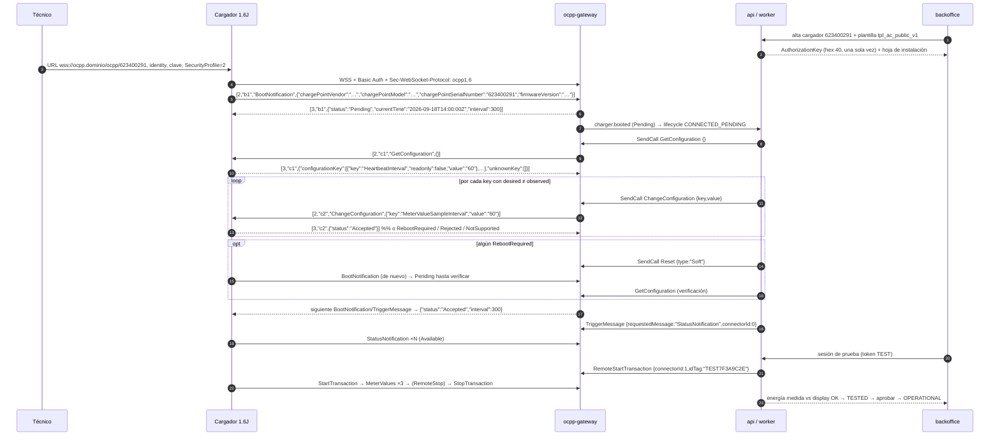
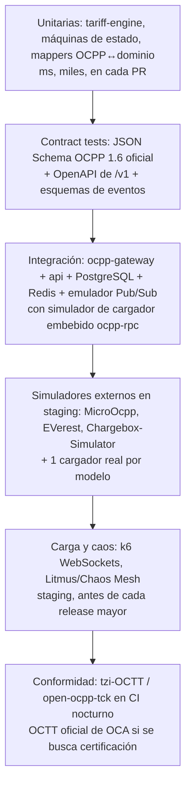
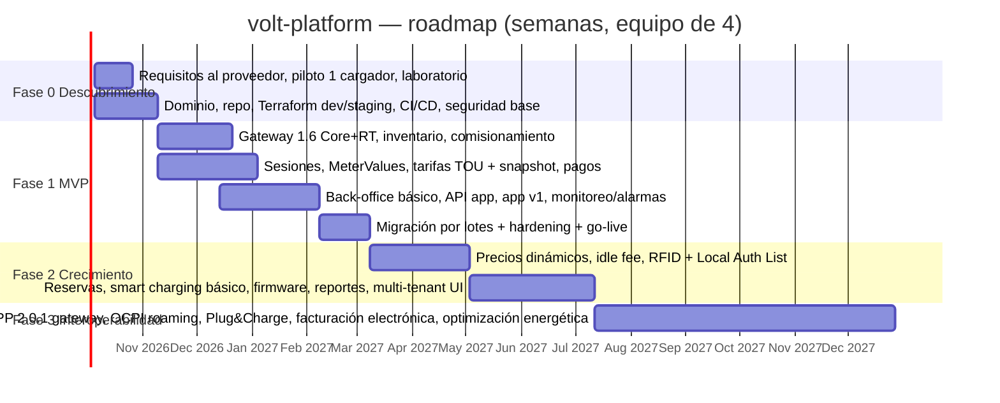

# Capítulo 7 (OPS). Operación diaria, monitoreo, calidad, roadmap y decisiones

**Proyecto:** volt-platform (CSMS propio; los cargadores hablan OCPP 1.6J directo con `ocpp-gateway`)
**Fecha:** 2026-09-18
**Alcance:** cómo se comisiona, se vigila, se opera, se prueba y se hace crecer la plataforma. Usa la nomenclatura de ARQ (`ocpp-gateway` en GKE Autopilot; `api`, `worker` y `backoffice` en Cloud Run; Cloud SQL PostgreSQL; Memorystore Redis; Pub/Sub; Identity Platform) y los módulos M01–M21 de FUN. No repite el plan de traspaso de HW §4 ni el motor de tarifas de TAR: los referencia y los complementa.

> **Nota de verificación (2026-09-18).** Las afirmaciones marcadas **[V]** se contrastaron con fuentes primarias o implementaciones de referencia: enums y esquemas JSON de OCPP 1.6 en `mobilityhouse/ocpp` (`ocpp/v16/enums.py`, `ocpp/v16/schemas/*.json`), comentarios de especificación en `lorenzodonini/ocpp-go` y la errata 1.6 v4.0 (Reset, Pending, UnlockConnector), READMEs de `ocpp-rpc`, MicroOcpp, EVerest `libocpp`/`everest-demo`, OCPP-1.6-Chargebox-Simulator, `tzi-OCTT` y `open-ocpp-tck`, notas de versión de k6 (v1.6.0) y documentación de Google Cloud (Cloud Run WebSockets, ALB, GKE Autopilot *extended duration pods*, sidecar de Managed Service for Prometheus para Cloud Run). Lo referido a OCTT y al programa de certificación de OCA se apoya en extractos de páginas oficiales de OCA (incluido el "OCTT SaaS Agreement v5, abril 2026") y se marca confianza **media-alta**. Las cifras, límites de servicio, precios y detalles de firmware que no pudieron contrastarse quedan marcados **(a confirmar)**.

---

## 0. Resumen ejecutivo y decisiones de este capítulo

| # | Decisión | Resumen |
|---|---|---|
| O1 | **Comisionamiento = máquina de estados persistida, no un checklist en papel.** | `charge_point.lifecycle`: `INVENTORIED → PROVISIONED → CONNECTED_PENDING → CONFIGURED → TESTED → OPERATIONAL` (más `REJECTED`, `MAINTENANCE`, `DECOMMISSIONED`). Cada transición la dispara un mensaje OCPP verificable (`BootNotification`, `GetConfiguration`, `StartTransaction`…) o una acción auditada del back-office. |
| O2 | **`BootNotification → Pending` es la puerta de calidad.** | El cargador se acepta (`Accepted`) sólo cuando la plantilla de configuración se aplicó sin `Rejected`/`NotSupported` inesperados y la deriva es cero. Mientras esté en `Pending` no genera transacciones facturables. |
| O3 | **Observabilidad en tres capas con correlación obligatoria.** | Logs JSON con `chargeBoxId`, `connectorId`, `ocppTransactionId`, `sessionId`, `uniqueId`, `traceId`; métricas Prometheus (Managed Service for Prometheus) → Cloud Monitoring; telemetría OCPP a BigQuery vía Pub/Sub. Grafana opcional encima de Cloud Monitoring. |
| O4 | **SLOs medidos desde el primer día del MVP:** disponibilidad del gateway 99,9 % (medida con el cargador sintético, no con la conectividad del parque), `RemoteStartTransaction` p95 < 5 s desde `POST /v1/sessions` hasta `RemoteStartTransaction.conf` (lo que controla la plataforma; el tiempo hasta `StartTransaction` depende de que el conductor enchufe y se mide aparte como "arranque efectivo"), `StatusNotification → app` p95 < 3 s, liquidación de sesión < 60 s tras `StopTransaction`. | Con *error budget* y política: si se agota, se congelan despliegues no correctivos. |
| O5 | **Runbooks como código:** cada runbook tiene un botón en `backoffice` que ejecuta la secuencia (`TriggerMessage → Reset(Soft) → …`) con confirmación y auditoría; el texto del runbook vive en `docs/runbooks/` en el monorepo. | Evita que la operación dependa de la memoria de una persona. |
| O6 | **Pirámide de pruebas con simuladores reales de cargador en CI**, contract tests contra los JSON Schema oficiales 1.6, carga con k6 (WebSockets) y caos con Litmus/Chaos Mesh en staging. OCTT (OCA) sólo si se quiere la certificación formal del CSMS: es de pago (licencia por juego de casos + suscripción anual [V]) y opcional. | La certificación OCA la piden licitaciones y algunos fabricantes; el conjunto de pruebas abiertas (`tzi-OCTT`, `open-ocpp-tck`, simuladores) cubre la mayor parte del riesgo técnico (estimación; no sustituye a la certificación). |
| O7 | **Despliegue del gateway sin cortar la operación:** `RollingUpdate maxSurge 1 / maxUnavailable 0`, `preStop` que cierra sockets a 50/s con código 1012 (*Service Restart*, registro IANA [V]) empezando por cargadores sin transacción, `terminationGracePeriodSeconds 120`, PDB, y ventana horaria de bajo tráfico. Nunca se despliega el gateway con un `SetChargingProfile`/`UpdateFirmware` masivo en curso. | Detallado en ARQ §4.4; aquí se añaden el procedimiento y los criterios de aborto. |
| O8 | **Decisiones que el usuario debe tomar ya** (§5): país/moneda/impuestos, pasarela, modelo de negocio, versión OCPP objetivo (1.6J con dominio 2.0.1), multi-operador (datos sí, UI no), equipo (4 personas) y hardware. | Sin país no hay región, ni moneda, ni impuestos, ni facturación electrónica: es la decisión número 1. |
| O9 | **Roadmap: Fase 0 (4-6 semanas) → Fase 1 MVP (14-18 semanas) → Fase 2 (16-20 semanas) → Fase 3 (20-28 semanas)** para 3-5 personas. Total 54-72 semanas (≈ 12-17 meses) hasta OCPI/2.0.1; el MVP en producción a las 18-24 semanas. | Con criterios de aceptación medibles por fase (§6). |
| O10 | **App del conductor: React Native/Expo (misma pila TS que el monorepo)**, sin lógica de tarifas, sin secretos, sin acceso a base de datos; sólo consume `/v1` con OIDC y SSE. | Flutter es igual de válido si el equipo móvil ya es Dart; nativo doble (Swift + Kotlin) no se justifica con 3-5 personas. |

---

## 1. Comisionamiento de un cargador en el CSMS propio

### 1.1 Relación con HW §4 y FUN CU-01

HW §4 describe **el traspaso desde la nube del proveedor** (inventario, clasificación A/B/C, laboratorio, lotes, rollback) y FUN CU-01 el caso de uso. Este apartado define **el proceso interno del CSMS** que se ejecuta en cada uno de esos pasos, con estados persistidos y evidencia por mensaje OCPP, para que sirva igual para los cargadores migrados hoy y para los nuevos que se compren mañana.

### 1.2 Máquina de estados de ciclo de vida

```mermaid
stateDiagram-v2
    [*] --> INVENTORIED: alta en back-office (M01)
    INVENTORIED --> PROVISIONED: credenciales generadas (AuthorizationKey o CSR/cert)
    PROVISIONED --> CONNECTED_PENDING: 1er BootNotification -> Pending
    CONNECTED_PENDING --> CONFIGURED: plantilla aplicada, deriva = 0
    CONNECTED_PENDING --> REJECTED: BootNotification -> Rejected (vendor/model no autorizado)
    CONFIGURED --> TESTED: sesión de prueba OK (RemoteStart/MeterValues/RemoteStop)
    TESTED --> OPERATIONAL: operador aprueba; visible en app
    OPERATIONAL --> MAINTENANCE: ChangeAvailability(Inoperative) / ventana
    MAINTENANCE --> OPERATIONAL: ChangeAvailability(Operative) + StatusNotification Available
    OPERATIONAL --> DECOMMISSIONED: baja; credenciales revocadas
    REJECTED --> PROVISIONED: corrección de datos
```



Reglas:

- Sólo `OPERATIONAL` (y `MAINTENANCE` para pruebas del técnico) puede iniciar transacciones facturables a conductores. En `CONNECTED_PENDING`/`CONFIGURED`/`TESTED` el gateway acepta transacciones **únicamente** con `idTag` de la lista de tokens de prueba del tenant (`id_token.token_type = 'TEST'`), y la orden se marca `is_test = true` (sin cobro).
- `BootNotification.conf.status` se decide por el estado: `PROVISIONED`/`CONNECTED_PENDING` → `Pending`; `CONFIGURED` en adelante → `Accepted`; `REJECTED`/`DECOMMISSIONED` → `Rejected` con `interval = 3600`. Coincide con SEG §2.5 (allowlist).
- Cada transición escribe en `assets.charge_point_lifecycle_event` (quién, cuándo, evidencia = `unique_id` del mensaje OCPP o `command.id`).

### 1.3 Paso a paso

| Paso | Qué hace el CSMS | Mensajes / datos | Criterio para avanzar |
|---|---|---|---|
| 1. Alta en inventario | Operations crea sede (M01) y cargador: `charge_box_id` (recomendado = `chargePointSerialNumber`, p. ej. `623400291` como en el PDF §2.1.1), vendor, model, `ocpp_version`, `security_profile` objetivo, plantilla (`config_template_id`), conectores esperados (tipo `TYPE_2`, 7 kW, 32 A, 186–252 V según `connectorResponse` del PDF). | `INSERT assets.charge_point`, `assets.connector` | `charge_box_id` único por tenant; sede con lat/lng; plantilla asignada. |
| 2. Credenciales | **Profile 2:** `AuthorizationKey` aleatoria de 20 bytes (CSPRNG) → se muestra **una vez** en pantalla/QR para el técnico (hex 40 caracteres) y se almacena sólo el hash Argon2id (SEG §2.3); caduca a las 24 h si no hubo conexión (clave de *bootstrap*). Si la instalación se retrasa y la clave caduca, el técnico pide desde `backoffice` una nueva (acción auditada `credential.reissue`); no se prorroga la anterior. **Profile 3:** se registra la huella del certificado de cliente que emitirá CAS tras `SignCertificate`, o la del certificado de fábrica si el fabricante lo aporta. | `assets.charge_point.auth_key_hash`, `client_cert_fingerprint`, `credential_expires_at` | Estado `PROVISIONED`. Hoja de instalación generada (PDF/QR) con URL, identity y clave. |
| 3. Configuración en el cargador | El técnico (o el proveedor, clase B de HW) carga: URL `wss://ocpp.<dominio>/ocpp/623400291`, identity/`chargeBoxId` = `623400291`, usuario Basic Auth = `623400291`, contraseña = `AuthorizationKey`, `SecurityProfile = 2`. Cómo se hace depende del modelo (HW §2.2). | Fuera del CSMS; se registra `url_change_method` en `ops.charge_point_inventory` (HW §4.1) | El cargador abre WebSocket con `Sec-WebSocket-Protocol: ocpp1.6`. |
| 4. Primera conexión y `BootNotification` | Gateway valida TLS + Basic Auth (o mTLS); responde `[3, id, {"status":"Pending","currentTime":"…","interval":300}]`; guarda `chargePointVendor`, `chargePointModel`, `chargePointSerialNumber`, `firmwareVersion`, `iccid`, `imsi`, `meterType`, `meterSerialNumber` y los compara con el inventario. | `BootNotification.req/conf` | Vendor/model coinciden (si no: `Rejected` + alarma `INVENTORY_MISMATCH`). Estado `CONNECTED_PENDING`. |
| 5. `GetConfiguration` completo | En `Pending` el cargador acepta comandos del CSMS [V]: la spec 1.6 indica que el canal no debe cerrarse y que el Central System puede enviar peticiones para leer o cambiar la configuración; el cargador **no** inicia otras peticiones (salvo `BootNotification` o lo pedido por `TriggerMessage`) y `RemoteStart/StopTransaction` no están permitidos en ese estado. Se envía `GetConfiguration` **sin `key`** (devuelve todas) respetando `GetConfigurationMaxKeys` si el firmware pagina; se persiste `observed_value` y `readonly` por key en `assets.charge_point_config`. Se leen `SupportedFeatureProfiles` y `NumberOfConnectors` (crea conectores si faltan). | `GetConfiguration.req/conf` (`configurationKey[]`, `unknownKey[]`) | Snapshot completo guardado; `SupportedFeatureProfiles` ⊇ `Core`. |
| 6. Aplicar plantilla por modelo | Para cada key de la plantilla con `desired ≠ observed`: `ChangeConfiguration`. Resultados: `Accepted`, `RebootRequired` (acumula), `Rejected` (registrar, no bloquear si la key es opcional), `NotSupported` (registrar como *hallazgo de hardware*). Si hubo `RebootRequired` → `Reset(Soft)` → nuevo `BootNotification` → repetir `GetConfiguration` para verificar. | `ChangeConfiguration.req/conf`, `Reset.req/conf` | Deriva = 0 en keys obligatorias; keys `NotSupported` documentadas. Estado `CONFIGURED`; a partir de aquí `BootNotification → Accepted`. |
| 7. Pruebas de sesión | `TriggerMessage(StatusNotification, connectorId=0..N)` → todos `Available`. Sesión de prueba con token `TEST`: `RemoteStartTransaction` → `StartTransaction` → ≥ 3 `MeterValues` → `RemoteStopTransaction` → `StopTransaction`. Se compara `meterStop − meterStart` con el display del cargador (±1 %). Opcional: `UnlockConnector`, `ChangeAvailability`, `Reset(Hard)`. | Ver checklist HW §4.3 (ítems 6, 8, 9, 10, 12–15) | Todos los ítems críticos OK. Estado `TESTED`. |
| 8. Paso a operativo | Operador con rol `Operations` aprueba: `visible_in_app = true`, tarifa asignada (heredada de sede o override), horario, `OPERATIONAL`. Se rota la clave de *bootstrap* automáticamente (SEG §2.3). Se notifica al proveedor la baja en su nube (HW §4.4). | `UPDATE charge_point`, evento `charger.operational` | Aparece en `GET /v1/locations` con estado en vivo. |

### 1.4 Plantilla de configuración por modelo (estado deseado)

La plantilla base es la de FUN §5 (`AC-7kW-publico-v1`) y ARQ §2.5. Este capítulo fija **cómo se aplica y se verifica**, y añade las variantes por tipo de cargador. Las keys son las estándar de OCPP 1.6 [V] (todas figuran en la lista de keys Core/Security Whitepaper y en el enum `ConfigurationKey` de `mobilityhouse/ocpp`); los measurands `SoC`, `Power.Offered` y `Current.Offered` existen en el enum `Measurand` 1.6 [V].

```json
{
  "id": "tpl_ac_public_v1",
  "applies_to": { "vendor": "*", "model": "*", "power_type": "AC_1_PHASE|AC_3_PHASE" },
  "keys": {
    "HeartbeatInterval": "300",
    "WebSocketPingInterval": "60",
    "MeterValueSampleInterval": "60",
    "MeterValuesSampledData": "Energy.Active.Import.Register,Power.Active.Import,Voltage,Current.Import,SoC",
    "ClockAlignedDataInterval": "900",
    "MeterValuesAlignedData": "Energy.Active.Import.Register",
    "StopTxnSampledData": "Energy.Active.Import.Register,Power.Active.Import",
    "ConnectionTimeOut": "120",
    "AuthorizeRemoteTxRequests": "false",
    "LocalAuthListEnabled": "false",
    "LocalAuthorizeOffline": "true",
    "LocalPreAuthorize": "false",
    "AllowOfflineTxForUnknownId": "false",
    "AuthorizationCacheEnabled": "true",
    "StopTransactionOnEVSideDisconnect": "true",
    "StopTransactionOnInvalidId": "true",
    "UnlockConnectorOnEVSideDisconnect": "true",
    "TransactionMessageAttempts": "5",
    "TransactionMessageRetryInterval": "60",
    "MinimumStatusDuration": "3",
    "ResetRetries": "2"
  },
  "security_keys": { "SecurityProfile": "2", "CpoName": "VOLT" },
  "optional_keys": ["ClockAlignedDataInterval", "MinimumStatusDuration", "WebSocketPingInterval"],
  "optional_measurands": ["SoC", "Power.Offered"],
  "variants": {
    "dc_fast": { "MeterValueSampleInterval": "15", "MeterValuesSampledData": "Energy.Active.Import.Register,Power.Active.Import,Voltage,Current.Import,SoC,Power.Offered" },
    "private_fleet": { "LocalAuthListEnabled": "true", "LocalPreAuthorize": "true", "AllowOfflineTxForUnknownId": "false" }
  },
  "verify_after_apply": true,
  "reboot_policy": "SoftReset_when_RebootRequired_and_no_active_transaction",
  "drift_check_cron": "0 4 * * *"
}
```

Notas de aplicación:

- `MeterValuesSampledData` es una CSL: si el cargador no soporta `SoC` (AC casi nunca lo tiene) el firmware puede responder `Rejected` a **toda** la key (comportamiento dependiente del firmware, a confirmar por modelo). Estrategia: intentar la lista completa; si `Rejected`, reintentar sin las medidas marcadas en `optional_measurands` y anotar en `assets.charge_point_config.last_result` qué measurand faltó. `optional_keys` lista las keys cuya respuesta `NotSupported`/`Rejected` no bloquea el paso a `CONFIGURED` (`MinimumStatusDuration` y `WebSocketPingInterval` son opcionales en la spec 1.6; `ClockAlignedDataInterval` es Core pero se tolera su ausencia y se pierde el corte exacto de franja). Conflicto a resolver con el usuario: SEG §2.5 recomienda `AuthorizeRemoteTxRequests=true` y `AuthorizationCacheEnabled=false` (más seguro); FUN/TAR/HW recomiendan `false`/`true` (menos fricción). Recomendación OPS: `AuthorizeRemoteTxRequests=false` en MVP (el `idTag` virtual de un solo uso ya lo valida el CSMS en `StartTransaction`), y `AuthorizationCacheEnabled=true` sólo si el tenant usa RFID offline; parametrizable por plantilla.
- `LocalAuthListEnabled=false` en MVP; se activa en Fase 2 junto con `SendLocalList` (FUN M03).
- `WebSocketPingInterval=60` mantiene vivo el NAT de operadores móviles. **Atención:** el *backend service timeout* del External ALB es de 30 s por defecto y cierra los WebSockets **inactivos** al vencer [V]; por tanto el ping de 60 s sólo sirve si `timeoutSec` del backend se ha subido por encima (ARQ §3.1 lo fija en un valor mayor; verificar en Terraform). El gateway hace además ping propio (cada 30 s) para no depender de que el firmware respete la key. Los WebSockets **activos** los cierra el ALB a las 24 h [V]: cada cargador reconectará una vez al día; es esperado, no es incidente (§3.3, §3.9).
- `HeartbeatInterval` se fija también con `BootNotification.conf.interval`; se persiste el valor efectivo para calcular el umbral de offline (`3 × HeartbeatInterval`, FUN CU-05).
- **Detección de deriva:** job diario (`worker`, Cloud Scheduler) que envía `GetConfiguration` a cada cargador `OPERATIONAL` en ventana de baja carga, con ritmo ≤ 20 cargadores/s; diferencias → alarma `CONFIG_DRIFT` (media) y opción "re-aplicar plantilla" en `backoffice`.

### 1.5 DDL complementario (esquema `assets`, PostgreSQL)

```sql
CREATE TYPE assets.lifecycle AS ENUM ('INVENTORIED','PROVISIONED','CONNECTED_PENDING','CONFIGURED',
  'TESTED','OPERATIONAL','MAINTENANCE','REJECTED','DECOMMISSIONED');

ALTER TABLE assets.charge_point
  ADD COLUMN lifecycle assets.lifecycle NOT NULL DEFAULT 'INVENTORIED',
  ADD COLUMN visible_in_app boolean NOT NULL DEFAULT false,
  ADD COLUMN credential_expires_at timestamptz,            -- clave de bootstrap: 24 h
  ADD COLUMN heartbeat_interval_s integer NOT NULL DEFAULT 300,
  ADD COLUMN boot_vendor text, ADD COLUMN boot_model text,  -- lo que dijo BootNotification (vs inventario)
  ADD COLUMN meter_type text, ADD COLUMN meter_serial_number text;

CREATE TABLE assets.charge_point_lifecycle_event (
  id            bigserial PRIMARY KEY,
  charge_point_id uuid NOT NULL REFERENCES assets.charge_point(id),
  from_state    assets.lifecycle, to_state assets.lifecycle NOT NULL,
  actor         text NOT NULL,                              -- user id o 'system:ocpp-gateway'
  evidence      jsonb,                                      -- {"unique_id":"…","action":"BootNotification","command_id":"…"}
  at            timestamptz NOT NULL DEFAULT now()
);

CREATE TABLE assets.config_template (
  id text PRIMARY KEY, tenant_id text NOT NULL, name text NOT NULL, version int NOT NULL,
  applies_to jsonb NOT NULL, keys jsonb NOT NULL, security_keys jsonb, optional_keys text[] DEFAULT '{}',
  optional_measurands text[] DEFAULT '{}',
  variants jsonb, reboot_policy text NOT NULL DEFAULT 'SoftReset_when_RebootRequired_and_no_active_transaction',
  created_by text NOT NULL, created_at timestamptz NOT NULL DEFAULT now()
);

CREATE TABLE assets.commissioning_check (                    -- resultado de cada ítem de la checklist HW §4.3
  charge_point_id uuid NOT NULL REFERENCES assets.charge_point(id),
  check_code text NOT NULL,                                  -- 'CONNECT','BOOT','HEARTBEAT','GETCONFIG','CHANGECONFIG','STATUS','REMOTE_START',…
  result text NOT NULL CHECK (result IN ('OK','FAIL','SKIPPED','NOT_SUPPORTED')),
  evidence jsonb, checked_by text, checked_at timestamptz NOT NULL DEFAULT now(),
  PRIMARY KEY (charge_point_id, check_code, checked_at)
);
```

### 1.6 Secuencia de comisionamiento (mensajes reales)



### 1.7 Checklist de salida del comisionamiento

- [ ] `BootNotification` con vendor/model/serial iguales al inventario; `firmwareVersion` registrada y en la lista de versiones autorizadas (SEG §2.4 `FirmwareUpdated`).
- [ ] `GetConfiguration` completo persistido; `SupportedFeatureProfiles` registrado; conectores creados = `NumberOfConnectors`.
- [ ] Plantilla aplicada: 0 keys obligatorias en `Rejected`; keys `NotSupported` documentadas en la matriz de conformidad por modelo (`docs/ocpp/`).
- [ ] `Heartbeat` recibido a `interval ± 10 %`; desfase de reloj < 60 s (`Heartbeat.conf.currentTime` aplicado).
- [ ] Sesión de prueba: `meterStop − meterStart` coincide con display ±1 %; `MeterValues` con los measurands esperados y `Energy.Active.Import.Register` monótono.
- [ ] `Reset(Soft)` reconecta en < 3 min (umbral operativo propio; el tiempo real depende del modelo, a confirmar); `UnlockConnector` responde `Unlocked` o `NotSupported` documentado; `ChangeAvailability` `Accepted`/`Scheduled`.
- [ ] Clave de *bootstrap* rotada; `security_event` sin `AuthFailed` en la última hora.
- [ ] Tarifa efectiva visible en `GET /v1/evses/{evseId}` y en la app; QR impreso con el `evseId` (equivalente a `connectorCode` del PDF, p. ej. `6234002911`).

---

## 2. Monitoreo y observabilidad

### 2.1 Arquitectura de observabilidad en Google Cloud

| Capa | Herramienta | Qué contiene | Decisión |
|---|---|---|---|
| Logs | Cloud Logging (JSON estructurado desde `ocpp-gateway`, `api`, `worker`) | Un registro por mensaje OCPP relevante (no `Heartbeat` ni `MeterValues` completos: van a BigQuery), comandos, errores, auditoría técnica | Exclusiones de logs ruidosos desde el día 1 (ARQ §3.5); retención 30 días en Logging, 400 días en bucket de auditoría (SEG S8). |
| Métricas | Google Cloud Managed Service for Prometheus (recolección gestionada en GKE Autopilot; en Cloud Run vía el **sidecar de Managed Service for Prometheus para Cloud Run** — un OpenTelemetry Collector empaquetado por Google, `run-gmp-sidecar`, configurado con el recurso `RunMonitoring` [V]) → Cloud Monitoring (PromQL) | Contadores/histogramas de la plataforma + métricas de sistema (GKE, Cloud Run, Cloud SQL, Redis, Pub/Sub, ALB) | Un solo backend de métricas; Grafana (Cloud o autoalojado) opcional como front, usando el *data source* Google Cloud Monitoring, que soporta alertas y consultas de SLO/error budget [V]. |
| Trazas | Cloud Trace vía OpenTelemetry | `POST /v1/sessions` → gRPC `SendCall` → CALL/CALLRESULT → `StartTransaction` | `traceId` propagado en el envelope de eventos (ARQ §2.2) y en `ops.command`. |
| Telemetría OCPP | Pub/Sub → BigQuery (suscripción nativa), tablas particionadas por día y *clustered* por `charge_box_id` | `MeterValues`, `StatusNotification`, mensajes crudos (`ops.ocpp_message_log` exportado) | Consultas de negocio (kWh/h, utilización, fallos por modelo) y forense. |
| Estado en vivo | Redis (`cs:conn:*`, `cs:last_seen:*`, estado de conectores) | Fuente del dashboard "ahora" del `backoffice` y de `/v1/locations` | Cloud Monitoring no es para "qué cargador está online ahora": eso lo sirve `api` desde Redis. |
| Uptime | Cloud Monitoring *uptime checks* + *synthetic monitor* | `GET /healthz` del gateway vía ALB, `GET /v1/health`, y un **cargador sintético** (simulador `ocpp-rpc` en Cloud Run job) que hace boot/heartbeat/remote start cada 5 min | Detecta roturas de extremo a extremo aunque los pods estén sanos. |

### 2.2 Métricas (nombres Prometheus propuestos)

| Métrica | Tipo | Etiquetas | Fuente | Uso |
|---|---|---|---|---|
| `ocpp_connections` | gauge | `pod`, `protocol`, `security_profile` | gateway | Conexiones abiertas; HPA por `ocpp_connections` objetivo 1.000/pod (ARQ §4.5). |
| `chargers_online` / `chargers_offline` | gauge | `tenant`, `site` | `worker` (desde Redis `last_seen`) | Cargadores `OPERATIONAL` con socket vivo y `last_seen < 2×HeartbeatInterval`. |
| `connector_status_total` | gauge | `status` (Available…Faulted, Offline), `site` | `api`/Redis | Distribución de estados; base de "disponibilidad de sede". |
| `ocpp_messages_total` | counter | `action`, `direction` (cp→cs, cs→cp), `result` (ok, callerror, schema_error) | gateway | Mensajes OCPP/s; errores de esquema (`FormationViolation`, `PropertyConstraintViolation`). |
| `ocpp_schema_errors_total` | counter | `action`, `vendor`, `model` | gateway | Detecta firmware que rompe el esquema (por modelo). |
| `ocpp_call_latency_seconds` | histogram | `action` | gateway | Tiempo CALL→CALLRESULT hacia el cargador (`RemoteStartTransaction`, `ChangeConfiguration`…). |
| `ocpp_pending_calls` | gauge | `pod` | gateway | Cola de salida por conexión; > 10 sostenido = cargador lento o colgado. |
| `ocpp_reconnects_total` | counter | `reason` (close_1012, ping_timeout, tcp_reset, evicted, lb_24h) | gateway | Tormentas de reconexión. `lb_24h` = cierre del ALB a las 24 h de socket activo [V]: es ruido de fondo esperado (≈ 1 reconexión/cargador/día) y se excluye de la alarma. |
| `boot_notifications_total` | counter | `status` (Accepted, Pending, Rejected), `vendor` | gateway | Bucles de arranque (≥ 3/10 min por cargador = alarma). |
| `remote_start_total` | counter | `outcome` (accepted, rejected, timeout, offline, start_tx_received, start_tx_timeout) | `api` | **Tasa de éxito de RemoteStart** = `start_tx_received / total`. |
| `remote_start_ack_seconds` | histogram | — | `api` | Desde `POST /v1/sessions` hasta `RemoteStartTransaction.conf` (`Accepted`/`Rejected`). Es el **SLO p95 < 5 s** (O4, §2.4, §8.2): sólo mide lo que controla la plataforma (API → gRPC → socket → cargador → respuesta). |
| `remote_start_e2e_seconds` | histogram | — | `api` | Desde `RemoteStartTransaction.conf Accepted` hasta `StartTransaction.req`. Informativa: incluye el tiempo hasta que el conductor enchufa (hasta `ConnectionTimeOut`); se usa para el SLI "arranque efectivo" (% que llega a `StartTransaction`), no para latencia. |
| `sessions_active` | gauge | `tenant`, `site` | `api` | Sesiones `ACTIVE`. |
| `sessions_ended_total` | counter | `stop_reason` (Remote, Local, EVDisconnected, PowerLoss, Reboot, DeAuthorized, …), `settled` | `worker` | Motivos de fin; `PowerLoss`/`Reboot` altos = problema eléctrico o firmware. |
| `energy_delivered_wh_total` | counter | `site`, `connector_type` | `worker` | kWh/h por sede (business KPI). |
| `meter_values_total` / `meter_value_gap_seconds` | counter / gauge | `charge_box_id` (cardinalidad: sólo en BigQuery; en Prometheus por `site`) | gateway | Sesión sin `MeterValues` > 3 × `MeterValueSampleInterval`. |
| `command_total` | counter | `action`, `state` (ACCEPTED, REJECTED, ERROR, TIMEOUT) | `api` | Latencia y fiabilidad de comandos del back-office. |
| `payment_total` | counter | `stage` (preauth, capture, refund), `outcome` (ok, declined, error) | `api`/`worker` | Pagos fallidos; conciliación. |
| `settlement_lag_seconds` | histogram | — | `worker` | `StopTransaction` → sesión `SETTLED` (SLO < 60 s). |
| `settlement_discrepancy_total` | counter | `kind` (energy_mismatch, capture_gt_preauth, missing_stop) | `worker` | Discrepancias de liquidación (ver §2.3). |
| `pubsub_subscription_oldest_unacked_message_age` (nativa) | gauge | `subscription` | Pub/Sub | Colas atrasadas (`sse-fanout`, `notifications`, `bigquery-export`). |
| `outbox_unpublished` | gauge | — | `worker` | Filas de `ops.event_outbox` con `published_at IS NULL`. |
| `certificate_expiry_days` | gauge | `kind` (csms_server, cp_client, firmware_signing, root) | `worker` | Certificados por vencer (Profile 3 y raíz instalada en cargadores). |
| `db_pool_in_use`, `redis_latency_seconds`, `grpc_sendcall_errors_total{code}` | varios | — | todos | Salud de dependencias. |

### 2.3 Alarmas (catálogo operativo)

Complementa FUN M10 (que fija el catálogo funcional). Severidades: **P1** (página on-call 24×7), **P2** (aviso en horario extendido, respuesta < 2 h), **P3** (ticket, siguiente día hábil).

| Alarma | Regla (ejemplo PromQL/lógica) | Sev. | Acción automática |
|---|---|---|---|
| Cargador OFFLINE | `OPERATIONAL` sin socket ni `Heartbeat` > `offline_threshold` (por defecto `3 × HeartbeatInterval` = 15 min); P1 si > 30 % de una sede o > 5 % del parque en 10 min (fallo de plataforma/red) | P2 / P1 | Runbook RB-01; si es masivo, ver "tormenta" (§3.9). |
| Conector `Faulted` con `errorCode` | `StatusNotification.status = Faulted` y `errorCode ∈ {GroundFailure, OverCurrentFailure, OverVoltage, UnderVoltage, PowerSwitchFailure, PowerMeterFailure, HighTemperature, InternalError, ConnectorLockFailure, EVCommunicationError, ReaderFailure, ResetFailure, WeakSignal, LocalListConflict, OtherError}` (los 15 valores de `ChargePointErrorCode` 1.6 distintos de `NoError` [V]) | P2 (P1 si `GroundFailure`/`HighTemperature` o si afecta a > 50 % de conectores de una sede) | Runbook RB-06; `GroundFailure`/`HighTemperature`: no auto-reset, `ChangeAvailability(Inoperative)` y aviso a campo. |
| Sesión sin `MeterValues` | `ACTIVE` y `now − last_meter_value > 3 × MeterValueSampleInterval` y cargador online | P3 (P2 si > 10 sesiones) | `TriggerMessage(MeterValues, connectorId)`; si no responde, marcar `telemetry_stale`, la app muestra "última lectura hace N min". |
| Conector atascado en `Preparing`/`Finishing` | `Preparing` > `ConnectionTimeOut + 120 s` sin `StartTransaction`; `Finishing` > 10 min sin `Available` | P3 | `TriggerMessage(StatusNotification)`; si persiste, RB-02. |
| Bucle de arranque | `increase(boot_notifications_total{charge_box_id}[10m]) >= 3` | P2 | Bloquear `RemoteStartTransaction` en ese cargador; RB-06. |
| Tasa de éxito de RemoteStart baja | `rate(remote_start_total{outcome="start_tx_received"}[15m]) / rate(remote_start_total[15m]) < 0.85` (parque) o < 0,5 en una sede | P1 / P2 | RB-03. |
| Latencia de comandos | `histogram_quantile(0.95, ocpp_call_latency_seconds{action="RemoteStartTransaction"}) > 5` durante 10 min | P2 | Revisar pods (CPU, `ocpp_pending_calls`), red móvil del proveedor. |
| Errores de esquema | `rate(ocpp_schema_errors_total[5m]) > 1` por vendor/model | P3 | Abrir ticket de conformidad de firmware; comparar con matriz por modelo. |
| Cola atrasada | `pubsub oldest_unacked_message_age > 120 s` en `sse-fanout`/`notifications`; `outbox_unpublished > 1000` | P2 | Escalar `worker` (min instances), revisar errores del consumidor. |
| Pagos fallidos | `rate(payment_total{outcome!="ok"}[30m]) / rate(payment_total[30m]) > 0.1` o 3 fallos consecutivos del PSP | P1 | RB-05; modo degradado: permitir sesiones sólo a usuarios con wallet/pospago (parámetro de tenant). |
| Discrepancia de liquidación | `settlement_discrepancy_total` > 0 en la última hora: energía de `StopTransaction` ≠ último `MeterValues` ± 2 %; captura > preautorización; `StopTransaction` ausente > `orphan_timeout_h` | P2 | Sesión `disputed`, no capturar automáticamente (SEG §2.5.7); RB-05. |
| Certificado por vencer | `certificate_expiry_days < 30` (P3), `< 7` (P1) | P3 / P1 | Profile 3: `ExtendedTriggerMessage(SignChargePointCertificate)`; servidor: Certificate Manager renueva; raíz: plan de rotación secuencial (SEG §2.2). |
| Evento de seguridad crítico | `SecurityEventNotification.type ∈ {TamperDetectionActivated, SecurityLogWasCleared, InvalidFirmwareSignature, …}` o del gateway (`DuplicateConnection`, `ProfileDowngradeAttempt`) | P1 | Según SEG §2.4. |
| Gateway saturado | `ocpp_connections / pod > 1500` o CPU > 80 % 10 min o `rate(ocpp_reconnects_total{reason!="lb_24h"}[1m])` > 500/min | P1 | HPA; si la tormenta persiste, RB-09. |
| Base de datos | Cloud SQL CPU > 80 % 15 min, replicación/failover, `db_pool_in_use / max > 0.9`, PITR desactivado | P1 | Runbook de Cloud SQL (ARQ §8.1). |
| Redis | latencia p99 > 50 ms o no disponible | P1 | Modo degradado: comandos fallan con 503, mediciones siguen (ARQ §8.1). |
| Disponibilidad de sede | `% conectores Available/Charging < 50 %` en horario de apertura | P2 | Revisión operativa; comunicar en app ("sede con incidencias"). |
| Desfase de reloj | `abs(cp_timestamp − server_now) > 60 s` en `Heartbeat`/`MeterValues` | P3 | El `Heartbeat.conf.currentTime` debería corregirlo; si no, `Reset(Soft)` fuera de transacción; afecta tarifas por franja. |

Silencios: ventana de mantenimiento por sede/cargador (FUN M10) silencia OFFLINE/Faulted del objetivo; el comisionamiento (`lifecycle ≠ OPERATIONAL`) no genera alarmas de negocio.

### 2.4 SLOs y política de error budget

| SLI | Medición | SLO (MVP) | SLO (Fase 2) |
|---|---|---|---|
| Disponibilidad del gateway | % de minutos en que el cargador sintético (desde fuera, vía ALB) conecta, completa `BootNotification`+`Heartbeat` y recibe un `TriggerMessage` de vuelta. **No** se mezcla con la conectividad del parque (que depende de la red móvil y de los cargadores, y se sigue como KPI "cargadores online" en §8.2): si se mezclaran, un corte del operador móvil consumiría el presupuesto de error de la plataforma. | 99,9 % mensual (≈ 43 min de presupuesto en 30 días) | 99,95 % |
| Latencia de RemoteStart | p95 de `remote_start_ack_seconds` (`POST /v1/sessions` → `RemoteStartTransaction.conf`) | < 5 s | < 3 s |
| Arranque efectivo | % de `RemoteStartTransaction Accepted` que reciben `StartTransaction` en < `ConnectionTimeOut` (excluye cancelaciones del usuario) | ≥ 90 % | ≥ 95 % |
| Frescura de estado en la app | p95 `StatusNotification` recibido → evento SSE entregado | < 3 s | < 2 s |
| Liquidación | p95 `settlement_lag_seconds` | < 60 s | < 30 s |
| Exactitud de cobro | % de sesiones sin discrepancia (`settlement_discrepancy_total = 0`) | ≥ 99,5 % | ≥ 99,9 % |
| API pública | disponibilidad de `/v1` (5xx) y p95 < 500 ms | 99,9 % | 99,95 % |

Política: SLOs definidos en Cloud Monitoring (servicio + SLI por métrica o *request-based*), con *burn-rate alerts* (ventanas 1 h/6 h y 6 h/3 d). Si el error budget mensual del gateway queda < 20 %, se congelan despliegues no correctivos hasta el mes siguiente; se revisa en el post-mortem semanal.

### 2.5 Dashboards

1. **"Ahora" (operación, `backoffice` + Cloud Monitoring):** mapa y tabla de cargadores por estado (Online/Offline, conectores por `ChargePointStatus`), sesiones activas y kWh/h, alarmas abiertas por severidad, comandos en curso.
2. **"Gateway" (SRE):** `ocpp_connections` por pod, mensajes/s por `action`, `ocpp_call_latency_seconds` p50/p95/p99, reconexiones/min, `boot_notifications_total`, errores de esquema por modelo, CPU/memoria por pod, drenados en curso.
3. **"Sesiones y dinero":** embudo `POST /v1/sessions → Accepted → StartTransaction → StopTransaction → SETTLED`, tasa de éxito de RemoteStart, motivos de fin, ingresos/kWh por sede y por franja horaria (BigQuery), pagos fallidos, discrepancias.
4. **"Dependencias":** Cloud SQL (CPU, conexiones, réplica, PITR), Redis (latencia, memoria), Pub/Sub (backlog por suscripción), Cloud Run (instancias, 5xx, latencia), ALB (5xx, latencia de backend, conexiones WebSocket).
5. **"Calidad por modelo de cargador":** `NotSupported` por key, errores de esquema, `PowerLoss`/`Reboot`, bucles de arranque, discrepancias de energía — por `vendor/model/firmwareVersion`. Es la base de la matriz de conformidad y de las reclamaciones al proveedor.

### 2.6 On-call y escalamiento

| Nivel | Quién | Horario | Alcance |
|---|---|---|---|
| L1 Soporte | Agente de soporte (rol `Support Agent`) | Horario de operación de las sedes | Conductores: sesión no arranca/no termina, cobro; ejecuta RB-02/03/04 desde `backoffice` (Unlock, RemoteStop, TriggerMessage, reembolso hasta límite). |
| L2 Operaciones | Técnico de operación (`Operations`/`Technician`) | Extendido (07:00–23:00) + guardia | Cargadores offline/Faulted, Reset, ChangeAvailability, ChangeConfiguration, visita a campo, proveedor. |
| L3 Ingeniería (SRE/backend) | Desarrollador de guardia (rotación semanal entre 2-3 personas) | 24×7 para P1 | Plataforma: gateway, base de datos, Redis, despliegues, pagos, incidentes de seguridad. |
| Proveedor / fabricante | Contacto de soporte acordado en el contrato (HW §3) | Según SLA del proveedor | Firmware, hardware, garantía. |

Canales: Cloud Monitoring → PagerDuty/Opsgenie (P1) y Slack/Google Chat (P2/P3); *runbook URL* en cada política de alerta; post-mortem sin culpa para todo P1 en < 5 días hábiles.

### 2.7 Logs estructurados y correlación

Formato JSON (Cloud Logging lo indexa; `severity`, `logging.googleapis.com/trace` y `spanId` habilitan la vista Logs ↔ Trace):

```json
{
  "severity": "INFO",
  "time": "2026-09-18T14:24:05.512Z",
  "service": "ocpp-gateway",
  "pod": "gw-7c9f",
  "event": "ocpp.message",
  "direction": "cp_to_cs",
  "messageType": 2,
  "uniqueId": "c4",
  "action": "MeterValues",
  "chargeBoxId": "623400291",
  "connectorId": 1,
  "ocppTransactionId": 4711,
  "sessionId": "6f1d0c2e-8f0e-4c9a-9b7e-2f5a1d3c4b5a",
  "tenantId": "t_volt",
  "payloadBytes": 812,
  "durationMs": 7,
  "logging.googleapis.com/trace": "projects/volt-prod/traces/4bf92f3577b34da6a3ce929d0e0e4736",
  "logging.googleapis.com/spanId": "00f067aa0ba902b7"
}
```

Reglas:

- **Campos obligatorios** en cualquier línea que toque un cargador: `chargeBoxId`; si hay transacción: `ocppTransactionId` y `sessionId`; si es comando: `commandId` y `uniqueId`. Se propagan por `AsyncLocalStorage` (Node) desde el handler del mensaje.
- **Nunca** registrar `Authorization` (Basic Auth), `AuthorizationKey`, tokens OIDC, ni datos de tarjeta (SEG §2.5.10). `idTag` sí (es un identificador operativo), pero con retención de 30 días.
- Los `MeterValues` y `Heartbeat` se registran como una línea resumida (sin payload) y el payload completo va a BigQuery.
- Vista "línea de tiempo del cargador" en `backoffice`: une `ops.ocpp_message_log`, `ops.command`, `ops.alarm`, `assets.charge_point_lifecycle_event` y `security_event` por `charge_box_id` en una sola cronología (es la bitácora por cargador de §3.10).
- Consulta típica en Logs Explorer: `jsonPayload.chargeBoxId="623400291" AND jsonPayload.ocppTransactionId=4711` → toda la sesión en orden.

---

## 3. Operación y soporte

### 3.1 Principios

1. **Todo comando remoto es un registro `ops.command`** (ARQ §4.3) con actor, motivo, resultado y `unique_id`; se ejecuta desde `backoffice` con RBAC (FUN M13) y confirmación en dos pasos para `Reset(Hard)`, `ChangeConfiguration`, `UpdateFirmware`, `ChangeAvailability(Inoperative)` con sesión activa.
2. **Diagnóstico antes de acción:** siempre `TriggerMessage` (barato y seguro) antes de `Reset`; `Reset(Soft)` antes de `Reset(Hard)`; nunca `Reset` con transacción activa salvo emergencia (con `Soft` el cargador debe enviar `StopTransaction reason=SoftReset` antes de reiniciar; con `Hard` no está obligado a cerrar la transacción ordenadamente y, "si es posible", envía el `StopTransaction reason=HardReset` tras el nuevo `BootNotification` [V]; en ambos casos la sesión se liquida por lo medido).
3. **Escalado al proveedor con evidencia:** exportar la cronología del cargador (±30 min de mensajes OCPP, `GetDiagnostics`) y adjuntarla al ticket.

### 3.2 Semántica de los comandos (verificada en enums 1.6)

| Comando | Campos | Respuestas posibles | Precauciones |
|---|---|---|---|
| `Reset` | `type: Soft | Hard` | `Accepted | Rejected` | Según la spec 1.6 (errata v4.0) [V]: `Soft` = "detener las transacciones en curso ordenadamente y enviar `StopTransaction.req` por cada una" y reiniciar el software; `Hard` = "reiniciar (todo) el hardware; no se exige detener ordenadamente la transacción en curso; si es posible, el cargador envía `StopTransaction.req` de las transacciones previas tras reiniciar y ser aceptado por `BootNotification.conf`". Por eso `Hard` es la última opción: puede dejar la sesión sin `StopTransaction` (cierre por huérfana, §3.6). Esperar `BootNotification` en < 3 min (umbral propio; a confirmar por modelo); si no, alarma. Key `ResetRetries` [V]. |
| `UnlockConnector` | `connectorId` | `Unlocked | UnlockFailed | NotSupported` [V] | Si hay transacción activa en ese conector, la spec exige que el cargador **la termine primero** (`StopTransaction reason=UnlockCommand` [V]); la spec también indica que no debe usarse como forma de parar una carga en remoto: parar siempre con `RemoteStopTransaction` y desbloquear después (RB-02). Confirmar con el conductor. |
| `ChangeAvailability` | `connectorId` (0 = todo el cargador), `type: Inoperative | Operative` | `Accepted | Rejected | Scheduled` [V] | `Scheduled` = se aplicará al terminar la transacción en curso y el cargador avisará con `StatusNotification` [V]. El estado de disponibilidad es un atributo persistente del conector (debería conservarse tras reinicio; comportamiento a confirmar por modelo en el laboratorio, pregunta 5 de §9.2). Usar para ventanas de mantenimiento. |
| `TriggerMessage` | `requestedMessage: BootNotification | DiagnosticsStatusNotification | FirmwareStatusNotification | Heartbeat | MeterValues | StatusNotification` [V], `connectorId` opcional | `Accepted | Rejected | NotImplemented` [V] | Perfil RemoteTrigger (opcional en 1.6 y también opcional dentro del Core del programa de certificación post-oct-2025: verificar en `SupportedFeatureProfiles`). Con Security Whitepaper: `ExtendedTriggerMessage` añade `LogStatusNotification` y `SignChargePointCertificate` [V]. |
| `GetDiagnostics` | `location` (URI a la que el cargador **sube** el archivo), `startTime`, `stopTime`, `retries`, `retryInterval` | `fileName` opcional; luego `DiagnosticsStatusNotification: Idle | Uploading | Uploaded | UploadFailed` [V] | La spec sólo fija que `location` es una URI; el protocolo de subida lo decide el firmware (habitualmente FTP/FTPS, a veces HTTP/HTTPS PUT/POST; a confirmar por modelo). Preparar un receptor (Cloud Run `diag-upload` con URL firmada a GCS o un servidor FTPS pequeño). Preguntar al proveedor el protocolo (FUN §10.2). |
| `UpdateFirmware` | `location` (URI de descarga), `retrieveDate`, `retries`, `retryInterval` | luego `FirmwareStatusNotification: Downloaded | DownloadFailed | Downloading | Idle | InstallationFailed | Installing | Installed` (+ `DownloadScheduled`, `DownloadPaused`, `InstallRebooting`, `InstallScheduled`, `InstallVerificationFailed`, `InvalidSignature`, `SignatureVerified` con la extensión de seguridad) [V] | Sólo en ventana de mantenimiento; `ChangeAvailability(Inoperative)` antes; canary 1 → 10 % → resto (FUN M12); en producción usar `SignedUpdateFirmware` cuando el firmware lo soporte (SEG §2.5.9). Tras `Installed` se espera un `BootNotification` con el nuevo `firmwareVersion`: compararlo con el esperado y registrar `FirmwareUpdated` (SEG §2.4). |
| `ChangeConfiguration` / `GetConfiguration` | `key`, `value` / `key[]` | `Accepted | Rejected | RebootRequired | NotSupported` [V] | `RebootRequired` → programar `Reset(Soft)` fuera de transacción; registrar deriva. |
| `ClearCache` | — | `Accepted | Rejected` | Tras bloquear una tarjeta (FUN CU-11). |
| `RemoteStartTransaction` / `RemoteStopTransaction` | `connectorId`, `idTag`, `chargingProfile?` / `transactionId` | `Accepted | Rejected` | El operador puede arrancar/parar por un conductor (soporte); la orden se marca `started_by = support:<user>`. |
| `DataTransfer` | `vendorId`, `messageId`, `data` | `Accepted | Rejected | UnknownMessageId | UnknownVendorId` | Comandos propietarios del fabricante (pedir catálogo al proveedor). |

### 3.3 Runbook RB-01 — "Cargador offline"

**Disparador:** alarma OFFLINE (`last_seen > 3 × HeartbeatInterval`).

1. **Confirmar alcance** en el dashboard "Ahora": ¿un cargador, una sede (misma red/SIM), un modelo (firmware), o el parque (plataforma)? Si > 5 % del parque → ir a RB-09 (tormenta / incidente de plataforma) y verificar `ocpp_connections`, ALB 5xx, estado de GKE.
2. **Revisar cronología** del cargador: último mensaje, código de cierre del socket (`1000`, `1006` abnormal, `1012` drenado, ping timeout, cierre del ALB a las 24 h de socket activo [V] — este último es normal y el cargador debe volver en segundos), `SecurityEventNotification` recientes, `boot_notifications_total`.
3. **Causas frecuentes y comprobación:**
   - Red móvil/SIM: `iccid`/`imsi` del `BootNotification`; consultar al operador móvil o al proveedor; si hay `WeakSignal` en `StatusNotification.errorCode`, mover antena/router.
   - Corte eléctrico en la sede: `StopTransaction reason=PowerLoss` previo; contactar al responsable de la sede.
   - Credencial rotada y no aplicada: `security_event AuthFailed` desde la IP del cargador → volver a la clave anterior durante la ventana (SEG §2.3) o intervención en sitio.
   - Certificado/TLS: `InvalidCentralSystemCertificate`, `InvalidTLSVersion` → ver política SSL del ALB y raíz instalada.
   - Cargador reiniciándose en bucle: `boot_notifications_total` alto → RB-06.
4. **Acciones remotas:** ninguna posible sin socket. Si el cargador tiene gestión fuera de banda del fabricante (app/portal), pedir reinicio al proveedor.
5. **En sitio:** reinicio eléctrico; comprobar LEDs/red; volver a introducir URL/credenciales si se perdieron (hoja de instalación); si el cargador volvió a la URL por defecto del fabricante, repetir comisionamiento (§1).
6. **Sesiones afectadas:** la app muestra "última lectura hace N min"; el cargador sigue cargando y encolará `MeterValues`/`StopTransaction` (FUN CU-05). Si supera `orphan_timeout_h` → cierre estimado y sesión `disputed` (no capturar automáticamente).
7. **Cierre:** al reconectar, verificar `BootNotification`/`StatusNotification`, liquidar sesiones pendientes, anotar causa raíz en la bitácora del cargador; si es recurrente (> 3 veces/30 días) abrir ticket con el proveedor.

### 3.4 Runbook RB-02 — "Conector bloqueado / cable atrapado"

**Disparador:** reclamo del conductor (app/soporte) o alarma "conector atascado en `Finishing`".

1. Ver estado del conector y transacción activa. Si hay transacción activa del mismo conductor: `RemoteStopTransaction` → esperar `StopTransaction` y `Finishing`.
2. `UnlockConnector(connectorId)` (sólo cuando ya no hay transacción: si la hubiera, el cargador la terminaría con `reason=UnlockCommand` [V] y el conductor perdería el control de la parada) → `Unlocked`: informar al conductor; `UnlockFailed`: reintentar una vez tras 10 s; `NotSupported`: el modelo no lo implementa (anotar en la matriz de conformidad).
3. Si persiste: `Reset(Soft)` (sin transacción activa) → tras `BootNotification`, `TriggerMessage(StatusNotification)`.
4. Si sigue atrapado: instrucciones al conductor (desbloqueo manual desde el vehículo; la mayoría de EV liberan el cable al desbloquear el coche); si no, visita a campo (`ConnectorLockFailure` en `errorCode` = hardware).
5. Verificar `UnlockConnectorOnEVSideDisconnect = true` en la plantilla (evita el caso).
6. Registrar en la bitácora; si el conector queda `Faulted` → `ChangeAvailability(Inoperative)` y ocultar en app.

### 3.5 Runbook RB-03 — "La sesión no arranca"

**Disparador:** `remote_start_total{outcome≠start_tx_received}` para una sesión concreta, o reclamo.

| Síntoma en `ops.command` / sesión | Causa probable | Acción |
|---|---|---|
| `RemoteStartTransaction` → `TIMEOUT`/`UNAVAILABLE` | Cargador offline o pod perdido | RB-01; la `api` ya devolvió 503/409 y liberó la preautorización. |
| `Rejected` | Conector no `Available`/`Preparing`, tarjeta bloqueada, cargador en `Unavailable`, perfil de carga incompatible | `TriggerMessage(StatusNotification)`; si `Unavailable` → `ChangeAvailability(Operative)`; revisar `id_token`. |
| `Accepted` pero sin `StartTransaction` y estado sigue `Available` | El conductor no enchufó dentro de `ConnectionTimeOut`; o el cargador exige `Authorize` (`AuthorizeRemoteTxRequests=true`) y el CSMS respondió `Invalid` | Ver `Authorize.req` en la cronología; comprobar que el `idTag` virtual coincide con la sesión pendiente y no caducó (TTL 5 min, SEG §2.5.6). |
| `Preparing` y luego `SuspendedEVSE`/`Available` sin transacción | Fallo de comunicación con el EV (`EVCommunicationError`), cable/vehículo | Pedir reconectar el cable; si se repite en varios vehículos → hardware. |
| `StartTransaction` llega con `idTag` distinto | El cargador arrancó por RFID local mientras se pedía remoto | Política: el CSMS responde `Accepted` a la RFID válida y cancela la sesión de app (libera hold). |
| `StartTransaction` llega tarde (> `ConnectionTimeOut + 30 s`) tras `FAILED` | Reloj del cargador o red lenta | El gateway reconcilia: reabre la sesión si el hold sigue vivo; si no, crea sesión `RFID/late` y cobra al método por defecto (parámetro de tenant). |

Cierre: si la causa es de plataforma (timeout de `SendCall`, error de esquema), abrir bug; si es del cargador, anotar en la matriz por modelo.

### 3.6 Runbook RB-04 — "La sesión no termina"

1. `RemoteStopTransaction(transactionId)` → `Rejected` suele indicar que el cargador ya no conoce esa transacción (se reinició) → buscar `StopTransaction` en la cola al reconectar; si no llega en 15 min, cerrar como `ORPHANED` con último `MeterValues` y marcar `disputed`.
2. `Accepted` pero sin `StopTransaction` en 2 min: `TriggerMessage(StatusNotification)`; si sigue `Charging`, el cargador puede estar esperando `StopTransactionOnEVSideDisconnect`; pedir al conductor desconectar el cable.
3. Si el vehículo no suelta el cable: RB-02.
4. `SuspendedEV` prolongado (vehículo lleno) sin fin: no es fallo; aplica idle fee si está configurado (TAR §3.6); avisar por push.
5. Última opción: `Reset(Soft)` → el cargador enviará `StopTransaction reason=SoftReset`.
6. La liquidación **siempre** se basa en `meterStop − meterStart` (o último `MeterValues` si es huérfana) y en el `tariff_snapshot`; nunca se estima "a ojo".

### 3.7 Runbook RB-05 — "Cobro incorrecto o pago fallido"

1. Reproducir el cálculo: `tariff-engine` es determinista (TAR §0.3): recalcular con `calc_version` nueva a partir de `meter_value` y `tariff_snapshot`; comparar con el recibo. Si difiere, es bug del motor (abrir incidente P2, congelar publicaciones de tarifa).
2. Verificar energía: `meterStop − meterStart` vs suma de `MeterValues` vs display (foto del conductor). Discrepancia > 2 % → `settlement_discrepancy`; comprobar `Energy.Active.Import.Register` monótono y unidad (`Wh` vs `kWh`: normalizar siempre a Wh).
3. Verificar franjas: hora local de la sede (`timezone`) vs `timestamp` del cargador; desfase de reloj > 60 s → ajustar y recalcular.
4. Reembolso: parcial/total desde `backoffice` (límite por rol; encima del límite, aprobación de `Finance`); registrar motivo; si es error de plataforma, reembolso automático en lote con consulta a BigQuery.
5. Pago fallido (captura declinada): reintentos programados (Cloud Tasks) a 1 h/24 h/72 h; notificar al conductor; bloquear nuevos arranques tras N fallos (parámetro); pospago de flota no aplica.
6. PSP caído (webhooks sin llegar, `payment_total{outcome="error"}`): conciliación diaria contra el reporte del PSP; modo degradado por tenant.

### 3.8 Runbook RB-06 — "Cargador en Faulted"

1. Leer `errorCode` y `vendorErrorCode`/`info` del `StatusNotification` (guardar ambos).
2. Tabla de decisión:

| `errorCode` | Auto-remediación permitida | Acción |
|---|---|---|
| `InternalError`, `OtherError`, `ResetFailure`, `EVCommunicationError` | Sí: `Reset(Soft)` si no hay transacción; máx. 1/h y 3/día | Si persiste tras 2 resets → `Inoperative`, ticket al proveedor con `GetDiagnostics`. |
| `ConnectorLockFailure`, `ReaderFailure` | Parcial: `Reset(Soft)` | Si persiste → campo. |
| `PowerMeterFailure` | No | `Inoperative` inmediato (no se puede facturar); ticket. |
| `OverCurrentFailure`, `PowerSwitchFailure` | No (posible daño) | `Inoperative`; electricista/proveedor. |
| `GroundFailure`, `OverVoltage`, `UnderVoltage`, `HighTemperature` | **Nunca** auto-reset | `Inoperative`, aviso a responsable de sede; revisar instalación eléctrica; si `HighTemperature` es recurrente en verano, considerar `SetChargingProfile` con límite. |
| `WeakSignal` | No aplica (no es fallo del conector) | Revisar conectividad (RB-01). |
| `LocalListConflict` | Sí: `SendLocalList(Full)` | Regenerar lista local. |

3. Tras la remediación: `TriggerMessage(StatusNotification)` para confirmar `Available`; cerrar alarma; anotar en bitácora; si el mismo `errorCode` ocurre ≥ 3 veces en 30 días → mantenimiento preventivo (§3.11).

### 3.9 Runbook RB-09 — "Tormenta de reconexión / incidente de plataforma"

1. Confirmar: `ocpp_reconnects_total` y `boot_notifications_total` disparados, CPU de pods alta, `ocpp_pending_calls` alto.
2. Causas: despliegue del gateway mal drenado, caída de un pod, corte del ALB (renovación de certificado, cambio de política SSL), Redis caído (todos los `cs:conn` expiran), corte de red del operador móvil. **Falsa tormenta:** si todo el parque se conectó a la vez (p. ej. tras un go-live o un despliegue), el cierre del ALB a las 24 h [V] devolverá esa misma oleada cada día a la misma hora; el drenado escalonado y el jitter de reconexión de cada cargador la diluyen con el tiempo, y el `reason=lb_24h` la separa de una tormenta real.
3. Acciones: dejar que el HPA escale (holgura 30 %); **no** desplegar nada; si Redis está caído, el gateway sigue aceptando conexiones y mediciones, los comandos fallan con 503 (ARQ §8.1); si el ALB rechaza TLS, revisar política SSL/certificado.
4. Después: post-mortem; ajustar `terminationGracePeriodSeconds`, ritmo de drenado y jitter.

### 3.10 Tickets y bitácora por cargador

- MVP: la **bitácora** es la cronología unificada del cargador (§2.7) más "notas" manuales (`ops.charge_point_note`: autor, fecha, texto, adjuntos en GCS). Cada alarma resuelta exige causa raíz (`resolution_code`: `NETWORK`, `POWER`, `FIRMWARE`, `HARDWARE`, `PLATFORM`, `USER`, `UNKNOWN`).
- Fase 2: tickets (FUN M16) con SLA por severidad, creación automática desde alarmas P1/P2 y desde la app ("reportar problema" adjunta `sessionId`), integración opcional con Jira/Zendesk, y adjunto automático de las últimas 200 tramas OCPP.
- Métricas de soporte: MTTA/MTTR por severidad, tickets por cargador/mes, % de incidentes resueltos en remoto vs en campo.

### 3.11 Mantenimiento preventivo

| Frecuencia | Actividad | Herramienta |
|---|---|---|
| Diaria (automático) | Deriva de configuración (`GetConfiguration` diff), certificados por vencer, `boot loops`, conciliación de pagos (PSP vs `billing`), conciliación de energía (sesiones vs `MeterValues`) | `worker` + Cloud Scheduler |
| Semanal | Revisión del dashboard "Calidad por modelo": `NotSupported`, errores de esquema, `PowerLoss`, discrepancias; revisión de alarmas P3 abiertas | Operations |
| Mensual | Informe por sede (disponibilidad, sesiones fallidas, `Faulted` por `errorCode`), `GetDiagnostics` de los 5 cargadores con más incidencias, revisión de firmware disponible (canary en staging) | Operations + proveedor |
| Trimestral | Inspección física de sedes con > N incidencias (cables, conectores, ventilación, tierra), rotación de `AuthorizationKey` (SEG: 90-180 días), ejercicio de restauración de Cloud SQL, simulacro de incidente P1 | Campo + SRE |
| Anual | Pentest, revisión de contratos/SLA con proveedor y operador móvil, calibración/verificación de medidores si la regulación del país lo exige (TAR §5) | Externo |

Ventanas de mantenimiento: definidas por sede (FUN M10), fuera de horas pico; al iniciar la ventana `ChangeAvailability(Inoperative)` (respuesta `Scheduled` si hay sesión), bloqueo de reservas, silencio de alarmas, aviso en app; al terminar `Operative` y comprobación `Available`.

**Primer mes en producción (hypercare):** durante las 4 primeras semanas tras el go-live de cada lote (HW §4) se opera con reglas más conservadoras: revisión diaria de todas las alarmas (incluidas P3) en una reunión corta de 15 min; **auto-remediación desactivada** (RB-06 sólo manual) hasta tener la matriz de conformidad de cada modelo; umbrales de alarma provisionales (OFFLINE a `5 × HeartbeatInterval`, no 3, para no paginar por la red móvil) que se ajustan con los datos reales de la segunda semana; despliegues del gateway sólo en la ventana horaria y con una persona vigilando los dashboards; exportación diaria de `ops.ocpp_message_log` de los cargadores con incidencias para el proveedor; y comprobación diaria de que la conciliación PSP/`billing` y la de energía cierran en 0 antes de capturar en lote. Al terminar el mes se revisan los umbrales, se documentan los "hallazgos de hardware" por modelo y se decide qué remediaciones automáticas se activan.

---

## 4. Calidad y pruebas

### 4.1 Pirámide de pruebas del CSMS



### 4.2 Unitarias

- **Motor de tarifas** (`packages/tariff-engine`): función pura `compute(snapshot, eventos, política)`; casos de TAR §6.3 (franjas, cambio de franja a mitad de sesión, `defaultPrice`, idle fee, descuento, redondeo, impuestos por línea, moneda con 0/2/3 decimales); **pruebas de propiedad** (TAR §7.2): monotonía (más energía nunca cuesta menos), aditividad por franjas, idempotencia (`compute` dos veces = mismo hash), cero energía = sólo componentes FLAT/TIME.
- **Máquina de estados de sesión** (`REQUESTED → STARTING → ACTIVE → STOPPING → ENDED → SETTLED`, salidas `FAILED`/`CANCELLED`, ARQ §1.4): tabla de transiciones exhaustiva; eventos fuera de orden (`StopTransaction` antes de `StartTransaction` tras reconexión; `MeterValues` de una transacción desconocida; `StartTransaction` duplicado con mismo `meterStart`/`timestamp`); timeouts (`ConnectionTimeOut`, `orphan_timeout_h`).
- **Máquina de estados de ciclo de vida del cargador** (§1.2) y **de comando** (`PENDING → SENT → ACCEPTED|REJECTED|ERROR|TIMEOUT`).
- **Mappers OCPP 1.6 ↔ dominio** (`packages/ocpp-schemas`): `MeterValues` con `unit` `kWh`→Wh, `phase`, `context`; `Reason` → `stop_reason`; `ChargePointStatus` + conectividad → estado de app (incluido `OFFLINE`, el del PDF §2.1.1).
- **Resolución de parámetros** (FUN M20): `resolve(key, connector)` con herencia X → C → S → T → P y auditoría.
- Cobertura objetivo: ≥ 90 % en `tariff-engine` y `domain`; mutación (Stryker) en el motor de tarifas.

### 4.3 Contract tests

| Contrato | Fuente de verdad | Cómo se prueba |
|---|---|---|
| Mensajes OCPP 1.6 (req/conf) | JSON Schemas oficiales de OCA para OCPP 1.6 más los de los mensajes del Security Whitepaper (3.ª ed.). `mobilityhouse/ocpp` distribuye `ocpp/v16/schemas/*.json` [V] (p. ej. `BootNotification.json`: `additionalProperties: false`, `chargePointVendor`/`chargePointModel` ≤ 20, `chargePointSerialNumber` ≤ 25, `firmwareVersion` ≤ 50 [V]); `ocpp-rpc` valida contra los mismos esquemas con `strictMode` [V]. | Cada payload que **emite** el gateway (CALLRESULT a mensajes del cargador; CALL de comandos) se valida en test contra el esquema; se generan casos negativos (campos extra, longitudes, enums) y se comprueba el `CALLERROR` correcto (`FormationViolation`, `PropertyConstraintViolation`, `NotImplemented`, `NotSupported`). |
| API pública `/v1` y admin `/admin/v1` | OpenAPI en `docs/api/` | Tests generados (Dredd/Schemathesis) + cliente TS generado (`packages/api-client`) usado por app y `backoffice`; rompe el build si cambia sin versión. |
| Eventos de dominio | JSON Schema/Zod en `packages/events`, versionados | Consumidores (`sse-fanout`, `notifications`, `bigquery-export`) validan `version`; test de compatibilidad hacia atrás. |
| gRPC `Gateway.SendCall` | `.proto` (ARQ §6.3) | Tests de `api` contra un gateway falso; timeouts y códigos `UNAVAILABLE`/`DEADLINE_EXCEEDED`. |
| Webhooks del PSP | Firma HMAC, idempotencia | Reproducción de eventos grabados; duplicados y fuera de orden. |

### 4.4 Integración con simuladores de cargador

| Simulador | Estado verificado (2026-09) | Uso recomendado |
|---|---|---|
| **Cliente `ocpp-rpc` embebido** (`packages/testing`) | `ocpp-rpc` (mikuso) soporta cliente y servidor OCPP1.6J/OCPP2.0.1J/OCPP2.1, perfiles de seguridad 1-3, reconexión automática con backoff exponencial y validación estricta por esquema [V] | Simulador **determinista** en CI: escenarios programados (boot, `Pending`→config→`Accepted`, remote start/stop, `MeterValues`, desconexión a mitad, reintento de `StopTransaction`, `Faulted`, `AuthorizeRemoteTxRequests=true`). Es la base de los tests de integración. |
| **OCPP-1.6-Chargebox-Simulator** (victormunoz) | Simulador HTML/JS de un cargador 1.6J (boot, authorize, start/stop, heartbeat, meter values, status, data transfer) [V]; simple y estable, poco mantenido | Pruebas manuales rápidas desde el navegador contra dev/staging (p. ej. probar un runbook). |
| **MicroOcpp** (matth-x) + **MicroOcppSimulator** | Cliente OCPP 1.6 para microcontroladores (Espressif/ESP32, Arduino, NXP, STM, Linux) con **todos los feature profiles de 1.6** [V]; el soporte de 2.0.1 está en fase **alfa** y desactivado por defecto [V] (no usarlo como referencia 2.0.1); el simulador corre en el navegador (WebAssembly) con GUI y hardware simulado y sirve para evaluar la compatibilidad con distintos backends [V] | "Segunda opinión" de firmware real (interpreta la spec distinto a `ocpp-rpc`); pruebas de Security Profile 2/3, `UpdateFirmware`, `GetDiagnostics`, Local Auth List. También en un ESP32 físico en el laboratorio: cargador "de bolsillo". |
| **EVerest** (`everest-core` + `everest-demo`) | Framework LF Energy en C++; `libocpp` implementa 1.6, 2.0.1 y 2.1 [V]; la implementación 1.6 "se probó contra OCTT durante el desarrollo" y la 2.0.1 "ha sido certificada por OCA en varias plataformas de hardware" [V]; 2.1 en desarrollo [V]. `everest-demo` es una demo dockerizada *software-in-the-loop* con GUI de simulación [V]; sus demos OCPP publicadas se orientan a CSMS 2.0.1 (MaEVe, CitrineOS) con perfiles de seguridad 1-3 [V]; para 1.6 se apunta a otro CSMS editando la configuración de `libocpp` 1.6 (`CentralSystemURI`, `SecurityProfile`, `AuthorizationKey`; nombres a confirmar en la versión que se use) | Cargador "realista" en staging (incluye ISO 15118 para Fase 3) y **la mejor referencia 2.0.1 disponible en abierto** para el gateway de Fase 3; en CI sólo nocturno (imagen pesada). |
| **Simulador de flota** (`tools/simulator`, Python `ocpp` o TS) | Librería `ocpp` de The Mobility House, versión 2.1.0 con soporte 1.6/2.0.1/2.1 [V] | Miles de cargadores virtuales para carga y caos (§4.5-4.6). |
| **Cargadores reales** (1 por modelo en laboratorio, HW §4.2) | — | Matriz de conformidad por modelo; nada sustituye al firmware real. |

Escenarios mínimos de integración (todos automatizados en CI con el cliente embebido):

1. Comisionamiento completo (§1.6) incluido `RebootRequired` → `Reset(Soft)` → verificación.
2. Sesión app: `POST /v1/sessions` → `RemoteStartTransaction` → `StartTransaction` → 5 `MeterValues` → `POST /stop` → `StopTransaction` → `SETTLED`; recibo coincide con `tariff-engine`.
3. Sesión RFID online y offline (cola de `StartTransaction`/`StopTransaction` con timestamps antiguos).
4. Corte de socket a mitad de sesión; reconexión a **otro pod** (matar pod A, cargador reconecta a pod B): la sesión sigue, los `MeterValues` llegan, el comando `RemoteStop` se enruta al pod B (ARQ §4).
5. Duplicados: mismo `StartTransaction` dos veces (reintento del cargador) → una sola sesión.
6. `Faulted` con cada `errorCode` → alarma y transición del conector; `Available` cierra la alarma.
7. Seguridad: `chargeBoxId` desconocido → 404 y cierre; Basic Auth incorrecta → 401 + `AuthFailed`; segunda conexión con el mismo `chargeBoxId` → `DuplicateConnection`; mensaje con campo extra → `FormationViolation`; `ChangeConfiguration(SecurityProfile=1)` iniciado por el cargador → rechazado.
8. Rotación de `AuthorizationKey` (SEG §2.3) con reconexión dentro de la ventana.

### 4.5 Pruebas de carga de WebSockets

Herramienta: **k6** (Grafana) con el módulo **`k6/websockets`**, estable desde k6 **v1.6.0** (febrero 2026) [V]; es la API WebSocket estándar del navegador y un VU puede manejar varias conexiones en el bucle de eventos. `k6/experimental/websockets` queda obsoleto (misma API, sólo cambia el `import`) y `k6/ws` es el módulo antiguo [V]. Métricas nativas `ws_connecting`, `ws_msgs_received`, `ws_msgs_sent`, `ws_session_duration`, `ws_sessions`, `ws_ping`. Alternativa: el simulador de flota propio (Python `ocpp`) cuando se necesite comportamiento OCPP completo (colas offline, reintentos).

| Prueba | Objetivo | Criterio de aceptación (staging, 3 pods de 1 vCPU/2 GiB) |
|---|---|---|
| Conexiones sostenidas | 5.000 cargadores virtuales conectados 2 h con `Heartbeat` 300 s y 30 % en sesión (`MeterValues` 60 s); una variante de **25 h** para observar el cierre del ALB a las 24 h [V] y la reconexión | 0 desconexiones no provocadas (las de 24 h del ALB se cuentan aparte y deben reconectar en < 30 s); memoria por pod estable; p95 `ocpp_call_latency_seconds{RemoteStartTransaction}` < 1 s; CPU < 60 %. |
| Ráfaga de reconexión | Desconectar el 100 % y reconectar en 60 s (simula caída de red del operador móvil) con `BootNotification` + `StatusNotification` ×2 | Todos reconectados en < 3 min; sin `CALLERROR` internos; HPA escala sin pérdida; base de datos sin *lock contention* (escrituras en lote de `BootNotification`/`StatusNotification`). |
| Rolling update bajo carga | Desplegar el gateway con 5.000 conexiones y 1.500 sesiones activas | Drenado escalonado (50/s) completa en < 120 s por pod; ninguna sesión pierde `MeterValues` (se encolan en el cargador); `RemoteStop` durante el drenado se reenruta y responde en < 5 s. |
| Comandos masivos | `TriggerMessage(StatusNotification)` a 5.000 cargadores desde `worker` a 50/s | Cola de comandos sin timeouts; latencia p95 < 3 s. |
| API + SSE | 2.000 sesiones con SSE abierto y 100 `POST /v1/sessions`/min | `/v1` p95 < 500 ms; SSE entrega `metered` en < 2 s. |

Regla: la prueba de carga corre antes de cada release mayor del gateway y tras cambios en el ALB/GKE; los resultados se guardan (`docs/perf/`) para comparar tendencias.

### 4.6 Pruebas de caos

Herramientas para GKE Autopilot: **LitmusChaos** y **Chaos Mesh**. Matiz importante [V]: Autopilot bloquea los contenedores privilegiados salvo que exista un *allowlist* de cargas privilegiadas (Google mantiene allowlists de partners y proyectos open source verificados; Harness publica uno para su distribución de Litmus, "Chaos on GKE Autopilot"). Por eso `pod-delete` (sólo necesita RBAC sobre pods) funciona sin más, pero las fallas de red (`pod-network-loss/latency`) y las de CPU/memoria en el contenedor requieren ese allowlist, y el daemon de Chaos Mesh (privilegiado, a nivel de nodo) también; las fallas a nivel de nodo (SSH, `node-drain` manual) no aplican en Autopilot porque no se administran nodos. Alternativa mínima sin herramientas: `kubectl delete pod`, reglas de firewall temporales y latencia inyectada en el simulador de flota.

| Experimento | Hipótesis | Señal de éxito |
|---|---|---|
| Matar un pod del gateway con 1.500 conexiones | Los cargadores reconectan a otros pods en < 90 s (TTL de `cs:conn`); las sesiones continúan; comandos en vuelo fallan con 503 y se reintentan | `ocpp_connections` se redistribuye; 0 sesiones perdidas; alarma OFFLINE **no** se dispara (umbral 15 min > tiempo de reconexión). |
| Redis no disponible 5 min | Conexiones y mediciones siguen; comandos fallan con 503 `Retry-After`; al volver, el registro se reconstruye por el *ticker* de 30 s | Sin reinicios de pods; `grpc_sendcall_errors_total{code="UNAVAILABLE"}` sube y baja. |
| Failover de Cloud SQL (HA) | El gateway y la `api` reconectan con reintentos; `MeterValues` se bufferizan en memoria ≤ 60 s y se escriben tras el failover | Sin pérdida de mediciones; latencia recuperada en < 2 min. |
| Pérdida de red hacia el ALB 2 min (simulación en el simulador de flota) | Cola offline del cargador; reconciliación sin duplicados | `settlement_discrepancy_total` = 0. |
| Pub/Sub backlog (detener `worker` 10 min) | SSE/notificaciones se retrasan pero no se pierden; el outbox no crece sin límite | Alarma "cola atrasada" se dispara y se cierra al reanudar. |
| Latencia artificial de 2 s al PSP | Los `POST /v1/sessions` no bloquean el gateway; timeouts de preautorización con mensaje claro | p95 de `/v1/sessions` degrada pero < 5 s; sin errores 5xx. |

### 4.7 Certificación OCA y OCTT

Qué es (confianza media-alta; extractos de páginas oficiales de OCA): **OCTT (OCPP Compliance Testing Tool)** es la plataforma de pruebas de conformidad de la Open Charge Alliance para implementaciones de **CSMS, Charging Station (CS) o Charging Station Software Stack (CSSS)** [V]; **alojada por OCA en la nube** y ofrecida como suscripción con interfaz web para uso interno de la organización [V]. Cuando prueba un CSMS, OCTT actúa como cargador. Contiene los casos de prueba de OCPP 1.6 y 2.0.1 [V] (para 2.0.1: perfiles de certificación Core y Advanced Security completos y un subconjunto de los demás [V]). Se contrata como **licencia de compra única por juego de casos (1.6 y/o 2.0.1) más una suscripción anual activa** [V], disponible también para **no miembros** de OCA, con precio reducido para miembros [V]; el contrato vigente es el "OCTT SaaS Agreement v5" (abril 2026) [V]. Los precios concretos no son públicos en las páginas consultadas (a confirmar con OCA). **No es un simulador general**: sólo ejecuta sus escenarios.

Certificación formal: la prueba la realiza un **laboratorio de pruebas neutral aprobado** que usa OCTT y el certificado lo emite OCA [V]; existe para CS y para CSMS ("Central System" en 1.6) [V], y todos los certificados emitidos se publican en la lista pública "Certified products" de OCA, donde puede verificarse el de cualquier fabricante [V]. Desde **octubre 2025** el programa 1.6 se alineó con el de 2.x: **Security Profile 2 y Firmware Management pasan a ser parte obligatoria del perfil Core**; Reservation, Local Authorization List y Remote Trigger quedan como opcionales ("New Certification Program OCPP 1.6", OCA) [V]. Implicación para `volt-platform`: si se busca certificar el CSMS 1.6, hay que implementar Firmware Management (`UpdateFirmware`, `GetDiagnostics` y sus notificaciones) y Profile 2 desde el MVP — que ya está previsto.

Recomendación:

- **Fase 1 (MVP):** no certificar. Ejecutar en CI nocturno las suites abiertas tipo OCTT para CSMS: `tzi-app/tzi-OCTT` (Python/pytest; 75 escenarios 1.6J y 252 de 2.0.1 según su README, licencia MIT) [V] y `juherr/open-ocpp-tck` (47 escenarios 1.6 y un subconjunto de 2.0.1; conduce un simulador de cargador real en contenedor contra el CSMS bajo prueba y afirma sobre las tramas OCPP-J capturadas; *drivers* para SteVe y CitrineOS; Apache-2.0) [V], más dos simuladores distintos. Ninguna de las dos es oficial ni equivale a OCTT.
- **Fase 2:** suscribirse a OCTT (autoevaluación interna, sin laboratorio) para preparar la certificación; corregir hallazgos.
- **Fase 3:** certificación formal del CSMS en 1.6 Core (y 2.0.1 Core cuando exista el gateway 2.0.1) **si** el modelo de negocio lo exige (licitaciones, roaming con partners que la piden, compra de hardware de fabricantes que sólo dan soporte con CSMS certificados). Presupuestar: suscripción OCTT + laboratorio + 2-4 semanas de ingeniería.
- Exigir al proveedor de hardware el **certificado OCA** de sus cargadores (número de certificado y versión del programa; se comprueba en la lista pública "Certified products" de OCA [V]) o, si no lo tienen, aceptar que la matriz de conformidad la levanta el equipo propio (HW §4.3).

### 4.8 Despliegue sin cortar conexiones

Procedimiento operativo para `ocpp-gateway` (complementa ARQ §4.4):

1. **Pre-vuelo:** error budget > 20 %; sin `UpdateFirmware`/`SetChargingProfile` masivo en curso; ventana de bajo tráfico (p. ej. 03:00-05:00 hora local de las sedes); staging pasó carga + caos; imagen firmada (Binary Authorization) y misma `contract` de esquemas.
2. **Estrategia:** `RollingUpdate maxSurge 1 / maxUnavailable 0`, `PodDisruptionBudget maxUnavailable 1`, `terminationGracePeriodSeconds 120` (regla de Kubernetes: `terminationGracePeriodSeconds` debe cubrir `preStop` + el apagado del proceso; con 1.500 sockets a 50/s el drenado tarda 30 s, y el margen cubre la propagación de endpoints, que suele ser de 5-15 s — cifra orientativa, a confirmar en el clúster), `readinessProbe` a `false` al recibir SIGTERM, `preStop` que espera 5-10 s a la propagación del NEG y luego cierra sockets a 50/s con código **1012 (Service Restart)** (código del registro IANA de códigos de cierre WebSocket, no de la RFC 6455; su semántica es "el servicio se reinicia; el cliente puede reconectar con un retardo aleatorio de 5-30 s" [V]) empezando por cargadores **sin** transacción activa, y al final los que tienen transacción (que encolan `MeterValues` y reconectan en segundos). Como no todos los firmwares interpretan 1012 (pregunta 8 de §9.2), el gateway no depende de ello: cualquier cierre debe provocar reconexión por la lógica normal del cargador.
3. **Reconexión escalonada:** el cierre a 50/s ya introduce jitter; además el gateway responde a `BootNotification` tras reconexión con `Accepted` sin re-aplicar plantilla (sólo verificación diferida por el job diario) para no multiplicar comandos.
4. **Anotación de Autopilot:** los pods del gateway llevan `cluster-autoscaler.kubernetes.io/safe-to-evict: "false"`. En GKE Autopilot (clústeres 1.27+) esa anotación activa los *extended duration pods*: el pod queda protegido frente a desalojos por **actualización automática de nodos y por reducción de escala (scale-down)** durante **hasta 7 días** [V]. Consecuencias operativas: (a) pasados 7 días el pod puede ser desalojado igualmente, así que se programa un *rolling restart* controlado del gateway (con el procedimiento de esta sección) cada ≤ 6 días, en ventana; (b) la protección no cubre todo (p. ej. pods Spot o fallos de nodo; restricciones concretas a confirmar en la documentación de GKE), por lo que el drenado y la reconexión deben funcionar siempre, con o sin anotación.
5. **Criterios de aborto (rollback automático con Argo Rollouts o manual):** `ocpp_schema_errors_total` > 10/min en el pod nuevo; `boot_notifications_total{status="Rejected"}` > 0 inesperado; `ocpp_connections` del pod nuevo no crece en 3 min; `remote_start_total{outcome="timeout"}` > 5 % en 10 min; 5xx del gRPC interno.
6. **Cloud Run (`api`, `worker`, `backoffice`):** revisiones con tráfico gradual (10 % → 50 % → 100 %) y *rollback* a la revisión anterior; SSE reconecta automáticamente (`retry:`); migraciones de base de datos **compatibles hacia atrás** (expand/contract) siempre antes del código.
7. **Post-vuelo:** 30 min de vigilancia de los dashboards "Gateway" y "Sesiones"; anotación de despliegue en Cloud Monitoring (eventos) para correlacionar.

### 4.9 Ambientes y feature flags

| Ambiente | Proyecto GCP | Datos | Cargadores | Propósito |
|---|---|---|---|---|
| local | docker-compose (PostgreSQL, Redis, emulador Pub/Sub, simulador) | sintéticos | cliente `ocpp-rpc` embebido, Chargebox-Simulator | desarrollo y tests de integración |
| dev | `volt-dev` (gateway puede ir en Cloud Run con reconexión < 60 min, ARQ §3.3, para ahorrar el clúster) | sintéticos | simuladores | integración continua, demos |
| staging | `volt-staging` (misma topología que prod, tamaños reducidos) | anonimizados + sintéticos | **laboratorio: 1 cargador real por modelo** + MicroOcpp/EVerest | carga, caos, conformidad, comisionamiento de lotes (HW §4.2) |
| prod | `volt-prod` | reales | parque | operación |

Feature flags: **OpenFeature** (estándar CNCF) con proveedor simple (tabla `ops.setting` + caché Redis) o un servicio (Unleash/Flagsmith autoalojado); flags por tenant/sede (`idle_fee`, `reservations`, `smart_charging`, `local_auth_list`, `signed_firmware_only`, `ws_plain_allowed` = sólo laboratorio) y *kill switches* de plataforma (`remote_start_enabled`, `payments_capture_enabled`, `drift_job_enabled`). Toda flag tiene dueño, fecha de caducidad y se elimina al consolidarse. Los flags se evalúan en `api`/`worker`; el gateway sólo lee flags de protocolo (`ws_plain_allowed`, `schema_strict`).

---

## 5. Decisiones que el usuario debe tomar YA (con recomendación)

| # | Decisión | Por qué bloquea | Opciones | Recomendación OPS |
|---|---|---|---|---|
| D1 | **País(es) de operación → moneda, impuestos, regulación, facturación electrónica** | Región GCP y residencia de datos (ARQ §3.6), `tenant.currency`/`tax_rate_pct` (FUN §2.2), redondeo y componentes de precio permitidos (TAR §5), CFDI/DIAN/SII/NF-e u otro esquema de factura electrónica, ley de datos personales, regulación de medición (Eichrecht/AFIR en la UE; normas locales en LatAm). | Un país al inicio vs varios. | **Un solo país en el MVP**, con moneda/impuestos/idioma/zona horaria como parámetros de tenant (ya previsto) y facturación electrónica en Fase 3 mediante un proveedor local (PAC/OSE/etc.) vía adaptador `billing`. No codificar nada específico del país en el dominio. |
| D2 | **Pasarela de pago (PSP)** | `startAmount` del PDF = preautorización; captura al final; wallet; reembolsos; webhooks; PCI SAQ A (SEG S7). | Global (Stripe — el ejemplo del PDF `pi_3Omon…` es un PaymentIntent de Stripe —, Adyen) vs local (Mercado Pago, Wompi, PayU, Redsys, Transbank, etc., según país). | **Stripe si opera en el país elegido** (preauth/captura, tokenización, `SetupIntent`, webhooks maduros, sandbox); si no, el PSP local con soporte de **preautorización con captura parcial** — es el requisito técnico eliminatorio. Abstraer con el puerto `PaymentGateway` (ARQ §2.1). |
| D3 | **Modelo de negocio** | Define autorización (M03), pagos (M06), app (§7) y reportes. | (a) pospago con tarjeta y preautorización; (b) prepago/wallet; (c) membresías con descuento; (d) flotas pospago con RFID; (e) ad hoc con QR sin registro (pago como invitado). | **MVP: (a) + (e)** — el ad hoc sin registro es obligatorio en varias regulaciones de carga pública y reduce fricción; **Fase 2: (b) y (c)** (wallet reduce fallos de captura y comisiones); **(d) flotas** cuando haya cliente concreto. |
| D4 | **Versión OCPP objetivo** | Gateway, dominio, hardware nuevo. | 1.6J sólo; 1.6J + dominio 2.0.1; 2.0.1 ya. | **1.6J en producción hoy (es lo que tienen los cargadores según el PDF), dominio modelado a la 2.0.1** (EVSE/Connector, `TransactionEvent`, `IdToken`, Variables) con mapper 1.6 (ARQ §5.3). Gateway 2.0.1 en Fase 3 cuando haya hardware 2.0.1 (los nuevos cargadores deberían comprarse con 2.0.1 certificado). OCPP 2.1 (publicado por OCA en enero de 2025 y adoptado por IEC como IEC 63584-210:2025 [V]; construido sobre 2.0.1, añade ISO 15118-20, carga bidireccional/V2X y control de DER) sólo si se necesita V2X/DER. |
| D5 | **Multi-operador desde el día 1** | Aislamiento por `tenant_id`, RLS, roles, marca. | Mono-tenant; multi-tenant en datos; multi-tenant completo con UI de marca blanca. | **Multi-tenant en el modelo de datos desde el día 1** (ya está en FUN/ARQ/SEG: `tenant_id` + RLS), **un solo tenant operativo en el MVP**, UI multi-operador (propietarios de sede con revenue share, marca) en Fase 2. Es barato ahora y carísimo después. |
| D6 | **Equipo y presupuesto** | Duraciones del roadmap. | 3, 4 o 5 personas; interno vs externo. | **4 personas núcleo:** 1 backend senior TS (gateway + dominio, lidera), 1 backend/full-stack (api + backoffice + tarifas/pagos), 1 móvil (React Native) que también hace QA de app, 1 DevOps/SRE (Terraform, GKE, observabilidad, seguridad, on-call) + **0,5 QA/soporte técnico** (laboratorio, cargadores reales, matriz de conformidad, runbooks). Con 3 personas el roadmap se alarga ~40 %; con 5 se gana paralelismo en Fase 2 (estimaciones de planificación, no cifras verificadas). Presupuesto de infraestructura según ARQ §7 (orden de magnitud USD 400-650/mes con ~50 cargadores en producción + staging; a confirmar con la calculadora de precios de Google Cloud para la región elegida); herramientas (PSP, mapas, push, PagerDuty, OCTT opcional) aparte. |
| D7 | **Hardware existente vs nuevo** | Si el firmware está atado a la nube del proveedor (clase C de HW), no hay migración sin negociar o sustituir. | Migrar todo; migrar lo migrable y sustituir el resto; renovar. | **Piloto con 1 unidad en la semana 1 de Fase 0** (HW §2.3): si cambia la URL y soporta Profile 2 → migrar; si no, negociar por escrito con plazo y presupuestar sustitución por modelos **certificados OCA 1.6 Core (post-oct-2025, con Profile 2) o 2.0.1**. Las compras nuevas exigen certificado OCA, `SupportedFeatureProfiles` completo y contrato de firmware. |
| D8 | **Idiomas y marca** | App, recibos, back-office. | Español sólo; ES + EN; ES + portugués. | Español primero; i18n desde el inicio (recibos e-mail y app), segundo idioma cuando el país lo pida. |
| D9 | **Política de datos y retención** | Logs, mediciones, datos personales. | — | Mediciones crudas 90 días en PostgreSQL + BigQuery 2 años; mensajes OCPP 30 días; auditoría 13 meses+; datos de conductor según ley del país (D1). |

---

## 6. Roadmap por fases (equipo de 3-5 personas)

### 6.1 Vista general



Duraciones: **Fase 0: 4-6 semanas · Fase 1: 14-18 semanas · Fase 2: 16-20 semanas · Fase 3: 20-28 semanas.** Total hasta el final de Fase 3: 54-72 semanas (≈ 12-17 meses); MVP en producción entre la semana 18 y la 24. Las fechas del gantt son ilustrativas (inicio octubre 2026) y suman ≈ 17 semanas de Fase 1, 18 de Fase 2 y 24 de Fase 3, dentro de los rangos.

### 6.2 Fase 0 — Descubrimiento y cimientos (4-6 semanas)

| Entregable | Detalle | Criterio de aceptación |
|---|---|---|
| Requisitos al proveedor enviados y respondidos | Lista de HW §3 + FUN §10.2 (versión OCPP, keys, perfiles de seguridad, cambio de URL, measurands, DataTransfer, firmware/diagnósticos, certificación) | Respuesta escrita; clasificación A/B/C de cada modelo. |
| Piloto de hardware | 1 cargador real en laboratorio apuntado a un CSMS de referencia (SteVe o el gateway embrionario) por `wss://` Profile 2 | `BootNotification Accepted`, sesión completa, `GetConfiguration` completo archivado. |
| Decisiones D1-D9 tomadas | Documento de decisiones + ADRs 0001-0006 (ARQ §8.1) | Firmadas por el usuario. |
| Diseño de dominio | Modelo de FUN §2 + máquinas de estado (sesión, cargador, comando) + contratos (OpenAPI v1 borrador, eventos, gRPC) | Revisado; `packages/domain` con tipos y tests de máquinas de estado. |
| Repositorio y CI/CD | Monorepo ARQ §6.1; GitHub Actions con WIF; lint/test/build; contract tests OCPP con esquemas 1.6 | PR verde en < 10 min. |
| Terraform dev + staging | Proyectos, VPC, Cloud SQL privada + PITR, Redis, Pub/Sub, ALB + Cloud Armor + Certificate Manager, GKE Autopilot (staging), Cloud Run, IAM/WIF, presupuestos, alertas base | `terraform apply` reproducible; `wss://ocpp.staging.<dominio>/ocpp/test` responde 404 al `chargeBoxId` desconocido. |
| Seguridad base | SEG §8 prioridad 1: allowlist de `chargeBoxId`, Basic Auth con hash, TLS 1.2+, Secret Manager, sin claves de SA, Cloud Audit Logs exportados, MFA en back-office | Checklist SEG "antes del primer cargador" completa. |
| Observabilidad base | Logs JSON con correlación, métricas del gateway (`ocpp_connections`, `ocpp_messages_total`), dashboard "Gateway", alerta OFFLINE | Visible en Cloud Monitoring con el simulador. |

### 6.3 Fase 1 — MVP (14-18 semanas)

| Entregable | Detalle | Criterio de aceptación |
|---|---|---|
| `ocpp-gateway` 1.6J Core + RemoteTrigger (+ FirmwareManagement mínimo) | `ocpp-rpc`, Profile 2, validación de esquema, registro Redis, gRPC `SendCall`, drenado, `BootNotification` `Pending`/`Accepted`, todos los mensajes Core, `TriggerMessage`, `GetDiagnostics`/`UpdateFirmware` con notificaciones | Suite tipo OCTT (tzi-OCTT/open-ocpp-tck) Core en verde; carga 1.000 conexiones en staging; caos "matar pod" superado. |
| Inventario y comisionamiento | §1 completo: ciclo de vida, plantillas, `GetConfiguration`/`ChangeConfiguration`, deriva, checklist | Un cargador real pasa de `INVENTORIED` a `OPERATIONAL` en < 30 min desde `backoffice` (FUN §10.1). |
| Sesiones | `RemoteStart/Stop`, `StartTransaction`/`StopTransaction`, `MeterValues`, offline/reconciliación, huérfanas, idempotencia | CU-02, CU-04, CU-05 automatizados; corte de red 10 min sin duplicados. |
| Tarifas por franja con snapshot | `UNIFORM_PRICE`/`TIME_SLOT_PRICING` + `defaultPrice` (equivalente al PDF) sobre modelo OCPI (TAR §1), cotización previa, snapshot inmutable, cálculo incremental | Reproduce el ejemplo del PDF (`priceData`: 09:00-14:00 = 0,05; 14:00-20:00 = 0,65; `defaultPrice` 0,25 para el resto [V]) y corta franjas con `ClockAlignedDataInterval`; pruebas de propiedad en verde. |
| Pagos | Preautorización (`startAmount`), captura por importe real, liberación, reembolso, webhooks firmados, conciliación diaria, recibo | Flujo end-to-end con el PSP en modo test; `settlement_discrepancy_total = 0` en 100 sesiones simuladas. |
| Back-office básico | Mapa/lista con estado en vivo, cargadores, sesiones, comandos (Reset, Unlock, ChangeAvailability, Get/ChangeConfiguration, TriggerMessage, ClearCache, RemoteStart/Stop), tarifas, alarmas, parámetros con herencia, usuarios/roles (MFA), auditoría, bitácora por cargador | Roles admin/operaciones/soporte/lectura; todo comando auditado. |
| API de la app + app v1 | `/v1` (ARQ §1.4) con OIDC (Identity Platform), idempotencia, SSE; app §7 con mapa, precio visible, QR, inicio/parada, progreso, historial/recibos, métodos de pago, push | Conductor real completa una carga y recibe recibo; tiendas (TestFlight/Internal testing) publicadas. |
| Monitoreo y alarmas | §2: métricas, alarmas OFFLINE/Faulted/boot loop/huérfana/pagos, SLOs, dashboards, on-call, cargador sintético | Alarmas llegan en < 1 min; SLOs configurados con burn-rate. |
| Migración y go-live | HW §4: lote 0 piloto 1 semana, lotes ≤ 10-20 %, rollback probado | 100 % de ítems críticos de HW §4.3 por lote; 48 h sin incidencias; conciliación con la última liquidación del proveedor. |

**Criterio de salida del MVP (negocio):** todos los cargadores migrables operan en la plataforma propia cobrando, con disponibilidad del gateway ≥ 99,9 % durante 30 días y tasa de éxito de RemoteStart ≥ 90 %.

### 6.4 Fase 2 — Crecimiento (16-20 semanas)

| Entregable | Criterio de aceptación |
|---|---|
| Precios dinámicos por ocupación/energía/horario (TAR §2): reglas declarativas, publicación anticipada, simulador de tarifas | Regla "ocupación > 80 % → +20 %" evaluada al inicio y congelada; auditoría de cada publicación; la app muestra el precio antes de iniciar. |
| Idle fee (FUN M07, TAR §3.6) con gracia, tope, avisos push | Cobro correcto en `SuspendedEV` y post-`StopTransaction`; 0 reclamaciones por idle no avisado en piloto. |
| RFID + Local Auth List + Authorization Cache (`SendLocalList`, `GetLocalListVersion`, `ClearCache`) | Carga offline con tarjeta de la lista; bloqueo de tarjeta propagado en < 5 min (CU-11). |
| Reservas (`ReserveNow`, `CancelReservation`, `ReserveConnectorZeroSupported`) | Estado `Reserved` visible en app; no-show cobrado según política. |
| Smart charging básico: límite estático por sede y `ChargePointMaxProfile`/`TxDefaultProfile`, balanceo simple (FUN M09) | La suma de potencia de una sede nunca supera `site_max_power_w` en pruebas con simulador; `Current.Offered` baja al límite en cargador real. |
| Firmware y diagnósticos gestionados (canary, ventanas, `SignedUpdateFirmware` si el hardware lo soporta) | Actualización de un lote de 10 sin sesiones interrumpidas; rollback documentado. |
| Reportes y analítica (BigQuery/Looker Studio): ingresos por sede/franja, utilización, fallos por modelo, energía | Informe mensual automático por sede; dashboard "Calidad por modelo". |
| Multi-tenant en UI: propietarios de sede, revenue share, marca por tenant; wallet/prepago y membresías | Un segundo operador opera sus sedes sin ver datos del primero (pruebas de RLS). |
| Tickets (M16), auto-remediación (RB-06) y Profile 3 (mTLS con CAS) para modelos que lo soporten | MTTR P2 < 4 h; ≥ 1 modelo en Profile 3 en producción. |

### 6.5 Fase 3 — Interoperabilidad (20-28 semanas)

| Entregable | Criterio de aceptación |
|---|---|
| Gateway OCPP 2.0.1 (`TransactionEvent`, Device Model `GetVariables`/`SetVariables`, `SetNetworkProfile`, `NotifyEvent`/`SetVariableMonitoring`, `CostUpdated`) conviviendo con 1.6J | Un cargador 2.0.1 real completa comisionamiento y sesión; suite tipo OCTT 2.0.1 Core en verde; misma app y back-office. |
| OCPI 2.2.1/2.3.0 (Locations, Tariffs, Sessions, CDRs, Tokens, Commands) como eMSP/CPO con un partner o hub | Roaming real con ≥ 1 partner; CDRs conciliados. |
| Plug&Charge (ISO 15118-2 con OCPP 2.0.1; en 1.6 vía whitepaper ISO 15118 y `DataTransfer`) | Sesión PnC en laboratorio con EVerest; certificados de contrato gestionados. |
| Facturación electrónica del país (D1) y exportación contable | Factura electrónica válida por sesión/consolidada; auditoría fiscal. |
| Optimización energética: balanceo dinámico por sede, tarifas de red, señales externas (precio spot, solar), V2X si hay 2.1 | Reducción medible del pico de potencia (≥ 20 %) en una sede piloto. |
| Certificación OCA del CSMS (si D4/negocio lo exige) | Certificado 1.6 Core y/o 2.0.1 Core. |

### 6.6 Por qué estas duraciones

- El gateway 1.6 Core con `ocpp-rpc` es 3-4 semanas de una persona senior; lo que consume tiempo es el **dominio transaccional** (sesiones offline, duplicados, huérfanas, conciliación con pagos): 6-8 semanas con pruebas.
- La **migración física** depende del proveedor y del acceso a sitios; se solapa con el desarrollo pero manda el calendario del go-live.
- App y back-office se construyen en paralelo por personas distintas; comparten `packages/api-client`.
- Fase 2 es larga porque cada capacidad (idle fee, reservas, smart charging) depende del comportamiento real de cada modelo de cargador (matriz de conformidad) y exige pilotos con conductores reales.
- Fase 3 depende de terceros (partners OCPI, hardware 2.0.1, proveedor de facturación electrónica): planificar con holgura.

---

## 7. App del conductor

### 7.1 Respuesta directa a "¿son dos cosas separadas o es lo mismo?"

Son **componentes distintos de un mismo sistema**: el CSMS es el backend (gateway OCPP + dominio + `backoffice`); la app es **un cliente** de su API pública `/v1` (igual que lo era el "BankAPP/Operator Server" del diagrama del PDF frente a la "Platform"). La app nunca habla OCPP, nunca calcula precios y nunca toca la base de datos (ARQ §1).

### 7.2 Qué construir (MVP y después)

| Función | MVP | Endpoint / mecanismo | Referencia PDF |
|---|---|---|---|
| Mapa y lista con estado en tiempo real, filtros (tipo de conector, potencia, disponible ahora) | Sí | `GET /v1/locations?lat&lng&radiusKm` (estado desde Redis, caché 5 s) | `stationResponse` + `connectorStatus` (§2.1.1) |
| Detalle del conector: tipo, potencia, **precio visible antes de cargar** (tarifa vigente y próximas franjas, idle fee si aplica), horario | Sí | `GET /v1/evses/{evseId}` con cotización con vencimiento (TAR §2) | `priceTemplateSnapshotResponse` |
| Escaneo de QR del conector (`evseId`, equivalente a `connectorCode`) y entrada manual del código impreso | Sí | Cámara + `GET /v1/evses/{evseId}` | `connectorCode` = serial + gun (§2.2.1) |
| Inicio y parada de carga | Sí | `POST /v1/sessions` (Idempotency-Key, preautorización) / `POST /v1/sessions/{id}/stop` | `start` con `startAmount` / `stop` |
| Progreso en vivo: estado, kWh, kW, V, A, SoC, costo acumulado, tiempo | Sí | SSE `GET /v1/sessions/{id}/events` + `GET /v1/sessions/{id}` como respaldo (polling cada 10 s si SSE cae) | `lastProcessData` |
| Historial y recibos (PDF/e-mail), desglose por franja, motivo de fin | Sí | `GET /v1/sessions?state=ENDED`, `GET /v1/sessions/{id}/receipt` | `notification_transaction` (`totalPower`, `totalTime`, `actualAmount`, `reduceAmount`, `endReason`) |
| Métodos de pago (tarjeta tokenizada por el SDK del PSP), pago como invitado (QR sin registro) | Sí | `POST /v1/payment-methods`; SDK nativo del PSP (nunca el PAN en la app) | `thirdPartyTransactionId` |
| Registro/login: e-mail+OTP, Google/Apple, teléfono | Sí | Identity Platform (OIDC + PKCE) | — |
| Push: sesión iniciada, terminada, recibo, pago fallido, idle fee inminente, conector reservado | Sí (básico) | FCM/APNs vía `worker` | — |
| Soporte: reportar problema con `sessionId`/`evseId` adjunto, FAQ, contacto | Sí (básico) | `POST /v1/support/tickets` (MVP: e-mail/ticket simple; Fase 2: M16) | — |
| Wallet/prepago, membresías, códigos promocionales | Fase 2 | `/v1/wallet`, `/v1/memberships` | — |
| Reservas | Fase 2 | `POST /v1/reservations` → `ReserveNow` | — |
| RFID vinculada a la cuenta, Autocharge | Fase 2 | `/v1/id-tokens` | — |
| Plug&Charge, roaming (ver cargadores de otros operadores) | Fase 3 | OCPI | — |
| Accesibilidad, modo oscuro, i18n, offline básico (último estado en caché) | Sí | — | — |

### 7.3 Qué NO meter en la app

| No | Por qué | Dónde va |
|---|---|---|
| Lógica de tarifas o cálculo de costo | Cambia sin release, debe ser auditable y reproducible; la app mostraría cifras distintas del recibo | `tariff-engine` en `api`; la app muestra `cost` recibido por SSE |
| Secretos (claves de PSP, API keys de mapas sin restricción, credenciales OCPP, claves de firma) | Se extraen del binario en minutos | Secret Manager; claves de mapas restringidas por bundle ID/SHA; PSP con claves *publishable* + tokenización |
| Acceso directo a base de datos, Redis o Pub/Sub | Superficie de ataque y acoplamiento | Sólo `/v1` con JWT de corta vida; **Firebase App Check**/Play Integrity + DeviceCheck para atestación |
| Comandos OCPP o "modo técnico" | La app de conductor no es herramienta de operación | `backoffice` (y, si hace falta, una app de técnico separada en Fase 2 que reutiliza `/admin/v1`) |
| Reglas de negocio de autorización (quién puede cargar dónde) | Se decide en servidor | `authorization` en `api` |
| Estado "verdadero" de la sesión calculado localmente | La app pierde red; el CSMS es la verdad | Siempre reconciliar con `GET /v1/sessions/{id}` |
| Datos de tarjeta, documentos fiscales completos | PCI/privacidad | PSP; recibos generados en servidor |

### 7.4 Tecnología y por qué

| Opción | Pros | Contras | Veredicto |
|---|---|---|---|
| **React Native + Expo** | Misma pila TypeScript que el monorepo (tipos y `packages/api-client` compartidos); Expo (SDK 52+) da builds gestionados, OTA updates, push y navegación por rutas; talento JS abundante; mapas/QR/push maduros (verificado en comparativas 2026) | Rendimiento algo menor que Flutter en animaciones intensivas (irrelevante aquí); dependencia del ecosistema Expo | **Recomendada** con un equipo de 3-5 personas donde el móvil lo hace 1 persona y el backend es TS. |
| **Flutter** | Rendimiento y consistencia visual; plugins de Google de primera mano (Maps, Firebase); mejor en mapas complejos y actualizaciones en tiempo real (comparativas 2026) | Dart = segundo lenguaje; menos reutilización de tipos/cliente; equipo más difícil de encontrar en algunos mercados | **Válida** si el desarrollador móvil ya es Flutter o se subcontrata a un equipo Flutter; el backend no cambia. |
| Nativo (Swift + Kotlin) | Máximo control (NFC, Bluetooth, background) | Dos bases de código, dos personas | No para este equipo; sólo si aparecen requisitos nativos fuertes (p. ej. NFC para RFID virtual, ISO 15118 en app). |
| Web/PWA | Sin tiendas, ideal para **ad hoc por QR sin registro** | Push limitado en iOS, sin escaneo nativo | **Complemento**: página web `charge.<dominio>/{evseId}` para invitados (el QR abre la web si no hay app), con pago por PSP y SSE. |

Requisitos transversales: OWASP MASVS (SEG §3.4), certificate pinning opcional, telemetría (Crashlytics/Sentry), analítica de embudo (escaneo → inicio → `StartTransaction`), pruebas E2E (Detox/Maestro) contra staging con simulador.

---

## 8. Riesgos principales, mitigaciones y métricas de éxito del MVP

### 8.1 Riesgos

| # | Riesgo | Prob. | Impacto | Mitigación | Señal temprana |
|---|---|---|---|---|---|
| R1 | Cargadores atados a la nube del proveedor (no se puede cambiar URL/credenciales) | Media | Bloquea el proyecto | Piloto de 1 unidad en semana 1 (D7); negociación escrita; presupuesto de sustitución | Respuesta del proveedor; captura DNS/SNI del cargador |
| R2 | Firmware 1.6 no conforme (esquemas, `NotSupported` en keys clave, `MeterValues` incompletos, sin `SoC`) | Alta | Funciones degradadas, tarifas imprecisas | Matriz de conformidad por modelo; plantilla con `optional_keys`; contract tests; dashboard "Calidad por modelo"; exigir certificado OCA en compras | `ocpp_schema_errors_total`, `NotSupported` en comisionamiento |
| R3 | Discrepancias de cobro (energía, franjas, reloj) → reclamaciones y pérdida de confianza | Media | Alto | Motor determinista, snapshot, `ClockAlignedDataInterval`, plausibilidad física (SEG §2.5.7), `disputed` sin captura automática, RB-05 | `settlement_discrepancy_total`, tickets de cobro |
| R4 | Tormenta de reconexión/despliegue mal drenado deja miles de cargadores offline | Media | Alto | §4.8, ARQ §4.4, carga y caos antes de cada release, ventana horaria, HPA con holgura | `ocpp_reconnects_total`, `boot_notifications_total` |
| R5 | Fraude o abuso (credenciales de cargador robadas, `idTag` falso, transacciones fabricadas) | Media | Alto (dinero) | SEG S2-S4: allowlist, Basic Auth con hash, `idTag` virtual de un solo uso, `DuplicateConnection`, plausibilidad; Profile 3 en Fase 2 | `security_event` (AuthFailed, DuplicateConnection) |
| R6 | País/regulación no decididos → retrabajo en impuestos, facturación, medición | Alta si se pospone | Medio-alto | D1 en semana 1; todo parametrizado por tenant; facturación electrónica como adaptador | Decisión firmada |
| R7 | Equipo pequeño con un solo experto OCPP (bus factor) | Alta | Alto | Documentación (ADRs, runbooks como código, matriz de conformidad), pair programming, simuladores para que todos puedan reproducir | Cobertura de conocimiento en retro |
| R8 | Costos de observabilidad/logs a escala | Baja al inicio | Medio | Exclusiones de logs, telemetría a BigQuery, presupuestos con alertas | Factura de Logging |
| R9 | PSP con fallos de captura o sin preautorización parcial | Media | Medio | D2: PSP con preauth + captura parcial; wallet en Fase 2; conciliación diaria; modo degradado | `payment_total{outcome!="ok"}` |
| R10 | OCPP 2.0.1 exigido antes de lo previsto (licitación, hardware nuevo, regulación) | Media | Medio | Dominio modelado a 2.0.1; `ocpp-rpc` ya soporta 2.0.1/2.1; Fase 3 adelantable | Requisitos de compra/licitación |
| R11 | Alarmas ruidosas → fatiga del on-call | Alta | Medio | Umbrales por sede/modelo, silencios de mantenimiento, revisión semanal de alarmas P3, SLO burn-rate en vez de umbrales fijos | Ratio alarmas/incidentes reales |
| R12 | Dependencia de un mantenedor único en `ocpp-rpc` | Baja | Medio | Es sólo la capa RPC (reemplazable por `ws` + validación propia en semanas); fork interno si hace falta | Actividad del repo |

### 8.2 Métricas de éxito del MVP (primeros 90 días en producción)

| Métrica | Objetivo | Fuente |
|---|---|---|
| Cargadores migrados y `OPERATIONAL` | 100 % de los migrables (clase A/B) | `assets.charge_point.lifecycle` |
| Disponibilidad del gateway (SLO) | ≥ 99,9 % mensual | Cloud Monitoring SLO |
| Cargadores online (media diaria) | ≥ 97 % de los `OPERATIONAL` | `chargers_online` |
| Tasa de éxito de RemoteStart (`StartTransaction` recibido / solicitudes) | ≥ 90 % (excluyendo cancelaciones del conductor) | `remote_start_total` |
| p95 `POST /v1/sessions` → `RemoteStartTransaction.conf` | < 5 s | `remote_start_ack_seconds` |
| Sesiones liquidadas sin discrepancia | ≥ 99,5 % | `settlement_discrepancy_total` |
| Sesiones huérfanas (`ORPHANED`) | < 0,5 % | `sessions` |
| Pagos capturados con éxito al primer intento | ≥ 97 % | `payment_total` |
| Reclamaciones de cobro por cada 1.000 sesiones | < 5 | tickets |
| MTTR de cargador offline (P2) | < 4 h en horario, < 12 h fuera | alarmas |
| Alarmas P1 falsas | < 10 % | revisión semanal |
| Conductores activos / sesiones por conductor / mes; % de sesiones ad hoc (QR sin registro) | Seguimiento (línea base) | BigQuery |
| Energía entregada (kWh) e ingresos por sede y franja | Seguimiento; conciliado con el medidor de la acometida ±3 % | BigQuery |
| Errores de esquema OCPP por modelo | Tendencia descendente; 0 en modelos certificados | `ocpp_schema_errors_total` |
| Despliegues del gateway sin incidentes | 100 % con drenado < 120 s/pod y 0 sesiones perdidas | anotaciones de despliegue |

---

## 9. Preguntas

### 9.1 Para el usuario

1. ¿En qué país (o países) operará al inicio? Define región GCP, moneda, impuestos, facturación electrónica, ley de datos y regulación de medición/precios.
2. ¿Qué pasarela de pago quiere o puede usar en ese país, y admite preautorización con captura parcial?
3. ¿Modelo de negocio inicial: pospago con tarjeta + ad hoc por QR (recomendado), prepago/wallet, membresías, flotas? ¿Cobrará idle fee?
4. ¿Cuántos cargadores y sedes hay hoy, de qué modelos, y cuántos se prevén en 12 y 24 meses? (dimensiona GKE/Cloud SQL y el plan de migración).
5. ¿Habrá más de un operador o propietarios de sede con reparto de ingresos en el primer año?
6. ¿Con qué equipo cuenta (backend TS, móvil, DevOps/SRE, QA/soporte) y qué presupuesto mensual de infraestructura y herramientas acepta?
7. ¿Quién hará el on-call fuera de horario y con qué SLA de atención a conductores?
8. ¿Quiere certificar el CSMS en OCA (coste de OCTT + laboratorio) o basta con las suites abiertas?
9. ¿La app la desarrollará el mismo equipo (React Native recomendado) o un tercero (entonces Flutter también es válido)?
10. ¿Necesita que el sistema funcione en sedes sin cobertura (RFID offline, Local Auth List) desde el MVP?

### 9.2 Para el proveedor (complementan HW §3 y FUN §10.2)

1. ¿Qué `SupportedFeatureProfiles` devuelve cada modelo (Core, FirmwareManagement, LocalAuthListManagement, Reservation, SmartCharging, RemoteTrigger) y qué keys responden `NotSupported`? Adjuntar un `GetConfiguration` completo por modelo.
2. ¿Qué `MeterValuesSampledData` soporta cada modelo (incluye `SoC`, `Power.Offered`, `Current.Offered`, por fase) y cuál es el `MeterValueSampleInterval` mínimo? ¿El medidor está certificado (MID u otro)?
3. ¿Soporta `TriggerMessage` para `StatusNotification`, `MeterValues`, `Heartbeat`, `BootNotification`, `DiagnosticsStatusNotification`, `FirmwareStatusNotification`?
4. ¿Qué protocolo usa para `GetDiagnostics` (FTP/FTPS/HTTP PUT) y para `UpdateFirmware` (HTTP/HTTPS/FTP)? ¿Existe firmware firmado (`SignedUpdateFirmware`)? ¿Cadencia de releases y notas?
5. ¿Comportamiento tras `Reset(Soft)`/`Reset(Hard)` con transacción activa (¿envía `StopTransaction` antes o después del reinicio?), y tras `ChangeAvailability(Inoperative)` con sesión (`Scheduled`)? ¿El estado `Inoperative` se conserva tras un reinicio o corte eléctrico? ¿Cuánto tarda en reconectar?
6. ¿Cómo se comporta el cargador en `BootNotification Pending`: acepta `GetConfiguration`/`ChangeConfiguration` y responde a `TriggerMessage`? ¿Reenvía `BootNotification` automáticamente y con qué intervalo?
7. ¿Tamaño y política de la cola offline de transacciones (`TransactionMessageAttempts`/`RetryInterval` máximos; qué ocurre al llenarse)?
8. ¿Backoff de reconexión WebSocket y tolerancia a cierre con código 1012; valor por defecto y rango de `WebSocketPingInterval`?
9. ¿Qué `SecurityEventNotification` emite, y qué `errorCode`/`vendorErrorCode` usa en `StatusNotification` (tabla de códigos propietarios)?
10. ¿Tiene certificado OCA (número) por modelo, y con qué versión del programa (pre/post octubre 2025)? ¿Compromiso de soporte de OCPP 2.0.1 y de Security Profile 3 en firmware?

---

## 10. Fuentes consultadas y nivel de verificación (2026-09-18)

| Afirmación | Fuente | Nivel |
|---|---|---|
| Enums OCPP 1.6: `MessageTrigger` (BootNotification, DiagnosticsStatusNotification, FirmwareStatusNotification, Heartbeat, MeterValues, StatusNotification + LogStatusNotification, SignChargePointCertificate para `ExtendedTriggerMessage`), `ResetType`/`ResetStatus`, `UnlockStatus` (Unlocked/UnlockFailed/NotSupported), `AvailabilityStatus` (Accepted/Rejected/Scheduled), `RegistrationStatus`, `ChargePointErrorCode` (16 valores), `ChargePointStatus`, `Reason`, `ConfigurationStatus` (Accepted/Rejected/RebootRequired/NotSupported), `DiagnosticsStatus`, `FirmwareStatus` (incl. extensión de seguridad), keys `SecurityProfile`, `AuthorizationKey`, `CpoName`, `CertificateSignedMaxChainSize`, `WebSocketPingInterval`, `MinimumStatusDuration`, `ConnectionTimeOut` | `https://raw.githubusercontent.com/mobilityhouse/ocpp/master/ocpp/v16/enums.py` (leído directamente) | Alta |
| JSON Schema oficial 1.6 `BootNotification.json`: `additionalProperties: false`, longitudes 20/20/25/50 | `https://raw.githubusercontent.com/mobilityhouse/ocpp/master/ocpp/v16/schemas/BootNotification.json` (leído) | Alta |
| Semántica 1.6 de `Reset` (Soft: parar transacciones ordenadamente y enviar `StopTransaction.req`; Hard: reiniciar hardware sin obligación de parar ordenadamente, `StopTransaction` "si es posible" tras `BootNotification.conf`), estado `Pending` (canal abierto; el Central System puede leer/cambiar configuración; el cargador no inicia peticiones salvo `BootNotification`/`TriggerMessage`; `RemoteStart/Stop` no permitidos), `UnlockConnector` con transacción (el cargador debe terminarla primero; no usar como parada remota) | Comentarios de especificación en `lorenzodonini/ocpp-go` (`ocpp1.6/core/reset.go`, `boot_notification.go`) y OCPP 1.6 Errata v4.0 (2019-10-23), citados en varias fuentes secundarias | Alta |
| Persistencia del estado `Inoperative` tras reinicio | No localizado el texto exacto de la spec 1.6 §5.2; en las implementaciones abiertas la disponibilidad se trata como atributo persistente del conector | Baja (a confirmar por modelo) |
| `ocpp-rpc`: cliente y servidor OCPP1.6J/OCPP2.0.1J/OCPP2.1, validación estricta por esquema, perfiles de seguridad 1-3, reconexión automática con backoff exponencial | `https://github.com/mikuso/ocpp-rpc` (README leído) | Alta |
| MicroOcpp (1.6 para microcontroladores con todos los feature profiles 1.6; 2.0.1 en alfa y desactivado por defecto; simulador en navegador con WebAssembly para evaluar backends) | `https://github.com/matth-x/MicroOcpp` (README leído) | Alta |
| EVerest: `libocpp` implementa 1.6, 2.0.1 y 2.1; 1.6 "probado contra OCTT durante la implementación"; 2.0.1 "certificado por OCA en varias plataformas"; 2.1 en desarrollo; `everest-demo` SIL dockerizada con demos OCPP 2.0.1 (MaEVe, CitrineOS, perfiles 1-3) | `https://github.com/EVerest/libocpp` (README leído), `https://github.com/EVerest/everest-demo` (leído) | Alta |
| Nombres de configuración de `libocpp` 1.6 para apuntar a otro CSMS (`CentralSystemURI`, `SecurityProfile`, `AuthorizationKey`) | Tutorial `everest.github.io/latest/tutorials/ocpp16.html` (no leído en esta revisión) | Media (a confirmar) |
| OCPP-1.6-Chargebox-Simulator (HTML/JS 1.6; boot, authorize, start/stop, heartbeat, meter values, status, data transfer) | `https://github.com/victormunoz/OCPP-1.6-Chargebox-Simulator` (leído) | Alta |
| `tzi-app/tzi-OCTT` (pytest; 75 escenarios 1.6J + 252 de 2.0.1 para CSMS; MIT) y `juherr/open-ocpp-tck` (47 escenarios 1.6 + subconjunto 2.0.1; simulador de cargador en contenedor contra el CSMS; drivers SteVe/CitrineOS; Apache-2.0) | READMEs de ambos repositorios (leídos) | Alta |
| OCTT: plataforma de conformidad de OCA para CSMS/CS/CSSS, alojada por OCA en la nube como suscripción con interfaz web, casos 1.6 y 2.0.1, licencia de compra única por juego de casos + suscripción anual, disponible para no miembros con descuento a miembros; certificación vía laboratorio neutral aprobado y certificado emitido por OCA, publicado en la lista "Certified products" | `https://openchargealliance.org/test-tool/`, `/certification-program/`, `/verification-of-certificates/`, "OCTT SaaS Agreement v5 2026-04" (extractos de búsqueda de páginas oficiales) | Media-alta |
| Programa de certificación 1.6 desde octubre 2025: Security Profile 2 y Firmware Management obligatorios en Core; Reservation, Local Auth List, Remote Trigger opcionales | `https://openchargealliance.org/new-certification-program-ocpp-1-6/` (extracto de búsqueda) | Media-alta |
| OCPP 2.1 (enero 2025) publicado por IEC como IEC 63584-210:2025 (y adoptado en Europa como EN IEC 63584-210); construido sobre 2.0.1; añade ISO 15118-20, bidireccional/V2X, DER | `https://openchargealliance.org/ocpp-2-1-edition-1-is-now-officially-published-by-iec-as-iec-63584-210-2025/`, catálogo iTeh (extractos) | Alta |
| Cloud Run WebSockets: timeout de request por defecto 5 min, máximo 60 min; afinidad de sesión *best effort*; sincronizar estado entre instancias | `https://docs.cloud.google.com/run/docs/triggering/websockets` | Alta |
| External ALB: WebSockets activos se cierran a las 24 h; inactivos al vencer el *backend service timeout* (30 s por defecto, configurable) | `https://docs.cloud.google.com/load-balancing/docs/backend-service` | Alta |
| Kubernetes: `terminationGracePeriodSeconds` debe cubrir `preStop` + apagado; readiness a false en SIGTERM; propagación de endpoints 5-15 s (orientativo) | Guías de GKE/Kubernetes (extractos de búsqueda) | Media |
| Extended duration pods en Autopilot: anotación `cluster-autoscaler.kubernetes.io/safe-to-evict: "false"`, protección hasta 7 días frente a actualizaciones automáticas de nodo y scale-down, clústeres 1.27+ | `https://docs.cloud.google.com/kubernetes-engine/docs/how-to/extended-duration-pods` (extractos de búsqueda) | Media-alta |
| Sidecar de Managed Service for Prometheus para Cloud Run (`run-gmp-sidecar`, OpenTelemetry Collector, recurso `RunMonitoring`); Grafana soporta alertas y consultas de SLO sobre el data source de Google Cloud Monitoring | `https://docs.cloud.google.com/stackdriver/docs/managed-prometheus/cloudrun-sidecar`, `https://github.com/GoogleCloudPlatform/run-gmp-sidecar`, docs de Grafana (extractos) | Alta |
| Código de cierre WebSocket 1012 "Service Restart" (registro IANA, no RFC 6455; reconectar con retardo aleatorio 5-30 s) y 1013 "Try Again Later" | Registro IANA vía referencias (MDN, websocket.org, Netty/Jetty) | Alta |
| k6: `k6/websockets` estable desde v1.6.0 (feb 2026); `k6/experimental/websockets` obsoleto con la misma API; métricas `ws_*` | Notas de versión k6 v1.6.0 y `grafana/k6` issue #3185 (extractos) | Alta |
| LitmusChaos y Chaos Mesh en GKE Autopilot: `pod-delete` sólo requiere RBAC; fallas de red/recursos y el daemon de Chaos Mesh requieren allowlist de cargas privilegiadas; sin fallas a nivel de nodo | Docs GKE "Create allowlists for privileged workloads in Autopilot", Harness "Chaos on GKE Autopilot", `litmuschaos/litmus` issue #3842 (extractos) | Media-alta |
| React Native/Expo vs Flutter 2026: ambos production-grade; mapas/QR/push maduros en ambos; Expo SDK 52+ gestiona builds/OTA/push; Flutter algo mejor en rendimiento gráfico; decidir por habilidades del equipo | Comparativas 2026 (hackr.io, thedroidsonroids, bolderapps, dev.to) | Media |
| Contenido del PDF del proveedor (endpoints, campos, estados, `startAmount`, `lastProcessData`, `notification_transaction`) | `ocpp_api.txt` (texto íntegro) | Alta |
| Suites abiertas tipo OCTT (`tzi-app/tzi-OCTT`, `juherr/open-ocpp-tck`) | Verificadas en HW §4.2 | Media |
