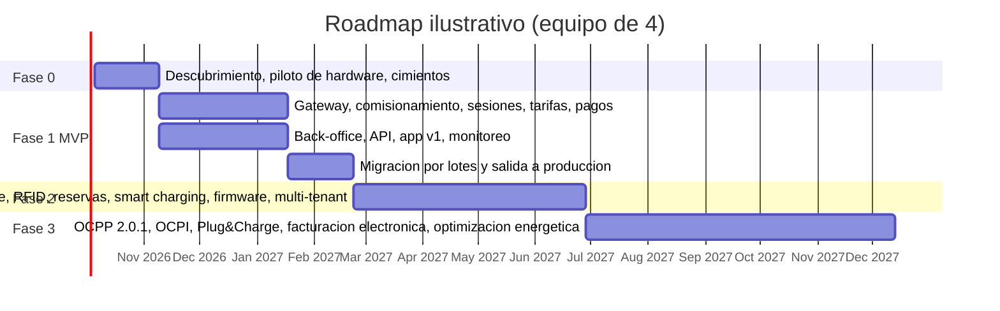

# Plan de trabajo: CSMS Volt Platform

Estado al 19 de septiembre de 2026: **semana 0**. El repositorio contiene el diseño completo (`docs/`) y este plan. No hay código todavía. Este archivo es el plan vivo del proyecto: se actualiza al cerrar cada fase, al tomar cada decisión y cuando cambie el alcance.

Convenciones: `[ ]` pendiente, `[x]` hecho, `[~]` en curso. Las referencias "HW §3", "ARQ §4.4", etc. apuntan a las secciones de los capítulos en `docs/` (ver `docs/README.md`).

---

## 1. Objetivo

Construir y operar un CSMS propio (Charging Station Management System) que reemplace por completo la nube del proveedor: los cargadores se conectan por OCPP 1.6J directamente a la plataforma, desplegada en Google Cloud, con back-office para el operador, motor de tarifas con precios dinámicos, motor de parámetros configurables por nivel, seguridad de nivel productivo, y una app de conductor separada que consume la API pública.

## 2. Qué se hizo hasta ahora

- [x] Análisis del documento del proveedor ("API OCPP 1.6 V1.0"): es la API de su nube para operadores terceros, no OCPP; se rescata solo como referencia de dominio y evidencia sobre el hardware (capítulo 1).
- [x] Decisión de arquitectura: CSMS propio con OCPP directo; la app y el CSMS son componentes distintos del mismo sistema (capítulo 2).
- [x] Diseño completo en siete capítulos, revisado técnicamente con verificación de fuentes (99 correcciones registradas en `docs/anexo-a-registro-revision.md`).
- [x] Modelo de datos con DDL validado en PostgreSQL 16 (`docs/sql/ddl_local.sql`).
- [x] Lista de requisitos para el proveedor sobre hardware y traspaso (resumen ejecutivo §8; detalle en HW §3, FUN §10.2, SEG §9, OPS §9.2).
- [x] Roadmap por fases con criterios de aceptación (OPS §6) y decisiones pendientes con recomendación (OPS §5).

## 3. Decisiones bloqueantes (dueño del proyecto)

Sin la primera no se puede fijar región, moneda, impuestos ni facturación. Marcar cada una al decidir y registrar la decisión como ADR en `docs/adr/`.

| # | Decisión | Recomendación del diseño | Estado |
|---|---|---|---|
| D1 | País o países de operación (moneda, impuestos, facturación electrónica, regulación de medición y de precios, ley de datos, región de Google Cloud) | Un solo país en el MVP; todo lo específico del país como parámetro de tenant | [x] **Colombia** (19-09-2026, ADR 0001). Implicaciones en la sección 3.1 |
| D2 | Pasarela de pago | Debe soportar pre-autorización con captura parcial y tokenización; Stripe si opera en el país, si no la mejor opción local; detrás de un puerto `PaymentGateway` | [ ] |
| D3 | Modelo de negocio del MVP | Pospago con tarjeta y pago ad hoc por QR sin registro; wallet y membresías en fase 2; flotas cuando haya cliente | [ ] |
| D4 | Versión OCPP objetivo | 1.6J en producción, dominio modelado a 2.0.1, gateway 2.0.1 en fase 3 | [ ] |
| D5 | Multi-operador | En el modelo de datos desde el día uno; en la interfaz en fase 2 | [ ] |
| D6 | Equipo y presupuesto | 4 personas núcleo más 0,5 de QA y laboratorio | [ ] |
| D7 | Hardware existente vs nuevo | Piloto en la semana 1; migrar lo migrable, negociar o sustituir el resto; compras nuevas con certificación OCA | [ ] |
| D8 | Perfil de seguridad objetivo | 2 desde el inicio, 3 en fase 2 | [ ] |
| D9 | Idiomas, marca y política de retención de datos | Español primero con i18n; mediciones 90 días en caliente y 2 años en BigQuery; auditoría 13 meses o más | [ ] |

### 3.1 Implicaciones de operar en Colombia (D1 decidida)

Parámetros de tenant y consecuencias de diseño que fija la decisión. Lo marcado "(a confirmar)" requiere confirmación con el contador, el asesor legal o la lectura del texto normativo completo.

| Tema | Implicación |
|---|---|
| Moneda, zona horaria, idioma | COP; en la práctica los precios y cobros se redondean a pesos enteros (política de redondeo del tenant: unidad = 1 peso, a confirmar si se prefiere múltiplo de 50 o 100). Zona horaria `America/Bogota` (UTC-5, sin horario de verano). Español. |
| Impuestos | IVA general del 19 %. La carga de vehículos se considera "servicio de carga" y no servicio público domiciliario de energía, por lo que el tratamiento de IVA del servicio, las retenciones (renta, IVA, ICA) y el régimen del operador deben confirmarse con el contador antes de fijar la tarifa (a confirmar). |
| Facturación electrónica DIAN | Toda venta debe soportarse con factura electrónica de venta o documento equivalente electrónico, emitidos a través de un proveedor tecnológico habilitado o de la solución gratuita de la DIAN. Para Colombia esto no puede esperar a la fase 3: **pasa al MVP** como emisión automática por sesión (o consolidada, según lo que defina el contador) mediante un adaptador `billing` hacia el proveedor tecnológico elegido (a confirmar el documento aplicable y el proveedor). |
| Regulación sectorial | Resolución MME 40123 de 2024: interoperabilidad de estaciones de acceso público; conexión al sistema de gestión mediante OCPP en su última versión estable (o norma ISO/IEC/Icontec equivalente); precios de carga, estacionamiento y otros costos informados de forma clara, previa, desagregada y visible; acceso y pago sin restricciones, es decir, **pago ad hoc sin membresía obligatorio**. Resolución 40117 de 2024 (RETIE) para las instalaciones. Resolución 40559 de 21-11-2025: lineamientos de interoperabilidad para el reporte, gestión y consulta de la información de las estaciones de acceso público, conectores Tipo 2 y CCS2, habilita OCPI 2.2.1 y añade lineamientos de seguridad de la información y trazabilidad de los datos de consumo. Resolución 40334 de 2026: conexión simplificada a la red; la CREG define el acceso de los operadores y prepara una resolución de movilidad eléctrica para 2027. |
| Reporte de información al Estado | La Resolución 40559 de 2025 puede exigir reportar información operativa de las estaciones (estado, disponibilidad, consumos) mediante OCPI 2.2.1 a una plataforma designada. Hay que leer el texto completo para fijar qué datos, a quién, con qué frecuencia y desde cuándo (a confirmar). Si aplica, el módulo OCPI de la fase 3 se adelanta a la fase 2 al menos para `Locations`, `Tariffs` y `Sessions`/`CDRs`. |
| Datos personales | Ley 1581 de 2012 y Decreto 1377 de 2013 (SIC): política de tratamiento de datos, autorización previa del titular en la app, canales para derechos de los titulares, inscripción en el Registro Nacional de Bases de Datos si aplica por tamaño de la empresa. Al alojar en una región de Google Cloud fuera de Colombia hay transferencia internacional: verificar nivel adecuado de protección del país destino según la circular vigente de la SIC o recabar autorización expresa (a confirmar con el asesor legal). |
| Región de Google Cloud | No existe región en Colombia (Google construye un centro de datos en Yumbo, Valle del Cauca, sin fecha de región). Recomendada `us-east1` como región principal, con `northamerica-south1` (Querétaro) y `southamerica-west1` (Santiago) como alternativas; medir latencia desde Bogotá antes de fijarla. Para OCPP la latencia es irrelevante; importa para la app. |
| Pasarela de pago | Candidatas con preautorización y captura parcial: PayU (flujo de dos pasos, autorización y captura, disponible bajo solicitud al ejecutivo comercial; captura parcial soportada) y Mercado Pago (reserva con `capture=false` y captura por un monto menor; confirmar disponibilidad en Colombia). Wompi, PlacetoPay y ePayco: confirmar soporte de preautorización. PSE, Nequi y Daviplata no soportan preautorización, pero son los medios más usados: sirven para recargar un wallet prepago, lo que hace recomendable adelantar el wallet a la fase 1 o al inicio de la fase 2. |
| Conectores y medición | Tipo 2 (AC) y CCS2 (DC) son los conectores estandarizados; alinear el inventario y las compras. Requisitos de trazabilidad de la información de consumo según la Resolución 40559 (a confirmar si exige medidor certificado o valores firmados). |

## 4. Próximas dos semanas (acciones inmediatas)

1. [ ] Enviar al proveedor, por escrito y con plazo, la lista de requisitos de hardware y traspaso (resumen ejecutivo §8; detalle HW §3). Pedir respuesta por modelo y versión de firmware.
2. [ ] Conseguir un cargador real para laboratorio (idealmente uno por modelo) y una red propia donde capturar a qué URL habla hoy.
3. [ ] Tomar D2 (pasarela): pedir a PayU la activación del flujo de dos pasos y confirmar con Mercado Pago la reserva de fondos en Colombia; abrir cuenta de pruebas en la elegida.
3b. [ ] Sesión con el contador: tratamiento de IVA del servicio de carga, retenciones, documento electrónico aplicable (factura electrónica o documento equivalente) y proveedor tecnológico DIAN.
3c. [ ] Leer el texto completo de las Resoluciones 40123 de 2024 y 40559 de 2025 y fijar las obligaciones concretas de precios visibles, acceso sin membresía y reporte de información (qué, a quién, cuándo).
4. [ ] Conformar el equipo (D6): backend senior TypeScript que lidera, backend/full-stack, móvil, DevOps/SRE, media persona de QA.
5. [ ] Crear la organización y los tres proyectos de Google Cloud (dev, staging, prod) con facturación, presupuestos y alertas; definir el dominio (`ocpp.`, `api.`, `admin.`).
6. [ ] Inicializar el monorepo según ARQ §6.1 (`apps/ocpp-gateway`, `apps/api`, `apps/worker`, `apps/backoffice`, `apps/mobile`, `packages/*`, `infra/terraform`, `docs/adr`) con lint, tests y CI en GitHub Actions.
7. [ ] Levantar un CSMS de referencia (SteVe o CitrineOS) y dos simuladores de cargador (por ejemplo, SAP e-mobility-charging-stations-simulator y MicroOcpp) para el laboratorio (HW §4.2).
8. [ ] Escribir los ADR 0001 a 0006 (ARQ §8.1): gateway en GKE, monolito modular, stack TypeScript, PostgreSQL, modelo de tarifas OCPI, perfil de seguridad.

## 5. Fase 0: descubrimiento y cimientos (4 a 6 semanas)

| Entregable | Criterio de aceptación | Estado |
|---|---|---|
| Requisitos al proveedor respondidos y cada modelo clasificado A (editable por nosotros), B (editable con ayuda del proveedor) o C (bloqueado) | Respuesta escrita; clasificación por modelo en el inventario (HW §4.1) | [ ] |
| Piloto de hardware: un cargador real en laboratorio apuntado por `wss://` con perfil de seguridad 2 a un CSMS de referencia o al gateway embrionario | `BootNotification` aceptado, sesión completa, `GetConfiguration` completo archivado, handshake TLS probado contra la política SSL prevista | [ ] |
| Decisiones D1 a D9 tomadas y documentadas como ADR | Firmadas por el dueño del proyecto | [ ] |
| Diseño de dominio en código: tipos, máquinas de estado (sesión, cargador, comando), contratos (OpenAPI v1 borrador, eventos, gRPC interno) | `packages/domain` con tests de máquinas de estado en verde | [ ] |
| Repositorio y CI/CD: monorepo, GitHub Actions con Workload Identity Federation, lint, test, build, contract tests OCPP contra los esquemas 1.6 | PR verde en menos de 10 minutos | [ ] |
| Terraform de dev y staging: proyectos, VPC, Cloud SQL privada con PITR, Redis, Pub/Sub, balanceador con Cloud Armor y Certificate Manager, GKE Autopilot en staging, Cloud Run, IAM, presupuestos y alertas | `terraform apply` reproducible; el endpoint OCPP de staging rechaza un `chargeBoxId` desconocido | [ ] |
| Seguridad base (SEG §8, prioridad P0): allowlist de cargadores, Basic Auth con hash, TLS 1.2 mínimo con política SSL propia, Secret Manager, sin claves de cuentas de servicio, Cloud Audit Logs exportados, MFA en back-office | Checklist "antes del primer cargador" completa | [ ] |
| Observabilidad base: logs JSON correlacionados, métricas del gateway, dashboard "Gateway", alerta de OFFLINE | Visible en Cloud Monitoring con el simulador | [ ] |

## 6. Fase 1: MVP (14 a 18 semanas)

| Entregable | Criterio de aceptación | Estado |
|---|---|---|
| Gateway OCPP 1.6J Core + Remote Trigger (+ Firmware Management mínimo): `ocpp-rpc`, perfil 2, validación de esquema, registro en Redis, gRPC interno, drenado, `BootNotification` `Pending`/`Accepted`, todos los mensajes Core | Suite abierta tipo OCTT (tzi-OCTT u open-ocpp-tck) Core en verde; 1.000 conexiones en staging; prueba de caos "matar pod" superada | [ ] |
| Inventario y comisionamiento: ciclo de vida del cargador, plantillas de configuración por modelo, `GetConfiguration`/`ChangeConfiguration`, detección de deriva, checklist | Un cargador real pasa de inventariado a operativo en menos de 30 minutos desde el back-office | [ ] |
| Sesiones: inicio y parada remotos, `StartTransaction`/`StopTransaction`, `MeterValues`, transacciones offline y reconciliación, sesiones huérfanas, idempotencia, propiedad de la transacción por cargador | Casos de uso CU-02, CU-04 y CU-05 automatizados; corte de red de 10 minutos sin duplicados | [ ] |
| Tarifas por franja con snapshot inmutable sobre el modelo OCPI, cotización previa, cálculo incremental | Reproduce el ejemplo del proveedor (franjas 09:00-14:00 y 14:00-20:00 con precio por defecto) y el ejemplo calculado de TAR §6; pruebas de propiedad en verde | [ ] |
| Pagos: pre-autorización, captura por importe real, liberación, reembolso, webhooks firmados, conciliación diaria, recibo | Flujo completo con la pasarela en modo de pruebas; cero discrepancias de liquidación en 100 sesiones simuladas | [ ] |
| Back-office básico: mapa y lista con estado en vivo, cargadores, sesiones, comandos remotos, tarifas, alarmas, parámetros con herencia, usuarios y roles con MFA, auditoría, bitácora por cargador | Roles administrador, operaciones, soporte y lectura; todo comando auditado | [ ] |
| API `/v1` y app v1: OIDC con Identity Platform, idempotencia, SSE; mapa, precio visible antes de cargar, QR, inicio y parada, progreso en vivo, historial y recibos, métodos de pago, push | Un conductor real completa una carga y recibe el recibo; builds publicados en TestFlight e Internal testing | [ ] |
| Monitoreo y alarmas: métricas, alarmas de offline, `Faulted`, bucle de arranque, sesión huérfana y pagos, SLOs, dashboards, guardia, cargador sintético | Alarmas en menos de 1 minuto; SLOs con burn-rate configurados | [ ] |
| Migración y salida a producción: lote piloto de una semana, lotes de 10 a 20 % del parque, rollback probado | 100 % de los ítems críticos de la checklist HW §4.3 por lote; 48 horas sin incidencias; conciliación con la última liquidación del proveedor | [ ] |
| Facturación electrónica DIAN (Colombia): emisión automática del documento electrónico por sesión o consolidado mediante proveedor tecnológico, con notas crédito para reembolsos | Documento válido ante la DIAN por cada cobro en 100 sesiones de prueba; el contador valida el tipo de documento | [ ] |
| Cumplimiento de la Resolución 40123 de 2024: precios de carga, ocupación y otros costos visibles y desagregados en la app y en el QR antes de iniciar; pago ad hoc sin registro | Revisión de cumplimiento documentada antes de la salida a producción | [ ] |

Criterio de salida del MVP: todos los cargadores migrables operan y cobran en la plataforma propia, con disponibilidad del gateway igual o superior al 99,9 % durante 30 días y tasa de éxito de inicio remoto igual o superior al 90 %.

## 7. Fase 2: crecimiento (16 a 20 semanas)

| Entregable | Criterio de aceptación | Estado |
|---|---|---|
| Precios dinámicos por ocupación, energía y horario: reglas declarativas, publicación anticipada, simulador de tarifas | Una regla del tipo "ocupación mayor al 80 % suma 20 %" se evalúa al inicio y se congela; auditoría de cada publicación; la app muestra el precio antes de iniciar | [ ] |
| Idle fee con gracia, tope y avisos push | Cobro correcto en `SuspendedEV` y tras `StopTransaction`; cero reclamaciones por idle no avisado en el piloto | [ ] |
| RFID, Local Auth List y Authorization Cache | Carga offline con tarjeta de la lista; bloqueo de tarjeta propagado en menos de 5 minutos | [ ] |
| Reservas | Estado `Reserved` visible en la app; no presentación cobrada según política | [ ] |
| Smart charging básico: límite estático por sede y balanceo simple | La suma de potencia de una sede nunca supera su límite en pruebas con simulador; la corriente ofrecida baja al límite en un cargador real | [ ] |
| Firmware y diagnósticos gestionados (canary, ventanas, firma si el hardware lo soporta) | Actualización de un lote de 10 sin sesiones interrumpidas; rollback documentado | [ ] |
| Reportes y analítica en BigQuery | Informe mensual automático por sede; dashboard de calidad por modelo | [ ] |
| Multi-tenant en interfaz, wallet y membresías | Un segundo operador opera sus sedes sin ver datos del primero | [ ] |
| Tickets, auto-remediación y perfil de seguridad 3 con PKI propia | MTTR de incidentes P2 menor a 4 horas; al menos un modelo en perfil 3 en producción | [ ] |
| Reporte de información a la plataforma nacional según la Resolución 40559 de 2025 vía OCPI 2.2.1 (`Locations`, `Tariffs`, `Sessions`, `CDRs`), si el texto normativo lo exige (a confirmar) | Reporte aceptado por la plataforma designada dentro del plazo normativo | [ ] |

## 8. Fase 3: interoperabilidad (20 a 28 semanas)

| Entregable | Criterio de aceptación | Estado |
|---|---|---|
| Gateway OCPP 2.0.1 conviviendo con 1.6J | Un cargador 2.0.1 real completa comisionamiento y sesión; suite Core 2.0.1 en verde | [ ] |
| Roaming OCPI 2.2.1 o 2.3.0 con un partner o hub | Roaming real con al menos un partner; CDRs conciliados | [ ] |
| Plug&Charge | Sesión en laboratorio con certificados de contrato gestionados | [ ] |
| Exportación contable y conciliación fiscal (la facturación electrónica DIAN ya se entrega en la fase 1) | Cierre contable mensual automatizado y auditable | [ ] |
| Optimización energética: balanceo dinámico, tarifas de red, señales externas | Reducción medible del pico de potencia en una sede piloto | [ ] |
| Certificación OCA del CSMS, si el negocio lo exige | Certificado 1.6 Core o 2.0.1 Core | [ ] |

Duración total estimada: 54 a 72 semanas (12 a 17 meses) con un equipo de 4 personas; el MVP entra en producción entre la semana 18 y la 24. Con 3 personas el plan se alarga alrededor de un 40 %.

## 9. Plan de traspaso de los cargadores (resumen de HW §4)

1. [ ] Inventario: una fila por cargador (fabricante, modelo, serie, firmware, perfil de seguridad actual, conectividad, SIM y APN, sede, conectores, método para cambiar la URL, credenciales de administrador) y clasificación A, B o C.
2. [ ] Laboratorio (2 a 3 semanas): primero simuladores contra el gateway propio; luego un cargador real por modelo en banco, capturando a qué URL habla hoy y practicando el cambio de URL con el mecanismo del fabricante, en el orden `ws://` de laboratorio, `wss://` con perfil 2, perfil 3 si aplica.
3. [ ] Onboarding en `Pending`: el CSMS normaliza las configuration keys (tabla HW §4.2) antes de responder `Accepted`.
4. [ ] Checklist de aceptación por cargador (HW §4.3): conexión, registro, latido, configuración, estado, autorización, arranque remoto, telemetría, parada, reset, desbloqueo, diagnósticos, firmware; cada ítem con evidencia.
5. [ ] Migración por lotes de 10 a 20 % del parque en ventana de mantenimiento, con rollback a la URL del proveedor probado antes del primer lote.
6. [ ] Cierre con el proveedor: exportación de las transacciones históricas, baja de los equipos en su nube y borrado de credenciales.
7. [ ] Cargadores clase C: negociación escrita con plazo o presupuesto de sustitución por modelos certificados OCA.

## 10. Equipo y roles

| Rol | Responsabilidad | Dedicación |
|---|---|---|
| Backend senior TypeScript (lidera) | Gateway OCPP, dominio transaccional, decisiones técnicas, ADR | 100 % |
| Backend / full-stack | API, back-office, motor de tarifas, pagos | 100 % |
| Móvil (React Native) | App del conductor, QA de app | 100 % |
| DevOps / SRE | Terraform, GKE, Cloud Run, observabilidad, seguridad de infraestructura, guardia | 100 % |
| QA y laboratorio | Cargadores reales, matriz de conformidad por modelo, runbooks, soporte técnico | 50 % |
| Dueño del proyecto | Decisiones D1 a D9, relación con el proveedor, prioridades, aceptación de fases | Según necesidad |

## 11. Riesgos principales

| Riesgo | Mitigación |
|---|---|
| Firmware atado a la nube del fabricante (URL no editable, CA fijada, SIM con APN privado) | Piloto en la semana 1; clasificación A/B/C; negociación escrita o sustitución presupuestada |
| Cargadores antiguos que solo negocian suites TLS `TLS_RSA_*` y no conectan con la política SSL del balanceador | Probar el handshake con la unidad piloto; política SSL CUSTOM solo para el host OCPP si hace falta |
| Subestimar el dominio transaccional (offline, duplicados, huérfanas, conciliación con pagos) | Diseño ya definido en DAT §5 y TAR §3; pruebas automatizadas de los casos difíciles desde la fase 0 |
| Cortes diarios de WebSocket por el balanceador (24 horas) interpretados como incidentes | Reconexión diaria tratada como rutina en métricas y alarmas; ping y timeout del backend configurados |
| Falsas alarmas de OFFLINE por basarse solo en `Heartbeat` | Detección basada en cualquier mensaje recibido |
| Pasarela sin pre-autorización con captura parcial | Requisito eliminatorio en la elección (D2) |
| Costos de Google Cloud por encima de lo estimado | Presupuestos y alertas desde la fase 0; recalcular con la calculadora oficial; revisar Cloud SQL y logs, que dominan el costo |
| Dependencia de terceros en fase 3 (partners OCPI, hardware 2.0.1, proveedor de facturación electrónica) | Planificar con holgura; iniciar conversaciones en fase 2 |
| Obligaciones regulatorias colombianas con plazo (OCPP obligatorio, precios visibles y desagregados, acceso sin membresía, reporte de información según la Resolución 40559 de 2025) | Leer los textos completos en la fase 0; matriz de cumplimiento revisada antes de la salida a producción; OCPI adelantado a la fase 2 si el reporte lo exige |
| Tratamiento tributario y documento electrónico mal definidos (IVA, retenciones, factura vs documento equivalente) | Sesión con el contador en las primeras dos semanas; el motor de tarifas parametriza impuestos y redondeo por tenant |

## 12. Métricas de éxito del MVP (primeros 90 días en producción)

- Disponibilidad del gateway igual o superior al 99,9 %, medida con el cargador sintético.
- Tasa de éxito de inicio remoto igual o superior al 90 %; respuesta del inicio remoto p95 por debajo de 5 segundos.
- Cambio de estado del conector reflejado en la app en menos de 3 segundos; liquidación en menos de 60 segundos tras `StopTransaction`.
- Cero discrepancias de liquidación entre el motor de tarifas y la pasarela en la conciliación diaria.
- 100 % de los cargadores migrables operando sin la nube del proveedor.
- Ninguna alarma P1 sin runbook; MTTR de P1 por debajo de 1 hora.

## 13. Cómo mantener este plan

- Al tomar una decisión: marcarla en la sección 3 y crear el ADR en `docs/adr/NNNN-titulo.md`.
- Al cerrar un entregable: marcar la casilla y anotar la fecha y la evidencia (PR, dashboard, acta).
- Al cerrar una fase: actualizar la línea de estado al inicio de este archivo y revisar duraciones y riesgos de la fase siguiente.
- Si cambia el alcance, la versión OCPP objetivo o el hardware, actualizar también el resumen ejecutivo (`docs/00-resumen-ejecutivo.md`) y el capítulo afectado.
