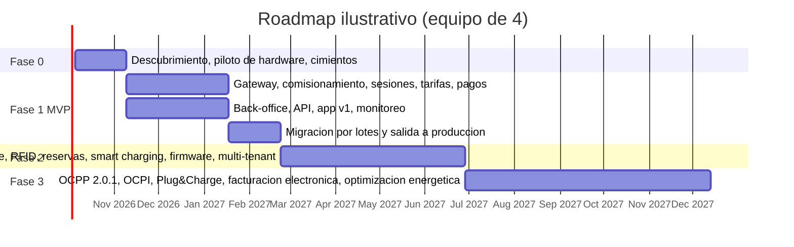

# Plan de trabajo: CSMS Volt Platform

Estado al 19 de septiembre de 2026: **semana 0**. El repositorio contiene el diseño completo (`docs/`) y este plan. No hay código todavía. Este archivo es el plan vivo del proyecto: se actualiza al cerrar cada fase, al tomar cada decisión y cuando cambie el alcance.

Convenciones: `[ ]` pendiente, `[x]` hecho, `[~]` en curso. Las referencias "HW §3", "ARQ §4.4", etc. apuntan a las secciones de los capítulos en `docs/` (ver `docs/README.md`).

---

## 1. Objetivo

Construir y operar un CSMS propio (Charging Station Management System) que reemplace por completo la nube del proveedor: los cargadores se conectan por OCPP 1.6J directamente a la plataforma, desplegada en Google Cloud, con back-office para el operador, motor de tarifas con precios dinámicos, motor de parámetros configurables por nivel, seguridad de nivel productivo, y una app de conductor separada que consume la API pública.

## 2. Qué se hizo hasta ahora

- [x] Análisis del documento del proveedor ("API OCPP 1.6 V1.0"): es la API de su nube para operadores terceros, no OCPP; se rescata solo como referencia de dominio y evidencia sobre el hardware (capítulo 1).
- [x] Decisión de arquitectura: CSMS propio con OCPP directo; la app y el CSMS son componentes distintos del mismo sistema (capítulo 2).
- [x] Diseño completo en siete capítulos, revisado técnicamente con verificación de fuentes (99 correcciones registradas en `docs/anexo-a-registro-revision.md`).
- [x] Modelo de datos con DDL validado en PostgreSQL 16 (`docs/sql/ddl_local.sql`).
- [x] Lista de requisitos para el proveedor sobre hardware y traspaso (resumen ejecutivo §8; detalle en HW §3, FUN §10.2, SEG §9, OPS §9.2).
- [x] Roadmap por fases con criterios de aceptación (OPS §6) y decisiones pendientes con recomendación (OPS §5).

## 3. Decisiones bloqueantes (dueño del proyecto)

Sin la primera no se puede fijar región, moneda, impuestos ni facturación. Marcar cada una al decidir y registrar la decisión como ADR en `docs/adr/`.

| # | Decisión | Recomendación del diseño | Estado |
|---|---|---|---|
| D1 | País o países de operación (moneda, impuestos, facturación electrónica, regulación de medición y de precios, ley de datos, región de Google Cloud) | Un solo país en el MVP; todo lo específico del país como parámetro de tenant | [x] **Colombia** (19-09-2026, ADR 0001). Implicaciones en la sección 3.1 |
| D2 | Pasarela de pago | Debe soportar tokenización; detrás de un puerto `PaymentGateway` | [x] **Wompi con tokenización** (ADR 0002): cobro al final de la carga contra la tarjeta registrada; validación de tarjeta válida antes de iniciar; límite de exposición por sesión en lugar de preautorización; deuda bloquea nuevas cargas |
| D3 | Modelo de negocio del MVP | Pospago con tarjeta registrada; pago ad hoc sin registro solo si la lectura legal de la Resolución 40123 lo exige | [x] **Pospago con tarjeta tokenizada en Wompi, cuenta obligatoria** (ADR 0002). Pendiente: confirmación legal sobre el registro obligatorio; wallet y membresías como opción de fase 2 |
| D4 | Versión OCPP objetivo | 1.6J en producción, dominio modelado a 2.0.1, gateway 2.0.1 en fase 3 | [x] **1.6J** (los equipos vienen con 1.6J; ADR 0003). Pendiente: lectura legal de "última versión estable" en la Resolución 40123 |
| D5 | Multi-operador | En el modelo de datos desde el día uno; propietarios de sede con acceso de lectura en fase 2 | [x] **Operador único; propietarios de sede con acceso de solo lectura en fase 2** (ADR 0004) |
| D6 | Equipo y presupuesto | Desarrollo por iteraciones con criterios de aceptación | [x] **Claude Code desarrolla; el dueño del proyecto decide, acepta y opera** (ADR 0006); roles humanos mínimos de operación y campo al crecer |
| D7 | Hardware existente vs nuevo | Piloto en la semana 1; compras nuevas con certificación OCA | [x] **Equipos nuevos: 3 estaciones DC 180 kW de dos mangueras al inicio, 30 en el primer año, 40 kW de dos mangueras pronto; hay cargador para laboratorio; sin operación previa que migrar** (ADR 0003) |
| D8 | Perfil de seguridad objetivo | 2 desde el inicio, 3 en fase 2 | [x] **2 desde el inicio, 3 en fase 2** (ADR 0003) |
| D9 | Idiomas, marca y política de retención de datos | Español primero con i18n; retención definida por clase de dato | [x] **App "Volt"; español principal e inglés disponible; se conservan todos los datos operativos, datos personales según política de la Ley 1581; región us-east1** (ADR 0005) |
| D10 | Registro como prestador del servicio de carga y reporte regulatorio | Registrarse antes de la salida a producción | [ ] Pospuesto por el dueño del proyecto; se retoma en la fase 1 |
| D11 | Proveedor tecnológico de facturación electrónica DIAN | Elegir uno con API (por ejemplo Siigo, Alegra, Factus, Dataico o similar) junto con el contador | [ ] Hay contador y empresa registrada; proveedor pendiente |

### 3.1 Implicaciones de operar en Colombia (D1 decidida)

Parámetros de tenant y consecuencias de diseño que fija la decisión. Lo marcado "(a confirmar)" requiere confirmación con el contador, el asesor legal o la lectura del texto normativo completo.

| Tema | Implicación |
|---|---|
| Moneda, zona horaria, idioma | COP; en la práctica los precios y cobros se redondean a pesos enteros (política de redondeo del tenant: unidad = 1 peso, a confirmar si se prefiere múltiplo de 50 o 100). Zona horaria `America/Bogota` (UTC-5, sin horario de verano). Español. |
| Impuestos | IVA general del 19 %. La carga de vehículos se considera "servicio de carga" y no servicio público domiciliario de energía, por lo que el tratamiento de IVA del servicio, las retenciones (renta, IVA, ICA) y el régimen del operador deben confirmarse con el contador antes de fijar la tarifa (a confirmar). |
| Facturación electrónica DIAN | Toda venta debe soportarse con factura electrónica de venta o documento equivalente electrónico, emitidos a través de un proveedor tecnológico habilitado o de la solución gratuita de la DIAN. Para Colombia esto no puede esperar a la fase 3: **pasa al MVP** como emisión automática por sesión (o consolidada, según lo que defina el contador) mediante un adaptador `billing` hacia el proveedor tecnológico elegido (a confirmar el documento aplicable y el proveedor). |
| Regulación sectorial | Resolución MME 40123 de 2024: interoperabilidad de estaciones de acceso público; conexión al sistema de gestión mediante OCPP en su última versión estable (o norma ISO/IEC/Icontec equivalente); precios de carga, estacionamiento y otros costos informados de forma clara, previa, desagregada y visible; acceso y pago sin restricciones, es decir, **pago ad hoc sin membresía obligatorio**. Resolución 40117 de 2024 (RETIE) para las instalaciones. Resolución 40559 de 21-11-2025: lineamientos de interoperabilidad para el reporte, gestión y consulta de la información de las estaciones de acceso público, conectores Tipo 2 y CCS2, habilita OCPI 2.2.1 y añade lineamientos de seguridad de la información y trazabilidad de los datos de consumo. Resolución 40334 de 2026: conexión simplificada a la red; la CREG define el acceso de los operadores y prepara una resolución de movilidad eléctrica para 2027. |
| Reporte de información al Estado | La Resolución 40559 de 2025 puede exigir reportar información operativa de las estaciones (estado, disponibilidad, consumos) mediante OCPI 2.2.1 a una plataforma designada. Hay que leer el texto completo para fijar qué datos, a quién, con qué frecuencia y desde cuándo (a confirmar). Si aplica, el módulo OCPI de la fase 3 se adelanta a la fase 2 al menos para `Locations`, `Tariffs` y `Sessions`/`CDRs`. |
| Datos personales | Ley 1581 de 2012 y Decreto 1377 de 2013 (SIC): política de tratamiento de datos, autorización previa del titular en la app, canales para derechos de los titulares, inscripción en el Registro Nacional de Bases de Datos si aplica por tamaño de la empresa. Al alojar en una región de Google Cloud fuera de Colombia hay transferencia internacional: verificar nivel adecuado de protección del país destino según la circular vigente de la SIC o recabar autorización expresa (a confirmar con el asesor legal). |
| Región de Google Cloud | No existe región en Colombia (Google construye un centro de datos en Yumbo, Valle del Cauca, sin fecha de región). Recomendada `us-east1` como región principal, con `northamerica-south1` (Querétaro) y `southamerica-west1` (Santiago) como alternativas; medir latencia desde Bogotá antes de fijarla. Para OCPP la latencia es irrelevante; importa para la app. |
| Pasarela de pago | Decidido: Wompi con tokenización (ADR 0002). Fuentes de pago con tarjeta (3D Secure inicial) y, más adelante, Nequi; cobro al final de la carga; sin preautorización, por lo que el riesgo se acota con el límite de exposición por sesión; webhooks verificados con el secreto de eventos; sandbox con llaves de prueba. PSE y Nequi por checkout web para pagar deudas. |
| Conectores y medición | Tipo 2 (AC) y CCS2 (DC) son los conectores estandarizados; alinear el inventario y las compras. Requisitos de trazabilidad de la información de consumo según la Resolución 40559 (a confirmar si exige medidor certificado o valores firmados). |

## 4. Próximas dos semanas (acciones inmediatas)

Del dueño del proyecto:

1. [ ] Enviar al proveedor de cargadores, por escrito y con plazo, la lista de requisitos (resumen ejecutivo §8; detalle HW §3) para los modelos de 180 kW y 40 kW: cambio de URL, identidad y credenciales; perfiles de seguridad 2 y 3 y suites TLS; measurands DC y `SoC`; reparto de potencia entre mangueras; `SetChargingProfile`; `DataTransfer` propietarios; firmware.
2. [ ] Instalar el cargador de pruebas en el laboratorio con red propia y acceso remoto, y compartir manuales y credenciales de administrador.
3. [ ] Wompi: abrir la cuenta de comercio, activar el sandbox y entregar (por canal seguro, nunca por chat ni en el repositorio) las llaves de prueba, el secreto de integridad y el secreto de eventos; confirmar con Wompi el flujo de tokenización con 3D Secure y cobros posteriores sin presencia del cliente, y las reglas de anulación y reembolso.
4. [ ] Contador: tratamiento de IVA del servicio de carga, retenciones, documento electrónico aplicable por sesión (factura electrónica de venta o documento equivalente) y elección del proveedor tecnológico DIAN con API (D11).
5. [ ] Asesor legal: leer las Resoluciones 40123 de 2024 y 40559 de 2025 y fijar (a) si exigir cuenta y tarjeta registrada cumple "acceso y pago sin restricciones", (b) si OCPP 1.6J cumple "última versión estable", (c) qué información se reporta, a quién y desde cuándo, y (d) la política de tratamiento de datos y la transferencia internacional a la región de Google Cloud.
6. [ ] Crear la organización y los tres proyectos de Google Cloud (dev, staging, prod) con facturación, presupuestos y alertas; comprar o asignar el dominio (`ocpp.`, `api.`, `admin.`); dar acceso a Claude Code mediante Workload Identity Federation desde GitHub Actions, sin claves de cuentas de servicio.
7. [ ] Abrir las cuentas de desarrollador de Apple y Google Play a nombre de la empresa.

De Claude Code (iteración 0, sección 5):

8. [ ] Inicializar el monorepo según ARQ §6.1 con lint, tests, CI en GitHub Actions y estructura de paquetes.
9. [ ] Escribir los ADR técnicos 0007 en adelante (gateway en GKE, monolito modular, stack TypeScript, PostgreSQL, modelo de tarifas OCPI) a partir del capítulo ARQ §8.1.
10. [ ] Preparar el laboratorio de software: dos simuladores de cargador OCPP 1.6J en contenedores y las suites abiertas de pruebas (tzi-OCTT, open-ocpp-tck) para ejecutar en CI contra el gateway.

## 5. Plan de iteraciones de desarrollo (Claude Code)

Cada iteración termina en uno o más pull requests con CI en verde, despliegue automático a dev y una nota de "qué probar" para el dueño del proyecto. Las iteraciones 0 a 4 solo necesitan simuladores; desde la 5 se prueba también con el cargador real en staging. El orden puede cambiar según lleguen las respuestas del proveedor, las llaves de Wompi y el proveedor DIAN.

| # | Iteración | Entrega | Criterio de aceptación | Estado |
|---|---|---|---|---|
| 0 | Cimientos | Monorepo TypeScript (`apps/ocpp-gateway`, `apps/api`, `apps/worker`, `apps/backoffice`, `apps/mobile`, `packages/domain`, `packages/tariff-engine`, `packages/ocpp-schemas`, `packages/events`, `packages/db`, `packages/api-client`, `infra/terraform`), lint, tests, CI, Docker, entorno local con PostgreSQL y Redis, esquemas JSON oficiales de OCPP 1.6 | `pnpm test` y `pnpm lint` en verde en CI; contenedores construyen | [ ] |
| 1 | Gateway OCPP mínimo | WebSocket `wss://…/ocpp/{chargeBoxId}` con subprotocolo `ocpp1.6`, Basic Auth con hash, allowlist, validación de esquema, `BootNotification` (`Pending`/`Accepted`), `Heartbeat`, `StatusNotification`, registro cargador → pod en Redis, ping/pong, logs correlacionados | Dos simuladores distintos se registran y reportan estado; conexión rechazada sin credenciales o con `chargeBoxId` desconocido; suite tzi-OCTT de registro en verde | [ ] |
| 2 | Inventario y comisionamiento | Modelo de datos (DDL de `docs/sql`), API de sedes, estaciones, EVSE y conectores, ciclo de vida del cargador, plantillas de configuración por modelo, `GetConfiguration`/`ChangeConfiguration`, detección de deriva, `TriggerMessage`, `Reset`, `ChangeAvailability`, `UnlockConnector` | Un simulador pasa de inventariado a operativo desde la API; deriva detectada al cambiar una key | [ ] |
| 3 | Sesiones | `RemoteStartTransaction`/`RemoteStopTransaction` por gRPC interno, `StartTransaction`, `StopTransaction`, `MeterValues`, máquinas de estado de conector y sesión, propiedad de la transacción, idempotencia, transacciones offline, outbox y Pub/Sub, SSE de progreso | Casos CU-02, CU-04 y CU-05 automatizados; corte de red simulado de 10 minutos sin duplicados; caída de pod con reconexión | [ ] |
| 4 | Motor de tarifas | Modelo OCPI, tarifas por franja horaria con precio por defecto, cotización previa, snapshot inmutable, cálculo incremental y final, idle fee (calculado, aún sin cobro), límite de exposición con `RemoteStopTransaction`, pruebas de propiedad y el ejemplo de TAR §6 como fixture | Ejemplo calculado reproducido al centavo; propiedades en verde; tope de exposición detiene la sesión en simulador | [ ] |
| 5 | Pagos con Wompi | Puerto `PaymentGateway` y adaptador Wompi: alta de fuente de pago con tokenización y 3DS, validación previa al inicio, cobro al cierre, webhooks con checksum e idempotencia, reintentos y bloqueo por deuda, enlace de pago de deuda, conciliación diaria, recibos; interfaz del adaptador DIAN | Flujo completo en sandbox de Wompi: alta de tarjeta, carga simulada, cobro aprobado, cobro rechazado con reintento y bloqueo, pago de deuda por enlace | [ ] |
| 6 | Back-office | Autenticación con Identity Platform y MFA, RBAC (administrador, operaciones, soporte, lectura; `site_owner` definido), mapa y lista con estado en vivo, cargadores, sesiones, comandos, tarifas y simulador de precio, parámetros por nivel, pagos y deudas, alarmas, auditoría, bitácora por cargador, español e inglés | Todo comando y cambio de tarifa queda auditado; un operador comisiona un cargador en menos de 30 minutos | [ ] |
| 7 | App Volt v1 | React Native/Expo: registro con OIDC, alta de tarjeta con Wompi, mapa y lista con estado en vivo, precio desagregado visible antes de cargar, QR, inicio y parada, progreso en vivo (kWh, potencia, `SoC`, costo acumulado y tope), historial y recibos, deudas y pago, notificaciones push, español e inglés | Una carga completa en staging con el cargador real y el sandbox de Wompi de punta a punta; builds en TestFlight e Internal testing | [ ] |
| 8 | Infraestructura y observabilidad | Terraform de dev, staging y prod (VPC, Cloud SQL con PITR, Redis, Pub/Sub, balanceador con Cloud Armor y política SSL propia, Certificate Manager, GKE Autopilot, Cloud Run, Secret Manager, KMS, presupuestos), despliegue del gateway sin cortes, métricas, alarmas, SLOs, dashboards, cargador sintético, runbooks como código | `terraform apply` reproducible; cargador real conectado por `wss://` con perfil 2 a staging; alarma de offline en menos de 1 minuto | [ ] |
| 9 | Facturación DIAN y salida a producción | Adaptador al proveedor tecnológico elegido, documento electrónico por cobro aprobado, notas crédito, cumplimiento de la Resolución 40123 (precios desagregados y visibles), pruebas de carga con 1.000 conexiones, revisión de seguridad P0 completa, checklist de puesta en marcha por cargador, lote piloto con las 3 estaciones | Documento válido ante la DIAN por cada cobro de prueba; checklist HW §4.3 completa en las 3 estaciones; 48 horas sin incidencias | [ ] |
| 10+ | Fase 2 | Idle fee con cobro, RFID y Local Auth List, reservas, smart charging por sede y por gabinete, firmware, reportes en BigQuery, portal de propietarios de sede con reparto de ingresos, perfil de seguridad 3 con PKI, reporte regulatorio OCPI si aplica, wallet y membresías si el negocio lo pide | Criterios de la sección 7 | [ ] |

## 5b. Fase 0: descubrimiento y cimientos (4 a 6 semanas)

| Entregable | Criterio de aceptación | Estado |
|---|---|---|
| Requisitos al proveedor respondidos y cada modelo clasificado A (editable por nosotros), B (editable con ayuda del proveedor) o C (bloqueado) | Respuesta escrita; clasificación por modelo en el inventario (HW §4.1) | [ ] |
| Piloto de hardware: un cargador real en laboratorio apuntado por `wss://` con perfil de seguridad 2 a un CSMS de referencia o al gateway embrionario | `BootNotification` aceptado, sesión completa, `GetConfiguration` completo archivado, handshake TLS probado contra la política SSL prevista | [ ] |
| Decisiones D1 a D9 tomadas y documentadas como ADR | Firmadas por el dueño del proyecto | [ ] |
| Diseño de dominio en código: tipos, máquinas de estado (sesión, cargador, comando), contratos (OpenAPI v1 borrador, eventos, gRPC interno) | `packages/domain` con tests de máquinas de estado en verde | [ ] |
| Repositorio y CI/CD: monorepo, GitHub Actions con Workload Identity Federation, lint, test, build, contract tests OCPP contra los esquemas 1.6 | PR verde en menos de 10 minutos | [ ] |
| Terraform de dev y staging: proyectos, VPC, Cloud SQL privada con PITR, Redis, Pub/Sub, balanceador con Cloud Armor y Certificate Manager, GKE Autopilot en staging, Cloud Run, IAM, presupuestos y alertas | `terraform apply` reproducible; el endpoint OCPP de staging rechaza un `chargeBoxId` desconocido | [ ] |
| Seguridad base (SEG §8, prioridad P0): allowlist de cargadores, Basic Auth con hash, TLS 1.2 mínimo con política SSL propia, Secret Manager, sin claves de cuentas de servicio, Cloud Audit Logs exportados, MFA en back-office | Checklist "antes del primer cargador" completa | [ ] |
| Observabilidad base: logs JSON correlacionados, métricas del gateway, dashboard "Gateway", alerta de OFFLINE | Visible en Cloud Monitoring con el simulador | [ ] |

## 6. Fase 1: MVP (14 a 18 semanas)

| Entregable | Criterio de aceptación | Estado |
|---|---|---|
| Gateway OCPP 1.6J Core + Remote Trigger (+ Firmware Management mínimo): `ocpp-rpc`, perfil 2, validación de esquema, registro en Redis, gRPC interno, drenado, `BootNotification` `Pending`/`Accepted`, todos los mensajes Core | Suite abierta tipo OCTT (tzi-OCTT u open-ocpp-tck) Core en verde; 1.000 conexiones en staging; prueba de caos "matar pod" superada | [ ] |
| Inventario y comisionamiento: ciclo de vida del cargador, plantillas de configuración por modelo, `GetConfiguration`/`ChangeConfiguration`, detección de deriva, checklist | Un cargador real pasa de inventariado a operativo en menos de 30 minutos desde el back-office | [ ] |
| Sesiones: inicio y parada remotos, `StartTransaction`/`StopTransaction`, `MeterValues`, transacciones offline y reconciliación, sesiones huérfanas, idempotencia, propiedad de la transacción por cargador | Casos de uso CU-02, CU-04 y CU-05 automatizados; corte de red de 10 minutos sin duplicados | [ ] |
| Tarifas por franja con snapshot inmutable sobre el modelo OCPI, cotización previa, cálculo incremental | Reproduce el ejemplo del proveedor (franjas 09:00-14:00 y 14:00-20:00 con precio por defecto) y el ejemplo calculado de TAR §6; pruebas de propiedad en verde | [ ] |
| Pagos con Wompi (ADR 0002): tarjeta tokenizada con 3D Secure, validación previa al inicio, límite de exposición por sesión, cobro al cierre, webhooks con checksum, reintentos y bloqueo por deuda, enlace de pago de deuda, reembolsos, conciliación diaria, recibo | Flujo completo en sandbox de Wompi; cero discrepancias de liquidación en 100 sesiones simuladas; cobros fallidos gestionados sin intervención manual | [ ] |
| Back-office básico: mapa y lista con estado en vivo, cargadores, sesiones, comandos remotos, tarifas, alarmas, parámetros con herencia, usuarios y roles con MFA, auditoría, bitácora por cargador | Roles administrador, operaciones, soporte y lectura; todo comando auditado | [ ] |
| API `/v1` y app v1: OIDC con Identity Platform, idempotencia, SSE; mapa, precio visible antes de cargar, QR, inicio y parada, progreso en vivo, historial y recibos, métodos de pago, push | Un conductor real completa una carga y recibe el recibo; builds publicados en TestFlight e Internal testing | [ ] |
| Monitoreo y alarmas: métricas, alarmas de offline, `Faulted`, bucle de arranque, sesión huérfana y pagos, SLOs, dashboards, guardia, cargador sintético | Alarmas en menos de 1 minuto; SLOs con burn-rate configurados | [ ] |
| Migración y salida a producción: lote piloto de una semana, lotes de 10 a 20 % del parque, rollback probado | 100 % de los ítems críticos de la checklist HW §4.3 por lote; 48 horas sin incidencias; conciliación con la última liquidación del proveedor | [ ] |
| Facturación electrónica DIAN (Colombia): emisión automática del documento electrónico por sesión o consolidado mediante proveedor tecnológico, con notas crédito para reembolsos | Documento válido ante la DIAN por cada cobro en 100 sesiones de prueba; el contador valida el tipo de documento | [ ] |
| Cumplimiento de la Resolución 40123 de 2024: precios de carga, ocupación y otros costos visibles y desagregados en la app y en el QR antes de iniciar; pago ad hoc sin registro | Revisión de cumplimiento documentada antes de la salida a producción | [ ] |

Criterio de salida del MVP: todos los cargadores migrables operan y cobran en la plataforma propia, con disponibilidad del gateway igual o superior al 99,9 % durante 30 días y tasa de éxito de inicio remoto igual o superior al 90 %.

## 7. Fase 2: crecimiento (16 a 20 semanas)

| Entregable | Criterio de aceptación | Estado |
|---|---|---|
| Precios dinámicos por ocupación, energía y horario: reglas declarativas, publicación anticipada, simulador de tarifas | Una regla del tipo "ocupación mayor al 80 % suma 20 %" se evalúa al inicio y se congela; auditoría de cada publicación; la app muestra el precio antes de iniciar | [ ] |
| Idle fee con gracia, tope y avisos push | Cobro correcto en `SuspendedEV` y tras `StopTransaction`; cero reclamaciones por idle no avisado en el piloto | [ ] |
| RFID, Local Auth List y Authorization Cache | Carga offline con tarjeta de la lista; bloqueo de tarjeta propagado en menos de 5 minutos | [ ] |
| Reservas | Estado `Reserved` visible en la app; no presentación cobrada según política | [ ] |
| Smart charging básico: límite estático por sede y balanceo simple | La suma de potencia de una sede nunca supera su límite en pruebas con simulador; la corriente ofrecida baja al límite en un cargador real | [ ] |
| Firmware y diagnósticos gestionados (canary, ventanas, firma si el hardware lo soporta) | Actualización de un lote de 10 sin sesiones interrumpidas; rollback documentado | [ ] |
| Reportes y analítica en BigQuery | Informe mensual automático por sede; dashboard de calidad por modelo | [ ] |
| Portal de propietarios de sede (ADR 0004): rol `site_owner` de solo lectura, estado, sesiones, energía e ingresos de sus sedes, reparto de ingresos y reporte mensual; wallet y membresías si el negocio lo pide | Un propietario ve solo sus sedes; el reporte mensual cuadra con la conciliación de Wompi | [ ] |
| Tickets, auto-remediación y perfil de seguridad 3 con PKI propia | MTTR de incidentes P2 menor a 4 horas; al menos un modelo en perfil 3 en producción | [ ] |
| Reporte de información a la plataforma nacional según la Resolución 40559 de 2025 vía OCPI 2.2.1 (`Locations`, `Tariffs`, `Sessions`, `CDRs`), si el texto normativo lo exige (a confirmar) | Reporte aceptado por la plataforma designada dentro del plazo normativo | [ ] |

## 8. Fase 3: interoperabilidad (20 a 28 semanas)

| Entregable | Criterio de aceptación | Estado |
|---|---|---|
| Gateway OCPP 2.0.1 conviviendo con 1.6J | Un cargador 2.0.1 real completa comisionamiento y sesión; suite Core 2.0.1 en verde | [ ] |
| Roaming OCPI 2.2.1 o 2.3.0 con un partner o hub | Roaming real con al menos un partner; CDRs conciliados | [ ] |
| Plug&Charge | Sesión en laboratorio con certificados de contrato gestionados | [ ] |
| Exportación contable y conciliación fiscal (la facturación electrónica DIAN ya se entrega en la fase 1) | Cierre contable mensual automatizado y auditable | [ ] |
| Optimización energética: balanceo dinámico, tarifas de red, señales externas | Reducción medible del pico de potencia en una sede piloto | [ ] |
| Certificación OCA del CSMS, si el negocio lo exige | Certificado 1.6 Core o 2.0.1 Core | [ ] |

Las duraciones anteriores suponían un equipo de 4 personas. Con el desarrollo a cargo de Claude Code (ADR 0006) el ritmo de código deja de ser el cuello de botella y el calendario lo marcan las dependencias externas: respuesta del proveedor, laboratorio, activación de Wompi, proveedor DIAN, lectura legal, tiendas de apps y la disponibilidad del dueño del proyecto para probar y aceptar. Las fases se mantienen como hitos de negocio; el avance real se sigue por iteraciones (sección 5) y se re-estima al cerrar cada una.

## 9. Plan de puesta en marcha de los cargadores (resumen de HW §4)

Los equipos son nuevos y no hay operación previa que migrar (ADR 0003), pero llegan configurados hacia la nube del fabricante: el procedimiento de HW §4 se aplica como puesta en marcha, sin exportación de historial ni migración de clientes.

1. [ ] Inventario: una fila por cargador (fabricante, modelo, serie, firmware, perfil de seguridad actual, conectividad, SIM y APN, sede, conectores, método para cambiar la URL, credenciales de administrador) y clasificación A, B o C.
2. [ ] Laboratorio (2 a 3 semanas): primero simuladores contra el gateway propio; luego un cargador real por modelo en banco, capturando a qué URL habla hoy y practicando el cambio de URL con el mecanismo del fabricante, en el orden `ws://` de laboratorio, `wss://` con perfil 2, perfil 3 si aplica.
3. [ ] Onboarding en `Pending`: el CSMS normaliza las configuration keys (tabla HW §4.2) antes de responder `Accepted`.
4. [ ] Checklist de aceptación por cargador (HW §4.3): conexión, registro, latido, configuración, estado, autorización, arranque remoto, telemetría, parada, reset, desbloqueo, diagnósticos, firmware; cada ítem con evidencia.
5. [ ] Migración por lotes de 10 a 20 % del parque en ventana de mantenimiento, con rollback a la URL del proveedor probado antes del primer lote.
6. [ ] Cierre con el proveedor: exportación de las transacciones históricas, baja de los equipos en su nube y borrado de credenciales.
7. [ ] Cargadores clase C: negociación escrita con plazo o presupuesto de sustitución por modelos certificados OCA.

## 10. Equipo y roles (ADR 0006)

| Rol | Responsabilidad |
|---|---|
| Claude Code | Desarrollo completo por iteraciones: gateway OCPP, API, worker, back-office, app Volt, Terraform, pruebas, documentación y ADR técnicos; notas de "qué probar" en cada PR |
| Dueño del proyecto | Prioridades y aceptación de cada iteración; pruebas en staging con el cargador real; cuentas y facturación de Google Cloud, Wompi, DIAN, Apple y Google Play; custodia de secretos; contratos y relación con el proveedor, el contador y el asesor legal; trabajo físico en laboratorio y sedes; operación y respuesta a incidentes |
| Operaciones y soporte (a incorporar al crecer) | Guardia, runbooks, atención a conductores, conciliación diaria |
| Mantenimiento en campo (con 30 estaciones) | Visitas, reemplazos, coordinación con el proveedor |

## 11. Riesgos principales

| Riesgo | Mitigación |
|---|---|
| Firmware atado a la nube del fabricante (URL no editable, CA fijada, SIM con APN privado) | Piloto en la semana 1; clasificación A/B/C; negociación escrita o sustitución presupuestada |
| Cargadores antiguos que solo negocian suites TLS `TLS_RSA_*` y no conectan con la política SSL del balanceador | Probar el handshake con la unidad piloto; política SSL CUSTOM solo para el host OCPP si hace falta |
| Subestimar el dominio transaccional (offline, duplicados, huérfanas, conciliación con pagos) | Diseño ya definido en DAT §5 y TAR §3; pruebas automatizadas de los casos difíciles desde la fase 0 |
| Cortes diarios de WebSocket por el balanceador (24 horas) interpretados como incidentes | Reconexión diaria tratada como rutina en métricas y alarmas; ping y timeout del backend configurados |
| Falsas alarmas de OFFLINE por basarse solo en `Heartbeat` | Detección basada en cualquier mensaje recibido |
| Pasarela sin pre-autorización con captura parcial | Requisito eliminatorio en la elección (D2) |
| Costos de Google Cloud por encima de lo estimado | Presupuestos y alertas desde la fase 0; recalcular con la calculadora oficial; revisar Cloud SQL y logs, que dominan el costo |
| Dependencia de terceros en fase 3 (partners OCPI, hardware 2.0.1, proveedor de facturación electrónica) | Planificar con holgura; iniciar conversaciones en fase 2 |
| Obligaciones regulatorias colombianas con plazo (OCPP obligatorio, precios visibles y desagregados, acceso sin membresía, reporte de información según la Resolución 40559 de 2025) | Leer los textos completos en la fase 0; matriz de cumplimiento revisada antes de la salida a producción; OCPI adelantado a la fase 2 si el reporte lo exige |
| Tratamiento tributario y documento electrónico mal definidos (IVA, retenciones, factura vs documento equivalente) | Sesión con el contador en las primeras dos semanas; el motor de tarifas parametriza impuestos y redondeo por tenant |
| Impagos por cobrar al final sin preautorización (ADR 0002) | Límite de exposición por sesión, tope reducido en la primera carga, reintentos, bloqueo por deuda y enlace de pago; métrica de cobros fallidos vigilada desde el MVP |
| Registro obligatorio de cuenta y tarjeta frente al "acceso y pago sin restricciones" de la Resolución 40123 | Confirmación legal en la fase 0; pago de invitado con checkout de Wompi previsto para la fase 2 si se exige |
| Dependencia de una sola persona para operar (dueño del proyecto) | Runbooks como código, auto-remediación, alarmas claras, incorporación de operaciones y soporte antes de superar 10 estaciones |

## 12. Métricas de éxito del MVP (primeros 90 días en producción)

- Disponibilidad del gateway igual o superior al 99,9 %, medida con el cargador sintético.
- Tasa de éxito de inicio remoto igual o superior al 90 %; respuesta del inicio remoto p95 por debajo de 5 segundos.
- Cambio de estado del conector reflejado en la app en menos de 3 segundos; liquidación en menos de 60 segundos tras `StopTransaction`.
- Cero discrepancias de liquidación entre el motor de tarifas y Wompi en la conciliación diaria; cobros fallidos no recuperados en 7 días por debajo del 1 % de las sesiones.
- 100 % de los cargadores migrables operando sin la nube del proveedor.
- Ninguna alarma P1 sin runbook; MTTR de P1 por debajo de 1 hora.

## 13. Cómo mantener este plan

- Al tomar una decisión: marcarla en la sección 3 y crear el ADR en `docs/adr/NNNN-titulo.md`.
- Al cerrar un entregable: marcar la casilla y anotar la fecha y la evidencia (PR, dashboard, acta).
- Al cerrar una fase: actualizar la línea de estado al inicio de este archivo y revisar duraciones y riesgos de la fase siguiente.
- Si cambia el alcance, la versión OCPP objetivo o el hardware, actualizar también el resumen ejecutivo (`docs/00-resumen-ejecutivo.md`) y el capítulo afectado.
